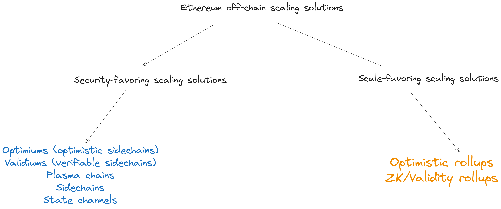

This section outlines some key details and considerations for Ethereum developers and enterprises interested in building applications on optimum protocols and leveraging the scaling benefits of off-chain computation on optimium chains.

## Interoperability: Are optimium chains interoperable with Ethereum? {#optimiums-and-interoperability-with-Ethereum}

Optimiums usually implement a canonical two-way bridge for moving assets and sending messages from and to Ethereum. Applications can integrate with the canonical bridge to implement token bridging and cross-chain messaging functionality. The canonical bridge offers more security than a third-party bridge as the validity of messages routed through the canonical bridge is tightly coupled with the validity of optimium’s state transitions.

Other details about bridging between an optimium chain and Ethereum Mainnet may be important if you are looking to deploy a version of your Ethereum application on an optimium chain:
(1). Messages sent from Ethereum to an optimium (e.g., a bridging transaction that deposits in the canonical bridge and triggers minting of wrapped assets to the user’s off-chain address) are typically executed after a short delay. Imposing a delay on Ethereum → optimium transactions protects against edge-cases from short-term reorgs on Ethereum.
Messages sent in the reverse direction (from an optimium to Ethereum) are subject to a longer delay on execution due to the challenge window requirement—when sent via the optimium’s canonical bridge. Such messages can be executed only after the corresponding block header attesting to the transaction’s execution validity clears the challenge window without a successful challenge.

(2). Developers should avoid basing execution of smart contracts on Ethereum based on bridging transactions (attested by a validator) until the challenge window has passed. If a block is declared invalid by a fraud proof, transactions in the block are re-executed by a validator that asserts a new (valid) state to replace the previous (invalid) state and revert effects of incorrectly executed transactions on the optimium’s state.

(3). Developers can circumvent the latency associated with bridging transactions by running a full node for an optimium chain (or the optimium’s data availability layer) and re-executing transactions from blocks proposed by validators. Confirming a transaction’s result via re-execution provides assurance that the transaction will not be invalidated by a fraud proof during a dispute.

Valid transactions included in a successfully disputed block are not deleted from the chain; another validator will simply re-execute those transactions and post the correct result in a new assertion. An edge-case may occur if a valid transaction is based on the result of an invalid transaction, but this issue should be obvious while re-executing transaction batches.

Running a full node for an optimium can be useful for building applications, such as _fast mode bridges_, designed to help optimium users sidestep the latency imposed on cross-chain transactions by the challenge window. Fast mode bridges allow users to execute cross-chain transactions immediately in exchange for a fee; for example, a fast mode bridge can offer near-instant withdrawals from an optimium chain to Ethereum.

The fast bridge operator first confirms the validity of a user’s exit transaction by re-executing the block, assumes ownership of the pending withdrawal, and credits the user’s address on Ethereum with an amount equal to the value of the user’s withdrawable deposit in the bridge. Once the block header (attesting to the user’s exit transaction) passes the delay window without a dispute, the bridge operator executes the original withdrawal transaction to reimburse funds paid out to the user.

## Compatibility: Are optimiums EVM-compatible? {#optimiums-and-EVM-compatibility}

Like many Ethereum scaling solutions, optimiums are often designed to run programs written or compiled for the EVM (Ethereum Virtual Machine) and prioritize compatibility with Ethereum infrastructure (e.g., wallets, node services, oracles, and block explorers) and developer tooling (e.g., libraries, client software, and development frameworks). Compatibility with the EVM and Ethereum infrastructure crucial benefits for solo developers and project teams:

- Projects can re-deploy Ethereum smart contracts on an optimium chain without having to rewrite extensive portions of the original codebase—saving valuable engineering time when attempting to migrate to an optimium. This also reduces the risk that a bug will surface due to smart contracts behaving differently from the developer’s intention.
- The freedom to (re)use Ethereum infrastructure and tooling preempts the problem of learning to build applications with an unfamiliar development stack. Compatibility with critical infrastructure also reduces the overhead of integrating with third-party services like wallet applications, block explorers, bridges, and more.

Note that EVM-compatibility does not guarantee applications will always work out-of-the-box. Some optimium chains may implement a custom (optimized) version of the EVM for performance reasons, or design a VM that can execute most EVM opcodes but displays subtle differences in internal behavior (e.g., gas accounting). Both of these have implications for smart contract development, so consider reading through each project’s documentation to understand any differences from Ethereum.

## Transaction fees: How do transaction fees work in optimium chains? {#optimiums-and-transaction-fees}

EVM-compatible optimium chains have a similar gas fee model with Ethereum, where the gas fee for a transaction is the product of the current gas price and the total amount of gas used by the transaction (`gasFee =transactionGasPrice * gasUsed`). But optimium chains also need to account for other factors, such as the cost of gas and data on Ethereum and the cost of using a data availability provider to handle transaction data, to price transactions correctly:

1. **Current price of gas on the optimium**: Similar to Ethereum, optimiums vary the cost of gas according to the level of congestion on the chain and computational resources required to execute a transaction. So, gas prices will sharply increase if a surge in transactions occurs and decrease when transaction activity slows, simple ETH transfers will cost less than token transfers and transactions interacting with smart contracts, etc.
2. **Current price of gas on Ethereum**: Gas costs for processing an Ethereum transaction will vary according to different factors, including the current base_fee and the complexity of a transaction. The price of gas on Ethereum affects the cost borne by the validator when submitting block headers and the sequencer when submitting hashes of transaction batches.
3. **Current price of `calldata` on Ethereum**: Optimiums store hashes of transaction batches and block headers on-chain as`calldata`; `calldata` costs are governed by [EIP-1559](https://eips.ethereum.org/EIPS/eip-1559), which stipulates a cost of 16 gas for non-zero bytes and 4 gas for zero bytes of `calldata`, respectively. Calldata costs influence the cost of submitting state roots and transaction batch roots to Ethereum.
4. **Batch storage (data availability) costs**: If an optimium chains uses a data availability provider (i.e., sequencers and validators are not trusted to make transaction data available), the cost of compensating data availability providers will reflect in transaction fees. Each transaction in a batch may be priced differently depending on how much data it contributes to the total batch. Developers may implement techniques for reducing per-transaction data to reduce costs for users interacting with smart contracts on an optimium chain.

Gas prices may also vary depending on the direction in which an optimium transaction is sent.

- Bridging from Ethereum to an optimium chain will incur the cost of a regular Ethereum transaction. An exception is if the transaction executes a call at the destination chain and users are required to pay upfront for gas consumed by the transaction upon delivery to the optimium).
- Bridging from an optimium chain to Ethereum will incur higher gas costs, even if the transaction is only withdrawing assets (and not executing logic on the destination chain), because two transactions are required in this scenario: one transaction to initiate the exit and another transaction to finalize the withdrawal after the challenge window passes.

### Comparative advantages: How do optimiums compare to other off-chain scaling solutions? {#optimiums-and-alternative-scaling-solutions}

When comparing off-chain scaling solutions, the important question to ask is: “If a user owns an asset on Ethereum and transfers that asset to the off-chain network via a bridge, what guarantees does the user have that the asset can be transferred back to Ethereum?” A follow-up question is: “What technology choices does the designer of the off-chain protocol make to provide this guarantee (ownership of assets bridged off-chain from Ethereum) and what tradeoffs does this choice impose on users?”

Off-chain scaling solutions can be either _security-favoring_ or _scale-favoring_ depending on answers to both questions. **Security-favoring scaling solutions** provide stronger guarantees of ownership of funds, but trade off a degree of scale. **Scale-favoring scaling solutions** provide weaker guarantees of ownership of assets, but provide higher levels of scalability. The “guarantee a user can withdraw assets to Ethereum” combines different properties (liveness and safety) and security typically correlates to the ability of Ethereum to enforce those properties for the off-chain protocol.

**Optimiums are scale-favoring** and can be compared with other scale-favoring off-chain scaling solutions: validiums, sidechains, Plasma chains, and state channels. Scale-favoring scaling solutions are useful for blockchain applications that have very specific requirements of the underlying blockchain:

- The capacity to process a high number of transactions with low latency—think “5,000 transactions per second” (latency refers to how long it takes for a client to know the result of a transaction and doesn’t account for time-to-finality).
- Low execution costs—think “fractions of a cent ($0.001 or $0.0001) for a transaction”.

Both factors (throughput and transaction fees) are tightly coupled with a blockchain’s network and consensus design; for example, processing more transactions with short delays between blocks requires increasing block size limits and modifying the consensus protocol—if one is used—to reduce the time it takes the network to (collectively) determine and/or agree on the result of a transaction. Those factors also affect transaction fees; bigger blocks translates to more space for transactions and reduced competition among users, which means nodes don’t have to prioritize transactions with higher fees.

Ethereum currently doesn’t meet the aforementioned requirements (high throughput and ultra-low costs) due to its design philosophy—which focuses on decentralization and security at the expense of scalability—although [future upgrades](https://ethereum.org/roadmap) are expected to gradually eliminate this tradeoff and make Ethereum cheaper, faster, and highly secure. Scale-favoring off-chain scaling solutions are able to meet these requirements in the interim by adopting certain technology choices and making certain tradeoffs:

- **Validiums**: A [validium](https://ethereum.org/developers/docs/scaling/validium) is a verifiable sidechain: a blockchain that settles transactions on Ethereum and proves the validity of state transitions with zero-knowledge (validity) proofs. Validity proofs attests to the integrity of computations that produce new state roots and update the on-chain light client’s view of the off-chain state. Validiums store transaction data off-chain, which can affect liveness (users may be unable to interact with the off-chain state if transaction data is unavailable), but validity proofs provide safety against settlement of invalid transactions and enable near-instant withdrawals to Ethereum.
- **Plasma chains**: [Plasma chains](https://ethereum.org/developers/docs/scaling/plasma) enable scalable off-chain computation on Ethereum. A Plasma operator deploys a validating bridge to enable movement of assets to the off-chain protocol and periodic commitments to changes in the Plasma state are checkpointed on-chain via Merkle roots. Plasma chains are identical to optimium chains (off-chain data availability + fraud proofs for security), but lack support for general-purpose computation.
- **State channels**: [State channels](https://ethereum.org/developers/docs/scaling/state-channels) allow participants to securely transact off-chain while keeping interaction with Ethereum Mainnet at a minimum. Channel peers can conduct an arbitrary number of off-chain transactions while only submitting two on-chain transactions to open and close the channel. This allows for extremely high transaction throughput and results in lower costs for users. State channels are limited to applications with predefined participation sets and simple logic and payment channels may suffer from liquidity provision issues.
- **Sidechains**: A [sidechain](https://ethereum.org/developers/docs/scaling/sidechains) is a separate blockchain that runs independently from Ethereum and implements a two-way bridge for moving assets between chains. Sidechains make tradeoffs to improve scalability (throughput and latency), such as keeping transaction data off-chain and implementing a separate consensus protocol to finalize transactions. Pure sidechains provide the most scale for applications, but are entirely responsible for securing assets deposited in bridge contracts.

The following table provides a high-level comparison between optimiums, validiums, Plasma chains, state channels, and sidechains:

| Feature                      | **Optimiums**                                                                                                                                                                                                                              | **Validiums**                                                                                                                                                                                                                                                                                                                                                                                                                                                                                                         | **Sidechains**                                                                                                                                                                                                                                                                 | **Plasma**                                                                                                                                                                                               | **State channels**                                                                                                                                                                                                                                                                                                              |     |
| ---------------------------- | ------------------------------------------------------------------------------------------------------------------------------------------------------------------------------------------------------------------------------------------ | --------------------------------------------------------------------------------------------------------------------------------------------------------------------------------------------------------------------------------------------------------------------------------------------------------------------------------------------------------------------------------------------------------------------------------------------------------------------------------------------------------------------- | ------------------------------------------------------------------------------------------------------------------------------------------------------------------------------------------------------------------------------------------------------------------------------ | -------------------------------------------------------------------------------------------------------------------------------------------------------------------------------------------------------- | ------------------------------------------------------------------------------------------------------------------------------------------------------------------------------------------------------------------------------------------------------------------------------------------------------------------------------- | --- |
| **Security**                 | Security (safety) partially guaranteed by Ethereum with fraud proofs; security model is based on cryptoeconomic incentives for and ability of watchers to dispute invalid state transitions.                                               | Security partially guaranteed by Ethereum with validity proof; safety derives from soundness of cryptographic primitives (e.g., collision-resistance of hash functions used in proof circuits and resistance to preimage attacks) and is not vulnerable to certain economic/game-theoretic attacks faced by fraud-proof based systems.                                                                                                                                                                                | Security (liveness and safety) not guaranteed by Ethereum, especially if a separate consensus mechanism and validator set are used; safety derives from cryptoeconomic incentives for sidechain validators to act honestly.                                                    | Security partially guaranteed by Ethereum with fraud proofs; safety derives from cryptoeconomic incentives for and ability of watchers to dispute invalid state transitions.                             | Security partially guaranteed by Ethereum with fraud proofs; safety derives from cryptoeconomic incentives for and ability of watchers to dispute invalid state updates.                                                                                                                                                        |     |
| **Transaction data storage** | Stores cryptographic commitments to transaction data (block headers) on Ethereum and keeps per-transaction data off-chain.                                                                                                                 | Stores only cryptographic commitments to transaction data (block headers) on Ethereum and keeps per-transaction data off-chain.                                                                                                                                                                                                                                                                                                                                                                                       | Stores cryptographic commitments to transactions (block headers) on Ethereum and keeps per-transaction data off-chain.                                                                                                                                                         | Stores cryptographic commitments to transaction data (block headers) on keeps per-transaction data off-chain                                                                                             | Stores transaction (state) data on-chain during opening and closing phases of a channel, but keeps per-transaction data off-chain otherwise.                                                                                                                                                                                    |     |
| **Data availability**        | Data availability is handled off-chain by validators/sequencers or external data availability providers. Off-chain data availability introduces tradeoffs that potentially affect safety and liveness.                                     | Data availability is handled off-chain by validators/sequencers or external data availability providers. Off-chain data availability introduces tradeoffs that potentially affect safety and liveness.                                                                                                                                                                                                                                                                                                                | Data availability is handled off-chain by sidechain validators or external data availability providers. Off-chain data availability introduces tradeoffs that potentially affect safety and liveness.                                                                          | Data availability is handled off-chain by Plasma operator, users, or external data availability providers. Off-chain data availability introduces tradeoffs that potentially affect safety and liveness. | Data availability is handled off-chain by users (channel participants) or external data availability providers. Off-chain data availability introduces tradeoffs that potentially affect safety and liveness.                                                                                                                   |     |
| **Transaction fees**         | Low transaction fees.                                                                                                                                                                                                                      | Low to moderately high transaction fees (due to added costs of generating validity proofs for blocks)                                                                                                                                                                                                                                                                                                                                                                                                                 | Low transaction fees.                                                                                                                                                                                                                                                          | Low transaction fees.                                                                                                                                                                                    | Extremely low transaction fees.                                                                                                                                                                                                                                                                                                 |     |
| **Settlement + finality**    | Transactions are finalized off-chain by external data availability layer and settled on Ethereum after state commitments are accepted on-chain.                                                                                            | Transactions are finalized by data availability layer and settled on-chain after state roots and validity proofs are accepted on-chain.                                                                                                                                                                                                                                                                                                                                                                               | Transactions are finalized and settled off-chain by a majority of sidechain validators.                                                                                                                                                                                        | Transactions are finalized off-chain by Plasma operator and settled on-chain after state commitments are accepted on-chain.                                                                              | Transactions are finalized off-chain by channel participants and settled on-chain after commitments to channel closing states are accepted on-chain.                                                                                                                                                                            |     |
| **Capital efficiency**       | Low capital efficiency (users must wait for the challenge period (seven days or more) to pass before processing withdrawals on Ethereum).                                                                                                  | High capital efficiency (users can execute withdrawals after a validity proof attesting to exit transactions passes on-chain verification).                                                                                                                                                                                                                                                                                                                                                                           | High capital efficiency (users can withdraw funds from bridge contract once blocks containing exit transactions are approved by sidechain's consensus protocol)                                                                                                                | Low capital efficiency (users must wait for the challenge period (seven days or more) to pass before executing withdrawals on Ethereum).                                                                 | Lower capital efficiency as users must wait for the challenge period (seven days or more) to pass before executing withdrawal transactions on Ethereum.                                                                                                                                                                         |     |
| **Scalability**              | Off-chain data availability enables higher levels of throughput, reduces transaction fees, decreases execution latency for transactions.                                                                                                   | Off-chain data availability enables higher levels of throughput, reduces transaction fees, and decreases execution latency for transactions.                                                                                                                                                                                                                                                                                                                                                                          | Off-chain data availability enables higher levels of throughput, reduces transaction fees, and decreases execution latency for transactions.                                                                                                                                   | Off-chain data availability enables higher levels of throughput, reduces transacdtion fees, and decreases execution latency for transactions.                                                            | Off-chain data availability enables higher levels of throughput, reduces transaction fees, and decreases execution latency for transactions.                                                                                                                                                                                    |     |
| **EVM compatibility**        | High degree of compatibility with EVM programs and Ethereum infrastructure allows developers to re-deploy Ethereum-native smart contracts without extensive software rewrites and use existing tooling/infrastructure to create new dapps. | Varies in support for general-purpose (EVM-compatible) computation and Ethereum infrastructure; specialized languages and tooling/infrastructure may be required to develop applications.                                                                                                                                                                                                                                                                                                                             | Varies in support for EVM computation: EVM-compatible sidechains support smart contracts written in Solidity/Vyper and can share Ethereum tooling and infrastructure; non-EVM sidechains require specialized languages and tooling/infrastructure for application development. | Lacks support for smart contract and cannot support general-purpose EVM computation (only basic token transfers, swaps, and a few other transaction types are supported via predicate logic).            | Limited support for general-purpose (EVM) computation; state channels can execute more generic state transition logic and support off-chain execution of smart contracts, but are limited to applications with predefined/limited participant sets (e.g., two-player games) and cannot support parallel transaction processing. |     |
| **Potential use-cases**      | General-purpose applications with high scalability requirements (extremely low fees, fast confirmation times, and high transaction volumes) and low security needs.                                                                        | General-purpose applications with demands for high transaction volumes, low-to-moderate costs, low latency (fast confirmation times), moderate-to-high security, and in certain cases, privacy of data; examples: supply chain tracking, [decentralized identity](/decentralized-identity/), NFT marketplaces, DeFi applications (crypto-native payments, AMM-based exchanges, derivatives trading, spot trading, etc.), [price oracles](/developers/docs/oracles/#retrieving-financial-data), and on-chain games. \| | General-purpose applications with high scalability requirements (extremely low fees, fast confirmation times, and high transaction volumes) and extremely low security needs.                                                                                                  | Niche applications that offer limited functionality and require scalable execution (extremely low fees, fast confirmation times, and high transaction volumes), and have low security needs.             | Niche applications that offer limited functionality and require scalable execution (extremely low fees, fast confirmation times, and high transaction volumes), and have low security needs.                                                                                                                                    |     |

### Optimiums vs. rollups {#optimiums-vs-rollups}

Optimiums can be compared to security-favoring off-chain scaling solutions, such as rollups. Rollups publish blocks on Ethereum and inherit consensus and data availability from the Ethereum network, but trade off a degree of scale in return for higher guarantees of security compared to scale-favoring scaling solutions. Rollups are primarily divided into two categories: **optimistic rollups** and **zero-knowledge (validity) rollups**.

- **Optimistic rollups**: [Optimistic rollups](https://ethereum.org/developers/docs/scaling/optimistic-rollups) execute transactions outside of Ethereum, but post transaction data to Ethereum as calldata. Optimistic rollups also use fraud proofs to secure against invalid state transitions like optimiums, but have stronger guarantees of safety and liveness due to Ethereum L1 guaranteeing availability of transaction data required to reproduce off-chain states.
- **Zero-knowledge (validity) rollups**: [ZK-rollups](https://ethereum.org/developers/docs/scaling/zk-rollups) process transactions off-chain, but publish compressed transaction data (raw transaction inputs or state diffs representing transaction outputs) on Ethereum. ZK-rollups use cryptographic proofs to prove validity of state transitions on Ethereum and have better liveness properties than validiums—which use validity proofs, but store transaction data off-chain—due to on-chain data availability.

The following table provides a high-level comparison between optimiums, [ZK-rollups](/developers/docs/scaling/zk-rollups/)) and optimistic rollups.

| Feature                      | **Optimiums**                                                                                                                                                                                                                              | **Zero-Knowledge (Validity) Rollups**                                                                                                                                                                                                                                                                                                                             | **Optimistic rollups**                                                                                                                                                                                                                     |     |
| ---------------------------- | ------------------------------------------------------------------------------------------------------------------------------------------------------------------------------------------------------------------------------------------ | ----------------------------------------------------------------------------------------------------------------------------------------------------------------------------------------------------------------------------------------------------------------------------------------------------------------------------------------------------------------- | ------------------------------------------------------------------------------------------------------------------------------------------------------------------------------------------------------------------------------------------ | --- |
| **Security**                 | Security (safety) partially guaranteed by Ethereum with fraud proofs; security model is based on cryptoeconomic incentives for and ability of watchers to dispute invalid state transitions.                                               | Security fully guaranteed by Ethereum with validity proofs + on-chain data availability; safety derives from soundness of cryptographic primitives (e.g., collision-resistance of hash functions used in proof circuits and resistance to pre-image attacks) and is not vulnerable to certain economic/game-theoretic attacks faced by fraud-proof based systems. | Security fully guaranteed by Ethereum with fraud proofs + on-chain data availability; safety derives from cryptoeconomic incentives for and ability of watchers to dispute invalid state transitions.                                      |     |
| **Transaction data storage** | Stores cryptographic commitments to transaction data (block headers) on Ethereum and keeps per-transaction data off-chain.                                                                                                                 | Stores per-transaction data on Ethereum (raw transaction inputs or state diffs)                                                                                                                                                                                                                                                                                   | Stores full transaction data on Ethereum                                                                                                                                                                                                   |     |
| **Data availability**        | Data availability is handled off-chain by validators/sequencers or external data availability providers. Off-chain data availability introduces tradeoffs that potentially affect safety and liveness.                                     | Data availability is guaranteed by Ethereum L1. On-chain data availability provides stronger guarantees of safety and liveness.                                                                                                                                                                                                                                   | Data availability is guaranteed by Ethereum L1. On-chain data availability provides stronger guarantees of safety and liveness.                                                                                                            |     |
| **Transaction fees**         | Low transaction fees.                                                                                                                                                                                                                      | Low to moderately high transaction fees (due to added costs of generating validity proofs for blocks and publishing transaction data on-chain)                                                                                                                                                                                                                    | Low to moderately high transaction fees (due to added costs of publishing full transaction data on-chain)                                                                                                                                  |     |
| **Settlement + finality**    | Transactions are finalized off-chain by external data availability layer and settled on Ethereum after state commitments (post-challenge window) are accepted on-chain.                                                                    | Transactions are finalized on Ethereum upon confirmation of transaction batches and settled after state roots + validity proofs are accepted on-chain.                                                                                                                                                                                                            | Transactions are finalized on Ethereum upon confirmation of transaction batches and settled after state roots are accepted (post-challenge window) on-chain.                                                                               |     |
| **Capital efficiency**       | Low capital efficiency (users must wait for the challenge period (seven days or more) to pass before processing withdrawals on Ethereum).                                                                                                  | High capital efficiency (users can execute withdrawals after a validity proof attesting to bridge exit transactions passes on-chain verification).                                                                                                                                                                                                                | Low capital efficiency (users must wait for the challenge period (seven days or more) to pass before executing withdrawals on Ethereum).                                                                                                   |     |
| **Scalability**              | Off-chain data availability enables higher levels of throughput, reduces transaction fees, decreases execution latency for transactions.                                                                                                   | On-chain data availability trades off some degree of scalability for decentralization and security (throughput and execution latency may be limited by Ethereum’s data bandwidth)                                                                                                                                                                                 | On-chain data availability trades off some degree of scalability for decentralization and security (throughput and execution latency may be limited by Ethereum’s data bandwidth)                                                          |     |
| **EVM compatibility**        | High degree of compatibility with EVM programs and Ethereum infrastructure allows developers to re-deploy Ethereum-native smart contracts without extensive software rewrites and use existing tooling/infrastructure to create new dapps. | Varies in support for general-purpose (EVM-compatible) computation and compatibility with Ethereum infrastructure, applications, and tooling; specialized languages and tooling/infrastructure may be required to develop applications in some cases.                                                                                                             | High degree of compatibility with EVM programs and Ethereum infrastructure allows developers to re-deploy Ethereum-native smart contracts without extensive software rewrites and use existing tooling/infrastructure to create new dapps. |     |
| **Potential use-cases**      | General-purpose applications with high scalability requirements (extremely low fees, fast confirmation times, and high transaction volumes) and low security needs.                                                                        | General-purpose applications with with demands for scalability (moderate-to-high transaction volumes, low latency (fast confirmation times), and low-to-moderate costs) and high (Ethereum-level) guarantees of security.                                                                                                                                         | General-purpose applications with with demands for scalability (moderate-to-high transaction volumes, low latency (fast confirmation times), and low-to-moderate costs) and high (Ethereum-level) guarantees of security.                  |     |
