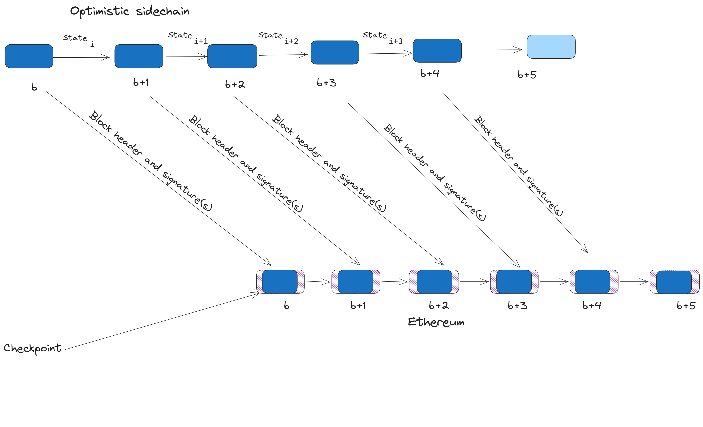
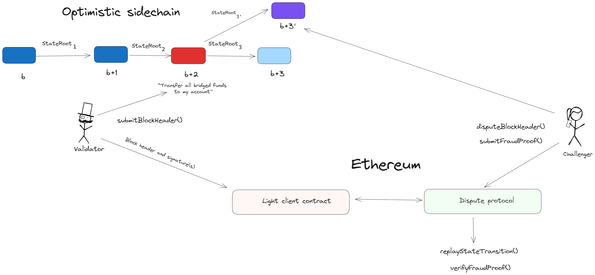
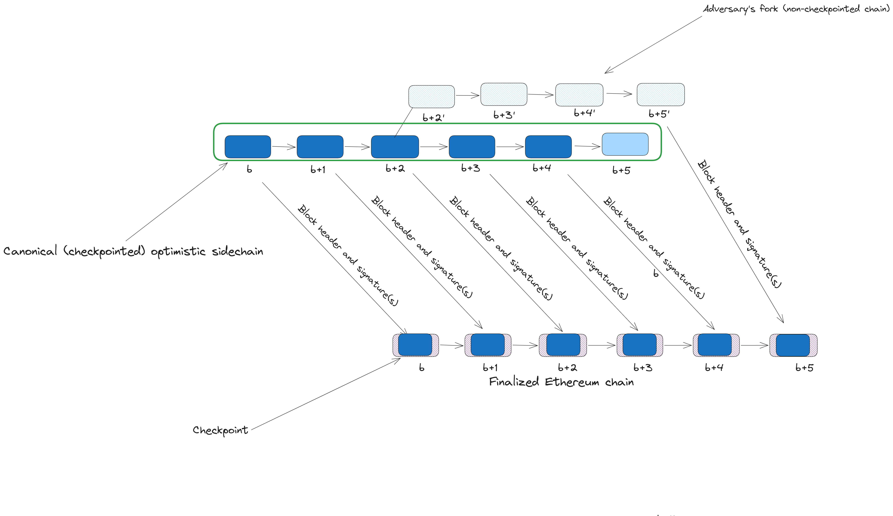

Optimiums are off-scaling solutions that use fraud proofs for security and settle transactions on Ethereum, but store transaction data off-chain. Off-chain data availability reduces transaction fees for users and improves throughput for applications, but comes at the expense of weaker guarantees around security of funds deposited in bridge contracts and resistance to censorship. Unlike [Layer 2 (L2) scaling solutions](/layer-2/), **optimiums do not completely derive critical security properties like safety and liveness from Ethereum** and have greater reliance on the honesty of off-chain actors (e.g., validators and data availability providers).

## Prerequisites {#prerequisites}

A high-level understanding of how blockchains like Ethereum work and minimal familiarity with [Ethereum scaling](/developers/docs/scaling/) will make it easier to grasp the various concepts discussed in this page. Implementing and integrating with scaling solutions, like optimiums, is an advanced topic as the technology is still under active research and development.

### How to navigate this page {#how-to-navigate-this-page}

You may want to read through introductory sections to gain a fundamental understanding of optimiums before moving to other parts. You can also jump to a particular section to find the information you’re looking for. Whatever your preference and reading style, we have a summary of contents—with hyperlinks to section headings—to assist in navigating the contents of this page:

- **[What is an optimium chain?](#overview-of-optimium-chains)**: Provides a high-level explanation of optimiums and highlights similarities and differences between optimiums and similar existing scaling solutions, particularly optimistic rollups and sidechains.
- **[A deep dive into optimium protocols](/developers/docs/scaling/optimiums/architecture/)**: A comprehensive overview of the architecture and design of optimiums—topics covered include block production, block validation, dispute arbitration, and data availability in optimium chains.
- **[Optimiums FAQs for developers](/developers/docs/scaling/optimiums/faq/)**: Get answers to frequently asked questions (FAQs) related to building applications on optimiums—topics covered include EVM-compatibility, interoperability, and transaction fees in optimiums.
- **[Comparisons of optimiums to other scaling solutions](/developers/docs/scaling/optimiums/comparison/)**: A detailed comparison of optimiums to other scaling solutions (validiums, rollups, sidechains, Plasma, and state channels) to assist developers and enterprises in deciding whether an optimium—or a competing scaling solution—best suits their needs.
- **[Build dapps on optimium chains](/developers/docs/scaling/optimiums/building/)**: A (non-exhaustive) list of EVM-compatible optimiums you can start building on.

## What is an optimium chain? {#overview-of-optimium-chains}

An optimium can be _concisely_ defined as an off-chain protocol that relies on Ethereum to settle transactions and enforce validity of state transitions via fraud proofs, but derives consensus (canonical ordering of transactions) and data availability (availability of transaction data) from a separate source. Optimium chains do not prove validity of state transitions, but allow for claims about state transitions to be challenged on-chain. Ethereum arbitrates disputes between validators asserting conflicting states and can roll back successfully disputed state transitions to protect the off-chain network from executing invalid transactions.

An optimium can be _comprehensively_ defined as an **optimistic sidechain**—that is, a sidechain with additional (security) properties:

- A requirement for validators to submit cryptographic commitments to state updates to an **on-chain light client** (implemented as a smart contract). The light client contract represents the main chain’s (Ethereum) view of the state of accounts and user balances on the sidechain.
- A **dispute protocol** that encodes the optimium’s state transition logic and can re-execute disputed state transitions on-chain to verify fraud proofs during the challenge period.
- A **challenge period** during which invalid updates to the sidechain’s state can be disputed on-chain by honest nodes monitoring the chain. Validators bond collateral before submitting state commitments and can be slashed if a state transition asserted on Ethereum is proven invalid during a dispute.
- A **validating bridge** on Ethereum that confirms validity of transactions that update the sidechain’s state before processing withdrawal requests. The validating bridge guarantees honest users can withdraw assets bridged to the sidechain if they have access to the sidechain’s state and can prove ownership of funds.

The definition describes a blockchain as an optimium based on the off-chain network’s relationship with Ethereum. A blockchain may be described as a “rollup” because it publishes transaction data to an external data availability layer—similar to rollups publishing transaction data on Ethereum—and submits state roots on-chain to a bridge contract to settle transactions on Ethereum. But, without the ability to enforce the off-chain network’s ordering and guarantee data availability, this is a sidechain from Ethereum’s perspective.

If the sidechain implements a fraud proof system on Ethereum, it becomes an optimistic sidechain or optimium. Ethereum cannot _directly_ verify the correctness of a new block header that asserts a new state for the sidechain, but it _can_ verify a fraud proof that proves a newly asserted state is incorrect according to the sidechain’s state transition rules. But Ethereum does not guarantee that the inputs to the state transition function (transaction data) is available to verifiers or users—making it an optimistic sidechain (optimium) from the perspective of the Ethereum network.

Separating out data availability from the sidechain’s consensus by storing transaction data with a third party _may_ reduce trust assumptions for a user, if the user trusts the security of the data availability layer, but does not translate into guarantees of ownership of funds in the bridge contract enforced by Ethereum itself. The bridge connecting the sidechain with Ethereum is a light client and only reads attestations to data availability and does not verify if the data is actually available before accepting a new block header. If a majority of validators collude to withhold data or revert blocks, Ethereum cannot enforce ownership of funds deposited in the sidechain's bridge.

Since optimiums are developed as a scaling solution for Ethereum, this definition is crucial to understanding the guarantees that users bridging assets from Ethereum to various optimiums have. In other words: “If a user owns an asset on Ethereum, deposits into the optimium’s bridge, and then receives a representation of the asset off-chain, what guarantees does the user have that it can withdraw the original asset back to Ethereum?”

### How are optimiums different from traditional sidechains?

A sidechain is a separate, independent blockchain that connects with another blockchain (a “main chain”)—such as Ethereum—via a two-way bridge. Sidechains bootstrap security independently: a common approach is to implement a Proof of Stake (PoS) consensus protocol that requires staking the network’s native token before joining the validator set (a validator’s stake acts as a bond for honest behavior and can be slashed if it engages in provably dishonest behavior, such as voting for an voting for an incorrect block).

Sidechains are [off-chain scaling solutions](/developers/docs/scaling/#off-chain-scaling) that maintain a separate state and process transactions separately from Ethereum. The core ideas behind off-chain scaling are explored below:

- Users can deposit Ethereum-native assets (e.g., ETH) into a bridge contract, receive a representation of that asset on the off-chain network (e.g., wrapped ETH), and send transactions to nodes operating the off-chain network to spend from their balance. The value of assets issued on the off-chain network is backed by the deposits locked in the bridge contract. Users can also withdraw deposits from the bridge by proving either inclusion of a transaction burning tokens minted on the sidechain or balances of accounts with a Merkle proof.

- The off-chain network makes modifications, such as having faster block times and higher gas limits, to increase scalability (throughput and transaction costs). Bigger blocks reduce congestion (which contributes to gas price surges on Ethereum today) and enable applications to scale transaction volumes. Faster block times reduce latency for transactions and may be reduced further by using a small set of actors (validators and sequencers) to confirm transactions. But these modifications typically come at the expense of decentralization as fewer nodes are capable of validating the chain due to increased hardware/financial requirements to participate in consensus.
- Off-chain scaling protocols maintain a separate state and do not directly scale execution and throughput on Ethereum directly. But they do provide an alternative for users to bridge Ethereum-native assets and execute transactions cheaply and quickly in an optimized off-chain environment. The off-chain network may implement the Ethereum Virtual Machine (EVM) specification for compatibility with existing Ethereum infrastructure, applications, and developer tooling and provide an “Ethereum-like” experience—allowing users can interact with dapps and send tokens as they would on Ethereum and developers can build applications using the same tools.

- Off-chain protocols store only a minimum amount of state data on-chain and amortize the costs of checkpointing states on-chain by batching transactions and submitting commitments to the state from executing batches. Off-chain scaling reduces congestion on the base layer, whilst allowing Ethereum to outsource execution; to illustrate, if an Ethereum block includes a commitment to 1000 transactions, and the commitment is valid, Ethereum would have indirectly processed 1000 transactions without having to increase block sizes or decreasing block times.

The difference between off-chain scaling solutions for Ethereum revolves around the guarantees that users can withdraw bridged assets back to Ethereum without needing to trust another counterparty (i.e., besides Ethereum nodes) for the security of assets deposited in a bridge. Sidechains are not considered a secure scaling solution for Ethereum as the security of assets deposited in bridge contracts depends entirely on the honesty of the sidechain’s validators:

In a sidechain construction, the bridge contract acts as a light client that verifies changes in the sidechain’s state by confirming that a majority of validators signed the latest block header. If the latest block is valid according to the bridge, users can withdraw funds by providing data that proves information about the sidechain’s state (e.g., account balances and inclusion of burn transactions in a block).

This design choice reduces latency on withdrawals from the bridge; users can withdraw as soon as a new block is confirmed by a majority of validators on the sidechain. However, the bridge assumes the validators are approving valid blocks and cannot reliably detect invalid updates to the sidechain’s state. If the majority of validators required to approve a block agree to perform an invalid state transition (e.g., a block minting tokens for a user without collateral deposited in the bridge), the bridge may become insolvent and unable to process withdrawals from honest users.

In contrast, the **validating bridge** used by optimium chains can verify integrity of the sidechain’s state without trusting an external authority (e.g., the sidechain’s validator set) before processing withdrawals. While the bridge optimistically assumes block headers submitted to the light client contract are valid, it can verify a fraud proof that proves a proposed block includes incorrectly executed transactions. Fraud proofs enable anyone to prove that a block includes invalid transactions and provide optimium chains with a 1-of-n security guarantee: if one honest validator is available to dispute invalid state transitions, a dishonest majority of validators cannot trick the light client into accepting a bad block.

Verifying fraud proofs on Ethereum provides an extra layer of defense against settlement of invalid transactions by validators running the optimium chain. Unlike traditional sidechains that settle transactions once a threshold of validators approve blocks, optimium chains settle transactions _after_ the challenge window expires without a fraud proof disputing block headers submitted to the on-chain light client. More specifically, the validating bridge delays withdrawals until it confirms acceptance of block headers by the optimium’s light client contract—reducing the risk of sidechain validators colluding to steal assets by approving invalid state transitions.

Optimium chains can also defend against malicious reorgs by checkpointing state updates on-chain (via block headers submitted to the on-chain light client). Each block header is stored in a finalized Ethereum block and links to the previous block header, which creates a chain of commitments that represents Ethereum’s view of the optimium’s state. If the optimium chain uses a fork-choice rule that dictates a valid block must include a hash of the last Ethereum block, it guarantees everyone observing the optimium chain by reading Ethereum’s state will always have the same view.

This prevents safety failures arising from two nodes observing two different states at the same block height. Such safety failures can occur when an adversary tricks undiscerning nodes into following a malicious fork that reverts previously finalized blocks and performs a double-spend attack (spending funds from historical transactions). A blockchain’s security against malicious reorgs depends on the honesty of the validator set and the economic cost of reverting blocks.

An adversary that wishes to provide an alternative view of history and cause honest nodes to follow a malicious fork must control a threshold of the active stake on Ethereum to revert Ethereum blocks containing block headers submitted by optimium validators. This attack is difficult to execute in principle: (1) Ethereum’s consensus protocol uses a large set validator (composed of thousands of validators) that makes collusion and bribery difficult. (2) The price of ETH places a quantifiable and significant cost on malicious reorgs (attackers need to burn at least ⅓ of staked ETH or millions of dollars to revert finalized blocks). In comparison, traditional sidechains may be susceptible to reorg attacks due to using a smaller validator set and having a low-value native token (which reduces the difficulty of collusion and decreases the cost borne by an attacker in a 51 percent attack).

|                                                                                                                                                                       |
| :---------------------------------------------------------------------------------------------------------------------------------------------------------------------------------------------------------------------------------------------------: |
| _The blocks in the green rectangle represent the checkpointed (canonical) optimium chain from the perspective of a node observing the finalized Ethereum chain and prevents an adversary from convincing honest nodes to follow a conflicting chain._ |

Optimiums have slightly better security properties than pure sidechains by settling transactions on Ethereum and verifying fraud proofs to secure against invalid state transitions. However, optimium chains are not as secure as Layer 2 (L2) blockchains—off-chain scaling protocols that inherit consensus (canonical ordering of transactions) and data availability (availability of state data) from Ethereum in addition to settling transactions on-chain. Ethereum rollups are the primary example of Layer 2 (L2) scaling solutions and the next section explores the differences between L2s and optimiums

## Further reading on optimiums {#further-reading}

- [Exploring the scalability needs for blockchain apps](https://polynya.mirror.xyz/vqdR7FHEzc-lfsWjA88s1uqYqLSgQoWvWm-KN39Zb2M)
- [How To—And How Not To—Use Data Availability Committees](https://medium.com/offchainlabs/how-to-and-how-not-to-use-data-availability-committees-394a91e977c0)
