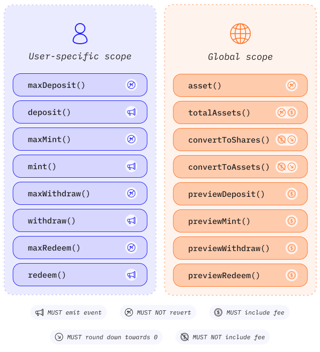

## Introduction {#introduction}

ERC-4626 is a standard to optimize and unify the technical parameters of yield-bearing vaults. It provides a standard API for tokenized yield-bearing vaults that represent shares of a single underlying ERC-20 token. ERC-4626 also outlines an optional extension for tokenized vaults utilizing ERC-20, offering basic functionality for depositing, withdrawing tokens and reading balances.

**The role of ERC-4626 in yield-bearing vaults**

Lending markets, aggregators, and intrinsically interest-bearing tokens help users find the best yield on their crypto tokens by executing different strategies. These strategies are done with slight variation, which might be error-prone or waste development resources.

ERC-4626 in yield-bearing vaults will lower the integration effort and unlock access to yield in various applications with little specialized effort from developers by creating more consistent and robust implementation patterns.

The ERC-4626 token is described fully in [EIP-4626](https://eips.ethereum.org/EIPS/eip-4626).

**Asynchronous vault extension (ERC-7540)**

ERC-4626 is optimized for atomic deposits and redemptions up to a limit. If the limit is reached, no new deposits or redemptions can be submitted. This limitation does not work well for any smart contract system with asynchronous actions or delays as a prerequisite for interfacing with the Vault (e.g. real-world asset protocols, undercollateralized lending protocols, cross-chain lending protocols, liquid staking tokens, or insurance safety modules).

ERC-7540 expands the utility of ERC-4626 Vaults for asynchronous use cases. The existing Vault interface (`deposit`/`withdraw`/`mint`/`redeem`) is fully utilized to claim asynchronous Requests.

The ERC-7540 extension is described fully in [ERC-7540](https://eips.ethereum.org/EIPS/eip-7540).

**Multi-asset vault extension (ERC-7575)**

One missing use case that is not supported by ERC-4626 is Vaults which have multiple assets or entry points such as liquidity provider (LP) Tokens. These are generally unwieldy or non-compliant due to the requirement of ERC-4626 to itself be an ERC-20.

ERC-7575 adds support for Vaults with multiple assets by externalizing the ERC-20 token implementation from the ERC-4626 implementation.

The ERC-7575 extension is described fully in [ERC-7575](https://eips.ethereum.org/EIPS/eip-7575).

## Prerequisites {#prerequisites}

To better understand this page, we recommend you first read about [token standards](/developers/docs/standards/tokens/) and [ERC-20](/developers/docs/standards/tokens/erc-20/).

## ERC-4626 Functions and Features: {#body}

### Methods {#methods}

#### asset {#asset}

```solidity
function asset() public view returns (address assetTokenAddress)
```

This function returns the address of the underlying token used for the vault for accounting, depositing, withdrawing.

#### totalAssets {#totalassets}

```solidity
function totalAssets() public view returns (uint256)
```

This function returns the total amount of underlying assets held by the vault.

#### convertToShares {#convertoshares}

```solidity
function convertToShares(uint256 assets) public view returns (uint256 shares)
```

This function returns the amount of `shares` that would be exchanged by the vault for the amount of `assets` provided.

#### convertToAssets {#convertoassets}

```solidity
function convertToAssets(uint256 shares) public view returns (uint256 assets)
```

This function returns the amount of `assets` that would be exchanged by the vault for the amount of `shares` provided.

#### maxDeposit {#maxdeposit}

```solidity
function maxDeposit(address receiver) public view returns (uint256 maxAssets)
```

This function returns the maximum amount of underlying assets that can be deposited in a single [`deposit`](#deposit) call by the `receiver`.

#### previewDeposit {#previewdeposit}

```solidity
function previewDeposit(uint256 assets) public view returns (uint256 shares)
```

This function allows users to simulate the effects of their deposit at the current block.

#### deposit {#deposit}

```solidity
function deposit(uint256 assets, address receiver) public returns (uint256 shares)
```

This function deposits `assets` of underlying tokens into the vault and grants ownership of `shares` to `receiver`.

#### maxMint {#maxmint}

```solidity
function maxMint(address receiver) public view returns (uint256 maxShares)
```

This function returns the maximum amount of shares that can be minted in a single [`mint`](#mint) call by the `receiver`.

#### previewMint {#previewmint}

```solidity
function previewMint(uint256 shares) public view returns (uint256 assets)
```

This function allows users to simulate the effects of their mint at the current block.

#### mint {#mint}

```solidity
function mint(uint256 shares, address receiver) public returns (uint256 assets)
```

This function mints exactly `shares` vault shares to `receiver` by depositing `assets` of underlying tokens.

#### maxWithdraw {#maxwithdraw}

```solidity
function maxWithdraw(address owner) public view returns (uint256 maxAssets)
```

This function returns the maximum amount of underlying assets that can be withdrawn from the `owner` balance with a single [`withdraw`](#withdraw) call.

#### previewWithdraw {#previewwithdraw}

```solidity
function previewWithdraw(uint256 assets) public view returns (uint256 shares)
```

This function allows users to simulate the effects of their withdrawal at the current block.

#### withdraw {#withdraw}

```solidity
function withdraw(uint256 assets, address receiver, address owner) public returns (uint256 shares)
```

This function burns `shares` from `owner` and send exactly `assets` token from the vault to `receiver`.

#### maxRedeem {#maxredeem}

```solidity
function maxRedeem(address owner) public view returns (uint256 maxShares)
```

This function returns the maximum amount of shares that can be redeemed from the `owner` balance through a [`redeem`](#redeem) call.

#### previewRedeem {#previewredeem}

```solidity
function previewRedeem(uint256 shares) public view returns (uint256 assets)
```

This function allows users to simulate the effects of their redemption at the current block.

#### redeem {#redeem}

```solidity
function redeem(uint256 shares, address receiver, address owner) public returns (uint256 assets)
```

This function redeems a specific number of `shares` from `owner` and sends `assets` of underlying token from the vault to `receiver`.

#### totalSupply {#totalsupply}

```solidity
function totalSupply() public view returns (uint256)
```

Returns the total number of unredeemed vault shares in circulation.

#### balanceOf {#balanceof}

```solidity
function balanceOf(address owner) public view returns (uint256)
```

Returns the total amount of vault shares the `owner` currently has.

### Map of the interface {#mapOfTheInterface}



### Events {#events}

#### Deposit Event

**MUST** be emitted when tokens are deposited into the vault via the [`mint`](#mint) and [`deposit`](#deposit) methods.

```solidity
event Deposit(
    address indexed sender,
    address indexed owner,
    uint256 assets,
    uint256 shares
)
```

Where `sender` is the user who exchanged `assets` for `shares`, and transferred those `shares` to `owner`.

#### Withdraw Event

**MUST** be emitted when shares are withdrawn from the vault by a depositor in the [`redeem`](#redeem) or [`withdraw`](#withdraw) methods.

```solidity
event Withdraw(
    address indexed sender,
    address indexed receiver,
    address indexed owner,
    uint256 assets,
    uint256 shares
)
```

Where `sender` is the user who triggered the withdrawal and exchanged `shares`, owned by `owner`, for `assets`. `receiver` is the user who received the withdrawn `assets`.

## Further reading {#further-reading}

- [EIP-4626: Tokenized vault Standard](https://eips.ethereum.org/EIPS/eip-4626)
- [ERC-4626: GitHub Repo](https://github.com/transmissions11/solmate/blob/main/src/tokens/ERC4626.sol)
