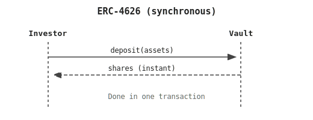
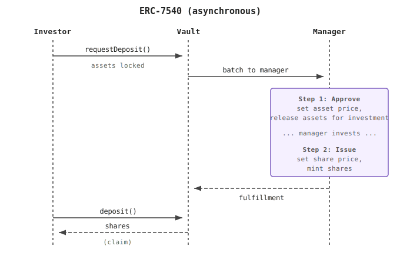

## Introduction {#introduction}

ERC-7540 extends the [ERC-4626 Tokenized Vault Standard](/developers/docs/standards/tokens/erc-4626/) by adding support for asynchronous deposit and redemption flows. It introduces a request-then-claim pattern: users first submit a request (locking their assets or shares), then claim the result after the vault has processed it.

This is needed when a vault cannot settle instantly in one transaction, for example:

- Real-world asset (RWA) protocols like tokenized treasuries, private credit, and other assets with T+1 or T+2 settlement cycles
- Undercollateralized lending where credit assessments happen off-chain
- Cross-chain vault strategies where bridging introduces delays
- Liquid staking tokens with unbonding periods

Vaults can choose to be asynchronous on deposits only, redemptions only, or both. This flexibility lets vault developers add async flows only where the underlying strategy requires it, while keeping the other side synchronous.

## Prerequisites {#prerequisites}

To better understand this page, we recommend you first read about [token standards](/developers/docs/standards/tokens/), [ERC-20](/developers/docs/standards/tokens/erc-20/), and [ERC-4626](/developers/docs/standards/tokens/erc-4626/).

## ERC-4626 vs ERC-7540 {#comparison}

In ERC-4626, a deposit settles atomically: the investor sends assets and receives shares back in a single transaction.



ERC-7540 splits this into two steps. The investor first calls `requestDeposit()` to lock assets, then waits for the vault manager to process the request. Once fulfilled, the investor calls `deposit()` to claim their shares. Exchange rates are determined at fulfillment time, not request time.



Each request moves through three states: pending (submitted, waiting for processing), claimable (fulfilled and priced), and claimed (investor has collected their shares or assets).


## ERC-7540 Functions and Features {#body}

ERC-7540 inherits the full ERC-4626 interface but repurposes `deposit`/`mint`/`withdraw`/`redeem` as claim functions. The new `requestDeposit` and `requestRedeem` functions handle the initial request step.

### Deposit request flow {#deposit-request-flow}

#### requestDeposit {#requestdeposit}

```solidity
function requestDeposit(uint256 assets, address controller, address owner) external returns (uint256 requestId)
```

Transfers `assets` from `owner` into the vault and submits a request to deposit. The `controller` address receives control of the request. Returns a `requestId` identifying the request batch.

#### pendingDepositRequest {#pendingdepositrequest}

```solidity
function pendingDepositRequest(uint256 requestId, address controller) external view returns (uint256 assets)
```

Returns the amount of `assets` in a pending (not yet claimable) deposit request for the given `controller` and `requestId`.

#### claimableDepositRequest {#claimabledepositrequest}

```solidity
function claimableDepositRequest(uint256 requestId, address controller) external view returns (uint256 assets)
```

Returns the amount of `assets` in a claimable (fulfilled but not yet claimed) deposit request for the given `controller` and `requestId`.

#### Claiming deposits {#claiming-deposits}

Once a deposit request becomes claimable, the user calls the standard ERC-4626 [`deposit`](/developers/docs/standards/tokens/erc-4626/#deposit) or [`mint`](/developers/docs/standards/tokens/erc-4626/#mint) function to claim their shares. In ERC-7540, these functions no longer transfer assets (that already happened at request time). They only mint shares to the receiver.

### Redemption request flow {#redemption-request-flow}

#### requestRedeem {#requestredeem}

```solidity
function requestRedeem(uint256 shares, address controller, address owner) external returns (uint256 requestId)
```

Locks `shares` from `owner` and submits a request to redeem. The `controller` address receives control of the request.

#### pendingRedeemRequest {#pendingredeemrequest}

```solidity
function pendingRedeemRequest(uint256 requestId, address controller) external view returns (uint256 shares)
```

Returns the amount of `shares` in a pending redemption request for the given `controller` and `requestId`.

#### claimableRedeemRequest {#claimableredeemrequest}

```solidity
function claimableRedeemRequest(uint256 requestId, address controller) external view returns (uint256 shares)
```

Returns the amount of `shares` in a claimable redemption request for the given `controller` and `requestId`.

#### Claiming redemptions {#claiming-redemptions}

Once a redemption request becomes claimable, the user calls the standard ERC-4626 [`redeem`](/developers/docs/standards/tokens/erc-4626/#redeem) or [`withdraw`](/developers/docs/standards/tokens/erc-4626/#withdraw) function to claim their assets.

### Operator management {#operator-management}

ERC-7540 includes an operator pattern (from [ERC-6909](https://eips.ethereum.org/EIPS/eip-6909)) that allows third parties to manage requests on behalf of a user.

#### setOperator {#setoperator}

```solidity
function setOperator(address operator, bool approved) external returns (bool)
```

Approves or revokes `operator` to act on behalf of `msg.sender` for deposit/redeem requests and claims.

#### isOperator {#isoperator}

```solidity
function isOperator(address controller, address operator) external view returns (bool)
```

Returns whether `operator` is approved to act on behalf of `controller`.

### Request IDs {#request-ids}

Request IDs differentiate between different batches of requests. All requests sharing the same `requestId` are fungible: they transition between states together and receive the same exchange rate.

When a vault returns `requestId = 0` for all requests, only the `controller` address differentiates request state. Multiple requests from the same controller are aggregated.

### Events {#events}

#### DepositRequest Event {#depositrequest-event}

MUST be emitted when a deposit request is submitted via [`requestDeposit`](#requestdeposit).

```solidity
event DepositRequest(
    address indexed controller,
    address indexed owner,
    uint256 indexed requestId,
    address sender,
    uint256 assets
)
```

#### RedeemRequest Event {#redeemrequest-event}

MUST be emitted when a redemption request is submitted via [`requestRedeem`](#requestredeem).

```solidity
event RedeemRequest(
    address indexed controller,
    address indexed owner,
    uint256 indexed requestId,
    address sender,
    uint256 shares
)
```

#### OperatorSet Event {#operatorset-event}

MUST be emitted when an operator is approved or revoked via [`setOperator`](#setoperator).

```solidity
event OperatorSet(
    address indexed controller,
    address indexed operator,
    bool approved
)
```

### Preview functions {#preview-functions}

In asynchronous vaults, `previewDeposit`, `previewMint`, `previewRedeem`, and `previewWithdraw` MUST revert because the exchange rate is not known until the request is fulfilled. This is a key behavioral difference from ERC-4626.

## Further reading {#further-reading}

- [EIP-7540: Asynchronous ERC-4626 Tokenized Vaults](https://eips.ethereum.org/EIPS/eip-7540)
- [EIP-4626: Tokenized Vault Standard](https://eips.ethereum.org/EIPS/eip-4626)
- [Centrifuge: ERC-7540 Reference Implementation](https://github.com/centrifuge/liquidity-pools)
