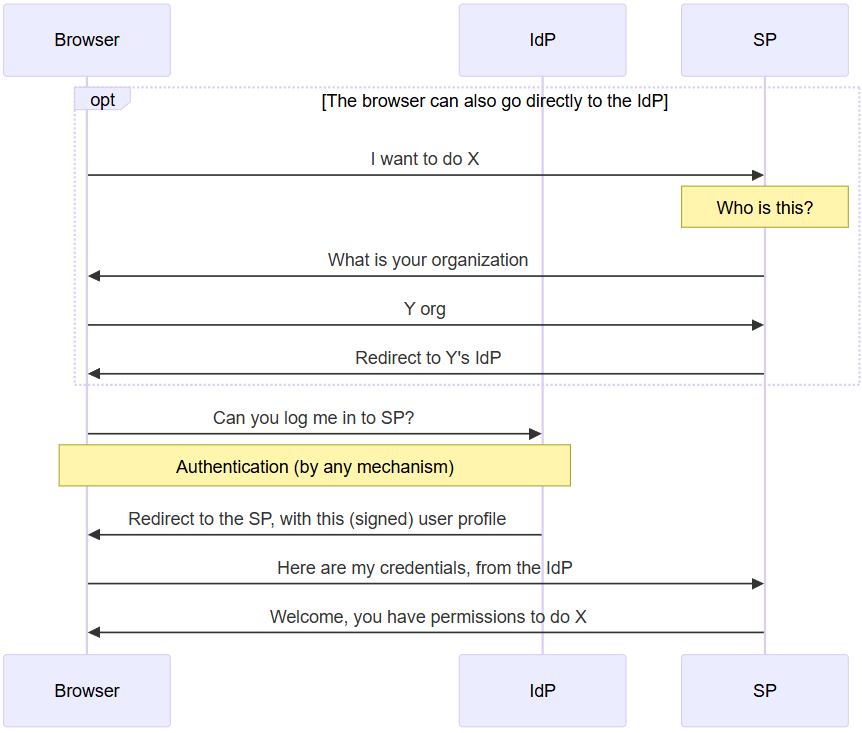
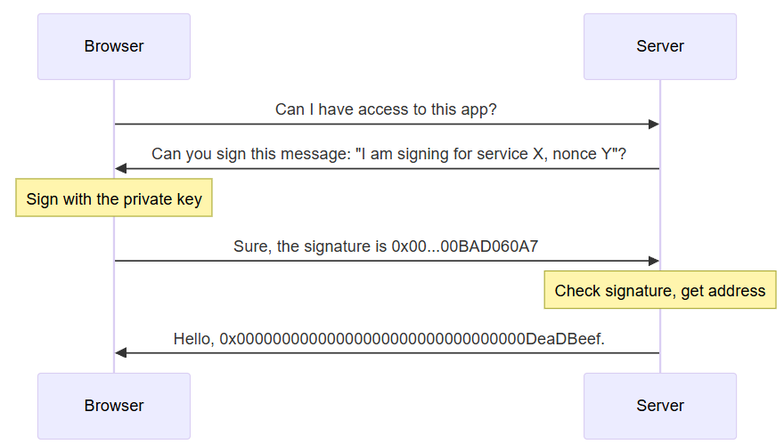
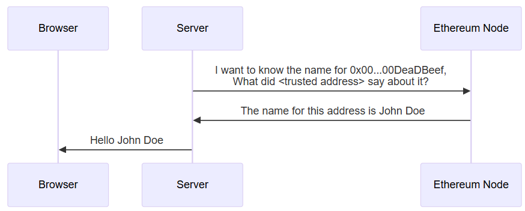
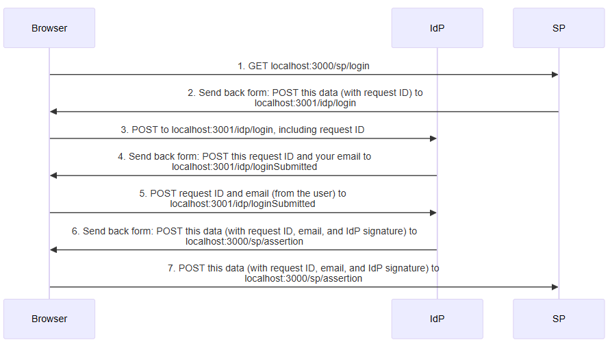
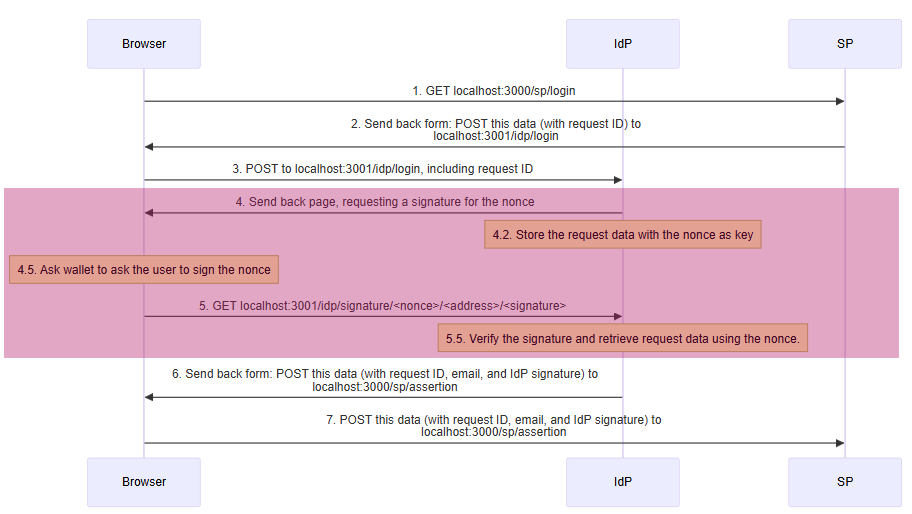
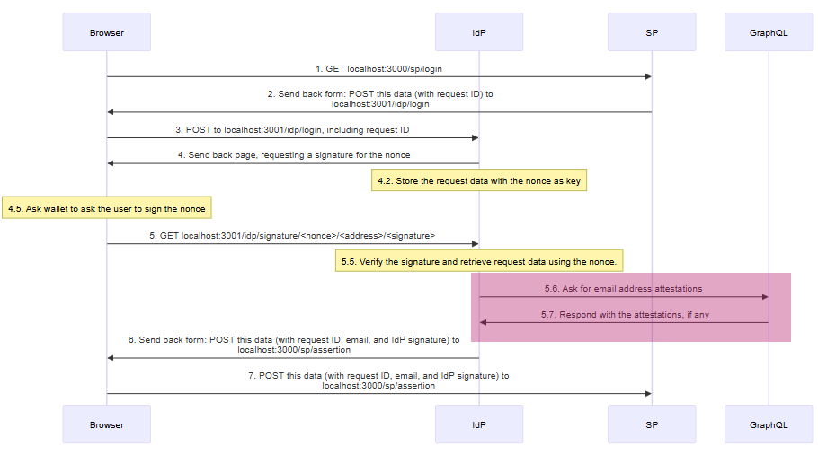

## Introduction

[SAML](https://www.onelogin.com/learn/saml) is a standard used on web2 to allow an [identity provider (IdP)](https://en.wikipedia.org/wiki/Identity_provider#SAML_identity_provider) to provide user information for [service providers (SP)](https://en.wikipedia.org/wiki/Service_provider_(SAML)).

In this tutorial you learn how to integrate Ethereum signatures with SAML to allow users to use their Ethereum wallets to authenticate themselves to web2 services that don't support Ethereum natively yet.

Note that this tutorial is written for two separate audiences:

- Ethereum people who understand Ethereum and need to learn SAML
- Web2 people who understand SAML and web2 authentication and need to learn Ethereum

As a result, it is going to contain a lot of introductory material that you already know. Feel free to skip it.

### SAML for Ethereum people

SAML is a centralized protocol. A service provider (SP) only accepts assertions (such as "this is my user John, he should have permissions to do A, B, and C") from an identity provider (IdP) if it has a pre-existing trust relationship either with it, or with the [certificate authority](https://www.ssl.com/article/what-is-a-certificate-authority-ca/) that signed that IdP's certificate.

For example, the SP can be a travel agency providing travel services to companies, and the IdP can be a company's internal web site. When employees need to book business travel, the travel agency sends them for authentication by the company before letting them actually book travel.



This is the way the three entities, the browser, SP, and IdP, negotiate for access. The SP does not need to know anything about the user using the browser in advance, just to trust the IdP.

### Ethereum for SAML people

Ethereum is a decentralized system. 



Users have a a private key (typically held in a browser extension). From the private key you can derive a public key, and from that a 20-byte address. When users need to log into a system, they are requested to sign a message with a nonce (a single-use value). The server can verify the signature was created by that address.



The signature only verifies the Ethereum address. To get other user attributes, you typically use [attestations](https://attest.org/). An attestation typically has these fields:

- **Attestor**, the address that made the attestation
- **Recipient**, the address to which the attestation applies
- **Data**, the data being attested, such as name, permissions, etc.
- **Schema**, the ID of the schema used to interpret the data.

Because of the decentralized nature of Ethereum, any user can make attestations. The attestor's identity is important to identify which attestations we consider reliable.

## Setup

The first step is to have a SAML SP and a SAML IdP communicating between themselves.

1. Download the software. The sample software for this article is [on github](https://github.com/qbzzt/250420-saml-ethereum). Different stages are stored in different branches, for this stage you want `saml-only`

    ```sh
    git clone https://github.com/qbzzt/250420-saml-ethereum -b saml-only
    cd 250420-saml-ethereum
    pnpm install
    ```

2. Create keys with self-signed certificates. This means that the key is its own certificate authority, and needs to be imported manually to the service provider. See [the OpenSSL docs](https://docs.openssl.org/master/man1/openssl-req/) for more information. 

    ```sh
    mkdir keys
    cd keys
    openssl req -new -x509 -days 365 -nodes -sha256 -out saml-sp.crt -keyout saml-sp.pem -subj /CN=sp/
    openssl req -new -x509 -days 365 -nodes -sha256 -out saml-idp.crt -keyout saml-idp.pem -subj /CN=idp/
    cd ..
    ```

3. Start the servers (both SP and IdP)

    ```sh
    pnpm start
    ```

4. Browse to the SP at URL [http://localhost:3000/](http://localhost:3000/) and click the button to be redirected to the IdP (port 3001).

5. Provide the IdP with your email address and click **Login to the service provider**. See that you get redirected back to the service provider (port 3000) and that it knows you by your email address.

### Detailed explanation

This is what happens, step by step:



#### src/config.mts

This file contains the configuration for both the Identity Provider and the Service Provider. Normally these two would be different entities, but here we can share code for simplicity.

```typescript
const fs = await import("fs")

const protocol="http"
```

For now we're just testing, so it's fine to use HTTP.

```typescript
export const spCert = fs.readFileSync("keys/saml-sp.crt").toString()
export const idpCert = fs.readFileSync("keys/saml-idp.crt").toString()
```

Read the public keys, which are normally available to both components (and either trusted directly, or signed by a trusted certificate authority).

```typescript
export const spPort = 3000
export const spHostname = "localhost"
export const spDir = "sp"

export const idpPort = 3001
export const idpHostname = "localhost"
export const idpDir = "idp"

export const spUrl = `${protocol}://${spHostname}:${spPort}/${spDir}`
export const idpUrl = `${protocol}://${idpHostname}:${idpPort}/${idpDir}`
```

The URLs for both components.

```typescript
export const spPublicData = {
```

The public data for the service provider.

```typescript
    entityID: `${spUrl}/metadata`,
```

By convention, in SAML the `entityID` is the URL where the metadata of the entity is available. This metadata corresponds to the public data here, except it is in XML form.

```typescript
    wantAssertionsSigned: true,
    authnRequestsSigned: false,
    signingCert: spCert,
    allowCreate: true,
    assertionConsumerService: [{
        Binding: 'urn:oasis:names:tc:SAML:2.0:bindings:HTTP-POST',
        Location: `${spUrl}/assertion`,
    }]
  }
```

The most important definition for our purposes is the `assertionConsumerServer`. It means that to assert something (for example, "the user who sends you this information is somebody@example.com") to the service provider we need to use [HTTP POST](https://www.w3schools.com/tags/ref_httpmethods.asp) to URL `http://localhost:3000/sp/assertion`.

```typescript
export const idpPublicData = {
    entityID: `${idpUrl}/metadata`,
    signingCert: idpCert,
    wantAuthnRequestsSigned: false,
    singleSignOnService: [{
      Binding: "urn:oasis:names:tc:SAML:2.0:bindings:HTTP-POST",
      Location: `${idpUrl}/login`
    }],
    singleLogoutService: [{
      Binding: "urn:oasis:names:tc:SAML:2.0:bindings:HTTP-POST",
      Location: `${idpUrl}/logout`
    }],
  }
```

The public data for the identity provider is similar. It specifies that to log a user in you POST to `http://localhost:3001/idp/login` and to log a user out you POST to `http://localhost:3001/idp/logout`.

#### src/sp.mts

This is the code that implements a service provider.

```typescript
import * as config from "./config.mts"
const fs = await import("fs")
const saml = await import("samlify")
```

We use the [`samlify`](https://www.npmjs.com/package/samlify) library to implement SAML.

```typescript
import * as validator from "@authenio/samlify-node-xmllint"
saml.setSchemaValidator(validator)
```

The `samlify` library expects to have a package validate that XML is correct, signed with the expected public key, etc. We use [`@authenio/samlify-node-xmllint`](https://www.npmjs.com/package/@authenio/samlify-node-xmllint) for this purpose.

```typescript
const express = (await import("express")).default
const spRouter = express.Router()
const app = express()
```

An [`express`](https://expressjs.com/) [`Router`](https://expressjs.com/en/5x/api.html#router) is a "mini web site" that can be mounted inside a web site. In this case, we use it to group all the service provider definitions together.

```typescript
const spPrivateKey = fs.readFileSync("keys/saml-sp.pem").toString()

const sp = saml.ServiceProvider({
  privateKey: spPrivateKey,  
  ...config.spPublicData
})
```

The service provider's own representation of itself is all the public data, and the private key it uses to sign information.

```typescript
const idp = saml.IdentityProvider(config.idpPublicData);
```

The public data contains everything the service provider needs to know about the identity provider.

```typescript
spRouter.get(`/metadata`, 
  (req, res) => res.header("Content-Type", "text/xml").send(sp.getMetadata())
)
```

To enable interoperability with other SAML components, service and identity providers should have their public data (called the metadata) available in XML format in `/metadata`.

```typescript
spRouter.post(`/assertion`,
```

This is the page accessed by the browser to identify itself. The assertion includes the user identifier (here we use email address), and can include additional attributes. This is the handler for step 7 in the sequence diagram above.

```typescript
  async (req, res) => {
    // console.log(`SAML response:\n${Buffer.from(req.body.SAMLResponse, 'base64').toString('utf-8')}`)
```

You can use the commented out command to see the XML data provided in the assertion. It is [base64 encoded](https://en.wikipedia.org/wiki/Base64).

```typescript
    try {
      const loginResponse = await sp.parseLoginResponse(idp, 'post', req);
```

Parse the login request from the identity server.

```typescript
      res.send(`
        <html>
          <body>
            <h2>Hello ${loginResponse.extract.nameID}</h2>
          </body>
        </html>
      `)
      res.send();
```

Send an HTML response, just to show the user we got the login.

```typescript
    } catch (err) {
      console.error('Error processing SAML response:', err);
      res.status(400).send('SAML authentication failed');
    }
  }
)
```

Inform the user in case of failure.

```typescript
spRouter.get('/login',
```

Create a login request when the browser attempts to get this page. This is the handler for step 1 in the sequence diagram above.

```typescript
  async (req, res) => {
    const loginRequest = await sp.createLoginRequest(idp, "post")
```

Get the information to post a login request.

```typescript
    res.send(`
      <html>
        <body>
          <script>
            window.onload = function () { document.forms[0].submit(); }            
          </script>
```

This page submits the form (see below) automatically. This way the user does not have to do anything to be redirected. This is step 2 in the sequence diagram above.

```typescript
          <form method="post" action="${loginRequest.entityEndpoint}">
```

Post to `loginRequest.entityEndpoint` (the URL of the identity provider endpoint).

```typescript
            <input type="hidden" name="${loginRequest.type}" value="${loginRequest.context}" />
```

The input name is `loginRequest.type` (`SAMLRequest`). The content for that field is `loginRequest.context`, which is again XML that is base64 encoded.

```typescript
          </form>
        </body>
      </html>
    `)    
  }
)

app.use(express.urlencoded({extended: true}))
```

[This middleware](https://expressjs.com/en/5x/api.html#express.urlencoded) reads the body of the [HTTP request](https://www.tutorialspoint.com/http/http_requests.htm). By default express ignores it, because most requests don't require it. We need it because POST does use the body.

```typescript
app.use(`/${config.spDir}`, spRouter)
```

Mount the router in the service provider directory (`/sp`).

```typescript
app.get("/", (req, res) => {
  res.send(`
    <html>
      <body>
        <button onClick="document.location.href='${config.spUrl}/login'">
           Click here to log on
        </button>
      </body>
    </html>
  `)
})
```

If a browser tries to get the root directory, provide it with a link to the login page.

```typescript
app.listen(config.spPort, () => {
  console.log(`service provider is running on http://${config.spHostname}:${config.spPort}`)
})
```

Listen to the `spPort` with this express application.

#### src/idp.mts

This is the identity provider. It is very similar to the service provider, the explanations below are for the parts that are different.

```typescript
const xmlParser = new (await import("fast-xml-parser")).XMLParser(
  {
    ignoreAttributes: false, // Preserve attributes
    attributeNamePrefix: "@_", // Prefix for attributes
  }
)
```

We need to read and understand the XML request we receive from the service provider.

```typescript
const getLoginPage = requestId => `
```

This function creates the page with the auto-submitted form that is returned in step 4 of the sequence diagram above.

```typescript
<html>
  <head>
    <title>Login page</title>
  </head>
  <body>
    <h2>Login page</h2>
    <form method="post" action="./loginSubmitted">
      <input type="hidden" name="requestId" value="${requestId}" />
      Email address: <input name="email" />
      <br />
      <button type="Submit">
        Login to the service provider
      </button>
```

There are two fields we send to the service provider:

1. The `requestId` to which we are responding.
2. The user identifier (we use the email address the user provides for now).

```typescript
    </form>
  </body>
</html>

const idpRouter = express.Router()

idpRouter.post("/loginSubmitted", async (req, res) => {
  const loginResponse = await idp.createLoginResponse(
```

This is the handler for step 5 of the sequence diagram above. [`idp.createLoginResponse`](https://github.com/tngan/samlify/blob/master/src/entity-idp.ts#L73-L125) creates the login response. 

```typescript
    sp, 
    {
      authnContextClassRef: 'urn:oasis:names:tc:SAML:2.0:ac:classes:PasswordProtectedTransport',
      audience: sp.entityID,
```

The audience is the service provider.

```typescript
      extract: {
        request: {
          id: req.body.requestId
        }
      },
```

Information extracted from the request. The one parameter we care about in the request is the requestId, which lets the service provider match requests and their responses.

```typescript
      signingKey: { privateKey: idpPrivateKey, publicKey: config.idpCert }  // Ensure signing
```

We need `signingKey` to have the data to sign the response. The service provider doesn't trust unsigned requests.

```typescript
    },
    "post",
    {
      email: req.body.email
```

This is the field with the user information we send back to the service provider.

```typescript      
    }
  );

  res.send(`
    <html>
      <body>
        <script>
          window.onload = function () { document.forms[0].submit(); }
        </script>
        
        <form method="post" action="${loginResponse.entityEndpoint}">
          <input type="hidden" name="${loginResponse.type}" value="${loginResponse.context}" />
        </form>
      </body>
    </html>
  `)
})
```

Again, use an auto-submitted form. This is step 6 of the sequence diagram above.

```typescript

// IdP endpoint for login requests
idpRouter.post(`/login`,
```

This is the endpoint that receives a login request from the service provider. This is the handler the step 3 of the sequence diagram above.

```typescript
  async (req, res) => {
    try {
      // Workaround because I couldn't get parseLoginRequest to work.
      // const loginRequest = await idp.parseLoginRequest(sp, 'post', req)
      const samlRequest = xmlParser.parse(Buffer.from(req.body.SAMLRequest, 'base64').toString('utf-8'))
      res.send(getLoginPage(samlRequest["samlp:AuthnRequest"]["@_ID"]))
```

We should be able to use [`idp.parseLoginRequest`](https://github.com/tngan/samlify/blob/master/src/entity-idp.ts#L127-L144) to read the authentication request's ID. However, I couldn't get it working and it wasn't worth spending a lot of time on it so I just use a [general-purpose XML parser](https://www.npmjs.com/package/fast-xml-parser). The information we need is the `ID` attribute inside the `<samlp:AuthnRequest>` tag, which is at the top level of the XML.

## Using Ethereum signatures

Now that we can send a user identity to the service provider, the next step is to obtain the user identity in a trusted manner. Viem allows us to just ask the wallet for the user address, but this means asking the browser for the information. We don't control the browser, so we can't automatically trust the response we get from it.

Instead, the IdP is going to send the browser a string to sign. If the wallet in the browser signs this string, it means that it really is that address (that is, it knows the private key that corresponds to the address).

To see this in action, stop the existing IdP and SP and run these commands:

```sh
git checkout eth-signatures
pnpm install
pnpm start
```

Then browse [to the SP](http://localhost:3000) and follow the directions.

Note that at this point we don't know how to get the email address from the Ethereum address, so instead we report `<ethereum address>@bad.email.address` to the SP.

### Detailed explanation

The changes are in steps 4-5 in the previous diagram.



The only file we changed is `idp.mts`. Here are the changed parts.

```typescript
import { v4 as uuidv4 } from 'uuid'
import { verifyMessage } from 'viem'
```

We need these two additional libraries. We use [`uuid`](https://www.npmjs.com/package/uuid) to create the [nonce](https://en.wikipedia.org/wiki/Cryptographic_nonce) value. The value itself does not matter, just the fact it is only used once.

The [`viem`](https://viem.sh/) library lets us use Ethereum definitions. Here we need it to verify that the signature is indeed valid.

```typescript
const loginPrompt = "To access the service provider, sign this nonce: "
```

The wallet asks the user for permission to sign the message. A message that is just a nonce could confuse users, so we include this prompt.

```typescript
// Keep requestIDs here
let nonces = {}
```

We need the request information to be able to respond to it. We could send it with the request (step 4), and receive it back (step 5). However, we cannot trust the information we get from the browser, which is under the control of a potentially hostile user. So it's better to store it here, with the nonce as key.

Note that we are doing it here as a variable for the sake of simplicity. However, this has several disadvantages:

- We are vulnerable to a denial of service attack. A malicious user could attempt to log on multiple times, filling up our memory.
- If the IdP process needs to be restarted, we lose the existing values.
- We cannot load balance across multiple processes, because each would have its own variable.

On a production system we'd use a database and implement some kind of expiry mechanism.

```typescript
const getSignaturePage = requestId => {
  const nonce = uuidv4()
  nonces[nonce] = requestId
```

Create a nonce, and store the `requestId` for future use.

```typescript
  return `
<html>
  <head>
    <script type="module">
```

This JavaScript gets executed automatically when the page is loaded.

```typescript
      import { createWalletClient, custom, getAddress } from 'https://esm.sh/viem'
```

We need several functions from `viem`.

```typescript
      if (!window.ethereum) {
          alert("Please install MetaMask or a compatible wallet and then reload")
      }
```

We can only work if there is a wallet on the browser.

```typescript
      const [account] = await window.ethereum.request({method: 'eth_requestAccounts'})
```

Request the list of accounts from the wallet (`window.ethereum`). Assume there is at least one, and only store the first one. 

```typescript
      const walletClient = createWalletClient({
          account,
          transport: custom(window.ethereum)
      })
```

Create a [wallet client](https://viem.sh/docs/clients/wallet) to interact with the browser wallet.

```typescript
      window.goodSignature = () => {
        walletClient.signMessage({
            message: "${loginPrompt}${nonce}"
```

Ask the user to sign a message. Because this whole HTML is in a [template string](https://viem.sh/docs/clients/wallet), we can use variables defined in the idp process. This is step 4.5 in the sequence diagram.

```typescript
        }).then(signature => {
            const path= "/${config.idpDir}/signature/${nonce}/" + account + "/" + signature
            window.location.href = path
        })
      }
```

Redirect to `/idp/signature/<nonce>/<address>/<signature>`. This is step 5 in the sequence diagram.

```typescript
      window.badSignature = () => {
        const path= "/${config.idpDir}/signature/${nonce}/" + 
          getAddress("0x" + "BAD060A7".padEnd(40, "0")) + 
          "/0x" + "BAD0516".padStart(130, "0")
        window.location.href = path
      }
```

The signature is sent back by the browser, which is potentially malicious (there is nothing to stop you from just opening `http://localhost:3001/idp/signature/bad-nonce/bad-address/bad-signature` in the browser). Therefore, it is important to verify the IdP process handles bad signatures correctly.

```typescript
    </script>
  </head>
  <body>
    <h2>Please sign</h2>
    <button onClick="window.goodSignature()">
      Submit a good (valid) signature
    </button>
    <br/>
    <button onClick="window.badSignature()">
      Submit a bad (invalid) signature
    </button>
  </body>
</html>  
`
}
```

The rest is just standard HTML.

```typescript
idpRouter.get("/signature/:nonce/:account/:signature", async (req, res) => {
```

This is the handler for step 5 in the sequence diagram.

```typescript
  const requestId = nonces[req.params.nonce]
  if (requestId === undefined) {
    res.send("Bad nonce")
    return ;
  }  
  
  nonces[req.params.nonce] = undefined
```

Get the request ID, and delete the nonce from `nonces` to make sure it cannot be reused.

```typescript
  try {
```

Because there are so many ways in which the signature can be invalid, we wrap this in a `try ... catch` block to catch any thrown errors.

```typescript
    const validSignature = await verifyMessage({
      address: req.params.account,
      message: `${loginPrompt}${req.params.nonce}`,
      signature: req.params.signature
    })
```

Use [`verifyMessage`](https://viem.sh/docs/actions/public/verifyMessage#verifymessage) to implement step 5.5 in the sequence diagram.

```typescript
    if (!validSignature)
      throw("Bad signature")
  } catch (err) {
    res.send("Error:" + err)
    return ;
  }
```

The rest of the handler is equivalent to what we've done in the `/loginSubmitted` handler previously, except for one small change.

```typescript
  const loginResponse = await idp.createLoginResponse(
      .
      .
      .
    {
      email: req.params.account + "@bad.email.address"
    }
  );
```

We don't have the actual email address (we will get it in the next section), so for now we return the Ethereum address and mark it clearly as not an email address.


```typescript
// IdP endpoint for login requests
idpRouter.post(`/login`,
  async (req, res) => {
    try {
      // Workaround because I couldn't get parseLoginRequest to work.
      // const loginRequest = await idp.parseLoginRequest(sp, 'post', req)
      const samlRequest = xmlParser.parse(Buffer.from(req.body.SAMLRequest, 'base64').toString('utf-8'))
      res.send(getSignaturePage(samlRequest["samlp:AuthnRequest"]["@_ID"]))
    } catch (err) {
      console.error('Error processing SAML response:', err);
      res.status(400).send('SAML authentication failed');
    }
  }
)
```

Instead of `getLoginPage`, now use `getSignaturePage` in the step 3 handler.

## Getting the email address

The next step is to obtain the email address, the identifier requested by the service provider. To do that, we use [Ethereum Attestation Service (EAS)](https://attest.org/).

The easiest way to get attestations is to use the [GraphQL API](https://docs.attest.org/docs/developer-tools/api). We use this query:

```
query GetAttestationsByRecipient {
  attestations(
    where: { 
      recipient: { equals: "${getAddress(ethAddr)}" }
      schemaId: { equals: "0xfa2eff59a916e3cc3246f9aec5e0ca00874ae9d09e4678e5016006f07622f977" }
    }
    take: 1
  ) { 
    data
    id
    attester
  }
}
```

This [`schemaId`](https://optimism.easscan.org/schema/view/0xfa2eff59a916e3cc3246f9aec5e0ca00874ae9d09e4678e5016006f07622f977) includes just an e-mail address. This query asks for attestations of this schema. The subject of the attestation is called the `recipient`. It is always an Ethereum address.

Warning: The way we are getting attestations here has two security issues.

- We are going to the API endpoint, `https://optimism.easscan.org/graphql`, which is a centralized component. We can get the `id` attribute and then do a lookup onchain to verify that an attestation is real, but the API endpoint can still censor attestations by not telling us about them. 

  This problem is not impossible to solve, we could run our own GraphQL endpoint and get the attestations from the chain logs, but that is excessive for our purposes.

- We don't look at the attester identity. Anybody can feed us false information. In a real world implementation we would have a set of trusted attesters and only look at their attestations.

To see this in action, stop the existing IdP and SP and run these commands:

```sh
git checkout email-address
pnpm install
pnpm start
```

Then provide your e-mail address. You have two ways to do that:

- Import a wallet using a private key, and use the testing private key `0xac0974bec39a17e36ba4a6b4d238ff944bacb478cbed5efcae784d7bf4f2ff80`.

- Add an attestation for your own e-mail address:

  1. Browse to [the schema in the attestation explorer](https://optimism.easscan.org/schema/view/0xfa2eff59a916e3cc3246f9aec5e0ca00874ae9d09e4678e5016006f07622f977).

  2. Click **Attest with Schema**.

  3. Enter your Ethereum address as the recipient, your e-mail address as email address, and select **Onchain**. Then click **Make Attestation**.

  4. Approve the transaction in your wallet. You will need some ETH on [the Optimism Blockchain](https://app.optimism.io/bridge/deposit) to pay for gas.

Either way, after you do this browse to [http://localhost:3000](http://localhost:3000) and follow the directions. If you imported the testing private key, the e-mail you receive is `test_addr_0@example.com`. If you used your own address, it should be whatever you attested.

### Detailed explanation



The new steps are the GraphQL communication, steps 5.6 and 5.7.

Again, here are the changed parts of `idp.mts`.

```typescript
import { GraphQLClient } from 'graphql-request'
import { SchemaEncoder } from '@ethereum-attestation-service/eas-sdk'
```

Import the libraries we need.

```typescript
const graphqlEndpointUrl = "https://optimism.easscan.org/graphql"
```

There is [a separate endpoint for each blockchain](https://docs.attest.org/docs/developer-tools/api).

```typescript
const graphqlClient = new GraphQLClient(graphqlEndpointUrl, { fetch })
```

Create a new `GraphQLClient` client we can use for querying the endpoint.

```typescript
const graphqlSchema = 'string emailAddress'
const graphqlEncoder = new SchemaEncoder(graphqlSchema)
```

GraphQL only gives us an opaque data object with bytes. To understand it we need the schema. 

```typescript
const ethereumAddressToEmail = async ethAddr => {
```

A function to get from an Ethereum address to an e-mail address.

```typescript
  const query = `
    query GetAttestationsByRecipient {
```

This is a GraphQL query.

```typescript
      attestations(
```

We are looking for attestations.

```typescript
        where: { 
          recipient: { equals: "${getAddress(ethAddr)}" }
          schemaId: { equals: "0xfa2eff59a916e3cc3246f9aec5e0ca00874ae9d09e4678e5016006f07622f977" }
        }
```

The attestations we want are those in our schema, where the recipient is `getAddress(ethAddr)`. The [`getAddress`](https://viem.sh/docs/utilities/getAddress#getaddress) function makes sure our address has the correct [checksum](https://github.com/ethereum/ercs/blob/master/ERCS/erc-55.md). This is necessary about GraphQL is case-significant. "0xBAD060A7", "0xBad060A7", and "0xbad060a7" are differemt values.

```typescript
        take: 1
```

Regardless of how many attestations we find, we only want the first one.

```typescript
      ) {
        data
        id
        attester
      }
    }`
```

The fields we want to receive.

- `attester`: The address that submitted the attestation. Normally this is used to decide whether to trust the attestation or not.
- `id`: The attestation ID. You can use this value to [read the attestation onchain](https://optimism.blockscout.com/address/0x4200000000000000000000000000000000000021?tab=read_proxy&source_address=0x4E0275Ea5a89e7a3c1B58411379D1a0eDdc5b088#0xa3112a64) to verify that the information from the GraphQL query is correct.
- `data`: The schema data (in this case, the e-mail address).

```typescript
  const queryResult = await graphqlClient.request(query)

  if (queryResult.attestations.length == 0)
    return "no_address@available.is"
```

If there is no attestation, return a value that is obviously incorrect, but that would appear valid to the service provider.

```typescript
  const attestationDataFields = graphqlEncoder.decodeData(queryResult.attestations[0].data)
  return attestationDataFields[0].value.value
}
```

If there is a value, use `decodeData` to decode the data. We don't need the metadata it provides, just the value itself.

```typescript
  const loginResponse = await idp.createLoginResponse(
    sp, 
    {
      .
      .
      .
    },
    "post",
    {
      email: await ethereumAddressToEmail(req.params.account)
    }
  );
```

Use the new function to get the e-mail address.

## What about decentralization?

In this configuration users cannot pretend to be somebody they are not, as long as we rely on trustworthy attesters for the Ethereum to e-mail address mapping. However, our identity provider is still a centralized component. Whoever has the private key of the identity provider can send false information to the service provider.

There may be a solution using [multi-party computation (MPC)](https://en.wikipedia.org/wiki/Secure_multi-party_computation). I hope to write about it in a future tutorial.

## Conclusion

Adoption of a log on standard, such as Ethereum signatures, faces a chicken and egg problem. Service providers want to appeal to the broadest possible market. Users want to be able to access services without having to worry about supporting their log on standard.
Creating adapters, such as an Ethereum IdP, can help us get over this hurdle.
