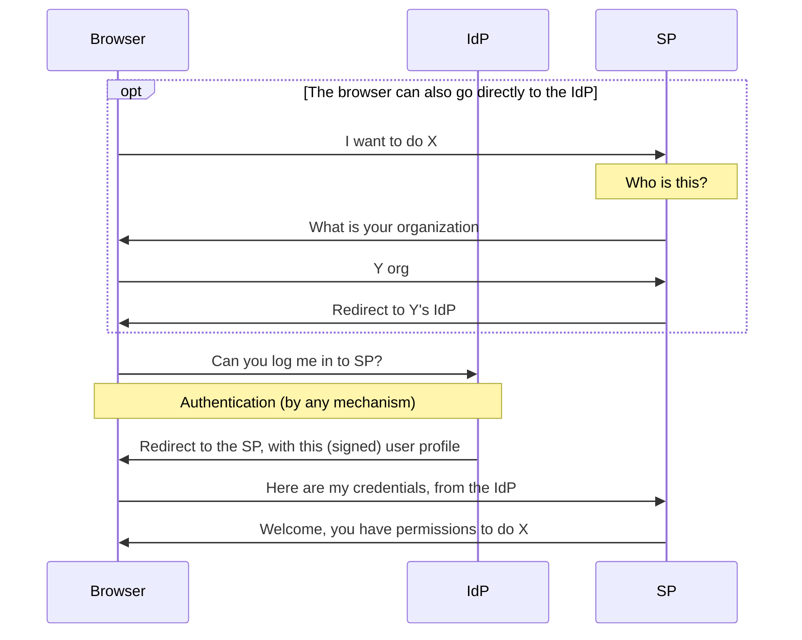
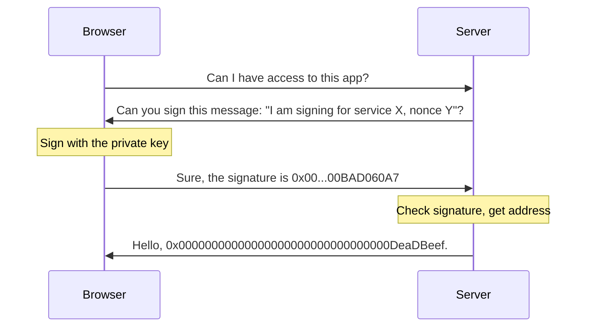
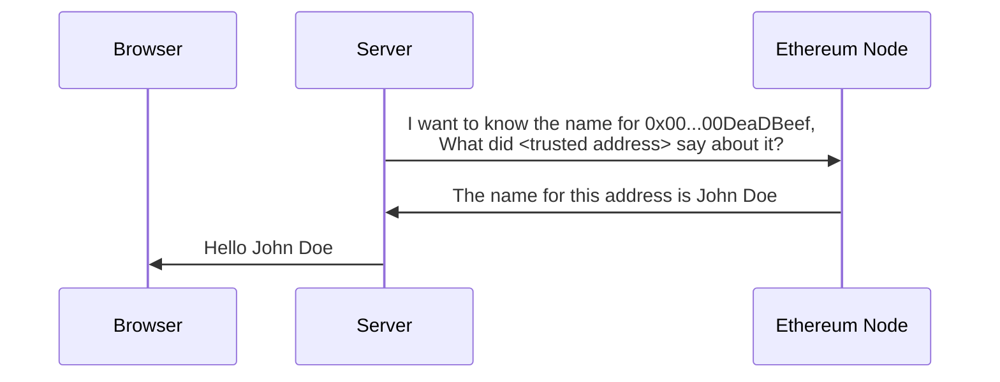

## Introduction

[SAML](https://www.onelogin.com/learn/saml) is a standard used on web2 to allow an [identity provider (IdP)](https://en.wikipedia.org/wiki/Identity_provider#SAML_identity_provider) to provide user information for [service providers (SP)](https://en.wikipedia.org/wiki/Service_provider_(SAML)).

In this tutorial you learn how to integrate Ethereum signatures with SAML to allow users to use their Ethereum wallets to authenticate themselves to web2 services that don't support Ethereum natively yet.

### SAML for Ethereum people

SAML is a centralized protocol. A service provider (SP) only accepts assertions (such as "this is my user John, he should have permissions to do A, B, and C") from an identity provider (IdP) if it has a pre-existing trust relationship with it.

For example, the SP can be a travel agency providing travel services to companies, and the IdP can be a company's internal web site. When employees need to book business travel, the travel agency sends them for authentication by the company before letting them actually book travel.



This is the way the three entities, the browser, SP, and IdP, negotiate for access. The SP does not need to know anything about the user using the browser in advance, just to trust the IdP.

### Ethereum for SAML people

Ethereum is a decentralized system. 



Users have a a private key (typically held in a browser extension). From the private key you can derive a public key, and from that a 20-byte address. When users need to log into a system, they are requested to sign a message with a nonce (a single-use value). The server can verify the signature was created by that address.



The signature only provides the address. To get other user attributes, you typically use [attestations](https://attest.org/). An attestation typically has these fields:

- **Attestor**, the address that made the attestation
- **Recipient**, the address to which the attestation applies
- **Data**, the data being attested, such as name, permissions, etc.
- **Schema**, the ID of the schema used to interpret the data.

Because of the decentralized nature of Ethereum, any user can make attestations. The attestor's identity is important to identify which attestations we want to consider reliable.

## Setup

Create keys with self-signed certificates.

See https://docs.openssl.org/master/man1/openssl-req/ . 

```sh
mkdir keys
cd keys
openssl req -new -x509 -days 365 -nodes -sha256 -out saml-sp.crt -keyout saml-sp.pem -subj /CN=sp/
openssl req -new -x509 -days 365 -nodes -sha256 -out saml-idp.crt -keyout saml-idp.pem -subj /CN=idp/
cd ..
```

1. Introduction: Why do this?
    1. SAML for Ethereum people
    1. Ethereum for SAML people
1. Setup
     1. Creating a SAML service provider (SP)
     1. Creating a (for now) traditional SAML identity provider (IdP)
1. Signing in
     1. Getting a signature through a wallet
     1. Using that signature for SAML
1. User attributes
     1. Why? The service provider might not know the user
     1. Getting user attributes from EAS
     1. Passing those user attributes to the SP.
1. Conclusion
      1. When is this a good solution?
      2. Using [MPC](https://ethresear.ch/c/cryptography/mpc/14) to remove the IdP's ability to cheat (just the idea, but I might implement it in a sequel article