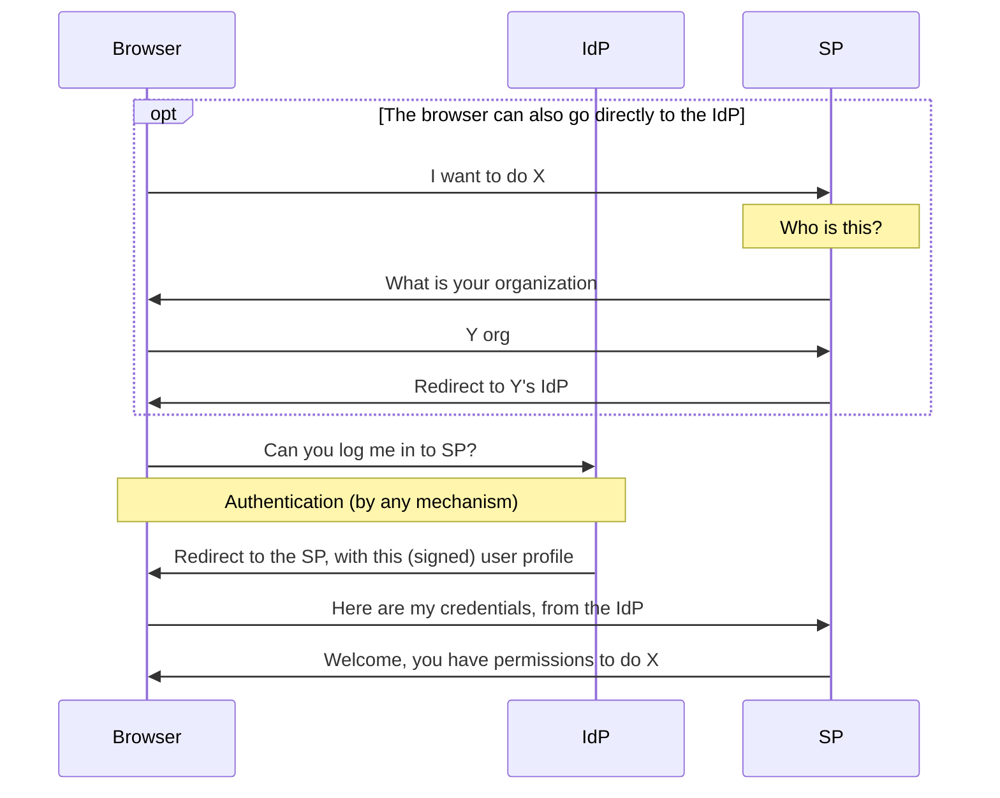
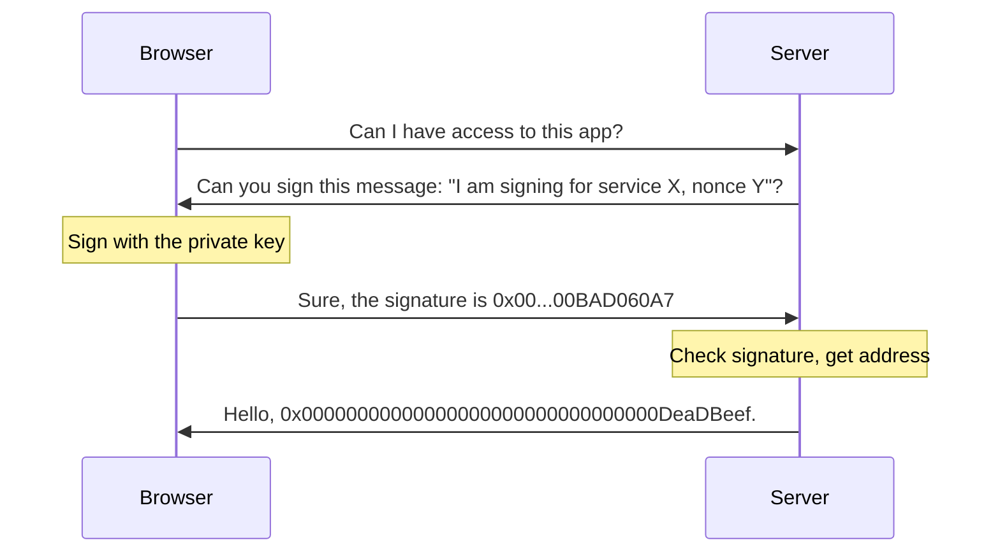
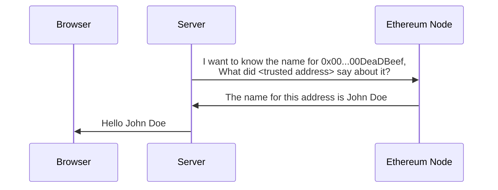

## Introduction

[SAML](https://www.onelogin.com/learn/saml) is a standard used on web2 to allow an [identity provider (IdP)](https://en.wikipedia.org/wiki/Identity_provider#SAML_identity_provider) to provide user information for [service providers (SP)](https://en.wikipedia.org/wiki/Service_provider_(SAML)).

In this tutorial you learn how to integrate Ethereum signatures with SAML to allow users to use their Ethereum wallets to authenticate themselves to web2 services that don't support Ethereum natively yet.

Note that this tutorial is written for two separate audiences:

- Ethereum people who understand Ethereum and need to learn SAML
- Web2 people who understand SAML and web2 authentication and need to learn Ethereum

As a result, it is going to contain a lot of introductory material that you already know. Feel free to skip it.

### SAML for Ethereum people

SAML is a centralized protocol. A service provider (SP) only accepts assertions (such as "this is my user John, he should have permissions to do A, B, and C") from an identity provider (IdP) if it has a pre-existing trust relationship either with it, or with the [certificate authority](https://www.ssl.com/article/what-is-a-certificate-authority-ca/) that signed that IdP's certificate.

For example, the SP can be a travel agency providing travel services to companies, and the IdP can be a company's internal web site. When employees need to book business travel, the travel agency sends them for authentication by the company before letting them actually book travel.



This is the way the three entities, the browser, SP, and IdP, negotiate for access. The SP does not need to know anything about the user using the browser in advance, just to trust the IdP.

### Ethereum for SAML people

Ethereum is a decentralized system. 



Users have a a private key (typically held in a browser extension). From the private key you can derive a public key, and from that a 20-byte address. When users need to log into a system, they are requested to sign a message with a nonce (a single-use value). The server can verify the signature was created by that address.



The signature only provides the address. To get other user attributes, you typically use [attestations](https://attest.org/). An attestation typically has these fields:

- **Attestor**, the address that made the attestation
- **Recipient**, the address to which the attestation applies
- **Data**, the data being attested, such as name, permissions, etc.
- **Schema**, the ID of the schema used to interpret the data.

Because of the decentralized nature of Ethereum, any user can make attestations. The attestor's identity is important to identify which attestations we want to consider reliable.

## Setup

The first step is to have SAML SP and IdP communicating between themselves.

1. Download the software. The sample software for this article is [on github](https://github.com/qbzzt/250420-saml-ethereum). Different stages are stored in different branches, for this stage you want `saml-only`

    ```sh
    git clone https://github.com/qbzzt/250420-saml-ethereum -b saml-only
    cd 250420-saml-ethereum
    pnpm install
    ```

2. Create keys with self-signed certificates. This means that the key is its own certificate authority, and needs to be imported manually to the service provider. See [the OpenSSL docs](https://docs.openssl.org/master/man1/openssl-req/) for more information. 

    ```sh
    mkdir keys
    cd keys
    openssl req -new -x509 -days 365 -nodes -sha256 -out saml-sp.crt -keyout saml-sp.pem -subj /CN=sp/
    openssl req -new -x509 -days 365 -nodes -sha256 -out saml-idp.crt -keyout saml-idp.pem -subj /CN=idp/
    cd ..
    ```

3. Start the servers

    ```sh
    pnpm start
    ```

4. Browse to the SP at URL [http://localhost:3000/](http://localhost:3000/) and click the button.

5. Provide the IdP with your e-mail address and click **Login to the service provider**. See that you get redirected to the service provider (port 3000) and that it knows you by your e-mail address.

### Detailed explanation

#### src/config.mts

```typescript
const fs = await import("fs")

const protocol="http"

export const spCert = fs.readFileSync("keys/saml-sp.crt").toString()
export const idpCert = fs.readFileSync("keys/saml-idp.crt").toString()

export const spPort = 3000
export const spHostname = "localhost"
export const spDir = "sp"

export const idpPort = 3001
export const idpHostname = "localhost"
export const idpDir = "idp"

export const spUrl = `${protocol}://${spHostname}:${spPort}/${spDir}`
export const idpUrl = `${protocol}://${idpHostname}:${idpPort}/${idpDir}`

export const spPublicData = {
    entityID: `${spUrl}/metadata`,
    wantAssertionsSigned: true,
    authnRequestsSigned: false,
    signingCert: spCert,
    allowCreate: true,
    assertionConsumerService: [{
        Binding: 'urn:oasis:names:tc:SAML:2.0:bindings:HTTP-POST',
        Location: `${spUrl}/assertion`,
    }]
  }

export const idpPublicData = {
    entityID: `${idpUrl}/metadata`,
    signingCert: idpCert,
    wantAuthnRequestsSigned: false,
    singleSignOnService: [{
      Binding: "urn:oasis:names:tc:SAML:2.0:bindings:HTTP-POST",
      Location: `${idpUrl}/login`
    }],
    singleLogoutService: [{
      Binding: "urn:oasis:names:tc:SAML:2.0:bindings:HTTP-POST",
      Location: `${idpUrl}/logout`
    }],
  }
```

#### src/SP.mts

```typescript
import * as config from "./config.mts"
const fs = await import("fs")
const saml = await import("samlify")
import * as validator from "@authenio/samlify-node-xmllint"
saml.setSchemaValidator(validator)
const express = (await import("express")).default
const spRouter = express.Router()
const app = express()

const spPrivateKey = fs.readFileSync("keys/saml-sp.pem").toString()

const sp = saml.ServiceProvider({
  privateKey: spPrivateKey,  
  ...config.spPublicData
})

const idp = saml.IdentityProvider(config.idpPublicData);

spRouter.get(`/metadata`, 
  (req, res) => res.header("Content-Type", "text/xml").send(sp.getMetadata())
)

spRouter.post(`/assertion`,
  async (req, res) => {
    // console.log(`SAML response:\n${Buffer.from(req.body.SAMLResponse, 'base64').toString('utf-8')}`)
    
    try {
      const loginResponse = await sp.parseLoginResponse(idp, 'post', req);
      res.send(`
        <html>
          <body>
            <h2>Hello ${loginResponse.extract.nameID}</h2>
          </body>
        </html>
      `)
      res.send();
    } catch (err) {
      console.error('Error processing SAML response:', err);
      res.status(400).send('SAML authentication failed');
    }
  }
)

spRouter.get('/login',
  async (req, res) => {
    const loginRequest = await sp.createLoginRequest(idp, "post")
    res.send(`
      <html>
        <body>
          <script>
            window.onload = function () { document.forms[0].submit(); }
          </script>
          
          <form method="post" action="${loginRequest.entityEndpoint}">
            <input type="hidden" name="${loginRequest.type}" value="${loginRequest.context}" />
          </form>
        </body>
      </html>
    `)    
  }
)

app.use(express.urlencoded({extended: true}))
app.use(`/${config.spDir}`, spRouter)

app.get("/", (req, res) => {
  res.send(`
    <html>
      <body>
        <button onClick="document.location.href='${config.spUrl}/login'">
           Click here to log on
        </button>
      </body>
    </html>
  `)
})

app.listen(config.spPort, () => {
  console.log(`service provider is running on http://${config.spHostname}:${config.spPort}`)
})
```

#### src/IdP.mts

```typescript
import * as config from "./config.mts"
const fs = await import("fs")
const saml = await import("samlify")
import * as validator from "@authenio/samlify-node-xmllint"
saml.setSchemaValidator(validator)
const express = (await import("express")).default
const app = express()
const xmlParser = new (await import("fast-xml-parser")).XMLParser(
  {
    ignoreAttributes: false, // Preserve attributes
    attributeNamePrefix: "@_", // Prefix for attributes
  }
)

const idpPrivateKey = fs.readFileSync("keys/saml-idp.pem").toString()

const idp = saml.IdentityProvider({
  privateKey: idpPrivateKey,  
  ...config.idpPublicData
})

const sp = saml.ServiceProvider(config.spPublicData)

const getLoginPage = requestId => `
<html>
  <head>
    <title>Login page</title>
  </head>
  <body>
    <h2>Login page</h2>
    <form method="post" action="./loginSubmitted">
      <input type="hidden" name="requestId" value="${requestId}" />
      Email address: <input name="email" />
      <br />
      <button type="Submit">
        Login to the service provider
      </button>
    </form>
  </body>
</html>
`

const idpRouter = express.Router()

idpRouter.post("/loginSubmitted", async (req, res) => {
  const loginResponse = await idp.createLoginResponse(
    sp, 
    {
      authnContextClassRef: 'urn:oasis:names:tc:SAML:2.0:ac:classes:PasswordProtectedTransport',
      audience: sp.entityID,
      extract: {
        request: {
          id: req.body.requestId
        }
      },
      signingKey: { privateKey: idpPrivateKey, publicKey: config.idpCert }  // Ensure signing
    },
    "post",
    {
      email: req.body.email
    }
  );

  // const samlResponseDecoded = Buffer.from(loginResponse.context, "base64").toString("utf8");
  // console.log("Decoded SAML Response:", samlResponseDecoded);

  res.send(`
    <html>
      <body>
        <script>
          window.onload = function () { document.forms[0].submit(); }
        </script>
        
        <form method="post" action="${loginResponse.entityEndpoint}">
          <input type="hidden" name="${loginResponse.type}" value="${loginResponse.context}" />
        </form>
      </body>
    </html>
  `)

})

// IdP endpoint for login requests
idpRouter.post(`/login`,
  async (req, res) => {
    try {
      // Workaround because I couldn't get parseLoginRequest to work.
      // const loginRequest = await idp.parseLoginRequest(sp, 'post', req)
      const samlRequest = xmlParser.parse(Buffer.from(req.body.SAMLRequest, 'base64').toString('utf-8'))
      res.send(getLoginPage(samlRequest["samlp:AuthnRequest"]["@_ID"]))
    } catch (err) {
      console.error('Error processing SAML response:', err);
      res.status(400).send('SAML authentication failed');
    }
  }
)

idpRouter.get(`/metadata`, 
  (req, res) => res.header("Content-Type", "text/xml").send(idp.getMetadata())
)

app.use(express.urlencoded({extended: true}))
app.use(`/${config.idpDir}`, idpRouter)

app.get("/", (req, res) => {
  res.send(`
    <html>
      <body>
        <button onClick="document.location.href='${config.spUrl}/login'">
           Click here to log on
        </button>
      </body>
    </html>
  `)
})

app.listen(config.idpPort, () => {
  console.log(`identity provider is running on http://${config.idpHostname}:${config.idpPort}`)
})
```


1. Setup
     1. Creating a SAML service provider (SP)
     1. Creating a (for now) traditional SAML identity provider (IdP)
1. Signing in
     1. Getting a signature through a wallet
     1. Using that signature for SAML
1. User attributes
     1. Why? The service provider might not know the user
     1. Getting user attributes from EAS
     1. Passing those user attributes to the SP.
1. Conclusion
      1. When is this a good solution?
      2. Using [MPC](https://ethresear.ch/c/cryptography/mpc/14) to remove the IdP's ability to cheat (just the idea, but I might implement it in a sequel article)