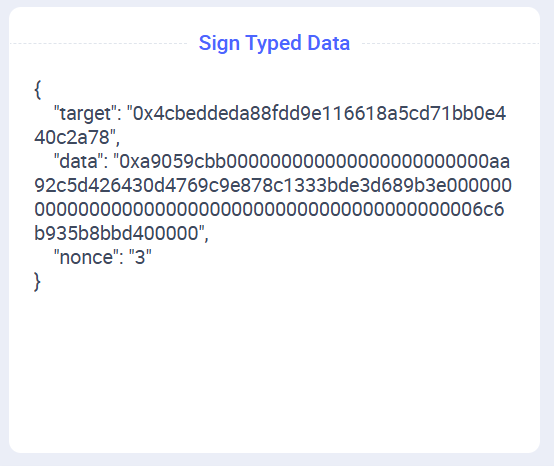

## Introduction {#introduction}

A [previous article](/developers/tutorials/gasless) discussed using gasless access to your own application using EIP-712 signatures, but it is limited to your own smart contracts. Using [account abstraction](/roadmap/account-abstraction), we can create smart contract wallets that accept two types of transactions, and relay them to a requested destination:

- Transactions sent by a specific EOA (which require that EOA to have ETH)
- Transactions sent from anywhere, but signed by the same EOA. This way, we can provide a gasless way for an account to hold assets (tokens, etc.) and perform all the functions an EOA with gas can.

This way, we can provide a gasless way for an account to hold assets (tokens, etc.) and perform all the functions an EOA with gas can.

### Why we can't just relay request {#why-no-tx-origin}

GOON

## Seeing it in action {#in-action}

1. Ensure you have both [Node](https://nodejs.org/en/download) and [Foundry](https://www.getfoundry.sh/introduction/installation).

2. Clone the application and install the necessary software.

    ```sh
    git clone https://github.com/qbzzt/260315-gasless-tokens.git
    cd 260315-gasless-tokens
    forge build
    cd server
    npm install
    ```

3. Edit `.env` to set `SEPOLIA_PRIVATE_KEY` to a wallet that has ETH on Sepolia. If you need Sepolia ETH, [use a faucet](https://cloud.google.com/application/web3/faucet/ethereum/sepolia). Ideally, this private key should be different from the one you have in your browser wallet.

4. Start the server.

    ```sh
    npm run dev
    ```

5. Browse to the application at URL [`http://localhost:5173`](http://localhost:5173).

6. Click **Connect with Injected** to connect to a wallet. Approve in the wallet, and approve the change to Sepolia if necessary.

7. Scroll down and click **Deploy UserProxy (slow process)**.

8. You can see when the user proxy is deployed because there is an address next to **UserProxy access**. If you waited 24 seconds (2 blocks) and it still hasn't happened, there might be a problem with detecting changes. 

    If that is the case, go to the [Sepolia Explorer](https://eth-sepolia.blockscout.com/) and enter the deployment transaction hash you see in the output of the server at `npm run dev`. Click the contract that was created to see its address and copy it. Paste the address in the *Or enter existing proxy address* field and then click **Set proxy address**.

9. Click **Request more tokens for proxy** to submit a call to the ERC-20 contract's [`faucet`](https://eth-sepolia.blockscout.com/address/0x4cBedDEDA88fDd9e116618a5cD71BB0E440C2A78?tab=read_write_contract#0xde5f72fd) function to get tokens. **Confirm** the signature in the wallet. Of course, the tokens get to the address of the proxy, not the user.

10. Scroll down and click the link under *Last transaction:*. This will open the browser to show you the `faucet` transaction.

11. In the *amount to transfer* enter a number between one and one thousand. Click **Transfer** to transfer the tokens to your own address. Before you click **Confirm** for the request, see that the data being signed is opaque. Users would have a hard time understanding what they are signing. Remember that, we will discuss it [below](#conclusion).

    

12. After the transaction is confirmed, wait to see the change in both *your balance* and *proxy balance*. Note that this will also take some time, because Sepolia has a block time of 12 seconds.

## How it works {#how-work}

For a gasless experience we have to have a user interface for the user, a relayer to get messages from the user interface to the chain, and a smart contract that receives and verifies the messages.

### The wallet smart contract {#wallet-smart-contract}

This is [the smart contract](https://github.com/qbzzt/260315-gasless-tokens/blob/main/contracts/src/UserProxy.sol). Its purpose is to do whatever is requested by the real owner, regardless of the channel used to request it, and ignore everything else. To do this, its functions receive a `target` address to call and the `data` to used to call it.

```solidity
// SPDX-License-Identifier: MIT
pragma solidity ^0.8.21;

contract UserProxy {
    address immutable OWNER;
    uint public nonce = 0;
```

The owner's identity and a [nonce](https://en.wikipedia.org/wiki/Cryptographic_nonce) to prevent messages being repeated. Because the nonce is a `public` variable, the Solidity compiler also creates a view function, [`nonce()`](https://eth-sepolia.blockscout.com/address/0x9Ba259C15B46ee4b72dEf7b93D85Ec18f5f6e50E?tab=read_write_contract#0xaffed0e0), that lets offchain code read the value.

```solidity
    bytes32 private constant SIGNED_ACCESS_TYPEHASH =
        keccak256("SignedAccess(address target,bytes data,uint256 nonce)");

    bytes32 private constant SIGNED_ACCESS_PAYABLE_TYPEHASH =
        keccak256("SignedAccessPayable(address target,bytes data,uint256 nonce,uint256 value)");

    bytes32 immutable DOMAIN_SEPARATOR;      
```

The information requires to process [ERC-712 signatures](https://eips.ethereum.org/EIPS/eip-712). 

```solidity
    constructor(address owner_) {
        OWNER = owner_;
```

A `UserProxy` is tied to a single owner address. This is necessary because it can own assets (ERC-20 tokens, NFTs, etc.). We don't want to intermingle assets belonging to different owners.

```solidity
        DOMAIN_SEPARATOR = keccak256(
            abi.encode(
                keccak256(
                    "EIP712Domain(string name,string version,uint256 chainId,address verifyingContract)"
                ),
                keccak256(bytes("UserProxy")),
                keccak256(bytes("1")),
                block.chainid,
                address(this)
            )
        );        
    }
```

The [domain separator](https://eips.ethereum.org/EIPS/eip-712#definition-of-domainseparator). It cannot be calculated at compile time, because it depends on the chain ID and the contract address. This makes it impossible for one `UserProxy` to be fooled by a message prepared for another.

```solidity
    event CallResult(address target, bytes returnData);
```

Log the results of a call.

```solidity
    function directAccess(address target, bytes calldata data) 
            external returns (bytes memory) {
```

This function can be called directly by the owner. If there are no relays available, the owner can still get to the assets by using the blockchain directly (if the user can get ETH).

```solidity
        require(msg.sender == OWNER, "Only owner can call");
        (bool success, bytes memory returnData) = target.call(data);
        require(success, "Call failed");

        emit CallResult(target, returnData);

        return returnData;
    }
```    

If we were called *directly* by the owner, call the target with the calldata provided.

```solidity
    function signedAccess(
        address target, 
        bytes calldata data,
        uint8 v, 
        bytes32 r, 
        bytes32 s) 
```

This is the main function of `UserProxy`. It gets `target` and `data`, as well as a signature.

```solidity
    external returns (bytes memory) {
        // Compute EIP-712 digest
        bytes32 digest = keccak256(
            abi.encodePacked(
                "\x19\x01",
                DOMAIN_SEPARATOR,
                keccak256(
                    abi.encode(
                        SIGNED_ACCESS_TYPEHASH,
                        target,
                        keccak256(data),
                        nonce
                    )
                )
            )
        );
    ```

    The digest also includes the nonce, but we do not need to receive it from the transaction, we already know the right value. A signature with the wrong nonce will be rejected.

    ```solidity

        // Recover signer
        address signer = ecrecover(digest, v, r, s);
        require(signer == OWNER, "Signature invalid or not by owner");
    ```

    If the signature is invalid, `ecrecover` will return a different address and it will not be accepted.

    ```solidity
        (bool success, bytes memory returnData) = target.call(data);
        require(success, "Call failed");

        emit CallResult(target, returnData);

        nonce++; // Increment nonce to prevent replay

        return returnData;
    }

```solidity
    function directAccessPayable(address target, uint value, bytes calldata data) 
            external payable returns (bytes memory) {
        .
        .
        .
    }

    function signedAccessPayable(
        .
        .
        .
    }
}
```

These are nearly identical variants that let you also transfer ETH out of the contract.

### The relayer {#relayer}

The relayer is a [server component](https://ethereum.org/developers/tutorials/server-components/). It is written in JavaScript, you can see the source code [here](https://github.com/qbzzt/260315-gasless-tokens/blob/main/server/index.js)

```javascript
import express from "express";
import { createServer as createViteServer } from "vite";
import { createWalletClient, createPublicClient, http } from 'viem'
import { privateKeyToAccount } from 'viem/accounts'
import { sepolia } from 'viem/chains'
import dotenv from 'dotenv'
```

The libraries we need. This is an [Express](https://expressjs.com/) server, which uses [Vite](https://vite.dev/) to serve the user interface code. We use [Viem](https://viem.sh/) to communicate with the blockchain, and [dotenv](https://www.dotenv.org/) to read the private key for the address that sends the transaction.

```javascript
import { createRequire } from 'module'
const require = createRequire(import.meta.url)
const UserProxy = require('../contracts/out/UserProxy.sol/UserProxy.json')
```

This is a simple way to read the compiled `UserProxy`. We need it for the ABI, to be able to call `UserProxy`, and for the actual compiled code, to be able to deploy it for a user.

```javascript
dotenv.config()
const sepoliaAccount = privateKeyToAccount(process.env.SEPOLIA_PRIVATE_KEY)
console.log("Using account:", sepoliaAccount.address)
```

Read `.env`, get the address, and report it to the console.

```javascript
const sepoliaClient = createWalletClient({
  account: sepoliaAccount,
  chain: sepolia,
  transport: http("https://rpc.sentio.xyz/sepolia"),
})

const publicClient = createPublicClient({
  chain: sepolia,
  transport: http(),
})
```

The Viem clients to talk to the blockchain.

```javascript
const start = async () => {
  const app = express()
```

Run an Express server.

```javascript
  app.use(express.json())
```

Tell Express to read the request body, and if it's JSON to parse it.

```javascript
  app.post("/server/deploy", async (req, res) => {
```

This is the code that handles requests to deploy the proxy. Note that in we are vulnerable to [denial of service](https://en.wikipedia.org/wiki/Denial-of-service_attack) attacks here, because an attacker can spam us with requests to deploy the proxy until our ETH is exhausted. On a production system we'd probably require the request to deploy the proxy to be signed, and verify the signer is an existing customer.

```javascript
    try {
      const ownerAddress = req.body.ownerAddress
```

Get the owner address from the request. 

```javascript
      const txHash = await sepoliaClient.deployContract({
        abi: UserProxy.abi,
        bytecode: UserProxy.bytecode.object,
        args: [ownerAddress],
        account: sepoliaAccount,
      })      

      console.log("Deployment transaction hash:", txHash)

      const receipt = await publicClient.waitForTransactionReceipt({
        hash: txHash,
      })
```

[Deploy the contract](https://viem.sh/docs/contract/deployContract#deploycontract) and [wait until it is deployed](https://viem.sh/docs/actions/public/waitForTransactionReceipt).

```js
      res.json({ contractAddress: receipt.contractAddress })
```

If everything is fine, return to the user interface the address of the proxy.

```js
    } catch (err) {
      console.error(err)
      res.status(500).json({ error: err.message })
    }
  })
```  

If there's a problem, report it.

```js
  app.post("/server/message", async (req, res) => {
```

This is the code that handles messages from the user to the proxy. This is another point that is vulnerable to a denial of service. 

```js
    try {
      const { proxy, target, data, v, r, s } = req.body

      const txHash = await sepoliaClient.writeContract({
        address: proxy,
        abi: UserProxy.abi,
        functionName: 'signedAccess',
        args: [target, data, v, r, s],
        account: sepoliaAccount,
      })
```

Get the request data and use it to call `signedAccess` on the proxy.

```
      console.log("Message transaction hash:", txHash)

      res.json({ txHash })
```

Report back the transaction hash. This lets the UI display for the user a URL to check on the transaction.

```js
    } catch (err) {
      console.error(err)
      res.status(500).json({ error: err.message })
    }
  })
```

Again, if there is a problem, report it.


```js
  // Let Vite handle everything else
  const vite = await createViteServer({
    server: { middlewareMode: true }
  })

  app.use(vite.middlewares)

  app.listen(5173, () => {
    console.log("Dev server running on http://localhost:5173");
  })
}

start()
```

For everything else, use Vite, which handles serving the user interface for us.

### User interface {#user-interface}

[This is the user interface code](https://github.com/qbzzt/260315-gasless-tokens/tree/main/server/src). Most of the code is nearly identical to the code documented in [this article](/developers/tutorials/creating-a-wagmi-ui-for-your-contract/#file-walk-through), with the exception of [`Token.jsx`](https://github.com/qbzzt/260315-gasless-tokens/blob/main/server/src/Token.jsx).

Parts of [`Token.jsx`] are similar to [`Greeter.jsx`](https://github.com/qbzzt/260301-gasless/blob/main/server/src/Greeter.jsx) in [this article](/developers/tutorials/gasless#ui-changes). Here are the new parts.

```js
import {
   encodeFunctionData 
       } from 'viem'
```

[This function](https://viem.sh/docs/contract/encodeFunctionResult) creates the calldata for an EVM function call. This is necessary so the user can sign the calldata.

```js
import UserProxy from '../../contracts/out/UserProxy.sol/UserProxy.json'
```

The `UserProxy`, explained above.

```js
import Erc20 from '../../contracts/out/Faucet.sol/FaucetToken.json'
```

[This contract](https://eth-sepolia.blockscout.com/address/0x4cBedDEDA88fDd9e116618a5cD71BB0E440C2A78?tab=contract) is mostly a normal ERC-20 contract, with the addition of one important function, `faucet()`. This function gives tokens to whoever asks for them for testing purposes.

```js
const erc20Addrs = {
  // Sepolia
    11155111: '0x4cBedDEDA88fDd9e116618a5cD71BB0E440C2A78'
}
```

The address for `FaucetToken`.

```js
const Address = ({ address }) => {
   if (!address) return null
   return (
      <a href={`https://eth-sepolia.blockscout.com/address/${address}?tab=read_write_contract`} target="_blank">{address}</a>
   )
}
```

This component outputs an address with a link to the contract on a block explorer.

```js
const Token = () => {  
    ...
```

This is the main component that does most of the work. 

```js
  const [ balanceAmount, setBalanceAmount ] = useState("Loading...")
```

The token balance of the user address.

```js
  const [ proxyAddr, setProxyAddr ] = useState(null)
```

The address of a proxy owned by the user. 

```js
  const [ proxyBalanceAmount, setProxyBalanceAmount ] = useState("Loading...")
```

The proxy's token balance.

```js
  const [ newProxyAddr, setNewProxyAddr ] = useState("")
```

This field is used when the user sets the proxy address manually. 

```js
  const [ txHash, setTxHash ] = useState(null)
```

The hash of the last transaction, used to show a link to the explorer so the user can check of that transaction.

```js
  const [ transferToken, setTransferToken ] = useState("")
  const [ transferAmount, setTransferAmount ] = useState("")
  const [ transferTo, setTransferTo ] = useState("")
```

These fields are all used to send token transfer commands to an ERC-20 contract. This may be `FaucetToken`, but it does not have to be. It's the same function called, specified in the ERC-20 standard.

```js
  const balance = useReadContract({
    ...
  })


  const proxyBalance = useReadContract({
    ...
  })
```

Read the two token balances we are interested in.

```js
  const nonce = useReadContract({
      address: proxyAddr,
      abi: UserProxy.abi,
      functionName: 'nonce',
      args: [],
  })
```  

  useEffect(() => {
    if (balance?.status === "success")
      setBalanceAmount(balance.data / 10n**18n)
    else
      setBalanceAmount("Loading...")  
  }, [balance])

  useEffect(() => {
    if (proxyBalance?.status === "success")
      setProxyBalanceAmount(proxyBalance.data / 10n**18n)
    else
      setProxyBalanceAmount("Loading...")  
  }, [proxyBalance])

  useEffect(() => {
    setTransferToken(faucetAddr)
  }, [faucetAddr])

  useEffect(() => {
    setTransferTo(account.address)
  }, [account.address])

  const proxyAddressChange = (evt) => setNewProxyAddr(evt.target.value)
  const transferTokenChange = (evt) => setTransferToken(evt.target.value)  
  const transferToChange = (evt) => setTransferTo(evt.target.value)  
  const transferAmountChange = (evt) => setTransferAmount(evt.target.value)  

  const deployUserProxy = async () => {
    try {
      const response = await fetch("/server/deploy", {
        method: "POST",
        headers: { "Content-Type": "application/json" },
        body: JSON.stringify({ ownerAddress: account.address })
      })
      const data = await response.json()
      setProxyAddr(data.contractAddress)
    } catch (err) {
      console.error("Error:", err)
    }
  }

  const signMessage = async(proxyAddr, calldata) => {
    const domain = {
        name: "UserProxy",
        version: "1",
        chainId,
        verifyingContract: proxyAddr,
    }

    const types = {
      SignedAccess: [
        { name: "target", type: "address" },
        { name: "data", type: "bytes" },          
        { name: "nonce", type: "uint256" },
      ],
    }

    const signature = await signTypedDataAsync({
      domain,
      types,
      primaryType: "SignedAccess",
      message: {
         target: faucetAddr,
         data: calldata,
         nonce: nonce.data,
      }
    })

    const r = `0x${signature.slice(2, 66)}`
    const s = `0x${signature.slice(66, 130)}`
    const v = parseInt(signature.slice(130, 132), 16)    

    return {v, r, s}
  }

  const messageUserProxy = async (proxy, target, data, v, r, s) => {
    try {
      const response = await fetch("/server/message", {
        method: "POST",
        headers: { "Content-Type": "application/json" },
        body: JSON.stringify({
          proxy, target,  // both addresses
          data,           // calldata to send target
          v, r, s         // signature
        })
      })
      const serverResponse = await response.json()
      setTxHash(serverResponse.txHash)
    } catch (err) {
      console.error("Error:", err)
    }
  }

  const faucetSimulation = useSimulateContract({
    address: faucetAddr,
    abi: Erc20.abi,
    functionName: 'faucet',
    account: account.address
  })

  const proxyFaucet = async () => {
    const calldata = encodeFunctionData({
      abi: Erc20.abi,
      functionName: 'faucet',
      args: [],
    })

    const {v, r, s} = await signMessage(proxyAddr, calldata)
    messageUserProxy(proxyAddr, faucetAddr, calldata, v, r, s)
  }

  const proxyTransfer = async () => {
    const calldata = encodeFunctionData({
      abi: Erc20.abi,
      functionName: 'transfer',
      args: [transferTo, BigInt(transferAmount) * 10n**18n],
    })

    const {v, r, s} = await signMessage(proxyAddr, calldata)
    messageUserProxy(proxyAddr, faucetAddr, calldata, v, r, s)
  }  

  return (
    <>
      <div align="left">
         <h2>Token</h2>
         <h4>Token contract address <Address address={faucetAddr} /></h4>
         <hr />
         <h4>Direct access (as <Address address={account?.address} />)</h4>
         Your balance: {balanceAmount}
         <br />
         <button disabled={!faucetSimulation.data}
               onClick={() => writeContract(
                  faucetSimulation.data.request
               )}
         >
         Request more tokens
         </button>
         <hr />
         <h4>UserProxy access <Address address={proxyAddr} /></h4>
         <button onClick={deployUserProxy}>
         Deploy UserProxy (slow process)
         </button>
         <br /><br />
         <input type="text" placeholder="Or enter existing proxy address" value={newProxyAddr} onChange={proxyAddressChange} />
         <br /><br />
         <button 
            onClick={() => setProxyAddr(newProxyAddr)}
            disabled={newProxyAddr.match(/^0x[a-fA-F0-9]{40}$/) === null}
         >
            Set proxy address
         </button>
         <br /><br />
         { proxyAddr && (
            <>
               Proxy balance: {proxyBalanceAmount}
               <br />
               Proxy nonce: {nonce?.data?.toString() ?? "Loading..."}
               <br />
               <button disabled={!proxyAddr || proxyAddr === "Loading..." || nonce?.status !== 'success'} 
                  onClick={proxyFaucet}
               >
                  Request more tokens for proxy
               </button>
               <hr />
               <h4>Transfer tokens from proxy</h4>
               <ul>
                  <li> Token to transfer: <input type="text" placeholder="Token to transfer" value={transferToken} onChange={transferTokenChange} /> </li>
                  <li> Recipient address: <input type="text" placeholder="Recipient address" value={transferTo} onChange={transferToChange} /> </li>
                  <li> Amount to transfer: <input type="number" placeholder="Amount to transfer" value={transferAmount} onChange={transferAmountChange} /> </li>
               </ul>
               <button disabled={!proxyAddr || proxyAddr === "Loading..." || nonce?.status !== 'success'} 
                  onClick={proxyTransfer}
               >
                  Transfer
               </button>               
            </>
         )}   
         <hr />
         { txHash && (
            <>
               <h4>Last transaction:</h4>
               <a href={`https://eth-sepolia.blockscout.com/tx/${txHash}`} target="_blank">
                 {txHash}
               </a>
            </>
         )}
      </div>
    </>
  )
}

export {Token}
```

#### The opaque signature issue {#opaque-signature}

## Conclusion {#conclusion}


7702, 4337, and 1271.