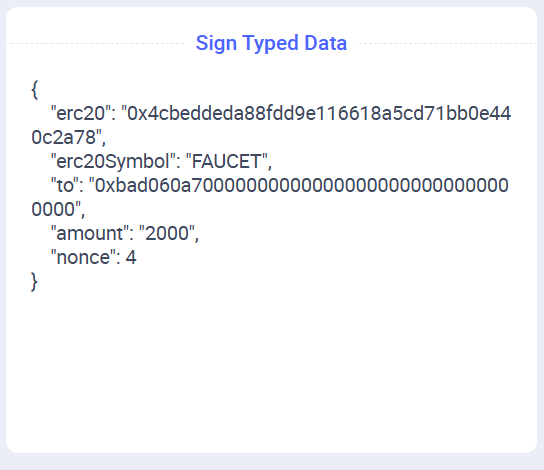
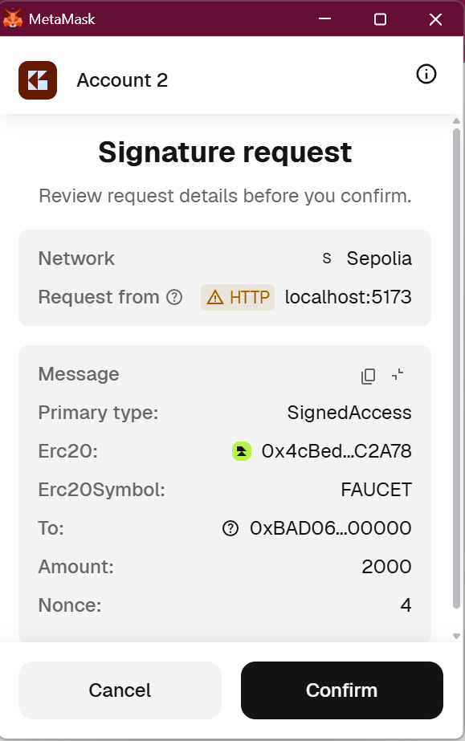

## Introduction {#introduction}

A [previous article](/developers/tutorials/gasless) discussed using gasless access to your own application using EIP-712 signatures, but it is limited to your own smart contracts. Using [account abstraction](/roadmap/account-abstraction), we can create smart contract wallets that accept two types of transactions and relay them to a requested destination:

- Transactions sent by a specific EOA (which require that EOA to have ETH)
- Transactions sent from anywhere, but signed by the same EOA. This way, we can provide a gasless way for an account to hold assets (tokens, etc.) and perform all the functions an EOA with gas can.

This way, we can provide a gasless way for an account to hold assets (tokens, etc.) and perform all the functions an EOA with gas can.

### Why can't we just relay the request? {#why-no-tx-origin}

In ERC-20 and related standards, the account owner is [`msg.sender`](https://docs.soliditylang.org/en/latest/cheatsheet.html#block-and-transaction-properties), the address that called the token contract, which is not necessarily the originator of the transaction, (`tx.sender`)[https://docs.soliditylang.org/en/latest/cheatsheet.html#block-and-transaction-properties]. This is required for [security reasons](https://docs.soliditylang.org/en/v0.8.35-pre.1/security-considerations.html#tx-origin). This means that if we relay token transfer requests, they'll attempt to transfer tokens from the relayer's address rather than an address controlled by the user.

There is a solution that lets you use the EOA address via [EIP-7702](https://eip7702.io/), but it requires signing a potentially dangerous delegation, so you can only use it to delegate to a smart contract of which the wallet provider approves. For this tutorial I prefer the much simpler method of creating a smart contract as a proxy to the user.

## Seeing it in action {#in-action}

1. Ensure you have both [Node](https://nodejs.org/en/download) and [Foundry](https://www.getfoundry.sh/introduction/installation).

2. Clone the application and install the necessary software.

    ```sh
    git clone https://github.com/qbzzt/260315-gasless-tokens.git
    cd 260315-gasless-tokens
    forge build
    cd server
    npm install
    ```

3. Edit `.env` to set `SEPOLIA_PRIVATE_KEY` to a wallet that has ETH on Sepolia. If you need Sepolia ETH, [use a faucet](https://cloud.google.com/application/web3/faucet/ethereum/sepolia) to get it. Ideally, this private key should be different from the one you have in your browser wallet.

4. Start the server.

    ```sh
    npm run dev
    ```

5. Browse to the application at URL [`http://localhost:5173`](http://localhost:5173).

6. Click **Connect with Injected** to connect to a wallet. Approve in the wallet, and approve the change to Sepolia if necessary.

7. Scroll down and click **Deploy UserProxy (slow process)**.

8. You can see when the user proxy is deployed because there is an address next to **UserProxy access**. If you waited 24 seconds (2 blocks) and it still hasn't happened, there might be a problem with detecting changes. 

    If that is the case, go to the [Sepolia Explorer](https://eth-sepolia.blockscout.com/) and enter the deployment transaction hash you see in the server output at `npm run dev`. Click the created contract to view its address, then copy it. Click the contract that was created to see its address and copy it. Paste the address in the *Or enter existing proxy address* field, then click **Set proxy address**.

9. Click **Request more tokens for proxy** to submit a call to the ERC-20 contract's [`faucet`](https://eth-sepolia.blockscout.com/address/0x4cBedDEDA88fDd9e116618a5cD71BB0E440C2A78?tab=read_write_contract#0xde5f72fd) function to get tokens. **Confirm** the signature in the wallet. Of course, the tokens reach the proxy's address, not the user's.

10. Scroll down and click the link under *Last transaction:*. This will open the browser to show you the `faucet` transaction.

11. In the *amount to transfer*, enter a number between one and one thousand. Click **Transfer** to transfer the tokens to your own address. Before you click **Confirm** for the request, see that the data being signed is opaque. Users would have a hard time understanding what they are signing. Remember that we will discuss it [below](#vulnerabilities).

12. After the transaction is confirmed, wait to see the change in both *your balance* and *proxy balance*. Note that this will also take some time, because Sepolia has a block time of 12 seconds.

## How it works {#how-work}

For a gasless experience, we need a user interface for the user, a server to route messages from the user interface to the chain, and a smart contract to receive and verify them.

### The wallet smart contract {#wallet-smart-contract}

This is [the smart contract](https://github.com/qbzzt/260315-gasless-tokens/blob/main/contracts/src/UserProxy.sol). Its purpose is to do whatever the real owner requests, regardless of the channel used to request it, and ignore everything else. To do this, its functions receive a target address to call and the data to use to call it.

```solidity
// SPDX-License-Identifier: MIT
pragma solidity ^0.8.21;

contract UserProxy {
    address immutable OWNER;
    uint public nonce = 0;
```

The owner's identity and a [nonce](https://en.wikipedia.org/wiki/Cryptographic_nonce) to prevent messages from being repeated. Because the nonce is a `public` variable, the Solidity compiler also creates a view function, [`nonce()`](https://eth-sepolia.blockscout.com/address/0x9Ba259C15B46ee4b72dEf7b93D85Ec18f5f6e50E?tab=read_write_contract#0xaffed0e0), that allows offchain code to read its value.

```solidity
    bytes32 private constant SIGNED_ACCESS_TYPEHASH =
        keccak256("SignedAccess(address target,bytes data,uint256 nonce)");

    bytes32 private constant SIGNED_ACCESS_PAYABLE_TYPEHASH =
        keccak256("SignedAccessPayable(address target,bytes data,uint256 nonce,uint256 value)");

    bytes32 immutable DOMAIN_SEPARATOR;      
```

The information required to verify [ERC-712 signatures](https://eips.ethereum.org/EIPS/eip-712). 

```solidity
    constructor(address owner_) {
        OWNER = owner_;
```

A `UserProxy` is tied to a single owner address. This is necessary because it can own assets (ERC-20 tokens, NFTs, etc.). We don't want to intermingle assets belonging to different owners.

```solidity
        DOMAIN_SEPARATOR = keccak256(
            abi.encode(
                keccak256(
                    "EIP712Domain(string name,string version,uint256 chainId,address verifyingContract)"
                ),
                keccak256(bytes("UserProxy")),
                keccak256(bytes("1")),
                block.chainid,
                address(this)
            )
        );        
    }
```

The [domain separator](https://eips.ethereum.org/EIPS/eip-712#definition-of-domainseparator). It cannot be calculated at compile time, because it depends on the chain ID and the contract address. This makes it impossible for a UserProxy to be fooled by a message prepared for another.

```solidity
    event CallResult(address target, bytes returnData);
```

Log the results of a call.

```solidity
    function directAccess(address target, bytes calldata data) 
            external returns (bytes memory) {
```

This function can be called directly by the owner. If no relays are available, the owner can still access the assets directly on the blockchain (if the user has ETH).

```solidity
        require(msg.sender == OWNER, "Only owner can call");
        (bool success, bytes memory returnData) = target.call(data);
        require(success, "Call failed");

        emit CallResult(target, returnData);

        return returnData;
    }
```    

If we are called *directly* by the owner, call the target with the provided calldata.

```solidity
    function signedAccess(
        address target, 
        bytes calldata data,
        uint8 v, 
        bytes32 r, 
        bytes32 s) 
```

This is `UserProxy`'s main function. It gets `target` and `data`, as well as a signature.

```solidity
    external returns (bytes memory) {
        // Compute EIP-712 digest
        bytes32 digest = keccak256(
            abi.encodePacked(
                "\x19\x01",
                DOMAIN_SEPARATOR,
                keccak256(
                    abi.encode(
                        SIGNED_ACCESS_TYPEHASH,
                        target,
                        keccak256(data),
                        nonce
                    )
                )
            )
        );
```

The digest also includes the nonce, but we do not need to receive it from the transaction; we already know the right value. A signature with the wrong nonce will be rejected.

```solidity

    // Recover signer
    address signer = ecrecover(digest, v, r, s);
    require(signer == OWNER, "Signature invalid or not by owner");
```

If the signature is invalid, `ecrecover` will usually return a different address, and it will not be accepted.

```solidity
    (bool success, bytes memory returnData) = target.call(data);
    require(success, "Call failed");
```

Call the contract the user told us to call, and revert if not successful.

```solidity
    emit CallResult(target, returnData);

    nonce++; // Increment nonce to prevent replay

    return returnData;
}
```

If successful, emit a log event and increment the nonce.

```solidity
    function directAccessPayable(address target, uint value, bytes calldata data) 
            external payable returns (bytes memory) {
        .
        .
        .
    }

    function signedAccessPayable(
        .
        .
        .
    }
}
```

These are nearly identical variants that let you also transfer ETH out of the contract.

### The relayer {#relayer}

The relayer is a [server component](https://ethereum.org/developers/tutorials/server-components/). It is written in JavaScript; you can see the source code [here](https://github.com/qbzzt/260315-gasless-tokens/blob/main/server/index.js)

```javascript
import express from "express";
import { createServer as createViteServer } from "vite";
import { createWalletClient, createPublicClient, http } from 'viem'
import { privateKeyToAccount } from 'viem/accounts'
import { sepolia } from 'viem/chains'
import dotenv from 'dotenv'
```

The libraries we need. This is an [Express](https://expressjs.com/) server, which uses [Vite](https://vite.dev/) to serve the user interface code. We use [Viem](https://viem.sh/) to communicate with the blockchain, and [dotenv](https://www.dotenv.org/) to read the private key for the address that sends the transaction.

```javascript
import { createRequire } from 'module'
const require = createRequire(import.meta.url)
const UserProxy = require('../contracts/out/UserProxy.sol/UserProxy.json')
```

This is a simple way to read the compiled `UserProxy`. We need the ABI to be able to call `UserProxy`, and the compiled code to be able to deploy it for a user.

```javascript
dotenv.config()
const sepoliaAccount = privateKeyToAccount(process.env.SEPOLIA_PRIVATE_KEY)
console.log("Using account:", sepoliaAccount.address)
```

Read the `.env` file, extract the address, and print it to the console.

```javascript
const sepoliaClient = createWalletClient({
  account: sepoliaAccount,
  chain: sepolia,
  transport: http("https://rpc.sentio.xyz/sepolia"),
})

const publicClient = createPublicClient({
  chain: sepolia,
  transport: http(),
})
```

The Viem clients that talk to the blockchain.

```javascript
const start = async () => {
  const app = express()
```

Run an Express server.

```javascript
  app.use(express.json())
```

Tell Express to read the request body, and if it's JSON to parse it.

```javascript
  app.post("/server/deploy", async (req, res) => {
```

This is the code that handles requests to deploy the proxy. Note that we are vulnerable to [denial-of-service](https://en.wikipedia.org/wiki/Denial-of-service_attack) attacks here because an attacker can spam us with requests to deploy the proxy until our ETH is exhausted. On a production system, we'd probably require that the request to deploy the proxy be signed and that the signer be an existing customer.

```javascript
    try {
      const ownerAddress = req.body.ownerAddress
```

Get the owner's address from the request. 

```javascript
      const txHash = await sepoliaClient.deployContract({
        abi: UserProxy.abi,
        bytecode: UserProxy.bytecode.object,
        args: [ownerAddress],
        account: sepoliaAccount,
      })      

      console.log("Deployment transaction hash:", txHash)

      const receipt = await publicClient.waitForTransactionReceipt({
        hash: txHash,
      })
```

[Deploy the contract](https://viem.sh/docs/contract/deployContract#deploycontract) and [wait until it is deployed](https://viem.sh/docs/actions/public/waitForTransactionReceipt).

```js
      res.json({ contractAddress: receipt.contractAddress })
```

If everything is fine, return the proxy address to the user interface.

```js
    } catch (err) {
      console.error(err)
      res.status(500).json({ error: err.message })
    }
  })
```  

If there's a problem, report it.

```js
  app.post("/server/message", async (req, res) => {
```

This is the code that processes user messages for the `UserProxy` contract. This is another point vulnerable to a denial-of-service attack.

```js
    try {
      const { proxy, target, data, v, r, s } = req.body

      const txHash = await sepoliaClient.writeContract({
        address: proxy,
        abi: UserProxy.abi,
        functionName: 'signedAccess',
        args: [target, data, v, r, s],
        account: sepoliaAccount,
      })
```

Get the request data and use it to call `signedAccess` on the proxy.

```
      console.log("Message transaction hash:", txHash)

      res.json({ txHash })
```

Report back the transaction hash. This lets the UI display a URL for the user to check the transaction.

```js
    } catch (err) {
      console.error(err)
      res.status(500).json({ error: err.message })
    }
  })
```

Again, if there is a problem, report it.

```js
  // Let Vite handle everything else
  const vite = await createViteServer({
    server: { middlewareMode: true }
  })

  app.use(vite.middlewares)

  app.listen(5173, () => {
    console.log("Dev server running on http://localhost:5173");
  })
}

start()
```

For everything else, use Vite, which handles serving the user interface for us.

### User interface {#user-interface}

[This is the user interface code](https://github.com/qbzzt/260315-gasless-tokens/tree/main/server/src). Most of the code is nearly identical to that documented in [this article](/developers/tutorials/creating-a-wagmi-ui-for-your-contract/#file-walk-through), with the exception of [`Token.jsx`](https://github.com/qbzzt/260315-gasless-tokens/blob/main/server/src/Token.jsx).

Parts of [`Token.jsx`](https://github.com/qbzzt/260315-gasless-tokens/blob/main/server/src/Token.jsx) are similar to [`Greeter.jsx`](https://github.com/qbzzt/260301-gasless/blob/main/server/src/Greeter.jsx) in [this article](/developers/tutorials/gasless#ui-changes). Here are the new parts.

```js
import {
   encodeFunctionData 
       } from 'viem'
```

[This function](https://viem.sh/docs/contract/encodeFunctionResult) creates the calldata for an EVM function call. This is necessary so the user can sign the calldata.

```js
import UserProxy from '../../contracts/out/UserProxy.sol/UserProxy.json'
```

The `UserProxy`, explained above.

```js
import Erc20 from '../../contracts/out/Faucet.sol/FaucetToken.json'
```

[This contract](https://eth-sepolia.blockscout.com/address/0x4cBedDEDA88fDd9e116618a5cD71BB0E440C2A78?tab=contract) is mostly a normal ERC-20 contract, with the addition of one important function, `faucet()`. This function grants tokens to anyone who asks for them for testing purposes.

```js
const erc20Addrs = {
  // Sepolia
    11155111: '0x4cBedDEDA88fDd9e116618a5cD71BB0E440C2A78'
}
```

The address for `FaucetToken`.

```js
const Address = ({ address }) => {
   if (!address) return null
   return (
      <a href={`https://eth-sepolia.blockscout.com/address/${address}?tab=read_write_contract`} target="_blank">{address}</a>
   )
}
```

This component outputs an address with a link to the contract on a block explorer.

```js
const Token = () => {  
    ...
```

This is the main component that does most of the work. 

```js
  const [ balanceAmount, setBalanceAmount ] = useState("Loading...")
```

The token balance of the user address.

```js
  const [ proxyAddr, setProxyAddr ] = useState(null)
```

The address of a proxy owned by the user. 

```js
  const [ proxyBalanceAmount, setProxyBalanceAmount ] = useState("Loading...")
```

The proxy's token balance.

```js
  const [ newProxyAddr, setNewProxyAddr ] = useState("")
```

This field is used when the user manually sets the proxy address. Having the ability to set the proxy address manually lets the user use an existing proxy instead of deploying a new one each time (and losing all tokens owned by the old proxy).

```js
  const [ txHash, setTxHash ] = useState(null)
```

The hash of the last transaction, used to show a link to the explorer so the user can check that transaction.

```js
  const [ transferToken, setTransferToken ] = useState("")
  const [ transferAmount, setTransferAmount ] = useState("")
  const [ transferTo, setTransferTo ] = useState("")
```

These fields are all used to send token transfer commands to an ERC-20 contract. This may be `FaucetToken`, but it does not have to be. The [`transfer`](https://ethereum.org/developers/tutorials/erc20-annotated-code/#transfer-tokens) function is part of the ERC-20 standard.

```js
  const balance = useReadContract({
    ...
  })


  const proxyBalance = useReadContract({
    ...
  })
```

Read the two token balances we are interested in, how much the user owns, and how much the proxy owns.

```js
  const nonce = useReadContract({
      address: proxyAddr,
      abi: UserProxy.abi,
      functionName: 'nonce',
      args: [],
  })
```  

To prevent replay attacks (for example, a seller replaying a transaction that gives them money), we use a [nonce](https://en.wikipedia.org/wiki/Cryptographic_nonce). We need to know the current value to add it to the data we sign.

```js
  useEffect(() => {
    if (balance?.status === "success")
      setBalanceAmount(balance.data / 10n**18n)
    else
      setBalanceAmount("Loading...")  
  }, [balance])

  useEffect(() => {
    if (proxyBalance?.status === "success")
      setProxyBalanceAmount(proxyBalance.data / 10n**18n)
    else
      setProxyBalanceAmount("Loading...")  
  }, [proxyBalance])
```

Use [`useEffect`](https://react.dev/reference/react/useEffect) to update the balance displayed to the user when the information read from the blockchain changes.

```js
  useEffect(() => {
    setTransferToken(faucetAddr)
  }, [faucetAddr])

  useEffect(() => {
    setTransferTo(account.address)
  }, [account.address])
```

The default is to transfer `FaucetToken` tokens to the user's own account. Here we set these values when we receive them from Viem.

```js
  const proxyAddressChange = (evt) => setNewProxyAddr(evt.target.value)
  const transferTokenChange = (evt) => setTransferToken(evt.target.value)  
  const transferToChange = (evt) => setTransferTo(evt.target.value)  
  const transferAmountChange = (evt) => setTransferAmount(evt.target.value)
```

Event handlers for when the text fields change. 

```js
  const deployUserProxy = async () => {
    try {
      const response = await fetch("/server/deploy", {
        method: "POST",
        headers: { "Content-Type": "application/json" },
        body: JSON.stringify({ ownerAddress: account.address })
      })

      const data = await response.json()
      setProxyAddr(data.contractAddress)
    } catch (err) {
      console.error("Error:", err)
    }
  }
```

Ask the server to deploy a proxy for this user. 

```js
  const signMessage = async(proxyAddr, calldata) => {
```

Sign a message before sending it to the server to send to `UserProxy` onchain. This is explained [here](/developers/tutorials/gasless/#ui-changes).

```js
    const domain = {
      .
      .
      .
    return {v, r, s}
  }

  const messageUserProxy = async (proxy, target, data, v, r, s) => {
```

Send a signed message to `UserProxy`, which will verify the signature and then send it to the `target`.

```js
    try {
      const response = await fetch("/server/message", {
        method: "POST",
        headers: { "Content-Type": "application/json" },
        body: JSON.stringify({
          proxy, target,  // both addresses
          data,           // calldata to send target
          v, r, s         // signature
        })
      })
      const serverResponse = await response.json()
      setTxHash(serverResponse.txHash)
    } catch (err) {
      console.error("Error:", err)
    }
  }
```

Send a request to the server, and when you receive the response, get the transaction hash.

```js
  const faucetSimulation = useSimulateContract({
    address: faucetAddr,
    abi: Erc20.abi,
    functionName: 'faucet',
    account: account.address
  })
```

Simulate calling the `faucet` function. We only enable the faucet button if this is successful.

```js
  const proxyFaucet = async () => {
    const calldata = encodeFunctionData({
      abi: Erc20.abi,
      functionName: 'faucet',
      args: [],
    })

    const {v, r, s} = await signMessage(proxyAddr, calldata)
    messageUserProxy(proxyAddr, faucetAddr, calldata, v, r, s)
  }

  const proxyTransfer = async () => {
    const calldata = encodeFunctionData({
      abi: Erc20.abi,
      functionName: 'transfer',
      args: [transferTo, BigInt(transferAmount) * 10n**18n],
    })

    const {v, r, s} = await signMessage(proxyAddr, calldata)
    messageUserProxy(proxyAddr, faucetAddr, calldata, v, r, s)
  }
```

To call a function through the server and `UserProxy`, we follow three steps:

1. Create the calldata to sign and send using [`encodeFunctionData`](https://v1.viem.sh/docs/contract/encodeFunctionData.html).

2. Sign the message (target, calldata, and nonce).

3. Send the message to the server.


```js
  return (
    <>
      <div align="left">
         <h2>Token</h2>
         <h4>Token contract address <Address address={faucetAddr} /></h4>
         <hr />
         <h4>Direct access (as <Address address={account?.address} />)</h4>
         Your balance: {balanceAmount}
         <br />
         <button disabled={!faucetSimulation.data}
               onClick={() => writeContract(
                  faucetSimulation.data.request
               )}
         >
         Request more tokens
         </button>
         <hr />
```

This portion of the component lets you use `FaucetToken` directly from the browser. Its main purpose is to facilitate debugging.

```js
         <h4>UserProxy access <Address address={proxyAddr} /></h4>
         <button onClick={deployUserProxy}>
         Deploy UserProxy (slow process)
         </button>
```

Let the user deploy a new `UserProxy`.

```js
         <br /><br />
         <input type="text" placeholder="Or enter existing proxy address" value={newProxyAddr} onChange={proxyAddressChange} />
         <br /><br />
         <button 
            onClick={() => setProxyAddr(newProxyAddr)}
            disabled={newProxyAddr.match(/^0x[a-fA-F0-9]{40}$/) === null}
         >
            Set proxy address
         </button>
```

Only let users click **Set proxy address** when they enter a legitimate address. Note that this does not ensure that the address in question is indeed a `UserProxy` contract. It is possible to add such a check, but it will be much slower (worse user experience) and not improve security (attackers can always use their own code for the user interface).

```js
         <br /><br />
         { proxyAddr && (
```

Show the rest *only* if there is a legitimate proxy address.

```js
            <>
               Proxy balance: {proxyBalanceAmount}
               <br />
               Proxy nonce: {nonce?.data?.toString() ?? "Loading..."}
```

The user does not need to know the nonce; this is just for debugging purposes.

```js
               <br />
               <button disabled={!proxyAddr || proxyAddr === "Loading..." || nonce?.status !== 'success'} 
                  onClick={proxyFaucet}
               >
                  Request more tokens for proxy
               </button>
```

We can't simulate a call to `faucet()` through the proxy. However, we can at least ensure that we have a proxy and that the proxy reported a nonce to us.

```js
               <hr />
               <h4>Transfer tokens from proxy</h4>
               <ul>
                  <li> Token to transfer: <input type="text" placeholder="Token to transfer" value={transferToken} onChange={transferTokenChange} /> </li>
                  <li> Recipient address: <input type="text" placeholder="Recipient address" value={transferTo} onChange={transferToChange} /> </li>
                  <li> Amount to transfer: <input type="number" placeholder="Amount to transfer" value={transferAmount} onChange={transferAmountChange} /> </li>
               </ul>
               <button disabled={!proxyAddr || proxyAddr === "Loading..." || nonce?.status !== 'success'} 
                  onClick={proxyTransfer}
               >
                  Transfer
               </button>               
            </>
         )}   
```

Let the user issue ERC-20 transfer transactions.

```js
         <hr />
         { txHash && (
            <>
               <h4>Last transaction:</h4>
               <a href={`https://eth-sepolia.blockscout.com/tx/${txHash}`} target="_blank">
                 {txHash}
               </a>
            </>
         )}
```

If there is a last transaction hash, show a link so the user can view it in a block explorer.

```js
      </div>
    </>
  )
}

export {Token}
```

This is just React boilerplate.

## Vulnerabilities {#vulnerabilities}

Our server is vulnerable to denial-of-service attacks. This attack is explained [in the previous article of the series](/developers/tutorials/gasless/#dos-on-server).

Additionally, we are encouraging bad user behavior. This is what we ask the user to sign:


*We* know this is a legitimate ERC-20 transfer for the token, amount, and destination address the user wants to transfer. But most users don't know how to interpret calldata, and have no idea what they are signing. That is bad design, for two reasons:

- Some users will not use us because they don't trust the data we tell them to sign.
- Other users *will* trust us and learn that they should just sign calldata without understanding what it is. This means that if Adam Attacker manages to redirect them to his website, he can have them sign a transaction that grants him all the USDC (or DAI, or any other ERC-20) the user owns.

The solution is to have separate functions in `UserProxy` for commonly used functions, such as transfer. Then users can sign something they understand.



**Note:** While users can use any wallet they want, it is highly recommended that applications using EIP-712 encourage them to use a wallet that [shows the entire signature data](https://rabby.io/). Some wallets truncate the address, which is insecure. An attacker can create an address that has the same beginning and ending characters, but differs in the middle.



## Conclusion {#conclusion}

In addition to the vulnerabilities above, the solution in this tutorial has several drawbacks that Ethereum can help us address.

- *Censorship resistance*. Currently, users can use your server, a competing server set up by someone else, or connect to Ethereum directly, which incurs gas costs. Using [ERC-4337](https://docs.erc4337.io/#what-is-erc-4337) lets users traverse a large pool of servers, reducing the likelihood that their transactions will be censored.
- *EOA owned assets*. As noted above, [EIP-7702](https://eip7702.io/) can be used to manage assets already owned by an EOA address. This has its difficulties, but sometimes it is necessary.

I hope to publish tutorials about adding these features in the near future.

[See here for more of my work](https://cryptodocguy.pro/).

