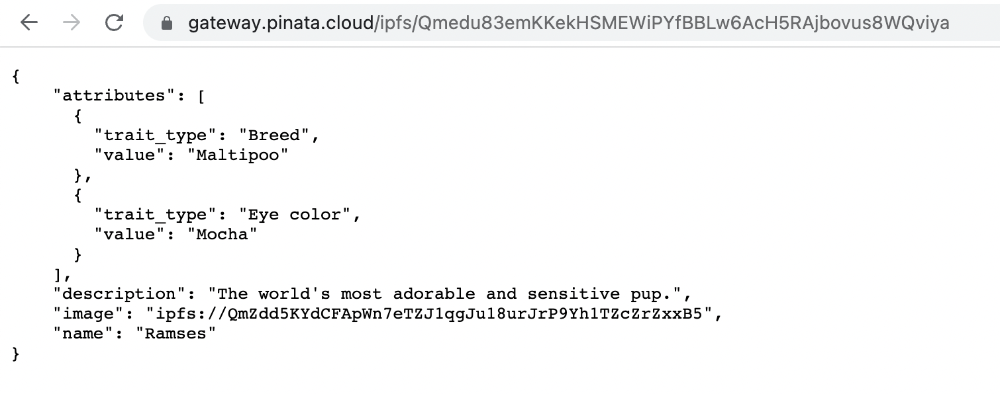

[Beeple](https://www.nytimes.com/2021/03/11/arts/design/nft-auction-christies-beeple.html): $69 Million
[3LAU](https://www.forbes.com/sites/abrambrown/2021/03/03/3lau-nft-nonfungible-tokens-justin-blau/?sh=5f72ef64643b): $11 Million
[Grimes](https://www.theguardian.com/music/2021/mar/02/grimes-sells-digital-art-collection-non-fungible-tokens): $6 Million

All of them minted their NFTs using Alchemy’s powerful API. In this tutorial, we’ll teach you how to do the same in <10 minutes.

“Minting an NFT” is the act of publishing a unique instance of your ERC-721 token on the blockchain. Using our smart contract from [Part 1 of this NFT tutorial series](/developers/tutorials/how-to-write-and-deploy-an-nft/), let’s flex our Web3 skills and mint an NFT. At the end of this tutorial, you’ll be able to mint as many NFTs as your heart (and wallet) desires!

Let’s get started!

## Step 1: Create a `mint-nft.js` file {#create-mintnftjs}

Inside your scripts directory, create a `mint-nft.js` file and add the following lines of code:

```js
import { ethers } from "ethers";
import "dotenv/config";
const API_KEY = process.env.API_KEY;
const PRIVATE_KEY = process.env.PRIVATE_KEY;
const CONTRACT_ADDRESS = process.env.CONTRACT_ADDRESS;

import * as contract from "../artifacts/contracts/MyNFT.sol/MyNFT.json" with { type: "json" };
const provider = new ethers.AlchemyProvider("sepolia", API_KEY);
const signer = new ethers.Wallet(PRIVATE_KEY, provider);
```


Just like in the last tutorial, we import our private key and API key to make a signer (which we will need for minting later), along with our contract address (which we will also need for minting).  We also import our contract JSON file, which Hardhat compiled for us.

## Step 2: View your contract ABI {#contract-abi}

Our contract ABI (Application Binary Interface) is the interface to interact with our smart contract. You can learn more about Contract ABIs [here](https://docs.alchemy.com/docs/how-to-interpret-binaries-in-solidity#what-is-a-solidity-abi-application-binary-interface-why-do-you-need-one-to-read-a-smart-contract). Hardhat automatically generates an ABI for us and saves it in the `MyNFT.json` file. In order to use this we’ll need to parse out the contents by adding the following lines of code to our `mint-nft.js` file:

```js
const abi = contract.default.abi;
```

If you want to see the ABI you can print it to your console:

```js
console.log(abi);
```

To run `mint-nft.js` and see your ABI printed to the console, open your terminal and run:

```js
node scripts/mint-nft.js
```

## Step 3: Configure the metadata for your NFT using IPFS {#config-meta}

If you remember from our tutorial in Part 1, our `mintNFT` smart contract function takes in a tokenURI parameter that should resolve to a JSON document describing the NFT's metadata— which is really what brings the NFT to life, allowing it to have configurable properties, such as a name, description, image, and other attributes.

> _Interplanetary File System (IPFS) is a decentralized protocol and peer-to-peer network for storing and sharing data in a distributed file system._

We will use Pinata, a convenient IPFS API and toolkit, to store our NFT asset and metadata to ensure our NFT is truly decentralized. If you don’t have a Pinata account, sign up for a free account [here](https://app.pinata.cloud) and complete the steps to verify your email.

Once you’ve created an account:

- Navigate to the “Files” page and click the purple "Upload" button at the top-left of the page.

- Upload an image to Pinata — this will be the image asset for your NFT. Feel free to name the asset whatever you wish

- After you upload, you'll see the file info in the table on the "Files" page. You'll also see a CID column. You can copy the CID by clicking the copy button next to it. You can view your upload at: `https://gateway.pinata.cloud/ipfs/<CID>`. You can find the image we used on IPFS [here](https://gateway.pinata.cloud/ipfs/QmZdd5KYdCFApWn7eTZJ1qgJu18urJrP9Yh1TZcZrZxxB5), for example.

Now, we’re going to want to upload one more document to Pinata. But before we do that, we need to create it!

In your root directory, make a new file called `nft-metadata.json` and add the following json code:

```json
{
  "attributes": [
    {
      "trait_type": "Breed",
      "value": "Maltipoo"
    },
    {
      "trait_type": "Eye color",
      "value": "Mocha"
    }
  ],
  "description": "The world's most adorable and sensitive pup.",
  "image": "ipfs://QmWmvTJmJU3pozR9ZHFmQC2DNDwi2XJtf3QGyYiiagFSWb",
  "name": "Ramses"
}
```

Feel free to change the data in the json. You can remove or add to the attributes section. Most importantly, make sure image field points to the location of your IPFS image — otherwise, your NFT will include a photo of a (very cute!) dog.

Once you’re done editing the JSON file, save it and upload it to Pinata, following the same steps we did for uploading the image.

## Step 4: Create an instance of your contract {#instance-contract}

Now, to interact with our contract, we need to create an instance of it in our code. To do so we’ll need our contract address which we can get from the deployment or [Etherscan](https://sepolia.etherscan.io/) by looking up the address you used to deploy the contract.

Next we will use the Ethers.js [contract method](https://docs.ethers.org/v5/api/contract/contract/#Contract--creating) to create our contract using compiled ABI, address, and `Signer`, which would your wallet with SepoliaETH funds! In your `mint-nft.js` file, add the following:

```js
const myNFTContract = new ethers.Contract(CONTRACT_ADDRESS, abi, signer);
```

Note that the `Contract` function must be used with the `new` keyword.  Additionally, it's distinct from the `ContractFactory` method we used in the previous tutorial - this time, we're making a real contract we can interact with and do cool things with!

## Step 5: Get your metadata URI {#get-metadata-uri}

Remember the `metadata.json` you uploaded to Pinata? Get its hashcode (or CID) from Pinata and paste it into your code like this, preceded with `ipfs://`:

```js
const tokenURI = "ipfs://QmSe4KMWG3MGuNdFXDEfJYSMpbfQq5Raxv63DQrKV3JXJF"
```	
> Double check that the hashcode you copied links to your **metadata.json** by loading `https://gateway.pinata.cloud/ipfs/<metadata-hash-code>` into a separate window. The page should look similar to the screenshot below:

_Your page should display the json metadata_

## Step 6: Mint your NFT! {#mint-nft}

Now we can finally write the actual code that'll mint your NFT on the Ethereum testnet!  Add this function to your `mint-nft.js`:

```js
const mintNFT = async () => {
  let nftTxn = await myNFTContract.safeMint(signer.address, tokenURI);
  await nftTxn.wait();
  console.log("Minted NFT successfully!  Txn: ", nftTxn.hash);
};
```

First, we use the word "txn" throughout our code as a phonetic abbreviation for the word "transaction".  If you remember our Solidity contract from earlier, it had a function called `safeMint`; Hardhat made it so we can call this function in our Javascript code!  We call this function, and pass in two variables - our signer's address, and the metadata (which we got from tokenURI earlier).  Then, we call the [`.wait()`](https://docs.ethers.org/v6/api/providers/#TransactionResponse-wait) method to make sure our transaction actually goes through.  

## Step 7: Call `mintNFT` and run node `mint-nft.js` {#call-mintnft-fn}

Finally, add this short helper function to actually call `mintNFT()`:

```js
mintNFT()
  .then(() => process.exit(0))
  .catch((error) => {
    console.error(error);
    process.exit(1);
  });
  ```


Altogether, your code should look something like this:

```js
import { ethers } from "ethers";
import "dotenv/config";
const API_KEY = process.env.API_KEY;
const PRIVATE_KEY = process.env.PRIVATE_KEY;
const CONTRACT_ADDRESS = process.env.CONTRACT_ADDRESS;

import * as contract from "../artifacts/contracts/MyNFT.sol/MyNFT.json" with { type: "json" };
const provider = new ethers.AlchemyProvider("sepolia", API_KEY);
const signer = new ethers.Wallet(PRIVATE_KEY, provider);

const abi = contract.default.abi;

const myNFTContract = new ethers.Contract(CONTRACT_ADDRESS, abi, signer);

const tokenURI = "ipfs://QmSe4KMWG3MGuNdFXDEfJYSMpbfQq5Raxv63DQrKV3JXJF";

const mintNFT = async () => {
  let nftTxn = await myNFTContract.safeMint(signer.address, tokenURI);
  await nftTxn.wait();
  console.log("Minted NFT successfully!  Txn: ", nftTxn.hash);
};

mintNFT()
  .then(() => process.exit(0))
  .catch((error) => {
    console.error(error);
    process.exit(1);
  });
```

Now, run `node scripts/mint-nft.js` to deploy your NFT. After a couple of seconds, you should see a response like this in your terminal:

    Minted NFT successfully!  Txn: 0xd3db01304fffc27f83cc74cee5e26f556d03ace37687be3163fd22799a1cbb89

Next, visit your [Alchemy mempool](https://dashboard.alchemy.com/mempool) to see the status of your transaction (whether it’s pending, mined, or got dropped by the network). If your transaction got dropped, it’s also helpful to check [Sepolia Etherscan](https://sepolia.etherscan.io/) and search for your transaction hash.

And that’s it! You’ve now deployed AND minted with a NFT on the Ethereum blockchain <Emoji text=":money_mouth_face:" size={1} />

Using the `mint-nft.js` you can mint as many NFTs as your heart (and wallet) desires! Just be sure to pass in a new tokenURI describing the NFT's metadata (otherwise, you'll just end up making a bunch of identical ones with different IDs).

Presumably, you’d like to be able to show off your NFT in your wallet — so be sure to check out [Part 3: How to View Your NFT in Your Wallet](/developers/tutorials/how-to-view-nft-in-metamask/)!
