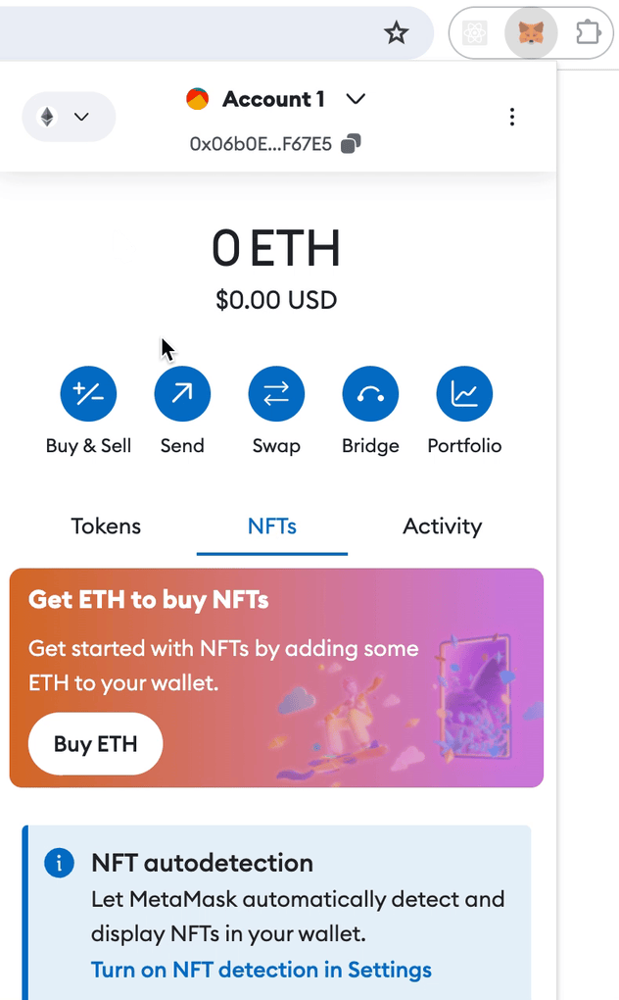
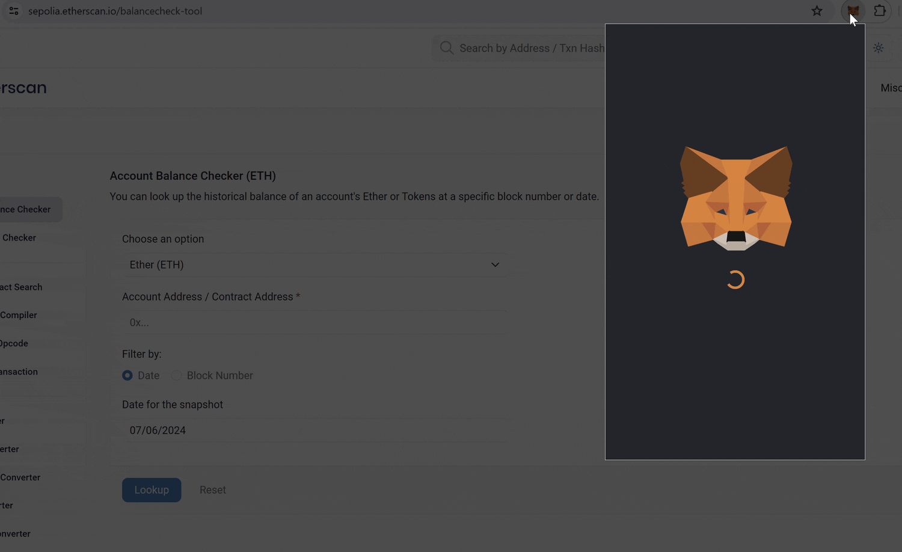
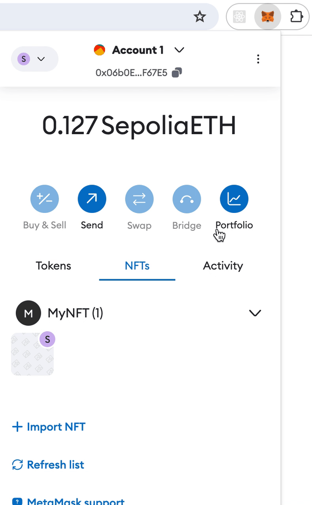
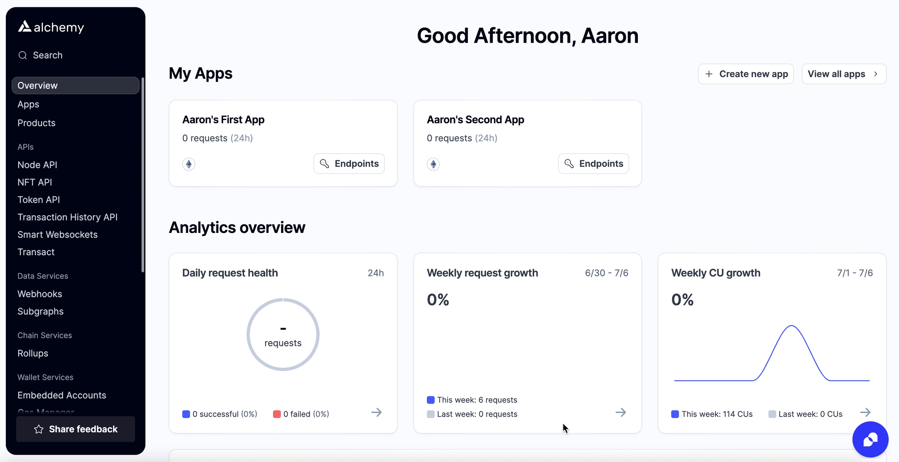
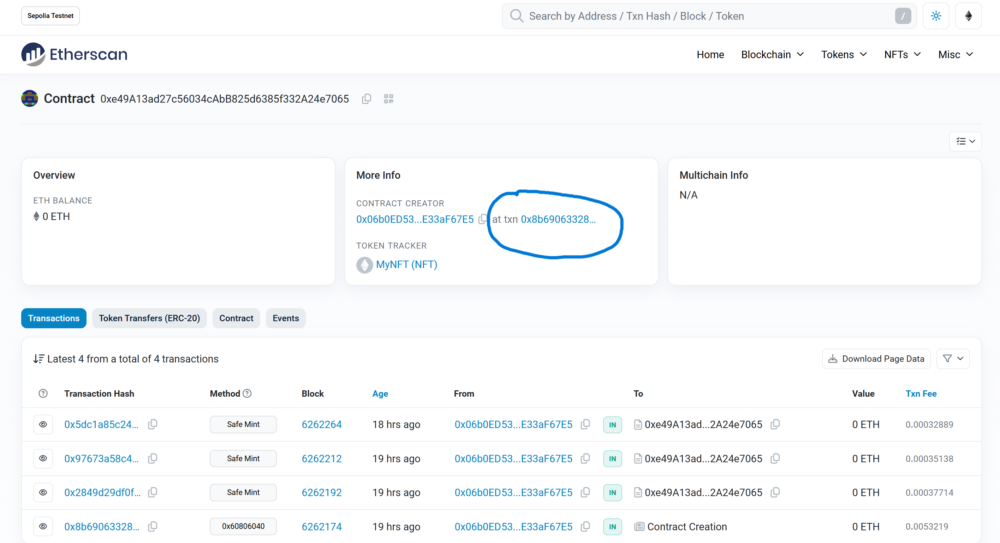

Want to sound smart at parties?  Keep hearing about NFTs but have no idea what they are?  Get your hands dirty and mint your own NFT!  

In this tutorial, we will walk through creating and deploying an ERC-721 smart contract on the Sepolia test network using [MetaMask](https://metamask.io/), [Solidity](https://soliditylang.org), [Hardhat](https://hardhat.org/), [Pinata](https://pinata.cloud/) and [Alchemy](https://alchemy.com/signup/eth) (don’t fret if you don’t understand what any of this means yet — we will explain it!).

Alchemy powers some of the biggest names in NFT space, including Makersplace (recently set a record digital artwork sale at [Christie’s](https://twitter.com/ChristiesInc/status/1361670588608176128?ref_src=twsrc%5Etfw%7Ctwcamp%5Etweetembed%7Ctwterm%5E1361670588608176128%7Ctwgr%5Efd6084148e3365400c508866e80083eeebcff14e%7Ctwcon%5Es1_c10&ref_url=https%3A%2F%2Fwww.theverge.com%2F2021%2F3%2F11%2F22325054%2Fbeeple-christies-nft-sale-cost-everydays-69-million) for [\$69 Million](https://www.theverge.com/2021/3/11/22325054/beeple-christies-nft-sale-cost-everydays-69-million)), Dapper Labs ([creators of NBA Top Shot & Crypto Kitties](https://www.linkedin.com/company/dapper-labs)), and OpenSea ([the world’s largest NFT marketplace](https://www.investopedia.com/what-is-opensea-6362477#:~:text=OpenSea%20is%20the%20largest%20NFT,on%20the%20OpenSea%20listing%20page)).

In Part 2 of this tutorial we’ll go through how we can use our smart contract to mint an NFT, and in Part 3 we’ll explain how to view your NFT on MetaMask.

## Step 1: Connect to the Ethereum network {#connect-to-ethereum}

There are a bunch of ways to make requests to the Ethereum blockchain, but to make things easy, we’ll use a free account on [Alchemy](https://alchemy.com), a blockchain developer platform and API that allows us to communicate with the Ethereum chain without having to run our own nodes.

In this tutorial, we’ll also take advantage of Alchemy’s developer tools for monitoring and analytics to understand what’s going on under the hood in our smart contract deployment. If you don’t already have an Alchemy account, you can sign up for free [here](https://auth.alchemy.com).

## Step 2: Create and configure your app {#make-app}

Once you’ve created an Alchemy account, you can generate an API key by creating an app. This will allow us to make requests to the Sepolia test network. Check out [this guide](https://docs.alchemy.com/docs/choosing-a-web3-network) if you’re curious to learn more about test networks.

1. From the [Alchemy dashboard](https://dashboard.alchemy.com), click on "Create New App" in the upper right-hand corner, and give your app a cool name and description!


2. Once you're done, the "Networks" tab should be automatically highlighted.  Click on it, select "configure" in the upper right-hand corner, disable all the other networks, and leave "Ethereum Sepolia" enabled.


## Step 3: Create an Ethereum account (address) {#create-eth-address}

We need an Ethereum account to send and receive transactions. For this tutorial, we’ll use MetaMask, an open-source Ethereum wallet with over [10,000](https://github.com/MetaMask/metamask-extension) stars on GitHub! If you want to understand more about how transactions on Ethereum work, check out [this page](/developers/docs/transactions/) from the Ethereum foundation.

You can download MetaMask and create an account for free [here](https://metamask.io/). Once you have created an account, or if you already have an account, make sure to switch over to the “Sepolia Test Network” in the upper left (so that we’re not dealing with real money).



## Step 4: Add ether from a Faucet {#add-ether-from-a-faucet}

In order to deploy our smart contract to the test network, we’ll need "fake" ETH - or SepoliaETH.  You can get SepoliaETH from a [faucet](https://www.alchemy.com/faucets#:~:text=A%20testnet%20faucet%20provides%20web3%20developers%20with%20free%20tokens%20for%20deploying%2C%20testing%2C%20and%20optimizing%20smart%20contracts%20on%20test%20blockchains%20such%20as%20Sepolia)!  However, most faucets have other requirements - the [Alchemy faucet](https://www.alchemy.com/faucets/ethereum-sepolia) requires at least 0.001 ETH (about [US\$3 ](https://nft-tutorial-utils.vercel.app/?ethValue=0.001)right now), while the [Infura faucet](https://www.infura.io/faucet/sepolia) requires an Infura account.  This [Google Cloud faucet](https://cloud.google.com/application/web3/faucet/ethereum/sepolia) currently has no requirements, but this could change by the time you're reading this tutorial!  Once you've used a faucet to get SepoliaETH, you can open MetaMask again to check your balance.

## Step 5: Check our balance with Etherscan {#check-balance-with-etherscan}

To double check our balance is there, let’s use [Etherscan]([About Us (etherscan.io)](https://etherscan.io/aboutus)), the Ethereum block explorer!  A [block explorer](https://www.sofi.com/learn/content/blockchain-explorer/)) is a website that lets you check out various transactions on the blockchain, keeping everything nice and transparent.  

Paste your wallet address [here](https://sepolia.etherscan.io/balancecheck-tool), and then click on the "Lookup" button.  You should see a value equal to your SepoliaETH balance pop up!



## Step 6: Initialize our project {#initialize-project}

First, we’ll need to create a folder for our project. Navigate to your command line and type:

    mkdir my-nft
    cd my-nft

Now that we’re inside our project folder, we’ll use npm init to initialize the project. If you don’t already have npm installed, follow [these instructions](https://docs.npmjs.com/downloading-and-installing-node-js-and-npm)

    npm init

It doesn’t really matter how you answer the installation questions, but here's how we did it for reference:

    package name: (my-nft)
    version: (1.0.0)
    description: My first NFT!
    entry point: (index.js)
    test command:
    git repository:
    keywords:
    author:
    license: (ISC)
    About to write to /Users/thesuperb1/Desktop/my-nft/package.json:

    {
      "name": "my-nft",
      "version": "1.0.0",
      "description": "My first NFT!",
      "main": "index.js",
      "scripts": {
        "test": "echo \"Error: no test specified\" && exit 1"
      },
      "author": "",
      "license": "ISC"
    }

Approve the package.json, and we’re good to go!

## Step 7: Install Hardhat {#install-hardhat}

[Hardhat](https://hardhat.org/docs) is a development environment to compile, deploy, test, and debug your Ethereum software. It helps developers test their smart contracts and dApps locally and make sure they work before deploying them the live chain.

Inside our my-nft project run:

    npm install --save-dev hardhat

Check out this page for more details on [installation instructions](https://hardhat.org/getting-started/#overview).

## Step 8: Create Hardhat project {#create-hardhat-project}

Inside our project folder run:

    npx hardhat

You should then see a welcome message and option to select what you want to do. Select “create an empty hardhat.config.js”:

    888    888                      888 888               888
    888    888                      888 888               888
    888    888                      888 888               888
    8888888888  8888b.  888d888 .d88888 88888b.   8888b.  888888
    888    888     "88b 888P"  d88" 888 888 "88b     "88b 888
    888    888 .d888888 888    888  888 888  888 .d888888 888
    888    888 888  888 888    Y88b 888 888  888 888  888 Y88b.
    888    888 "Y888888 888     "Y88888 888  888 "Y888888  "Y888
    👷 Welcome to Hardhat v2.22.6 👷‍
    ? What do you want to do? …
    Create a sample project
    ❯ Create an empty hardhat.config.js
    Quit

This will generate a hardhat.config.js file for us which is where we’ll specify all of the set up for our project (on step 13), along with the folders `ignition/`, `cache/`, and `contracts/`.

## Step 9: Add script folder {#add-script-folder}

To keep our project organized, we’ll create another folder. Navigate to the root directory of your project in your command line and type:

    mkdir scripts

This is where we’ll keep the scripts to deploy and interact with our smart contract

## Step 10: Write our contract {#write-contract}

Now that our environment is set up, on to more exciting stuff: _writing our smart contract code!_

Open up the my-nft project in your favorite editor. Smart contracts are written in a language called Solidity, which is what we will use to write our MyNFT.sol smart contract.‌

1. Navigate to the `contracts` folder (automatically created by Hardhat` and create a new file called MyNFT.sol

2. Below is our NFT smart contract code, which we based on the OpenZeppelin Contract Wizard's ERC-721 code, with the mintable, auto-increment IDs, and URIStorage options checked in.  You can play around with the Contract Wizard [here](https://wizard.openzeppelin.com/#erc721)!  Copy and paste the contents below into your MyNFT.sol file.

```solidity
// SPDX-License-Identifier: MIT
// Compatible with OpenZeppelin Contracts ^5.0.0
pragma solidity ^0.8.20;

import "@openzeppelin/contracts/token/ERC721/ERC721.sol";
import "@openzeppelin/contracts/token/ERC721/extensions/ERC721URIStorage.sol";
import "@openzeppelin/contracts/access/Ownable.sol";

contract MyNFT is ERC721, ERC721URIStorage, Ownable {
    uint256 private _nextTokenId;

    constructor(address initialOwner)
        ERC721("MyNFT", "NFT")
        Ownable(initialOwner)
    {}

    function safeMint(address to, string memory uri) public onlyOwner {
        uint256 tokenId = _nextTokenId++;
        _safeMint(to, tokenId);
        _setTokenURI(tokenId, uri);
    }

    // The following functions are overrides required by Solidity.

    function tokenURI(uint256 tokenId)
        public
        view
        override(ERC721, ERC721URIStorage)
        returns (string memory)
    {
        return super.tokenURI(tokenId);
    }

    function supportsInterface(bytes4 interfaceId)
        public
        view
        override(ERC721, ERC721URIStorage)
        returns (bool)
    {
        return super.supportsInterface(interfaceId);
    }
}
```

3. Because we are inheriting classes from the OpenZeppelin contracts library, in your command line run `npm install @openzeppelin/contracts` to install the library.

So, what does this code _do_ exactly? Let’s break it down, line-by-line.

At the top of our smart contract, we import three [OpenZeppelin](https://openzeppelin.com/) smart contract classes:

- [`@openzeppelin/contracts/token/ERC721/ERC721.sol`](https://github.com/OpenZeppelin/openzeppelin-contracts/blob/master/contracts/token/ERC721/ERC721.sol) contains the implementation of the ERC-721 standard, which our NFT smart contract will inherit. (To be a valid NFT, your smart contract must implement all the methods of the ERC-721 standard.) To learn more about the inherited ERC-721 functions, check out the interface definition [here](https://eips.ethereum.org/EIPS/eip-721).

- [`@openzeppelin/contracts/token/ERC721/extensions/ERC721URIStorage.sol`](https://github.com/OpenZeppelin/openzeppelin-contracts/blob/master/contracts/token/ERC721/extensions/ERC721URIStorage.sol) contains the implementation of the `IERC721Metadata` schema, which allows ERC-721 smart contracts to store and return additional information, such as a link to an image.  This is important for later, when we add a cool picture to our NFT!

- @openzeppelin/contracts/access/Ownable.sol sets up [access control](https://docs.openzeppelin.com/contracts/5.x/access-control) on our smart contract, so only the owner of the smart contract (you) can mint NFTs. (Note, including access control is entirely a preference. If you'd like anyone to be able to mint an NFT using your smart contract, remove the lines `Ownable(initialOwner)` and `import "@openzeppelin/contracts/access/Ownable.sol";`, along with the words `public onlyOwner`. )

After our import statements, we have our custom NFT smart contract, which is surprisingly short — it only contains a counter, a constructor, and single function! This is thanks to our inherited OpenZeppelin contracts, which implement most of the methods we need to create an NFT, such as `ownerOf` which returns the owner of the NFT, and `transferFrom`, which transfers ownership of the NFT from one account to another.  

In our ERC-721 constructor, you’ll notice we pass 2 strings, “MyNFT” and “NFT.” The first variable is the smart contract’s name, and the second is its symbol. You can name each of these variables whatever you wish!

Next, we have our function `safeMint(address to, string memory uri)` that allows us to mint the NFT! You'll notice this function takes in two variables:

- `address to` specifies the address that will receive your freshly minted NFT

- `string memory uri` is a string that should resolve to a JSON document that describes the NFT's metadata. An NFT's metadata is really what brings it to life, allowing it to have properties such as a name, description, image, and other attributes. In part 2 of this tutorial, we will describe how to configure this metadata.

`safeMint` calls some methods from the inherited ERC-721 library, and ultimately returns a number that represents the ID of the freshly minted NFT.

Finally, we have some "function overrides that are required by Solidity"!  While these are necessary, their reasons for existence are rather arcane.  If you're interested, [here's](https://forum.openzeppelin.com/t/the-following-functions-are-overrides-required-by-solidity/20104/4) a short explanation written by a member of the Solidity dev team explaining why we need them.

## Step 11: Connect MetaMask and Alchemy to your project {#connect-metamask-and-alchemy}

Now that we’ve created a MetaMask wallet, Alchemy account, and written our smart contract, it’s time to connect the three.

Every transaction sent from your virtual wallet requires a signature using your unique private key. To provide our program with this permission, we can safely store our private key (and Alchemy API key) in an environment file.

To learn more about sending transactions, check out [this tutorial](/developers/tutorials/sending-transactions-using-web3-and-alchemy/) on sending transactions using web3.

First, install the dotenv package in your project directory:

    npm install dotenv --save

Then, create a `.env` file in the root directory of our project, and add your MetaMask private key, public key (wallet address) and HTTP Alchemy API URL to it.

- Here's how to find your MetaMask private key:



- Here's how to get your Alchemy API URL and copy it to your clipboard



- To find your MetaMask public key, simply open your wallet and copy your address.  

Your `.env` should now look like this:

    API_URL="https://eth-sepolia.g.alchemy.com/v2/your-api-key"
    PRIVATE_KEY="your-metamask-private-key"
    PUBLIC_KEY="your-public-key"

We'll integrate these values into our project in the next few steps!

<EnvWarningBanner />

## Step 12: Install Ethers.js {#install-ethers}

Ethers.js is a library that makes it easier to interact and make requests to Ethereum by wrapping [standard JSON-RPC methods](/developers/docs/apis/json-rpc/) with more user friendly methods.

In your project directory type:

    npm install --save-dev ethers

We’ll also require ethers in our hardhat.config.js in the next step.

## Step 13: Update hardhat.config.js {#update-hardhat-config}

We’ve added several dependencies and plugins so far, now we need to update hardhat.config.js so that our project knows about all of them.

Update your hardhat.config.js to look like this:

```js
require("@nomicfoundation/hardhat-toolbox");

/** @type import('hardhat/config').HardhatUserConfig */
require("dotenv").config();
const API_URL = process.env.API_URL;
const PRIVATE_KEY = process.env.PRIVATE_KEY;

module.exports = {
  solidity: "0.8.24",
  defaultNetwork: "sepolia",
  networks: {
    hardhat: {},
    sepolia: {
      url: API_URL,
      accounts: [`0x${PRIVATE_KEY}`],
    },
  },
};
```

This config file should be fairly self-explanatory - if you're curious, you can check out [Hardhat's article](https://hardhat.org/hardhat-runner/docs/config) about writing config files.

## Step 14: Compile our contract {#compile-contract}

To make sure everything is working so far, let’s compile our contract. The compile task is one of the built-in hardhat tasks.

From the command line run:

    npx hardhat compile

You might get a warning about SPDX license identifier not provided in source file , but no need to worry about that — hopefully everything else looks good!  You can check in the `artifacts/contracts/MyNFT.sol` directory for the compiled output - you should see two files: `MyNFT.json` and `MyNFT.dbg.json`. If not, you can always send message in the [Alchemy discord](https://discord.com/invite/alchemyplatform)!

## Step 15: Write our deploy script {#write-deploy}

Now that our contract is written and our configuration file is good to go, it’s time to write our contract deploy script.

Navigate to the `scripts/` folder and create a new file called `deploy.js`, adding the following contents to it:

```js
import { ethers } from "ethers";
import "dotenv/config";
import * as contract from "../artifacts/contracts/MyNFT.sol/MyNFT.json" with { type: "json" };

const PUBLIC_KEY = process.env.PUBLIC_KEY
const PRIVATE_KEY = process.env.PRIVATE_KEY;
const API_KEY = process.env.API_KEY;

async function main() {
  const provider = new ethers.AlchemyProvider("sepolia", API_KEY);
  const signer = new ethers.Wallet(PRIVATE_KEY, provider);

  const MyNFT = new ethers.ContractFactory(
    contract.default.abi,
    contract.default.bytecode,
    signer,
  );

  const myNFTDeployed = await MyNFT.deploy(PUBLIC_KEY);

  await myNFTDeployed.waitForDeployment();
  const address = await myNFTDeployed.getAddress();
  console.log("Contract deployed to address:", address, "\nView it at https://sepolia.etherscan.io/address/", address);
}

main()
  .then(() => process.exit(0))
  .catch((error) => {
    console.error(error);
    process.exit(1);
  });
```

Let's quickly run through this code!  Throughout this project, we're going to use `import` to load external libraries instead of `require` - you can read more at this [Stack Overflow answer](https://stackoverflow.com/a/70356073/12981681), and the [Node.js docs](https://nodejs.org/docs/latest-v16.x/api/esm.html#import-assertions).  

Inside of the asynchronous function `main`, we first create a [`signer`](https://docs.ethers.org/v6/api/providers/#Signer).  This is necessary to deploy the contract, because we need an account linked with some funds to pay the gas fee!  Hopefully you were able to get some SepoliaETH from a faucet a couple minutes ago.

Next, we create a [`ContractFactory`](https://docs.ethers.org/v6/api/contract/#ContractFactory), which is essentially a contract that can make other contracts.  We then deploy the NFT using the [`.deploy()`](https://docs.ethers.org/v6/api/contract/#ContractFactory-deploy) method, then wait until its deployed using the asynchronous [`.waitForDeployment()`](https://docs.ethers.org/v6/api/contract/#BaseContract-waitForDeployment) method.  Finally, we find its address and print it! 
## Step 16: Deploy our contract {#deploy-contract}

We’re finally ready to deploy our smart contract! Navigate back to the root of your project directory, and in the command line run:

    npx hardhat --network sepolia run scripts/deploy.js

You should then see something like after a couple seconds:

    Contract deployed to address: 0xe49A13ad27c56034cAbB825d6385f332A24e7065
    View it at https://sepolia.etherscan.io/address/0xe49a13ad27c56034cabb825d6385f332a24e7065

Click on the link in the terminal (most terminals support ctrl-click to visit hyperlink) to check out your very own smart contract!  If the link doesn't work, you can also visit [Sepolia Etherscan](https://sepolia.etherscan.io/) and paste the address into the search bar.  If you can't see it immediately, please wait a while as it can take some time. The transaction will look something like this:



If you click on the transaction address (the link after the words "at txn 0x..." circled above), you should see your MetaMask address in the "From" field, and a the words "Created" in the "To" field, along with a green check mark.


Finally, add the contract address displayed in the terminal to your `.env` file like this:

```
CONTRACT_ADDRESS="0xe49A13ad27c56034cAbB825d6385f332A24e7065"
```

Your .env file should now have 4 lines in it.  You'll need this address later to mint your NFT!

Yasssss! You just deployed your NFT smart contract to the Ethereum (testnet) chain!

To understand what’s going on under the hood, let’s head to the Alchemy dashboard's "Request Logs" on the sidebar, and check out the requests our app's been making.


Here you’ll see a handful of JSON-RPC calls that Ethers.js has made under the hood for us when we called the .deploy() function. Two important ones to call out here are [eth_sendRawTransaction](/developers/docs/apis/json-rpc/#eth_sendrawtransaction), which is the request to actually write our smart contract onto the Sepolia chain, and [eth_getTransactionByHash](/developers/docs/apis/json-rpc/#eth_gettransactionbyhash) which is a request to read information about our transaction given the hash (a typical pattern when sending transactions).  Some of these requests might appear as a "batch" - this is when the blockchain groups a [bunch of transactions](https://docs.alchemy.com/docs/erc-4337-bundle-vs-batch#what-is-a-batch-transaction-batching) or function calls by one user together, to reduce gas fees. To learn more about sending transactions, check out this tutorial on [sending transactions using Web3](/developers/tutorials/sending-transactions-using-web3-and-alchemy/).

That’s all for Part 1 of this tutorial. In [Part 2, we’ll actually interact with our smart contract by minting an NFT](/developers/tutorials/how-to-mint-an-nft/), and in [Part 3 we’ll show you how to view your NFT in your Ethereum wallet](/developers/tutorials/how-to-view-nft-in-metamask/)!
# 