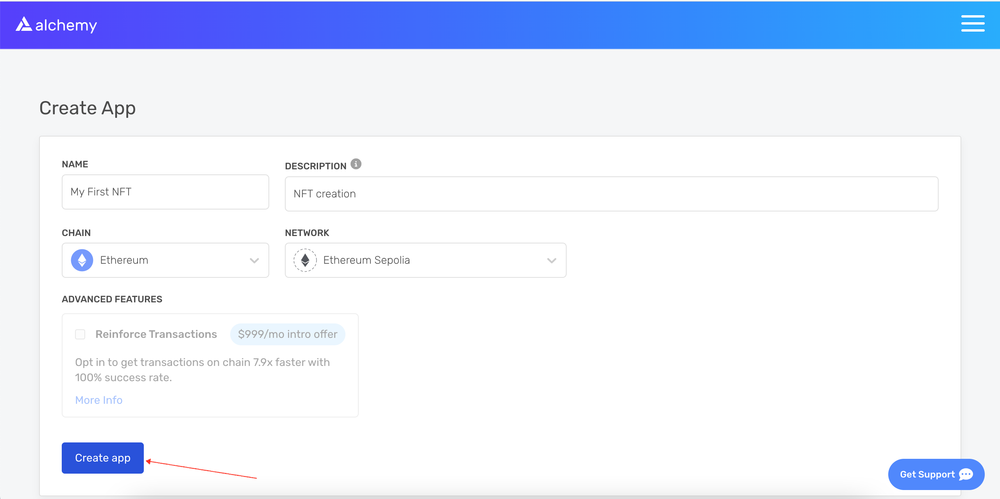
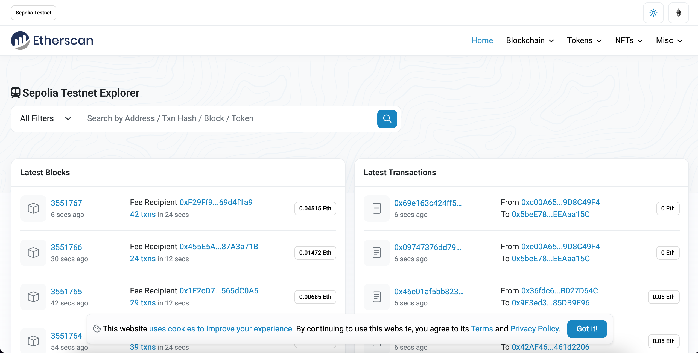
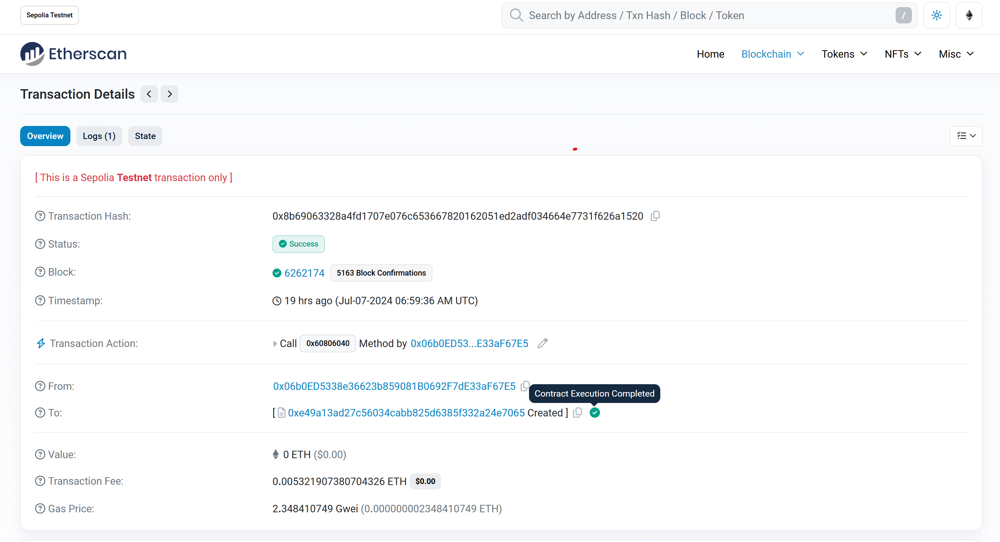

With NFTs bringing blockchain into the public eye, now is an excellent opportunity to understand the hype yourself by publishing your own NFT contract (ERC-721 Token) on the Ethereum blockchain!

Alchemy is extremely proud to be powering the biggest names in the NFT space, including Makersplace (recently set a record digital artwork sale at Christie’s for $69 Million), Dapper Labs (creators of NBA Top Shot & Crypto Kitties), OpenSea (the world’s largest NFT marketplace), Zora, Super Rare, NFTfi, Foundation, Enjin, Origin Protocol, Immutable, and more.

In this tutorial, we will walk through creating and deploying an ERC-721 smart contract on the Sepolia test network using [MetaMask](https://metamask.io/), [Solidity](https://docs.soliditylang.org/en/v0.8.0/), [Hardhat](https://hardhat.org/), [Pinata](https://pinata.cloud/) and [Alchemy](https://alchemy.com/signup/eth) (don’t fret if you don’t understand what any of this means yet — we will explain it!).

In Part 2 of this tutorial we’ll go through how we can use our smart contract to mint an NFT, and in Part 3 we’ll explain how to view your NFT on MetaMask.

And of course, if you have questions at any point, don’t hesitate to reach out in the [Alchemy Discord](https://discord.gg/gWuC7zB) or visit [Alchemy's NFT API docs](https://docs.alchemy.com/alchemy/enhanced-apis/nft-api)!

## Step 1: Connect to the Ethereum network {#connect-to-ethereum}

There are a bunch of ways to make requests to the Ethereum blockchain, but to make things easy, we’ll use a free account on [Alchemy](https://alchemy.com/signup/eth), a blockchain developer platform and API that allows us to communicate with the Ethereum chain without having to run our own nodes.

In this tutorial, we’ll also take advantage of Alchemy’s developer tools for monitoring and analytics to understand what’s going on under the hood in our smart contract deployment. If you don’t already have an Alchemy account, you can sign up for free [here](https://alchemy.com/signup/eth).

## Step 2: Create your app (and API key) {#make-api-key}

Once you’ve created an Alchemy account, you can generate an API key by creating an app. This will allow us to make requests to the Sepolia test network. Check out [this guide](https://docs.alchemyapi.io/guides/choosing-a-network) if you’re curious to learn more about test networks.

1. Navigate to the “Create App” page in your Alchemy Dashboard by hovering over “Apps” in the nav bar and clicking “Create App”


2. Name your app (we chose “My First NFT!”), offer a short description, select “Ethereum” for the Chain, and choose “Sepolia” for your network. Since the merge the other testnets have been deprecated.



3. Click “Create app” and that’s it! Your app should appear in the table below.

## Step 3: Create an Ethereum account (address) {#create-eth-address}

We need an Ethereum account to send and receive transactions. For this tutorial, we’ll use MetaMask, a virtual wallet in the browser used to manage your Ethereum account address. If you want to understand more about how transactions on Ethereum work, check out [this page](/developers/docs/transactions/) from the Ethereum foundation.

You can download and create a MetaMask account for free [here](https://metamask.io/download.html). When you are creating an account, or if you already have an account, make sure to switch over to the “Sepolia Test Network” in the upper right (so that we’re not dealing with real money).


## Step 4: Add ether from a Faucet {#step-4-add-ether-from-a-faucet}

In order to deploy our smart contract to the test network, we’ll need some fake ETH. To get ETH you can go to the [Sepolia Faucet](https://sepoliafaucet.com/) hosted by Alchemy, log in and enter your account address, click “Send Me ETH”. You should see ETH in your MetaMask account soon after!

## Step 5: Check your Balance {#check-balance}

To double check our balance is there, let’s make an [eth_getBalance](https://docs.alchemyapi.io/alchemy/documentation/alchemy-api-reference/json-rpc#eth_getbalance) request using [Alchemy’s composer tool](https://composer.alchemyapi.io?composer_state=%7B%22network%22%3A0%2C%22methodName%22%3A%22eth_getBalance%22%2C%22paramValues%22%3A%5B%22%22%2C%22latest%22%5D%7D). This will return the amount of ETH in our wallet. After you input your MetaMask account address and click “Send Request”, you should see a response like this:

    `{"jsonrpc": "2.0", "id": 0, "result": "0xde0b6b3a7640000"}`

> **Note** This result is in wei, not ETH. Wei is used as the smallest denomination of ether. The conversion from wei to ETH is 1 eth = 10<sup>18</sup> wei. So if we convert 0xde0b6b3a7640000 to decimal we get 1\*10<sup>18</sup> wei, which equals 1 ETH.

Phew! Our fake money is all there.

## Step 6: Initialize our project {#initialize-project}

First, we’ll need to create a folder for our project. Navigate to your command line and type:

    mkdir my-nft
    cd my-nft

Now that we’re inside our project folder, we’ll use npm init to initialize the project. If you don’t already have npm installed, follow [these instructions](https://docs.alchemyapi.io/alchemy/guides/alchemy-for-macs#1-install-nodejs-and-npm) (we’ll also need [Node.js](https://nodejs.org/en/download/), so download that too!).

    npm init

It doesn’t really matter how you answer the installation questions; here is how we did it for reference:

    package name: (my-nft)
    version: (1.0.0)
    description: My first NFT!
    entry point: (index.js)
    test command:
    git repository:
    keywords:
    author:
    license: (ISC)
    About to write to /Users/thesuperb1/Desktop/my-nft/package.json:

    {
      "name": "my-nft",
      "version": "1.0.0",
      "description": "My first NFT!",
      "main": "index.js",
      "scripts": {
        "test": "echo \"Error: no test specified\" && exit 1"
      },
      "author": "",
      "license": "ISC"
    }

Approve the package.json, and we’re good to go!

## Step 7: Install [Hardhat](https://hardhat.org/getting-started/#overview) {#install-hardhat}

Hardhat is a development environment to compile, deploy, test, and debug your Ethereum software. It helps developers when building smart contracts and dapps locally before deploying to the live chain.

Inside our my-nft project run:

    npm install --save-dev hardhat

Check out this page for more details on [installation instructions](https://hardhat.org/getting-started/#overview).

## Step 8: Create Hardhat project {#create-hardhat-project}

Inside our project folder run:

    npx hardhat

You should then see a welcome message and option to select what you want to do. Select “create an empty hardhat.config.js”:

    888    888                      888 888               888
    888    888                      888 888               888
    888    888                      888 888               888
    8888888888  8888b.  888d888 .d88888 88888b.   8888b.  888888
    888    888     "88b 888P"  d88" 888 888 "88b     "88b 888
    888    888 .d888888 888    888  888 888  888 .d888888 888
    888    888 888  888 888    Y88b 888 888  888 888  888 Y88b.
    888    888 "Y888888 888     "Y88888 888  888 "Y888888  "Y888
    👷 Welcome to Hardhat v2.0.11 👷‍
    ? What do you want to do? …
    Create a sample project
    ❯ Create an empty hardhat.config.js
    Quit

This will generate a hardhat.config.js file for us which is where we’ll specify all of the set up for our project (on step 13).

## Step 9: Add project folders {#add-project-folders}

To keep our project organized, we’ll create two new folders. Navigate to the root directory of your project in your command line and type:

    mkdir contracts
    mkdir scripts

- contracts/ is where we’ll keep our NFT smart contract code

- scripts/ is where we’ll keep scripts to deploy and interact with our smart contract

## Step 10: Write our contract {#write-contract}

Now that our environment is set up, on to more exciting stuff: _writing our smart contract code!_

Open up the my-nft project in your favorite editor (we like [VSCode](https://code.visualstudio.com/)). Smart contracts are written in a language called Solidity which is what we will use to write our MyNFT.sol smart contract.‌

1. Navigate to the `contracts` folder and create a new file called MyNFT.sol

2. Below is our NFT smart contract code, which we based on the [OpenZeppelin](https://docs.openzeppelin.com/contracts/3.x/erc721) library’s ERC-721 implementation. Copy and paste the contents below into your MyNFT.sol file.

   ```solidity
   //Contract based on [https://docs.openzeppelin.com/contracts/3.x/erc721](https://docs.openzeppelin.com/contracts/3.x/erc721)
   // SPDX-License-Identifier: MIT
   pragma solidity ^0.8.0;

   import "@openzeppelin/contracts/token/ERC721/ERC721.sol";
   import "@openzeppelin/contracts/utils/Counters.sol";
   import "@openzeppelin/contracts/access/Ownable.sol";
   import "@openzeppelin/contracts/token/ERC721/extensions/ERC721URIStorage.sol";

   contract MyNFT is ERC721URIStorage, Ownable {
       using Counters for Counters.Counter;
       Counters.Counter private _tokenIds;

       constructor() ERC721("MyNFT", "NFT") {}

       function mintNFT(address recipient, string memory tokenURI)
           public onlyOwner
           returns (uint256)
       {
           _tokenIds.increment();

           uint256 newItemId = _tokenIds.current();
           _mint(recipient, newItemId);
           _setTokenURI(newItemId, tokenURI);

           return newItemId;
       }
   }
   ```

3. Because we are inheriting classes from the OpenZeppelin contracts library, in your command line run `npm install @openzeppelin/contracts` to install the library into our folder.

So, what does this code _do_ exactly? Let’s break it down, line-by-line.

At the top of our smart contract, we import three [OpenZeppelin](https://openzeppelin.com/) smart contract classes:

- @openzeppelin/contracts/token/ERC721/ERC721.sol contains the implementation of the ERC-721 standard, which our NFT smart contract will inherit. (To be a valid NFT, your smart contract must implement all the methods of the ERC-721 standard.) To learn more about the inherited ERC-721 functions, check out the interface definition [here](https://eips.ethereum.org/EIPS/eip-721).

- @openzeppelin/contracts/utils/Counters.sol provides counters that can only be incremented or decremented by one. Our smart contract uses a counter to keep track of the total number of NFTs minted and set the unique ID on our new NFT. (Each NFT minted using a smart contract must be assigned a unique ID—here our unique ID is just determined by the total number of NFTs in existence. For example, the first NFT we mint with our smart contract has an ID of "1," our second NFT has an ID of "2," etc.)

- @openzeppelin/contracts/access/Ownable.sol sets up [access control](https://docs.openzeppelin.com/contracts/3.x/access-control) on our smart contract, so only the owner of the smart contract (you) can mint NFTs. (Note, including access control is entirely a preference. If you'd like anyone to be able to mint an NFT using your smart contract, remove the word Ownable on line 10 and onlyOwner on line 17.)

After our import statements, we have our custom NFT smart contract, which is surprisingly short — it only contains a counter, a constructor, and single function! This is thanks to our inherited OpenZeppelin contracts, which implement most of the methods we need to create an NFT, such as `ownerOf` which returns the owner of the NFT, and `transferFrom`, which transfers ownership of the NFT from one account to another.

In our ERC-721 constructor, you’ll notice we pass 2 strings, “MyNFT” and “NFT.” The first variable is the smart contract’s name, and the second is its symbol. You can name each of these variables whatever you wish!

Finally, we have our function `mintNFT(address recipient, string memory tokenURI)` that allows us to mint an NFT! You'll notice this function takes in two variables:

- `address recipient` specifies the address that will receive your freshly minted NFT

- `string memory tokenURI` is a string that should resolve to a JSON document that describes the NFT's metadata. An NFT's metadata is really what brings it to life, allowing it to have configurable properties, such as a name, description, image, and other attributes. In part 2 of this tutorial, we will describe how to configure this metadata.

`mintNFT` calls some methods from the inherited ERC-721 library, and ultimately returns a number that represents the ID of the freshly minted NFT.

## Step 11: Connect MetaMask & Alchemy to your project {#connect-metamask-and-alchemy}

Now that we’ve created a MetaMask wallet, Alchemy account, and written our smart contract, it’s time to connect the three.

Every transaction sent from your virtual wallet requires a signature using your unique private key. To provide our program with this permission, we can safely store our private key (and Alchemy API key) in an environment file.

To learn more about sending transactions, check out [this tutorial](/developers/tutorials/sending-transactions-using-web3-and-alchemy/) on sending transactions using web3.

First, install the dotenv package in your project directory:

    npm install dotenv --save

Then, create a `.env` file in the root directory of our project, and add your MetaMask private key and HTTP Alchemy API URL to it.

- Follow [these instructions](https://metamask.zendesk.com/hc/en-us/articles/360015289632-How-to-Export-an-Account-Private-Key) to export your private key from MetaMask

- See below to get HTTP Alchemy API URL and copy it to your clipboard


Your `.env` should now look like this:

    API_URL="https://eth-sepolia.g.alchemy.com/v2/your-api-key"
    PRIVATE_KEY="your-metamask-private-key"

To actually connect these to our code, we’ll reference these variables in our hardhat.config.js file in step 13.

<EnvWarningBanner />

## Step 12: Install Ethers.js {#install-ethers}

Ethers.js is a library that makes it easier to interact and make requests to Ethereum by wrapping [standard JSON-RPC methods](/developers/docs/apis/json-rpc/) with more user friendly methods.

Hardhat makes it super easy to integrate [Plugins](https://hardhat.org/plugins/) for additional tooling and extended functionality. We’ll be taking advantage of the [Ethers plugin](https://hardhat.org/plugins/nomiclabs-hardhat-ethers.html) for contract deployment ([Ethers.js](https://github.com/ethers-io/ethers.js/) has some super clean contract deployment methods).

In your project directory type:

    npm install --save-dev @nomiclabs/hardhat-ethers ethers@^5.0.0

We’ll also require ethers in our hardhat.config.js in the next step.

## Step 13: Update hardhat.config.js {#update-hardhat-config}

We’ve added several dependencies and plugins so far, now we need to update hardhat.config.js so that our project knows about all of them.

Update your hardhat.config.js to look like this:

    /**
    * @type import('hardhat/config').HardhatUserConfig
    */
    require('dotenv').config();
    require("@nomiclabs/hardhat-ethers");
    const { API_URL, PRIVATE_KEY } = process.env;
    module.exports = {
       solidity: "0.8.1",
       defaultNetwork: "sepolia",
       networks: {
          hardhat: {},
          sepolia: {
             url: API_URL,
             accounts: [`0x${PRIVATE_KEY}`]
          }
       },
    }

## Step 14: Compile our contract {#compile-contract}

To make sure everything is working so far, let’s compile our contract. The compile task is one of the built-in hardhat tasks.

From the command line run:

    npx hardhat compile

You might get a warning about SPDX license identifier not provided in source file , but no need to worry about that — hopefully everything else looks good! If not, you can always message in the [Alchemy discord](https://discord.gg/u72VCg3).

## Step 15: Write our deploy script {#write-deploy}

Now that our contract is written and our configuration file is good to go, it’s time to write our contract deploy script.

Navigate to the `scripts/` folder and create a new file called `deploy.js`, adding the following contents to it:

```js
async function main() {
  const MyNFT = await ethers.getContractFactory("MyNFT")

  // Start deployment, returning a promise that resolves to a contract object
  const myNFT = await MyNFT.deploy()
  await myNFT.deployed()
  console.log("Contract deployed to address:", myNFT.address)
}

main()
  .then(() => process.exit(0))
  .catch((error) => {
    console.error(error)
    process.exit(1)
  })
```

Hardhat does an amazing job of explaining what each of these lines of code does in their [Contracts tutorial](https://hardhat.org/tutorial/testing-contracts.html#writing-tests), we’ve adopted their explanations here.

    const MyNFT = await ethers.getContractFactory("MyNFT");

A ContractFactory in ethers.js is an abstraction used to deploy new smart contracts, so MyNFT here is a factory for instances of our NFT contract. When using the hardhat-ethers plugin ContractFactory and Contract instances are connected to the first signer by default.

    const myNFT = await MyNFT.deploy();

Calling deploy() on a ContractFactory will start the deployment, and return a Promise that resolves to a Contract. This is the object that has a method for each of our smart contract functions.

## Step 16: Deploy our contract {#deploy-contract}

We’re finally ready to deploy our smart contract! Navigate back to the root of your project directory, and in the command line run:

    npx hardhat --network sepolia run scripts/deploy.js

You should then see something like:

    Contract deployed to address: 0x4C5266cCc4b3F426965d2f51b6D910325a0E7650

If we go to the [Sepolia etherscan](https://sepolia.etherscan.io/) and search for our contract address we should be able to see that it has been deployed successfully. If you can't see it immediately, please wait a while as it can take some time. The transaction will look something like this:



The From address should match your MetaMask account address and the To address will say “Contract Creation”. If we click into the transaction, we’ll see our contract address in the To field:



Yasssss! You just deployed your NFT smart contract to the Ethereum (testnet) chain!

To understand what’s going on under the hood, let’s navigate to the Explorer tab in our [Alchemy dashboard](https://dashboard.alchemyapi.io/explorer). If you have multiple Alchemy apps make sure to filter by app and select “MyNFT”.


Here you’ll see a handful of JSON-RPC calls that Hardhat/Ethers made under the hood for us when we called the .deploy() function. Two important ones to call out here are [eth_sendRawTransaction](/developers/docs/apis/json-rpc/#eth_sendrawtransaction), which is the request to actually write our smart contract onto the Sepolia chain, and [eth_getTransactionByHash](/developers/docs/apis/json-rpc/#eth_gettransactionbyhash) which is a request to read information about our transaction given the hash (a typical pattern when sending transactions). To learn more about sending transactions, check out this tutorial on [sending transactions using Web3](/developers/tutorials/sending-transactions-using-web3-and-alchemy/).

That’s all for Part 1 of this tutorial. In [Part 2, we’ll actually interact with our smart contract by minting an NFT](/developers/tutorials/how-to-mint-an-nft/), and in [Part 3 we’ll show you how to view your NFT in your Ethereum wallet](/developers/tutorials/how-to-view-nft-in-metamask/)!
