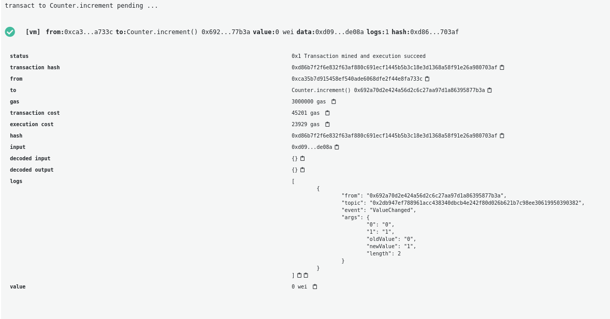

In Solidity, [events](/developers/docs/smart-contracts/anatomy/#events-and-logs) are dispatched signals the smart contracts can fire. Dapps, or anything connected to Ethereum JSON-RPC API, can listen to these events and act accordingly. An event can also be indexed so that the event history is searchable later.

## Events {#events}

The most common event on the Ethereum blockchain at the time of writing this article is the Transfer event that is emitted by ERC20 tokens when someone transfers tokens.

```solidity
event Transfer(address indexed from, address indexed to, uint256 value);
```

The event signature is declared inside of the contract code and can be emitted with the emit keyword. For example, the transfer event logs who sent the transfer (_from_), to who (_to_) and how much tokens were transferred (_value_).

If we get back to our Counter smart contract and decide to log every time the value is changed. As this contract is not meant to be deployed but serve as a base for building another contract by extending it: it’s called an abstract contract. In the case of our counter example, it would look like this:

```solidity
pragma solidity 0.5.17;

contract Counter {

    event ValueChanged(uint oldValue, uint256 newValue);

    // Private variable of type unsigned int to keep the number of counts
    uint256 private count = 0;

    // Function that increments our counter
    function increment() public {
        count += 1;
        emit ValueChanged(count - 1, count);
    }

    // Getter to get the count value
    function getCount() public view returns (uint256) {
        return count;
    }

}
```

Notice that:

- **Line 5**: we declare our event and what it contains, the old value and the new value.

- **Line 13**: When we increment our count variable, we emit the event.

If we now deploy the contract and call the increment function, we’ll see that Remix will automatically display it if you click on the new transaction inside an array named logs.



Logs are really useful for debugging your smart contracts but they are also important if you build applications used by different people and make it easier to make analytics to track and understand how your smart contract is used. The logs generated by transactions are displayed in popular block explorers and you can also for example use them to create off chain scripts for listening to specific events and taking action when they occur.
