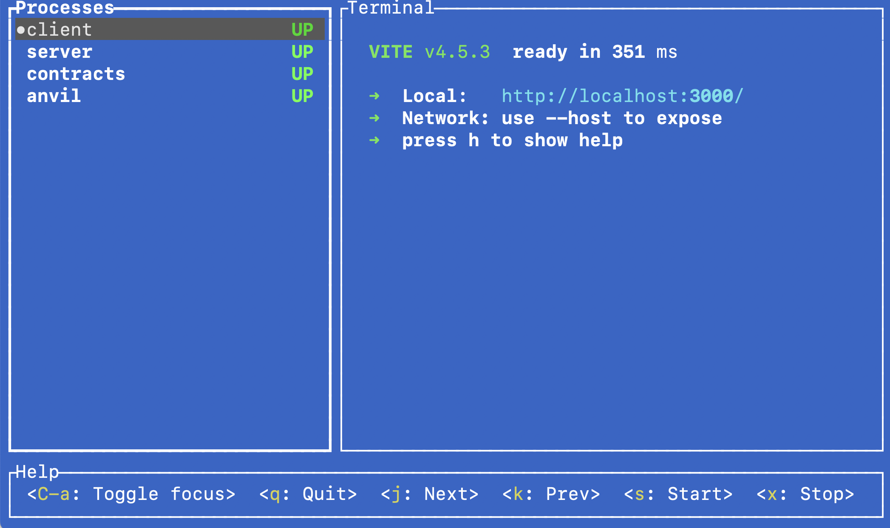

_There are no secrets on the blockchain_. Everything that is posted on the blockchain is open to everybody to read. This is necessary, because the blockchain is based on anybody being able to verify it. However, games often rely on secret state. For example, the game of [minesweeper](<https://en.wikipedia.org/wiki/Minesweeper_(video_game)>) makes absolutely no sense if you can just go on a blockchain explorer and see the map.

The simplest solution is to use a [server component](/developers/tutorials/server-components/) to hold the secret state. However, the reason we use blockchain is to prevent cheating by the game developer. We need to ensure the server component's honesty. The server can provide a hash of the state, and use [zero-knowledge proofs](/zero-knowledge-proofs/#why-zero-knowledge-proofs-are-important) to prove that the state used to calculate the result of a move is the correct one.

After reading this article you will know how to create this kind of secret state holding server, a client for showing the state, and an onchain component for communication between the two. The main tools we use will be:

| Tool                                          | Purpose                                                 | Verified on version |
| --------------------------------------------- | ------------------------------------------------------- | ------------------: |
| [Zokrates](https://zokrates.github.io/)       | Zero-knowledge proofs and their verification            |               1.1.9 |
| [Typescript](https://www.typescriptlang.org/) | Programming language for both the server and the client |               5.4.2 |
| [Node](https://nodejs.org/en)                 | Running the server                                      |             20.18.2 |
| [Viem](https://viem.sh/)                      | Communication with the Blockchain                       |              2.9.20 |
| [MUD](https://mud.dev/)                       | Onchain data management                                 |              2.0.12 |
| [React](https://react.dev/)                   | Client user interface                                   |              18.2.0 |
| [Vite](https://vitejs.dev/)                   | Serving the client code                                 |               4.2.1 |

## Minesweeper example {#minesweeper}

[Minesweeper](<https://en.wikipedia.org/wiki/Minesweeper_(video_game)>) is a game that includes a secret map with a minefield. The player chooses to dig in a specific location. If that location has a mine, it's game over. Otherwise, the player gets the number of mines in the eight squares surrounding that location.

This application is written using [MUD](https://mud.dev/), a framework that lets us store data onchain using a [key-value database](https://aws.amazon.com/nosql/key-value/) and synchronize that data automatically with offchain components. In addition to synchronization, MUD makes it easy to provide access control, and for other users to [extend](https://mud.dev/guides/extending-a-world) our application permissionlessly.

### Running the minesweeper example {#running-minesweeper-example}

To run the minesweeper example:

1. Make sure you [have the prerequisites installed](https://mud.dev/quickstart#prerequisites): [Node](https://mud.dev/quickstart#prerequisites), [Foundry](https://book.getfoundry.sh/getting-started/installation), [`git`](https://git-scm.com/downloads), [`pnpm`](https://git-scm.com/downloads), and [`mprocs`](https://github.com/pvolok/mprocs).

2. Clone the repository.

   ```sh copy
   git clone https://github.com/qbzzt/20240901-secret-state.git
   ```

3. Install the packages.

   ```sh copy
   cd 20240901-secret-state/
   pnpm install
   npm install -g mprocs
   ```

   If Foundry was installed as part of `pnpm install`, you need to restart the command-line shell.

4. Compile the contracts

    ```sh copy
    cd packages/contracts
    forge build
    cd ../..
    ```


5. Start the program (including an [anvil](https://book.getfoundry.sh/anvil/) blockchain) and wait.

   ```sh copy
   mprocs
   ```

   Note that the startup takes a long time. To see the progress, first use the down arrow to scroll to the _contracts_ tab to see the MUD contracts being deployed. When you get the message _Waiting for file changes…_, the contracts are deployed and further progress will happen in the _server_ tab. There, you wait until you get the message _Verifier address: 0x...._.

   If this step is successful, you will see the `mprocs` screen, with the different processes on the left and the console output for the currently selected process on the right.

   

   If there is a problem with `mprocs`, you can run the four processes manually, each in its own command line window:

   - **Anvil**

     ```sh
     cd packages/contracts
     anvil --base-fee 0 --block-time 2
     ```

   - **Contracts** 

     ```sh
     cd packages/contracts
     pnpm mud dev-contracts --rpc http://127.0.0.1:8545
     ```

   - **Server**

     ```sh
     cd packages/server
     pnpm start
     ```  

   - **Client**

     ```sh
     cd packages/client
     pnpm run dev
     ```  

6. Now you can browse to [the client](http://localhost:3000), click **New Game**, and start playing.

### Tables {#tables}

We need [several tables](https://github.com/qbzzt/20240901-secret-state/blob/main/packages/contracts/mud.config.ts) onchain.

- `Configuration`: This table is a singleton, it has no key and single record. It is used to hold game configuration information:
  - `height`: The height of a minefield
  - `width`: The width of a minefield
  - `numberOfBombs`: The number of bombs in each minefield
- `VerifierAddress`: This table is also a singleton. It is used to hold one part of the configuration, the address of the verifier contract (`verifier`). We could have put this information in the `Configuration` table, but it is set by a different component, the server, so it's easier to put it in a separate table.

- `PlayerGame`: The key is the player's address. The data is:

  - `gameId`: 32-byte value that is the hash of the map the player is playing on (the game identifier).
  - `win`: a boolean that is whether the player won the game.
  - `lose`: a boolean that is whether the player lost the game.
  - `digNumber`: the number of successful digs in the game.

- `GamePlayer`: This table holds the reverse mapping, from `gameId` to player address.

- `Map`: The key is a tuple of three values:

  - `gameId`: 32-byte value that is the hash of the map the player is playing on (the game identifier).
  - `x` coordinate
  - `y` coordinate

  The value is a single number. It's 255 if a bomb was detected. Otherwise, it is the number of bombs around that location plus one. We cannot just use the number of bombs, because by default all storage in the EVM and all row values in MUD are zero. We need to distinguish between "the player haven't dug here yet" and "the player dug here, and found there are zero bombs around".

In addition, communication between the client and server happens through the onchain component. This is also implemented using tables.

- `PendingGame`: Unserviced requests to start a new game.
- `PendingDig`: Unserviced requests to dig in a specific place in a specific game. This is an [offchain table](https://mud.dev/store/tables#types-of-tables), meaning that it does not get written to EVM storage, it's only readable offchain using events.

### Execution and data flows {#execution-data-flows}

These flows coordinate execution between the client, the onchain component, and the server.

#### Initialization {#initialization-flow}

When you run `mprocs`, these steps happen:

1. [`mprocs`](https://github.com/pvolok/mprocs) runs four components:

   - [Anvil](https://book.getfoundry.sh/anvil/), which runs a local blockchain
   - [Contracts](https://github.com/qbzzt/20240901-secret-state/tree/main/packages/contracts), which compiles (if needed) and deploys the contracts for MUD
   - [Client](https://github.com/qbzzt/20240901-secret-state/tree/main/packages/client), which runs [Vite](https://vitejs.dev/) to serve the UI and client code to web browsers.
   - [Server](https://github.com/qbzzt/20240901-secret-state/tree/main/packages/server), which performs the server actions

2. The `contracts` package deploys the MUD contracts and then runs [the `PostDeploy.s.sol` script](https://github.com/qbzzt/20240901-secret-state/blob/main/packages/contracts/script/PostDeploy.s.sol). This script sets the configuration. The code from github specifies [a 10x5 minefield with eight mines in it](https://github.com/qbzzt/20240901-secret-state/blob/main/packages/contracts/script/PostDeploy.s.sol#L23).

3. [The server](https://github.com/qbzzt/20240901-secret-state/blob/main/packages/server/src/app.ts) starts by [setting up MUD](https://github.com/qbzzt/20240901-secret-state/blob/main/packages/server/src/app.ts#L6). Among other things, this activates data synchronization, so that a copy of the relevant tables exists in the server's memory.

4. The server subscribes a function to be executed [when the `Configuration` table changes](https://github.com/qbzzt/20240901-secret-state/blob/main/packages/server/src/app.ts#L23). [This function](https://github.com/qbzzt/20240901-secret-state/blob/main/packages/server/src/app.ts#L24-L168) is called after `PostDeploy.s.sol` executes and modifies the table.

5. When the server initialization function has the configuration, [it calls `zkFunctions`](https://github.com/qbzzt/20240901-secret-state/blob/main/packages/server/src/app.ts#L34-L35) to initialize [the zero-knowledge part of the server](#using-zokrates-from-typescript). This cannot happen until we get the configuration because the zero-knowledge functions have to have the width and height of the minefield as constants.

6. After the zero-knowledge part of the server is initialized, the next step is to [deploy the zero-knowledge verification contract to the blockchain](https://github.com/qbzzt/20240901-secret-state/blob/main/packages/server/src/app.ts#L42-L53) and set the verifiee address in MUD.

7. Finally, we subscribe to updates so we'll see when a player requests either [to start a new game](https://github.com/qbzzt/20240901-secret-state/blob/main/packages/server/src/app.ts#L55-L71) or to [dig in an existing game](https://github.com/qbzzt/20240901-secret-state/blob/main/packages/server/src/app.ts#L73-L108).

#### New game {#new-game-flow}

This is what happens when the player requests a new game.

1. If there is no game in progress for this player, or there is one but with a gameId of zero, the client displays a [new game button](https://github.com/qbzzt/20240901-secret-state/blob/main/packages/client/src/App.tsx#L175). When the user presses this button, [React runs the `newGame` function](https://github.com/qbzzt/20240901-secret-state/blob/main/packages/client/src/App.tsx#L96).

2. [`newGame`](https://github.com/qbzzt/20240901-secret-state/blob/main/packages/client/src/mud/createSystemCalls.ts#L43-L46) is a `System` call. In MUD all calls are routed through the `World` contract, and in most cases you call `<namespace>__<function name>`. In this case, the call is to `app__newGame`, which MUD then routes to [`newGame` in `GameSystem`](https://github.com/qbzzt/20240901-secret-state/blob/main/packages/contracts/src/systems/GameSystem.sol#L16-L22).

3. The onchain function checks that the player does not have a game in progress, and if there isn't one [adds the request to the `PendingGame` table](https://github.com/qbzzt/20240901-secret-state/blob/main/packages/contracts/src/systems/GameSystem.sol#L21).

4. The server detects the change in `PendingGame` and [runs the subscribed function](https://github.com/qbzzt/20240901-secret-state/blob/main/packages/server/src/app.ts#L55-L71). This function calls [`newGame`](https://github.com/qbzzt/20240901-secret-state/blob/main/packages/server/src/app.ts#L110-L114), which in turn calls [`createGame`](https://github.com/qbzzt/20240901-secret-state/blob/main/packages/server/src/app.ts#L116-L144).

5. The first thing `createGame` does is [create a random map with the appropriate number of mines](https://github.com/qbzzt/20240901-secret-state/blob/main/packages/server/src/app.ts#L120-L135). Then, it calls [`makeMapBorders`](https://github.com/qbzzt/20240901-secret-state/blob/main/packages/server/src/app.ts#L147-L166) to create a map with blank borders, which is necessary for Zokrates. Finally, `createGame` calls [`calculateMapHash`](#calculateMapHash), to get the hash of the map, which is used as the game ID.

6. The `newGame` function adds the new game to `gamesInProgress`.

7. The last thing the server does is call [`app__newGameResponse`](https://github.com/qbzzt/20240901-secret-state/blob/main/packages/contracts/src/systems/ServerSystem.sol#L38-L43), which is onchain. This function is in a different `System`, [`ServerSystem`](https://github.com/qbzzt/20240901-secret-state/blob/main/packages/contracts/src/systems/ServerSystem.sol), to enable access control. Access control is defined in the [MUD configuration file](https://mud.dev/config), [`mud.config.ts`](https://github.com/qbzzt/20240901-secret-state/blob/main/packages/contracts/mud.config.ts#L67-L72).

   The access list only allows a single address to call the `System`. This restricts access to the server functions to a single address, so nobody can impersonate the server.

8. The onchain component updates the relevant tables:

   - Create the game in `PlayerGame`.
   - Set the reverse mapping in `GamePlayer`.
   - Remove the request from `PendingGame`.

9. The server identifies the change in `PendingGame`, but does not do anything because [`wantsGame`](https://github.com/qbzzt/20240901-secret-state/blob/main/packages/server/src/app.ts#L58-L60) is false.

10. On the client [`gameRecord`](https://github.com/qbzzt/20240901-secret-state/blob/main/packages/client/src/App.tsx#L143-L148) is set to the `PlayerGame` entry for the player's address. When `PlayerGame` changes, `gameRecord` changes too.

11. If there is a value in `gameRecord`, and the game hasn't been won or lost, the client [displays the map](https://github.com/qbzzt/20240901-secret-state/blob/main/packages/client/src/App.tsx#L175-L190).

#### Dig {#dig-flow}

1. The player [clicks the map cell's button](https://github.com/qbzzt/20240901-secret-state/blob/main/packages/client/src/App.tsx#L188), which calls [the `dig` function](https://github.com/qbzzt/20240901-secret-state/blob/main/packages/client/src/mud/createSystemCalls.ts#L33-L36). This function calls [`dig` onchain](https://github.com/qbzzt/20240901-secret-state/blob/main/packages/contracts/src/systems/GameSystem.sol#L24-L32).

2. The onchain component [performs a number of sanity checks](https://github.com/qbzzt/20240901-secret-state/blob/main/packages/contracts/src/systems/GameSystem.sol#L25-L30), and if successful adds the dig request to [`PendingDig`](https://github.com/qbzzt/20240901-secret-state/blob/main/packages/contracts/src/systems/GameSystem.sol#L31).

3. The server [detects the change in `PendingDig`](https://github.com/qbzzt/20240901-secret-state/blob/main/packages/server/src/app.ts#L73). [If it is valid](https://github.com/qbzzt/20240901-secret-state/blob/main/packages/server/src/app.ts#L75-L84), it [calls the zero-knowledge code](https://github.com/qbzzt/20240901-secret-state/blob/main/packages/server/src/app.ts#L86-L95) (explained below) to generate both the result and a proof that it is valid.

4. [The server](https://github.com/qbzzt/20240901-secret-state/blob/main/packages/server/src/app.ts#L97-L107) calls [`digResponse`](https://github.com/qbzzt/20240901-secret-state/blob/main/packages/contracts/src/systems/ServerSystem.sol#L45-L64) onchain.

5. `digResponse` does two things. First, it checks [the zero knowledge proof](https://github.com/qbzzt/20240901-secret-state/blob/main/packages/contracts/src/systems/ServerSystem.sol#L47-L61). Then, if the proof checks out, it calls [`processDigResult`](https://github.com/qbzzt/20240901-secret-state/blob/main/packages/contracts/src/systems/ServerSystem.sol#L67-L86) to actually process the result.

6. `processDigResult` checks if the game has been [lost](https://github.com/qbzzt/20240901-secret-state/blob/main/packages/contracts/src/systems/ServerSystem.sol#L76-L78) or [won](https://github.com/qbzzt/20240901-secret-state/blob/main/packages/contracts/src/systems/ServerSystem.sol#L83-L86), and [updates `Map`, the onchain map](https://github.com/qbzzt/20240901-secret-state/blob/main/packages/contracts/src/systems/ServerSystem.sol#L80).

7. The client picks up the updates automatically and [updates the map displayed to the player](https://github.com/qbzzt/20240901-secret-state/blob/main/packages/client/src/App.tsx#L175-L190), and if applicable tells the player if it's a win or a lose.

## Using Zokrates {#using-zokrates}

In the flows explained above we skipped over the zero-knowledge parts, treating them as a black box. Now let's crank it open and see how that code is written.

### Hashing the map {#hashing-map}

We can use [this JavaScript code](https://github.com/ZK-Plus/ICBC24_Tutorial_Compute-Offchain-Verify-onchain/tree/solutions/exercise) to implement [Poseidon](https://www.poseidon-hash.info), the Zokrates hash function we use. However, while this would be faster, it would also be more complicated than just using the Zokrates hash function to do it. This is a tutorial, and so the code is optimized for simplicity, not for performance. Therefore, we need two different Zokrates programs, one to just calculate the hash of a map (`hash`) and one to actually create a zero-knowledge proof of the result of the dig in a location on the map (`dig`).

### The hash function {#hash-function}

This is the function that calculates the hash of a map. We'll go over this code line by line.

```
import "hashes/poseidon/poseidon.zok" as poseidon;
import "utils/pack/bool/pack128.zok" as pack128;
```

These two lines import two functions from the [Zokrates standard library](https://zokrates.github.io/toolbox/stdlib.html). [The first function](https://github.com/Zokrates/ZoKrates/blob/latest/zokrates_stdlib/stdlib/hashes/poseidon/poseidon.zok) is a [Poseidon hash](https://www.poseidon-hash.info/). It takes an array of [`field` elements](https://zokrates.github.io/language/types.html#field) and returns a `field`.

The field element in Zokrates is typically less than 256 bits long, but not by much. To simplify the code, we restrict the map to be up to 512 bits, and hash an array of four fields, and in each field we use only 128 bits. [The `pack128` function](https://github.com/Zokrates/ZoKrates/blob/latest/zokrates_stdlib/stdlib/utils/pack/bool/pack128.zok) changes an array of 128 bits into a `field` for this purpose.

```
        def hashMap(bool[${width+2}][${height+2}] map) -> field {
```

This line starts a function definition. `hashMap` gets a single parameter called `map`, a two dimensional `bool`(ean) array. The size of the map is `width+2` by `height+2` for reasons that are [explained below](#why-map-border).

We can use `${width+2}` and `${height+2}` because the Zokrates programs are stored in this application as [template strings](https://www.w3schools.com/js/js_string_templates.asp). Code between `${` and `}` is evaluated by JavaScript, and this way the program can be used for different map sizes. The map parameter has a one location wide border all around it without any bombs, which is the reason we need to add two to the width and height.

The return value is a `field` that contains the hash.

```
   bool[512] mut map1d = [false; 512];
```

The map is two-dimensional. However, the `pack128` function does not work with two-dimensional arrays. So we first flatten the map into a 512-byte array, using `map1d`. By default Zokrates variables are constants, but we need to assign values to this array in a loop, so we define it as [`mut`](https://zokrates.github.io/language/variables.html#mutability).

We need to initialize the array because Zokrates doesn't have `undefined`. The `[false; 512]` expression means [an array of 512 `false` values](https://zokrates.github.io/language/types.html#declaration-and-initialization).

```
   u32 mut counter = 0;
```

We also need a counter to distinguish between the bits we already filled in `map1d` and those we haven't.

```
   for u32 x in 0..${width+2} {
```

This is how you declare a [`for` loop](https://zokrates.github.io/language/control_flow.html#for-loops) in Zokrates. A Zokrates `for` loop has to have fixed bounds, because while it appears to be a loop, the compiler actually "unrolls" it. The expression `${width+2}` is a compile time constant because `width` is set by the TypeScript code before it calls the compiler.

```
      for u32 y in 0..${height+2} {
         map1d[counter] = map[x][y];
         counter = counter+1;
      }
   }
```

For every location in the map, put that value in the `map1d` array and increment the counter.

```
    field[4] hashMe = [
        pack128(map1d[0..128]),
        pack128(map1d[128..256]),
        pack128(map1d[256..384]),
        pack128(map1d[384..512])
    ];
```

The `pack128` to create an array of four `field` values from `map1d`. In Zokrates `array[a..b]` means the slice of the array that starts at `a` and ends at `b-1`.

```
    return poseidon(hashMe);
}
```

Use `poseidon` to convert this array to a hash.

### The hash program {#hash-program}

The server needs to call `hashMap` directly to create game identifiers. However, Zokrates can only call the `main` function on a program to start, so we create a program with a `main` that calls the hash function.

```
${hashFragment}

def main(bool[${width+2}][${height+2}] map) -> field {
    return hashMap(map);
}
```

### The dig program {#dig-program}

This is the heart of the zero-knowledge part of the application, where we produce the proofs that are used to verify dig results.

```
${hashFragment}

// The number of mines in location (x,y)
def map2mineCount(bool[${width+2}][${height+2}] map, u32 x, u32 y) -> u8 {
   return if map[x+1][y+1] { 1 } else { 0 };
}
```

#### Why map border {#why-map-border}

Zero-knowledge proofs use [arithmetic circuits](https://medium.com/web3studio/simple-explanations-of-arithmetic-circuits-and-zero-knowledge-proofs-806e59a79785), which don't have an easy equivalent to an `if` statement. Instead, they use the equivalent of the [conditional operator](https://en.wikipedia.org/wiki/Ternary_conditional_operator). If `a` can be either zero or one, you can calculate `if a { b } else { c }` as `ab+(1-a)c`.

Because of this, a Zokrates `if` statement always evaluates both branches. For example, if you have this code:

```
bool[5] arr = [false; 5];
u32 index=10;
return if index>4 { 0 } else { arr[index] }
```

It will error out, because it needs to calculate `arr[10]`, even though that value will be later multiplied by zero.

This is the reason we need a one location wide border all around the map. We need to calculate the total number of mines around a location, and that means we need to see the location one row above and below, to the left and to the right, of the location where we're digging. Which means those location have to exist in the map array that Zokrates is provided.

```
def main(private bool[${width+2}][${height+2}] map, u32 x, u32 y) -> (field, u8) {
```

By default Zokrates proofs include their inputs. It does no good to know there are five mines around a spot unless you actually know which spot it is (and you can't just match it to your request, because then the prover could use different values and not tell you about it). However, we need to keep the map a secret, while providing it to Zokrates. The solution is to use a `private` parameter, one that is _not_ revealed by the proof.

This opens another venue for abuse. The prover could use the correct coordinates, but create a map with any number of mines around the location, and possibly at the location itself. To prevent this abuse, we make the zero knowledge proof include the hash of the map, which is the game identifier.

```
   return (hashMap(map),
```

The return value here is a tuple that includes the map hash array as well as the dig result.

```
         if map2mineCount(map, x, y) > 0 { 0xFF } else {
```

We use 255 as a special value in case the location itself has a bomb.

```
            map2mineCount(map, x-1, y-1) + map2mineCount(map, x, y-1) + map2mineCount(map, x+1, y-1) +
            map2mineCount(map, x-1, y) + map2mineCount(map, x+1, y) +
            map2mineCount(map, x-1, y+1) + map2mineCount(map, x, y+1) + map2mineCount(map, x+1, y+1)
         }
   );
}
```

If the player hasn't hit a mine, add the mine counts for the area around the location and return that.

### Using Zokrates from TypeScript {#using-zokrates-from-typescript}

Zokrates has a command line interface, but in this program we use it in the [TypeScript code](https://zokrates.github.io/toolbox/zokrates_js.html).

The library that contains the Zokrates definitions is called [`zero-knowledge.ts`](https://github.com/qbzzt/20240901-secret-state/blob/main/packages/server/src/zero-knowledge.ts).

```typescript
import { initialize as zokratesInitialize } from "zokrates-js"
```

Import the [Zokrates JavaScript bindings](https://zokrates.github.io/toolbox/zokrates_js.html). We only need the [`initialize`](https://zokrates.github.io/toolbox/zokrates_js.html#initialize) function because it returns a promise that resolves to all the Zokrates definitions.

```typescript
export const zkFunctions = async (width: number, height: number) : Promise<any> => {
```

Similar to Zokrates itself, we also export only one function, which is also [asynchronous](https://www.w3schools.com/js/js_async.asp). When it eventually returns, it provides several functions as we'll see below.

```typescript
const zokrates = await zokratesInitialize()
```

Initialize Zokrates, get everything we need from the library.

```typescript
const hashFragment = `
        import "utils/pack/bool/pack128.zok" as pack128;
        import "hashes/poseidon/poseidon.zok" as poseidon;
            .
            .
            .
        }
    `

const hashProgram = `
        ${hashFragment}
            .
            .
            .
    `

const digProgram = `
        ${hashFragment}
            .
            .
            .
    `
```

Next we have the hash function and two Zokrates programs we saw above.

```typescript
const digCompiled = zokrates.compile(digProgram)
const hashCompiled = zokrates.compile(hashProgram)
```

Here we compile those programs.

```typescript
// Create the keys for zero knowledge verification.
// On a production system you'd want to use a setup ceremony.
// (https://zokrates.github.io/toolbox/trusted_setup.html#initializing-a-phase-2-ceremony).
const keySetupResults = zokrates.setup(digCompiled.program, "")
const verifierKey = keySetupResults.vk
const proverKey = keySetupResults.pk
```

On a production system we might use a more complicated [setup ceremony](https://zokrates.github.io/toolbox/trusted_setup.html#initializing-a-phase-2-ceremony), but this is good enough for a demonstration. It's not a problem that the users can know the prover key - they still cannot use it to prove things unless they are true. Because we specify the entropy (the second parameter, `""`), the results are always going to be the same.

**Note:** Compilation of Zokrates programs and key creation are slow processes. There is no need to repeat them every time, just when map size changes. On a production system you'd do them once, and then store the output. The only reason I am not doing it here is for the sake of simplicity.

#### `calculateMapHash` {#calculateMapHash}

```typescript
const calculateMapHash = function (hashMe: boolean[][]): string {
  return (
    "0x" +
    BigInt(zokrates.computeWitness(hashCompiled, [hashMe]).output.slice(1, -1))
      .toString(16)
      .padStart(64, "0")
  )
}
```

The [`computeWitness`](https://zokrates.github.io/toolbox/zokrates_js.html#computewitnessartifacts-args-options) function actually runs the Zokrates program. It returns a structure with two fields: `output`, which is the output of the program as a JSON string, and `witness`, which is the information needed to create the a zero knowledge proof of the result. Here we just need the output.

The output is a string of the form `"31337"`, a decimal number enclosed in quotation marks. But the output we need for `viem` is a hexadecimal number of the form `0x60A7`. So we use `.slice(1,-1)` to remove the quotation marks and then `BigInt` to run the remaining string, which is a decimal number, to a [`BigInt`](https://developer.mozilla.org/en-US/docs/Web/JavaScript/Reference/Global_Objects/BigInt). `.toString(16)` converts this `BigInt` into a hexadecimal string, and `"0x"+` adds the marker for hexadecimal numbers.

```typescript
// Dig and return a zero knowledge proof of the result
// (server-side code)
```

The zero knowledge proof includes the public inputs (`x` and `y`) and results (hash of the map and number of bombs).

```typescript
    const zkDig = function(map: boolean[][], x: number, y: number) : any {
        if (x<0 || x>=width || y<0 || y>=height)
            throw new Error("Trying to dig outside the map")
```

It's a problem to check if an index is out of bounds in Zokrates, so we do it here.

```typescript
const runResults = zokrates.computeWitness(digCompiled, [map, `${x}`, `${y}`])
```

Execute the dig program.

```typescript
        const proof = zokrates.generateProof(
            digCompiled.program,
            runResults.witness,
            proverKey)

        return proof
    }
```

Use [`generateProof`](https://zokrates.github.io/toolbox/zokrates_js.html#generateproofprogram-witness-provingkey-entropy) and return the proof.

```typescript
const solidityVerifier = `
        // Map size: ${width} x ${height}
        \n${zokrates.exportSolidityVerifier(verifierKey)}
        `
```

A Solidity verifier, a smart contract we can deploy to the blockchain and use to verify proofs generated by `digCompiled.program`.

```typescript
    return {
        zkDig,
        calculateMapHash,
        solidityVerifier,
    }
}
```

Finally, return everything that other code might need.

## Security tests {#security-tests}

Security tests are important because a functionality bug will eventually reveal itself. But if the application is insecure, that is likely to remain hidden for a long time before it is revealed by somebody cheating and getting away with resources that belong to others.

### Permissions {#permissions}

There is one privileged entity in this game, the server. It is the only user allowed to call the functions in [`ServerSystem`](https://github.com/qbzzt/20240901-secret-state/blob/main/packages/contracts/src/systems/ServerSystem.sol). We can use [`cast`](https://book.getfoundry.sh/cast/) to verify calls to permissioned functions are only allowed as the server account.

[The server's private key is in `setupNetwork.ts`](https://github.com/qbzzt/20240901-secret-state/blob/main/packages/server/src/mud/setupNetwork.ts#L52).

1. On the computer that runs `anvil` (the blockchain), set these environment variables.

   ```sh copy
   WORLD_ADDRESS=0x8d8b6b8414e1e3dcfd4168561b9be6bd3bf6ec4b
   UNAUTHORIZED_KEY=0x5de4111afa1a4b94908f83103eb1f1706367c2e68ca870fc3fb9a804cdab365a
   AUTHORIZED_KEY=0x59c6995e998f97a5a0044966f0945389dc9e86dae88c7a8412f4603b6b78690d
   ```

2. Use `cast` to attempt to set the verifier address as an unauthorized address.

   ```sh copy
   cast send $WORLD_ADDRESS 'app__setVerifier(address)' `cast address-zero` --private-key $UNAUTHORIZED_KEY
   ```

   Not only does `cast` report a failure, but you can open **MUD Dev Tools** in the game on the browser, click **Tables**, and select **app\_\_VerifierAddress**. See that the address is not zero.

3. Set the verifier address as the server's address.

   ```sh copy
   cast send $WORLD_ADDRESS 'app__setVerifier(address)' `cast address-zero` --private-key $AUTHORIZED_KEY
   ```

   The address in **app\_\_VerifiedAddress** should now be zero.

All MUD functions in the same `System` go through the same access control, so I consider this test sufficient. If you don't, you can check the other functions in [`ServerSystem`](https://github.com/qbzzt/20240901-secret-state/blob/main/packages/contracts/src/systems/ServerSystem.sol).

### Zero-knowledge abuses {#zero-knowledge-abuses}

The math to verify Zokrates is beyond the scope of this tutorial (and my abilities). However, we can run various checks on the zero-knowledge code to verify that if it is not done correctly it fails. All of these tests are going to require us to change [`zero-knowledge.ts`](https://github.com/qbzzt/20240901-secret-state/blob/main/packages/server/src/zero-knowledge.ts) and restart the entire application. It is not sufficient to restart the server process, because it puts the application in an impossible state (the player has a game in progress, but the game is no longer available to the server).

#### Wrong answer {#wrong-answer}

The simplest possibility is to provide the wrong answer in the zero-knowledge proof. To do that, we go inside `zkDig` and [modify line 91](https://github.com/qbzzt/20240901-secret-state/blob/main/packages/server/src/zero-knowledge.ts#L91):

```ts
proof.inputs[3] = "0x" + "1".padStart(64, "0")
```

This means we'll always claim there is one bomb, regardless of the correct answer. Try to play with this version, and you'll see in the **server** tab of the `pnpm dev` screen this error:

```
      cause: {
        code: 3,
        message: 'execution reverted: revert: Zero knowledge verification fail',
        data: '0x08c379a0000000000000000000000000000000000000000000000000000000000000002000000000000000
000000000000000000000000000000000000000000000000205a65726f206b6e6f776c6564676520766572696669636174696f6
e206661696c'
      },
```

So this kind of cheat fails.

#### Wrong proof {#wrong-proof}

What happens if we provide the correct information, but just have the wrong proof data? Now, replace line 91 with:

```ts
proof.proof = {
  a: ["0x" + "1".padStart(64, "0"), "0x" + "2".padStart(64, "0")],
  b: [
    ["0x" + "1".padStart(64, "0"), "0x" + "2".padStart(64, "0")],
    ["0x" + "1".padStart(64, "0"), "0x" + "2".padStart(64, "0")],
  ],
  c: ["0x" + "1".padStart(64, "0"), "0x" + "2".padStart(64, "0")],
}
```

It still fails, but now it fails without a reason because it happens during the verifier call.

### How can a user verify the zero trust code? {#user-verify-zero-trust}

Smart contracts are relatively easy to verify. Typically, the developer publishes the source code to a block explorer, and the block explorer verifies that the source code does compile to the code in the [contract deployment transaction](https://ethereum.org/en/developers/docs/smart-contracts/deploying/). In the case of MUD `System`s this is [slightly more complicated](https://mud.dev/cli/verify), but not by much.

This is harder with zero-knowledge. The verifier includes some constants and runs some calculations on them. This doesn't tell you what is being proved.

```solidity
    function verifyingKey() pure internal returns (VerifyingKey memory vk) {
        vk.alpha = Pairing.G1Point(uint256(0x0f43f4fe7b5c2326fed4ac6ed2f4003ab9ab4ea6f667c2bdd77afb068617ee16), uint256(0x25a77832283f9726935219b5f4678842cda465631e72dbb24708a97ba5d0ce6f));
        vk.beta = Pairing.G2Point([uint256(0x2cebd0fbd21aca01910581537b21ae4fed46bc0e524c055059aa164ba0a6b62b), uint256(0x18fd4a7bc386cf03a95af7163d5359165acc4e7961cb46519e6d9ee4a1e2b7e9)], [uint256(0x11449dee0199ef6d8eebfe43b548e875c69e7ce37705ee9a00c81fe52f11a009), uint256(0x066d0c83b32800d3f335bb9e8ed5e2924cf00e77e6ec28178592eac9898e1a00)]);
```

The solution, at least until block explorers get around to adding Zokrates verification to their user interfaces, is for the application developers to make available the Zokrates programs, and for at least some users to compile them themselves with the appropriate verification key.

To do so:

1. [Install Zokrates](https://zokrates.github.io/gettingstarted.html).
2. Create a file, `dig.zok`, with the Zokrates program. The code below assumes you kept the original map size, 10x5.

   ```zokrates
    import "utils/pack/bool/pack128.zok" as pack128;
    import "hashes/poseidon/poseidon.zok" as poseidon;

    def hashMap(bool[12][7] map) -> field {
        bool[512] mut map1d = [false; 512];
        u32 mut counter = 0;

        for u32 x in 0..12 {
            for u32 y in 0..7 {
                map1d[counter] = map[x][y];
                counter = counter+1;
            }
        }

        field[4] hashMe = [
            pack128(map1d[0..128]),
            pack128(map1d[128..256]),
            pack128(map1d[256..384]),
            pack128(map1d[384..512])
        ];

        return poseidon(hashMe);
    }


    // The number of mines in location (x,y)
    def map2mineCount(bool[12][7] map, u32 x, u32 y) -> u8 {
        return if map[x+1][y+1] { 1 } else { 0 };
    }

    def main(private bool[12][7] map, u32 x, u32 y) -> (field, u8) {
        return (hashMap(map) ,
            if map2mineCount(map, x, y) > 0 { 0xFF } else {
                map2mineCount(map, x-1, y-1) + map2mineCount(map, x, y-1) + map2mineCount(map, x+1, y-1) +
                map2mineCount(map, x-1, y) + map2mineCount(map, x+1, y) +
                map2mineCount(map, x-1, y+1) + map2mineCount(map, x, y+1) + map2mineCount(map, x+1, y+1)
            }
        );
    }
   ```

3. Compile the Zokrates code and create the verification key. The verification key has to be created with the same entropy used in the original server, [in this case an empty string](https://github.com/qbzzt/20240901-secret-state/blob/main/packages/server/src/zero-knowledge.ts#L67).

   ```sh copy
   zokrates compile --input dig.zok
   zokrates setup -e ""
   ```

4. Create the Solidity verifier on your own, and verify it is functionally identical to the one on the blockchain (the server adds a comment, but that's not important).

   ```sh copy
   zokrates export-verifier
   diff verifier.sol ~/20240901-secret-state/packages/contracts/src/verifier.sol
   ```

## Design decisions {#design}

In any sufficiently complex application there are competing design goals that require trade-offs. Let's look at some of the tradeoffs and why the current solution is preferable to other options.

### Why zero-knowledge {#why-zero-knowledge}

For minesweeper you don't really need zero-knowledge. The server can always hold the map, and then just reveal all of it when the game is over. Then, at the end of the game, the smart contract can calculate the map hash, verify that it matches, and if it doesn't penalize the server or disregard the game completely.

I didn't use this simpler solution because it only works for short games with a well defined end state. When a game is potentially infinite (such as the case with [autonomous worlds](https://0xparc.org/blog/autonomous-worlds)), you need a solution that proves the state _without_ revealing it.

As a tutorial this article needed a short game that is easy to understand, but this technique is most useful for longer games.

### Why Zokrates? {#why-zokrates}

[Zokrates](https://zokrates.github.io/) isn't the only zero-knowledge library available, but it is similar to a normal, [imperative](https://en.wikipedia.org/wiki/Imperative_programming) programming language and supports boolean variables.

For your application, with different requirements, you might prefer to use [Circum](https://docs.circom.io/getting-started/installation/) or [Cairo](https://www.cairo-lang.org/tutorials/getting-started-with-cairo/).

### When to compile Zokrates {#when-compile-zokrates}

In this program we compile the Zokrates programs [every time the server starts](https://github.com/qbzzt/20240901-secret-state/blob/main/packages/server/src/zero-knowledge.ts#L60-L61). This is clearly a waste of resources, but this is a tutorial, optimized for simplicity.

If I were writing a production-level application, I'd check if I have a file with the compiled Zokrates programs at this minefield size, and if so use that. The same is true for deploying a verifier contract onchain.

### Creating the verifier and prover keys {#key-creation}

[Key creation](https://github.com/qbzzt/20240901-secret-state/blob/main/packages/server/src/zero-knowledge.ts#L63-L69) is another pure calculation that needn't be done more than once for a given minefield size. Again, it is done only once for the sake of simplicity.

Additionally, we could use [a setup ceremony](https://zokrates.github.io/toolbox/trusted_setup.html#initializing-a-phase-2-ceremony). The advantage of a setup ceremony is that you need either the entropy or some intermediate result from each participant to cheat on the zero-knowledge proof. If at least one ceremony participant is honest and deletes that information, the zero-knowledge proofs are safe from certain attacks. However, there is _no mechanism_ to verify that information has been deleted from everywhere. If zero-knowledge proofs are critically important, you want to participate in the setup ceremony.

Here we rely on [perpetual powers of tau](https://github.com/privacy-scaling-explorations/perpetualpowersoftau), which had dozens of participants. It is probably safe enough, and much simpler. We also don't add entropy to the during key creation, which makes it easier for users to [verify the zero-knowledge configuration](#user-verify-zero-trust).

### Where to verify {#where-verification}

We can verify the zero-knowledge proofs either onchain (which costs gas) or in the client (using [`verify`](https://zokrates.github.io/toolbox/zokrates_js.html#verifyverificationkey-proof)). I chose the first, because this lets you [verify the verifier](#user-verify-zero-trust) once and then trust that if doesn't change as long as the contract address for it stays the same. If verification was done on the client, you'd have to verify the code you receive each time you download the client.

Also, while this game is single player, a lot of blockchain games are multi-player. onchain verification means you only verify the zero-knowledge proof once. Doing it in the client would require each client to verify independently.

### Flatten the map in TypeScript or Zokrates? {#where-flatten}

In general, when processing can be done either in TypeScript or Zokrates, it is better to do it TypeScript, which is a lot faster, and does not require zero-knowledge proofs. This is the reason, for example, that we don't provide Zokrates with the hash and make it verify that it is correct. Hashing has to be done inside Zokrates, but the match between the returned hash and the hash onchain can happen outside it.

However, we still [flatten the map in Zokrates](https://github.com/qbzzt/20240901-secret-state/blob/main/packages/server/src/zero-knowledge.ts#L15-L20), whereas we could have done it in TypeScript. The reason is that the other options are, in my opinion, worse.

- Provide a one dimensional array of boolean to the Zokrates code, and use an expression such as `x*(height+2)
+y` to get the two dimensional map. This would make [the code](https://github.com/qbzzt/20240901-secret-state/blob/main/packages/server/src/zero-knowledge.ts#L44-L47) somewhat more complicated, so I decided the performance gain isn't worth it for a tutorial.

- Send Zokrates both the one dimensional array and the two dimensional array. However, this solution doesn't gain us anything. The Zokrates code would have to verify that the one dimensional array it is provided really is the correct representation of the two dimensional array. So there wouldn't be any performance gain.

- Flatten the two dimensional array in Zokrates. This is the simplest option, so I chose it.

### Where to store maps {#where-store-maps}

In this application [`gamesInProgress`](https://github.com/qbzzt/20240901-secret-state/blob/main/packages/server/src/app.ts#L20) is simply a variable in memory. This means that if you server dies and needs to be restarted, all the information it stored is lost. Not only are players unable to continue their game, they cannot even start a new game because the onchain component thinks they still have a game in progress.

This is clearly bad design for a production system, in which you'd store this information in a database. The only reason I used a variable here is because this is a tutorial and simplicity is the main consideration.

## Conclusion: Under what conditions is this the appropriate technique? {#conclusion}

So, now you know how to write a game with a server that stores secret state that doesn't belong onchain. But in what cases should you do it? There are two main considerations.

- _Long running game_: [As mentioned above](#why-zero-knowledge), in a short game you can just publish the state once the game is over and have everything verified then. But that is not an option when the game takes a long or indefinite time, and the state needs to stay secret.

- _Some centralization acceptable_: Zero-knowledge proofs can verify integrity, that an entity is not faking the results. What they can't do is ensure that the entity will still be available and answer messages. In situations where availability also needs to be decentralized, zero-knowledge proofs are not a sufficient solution, and you need [multi-party computation](https://en.wikipedia.org/wiki/Secure_multi-party_computation).

### Acknowledgements {#acknowledgements}

- Alvaro Alonso read a draft of this article and cleared up some of my misunderstandings about Zokrates.

Any remaining errors are my responsibility.
