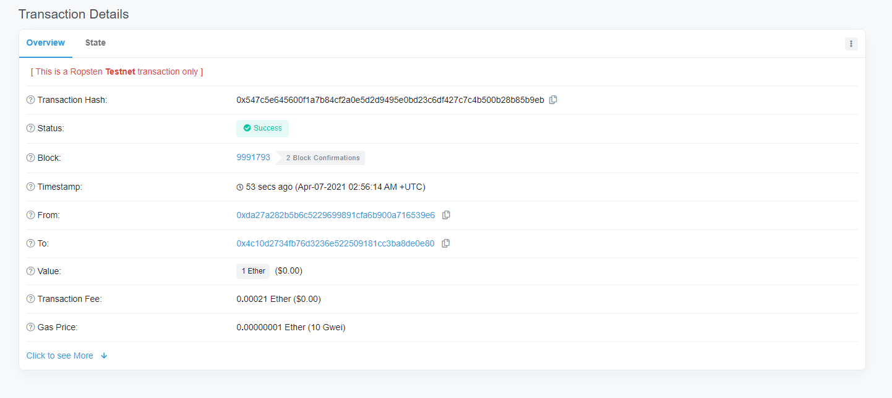

## Send Token Using ethers.js(5.0) {#send-token}

### In This Tutorial You'll Learn How To {#you-learn-about}

- Import ethers.js
- Transfer token
- Set gas price according to the network traffic situation

### To-Get-Started {#to-get-started}

To get started, we must first import the ethers.js library into our javascript
Include ethers.js(5.0)

### Installing {#install-ethersjs}

```shell
/home/ricmoo> npm install --save ethers
```

ES6 in the Browser

```html
<script type="module">
  import { ethers } from "https://cdn.ethers.io/lib/ethers-5.0.esm.min.js"
  // Your code here...
</script>
```

ES3(UMD) in the Browser

```html
<script
  src="https://cdn.ethers.io/lib/ethers-5.0.umd.min.js"
  type="application/javascript"
></script>
```

### Parameters {#param}

1. **`contract_address`**: Token contract address (contract address is needed when the token you want to transfer is not ether)
2. **`send_token_amount`**: The amount you want to send to the receiver
3. **`to_address`**: The receiver's address
4. **`send_account`**: The sender's address
5. **`private_key`**: Private key of the sender to sign the transaction and actually transfer the tokens

## Notice {#notice}

`signTransaction(tx)` is removed because `sendTransaction()` does it internally.

## Sending Procedures {#procedure}

### 1. Connect to network (testnet) {#connect-to-network}

#### Set Provider (Infura) {#set-provider}

Connect to Ropsten testnet

```javascript
window.ethersProvider = new ethers.providers.InfuraProvider("ropsten")
```

### 2. Create wallet {#create-wallet}

```javascript
let wallet = new ethers.Wallet(private_key)
```

### 3. Connect Wallet to net {#connect-wallet-to-net}

```javascript
let walletSigner = wallet.connect(window.ethersProvider)
```

### 4. Get current gas price {#get-gas}

```javascript
window.ethersProvider.getGasPrice() // gasPrice
```

### 5. Define Transaction {#define-transaction}

These variables defined below are dependent on `send_token()`

### Transaction parameters {#transaction-params}

1. **`send_account`**: address of the token sender
2. **`to_address`**: address of the token receiver
3. **`send_token_amount`**: the amount of tokens to send
4. **`gas_limit`**: gas limit
5. **`gas_price`**: gas price

[See below for how to use](#how-to-use)

```javascript
const tx = {
  from: send_account,
  to: to_address,
  value: ethers.utils.parseEther(send_token_amount),
  nonce: window.ethersProvider.getTransactionCount(send_account, "latest"),
  gasLimit: ethers.utils.hexlify(gas_limit), // 100000
  gasPrice: gas_price,
}
```

### 6. Transfer {#transfer}

```javascript
walletSigner.sendTransaction(tx).then((transaction) => {
  console.dir(transaction)
  alert("Send finished!")
})
```

## How to use it {#how-to-use}

```javascript
let private_key =
  "41559d28e936dc92104ff30691519693fc753ffbee6251a611b9aa1878f12a4d"
let send_token_amount = "1"
let to_address = "0x4c10D2734Fb76D3236E522509181CC3Ba8DE0e80"
let send_address = "0xda27a282B5B6c5229699891CfA6b900A716539E6"
let gas_limit = "0x100000"
let wallet = new ethers.Wallet(private_key)
let walletSigner = wallet.connect(window.ethersProvider)
let contract_address = ""
window.ethersProvider = new ethers.providers.InfuraProvider("ropsten")

send_token(
  contract_address,
  send_token_amount,
  to_address,
  send_address,
  private_key
)
```

### Success! {#success}



## send_token() {#send-token-method}

```javascript
function send_token(
  contract_address,
  send_token_amount,
  to_address,
  send_account,
  private_key
) {
  let wallet = new ethers.Wallet(private_key)
  let walletSigner = wallet.connect(window.ethersProvider)

  window.ethersProvider.getGasPrice().then((currentGasPrice) => {
    let gas_price = ethers.utils.hexlify(parseInt(currentGasPrice))
    console.log(`gas_price: ${gas_price}`)

    if (contract_address) {
      // general token send
      let contract = new ethers.Contract(
        contract_address,
        send_abi,
        walletSigner
      )

      // How many tokens?
      let numberOfTokens = ethers.utils.parseUnits(send_token_amount, 18)
      console.log(`numberOfTokens: ${numberOfTokens}`)

      // Send tokens
      contract.transfer(to_address, numberOfTokens).then((transferResult) => {
        console.dir(transferResult)
        alert("sent token")
      })
    } // ether send
    else {
      const tx = {
        from: send_account,
        to: to_address,
        value: ethers.utils.parseEther(send_token_amount),
        nonce: window.ethersProvider.getTransactionCount(
          send_account,
          "latest"
        ),
        gasLimit: ethers.utils.hexlify(gas_limit), // 100000
        gasPrice: gas_price,
      }
      console.dir(tx)
      try {
        walletSigner.sendTransaction(tx).then((transaction) => {
          console.dir(transaction)
          alert("Send finished!")
        })
      } catch (error) {
        alert("failed to send!!")
      }
    }
  })
}
```
