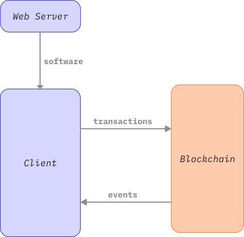
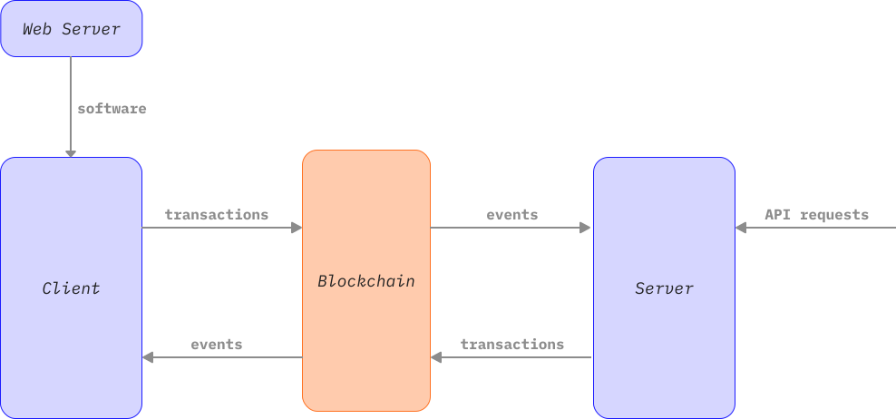

## Introduction {#introduction}

In most cases, a decentralized app uses a server to distribute the software, but all the actual interaction happens between the client (typically, web browser) and the blockchain.



However, there are some cases where an application would benefit from having a server component that runs independently. Such a server would be able to respond to events, and to requests that come from other sources, such as an API, by issuing transactions.



There are several possible tasks for such a server could fulfill.

- Holder of secret state. In gaming it is often useful not to have all the information that the game knows available to the players. However, *there are no secrets on the blockchain*, any information that is in the blockchain is easy for anybody to figure out. Therefore, if part of the game state is to be kept secret, it has to be stored elsewhere (and possibly have the effects of that state verified using [zero-knowledge proofs](/zero-knowledge-proofs)).

- Centralized oracle. If the stakes are sufficiently low, an external server that reads some information online and then posts it to the chain may be good enough to use as an [oracle](/developers/docs/oracles/).

- Agent. Nothing happens on the blockchain without a transaction to activate it. A server can act on behalf of a user to perform actions such as [arbitrage](/developers/docs/mev/#mev-examples-dex-arbitrage) when the opportunity presents itself.

## Sample program {#sample-program}

You can see a sample server [on github](https://github.com/qbzzt/20240715-server-component). This server listens to events coming from [this contract](https://eth-holesky.blockscout.com/address/0xB8f6460Dc30c44401Be26B0d6eD250873d8a50A6?tab=contract_code), a modified version of Hardhat's Greeter. When the greeting is changed, it changes it back.

To run it:

1. Clone the repository.

   ```sh copy
   git clone https://github.com/qbzzt/20240715-server-component.git
   cd 20240715-server-component
   ```

2. Install the necessary packages. If you don't have it already, [install Node first](https://nodejs.org/en/download/package-manager).

   ```sh copy
   npm install
   ```

3. Edit `.env` to specify the private key of an account that has ETH on the Holesky testnet. If you do not have ETH on Holesky, you can [use this faucet](https://holesky-faucet.pk910.de/).

   ```sh filename=".env" copy
   PRIVATE_KEY=0x <private key goes here>
   ```

4. Start the server.

   ```sh copy
   npm start
   ```

5. Go to [a block explorer](https://eth-holesky.blockscout.com/address/0xB8f6460Dc30c44401Be26B0d6eD250873d8a50A6?tab=write_contract), and using a different address than the one that has the private key modify the greeting. See that the greeting is automatically modified back.

### How does it work? {#how-it-works}

The easiest way to understand how to write a server component is to go over the sample one line by line.

#### `src/app.ts` {#src-app-ts}

The vast majority of the program is contained in [`src/app.ts`](https://github.com/qbzzt/20240715-server-component/blob/main/src/app.ts).


##### Creating the prerequisite objects

```typescript
import { createPublicClient, createWalletClient, getContract, http, Address } from 'viem'
```

These are the [Viem](https://viem.sh/) entities we need, functions and [the `Address` type](https://viem.sh/docs/glossary/types#address). This server is written in [TypeScript](https://www.typescriptlang.org/), which is an extension to JavaScript that makes it [strongly typed](https://en.wikipedia.org/wiki/Strong_and_weak_typing).

```typescript
import { privateKeyToAccount } from 'viem/accounts'
```

[This function](https://viem.sh/docs/accounts/privateKey) lets us generate the wallet information, including address, corresponding to a private key.

```typescript
import { holesky } from 'viem/chains'
```

To use a blockchain in Viem you need to import its definition. In this case, we want to connect to the [Holesky](https://github.com/eth-clients/holesky) test blockchain.

```typescript
// This is how we add the definitions in .env to process.env.
import * as dotenv from "dotenv";
dotenv.config()
```

This is how we read `.env` into the environment. We need it for the private key (see later).

```typescript
const greeterAddress : Address = "0xB8f6460Dc30c44401Be26B0d6eD250873d8a50A6" 
const greeterABI = [
    {
        "inputs": [
            {
                "internalType": "string",
                "name": "_greeting",
                "type": "string"
            }
        ],
        "stateMutability": "nonpayable",
        "type": "constructor"
    },
         .
         .
         .
    {
        "inputs": [
            {
                "internalType": "string",
                "name": "_greeting",
                "type": "string"
            }
        ],
        "name": "setGreeting",
        "outputs": [],
        "stateMutability": "nonpayable",
        "type": "function"
    }
] as const
```

To use a contract we need its address and the [ABI](/glossary/#abi) for it. We provide both here.

In JavaScript (and therefore TypeScript) you can't assign a new value to a constant, but you *can* modify the object that is stored in it. By using the suffix `as const` we are telling TypeScript that the list itself is constant and may not be changed.

```typescript
const publicClient = createPublicClient({ 
    chain: holesky, 
    transport: http(), 
})
```

Create a Viem [public client](https://viem.sh/docs/clients/public.html). Public clients do not have an attached private key, and therefore cannot send transactions. They can call [`view` functions](https://www.tutorialspoint.com/solidity/solidity_view_functions.htm), read account balances, etc.

```typescript
const account = privateKeyToAccount(process.env.PRIVATE_KEY as `0x${string}`)
```

The environment variables are available in [`process.env`](https://www.totaltypescript.com/how-to-strongly-type-process-env). However,  TypeScript is strongly typed. An environment variable can be be any string, or empty, so the type for an environment variable is `string | undefined`. However, a key is defined in Viem as `0x${string}` (`0x` followed by a string). Here we tell TypeScript that the `PRIVATE_KEY` environment variable will be of that type. If it isn't, we'll get a runtime error.

The [`privateKeyToAccount`](https://viem.sh/docs/accounts/privateKey) function then uses this private key to create a full account object.

```typescript
const walletClient = createWalletClient({ 
    account,
    chain: holesky, 
    transport: http(), 
}) 
```

Next, we use the account object to create a [wallet client](https://viem.sh/docs/clients/wallet). This client has a private key and an address, so it can be used to send transactions.

```typescript
const greeter = getContract({
    address: greeterAddress,
    abi: greeterABI,
    client: { public: publicClient, wallet: walletClient }
})
```

Now that we have all the prerequisites, we can finally create a [contract instance](https://viem.sh/docs/contract/getContract). We will use this contract instance to communicate with the on-chain contract.


##### Reading from the blockchain

```typescript
console.log(`Current greeting:`, await greeter.read.greet())
```

The contract functions that are read only ([`view`](https://www.tutorialspoint.com/solidity/solidity_view_functions.htm) and [`pure`](https://www.tutorialspoint.com/solidity/solidity_pure_functions.htm)) are available under `read`. In this case, we use it to access the [`greet`](https://eth-holesky.blockscout.com/address/0xB8f6460Dc30c44401Be26B0d6eD250873d8a50A6?tab=read_contract#cfae3217) function, which returns the greeting.

JavaScript is single-threaded, so when we fire off a long running process we need to [specify we do it asynchronously](https://eloquentjavascript.net/11_async.html#h-XvLsfAhtsE). Calling the blockchain, even for a read only operation, requires a round-trip between the computer and a blockchain node. That is the reason we specify here the code needs to `await` for the result.

If you are interested in how this work you can [read about it here](https://www.w3schools.com/js/js_promise.asp), but in practical terms all you need to know is that you `await` the results if you start an operation that takes a long time, and that any function that does this has to be declared as `async`. 


##### Issuing transactions

```typescript
const setGreeting = async (greeting: string): Promise<any> => {
```

This is the function you call to issue a transaction that changes the greeting. As this is a long operation, the function is declared as `async`. Because of the internal implementation, any `async` function needs to return a `Promise` object. In this case, `Promise<any>` means that we don't specify what exactly will be returned in the `Promise`.

```typescript
    const txHash = await greeter.write.setGreeting([greeting]);
```

The `write` field of the contract instance has all the functions that write to the blockchain state (those that require sending a transaction), such as [`setGreeting`](https://eth-holesky.blockscout.com/address/0xB8f6460Dc30c44401Be26B0d6eD250873d8a50A6?tab=write_contract#a4136862). The parameters, if any, are provided as a list, and the function returns the hash of the transaction. 

```typescript
    console.log(`Working on a fix, see https://eth-holesky.blockscout.com/tx/${txHash}`)

    return txHash
}
```

Report the hash of the transaction (as part of a URL to the block explorer to view it) and return it.


##### Responding to events

```typescript
greeter.watchEvent.SetGreeting({
```

[The `watchEvent` function](https://viem.sh/docs/actions/public/watchEvent) lets you specify that a function is to run when an event is emitted. If you only care about one type of event (in this case, `SetGreeting`), you can use this syntax to limit yourself to that event type.


```typescript
    onLogs: logs => {
```

The `onLogs` function is called when there are log entries. In Ethereum "log" and "event" are usually interchangeable.

```typescript
        console.log(`Address ${logs[0].args.sender} changed the greeting to ${logs[0].args.greeting}`)
```

There could be multiple events, but foir simplicity we only care about the first one. `logs[0].args` are the arguments of the event, in this case `sender` and `greeting`.

```typescript
        if (logs[0].args.sender != account.address)
            setGreeting(`${account.address} insists on it being Hello!`)
    }    
})
```

If the sender is *not* this server, use `setGreeting` to change the greeting.

#### `package.json` {#package-json}

[This file](https://github.com/qbzzt/20240715-server-component/blob/main/package.json) controls the [Node.js](https://nodejs.org/en) configuration. This article only explains the important definitions.

```json
{
  "main": "dist/index.js",
```

This definition specifies which JavaScript file to run.

```json
  "scripts": {
    "start": "tsc && node dist/app.js",
  },
```

The scripts are various application actions. In this case, the only one we have is `start`, which compiles and then runs the server. The `tsc` command is part of the `typescript` package and compiles TypeScript into JavaScript. If you want to run it manually, it is located in `node_modules/.bin`. The second command runs the server.

```json
  "type": "module",
```

There are multiple types of JavaScript node applications. The `module` type lets us have `await` in the top level code, which is important when you do slow (and there asynchronous) operations.

```json
  "devDependencies": {
    "@types/node": "^20.14.2",
    "typescript": "^5.4.5"
  },
```

These are packages that are only required for development. Here we need `typescript` and the because we are using it with Node.js, we are also getting the types for node variables and objects, such as `process`. [The `^<version>` notation](https://github.com/npm/node-semver?tab=readme-ov-file#caret-ranges-123-025-004) means that version or a higher version that doesn't have breaking changes. See [here](https://semver.org) for more information about the meaning of version numbers.

```json
  "dependencies": {
    "dotenv": "^16.4.5",
    "viem": "2.14.1"
  }
}
```

These are packages that are required at runtime, when running `dist/app.js`.

## Conclusion {#conclusion}

The centralized server we created here does its job, which is to act as an agent for a user. Anybody else who wants the dapp to continue functioning and is willing to spend the gas can run a new instance of the server with their own address. 

However, this only works when the centralized server's actions can be easily verified. If the centralized server has any secret state information, or runs difficult calculations, it is a centralized entity that you need trust to use the application, which is exactly what blockchains try to avoid. In a future article I plan to show how to use [zero-knowledge proofs](/zero-knowledge-proofs) to get around this problem.