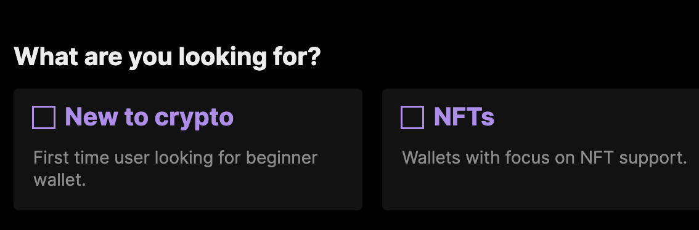

# How to create an Ethereum account

**Anyone can create an Ethereum account for free.** You just need to install a crypto wallet app. Wallets create and manage your Ethereum account. They can send transactions, check your balances and connect you to other apps built on Ethereum.

With a wallet you can also log into any token exchange, games, [NFT](/glossary/#nft) marketplaces instantly. There is no need for individual registration, one account is shared for all apps built on Ethereum.

## Step 1: Choose a wallet

A wallet is an app that helps you manage your Ethereum account. There are dozens of different wallets to choose from: mobile, desktop, or even browser extensions.

<ButtonLink href="/wallets/find-wallet/">
  List of wallets
</ButtonLink>

If you are new, you can select the “New to crypto” filter on the "find a wallet" page to identify wallets that should include all necessary features suitable for beginners.

There are also other profile filters to cater to your needs. These are examples of commonly used wallets - you should do your own research before trusting any software.

## Step 2: Download and install your wallet app

Once you have decided on a specific wallet, visit their official website or app store, download and install it. All of them should be free.

## Step 3: Open the app and create your Ethereum account

The first time you open your new wallet you might be asked to choose between creating a new account or importing an existing one. Click on the new account creation. **This is the step during which the wallet software generates your Ethereum account.**

## Step 4: Store your recovery phrase

Some apps will request you to save a secret "recovery phrase" (sometimes called a "seed phrase" or a "mnemonic"). Keeping this phrase safe is extremely important! This is used to generate your Ethereum account and can be used to submit transactions.

**Any person who knows the phrase can take control of all funds.** Never share this with anyone. This phrase should contain 12 to 24 randomly generated words (the order of the words matters).

<InfoBanner shouldSpaceBetween emoji=":eyes:">
  
<b>Wallet installed?</b> Learn how to use it.

  <ButtonLink href="/guides/how-to-use-a-wallet">
    How to use a wallet
  </ButtonLink>
</InfoBanner>

Interested in other guides? Check out our: [Step by step guides](/guides/)

## Frequently asked questions

### Are my wallet and my Ethereum account the same?

No. The wallet is a management tool that helps you to manage accounts. A single wallet might access several accounts, and a single account can be accessed by multiple wallets. The recovery phrase is used to create accounts and gives permission to a wallet app to manage assets.

### Can I send bitcoin to an Ethereum address, or ether to a Bitcoin address?

No, you cannot. Bitcoin and ether exist on two separate networks (i.e. different blockchains), each with their own bookkeeping and address formats. There have been various attempts to bridge the two different networks, of which the most active one is currently [Wrapped Bitcoin or WBTC](https://www.bitcoin.com/get-started/what-is-wbtc/). This is not an endorsement, as WBTC is a custodial solution (meaning a single group of people controls certain critical functions) and is provided here for informational purposes only.

### If I own an ETH address, do I own the same address on other blockchains?

You can use the same [address](/glossary/#address) on all blockchains that use similar underlying software to Ethereum (known as 'EVM-compatible'). This [list](https://chainlist.org/) will show you which blockchains you can use with the same address. Some blockchains, like Bitcoin, implement a completely separate set of network rules and you will need a different address with a different format. If you have a smart contract wallet you should check its product website for more info on which blockchains are supported because usually those have limited but more secure scope.

### Is having my own wallet safer than keeping my funds on an exchange?

Having your own wallet means you take responsibility for the security of your assets. There are unfortunately many examples of failed exchanges that lost their customers' money. Owning a wallet (with a recovery phrase) removes the risk associated with trusting some entity to hold your assets. However, you have to secure it on your own and avoid phishing scams, accidentally approving transactions or exposing recovery phrase, interacting with fake websites and other self-custody risks. The risks and benefits are different.

### If I lose my phone/hardware wallet, do I need to use the same wallet app again to recover the lost funds?

No, you can use a different wallet. As long as you have the seed phrase you can enter it into most wallets and they will restore your account. Be careful if you ever need to do this: it is best to make sure you are not connected to the internet when recovering your wallet so that your seed phrase is not accidentally leaked. It is often impossible to recover lost funds without the recovery phrase.
