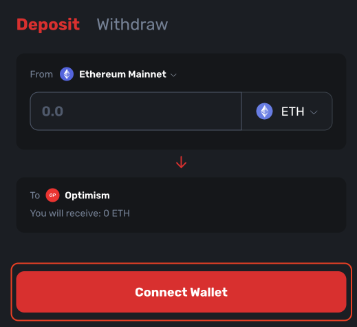
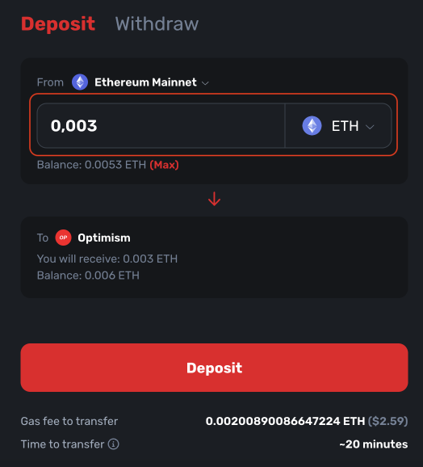
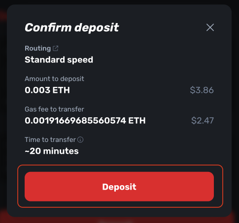

# How to bridge tokens to layer 2

If there is a lot of traffic on Ethereum, it can become expensive. One solution to this is to create new "layers": i.e. different networks which operate in similar ways to Ethereum itself. These so-called Layer 2s help reduce congestion and cost on Ethereum by processing many more transactions at lower fees, and only storing the result of these on Ethereum every so often. As such, these layers 2s enable us to transact with increased speed and decreased costs. Many popular crypto projects are moving to layer 2s because of these benefits. The simplest way to move tokens from Ethereum to layer 2 is to use a bridge.

**Prerequisite:** 

- have a crypto wallet, you can follow this tutorial: [How to create an Ethereum account](/guides/how-to-create-an-ethereum-account/)
- add funds to your wallet

## 1. Determine which layer 2 network you want to use

You can learn more about the different projects and important links on our [layer 2 page](/layer-2/).

## 2. Go to the selected bridge

Some popular layer 2s are:

- [Arbitrum bridge](https://bridge.arbitrum.io/?l2ChainId=42161)
- [Optimism bridge](https://app.optimism.io/bridge/deposit)
- [Boba network bridge](https://gateway.boba.network/)

## 3. Connect to the bridge with your wallet

Make sure your wallet is connected to the Ethereum Mainnet network. If it is not, the website will automatically prompt you to switch networks.

## 4. Specify the amount and move the funds

Review the amount that you will get in return on the layer 2 network and the fees to avoid unpleasant surprises.

## 5. Confirm the transaction in your wallet

You will have to pay a fee in form of ETH for processing the transaction.

## 6. Wait for your funds to be moved

This process should not take more than 10 minutes.

## 7. Add the selected layer 2 network to your wallet (optional)

You can use [chainlist.org](http://chainlist.org) to find the network's RPC details. Once the network is added and transaction finished, you should see the tokens in your wallet.
 

<InfoBanner shouldSpaceBetween emoji=":eyes:">
  
Want to learn more?

  <ButtonLink href="/guides/">
    See our other guides
  </ButtonLink>
</InfoBanner>

## Frequently asked questions

### What if I have funds on an exchange?

You might be able to withdraw to some layer 2s directly from an exchange. Check out “Move to layer 2” section of our [Layer 2 page](/layer-2/) for more information.

### Can I go back to Ethereum mainnet after I bridge my tokens to L2?

Yes, you can always move your funds back to the mainnet using the same bridge.
