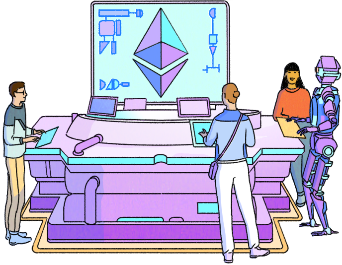

Every day, millions of people face the same challenge: moving money across borders is slow, expensive, and often frustrating. A freelancer in Bali waits days for payment to clear from their New York client. This particularly affects people in regions with limited banking infrastructure, making it difficult to participate in the global economy.

This isn't a far-off dream—it's happening today on Ethereum. While traditional financial institutions have built robust payment systems over decades, they often remain constrained by borders, working hours, and legacy infrastructure. Ethereum offers a new paradigm: a global, 24/7 financial platform that enables near-instant, programmable transactions for anyone with internet access.

## Remittances: cheaper international transfers {#remittances}

For millions of people working abroad, sending money back home is a regular necessity. Traditional remittance services often come with high fees and slow processing times. Ethereum offers a compelling alternative.

<CardGrid>
  <Card title="Cheaper Fees" emoji=":money_with_wings:" description="Remittance services charge up to $14 fees on average. Ethereum transactions can often be completed under $0.01."/>
  <Card title="Faster Transfers" emoji="📶" description="International wire transfers take several days to process. Ethereum transactions are settled in minutes." />
  <Card title="Open to anyone" emoji="🌎" description="You only need an internet connection and a wallet app to send or receive Ether." />
</CardGrid>

## Access to global currencies {#access-to-global-currencies}

In many countries, inflation is a pressing concern, often accompanied by limited access to foreign currencies. People in these situations struggle to preserve their wealth as they are forced to hold rapidly depreciating savings.

The Ethereum community has created **a robust alternative financial system** that is independent of any nation’s monetary policies or control.

Ethereum users can use **stablecoins—tokens typically tied to strong currencies like the US Dollar**. By earning and saving in cryptocurrency, people can protect themselves from high inflation in their country, helping to preserve or even grow their purchasing power. This also enables easier payments for goods and services, both locally and globally.

<ButtonLink href="/stablecoins">
  More on stablecoins
</ButtonLink>

## Buying goods and payment for services {#buying-goods-and-payment-for-services}

Many businesses are beginning to accept ether (ETH) and other cryptocurrencies as payment. For example:

- **Newegg:** The popular electronics retailer accepts Ethereum for purchases in select countries.
- **Travala.com:** This travel booking platform allows users to pay for hotels and flights using Ethereum.
- **Shopify:** This popular E-commerce platform which serves as a platform for hosting businesses also accepts payments for goods and services using Ethereum.
- **Sotheby's:** This organization trade fine and decorative art, jewelry, and collectibles and allows for payments using Ethereum and other cryptocurrencies.

Countries like El Salvador and the Central African Republic have even adopted cryptocurrencies as legal tender, paving the way for wider acceptance of Ethereum payments in everyday transactions.

In countries where their means of payment have been disconnected from the rest of the world, crypto-integrated payment solutions have been a huge relief. Payments of subscriptions for platforms like Netflix, Spotify, and educational courses have now been made easy through crypto payment platforms like Gnosis Pay and Paypal.

<InfoBanner shouldSpaceBetween emoji=":eyes:">
  
Create your Ethereum account with a wallet app today.

  <ButtonLink href="/wallets/find-wallet">
    Get started
  </ButtonLink>
</InfoBanner>

## Pay with self-custodial crypto cards {#pay-with-self-custodial-crypto-cards}

Self-custodial crypto cards work like using your own backpack instead of locking your money in someone else’s vault. With a traditional card, a bank or custodian holds your funds and releases them when you spend. With self-custodial cards, you stay in control of your assets the whole time—no middleman—while still being able to tap or swipe to pay for coffee, groceries, or even a flight.

These cards link directly to non-custodial wallets or smart contract accounts, allowing users to spend ETH and stablecoins in everyday settings without giving up ownership. Unlike custodial cards, which require users to deposit funds with a third party, self-custodial cards enable real-world payments such as Visa and Mastercard while preserving onchain control.

### Examples {#crypto-cards-examples}

- **MetaMask Card:** Linked to the MetaMask wallet, this Mastercard debit card lets users spend ETH, stablecoins, and other supported tokens. It supports Apple Pay and Google Pay, includes crypto cashback rewards, and offers yield-earning options.

- **Tuyo Card:** A smart contract–based Visa card that auto-converts crypto to USDC for spending anywhere Visa is accepted. Users keep custody of their assets, with access to yield, trading, and spending features.

- **Gnosis Pay:** The first self-custodial Visa card tied to a Gnosis Safe smart account. Users spend crypto directly from their wallet with no gas, FX, or off-ramping fees. Card personalization via Ethereum Name Service (ENS) is also supported.

- **Ether.Fi Cash card:** Integrated with ether.fi’s staking protocol, this card lets users spend while their ETH remains staked. Payments are handled via smart contracts, maintaining self-custody even while spending.

### Self-custodial crypto card comparison {#crypto-card-custody-comparison}

| **Crypto card** | **Self-custodial** | **Non-custodial** | **Key notes**                                                |
| --------------- | :----------------: | :---------------: | ------------------------------------------------------------ |
| MetaMask Card   |         ✅         |        ✅         | Wallet stays in MetaMask; auto off-ramp at payment           |
| Tuyo Card       |         ✅         |        ✅         | Smart wallet converts to USDC; user retains control          |
| Gnosis Pay      |         ✅         |        ✅         | Linked to user’s Gnosis Safe; no custody shift during use    |
| Ether.Fi Cash   |         ✅         |        ✅         | ETH remains staked; smart contract controls spending access. |

> **Note:** "Self-custodial" refers to user-controlled wallets where the user has full access and control over their funds.
> "Non-custodial" refers to wallets where funds are managed without third-party custody, often through smart contracts.
> While all self-custodial cards are non-custodial, not all non-custodial cards are self-custodial.

## Salary payments {#salary-payments}

Many forward-thinking companies are now offering employees the option to receive their salaries, or a portion of them, in cryptocurrencies like ether (ETH):

- **Gipsybee:** is an organization that deals in electronics, robotics, game creation and other services. They give employees the option to get paid in Ethereum.
- **SC5:** This Finnish company was one of the first to offer salaries in Bitcoin, paving the way for similar arrangements with Ethereum.
- **Blockchain startups:** Many companies in the blockchain space naturally offer cryptocurrency salary options to their employees.
- **DAOs:** Due to the peculiarity and diversity of contributors to DAOs, most contributions and salaries are rewarded in cryptocurrency.

This trend particularly appeals to remote workers and digital nomads who can benefit from borderless payments and potentially favorable exchange rates.

<Divider />

## Global relief efforts {#global-relief-efforts}

In February 2023, when devastating earthquakes struck Turkey and Syria, the global crypto community sprang into action. Various campaigns were launched to collect funds for relief efforts, showcasing the power of Ethereum in times of crisis. Despite crypto [not being a recognized form](https://www.reuters.com/technology/no-more-kebabs-bitcoins-turkeys-crypto-payment-ban-looms-2021-04-28/) of payment in Turkey, authorities made [exceptions](https://x.com/haluklevent/status/1622913175409623041) for some organizations to collect donations. Some examples are:

- [Refik Anadol](https://x.com/refikanadol/status/1622623521104089090): is a renowned digital artist who initiated a fundraising campaign.
- DAO Power: [Anka Relief DAO](https://ankarelief.org/) and [Bankless DAO](https://x.com/banklessDAO) joined forces with [Giveth](https://x.com/Giveth/status/1623493672149843969) to raise funds.
- [Pak](https://cause.quest/), a prominent NFT artist, also contributed to the cause.
- Even Ethereum co-founder [Vitalik Buterin](https://cointelegraph.com/news/vitalik-buterin-donates-227k-to-help-earthquake-victims-in-turkey-syria) made personal donations to multiple campaigns.

The result of this? Over $6 million was raised in a matter of days, as tracked by a [Dune](https://dune.com/davy42/turkiye-earthquake-donations) Analytics dashboard.

There were also similar response times for tragedies that happened in India and Ukraine. This rapid response highlights a crucial advantage of Ethereum payments, which is the ability to quickly mobilize global support without the hurdles of currency conversion, lengthy bank transfers, or exorbitant fees.

## Ethereum vs fiat {#ethereum-vs-fiat}

To truly appreciate the impact of Ethereum payments, it's worth comparing them to traditional fiat currencies:

|                       | **Ethereum**            | **Traditional banks**                                        |
| --------------------- | ----------------------- | ------------------------------------------------------------ |
| **Speed**             | Seconds to minutes      | Hours to days                                                |
| **Global Reach**      | Borderless, 24/7        | Subject to international banking restrictions and work hours |
| **Transparency**      | Fully transparent       | Varies by institution                                        |
| **Programmability**   | Smart contracts enabled | Limited to basic transactions                                |
| **Inflation Control** | Predictable issuance    | Subject to central bank policies                             |
| **Accessibility**     | Anyone with internet    | Subject to national and international restrictions           |

At its core, Ethereum is a decentralized platform that allows for secure, fast, and transparent transactions. However, many components set it apart from traditional payment methods. Let's dive into the benefits that make Ethereum payments a game-changer:

### Programmability {#programmability}

One of Ethereum's unique features is its ability to support smart contracts. Smart contracts are self-executing agreements with the terms directly written into code. This opens up a world of possibilities for automated, condition-based payments that can greatly improve transactions like:

- Escrow services
- Recurring payments
- Performance-based compensation

### Speed {#speed}

Do you remember the last time you waited days for an international bank transfer to clear? The long queue? And the multiple forms you had to fill? With Ethereum, those days are long gone. Transactions on the Ethereum network settle in minutes, regardless of where the sender and recipient are located. Due to Ethereum being permissionless, there is no regulatory bureaucracy when sending money. This speed is particularly crucial in time-sensitive situations, such as emergency relief efforts.

### Lower fees {#lower-fees}

Traditional international money transfers fees sometimes eat up a significant portion of the amount sent, especially when dealing with transactions in the hundreds of dollars. Ethereum transactions, while not free, often come with lower fees. This means more of your money goes where you intend it to, rather than lining the pockets of intermediaries.

### Transparency {#transparency}

Every transaction on the Ethereum blockchain is recorded on a public ledger. This means anyone can verify the movement of funds, making it an excellent tool for:

- Charitable organizations to demonstrate how donations are used
- Businesses to prove payments to suppliers or employees
- Individuals to keep track of their financial activities

With Ethereum, everyone can see how money moves and how costs are implemented, unlike traditional organisations where most of these remain unknown.

While fiat currencies have the advantage of widespread acceptance and stability, Ethereum offers unique benefits that make it an attractive option for certain types of transactions.

From facilitating rapid disaster relief to empowering global workers, Ethereum payments are writing a new chapter in the long history of money. While challenges remain, the unique advantages offered by this technology make it an attractive option for a wide range of use cases.

<InfoBanner shouldSpaceBetween emoji=":eyes:">
  
Time to get your own Ethereum account.

  <ButtonLink href="/wallets/find-wallet">
    Get started!
  </ButtonLink>
</InfoBanner>
