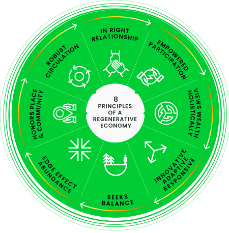

## What is a public good? {#what-is-a-public-good}
A public good is an item or product that satisfies human needs and generates positive value or benefit (utility) for the individual. Public goods are *non-excludable* and *non-rivalrous*; using a public good doesn't prevent others from using it, nor does individual consumption of a public good immediately reduce availability. Public education, free and open-source software (FOSS), open scientific research, open digital content, and public digital infrastructure (e.g., the Internet) are examples of publlic goods. Public goods can be contrasted with private goods that are rivalrous and excludable: if Alice eats a slice of pizza, Bob cannot eat the same slice of pizza (Alice and Bob are *rivals* in consumption); Alice's consumption of the pizza prevents or *excludes* Bob from eating the pizza, making pizza consumption an excludable activity.

The creation of public goods, such as open-source software, lacks a clear business model—resulting in a situation where critical public goods are underfunded, overused (to the point of degradation), or produced in limmited quanities (or not at all). This creates a systemic lack of investment in the development and maintenance of public goods (e.g., digital infrastructure) at a time in which many aspects of society increasingly depend on the availability of those goods. Inefficiencies confronting traditional apporaches to funding public goods funding produce [coordination failures](https://en.wikipedia.org/wiki/Coordination_failure_(economics)#): individuals are unable to coordinate decision-making and efficiently allocate financial resources to the creation and maintenance of public goods with positive utility for the collective. 

Permissionless, programmable, and globally accessible financial systems built on public blockchain networks like Ethereum can alleviate problems hindering the funding and development of public goods. Ethereum provides a base layer for creating mechanisms to realign incentives among various individuals and increase collective (financial) contributions to digital-native public goods (e.g., open-source software) as well as educational and community-driven projects that positively impact the blockchain ecosystem and contribute to broader societal goals, like increasing prosperity, boosting human capital, and promoting an inclusive financial system. With more viable

## Why is funding public goods important? {#importance-of-funding-public-goods}

Unlike [private goods](https://www.investopedia.com/terms/p/private-good.asp), public goods provide benefits for the majority, not just one individual. Such goods are necessary in creating a future that results in positive outcomes for all members of society; public roads (another example of a public good) facilitate commerce and, consequently, increase societal prosperity and wellbeing and open scientific research advances humanity's knowledge and engenders technological breakthroughs that result in the creation of technologies that increase productivity and generate wealth. 

Traditionally, public goods are usually made available by governments (through taxes collected from citizens) or private markets. Public broadcast radios are an example of a public good that can be provided by both governments and private organizations: broadcast stations cannot prevent listeners from receiving signals (i.e., it is non-excludable) and multiple individuals can listen at the same time (i.e., it is non-rivalrous). Public goods can also be created via philanhropic donations from private individuals and organizations. 

However, the conventional models of building and funding public goods run into various problems. Not only have these issues discouraged the development of public goods, but it has also resulted in public goods with [negative externalities](https://corporatefinanceinstitute.com/resources/knowledge/economics/negative-externalities/). 

## Problems of traditional public goods funding {#problems-of-traditional-public-goods-funding}

### Misaligned incentives {#misaligned-incentives}

Traditional methods of funding public goods suffer from misaligned incentives among different entities coordinating to allocate resources. These incentive problems can be described using several concepts from economic theory:

#### The free-rider problem {#free-rider-problem}

The [free-rider problem](https://www.khanacademy.org/economics-finance-domain/microeconomics/market-failure-and-the-role-of-government/externalities-topic/a/the-role-of-government-in-paying-for-public-goods#:~:text=The%20free%20rider%20problem%20can,a%20way%20to%20do%20so.) describes a situation where some individuals refuse to pay towards building a public good, but intend to use it. In this case, such individuals are "taking a free ride" on the contributions of others toward funding the public good.

The free-rider problem is central to the problem of funding public goods. If everyone refuses to pay for a public good, hoping someone else does, it becomes impossible to fund and build the public good.

#### Tragedy of commons {#tragedy-of-commons}

The [tragedy of commons](https://www.investopedia.com/terms/t/tragedy-of-the-commons.asp) concerns the degradation of commonly shared resources through overconsumption. A common resource is similar to a public good (they are non-excludable), but can typically diminish in quality and availability as more people use it (i.e., they are rivalrous).

Because individuals cannot prevent others from consuming the common resource, they are incentivized to take from the shared resource pool without replenishing it. But, as more people consume the resource, either of two things can happen: a) the supply of the resource reduces until there isn't any left for public consumption b) the quality of the resource degrades over time until it becomes unusable. Both situations aren't ideal, which is why solving the tragedy of commons is a key goal of new designs for funding public goods.

#### Principal-agent problem {#principal-agent-problem}

The [principal-agent problem](https://en.m.wikipedia.org/wiki/Principal%E2%80%93agent_problem) is a concept that explains the conflict of interests between an individual (the principal) and another entity acting on their behalf (the agent). While the agent is expected to act in the best interests of their principal, they may pursue self-seeking ends.

In the context of public goods, the principal-agent problem concerns differences in opinion between a group (e.g., citizens) and their representatives (e.g., elected government officials) as it concerns the allocation of resources to public goods. In this case, what the group considers a public good may be different from what representatives consider a public good.

The problem is further compounded by lack of transparency and [information asymmetries](https://en.m.wikipedia.org/wiki/Information_asymmetry). Often, those endowed with power to allocate resources to public goods misuse it and prevent accountability by shrouding administrative processes in secrecy.

### Poor resource-allocation mechanisms {#poor-resource-allocation-mechanisms}

Public goods funding typically requires a mechanism for measuring public preferences for different goods and using that information to guide the allocation of funds. Traditional approaches to funding may be inefficient and suboptimal due to the shortcomings of common methods for eliciting preferences for various public goods. 

**Plutocratic funding** systems allow individuals to express unequal preferences for the same public good by contributing higher amounts, but risk giving wealthy minorities disproportionate influence over the resource allocation process. Coinholder voting or “one person, one dollar” voting (another term for plutocratic funding) also risks misaligning incentives—if the biggest donors to a project desire a return on their (outsized) contribution/investment, the project builder may be forced to prioritize profit-making over building social goods that are widely accessible and benefit the majority. Traditional crowdfunding initiatives may mitigate this problem, at the cost of requiring more coordination and a higher donation-per-person to match the influence of a single, well-capitalized donor donating to a competing project. 

**Democratic funding** or “one person, one vote” systems alleviate inequality by assigning the same unit of influence to all individuals participating in the resource-allocation decision-making process. However, a downside to purely democratic forms of funding public goods may appear if individuals most likely to benefit from a good are unable to signal higher preferences due to the limit of one vote per person. This may induce apathy as individuals rationalize non-participation due to having limited influence over the process of deciding which projects receive funding. 

## Regenerative cryptoeconomics and public goods markets {#regenerative-cryptoeconomics-and-public-goods-markets}

[Regenerative economics](https://capitalinstitute.org/8-principles-regenerative-economy/) is a field of economic design with the objective of ensuring long-term survival and flourishing of the human economy through aligning economic (value-creation) activity with the advancement of the greater/[common good](https://en.wikipedia.org/wiki/Common_good) and creating sustainable, robust, and resilient and economic systems. Regenerative economies are **positive-sum** (individuals contribute to the replenishment of resources to the benefit of individual and group) and **self-sustaining** (resources are allocated to creating capital goods and assets that generate productivity and wealth, which is redirected into financing the creation of more capital goods with positive utility for the collective).

Regenerative economic systems can be contrasted with extractive economies in which common resources and public goods are consumed (extracted) without any effort to replenish common resources, or sustain creation of public goods; every individual act of consumption subtracts from the shared resource pool (leading to its eventual depletion), or degrades the quality of the public good. Extractive economies are also *negative sum*: overconsuming a common resource, or using a public good without paying for its continued creation, benefits the individual in the short-term, but leads to worse long-term outcomes for the group (of which they are part). 

*Regenerative cryptoeconomics* applies the principles of regenerative economics to the sphere of blockchains and cryptocurrencies. Regenerative cryptoeconomics (a.k.a., [regenerative finance](/refi)) uses tools and ideas built on top of programmable blockchains (e.g., Ethereum) to design novel incentive models and coordination mechanisms that enable individuals collaborate effectively to solve problems facing the world (many of which represent existential risk). Some examples of problems regenerative cryptoeconomics and ReFi initiatives are tackling include: climate change, biodiversity, income inequality, insecure and underfunded digital infrastructure, limited access to scientific knowledge, and exclusive economic systems (which impose barriers to participation on individuals from certain demographics and geographies).

Regenerative cryptoeconomics encompasses, but is not limited to, blockchain-based mechanisms that enable private individuals to coordinate and fund the development of public goods—otherwise known as **public goods markets**. A [public goods market](https://forum.effectivealtruism.org/posts/ZjBnzzqkrB7JNLjTg/the-case-for-promoting-creating-public-goods-markets-as-a) is defined as a "decentralized and highly responsive process for allocating capital according to the collective desires of a population to support the creation of public goods." Public goods markets built on blockchains provide a viable fundraising alternative for projects and companies that may find it difficult to secure financial support due to limmitations of traditional capital funding models, despite such projects providing social, environmental, and communal benefits; public goods market also benefit from the decentralization and trust-minimization of public blockchains and offer certain benefits (e.g., accountability and transparency) compared to convential crowdfunding mechanisms like Kickstarter).

### Why do we need a public goods market? {#importance-of-public-goods-market}

Currently, the majority of public goods are created by either governments or private markets—both of which have problems:

**Governments** reduce the free-rider problem by charging people (i.e., the consumers) taxes, which it uses to fund the development of public goods. Put another way, the government returns money belonging to the citizenry to them in the form of public goods. However, this creates a negative externality, namely the cost borne by individuals who don't necessarily consume certain public goods. Moreover, funding of public goods by the public sector suffers from principal-agent problems and, in many cases, governments often lack the flexibility and capacity to provide certain public goods.

**Private markets** can finance public goods efficiently, but the funding of public goods by the private sector has also runs into issues. For example, unlike govenrnments, private companies find it more difficult to charge consumers of a public good (and, thus, cannot solve the free-rider problem). This discourages the provision of certain public goods by private organization and results in a “market failure” (inefficient allocation of goods and services in a free market). In cases where private markets _do_ provide a public good, the desire to maximize returns on investment may cause negative externalities, such as social media companies monetizing user data.

A public goods market creates a third alternative that combines the best qualities of the two approaches while minimizing negative consequences. Here, members of the general public are able to coordinate on allocating capital to areas they believe are neglected but critical to societal wellbeing, prosperity, and progress. This approach is more flexible and efficient compared to traditional government-controlled funding, but also minimizes some of the negative externalities associated with funding public goods via the private sector.

More importantly, a public goods market provides incentives for individuals and groups to work on creating services that benefit society, especially when they stand to make little to no profits. For example, creators of free and open-source software (FOSS), such as [OpenSSL](https://en.m.wikipedia.org/wiki/OpenSSL), are rarely compensated and must rely on charitable donors to fund their work. This discourages developers working on those projects and further disincentivizes others from working on similar projects that could advance society's good.

Blockchain-based public goods markets enable anyone to easily contribute to organizations building public goods in a decentralized, trust-minimized, and secure manner. Rewarding builders of public goods may avert the tragedy of commons and lead to better outcomes for society in general. A real-world example is the [Protocol Guild](https://protocol-guild.readthedocs.io/en/latest/index.html#), a project that uses blockchain infrastructure to coordinate funding for developers working on improving and maintaining the Ethereum protocol. 

## How can Ethereum advance public goods funding? {#using-ethereum-to-fund-public-goods}

Ethereum's qualities—immutability, trustlessness, and decentralization—could make it a platform for improving conventional means of coordinating to develop public goods. As a programmable blockchain, Ethereum supports [smart contracts](/smart-contracts/), which are programs that execute instructions based on predefined conditions. Smart contracts are the core primitives that power public goods markets running on the blockchain.

With Ethereum, public goods, especially digital public goods (e.g., open-source software), that have historically suffered neglect can be funded efficiently. The benefits of using Ethereum to improve public goods funding include:

### Transparency {#transparency}

Information stored on Ethereum is publicly available and can be verified by anyone. Ethereum is "trustless" because you don't have to trust anyone about the validity of information recorded on the blockchain.

With public goods markets running on Ethereum, it is easier to track contributions towards the creation of a public good and monitor the allocation of these funds to projects. Instead of relying on representatives to be honest about funding decisions, you can verify for yourself that funds were allocated as agreed.

Lower trust burdens further make it possible for individuals to coordinate on a global scale. Coordination failures arise in part due to a lack of transparency between those involved. An individual may be unwilling to participate in the development of public goods if information about the process is hidden or difficult to obtain.

### Secure and seamless transfer of value {#secure-and-seamless-transfer-of-value}

Ethereum provides infrastructure for [decentralized finance](/defi/) (DeFi), which allows individuals to safely transfer value without the need for an intermediary, like a bank. Using Ethereum, anyone with an Internet connection can [send money globally](/defi/#send-money) sans the usual paperwork and bureaucratic delays that plague the modern banking system.

As a secure and efficient payments network, Ethereum reduces friction for individuals that want to fund public good projects. Simplifying the process of contributing towards a public good is a great first step towards creating a regenerative economy.

Creators of public goods also benefit from Ethereum's capacity to enable seamless transfers of value. Getting funding for a public good on a traditional crowdsourcing platform would involve administrative complexity that could potentially discourage builders.

With Ethereum's public goods markets, receiving money to build a public good is only a matter of providing a [wallet](/wallets/) address. This eliminates the need to complete extensive paperwork or depend on a centralized platform to collect donations.

### Flexible allocation mechanisms {#flexible-allocation-mechanisms}
 
As extremely flexible programs, smart contracts are useful tools for designing optimal mechanisms for allocating capital to public goods. An example is [payment splitter contracts](https://docs.openzeppelin.com/contracts/2.x/api/payment#PaymentSplitter) often used by projects based on the [retroactive public goods funding model](https://medium.com/ethereum-optimism/retroactive-public-goods-funding-33c9b7d00f0c).

In retroactive funding, individuals and organizations building public goods receive capital based on value contributed to the ecosystem in the past. This may be more ideal than traditional funding mechanisms that use projects' estimated future value as the basis of allocating capital. As Vitalik Buterin puts it: 

> The core principle behind the concept of retroactive public goods funding is simple: it’s easier to agree on what *was* useful than what *will be* useful. 

Typically, the payment splitter contract can receive payments from donors and automatically split the funds between a group of entities (identified by wallet addresses). Funds are shared based on a predefined allocation formula (typically weighted according to the each individual or organization's previous contributions to the community).

An alternative design is a smart contract that streams donated funds over a fixed period. This particularly solves the problem where an individual or organization receives all the money upfront and loses all incentive to deliver on key project milestones. 

Flexibility also reduces the overhead of coordinating public goods funding on a global scale. For example, parameters of a payment splitter or streaming contract (e.g., amounts donated, allocation weights, allocation timeline, etc.), can be routinely adjusted either by donors, trusted entities, or a group (via [on-chain governance](/dao/#dao-governance)). This reduces bureaucracy, increases autonomy for donors, and improves the efficiency of initiatives aimed at financing public goods.

### Incentive alignment {#incentive-alignment}

Public goods markets on Ethereum are designing better incentives to encourage greater public investment in digital public goods. Part of this approach involves designing better systems for measuring public opinion on what public goods deserve funding.

For example, some Ethereum-based public goods markets use a quadratic voting system to control the allocation of funds to organizations building digital public goods. [Quadratic voting](https://vitalik.ca/general/2019/12/07/quadratic.html) is considered ideal because it strikes a balance between one-person-one-vote and one-dollar-one-vote systems.

Below is an overview of how the combination of quadratic voting with public fundraising (**quadratic funding**) works:

1. Individuals and organizations donate funds to a "matching pool" at the beginning of a funding round. These funds are distributed to different public goods projects at the end of the round based on their weighted share of votes.

2. Anyone can "vote" for a project by donating some amount to it during the funding round. The influence of each voter is calculated as the square root of the amount donated. If Alice donates $100, her influence on the outcome equals that of ten people who contribute $1.

3. Every donation towards a project is matched with a corresponding amount of funding from the official matching pool. Instead of being matched 1:1, funds are matched according to the [quadratic funding formula](https://wtfisqf.com/?grant=10&grant=5,5&grant=2,2,2,2,2&grant=1,1,1,1,1,1,1,1,1,1&match=1000).

The formula works by adding the square roots of each contribution, squaring the result, and subtracting the original amount donated from it. The final figure represents the matched funding, i.e., how much money each project receives from the matching pool. We can explain this concept with an example:

Imagine two parks are planned for development, with the teams building each park (we call them `park A` and `park B`) requesting for funding. Ten people agree to donate $25 each to build `park A`, while two affluent investors donate $180 each to `park B`.

The table below shows how much each park will receive under a quadratic funding scheme:

|        | No. of donors | Amount contributed by individual donors | Total contribution | Matched funding | Total funding received |
| :----- | :------------ | :-------------------------------------- | :----------------- | :-------------- | :--------------------- |
| Park A | 10            | $25                                     | $250               | $2,250          | $2,500                 |
| Park B | 2             | $400                                    | $800               | $800            | $1,600                 |

We can easily calculate the final amount received by each project using the quadratic formula:

1. `Park A`: Adding the square roots of each donor's contribution ($5) gives $50. Subtracting the total amount contributed ($250) from the square of $50 ($2,500) gives $2,250—the matched funds.

2. `Park B`: Adding the square roots of each donor's contribution ($20) gives $40. Subtracting the total amount contributed ($800) from the square of $40 ($1,600) gives $800—the matched funds.

#### Advantages of quadratic funding {#advantages-of-quadratic-funding}

Again, we can use the example of raising funds for public parks to show why quadratic funding is ideal for funding public goods:

##### Preventing the free-rider problem

Quadratic funding places more weight on the number of contributors than the amount contributed by each person. This ensures that public goods with a broader base of support receive more matched funding than public goods with minority backing—even if the latter have bigger donations during the funding round.

As seen in the example, one person contributing **$25** individually generated **$225** in matched funding for `park A` ($2,250/10 people). If one person attempted to free-ride and refused to donate, then the matched funding would drop to **$1,775**.

But what if the free-rider opts in and donates $25? The additional value gotten from that single donation would be **$475**. Because the value added by each donor is extremely high, no one is incentivized to try and free-ride—precisely the goal of quadratic funding.

##### Preventing the tragedy of commons

Quadratic prioritizes the most preferred public goods by subsidizing their development (via matched funds). This is important because overused and underfunded public goods are more likely to degrade over time.

Imagine that `park A` and `park B` are built without receiving any matched funds. `Park A` would likely see more use (since more people expressed their preference for it) than `park B`. But, with less funds allocated to developing and maintaining it, `park A` would suffer rapid degeneration, resulting in a tragedy-of-commons situation.

##### Preventing principal-agent problems

Typically, individuals would have to trust the local government, a private company, or a grant-giving committee to convey their preferences when building public goods. But either "representative" (government/private markets/grant committees) may be unable or unwilling to capture those preferences.

The example of funding public parks shows how regular individuals can collectively and democratically express their preferences for public goods without relying on any authority. TThis explains why quadratic funding is described as "capital-constrained liberal radicalism": it shifts influence, power, and responsibility for public goods from governments and the private sector to the people.

##### Accounting for differences in spending power and degree of preferences

Naive implementations of democracy (one-person-one vote) and plutocracy (one-dollar-one-vote) fail to account for differences in wealth and degree of preference. Quadratic funding fixes this problem to an extent as seen in the example described earlier:

i. Those who wanted `park A` donated what they could afford without losing the power to properly express their preference for that public good. Quadratic funding empowers _every_ individual (irrespective of wealth) to influence the allocation of capital to public goods. This solves the issue of rational indifference and increases willingness to participate in collective action projects.

ii. Other donors who wanted `park B` were able to express the strength of their preferences for that public good by contributing more money to its development. Perhaps, unknown to most people, `park B` has more long-term benefits for the community than `park A`. In this scenario, quadratic voting/funding prevents widespread ignorance from canceling out the wisdom of informed citizens.

#### Reducing negative externalities {#reducing-negative-externalities}

Under a regular free-market democratic system, everyone would be forced to pay equally for a public good—whether they wanted it or not. But, as demonstrated in the example, quadratic voting/funding ensures individual pay for a public if and only if they want it.

Another negative externality that quadratic funding mitigates is the incentive to maximize profits at the expense of consumers (the development of `Park B` was still subsidized by the matching pool even if it had low support). Why is this important? It means those who build public goods have fewer reasons to try and extract profits from consumers through any means possible. If `park B` were built solely with investors' funds, the incentive to recoup the initial investment—for example, by charging visitors high fees—would be high.

## How Ethereum improves quadratic funding for public goods {#how-ethereum-improves-quadratic-funding}

Some may ask: "Why do you need a blockchain to coordinate a quadratic funding round when it can be implemented on a regular online platform?" There are two major issues with running quadratic voting on regular applications:

1. **Sybil attacks**: A [Sybil attack](https://academy.binance.com/en/articles/sybil-attacks-explained) occurs when someone participating in an online platform creates multiple identities to increase their influence within that system. Deploying social media bots is an example of a Sybil attack. Due to the high value of individual contributions in a quadratic funding scheme, cheaters may try to game the system by creating different profiles and swing voting outcomes. This would corrupt the system and reduce the usefulness of quadratic voting in gauging interest in specific public goods.

2. **Bribery and collusion**: It is possible to bribe voters to donate to a particular project (even if they prefer another option), thereby artificially inflating perceived preference for the former. This defeats the purpose of voting since the votes cast by a bribed individual may not reflect their true preference. Hence, just like Sybil attacks, bribery and collusion reduce the effectiveness of quadratic funding mechanisms.

Ethereum mitigates both problems in the following ways:

### Decentralized identity {#decentralized-identity}

[Decentralized identity](/decentralized-identity/) allows individuals to verify their identity online without relying on a central authority, such as governments or service providers. This is usually done in a way that minimizes the exposure of personal information to third parties.

Some [decentralized identity protocols](/decentralized-identity/#use-decentralized-identity) have built-in cryptoeconomic incentives to discourage users from creating multiple identities to game the system. By integrating such tools with the voting process, quadratic funding applications reduce the risk of Sybil attacks.

### Zero-knowledge proofs {#zero-knowledge-proofs}

[Zero-knowledge proofs](/zero-knowledge-proofs/) allowing for proving the validity of a claim without exposing the underlying information. For example, Alice can prove her status as a United States citizen without having to provide her passport details. This feature makes zero-knowledge proofs are useful for preventing bribery and collusion in on-chain voting schemes as explained below:

As a rule, "bribe-for-vote" schemes only work if the briber can verify that the bribee voted for their preferred option. Without proof that bribing voters affected the outcome, malicious actors intent on manipulating a vote are less likely to offer bribes. Information about transactions performed on the Ethereum blockchain is public, hence executing bribery and collusion is easier (users can provide transaction data as proof of voting for the briber's choice).

But what if it was possible to publish results of an on-chain vote, while concealing specifics of individual votes—without reducing the integrity of the process? This is precisely what [Minimum Anti-Collusion Infrastructure](https://ethresear.ch/t/minimal-anti-collusion-infrastructure/5413) seeks to achieve (albeit with some trust assumptions).

Using MACI, it is possible to tally results from a quadratic voting round without needing to publish a breakdown of votes cast by each user. This is achieved using a combination of Ethereum smart contracts for recording and aggregating votes from users and [zero-knowledge proof](/zero-knowledge-proofs/) circuits that prove the vote tallying was performed correctly.

MACI also allows users to submit multiple votes with the caveat that only votes encrypted with a valid keypair will be processed. Hence, a bribee could vote for a briber's choice using an invalid keypair, but the latter cannot know if the vote was valid or not (since the final tally doesn't say how each voter voted). Here's how the [MACI documentation](https://github.com/privacy-scaling-explorations/maci/tree/master/specs) describes it:

> When Alice casts her vote, she signs her vote with her private key, encrypts her signature with Dave's public key, and submits the result to the smart contract.
> Each voter may change her keypair at any time. To do this, she creates and signs a key-change command, encrypts it, and sends it to the smart contract. This makes it impossible for a briber to ever be sure that their bribe has any effect on the bribee's vote.

> If Bob, for instance, bribes Alice to vote a certain way, she can simply use the first public key she had registered ⁠— which is now void ⁠— to cast a vote. Since said vote is encrypted, as was the key-changing message which Alice had previously sent to Dave, Bob has no way to tell if Alice had indeed voted the way he wanted her to.
> Even if Alice reveals the cleartext of her vote to Bob, she just needs to not show him the updated key command that she previously used to invalidate that key. In short, as long as she had submitted a single encrypted command before her vote, there is no way to tell if said vote is valid or not.

Already, some quadratic funding applications have [integrated with MACI](https://clr.fund/#/about/maci) to reduce the impact of bribery and collusion. It is hoped that this would disincentivize malicious actors from trying to corrupt the quadratic funding process by bribing voters to signal false preferences for certain projects.

## Funding public goods with Ethereum {#fund-public-goods-with-ethereum}

There are many projects using Ethereum infrastructure to create better ways of funding public goods. Some of them include:

- **[Gitcoin](https://gitcoin.co/grants/)** - _Gitcoin is an Ethereum-native platform designed to fund and coordinate the development of open-source software projects through novel mechanisms such as quadratic funding._

- **[Clr.fund](https://clr.fund/)** - _clr.fund is a protocol for efficiently allocating funds to public goods that benefit the Ethereum Network according to the preferences of the Ethereum Community._

- **[MolochDAO](https://molochdao.com/)** - _Moloch is a simple, open-source DAO framework for funding public goods projects that improve the Ethereum ecosystem._

- **[Open Grants](https://opengrants.com/explore)** - _Open Grants is a novel funding project designed to provide long-term incentives for developers working on Ethereum R&D. 

- **[Protocol Guild](https://protocol-guild.readthedocs.io/en/latest/index.html#)** - _The Protocol Guild is an organization made up of Ethereum core protocol contributors that actively maintains an onchain registry of its membership, and allows ecosystem sponsors to directly fund the work of protocol developers._

- **[Ethereum ecosystem grants](/community/grants/)** - _A comprehensive list of organizations and platforms dedicated to funding projects that benefit the wider Ethereum ecosystem._

## Learning resources {#learning-resources}

### Articles and books {#articles-and-books}

- [Retroactive Public Goods Funding](https://medium.com/ethereum-optimism/retroactive-public-goods-funding-33c9b7d00f0c) — _Optimism Blog_
- [How Crypto Can Do Good for the World](https://www.coindesk.com/business/2022/06/06/how-crypto-can-do-good-for-the-world/) — _Kevin Owocki_
- [Crypto Can Fix Public Goods](https://newsletter.banklesshq.com/p/crypto-can-fix-public-goods) — _Donovan Choy_
- [Optimizing Public Goods Funding With Blockchain Tech and Clever Incentive Design](https://forum.effectivealtruism.org/posts/9kcMNim6R2Lvh4FAf/optimizing-public-goods-funding-with-blockchain-tech-and) — _Effective Altruism Forum_
- [Where Traditional Public Financing Fails, Blockchain Steps In](https://www.coindesk.com/layer2/2022/07/29/where-traditional-public-financing-fails-blockchain-steps-in/) — _David Z. Morris_
- [GreenPilled: How Crypto Can Regenerate The World](https://www.amazon.com/GreenPilled-How-Crypto-Regenerate-World/dp/1034928163) — _Book on regenerative cryptoeconomics by Kevin Owocki_

### Podcasts and videos {#podcasts-and-videos}

- [Reflections on the State of Public Goods Funding](https://www.youtube.com/watch?v=H05VKLiaXd8) — _Kevin Owocki & Juan Benet’s talk at HackFS 2022 Summit_
- [Funding Public Goods: Algorithms and Mechanisms](https://www.youtube.com/watch?v=zxzDIXv_8jk) — _Vitalik Buterin’s speech at [Funding The Commons](https://fundingthecommons.io/), a virtual summit for individuals and organizations building new models of sustainable public goods funding and value alignment in open source networks._
- **[Green Pill](https://availableon.com/greenpill)** — _Podcast exploring the intersection of programmable money, game theory, and mechanism design in the search for new ways to fund, design, develop, & market regenerative web3-era applications and digital assets._

### Communities {#communities}

- [Gitcoin on Discord](https://discord.com/invite/gitcoin)
- [Clr.fund on Discord](https://discord.gg/ZnsYPV6dCv)
- [MolochDAO on Discord](https://discord.com/invite/PxrnEUsbef)
- [Green Pill Party on Telegram](https://t.me/+g9TM8i7GpxAzMGUx)
