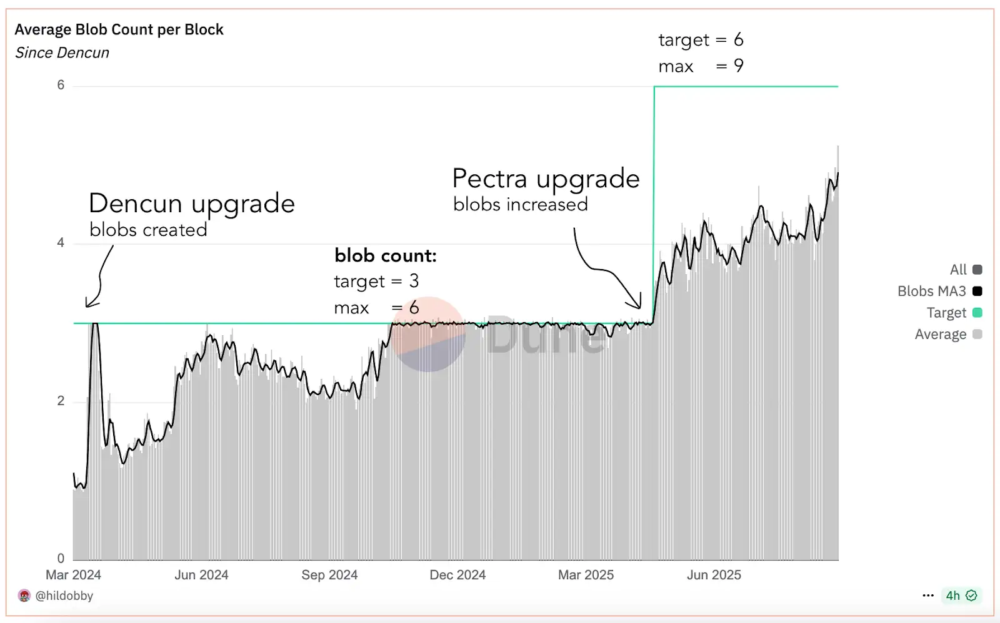

# Fusaka <Emoji text="🦓" /> {#fusaka}

The Fusaka network upgrade follows [Pectra](/roadmap/pectra/) and brings more new features and improves the experience for every Ethereum user and developer. The name consists of the execution layer upgrade Osaka and the consensus layer version named after the Fulu star. Both parts of Ethereum receive an upgrade that pushes Ethereum scaling, security and user experience to the future.

This upgrade is planned for Q4 2025.

<InfoBanner>
The Fusaka upgrade is only a single step in Ethereum's long-term development goals. Learn more about [the protocol roadmap](/roadmap/) and [previous upgrades](/history/).
</InfoBanner>

## Improvements in Fusaka {#improvements-in-fusaka}

### Scale blobs {#scale-blobs}

#### PeerDAS {#peerdas}

This is the _headliner_ of the Fusaka fork, the main feature added in this upgrade. Layer 2s currently post their data to Ethereum in blobs, the ephemeral data type created specifically for layer 2s. Pre-Fusaka, every full node has to store every blob to ensure that the data exists. As blob throughput rises, having to download all of this data becomes untenably resource-intensive.

With [data availability sampling](https://notes.ethereum.org/@fradamt/das-fork-choice) , instead of having to store all of the blob data, each node will be responsible for a subset of the blob data. Blobs are uniformly randomly distributed across nodes in the network with each full node holding only 1/8th of the data, therefore enabling theoretical scale up to 8x. To ensure availability of the data, any portion of the data can be reconstructed from any existing 50% of the whole with methods that drive down the probability of wrong or missing data to a cryptographically negligible level (~one in 1020 to one in 1024).

This keeps hardware and bandwidth requirements for nodes tenable while enabling blob scaling resulting in more scale with smaller fees for layer 2s.

[Learn more about PeerDAS](/roadmap/fusaka/peerdas/)

**Resources**:

- [EIP-7594 technical specification](https://eips.ethereum.org/EIPS/eip-7594)
- [DappLion on PeerDAS: Scaling Ethereum Today | ETHSofia 2024](https://youtu.be/bONWd1x2TjQ?t=328)
- [Academic: A Documentation of Ethereum’s PeerDAS (PDF)](https://eprint.iacr.org/2024/1362.pdf)

#### Blob-Parameter-Only forks {#blob-parameter-only-forks}

Layer 2s scale Ethereum - as their networks grow, they need to post more data to Ethereum. This means that Ethereum will need to increase the number of blobs available to them as time goes on. Although PeerDAS enables scaling blob data, it needs to be done gradually and safely.

Because Ethereum is code running on thousands of independent nodes that require agreement on same rules, we cannot simply introduce changes like increasing blob count the way you deploy a website update. Any rule change must be a coordinated upgrade where every node, client and validator software upgrades before the same predetermined block.

These coordinated upgrades generally include a lot of changes, require a lot of testing, and that takes time. In order to adapt faster to changing layer 2 blob needs, blob parameter only forks introduce a mechanism to increase blobs without having to wait on that upgrade schedule.

Blob parameter only forks can be set by clients, similarly to other configuration like gas limit. Between major Ethereum upgrades, clients can agree to increase the `target` and `max` blobs to e.g. 9 and 12 and then node operators will update to take part in that tiny fork. These blob parameter only forks can be configured at any time.

When blobs were first added to the network in the Dencun upgrade, the target was 3. That was increased to 6 in Pectra and, after Fusaka, that can now be increased at a sustainable rate independently of these major network upgrades.

Graph source: [Ethereum Blobs - @hildobby, Dune Analytics](https://dune.com/hildobby/blobs)

**Resources**: [EIP-7892 technical specification](https://eips.ethereum.org/EIPS/eip-7892)

#### Blob base-fee bounded by execution costs {#blob-base-fee-bounded-by-execution-costs}

Layer 2s pay two bills when they post data: the blob fee and the execution gas needed to verify those blobs. If execution gas dominates, the blob fee auction can spiral down to 1 wei and stop being a price signal.

EIP-7918 pins a proportional reserve price under every blob. When the reserve is higher than the nominal blob base fee, the fee adjustment algorithm treats the block as over target and stops pushing the fee down and allows it to increase normally. As a result:

- the blob fee market always reacts to congestion
- layer 2s pay at least a meaningful slice of the compute they force on nodes
- base-fee spikes on the EL can no longer strand the blob fee at 1 wei

**Resources**:

- [EIP-7918 technical specification](https://eips.ethereum.org/EIPS/eip-7918)
- [Storybook explainer](https://notes.ethereum.org/@anderselowsson/AIG)

### Scale L1 {#scale-l1}

#### History expiry and simpler receipts {#history-expiry}

In July 2025, Ethereum execution clients [began to support partial history expiry](https://blog.ethereum.org/2025/07/08/partial-history-exp). This dropped history older than [the Merge](https://ethereum.org/roadmap/merge/) in order to reduce the disk space required by node operators as Ethereum continues to grow.

This EIP is in a section apart from the "Core EIPs" because the fork doesn't actually implement any changes - it's a notice that client teams must support history expiry by the Fusaka upgrade. Practically, clients can implement this any time but adding it to the upgrade concretely put it on their to-do list and enabled them to test Fusaka changes in conjunction with this feature.

**Resources**: [EIP-7642 technical specification](https://eips.ethereum.org/EIPS/eip-7642)

#### Set upper bounds for MODEXP {#set-upper-bounds-for-modexp}

Until now, the MODEXP precompile accepted numbers of virtually any size. That made it hard to test, easy to abuse, and risky for client stability. EIP-7823 puts a clear limit in place: each input number can be at most 8192 bits (1024 bytes) long. Anything bigger is rejected, the transaction’s gas is burned, and no state changes occur. It very comfortably covers real-world needs while removing the extreme cases that complicated gas limit planning and security reviews. This change provides more security and DoS protection without affecting user or developer experience.

**Resources**: [EIP-7823 technical specification](https://eips.ethereum.org/EIPS/eip-7823)

#### Transaction Gas Limit Cap {#transaction-gas-limit-cap}

EIP-[7825](https://eips.ethereum.org/EIPS/eip-7825) adds a cap of 16,777,216 (2^24) gas per transaction. It’s proactive DoS hardening by bounding the worst-case cost of any single transaction as we raise the block gas limit. It makes validation and propagation easier to model to allow us to tackle scaling via raising the gas limit.

Why exactly 2^24 gas? It’s comfortably smaller than today’s gas limit, is large enough for real contract deployments & heavy precompiles, and a power of 2 makes it easy to implement across clients. This new maximum transaction size is similar to pre-Pectra average block size, making it a reasonable limit for any operation on Ethereum.

**Resources**: [EIP-7825 technical specification](https://eips.ethereum.org/EIPS/eip-7825)

#### `MODEXP` gas cost increase {#modexp-gas-cost-increase}

MODEXP is a precompile built‑in function that calculates modular exponentiation, a type of large‑number math used in RSA signature verification and proof systems. It allows contracts to run these calculations directly without having to implement them themselves.

Devs and client teams identified MODEXP as a major obstacle to increasing the block gas limit because the current gas pricing often underestimates how much computing power certain inputs require. This means one transaction using MODEXP could take up most of the time needed to process an entire block, slowing down the network.

This EIP changes the pricing to match real computational costs by:

- raising the minimum charge from 200 to 500 gas and removing the one‑third discount from EIP-2565 on the general cost calculation
- increasing the cost more sharply when the exponent input is very long. if the exponent (the “power” number you pass as the second argument) is longer than 32 bytes / 256 bits, the gas charge climbs much faster for each extra byte
- charging large base or modulus extra as well. The other two numbers (the base and the modulus) are assumed to be at least 32 bytes - if either one is bigger, the cost rises in proportion to its size

By better matching costs to actual processing time, MODEXP can no longer cause a block to take too long to validate. This change is one of several aimed at making it safe to increase Ethereum’s block gas limit in the future.

**Resources**: [EIP-7883 technical specification](https://eips.ethereum.org/EIPS/eip-7883)

#### RLP Execution Block Size Limit {#rlp-execution-block-size-limit}

This creates a ceiling on how big a block is allowed to be - this is a limit on what's _sent_ over the network and is separate from the gas limit, which limits the _work_ inside a block. The block size cap is 10 MiB, with a small allowance (2 MiB) reserved for consensus data so that everything fits and propagates cleanly. If a block shows up bigger than that, the clients reject it.
This is needed because very large blocks take longer to spread and verify across the network and can create consensus issues or be abused as a DoS vector. Also, the consensus layer’s gossip already won’t forward blocks over ~10 MiB, so aligning the execution layer to that limit avoids weird “seen by some, dropped by others” situations.

The nitty-gritty: this is a cap on the [RLP](/developers/docs/data-structures-and-encoding/rlp/)-encoded execution block size. 10 MiB total, with a 2 MiB safety margin reserved for beacon-block framing. Practically, clients define

`MAX_BLOCK_SIZE = 10,485,760` bytes and

`SAFETY_MARGIN = 2,097,152` bytes,

and reject any execution block whose RLP payload exceeds

`MAX_RLP_BLOCK_SIZE = MAX_BLOCK_SIZE − SAFETY_MARGIN`

The goal is to bound worst-case propagation/validation time and align with consensus layer gossip behavior, reducing reorg/DoS risk without changing gas accounting.

**Resources**: [EIP-7934 technical specification](https://eips.ethereum.org/EIPS/eip-7934)

#### Set default gas limit to 60 million {#set-default-gas-limit-to-60-million}

Prior to raising the gas limit from 30M to 36M in February 2025 (and subsequently to 45M), this value hadn’t changed since the Merge (September 2022). This EIP aims to make consistent scaling a priority.

EIP-7935 coordinates EL client teams to raise the default gas-limit above today’s 45M for Fusaka. It’s an Informational EIP, but it explicitly asks clients to test higher limits on devnets, converge on a safe value, and ship that number in their Fusaka releases.

Devnet planning targets ~60M stress (full blocks with synthetic load) and iterative bumps; research says worst-case block-size pathologies shouldn’t bind below ~150M. Rollout should be paired with the transaction gas-limit cap (EIP-7825) so no single transaction can dominate as limits rise.

**Resources**: [EIP-7935 technical specification](https://eips.ethereum.org/EIPS/eip-7935)

### Improve UX {#improve-ux}

#### Deterministic proposer lookahead {#deterministic-proposer-lookahead}

With EIP-7917, Beacon Chain will become aware of upcoming block proposers for the next epoch. Having a deterministic view on which validators will be proposing future blocks can enable [preconfirmations](https://ethresear.ch/t/based-preconfirmations/17353) - a commitment with the upcoming proposer that guarantees the user transaction will be included in their block without waiting for the actual block.

This feature benefits client implementations and security of the network as it prevents edge cases where validators could manipulate the proposer schedule. The lookahead also allows for less complexity of the implementation.

**Resources**: [EIP-7917 technical specification](https://eips.ethereum.org/EIPS/eip-7917)

#### Count leading zeros (CLZ) opcode {#count-leading-zeros-opcode}

This feature adds a small EVM instruction, **count leading zeros (CLZ)**. Most everything in the EVM is represented as a 256-bit value—this new opcode returns how many zero bits are at the front. This is a common feature in many instruction set architectures as it enables more efficient arithmetic operations. In practice this collapses today’s hand-rolled bit scans into one step, so finding the first set bit, scanning bytes, or parsing bitfields becomes simpler and cheaper. The opcode is low, fixed-cost and has been benchmarked to be on par with a basic add, which trims bytecode and saves gas for the same work.

**Resources**: [EIP-7939 technical specification](https://eips.ethereum.org/EIPS/eip-7939)

#### Precompile for secp256r1 Curve Support {#secp256r1-precompile}

Introduces a built-in, passkey-style secp256r1 (P-256) signature checker at the fixed address `0x100` using the same call format already adopted by many L2s and fixing edge cases, so contracts written for those environments work on L1 without changes.

UX upgrade! For users, this unlocks device-native signing and passkeys. Wallets can tap into Apple Secure Enclave, Android Keystore, hardware security modules (HSMs), and FIDO2/WebAuthn directly - no seed phrase, smoother onboarding, and multi-factor flows that feel like modern apps. This results in better UX, easier recovery, and account abstraction patterns that match what billions of devices do already.

For developers, it takes a 160-byte input and returns a 32-byte output, making it easy to port existing libraries and L2 contracts. Under the hood, it includes point-at-infinity and modular-comparison checks to eliminate tricky edge cases without breaking valid callers.

**Resources**:

- [EIP-7951 technical specification](https://eips.ethereum.org/EIPS/eip-7951)
- [More about RIP-7212](https://www.alchemy.com/blog/what-is-rip-7212) _(Note that EIP-7951 superseded RIP-7212)_

### Meta {#meta}

#### `eth_config` JSON-RPC method {#eth-config}

This is a JSON-RPC call that allows you to ask your node what fork settings you're running. It returns three snapshots: `current`, `next`, & `last` so that validators and monitoring tools can verify that clients are lined up for an upcoming fork.

Practically speaking, this is to address a shortcoming discovered when the Pectra fork went live on the Holesky testnet in early 2025 with minor misconfigurations which resulted in a non-finalizing state. This helps testing teams and developers ensure that major forks will behave as expected when moving from devnets to testnets, and from testnets to Mainnet.

Snapshots include: `chainId`, `forkId`, planned fork activation time, which precompiles are active, precompile addresses, system contract dependencies, and the fork's blob schedule.

This EIP is in a section apart from the "Core EIPs" because the fork doesn't actually implement any changes - it's a notice that client teams must implement this JSON-RPC method by the Fusaka upgrade.

**Resources**: [EIP-7910 technical specification](https://eips.ethereum.org/EIPS/eip-7910)

## FAQ {#faq}

### Does this upgrade affect all Ethereum nodes and validators? {#does-this-upgrade-affect-all-ethereum-nodes-and-validators}

Yes, the Fusaka upgrade requires updates to both [execution clients and consensus clients](/developers/docs/nodes-and-clients/). All main Ethereum clients will release versions supporting the hard fork marked as high priority. You can keep up with when these releases will be available in client Github repos, their [Discord channels](https://ethstaker.org/support), the [EthStaker Discord](https://dsc.gg/ethstaker), or by subscribing to the Ethereum blog for protocol updates. To maintain synchronization with the Ethereum network post-upgrade, node operators must ensure they are running a supported client version. Note that the information about client releases is time-sensitive, and users should refer to the latest updates for the most current details.

### How can ETH be converted after the hard fork? {#how-can-eth-be-converted-after-the-hardfork}

- **No Action Required for Your ETH**: Following the Ethereum Fusaka upgrade, there is no need to convert or upgrade your ETH. Your account balances will remain the same, and the ETH you currently hold will remain accessible in its existing form after the hard fork.
- **Beware of Scams!** <Emoji text="⚠️" /> **anyone instructing you to "upgrade" your ETH is trying to scam you.** There is nothing you need to do in relation to this upgrade. Your assets will stay completely unaffected. Remember, staying informed is the best defense against scams.

[More on recognizing and avoiding scams](/security/)

### What's with the zebras? <Emoji text="🦓" /> {#whats-with-the-zebras}

A zebra is Fusaka's developer-chosen "mascot" because its stripes reflect PeerDAS’s column-based data-availability sampling, where nodes custody certain column subnets and sample a few other columns from each peers slot to check that blob data is available. 

The Merge in 2022 [used a panda](https://x.com/hwwonx/status/1431970802040127498) as its mascot to signal the joining of the execution & consensus layers. Since then, mascots have been informally chosen for each fork and show up as ASCII art in the client logs at the time of upgrade. It’s just a fun way to celebrate.

### What improvements are included for L2 Scaling? {#what-improvements-are-included-for-l2-scaling}

[PeerDAS](https://eips.ethereum.org/EIPS/eip-7594) is is the main feature of the fork. It implements data availability sampling (DAS). Instead of every full node needing to download and store all blob data (which becomes unsustainable as L2s grow), PeerDAS allows each node to be responsible for only a subset of the blob data while maintaining its availability and verifiability. This enables blob throughput to scale significantly, leading to even smaller fees for layer 2s.

Alongside PeerDAS, [a small change](https://eips.ethereum.org/EIPS/eip-7918) that improves the blob fee market is being introduced. It ensures that the blob fee market reacts efficiently to congestion and doesn't spiral down to 1 wei, guaranteeing L2s pay a meaningful fee for the compute and space that blobs impose on nodes.

### What are Blob Parameter Only forks? {#what-are-blob-parameter-only-forks}

[BPOs](https://eips.ethereum.org/EIPS/eip-7892) provide a mechanism to continuously increase the blob count (both target and max) after PeerDAS is activated, without having to wait for a full coordinated upgrade. Each increase is hardcoded to be pre-configured in client releases supporting Fusaka. 

This means users and validators don’t need to update their clients for each BPO and only make sure to follow major hardforks like Fusaka. This is same practice as before, no special actions are needed to  It is still recommended to monitor your clients around upgrades and BPOs and keep them update even between major releases as fixes or optimizations might follow the hardfork.   

PeerDAS is a significant change to peer-to-peer (P2P) communication and blob mechanism that needs to be introduced gradually to ensure liveness and performance of the network. Fusaka ships with safe initial blob count but with BPOs, developers created a commitment to each new scale of blob count without any extra overhead on coordination and node users.  

### What is the BPO schedule? {#what-is-the-bpo-schedule}

The exact schedule of BPO updates is going to be determined with Fusaka releases. Follow [Protocol announcements](https://blog.ethereum.org/category/protocol) and release notes of your clients.

Example of how it might look like: 

- Before Fusaka: target 6, max 9
- At Fusaka activation: target 6, max 9
- BPO1, few weeks after Fusaka activation: target 10, max 15, increasing by two thirds
- BPO2, few weeks after BPO1: target 14, max 21

### Will this lower fees on Ethereum (layer 1) {#will-this-lower-gas}

This upgrade does not lower gas fees on L1, at least not directly. The main focus is more blob space for rollup data, therefore lowering fees on layer 2. This might have some side effects on L1 fee market but no significant change is expected. 

### As a staker, what do I need to do for the upgrade? {#as-a-staker-what-do-i-need-to-do-for-the-upgrade}

As with every network upgrade, make sure to update your clients to latest versions marked with Fusaka support. Follow updates in the mailing list and [Protocol Announcements on the EF Blog](https://blog.ethereum.org/category/protocol) to get informed about releases. 
To validate your setup before Fusaka gets activated on Mainnet, you can run a validator on testnets. Fusaka is [activated sooner on testnets](https://blog.ethereum.org/2025/09/26/fusaka-testnet-announcement) giving you more space to make sure everything works and report bugs. Testnet forks are also announced in the mailing list and blog.

### Does "Deterministic Proposer Lookahead" (EIP-7917) affect validators? {#does-7917-affect-validators}

This change doesn’t change how your validator client functions, however, it will provide more insight into the future of your validator duties. Make sure to update your monitoring tooling to keep up with new features. 

### How does Fusaka affect bandwidth requirements for nodes? {#how-does-fusaka-affect-bandwidth-requirements-for-nodes}

PeerDAS makes a significant change in how nodes transmit blob data. All data is divided into pieces called columns across 128 subnets with nodes subscribing to only some of them. Regular nodes will subscribe to only 16 subnets, providing custody for 1/8 of the full data. This means that with the same amount of blob data, the node bandwidth of downloading them would be smaller by a factor of eight (8). The actual bandwidth requirements will depend on the amount of blobs allowed in the network. At the moment of Fusaka activation the blob target stays the same as before, but with PeerDAS, node operators can see a decrease in their network usage. As BPOs configure higher numbers of blobs in the network, the necessary bandwidth will increase up to values before Fusaka activation. 

### What EVM changes are implemented? {#what-evm-changes-are-implemented}

Fusaka solidifies the EVM with new minor changes and features. 

- For security while scaling, a maximum size of a single transaction will be [limited to 16.7 million](https://eips.ethereum.org/EIPS/eip-7825) units of gas. 
- [New opcode count leading zeros (CLZ)](https://eips.ethereum.org/EIPS/eip-7939) is added to the EVM and will enable smart contract languages to perform certain operations more efficiently.
- [The cost of `ModExp` precompile will be increased](https://eips.ethereum.org/EIPS/eip-7883)—contracts using it will charge more gas for execution.

### How does new 16M gas limit affects contract developers? {#how-does-new-16m-gas-limit-affects-contract-developers}

Fusaka introduces a limit to [maximum size of a single transaction to 16.7 million](https://eips.ethereum.org/EIPS/eip-7825) (2^24) gas units. This is roughly the previous size of an average block which makes it big enough to accommodate complex transactions that would consume an entire block. This limit creates protection for clients, preventing potential DoS attacks in the future with higher block gas limit. The goal of scaling is to enable more transactions to get into the blockchain without a single one consuming the whole block. 

Regular user transactions are far from reaching this limit. Certain edge cases like big and complex DeFi operations, large smart contract deployments or batch transactions targeting multiple contracts might be affected by this change. These transaction will have to be divided into smaller ones or optimized in another way. Use simulation before submitting transactions that potentially reach the limit.

The RPC method `eth_call` is not limited and will allow simulation of bigger transactions than the actual blockchain limit. The actual limit for RPC methods can be configured by the client operator to ensure prevent abuse. 

### What CLZ means for developers? {#what-clz-means-for-developers}

EVM compilers like Solidity will implement and utilize the new function for counting zeros under the hood. New contracts might benefit from gas savings if they rely on this sort of operation. Follow releases and feature announcement of the smart contract language for documentation on potential savings. 

### Are there any changes for my existing smart contracts? {#what-clz-means-for-developers}

Fusaka has no direct affect that would break any existing contracts or change their behavior. Changes introduced to the execution layer are made with backward compatibility, however, always keep an eye on edge cases and potential impact. 

[With the increased cost of `ModExp` precompile](https://eips.ethereum.org/EIPS/eip-7883), contracts that depend on it will consume more gas for execution. If your contract relies heavily on this and becomes more expensive for users, reconsider how it’s utilized. 

Consider the [new 16.7 million limit](https://eips.ethereum.org/EIPS/eip-7825) if transactions executing your contracts might be reaching similar size. 

## Further reading {#further-reading}

- [Ethereum roadmap](/roadmap/)
- [Forkcast: Fusaka](https://forkcast.org/upgrade/fusaka)
- [Fusaka Meta EIP](https://eips.ethereum.org/EIPS/eip-7607)
- [Fusaka testnet blog announcement](https://blog.ethereum.org/2025/09/26/fusaka-testnet-announcement)
- [Bankless: What Fusaka & Pectra will bring Ethereum](https://www.bankless.com/read/what-fusaka-pectra-will-bring-ethereum)
- [Bankless: Ethereum's Next Upgrades: Fusaka, Glamsterdam & Beyond with Preston Van Loon](https://x.com/BanklessHQ/status/1956017743289020633?t=502)
