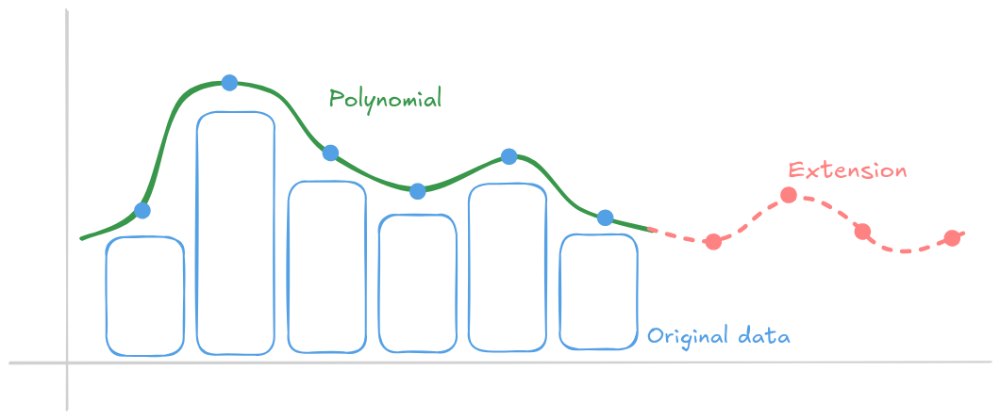

The Ethereum protocol is undergoing its most significant scaling upgrade since the [introduction of blob transactions with EIP-4844](/roadmap/danksharding/). As part of the [Fusaka upgrade](/roadmap/fusaka/), PeerDAS introduces a new way of handling blob data, delivering roughly an order-of-magnitude increase in **[data availability (DA)](/developers/docs/data-availability/)** capacity for L2s.

[More on blob scaling roadmap](https://blog.ethereum.org/2025/08/22/protocol-update-002)

## Scalability {#scalability}

[Ethereum’s vision](/roadmap/vision/) is to be a neutral, secure and decentralized platform available for everyone in the world. As network usage grows, this requires balancing the trilemma of scale, security, and decentralization of the network. If Ethereum simply increased the data handled by the network within its current design, it would run the risk of overwhelming the [nodes that Ethereum relies on for its decentralization](/developers/docs/nodes-and-clients/). Scalability requires rigorous mechanism design that minimizes trade-offs.

One of the strategies to achieve this goal is to allow for a diverse ecosystem of layer 2 scaling solutions rather than processing all transactions on [layer 1 (L1)](/glossary/#layer-1) Mainnet. [Layer 2s (L2s)](/glossary/#layer-2) or [rollups](/glossary#rollups) process transactions on their own separate chains and use Ethereum for verification and security. Publishing only security-critical commitments and compressing payloads lets L2s use Ethereum’s DA capacity more efficiently. In turn, L1 carries less data without compromising security guarantees, while L2s onboard more users at lower gas costs. Initially, L2s published data as `calldata` in ordinary transactions, which competed with L1 transactions for gas and was impractical for bulk data availability.

## Proto-Danksharding {#proto-danksharding}

The first major step towards scaling L2 was the Dencun upgrade, which introduced [Proto-Danksharding](/roadmap/danksharding/) (EIP-4844). This upgrade created a new, specialized data type for rollups called blobs. [Blobs](/developers/docs/data-availability/blockchain-data-storage-strategies/#eip-4844-blobs), or binary large objects, are ephemeral pieces of arbitrary data that don’t need EVM execution and nodes store only for a limited amount of time. This more efficient processing allowed for L2s to publish more data to Ethereum and scale even further. 

Despite already having strong benefits for scaling, using blobs is only part of the end goal. In the current protocol, every node in the network still needs to download every blob. The bottleneck becomes the bandwidth required of individual nodes, with the amount of data that needs to be downloaded directly increasing with higher blob counts. 

Ethereum does not compromise on decentralization, and bandwidth is one of the most sensitive knobs. Even with powerful computing available widely to anyone who can afford it, [upload bandwidth limitations](https://www.speedtest.net/global-index) even in highly urban cities in developed nations (such as [Germany](https://www.speedtest.net/global-index/germany), [Belgium](https://www.speedtest.net/global-index/belgium), [Australia](https://www.speedtest.net/global-index/australia) or the [United States](https://www.speedtest.net/global-index/united-states)) could restrict nodes to only being able to run from data centers if bandwidth requirements aren’t carefully tuned.

Node operators have increasingly high bandwidth and disk space requirements as blobs increase. The size and quantity of blobs are limited by these constraints. Each blob can carry up to 128kb of data with average of 6 blobs per block. This was only the first step towards a future design that uses blobs in an even more efficient way.

## Data availability sampling {#das}

[Data availability](/developers/docs/data-availability/) is the guarantee that all of the data needed to independently validate the chain are accessible to all network participants. It ensures that the data has been fully published and can be used to trustlessly verify the new state of the chain or incoming transactions. 

Ethereum blobs provide a strong data availability guarantee that ensures the security of L2s. To do this, Ethereum nodes need to download and store blobs in their entirety. But what if we can distribute blobs in the network more efficiently and avoid this limitation? 

A different approach to storing the data and ensure its availability is **data availability sampling (DAS)**. Instead of every computer that runs Ethereum fully storing every single blob, DAS introduces a decentralized division of labor. It breaks the burden of processing the data by distributing smaller, manageable tasks across the entire network of nodes. Blobs are divided into pieces and each node only downloads a few pieces using a mechanism for uniform random distribution across all nodes. 

This introduces a new problem—proving availability and integrity of the data. How can the network guarantee that the data is available and it’s all correct when individual nodes hold only small pieces? A malicious node could serve fake data and easily break strong data availability guarantees! This is where cryptography comes to help. 

To ensure the integrity of the data, EIP-4844 was already implemented with KZG commitments. These are cryptographic proofs created when a new blob is added to the network. A small proof is included in each block, and nodes can verify that received blobs correspond to the block’s KZG commitment.

DAS is a mechanism that builds on top of this and ensures the data is both correct and available. Sampling is a process where a node queries only a small part of the data and verifies it against the commitment. KZG is a polynomial commitment scheme which means that any single point on the polynomial curve can be verified. By checking only a couple points on the polynomial, the client doing the sampling can have a strong probabilistic guarantee that the data is available. 

## PeerDAS {#peer-das}

[PeerDAS (EIP-7594)](https://eips.ethereum.org/EIPS/eip-7594) is a specific proposal that implements the DAS mechanism in Ethereum, marking probably the biggest upgrade since The Merge. PeerDAS is designed to extend blob data, dividing it into columns and distributing a subset to nodes.

Ethereum borrows some clever math to achieve this: it applies Reed-Solomon style erasure coding to blob data. Blob data are represented as a polynomial whose coefficients encode the data, then evaluate that polynomial at additional points to create an extended blob, doubling the number of evaluations. This added redundancy enables erasure recovery: even if some evaluations are missing, the original blob can be reconstructed as long as at least half of the total data, including extended pieces are available.

In reality, this polynomial has thousands of coefficients. KZG commits are values of few bytes, something like a hash, known to all nodes. Every node holding enough data points can [efficiently reconstruct a full set of blob data](https://arxiv.org/abs/2207.11079). 

> Fun fact: the same coding technique was used by DVDs. If you scratched a DVD, the player was still able to read it thanks to Reed-Solomon coding that adds missing pieces of the polynomial. 

Historically, data in blockchains, whether blocks or blobs, was broadcast to all nodes. With PeerDAS’s split-and-sample approach, broadcasting everything to everyone is no longer necessary. Post-Fusaka, consensus layer networking is organized into gossip topics/subnets: blob columns are assigned to specific subnets, and each node subscribes to a predetermined subsets and custodies only those pieces.

With PeerDAS, extended blob data is divided into 128 pieces called columns. Data is distributed to these nodes via a dedicated gossip protocol on specific subnets that they subscribe to. Each regular node on the network participates in at least 8 randomly chosen column subnets. Receiving data from only 8 of 128 subnets means that this default node receives only 1/16 of all data, but because the data was extended this is 1/8th of the original data. 

This allows for a new theoretical scaling limit of 8x the current “everyone downloads everything” schema. With nodes subscribing to different random subnets serving blob columns, the probability is very high that they are uniformly distributed and therefore every piece of data exists somewhere in the network. Nodes running validators are required to subscribe to more subnets with each validator they run.

> Each node has a unique randomly generated ID, it normally servers as it's public identity for connections. In PeerDAS, this number is used to determine random set subnets it has to subscribe to resulting in a uniform random distribution of all blob data.

Once a node successfully reconstructs the original data, it then redistributes the recovered columns back into the network, actively healing any data gaps and enhancing overall system resilience. Nodes connected to validators with a combined balance ≥4096 ETH must be a supernode and therefore must subscribe to all data column subnets and custody all columns. These supernodes will continuously heal data gaps. The probabilistically self-healing nature of the protocol allows for strong availability guarantees while not limiting home operators holding only portions of the data. 

Data availability can be confirmed by any node holding only small subset of the blob data thanks to the sampling mechanism described above. This availability is enforced: validators must follow new fork-choice rules, meaning they will only accept and vote for blocks after they have verified the availability of the data.

The direct impact on users (particularly L2 users) is lower fees. With 8x more space for rollup data, user operations on their chain becomes even cheaper with time. But lower fees post-Fusaka will take time and depend on BPOs.

## Blob-Parameter-Only (BPOs) {#bpo}

The network will theoretically be able to process 8x more blobs, but blob increases are a change that need to be properly tested and executed safely in a stepwise manner. Testnets provide enough confidence to deploy the features on Mainnet but we need to ensure stability of the p2p network before enabling a significantly higher number of blobs. 

To gradually raise the target number of blobs per block without overwhelming the network, Fusaka introduces **[Blob-Parameter-Only (BPO)](https://ethereum-magicians.org/t/blob-parameter-only-bpo-forks/22623)** forks. Unlike regular forks that need broad ecosystem coordination, agreement, and software updates, [BPOs (EIP-7892)](https://eips.ethereum.org/EIPS/eip-7892) are pre-programmed upgrades that increase the maximum number of blobs over time without intervention.

This means that immediately after Fusaka activates and PeerDAS goes live, the number of blobs will remain unchanged. The number of blobs will begin doubling every few weeks until it reaches a maximum of 48, while developers monitor to ensure the mechanism is working as expected and isn’t having adverse effects on the nodes running the network.

## Future directions {#future-directions}

PeerDAS is only a step [toward a greater scaling vision of FullDAS](https://ethresear.ch/t/fulldas-towards-massive-scalability-with-32mb-blocks-and-beyond/19529), or Danksharding. While PeerDAS uses 1D erasure coding to each blob individually, full Danksharding will use a more complete 2D erasure coding scheme across the entire matrix of blob data. Extending data in two dimensions creates even stronger redundancy properties and more efficient reconstruction and verification. Realizing FullDAS will require substantial network and protocol optimizations, along with additional research.

## Further reading {#further-reading}

- [PeerDAS: Peer Data Availability sampling by Francesco D'Amato](https://www.youtube.com/watch?v=WOdpO1tH_Us)
- [A Documentation of Ethereum’s PeerDAS](https://eprint.iacr.org/2024/1362.pdf)
- [Proving the Security of PeerDAS without the AGM](https://eprint.iacr.org/2025/1683)
- [Vitalik on PeerDAS, its impact, and testing Fusaka](https://x.com/VitalikButerin/status/1970983281090085200)