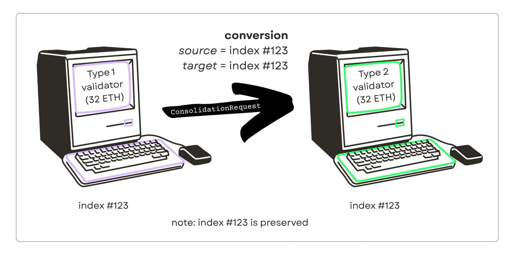
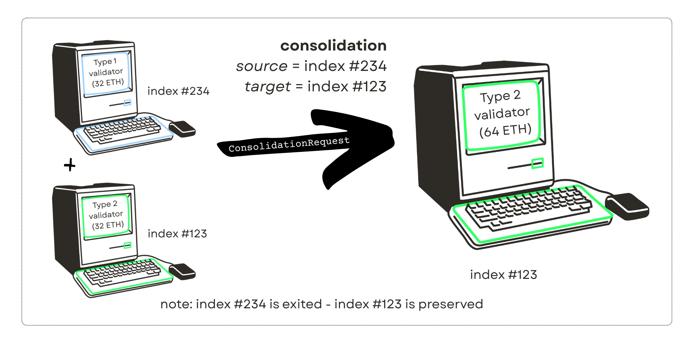

# MaxEB {#maxeb}

*tl;dr:* The Pectra hard fork allows Ethereum validators to opt into a higher max effective balance and compounding by converting from **Type 1** to **Type 2** withdrawal credentials. The official tool to do this is the Launchpad. This operation cannot be reversed.

## Overview {#overview}

### Who is affected? {#who-is-affected}

Anyone who runs a validator - this is likely someone who knows the index (e.g., [Validator #12345](https://beaconcha.in/validator/12345)) of a validator that they control. If you use a protocol to run a validator (e.g., Lido CSM or Rocket Pool), you will have to check with them to see if and when they support maxEB.

If you stake using a liquid staking token (e.g., rETH or stETH), no action is required or recommended.

### What is "maxEB"? {#what-is-maxeb}

maxEB = the MAXimum Effective Balance of a validator. Until the Pectra hard fork, every validator earns on a maximum 32 ETH. After Pectra, validators have the option to earn on any balance between 32 and 2048 ETH, in 1 ETH increments by opting in to the change.

### How does a validator opt in? {#how-does-a-validator-opt-in}

A validator opts into the maxEB change by converting from **Type 1** to **Type 2** withdrawal credentials. This can be done on the [Launchpad (Validator Actions)](https://launchpad.ethereum.org/en/validator-actions) after the Pectra hard fork goes live. As with **Type 0** → **Type 1**, converting from **Type 1** → **Type 2** is an irreversible process.

### What's a withdrawal credential? {#whats-a-withdrawal-credential}

When you run a validator, you have a set of withdrawal credentials. These can be found in your deposit data json or you can view them on your validator's beaconcha.in [deposit tab](https://beaconcha.in/validator/12345#deposits).

1. **Type 0** withdrawal credentials: If your validator's withdrawal credentials begin with `0x00...`, you deposited before the Shapella hard fork and do not yet have a withdrawal address set.

2. **Type 1** withdrawal credentials: If your validator's withdrawal credentials begin with `0x01...`, you deposited after the Shapella hard fork or already converted your **Type 0** credentials to **Type 1** credentials.

 

3. **Type 2** withdrawal credentials: This new withdrawal credential type will begin with `0x02...` and will be enabled after Pectra. Validators with **Type 2** withdrawal credentials are sometimes called "**compounding validators**"

| **Allowed** | **Not allowed** |
| --- | --- |
| ✅ Type 0 → Type 1 | ❌ Type 0 → Type 2 |
| ✅ Type 1 → Type 2 | ❌ Type 1 → Type 0 |
|  | ❌ Type 2 → Type 1 |
|  | ❌ Type 2 → Type 0 |

### Risks {#risks}

MaxEB enables a validator to send its entire balance to another validator. Users submitting a consolidation request should verify the source and contents of the transaction they're signing. The official tool for taking advantage of maxEB features is the Launchpad. If you do decide to use a third-party tool, you should verify that:

- The source validator's pubkey and withdrawal address match the validator they control
- The target validator's pubkey is correct and belongs to them
- The request is a conversion, not a consolidation, if they don't intend to send funds to another validator
- The transaction is being signed by the correct withdrawal address

We **strongly recommend** discussing any third-party tool you plan to use with the [EthStaker community](https://ethstaker.org/about). It's a helpful place to sanity-check your approach and avoid mistakes. If you use a malicious or misconfigured tool, **your entire validator balance could be sent to a validator you don't control** — with no way to get it back.

## Technical details {#technical-details}

### The flow {#the-flow}

There will be two uses of the `ConsolidationRequest` operation:

1. Converting an existing validator from a **Type 1** to a **Type 2** validator
2. Consolidating other validators into an existing **Type 2** validator

In a conversion of a **Type 1** to a **Type 2** validator, both the *source* and *target* will be the validator you are converting. The operation will cost gas and will be queued behind other consolidation requests. This queue is **separate** from the deposit queue and is unaffected by new validator deposits and can be viewed on [pectrified.com](https://pectrified.com/).

To consolidate validators, you must have a *target validator* that has a **Type 2** withdrawal credential. This is the destination of any validator balances being consolidated, and the index being preserved.

### Requirements for converting to Type 2 {#requirements-for-converting-to-type-2}

This will be required for the first validator you convert to **Type 2**. This validator's index is preserved and active. For a conversion, the *source validator* == the *target validator.*

The validator must...

- be active
- have **Type 1** withdrawal credentials
- not be in an exiting state (or slashed)
- not have pending manually-triggered withdrawals (does not apply to sweeps)

### Requirements for consolidating {#requirements-for-consolidating}

This is the *same operation* as converting but is when the *source validator* is different from the *target validator*. The target validator's index is preserved and accepts the balance from the source validator. The source validator's index is put into an `EXITED` state.

In this case, the source validator has all the same requirements as above plus:

- has been active for at least ~27.3 hours (one `SHARD_COMMITTEE_PERIOD`)

The target validator must

- have **Type 2** withdrawal credentials
- not be in an exiting state.

### The consolidation request {#the-consolidation-request}

The consolidation request will be signed by the withdrawal address associated with the source validator and have:

1. Address of the source validator (e.g., `0x15F4B914A0cCd14333D850ff311d6DafbFbAa32b`)
2. Public key of the source validator (e.g., `0xa1d1ad0714035353258038e964ae9675dc0252ee22cea896825c01458e1807bfad2f9969338798548d9858a571f7425c`)
3. Public key of that target validator

In a conversion, 2 & 3 will be the same. This operation can be done on [the Launchpad](https://launchpad.ethereum.org/).

### Signing requirements {#signing-requirements}

To submit a `ConsolidationRequest`, the **withdrawal address of the source validator** must sign the request. This proves control over the validator funds.

### What is signed? {#what-is-signed}

A domain-separated [signing root](https://github.com/ethereum/consensus-specs/blob/dev/specs/phase0/beacon-chain.md#compute_signing_root) of the `ConsolidationRequest` object is used.

- **Domain:** `DOMAIN_CONSOLIDATION_REQUEST`
- **Signing root fields:**
  - `source_pubkey`: `BLSPubkey`
  - `target_pubkey`: `BLSPubkey`
  - `source_address`: `ExecutionAddress`

The resulting **BLS signature** is submitted alongside the request.

Note: The signing is done by the withdrawal address, not the validator key.

### Partial withdrawals {#partial-withdrawals}

Validators with **Type 1** credentials get automatic, gasless sweeps of their excess balance (anything over 32 ETH) to their withdrawal address. Because **Type 2** allows a validator to compound balances in 1 ETH increments, it will not automatically sweep balances until it reaches 2048 ETH. Partial withdrawals on **Type 2** validators must be manually triggered and will cost gas.

## Consolidation tooling {#consolidation-tooling}

There are several tools available to manage consolidations. The official tool, created by the Ethereum Foundation, is the [Launchpad](https://launchpad.ethereum.org/en/validator-actions). There are also third-party tools created by entities from the staking community that may offer features not provided by the Launchpad. While the tools here are not audited or endorsed by the Ethereum Foundation, the following are open source tools by known members of the community.

| Tool | Website | Open source | Creator | Audited | Interface | Notable features |
| --- | --- | --- | --- | --- | --- | --- |
| Pectra Staking Manager | pectrastaking.com | Yes, Apache 2.0 | [Pier Two](https://piertwo.com/) | No | Web UI | Wallet Connect, works with SAFE |
| Pectra Validator Ops CLI Tool | [GitHub](https://github.com/Luganodes/Pectra-Batch-Contract) | Yes, MIT | [Luganodes](https://www.luganodes.com/) | Yes, Quantstamp [May 2025](https://certificate.quantstamp.com/full/luganodes-pectra-batch-contract/23f0765f-969a-4798-9edd-188d276c4a2b/index.html) | Command line | Batching, for many validators at once |
| Ethereal | [GitHub](https://github.com/wealdtech/ethereal) | Yes, Apache 2.0 | [Jim McDonald](https://www.attestant.io/team/) | No | Command line | Full feature set for validator and node management |
| Siren | [GitHub](https://github.com/sigp/siren) | Yes, Apache 2.0 | [Sigma Prime](https://sigmaprime.io/) | No | Some command line, but primarily web UI | Only works if you're using the Lighthouse consensus client |
| Consolideth.app | https://consolideth.app/ [GitHub](https://github.com/Stakely/consolideth) | Yes, MIT licences | [Stakely](https://stakely.io/) | No | Web UI, hosted by stakely and ready to be selfhosted freely| Supports major wallet connections including safe with walletconnect |

## FAQ {#faq}

### Does opting-in change my proposal luck or rewards? {#change-luck-or-rewards}

No. Opting in does not decrease your change of proposal - your duties and proposal selection remain the same. For example, if you have two 32 ETH validators vs one 64 ETH validator, you will have the same total chances of being selected to propose a block and earn rewards.

### Does opting in change my slashing risk? {#change-slashing-risk}

For smaller or unprofessional operators, the short answer is no. The longer answer is that, for professional operators running many validators per node with fast alerting, consolidating into fewer validators may reduce their ability to react to a slashing and prevent cascade events. The initial slashing *penalty* for all validators has been dramatically reduced from 1 ETH (per 32 ETH) to 0.0078125 ETH (per 32 ETH) to offset this risk.

### Do I have to exit my validator to convert? {#exit-validator}

No. You can convert in place without exiting.

### How long will it take to convert / consolidate? {#how-long}

A minimum of 27.3 hours but consolidations are also subject to a queue. This queue is independent of the deposit and withdrawal queues and is not affected by them.

### Can I keep my validator index? {#keep-validator-index}

Yes. In-place conversion keeps the same validator index. If you consolidate multiple validators, you'll only be able to keep the index of the *target validator*.

### Will I miss attestations? {#miss-attestations}

During a consolidation into another validator, the source validator is exited and there is a ~27 hour waiting period before the balance is active on the target validator. This period **does not affect performance metrics**.

### Will I incur penalties? {#incur-penalties}

No. As long as your validator is online, you will not incur penalties.

### Do the withdrawal addresses of the validators being consolidated have to match? {#withdrawal-addresses-match}

No. But the *source* must authorize the request from its own address.

### Will my rewards compound after converting? {#rewards-compound}

Yes. With **Type 2** credentials, rewards above 32 ETH are automatically restaked — but not instantly. Because of a small buffer (called [*hysteresis*](https://eth2book.info/capella/part2/incentives/balances/#hysteresis)), your balance needs to reach **about 1.25 ETH more** before the extra is restaked. So instead of compounding at 33.0 ETH, it happens at 33.25 (effective balance = 33 ETH), then 34.25 (effective balance = 34 ETH), and so on.

### Can I still get automatic sweeps after converting? {#automatic-sweep}

Automatic sweeps will only happen with excess balances over 2048. For all other partial withdrawals, you'll need to manually trigger them.

### Can I change my mind and go back from Type 2 to Type 1? {#go-back-to-type1}

No. Converting to **Type 2** is irreversible.

### If I want to consolidate multiple validators, do I have convert each one to Type 2 first? {#consolidate-multiple-validators}

Nope! Convert one validator to Type 2 then use that as the target. All other validators consolidated into that Type 2 target can be Type 1 or Type 2

### My validator is offline or below 32 ETH - can I still convert it? {#offline-or-below-32eth}

Yes. As long as it's active (not exited) and you can sign with its withdrawal address, you can convert it.

## Resources {#resources}

- [Electra consensus specs](https://github.com/ethereum/consensus-specs/blob/dev/specs/electra/beacon-chain.md): This is the 'truest' version that you should rely on. When in doubt, read the specs
- Not everybody is comfortable wading through code, so [this maxEB-GPT](https://chatgpt.com/g/g-67f1650fb48081918f555e0c8d1c2ae9-maxeb-gpt) can help interpret the specs. *Disclaimer: The specs, not the AI, should be relied on as truth, as the AI may misinterpret information or hallucinate answers*
- [pectrified.com](https://pectrified.com/): View the state of consolidations, deposits, and queue waiting times
- [Ethereal](https://github.com/wealdtech/ethereal): Community-created CLI tool for managing common validator tasks
- [batch-validator-depositor](https://github.com/attestantio/batch-validator-depositor): Community-created contract that allows multiple Ethereum validators to be deposited in a single transaction
