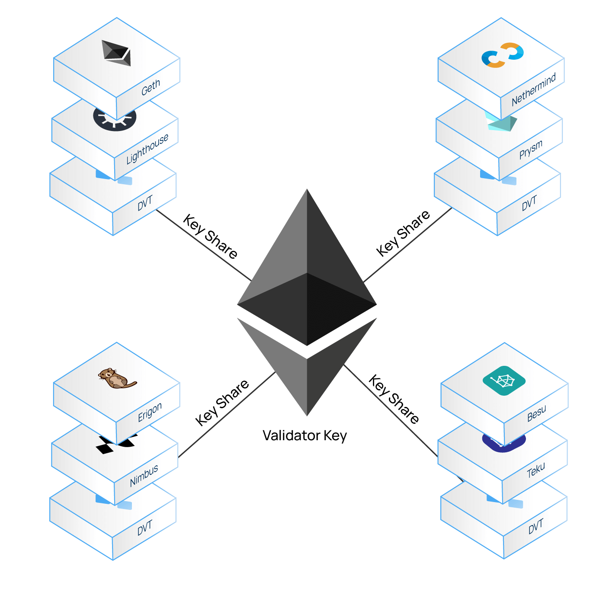

## What is distributed validator technology? {#what-is-dvt}

Distributed validator technology (DVT) is an approach to validator security that spreads out key management and signing responsibilities across multiple parties, to reduce single points of failure and increase validator resiliency.

DVT distributes key management and signing by **splitting the private key** used to secure a validator **across many computers** organized into a "cluster". Doing so allows for some nodes in the cluster to go offline while keeping the validator node active, as the necessary validation work can be done by a subset of the machines in each cluster. This distribution reduces single points of failure, making the validator more robust. An additional benefit of DVT's signing distribution is that it makes it very difficult for attackers to gain access to the key, because it is not stored in full on any single machine.

DVT is not a separate way to stake. It is a layer of software that any staking setup can use: 
- [Solo stakers](/staking/solo/) can team up to run a validator together, or an individual solo staker can use DVT to add resilience to their solo staking setup. 
- [Staking services](/staking/saas/) and [staking pools](/staking/pools/) can use DVT to add resilience and harden their staking infrastructure, or to to distribute validator operations across many independent operators.

## Why do we need DVT? {#why-do-we-need-dvt}

### Security {#security}

Validators generate two public-private key pairs: validator keys for participating in consensus and withdrawal keys for accessing funds. While validators can secure withdrawal keys in cold storage, the validator private keys must be online 24/7 to sign the duties the validator is assigned around the clock, such as attestations and block proposals. Keeping a key online exposes it to theft, and DVT limits that exposure: only key shares are ever online, never the full key.

If a validator private key is compromised, an attacker can control the validator, potentially leading to slashing or the loss of the staker's ETH. DVT mitigates this risk. With DVT, the original, full validator key is encrypted and split into key shares. The key shares live online, distributed across multiple nodes that operate the validator together, while the full 'master' key stays securely offline. The distribution is possible because [Ethereum](/) validators use BLS signatures that are additive, meaning the full key can be reconstructed by summing their component parts. Partial signatures made with the key shares combine into a signature that is valid for the full key, so the full key itself is never needed for day-to-day signing. When a cluster generates a new validator key using distributed key generation, the full private key never exists on any single machine.

### No single points of failure {#no-single-point-of-failure}

When a validator is divided across multiple operators and multiple machines, it can withstand individual hardware and software failures without going offline. The risk of failures can also be reduced by using diverse hardware and software configurations across the nodes in a cluster. Multi-operator distribution is not natively available to single-node validator configurations; it comes from the DVT middelware layer.

If one of the components of a machine in a cluster goes down (for example, if there are four operators in a validator cluster and one uses a specific client that has a bug), the others can ensure that the validator keeps running.

### Decentralization {#decentralization}

The ideal scenario for Ethereum is to have as many independently operated validators as possible. However, a few staking providers have become very popular and account for a substantial portion of the total staked ETH on the network. DVT can allow these operators to exist while preserving decentralization of stake. This is because the keys for each validator are distributed across many machines and it would take much greater collusion for a validator to turn malicious.

Without DVT, it's easier for staking providers to support only one or two client configurations for all their validators, increasing the impact of a client bug. DVT can be used to spread the risk across multiple client configurations and different hardware, creating resilience through diversity.

**DVT offers the following benefits to Ethereum:**

1. **Decentralization** of Ethereum's proof-of-stake consensus
2. Ensures the **liveness** of the network
3. Creates validator **fault tolerance**
4. **Trust minimized** validator operation
5. **Minimized slashing** and downtime risks
6. **Improves diversity** (client, data center, location, regulation, etc.)
7. **Enhanced security** of validator key management

## How does DVT work? {#how-does-dvt-work}

DVT implementations typically run as an additional piece of software on each machine in a cluster. This software acts as middleware, sitting between a node's validator client and its consensus client, where it coordinates with the other nodes in the cluster so that the validator's duties are signed collectively.

A DVT solution contains the following components:

- **[Shamir's secret sharing](https://medium.com/@keylesstech/a-beginners-guide-to-shamir-s-secret-sharing-e864efbf3648)** - Validators use [BLS keys](https://en.wikipedia.org/wiki/BLS_digital_signature). A validator private key can be split into multiple "key shares," and because BLS signatures are additive, partial signatures made with those key shares can be combined into a single signature that is valid for the full validator key.
- **[Threshold signature scheme](https://medium.com/nethermind-eth/threshold-signature-schemes-36f40bc42aca)** - Determines the number of individual key shares that are required for signing duties, e.g., 3 out of 4.
- **[Distributed key generation (DKG)](https://medium.com/toruslabs/what-distributed-key-generation-is-866adc79620)** - Cryptographic process that generates the key shares and is used to distribute the shares of an existing or new validator key to the nodes in a cluster.
- **[Multiparty computation (MPC)](https://messari.io/report/applying-multiparty-computation-to-the-world-of-blockchains)** - The full validator key is generated in secret using multiparty computation. The full key is never known to any individual operator—they only ever know their own part of it (their "share").
- **Consensus protocol** - The consensus protocol selects one node to be the block proposer. They share the block with the other nodes in the cluster, who add their key shares to the aggregate signature. When enough key shares have been aggregated, the block is proposed on Ethereum.

Distributed validators have built-in fault tolerance and can keep running even if some of the individual nodes go offline. The validator node's cluster is resilient even if some of the nodes within it turn out to be malicious or lazy.

## DVT in production {#dvt-in-production}

Distributed validators run on Mainnet today across solo, service, and pooled staking. Two networks account for most of this activity:

<ProductDisclaimer />

- **Obol** develops Charon, an open-source DVT middleware client that lets a cluster of machines operate a validator together ("squad staking"). Groups perform distributed key generation and configure their cluster through Obol's [DV Launchpad](https://docs.obol.org/learn/readme/launchpad). Obol clusters are used in production by [staking protocols](/staking/pools/) and [staking services](/staking/saas/), including Lido's Simple DVT module and EtherFi's Operation Solo Staker program, which onboards home operators into fault-tolerant clusters.
- **SSV Network** is a permissionless network of independent node operators. A validator key is split into key shares and distributed to a chosen set of operators, who perform the validator's duties collectively; no single operator ever holds the full key. Staking services and pools run large validator sets on SSV, and like Obol, it is used by Lido's Simple DVT module.

## DVT use cases {#dvt-use-cases}

DVT has significant implications for the broader staking industry:

### Solo stakers {#solo-stakers}

DVT enables **squad staking**: a small group of people, such as friends, community members, or strangers coordinated through a launchpad, collectively running a single validator across their own machines. A threshold of the group (for example, 3 of 4) must be online for the validator to perform its duties, so no single member's downtime, hardware failure, or mistake takes the validator offline. When the key is created with distributed key generation, no member ever holds the full signing key.

DVT also enables non-custodial staking by allowing you to distribute your validator key across remote nodes while keeping the full key completely offline. This means stakers do not necessarily need to run their own hardware, and distributing the key shares helps protect against potential hacks.

### Staking as a service (SaaS) {#saas}

Operators (such as staking pools and institutional stakers) managing many validators can use DVT to reduce their risk. By distributing their infrastructure, they can add redundancy to their operations and diversify the types of hardware they use.

DVT shares responsibility for key management across multiple nodes, meaning some operational costs can also be shared. DVT can also reduce operational risk and insurance costs for staking providers.

### Staking pools {#staking-pools}

Due to standard validator setups, staking pools and liquid staking providers historically had to place significant trust in each individual operator, since gains and losses are socialized throughout the pool. They were also reliant on operators to safeguard signing keys because, until DVT, there was no other option for them.

Even though traditionally efforts are made to spread risk by distributing stakes across multiple operators, each operator still manages a significant stake independently. Relying on a single operator poses immense risks if they underperform, encounter downtime, get compromised, or act maliciously.

By leveraging DVT, the trust required from each individual operator can be reduced. **Pools can enable operators to hold stakes without needing custody of validator keys** (as only key shares are utilized). It also allows managed stakes to be distributed between more operators (e.g., instead of having a single operator managing 1000 validators, DVT enables those validators to be collectively run by multiple operators). Diverse operator configurations help ensure that if one operator should go down, the others will still be able to attest. The resulting redundancy and diversification can lead to better performance and resilience, while maximizing rewards.

Another benefit to minimizing single-operator trust is that staking pools can allow more open and permissionless operator participation. Some staking pools do this in production today. Multi-operator DVT clusters let protocols pair home stakers and smaller operators with larger professional ones, combining curated and permissionless operator sets. 

## Potential drawbacks of using DVT {#potential-drawbacks-of-using-dvt}

- **Additional component** - introducing a DVT node adds another part that can possibly be faulty or vulnerable. This is mitigated by having multiple implementations of DVT software, just as there are multiple clients for the consensus and execution layers.
- **Operational costs** - as DVT distributes the validator between multiple parties, there are more nodes required for operation instead of only a single node, which introduces increased operating costs.
- **Potentially increased latency** - since DVT utilizes a consensus protocol to achieve consensus between the multiple nodes operating a validator, it can potentially introduce increased latency.

## Frequently asked questions {#faq}

<ExpandableCard title="Do I need DVT to stake?" eventCategory="DVT" eventName="clicked do I need DVT to stake">
No. A single machine running a validator client works without any DVT software, and this remains a common home staking setup. DVT is an optional layer that adds fault tolerance and removes single points of failure. This is useful if you want your validator to survive failures of individual machines, or if you want to share the responsibility of running a validator with others.
</ExpandableCard>

<ExpandableCard title="Does DVT split my ETH or my withdrawal keys?" eventCategory="DVT" eventName="clicked does DVT split my ETH">
No. DVT splits only the validator <em>signing</em> key, which is used for consensus duties like attestations and block proposals. Your stake is always controlled by the withdrawal address set for the validator, which is unaffected by DVT. Since the Pectra upgrade, the withdrawal address holder can also trigger a validator exit directly from the execution layer, without needing the signing key at all.
</ExpandableCard>

<ExpandableCard title="What happens if nodes in a cluster go offline?" eventCategory="DVT" eventName="clicked what happens if nodes go offline">
As long as a threshold of nodes remains online (for example, 3 out of 4), the validator keeps performing its duties. If too many nodes go offline at once, the validator simply goes offline and misses rewards until enough nodes return, the same as any offline validator. Going offline is not a slashable offense.
</ExpandableCard>

<ExpandableCard title="Is DVT the same as pooled staking?" eventCategory="DVT" eventName="clicked is DVT the same as pooled staking">
No. Pooled staking combines ETH from many people to fund validators, and is one of several <a href="/staking/">ways to stake</a>. DVT is infrastructure for <em>operating</em> a validator. It distributes the signing of one validator across multiple machines and operators. The two are complementary; many pools use DVT to distribute their operator sets, but DVT itself doesn't pool anyone's ETH.
</ExpandableCard>

## Further reading {#further-reading}

- [Ethereum Distributed Validator Technology (DVT) - Full Introduction](https://www.cyfrin.io/blog/full-introduction-to-ethereum-distributed-validator-technology-dvt) - Cyfrin 
- [What is DVT and how does it improve staking on Ethereum?](https://blog.obol.org/what-is-dvt-and-how-does-it-improve-staking-on-ethereum/) - Obol 
- [Ethereum distributed validator specs (high level)](https://github.com/ethereum/distributed-validator-specs)
- [Ethereum distributed validator technical specs](https://github.com/ethereum/distributed-validator-specs/tree/dev/src/dvspec)
- [Obol documentation](https://docs.obol.org/)
- [SSV Network documentation](https://docs.ssv.network/)
- [Lido Simple DVT Module](https://operatorportal.lido.fi/modules/simple-dvt-module)
- [Shamir secret sharing demo app](https://iancoleman.io/shamir/)