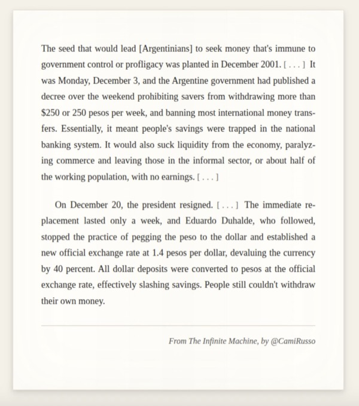
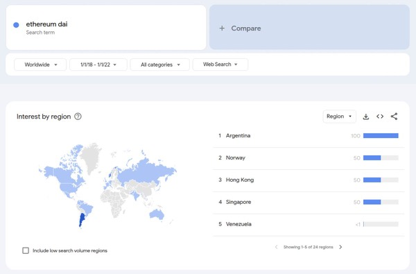
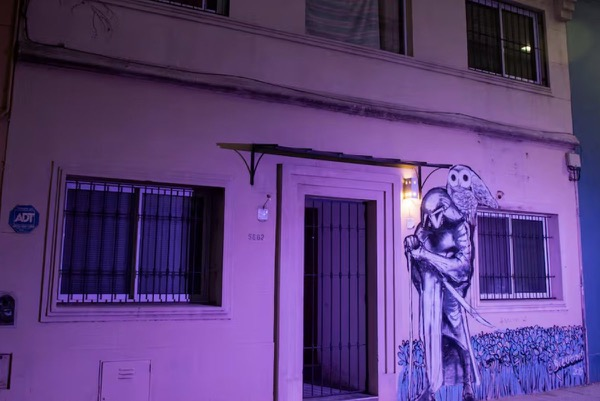
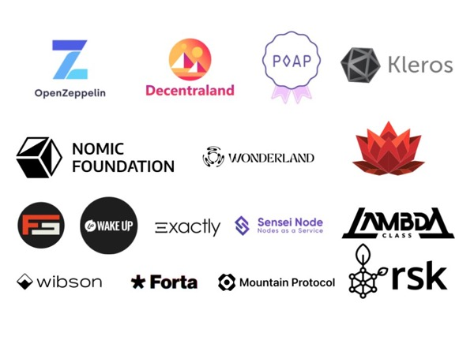
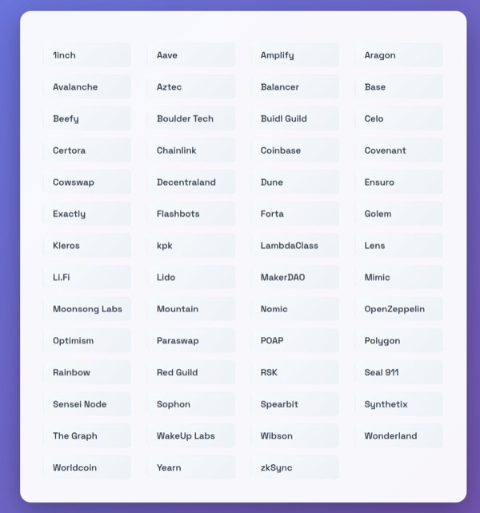
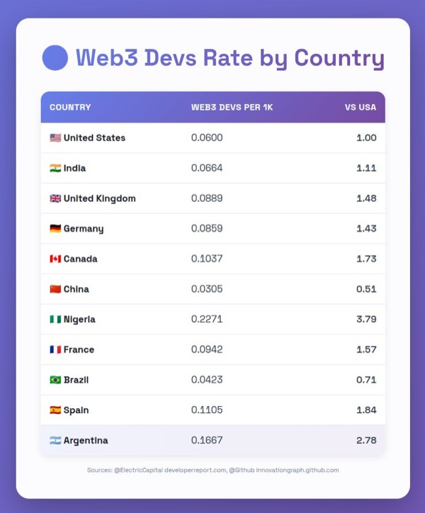
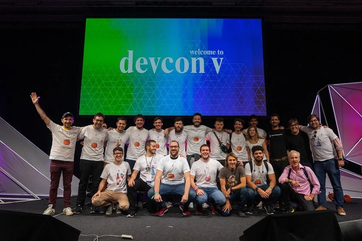
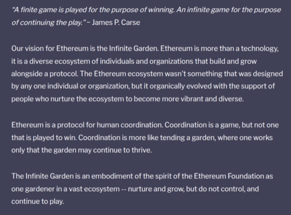

> *This story was originally published as [a guest thread on the @Ethereum X profile](https://x.com/ethereum/status/1985408315074232397?s=20) on November 3, 2025. It has been lightly edited for readability.*

Devconnect is [coming to Argentina](https://devconnect.org/) in November. The country has a rich crypto history, so rich that it predates crypto itself.

I'm [Santiago Palladino](https://palla.dev/), engineer at [Aztec](https://aztec.network/), based in Argentina—and here’s my take on what makes this country so unique. 

For most people of my generation, this story starts in 2001. The financial crisis erupted. The government restricted access to people’s own savings.

This would lead to 20+ years of on and off currency controls, followed by three-digit yearly inflation.

 

Stablecoins became a way to access the broader financial system, and to act as a store of value against the continuously depreciating peso.

Now, Argentinians are hard-wired towards dollars.

But when they couldn’t get their hands on any, they looked for anything that resembled them.

_[Source](https://trends.google.com/trends/explore?date=2018-01-01%202022-01-01&q=ethereum%20dai&hl=en)._

My own journey started with the tech, back in 2017. I serendipitously visited Voltaire House for coworking, and happened to sit next to [Manuel Aráoz](https://maraoz.com/).

“What do you do?”

“I build smart contracts”

“You what!?”

I was pilled. 

_[Casa Voltaire - Source](https://www.lanacion.com.ar/la-nacion-revista/casa-voltaire-como-era-el-lugar-de-reunion-de-quienes-iniciaron-empresas-que-hoy-valen-millones-nid05032022/#google_vignette)._

Voltaire would be the seedbed for many crypto projects, such as [OpenZeppelin](https://www.openzeppelin.com/), [Decentraland](https://decentraland.org/), [Muun](https://muun.com/), and [Nomic Foundation](https://nomic.foundation/).

But these would be just a few of the many projects born and raised in Argentina.

And not just projects.

Argentinian builders can be found all across web3. If you work in a crypto company, there’s a good chance one of us is on your team.

We don’t just use crypto—we build it.

Did you know that Argentina has 2.8x as many active web3 builders as the US, when normalized by total developers?

And that’s just the ones that self-report their location.

_Sources: [Electric Capital Developer Report](https://www.developerreport.com/), [GitHub Innovation Graph](https://innovationgraph.github.com/)._

No wonder this led to many significant events in Ethereum history happening from here.

Few people know that a smart contract language, Vyper’s predecessor, was withdrawn from circulation based on an audit coming out of a house in Argentina.

_[Source](https://medium.com/@AugurProject/serpent-compiler-vulnerability-rep-solidity-migration-5d91e4ae90dd)._

Or that the [ERC721 implementation](https://github.com/OpenZeppelin/openzeppelin-contracts/pull/803d) that enabled the NFT craze of 2021 was written here, three years before. 

Or that the deployments of [MakerDAO](https://x.com/MakerDAO) SAI and multi-collateral DAI happened from here, same as [Balancer](https://balancer.fi/) and [Aragon](https://www.aragon.org/). 

<TweetEmbed id="1387903795032698881" />

We Argentinians are passionate about our country and our culture. And we want others to experience it as well.

So much that we had been pushing to bring Devcon(nect) here for over 5 years.

(yes, the t-shirts below read “Devcon BA 2020”)

_[Source](https://ethereumba.substack.com/p/ethereum-ba-recap-2018-2020#%C2%A7thedevconba2020-campaign-trail)._

For me and many other builders having Devconnect here is a dream come true.

Not only because it shows Ethereum’s commitment to decentralization, but also because we can show the world what we’re made of.

_[Source](https://www.forbes.com/sites/astanley/2025/09/30/devconnect-brings-an-ethereum-worlds-fair-to-buenos-aires/)._

Here we can create a springboard to mass adoption, and make crypto so much more than a store of value, a hedge against inflation, or the means to receive payments.

We can fulfill the promise of the infinite garden. Turn Ethereum to a protocol for human coordination.

Starting here, in Argentina. 

_[Source](https://ethereum.foundation/infinitegarden)._

 
