> *This story was originally published as [a guest thread on the @Ethereum X profile](https://x.com/ethereum/status/2019505333593641179?s=20) on Feb 5, 2026. It has been lightly edited for readability.*

## Guests in our own worlds {#guests-in-our-own-worlds}

We spend more waking hours in digital spaces than physical ones. In those spaces we're guests, not owners.

We build identities on accounts we don't control. We create value that flows to a few digital landlords.

We have the tools to take it back.

Companies own your identity, progress, and memories.

Digital feudalism: you create the content, build the communities, generate the data. They own the platform, set the rules, keep the profits.

Their terms change. Your work disappears. 

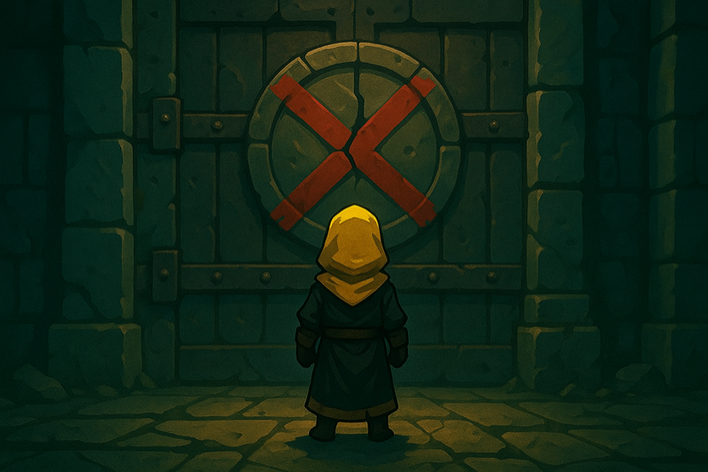

Nowhere is digital feudalism more obvious than in gaming.

When game publisher Ubisoft shut down The Crew, they also revoked every buyer's $60 license.

The ['Stop Killing Games' movement](https://en.wikipedia.org/wiki/Stop_Killing_Games) exists because players have had enough. 

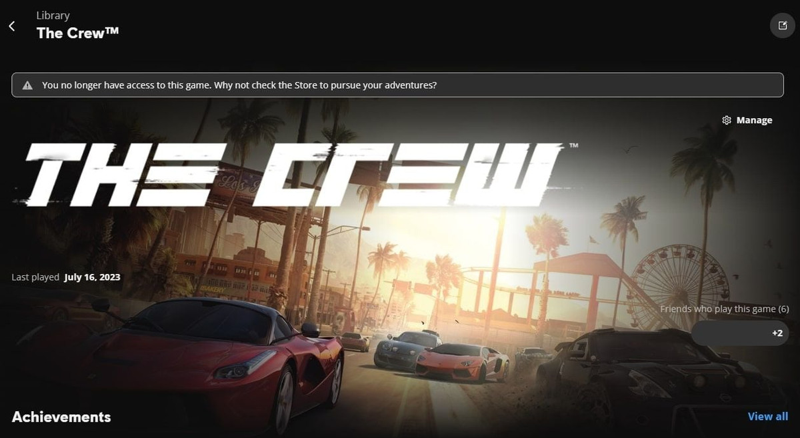

It’s part of the fabled origin story of Ethereum.

When Blizzard nerfed Vitalik Buterin's (co-founder of Ethereum) World of Warcraft character, he realized the danger: centralized control means everything you build can be destroyed on a whim. 

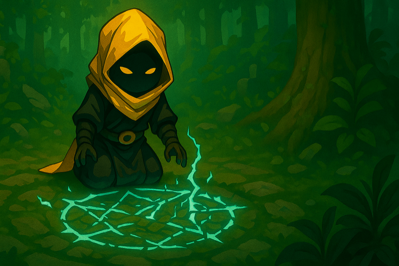 

Even when games survive, everything you build is at risk.

Counter-Strike players created a $6 billion digital weapon skins economy: years of matches, trades, and dedication.

Valve changed the trade-in rules overnight. Half the value evaporated.

Your history. Their whims. 

<TweetEmbed id="1981254371007426993" />

When the Star Wars Galaxies game shut down, thousands logged in to watch 14 years of communities, relationships and stories die.

They lit fireworks and said goodbye. It was a funeral for a world they built and loved but never owned. 

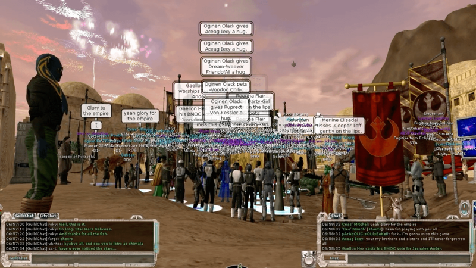 

## What happens when players control their worlds {#what-happens-when-players-control-their-worlds}

So what happens when players control their game worlds?

It is the end of digital feudalism and the beginning of a new social contract.

A digital Declaration of Rights.

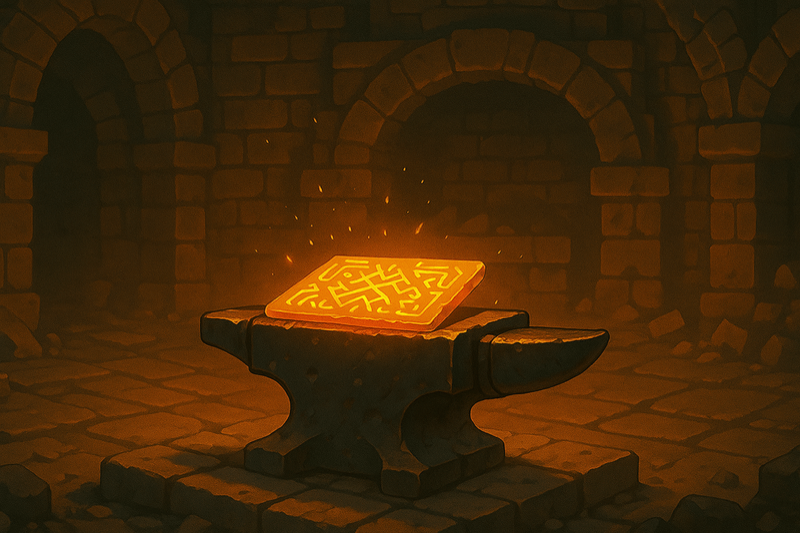 

The spirit of [onchain gaming](/gaming/) is the spirit of open-source.

When Unity betrayed game devs with Runtime Fees, [Godot Engine](https://godotengine.org/) offered an alternative.

Now onchain engines like [Dojo](https://dojoengine.org/) offer game studios an alternative to shipping games on centralized servers.

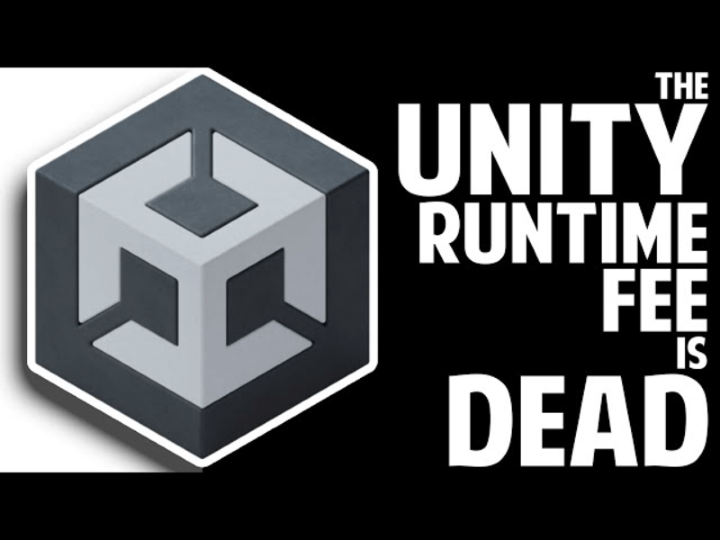 

Richard Garfield created Hasbro's first billion-dollar brand, *Magic: The Gathering*. 

Now he's building onchain games so players can "keep playing these games even after we stop supporting them officially."

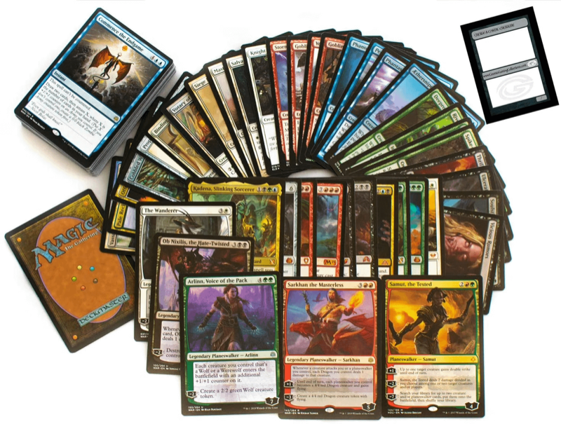 

It started with [Dom Hofmann’s](https://domhofmann.com/) [Loot project](https://www.lootproject.com/).

8,000 lists of fantasy gear asking: “What if we built an IP that belonged to no one?”

- Player-DAOs like [Realms.World](https://linktr.ee/Realms.World) became stewards.
- Builders like [Cartridge](https://cartridge.gg/) turned it into reality.
- Engines like [Dojo](https://dojoengine.org/) make worlds open by default.

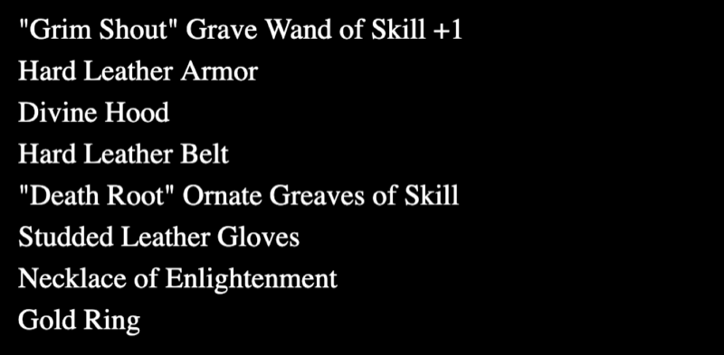

If you want to know what escaping digital feudalism feels like, don't take my word for it.

Play [Loot Survivor](https://www.deathmountain.gg/lootsurvivor). 

The future I'm talking about? It's live.

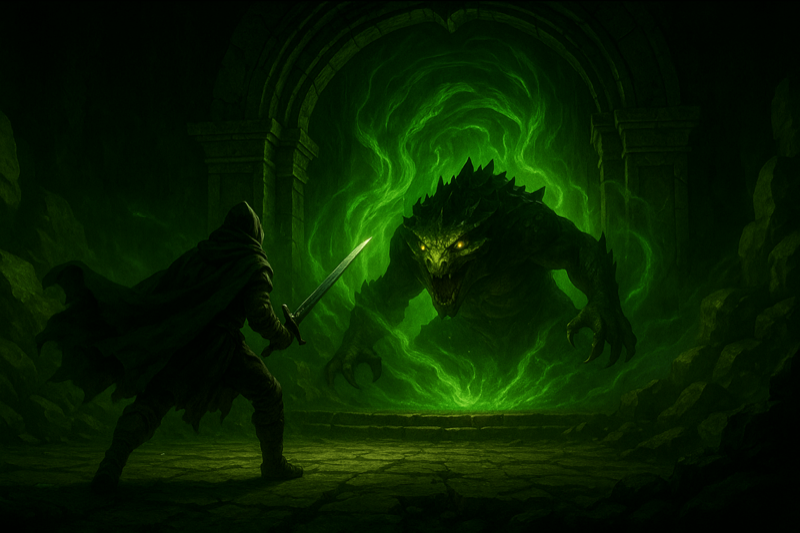 

## Making crypto disappear {#making-crypto-disappear}

“But Crypto is clunky, slow and hard to use.”

For years, it was the 4-minute mile of our industry, a limit everyone accepted as the cost of decentralization.

Players had to juggle wallets, gas fees, seed phrases, constant signatures.

Friction was the price of admission. 

<TweetEmbed id="2002290372655853596" />

Tools like [Cartridge Controller](https://docs.cartridge.gg/controller/overview) change the whole experience.

- Social login.
- One-signature sessions.
- Gas fees the player never sees.

As crypto fades into the background, the games become fun.

<TweetEmbed id="1963275825157202148" />

## A world that can't be taken away {#a-world-that-cant-be-taken-away}

Imagine a competitive game where the prize pool is locked in a smart contract. The winner is the winner.

The dev can't change the rules mid-season or refuse to pay out.

"Code is Law" as a feature. 

<TweetEmbed id="1978207107557310597" />

DOTA was a community-made mod inside Warcraft III. It created a billion-dollar genre (the MOBA).

The original Warcraft III creators (Blizzard) saw almost none of that value.

Onchain, the community can build on the game, extend the world, and own their creations. 

<TweetEmbed id="1958160344091631674" />

When the Library of Alexandria burned, unique texts vanished forever. All that human knowledge, in one vulnerable place.

When game servers shut down, unique worlds and culture go up in smoke.

The fire was inevitable. The centralization was the choice. 

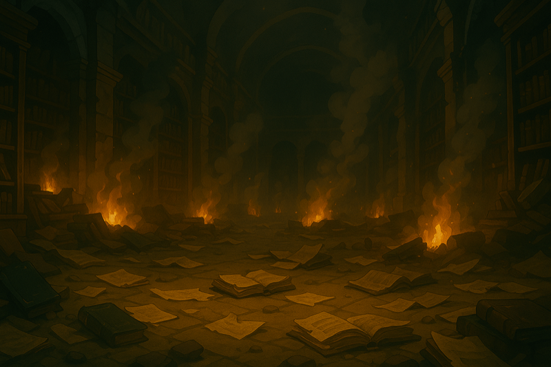 

Building onchain games isn’t building a safer vault for your worlds.

It’s giving them a printing press: the power to exist everywhere at once.

Copied, extended, rebuilt, preserved, not locked away behind a single door. 

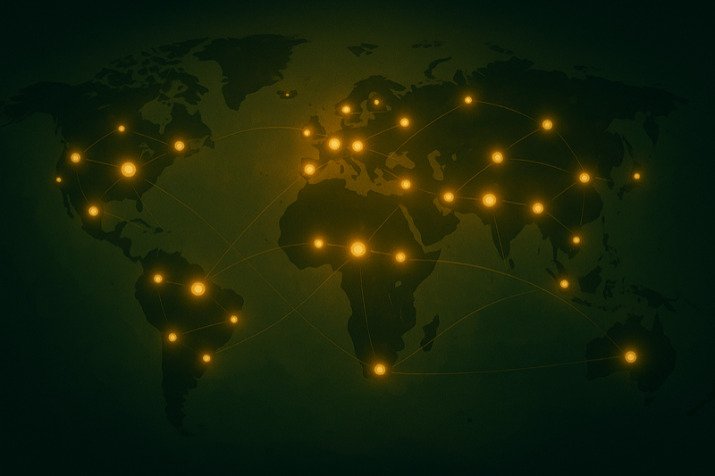 

When the code is onchain:

- Publishers can't revoke your license
- Studios can't delete your progress
- Corporations can't steal your value

You take back what always should have been yours.

Every revolution begins with a realization: "It doesn't have to be this way." 

<TweetEmbed id="1990799147616587954" />

## Declaring independence {#declaring-independence}

We're declaring independence from digital feudalism.

When you own your world, value flows through you, not from you.

That's not just better gaming. It's freedom. 

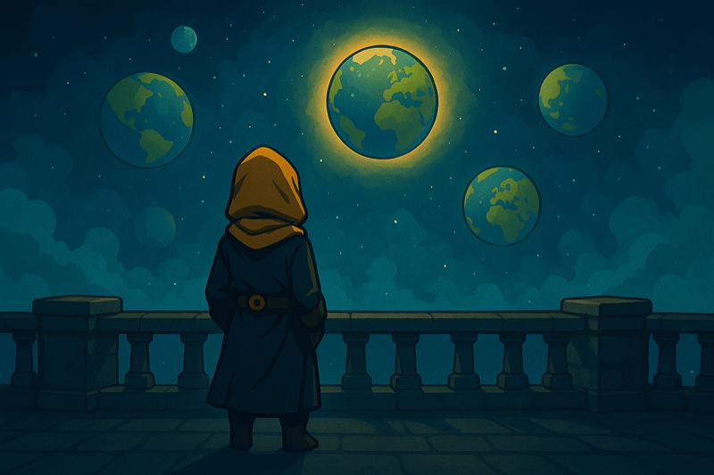 

<Divider />

<DocLink href="/gaming/">
  Learn more about Ethereum's open-source and onchain gaming ecosystem
</DocLink>

