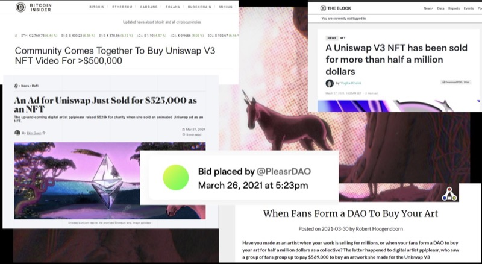
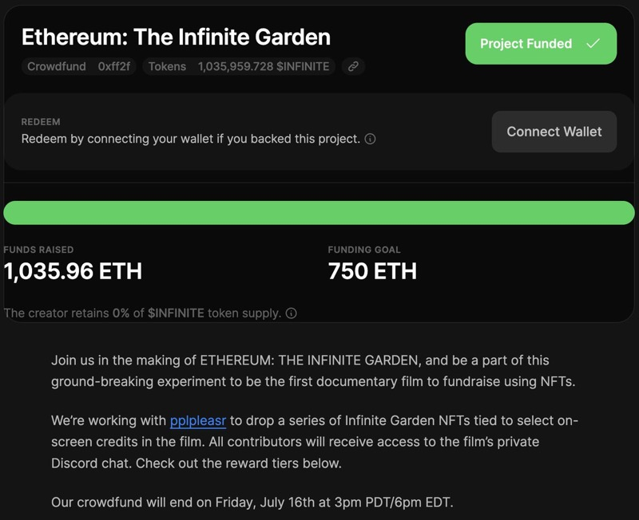
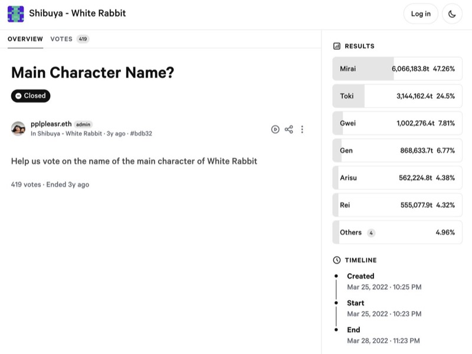
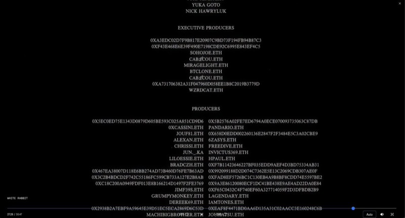
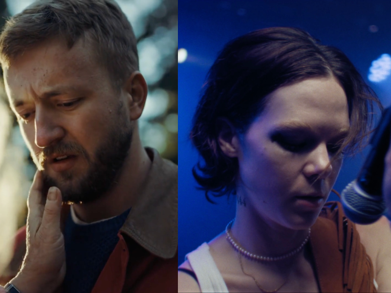

> *This story was originally published as [a guest thread on the @Ethereum X profile](https://x.com/ethereum/status/1928462812554072540?s=20) on May 30, 2025. It has been lightly edited for readability.*

What happens when you use Ethereum not just to fund code, but culture?

Here's my journey from DeFi meme animator to building a decentralized film platform on Ethereum.

Trying to disrupt the old Hollywood system because it sucks. 

My first viral moment came when I made the [Uniswap v3 announcement video](https://x.com/Uniswap/status/1374069664297406467?s=20) in 2021, which got over 500,000 views in 24 hours.

I minted it as an NFT and it sold for 310 ETH.

But what made it historic was who bought it... 

<TweetEmbed id="1374069664297406467" />

It wasn’t a whale. It was 23 wallet addresses who spun up a DAO on the spot to pool funds and win the auction. They called themselves [@PleasrDAO](https://x.com/PleasrDAO).

That sale kicked off a wave of collective capital formation we still feel today. 

 

It was a cultural moment that proved collective capital coordination on Ethereum was not just possible, but powerful. It helped inspire Juicebox protocol, PartyDAO, and more.

Ethereum became a canvas for new forms of collective action.

Later that summer, I made the NFTs that crowdfunded [Ethereum: The Infinite Garden](https://ethereumfilm.xyz/watch-the-film/), the first feature doc about Ethereum.

It raised 1,036 ETH in 48 hours, funded entirely by the Ethereum community. 

 

It made me ask a bigger question: If Ethereum could fund one film, why not many?

Could it replace Hollywood’s outdated, bureaucratic system entirely, and reshape how stories get made? 

I started [Shibuya](https://www.shibuya.film/) with [Maciej Kuciara](https://www.kuciara.com/). Our dream: a platform where creators can crowdfund, publish, and evolve stories directly with their communities. No gatekeepers. Just story, community, and code.

Our first experiment was an anime series called [White Rabbit](https://www.shibuya.film/series/white-rabbit). We raised >400 ETH with a choose-your-own-adventure-style interactive experience:
- Fans minted Producer Pass NFTs
- Staked to vote on plot decisions directly in player
- Earned an ERC20 (our attention token) 

The ERC20 was issued on a bonding curve. The earlier and more engaged you were, the more you earned. Votes (like naming the main character Mirai) happened via Snapshot. 

Participation wasn’t just rewarded, it helped shape the story itself.

 

One of the parts I’m most proud of: the credits. They weren’t static, but updated in real-time.

Based on contribution, fans were credited as:
- Executive Producer
- Producer
- Associate Producer
- Production Assistant (for last place, lol) 

 

Every producer in the credits is an ENS or wallet address. The order updates live, like a ledger.

It's one of the first times Ethereum was used not just to fund a film, but to decide who gets credited in it. ENS = the new IMDb. 

We premiered White Rabbit on the main stage at Devcon 2024. It was nominated for a VMA & Webby, featured in a Linkin Park music video (100M+ views), and Mirai was on the cover of Vogue Taiwan.

(*Editor's note*: After this article was published, White Rabbit went on to win the [Emmy award for Outstanding Innovation In Emerging Media Programming - 2025](https://www.televisionacademy.com/shows/white-rabbit).)

It's not about chasing clout, but rather that Ethereum stories can move culture. 

 

We just dropped 5 original pilots across different genres, each by a different creator. Funded and co-produced by us.

If you love one, you can fund the next episode and be part of the credits. They’re live and free to watch on [shibuya.film](https://www.shibuya.film/).

This is more than a collection of shorts. It’s a proof of concept for a new kind of entertainment ecosystem.

By blending streaming with crowdfunding, we can empower both creators and audiences to shape the future of storytelling. 

<TweetEmbed id="1921928608039194795" />

If we want to break out of the crypto echo chamber, we can do it through culture.

But the content has to be strong enough to compete outside this space too. Curation matters!

If enough of us contribute the price of a coffee, we can fund great films onchain.

Together we can prove this system works, so more creators and fans want to come to web3. Not because they have to, but because it’s better.

 

<Divider />

<DocLink href="/dao/">
  Learn more about how Etheruem powers collectively-owned organizations like PleasrDAO
</DocLink>

