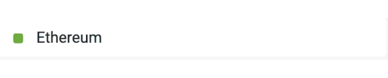

## General rules

<ContentSplit>
  A translatathon is a collaborative and competitive hackathon-style event where individuals and teams compete for prizes by translating ethereum.org content into different languages.

  The goal is to translate website content and help make ethereum.org more accessible to non-English speakers, raise awareness of the importance of localization and the Translation program, onboard new contributors and give back to our community, while fostering a sense of community by teaming up, collaborating on translations, and competing against other teams.
</ContentSplit>

## Details and submission criteria

### Requirements and scoring

With the translation process taking place in Crowdin, the deliverable for Translatathon participants is simply the content you have translated in the ethereum.org project(opens in a new tab). No need to manually submit anything.

In order for your submissions to be counted, make sure that you are only translating untranslated and unapproved strings.
This means that you should only be translating files that are less than 100% translated, and strings with no existing translations. They can be easily identified by the red square (as shown in the image below).

Untranslated string (translate this!):

Translated strings (do not translate):

String with an approved translation (do not translate):

The files for translation are already categorized by priority in Crowdin, with initial content buckets containing the most high-traffic pages.
You can read more about content buckets here, and check the exact distribution of pages across different content buckets here.
We always recommend contributors to translate the content buckets in order, starting with 1) Homepage → 2) Essentials → 3) Exploring → 4) Use Ethereum pages, etc., but during the Translatathon, this will be especially important and could heavily influence your score, since the higher priority buckets will have a higher multiplier when calculating the final score.

Full breakdown of multipliers by content bucket:
- Content buckets 1-8: 1.2x points multiplier
- Content buckets 9-15: 1.1x points multiplier
- Content buckets 16-28: 1x points multiplier
- Remix translations: 0.8x points multiplier

## Evaluation process

text

## Where does it happen

The translations and review process will take place in the ethereum.org project on Crowdin(opens in a new tab), a localization management platform where all of our localization processes take place.

All of the Translatathon participants will be required to join the project in Crowdin and translate directly on the platform, where you can translate as individuals or collaborate as part of a team.

## FAQ - Frequently asked questions

<ExpandableCard title="FAQ 1 question">
    Answer FAQ 1
</ExpandableCard>

<ExpandableCard title="FAQ 2 question">
    Answer FAQ 2
</ExpandableCard>

<ExpandableCard title="FAQ 3 question">
    Answer FAQ 3
</ExpandableCard>

<ExpandableCard title="FAQ 4 question">
    Answer FAQ 4
</ExpandableCard>

<ApplyNow />