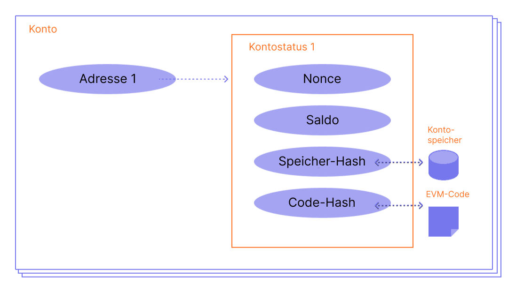

Ein Ethereum-Account besitzt ein Ether (ETH)-Guthaben und kann Nachrichten auf Ethereum senden. Konten können benutzerkontrolliert oder als intelligenter Vertrag bereitgestellt werden.

## Voraussetzungen {#prerequisites}

Um diese Seite besser zu verstehen, empfehlen wir dir, zuerst unsere [Einführung in Ethereum](/developers/docs/intro-to-ethereum/) zu lesen.

## Kontoarten {#types-of-account}

Ethereum hat zwei Kontotypen:

- Konten im externen Besitz (EOA) – kontrolliert von jeder beliebigen Person mit den privaten Schlüsseln
- Vertragskonto – ein auf dem Netwerk eröffneter Smart Contract, gesteuert durch Code. Erfahre mehr über [Smart Contracts](/developers/docs/smart-contracts/)

Beide Kontotypen haben die Möglichkeit

- ETH und Token zu empfangen, zu halten und zu versenden,
- mit bereitgestellten, intelligenten Verträgen zu interagieren.

### Wesentliche Unterschiede {#key-differences}

**Externer Besitz**

- Die Erstellung eines Kontos ist kostenlos.
- Kann Transaktionen initiieren
- Transaktionen zwischen fremden Konten können nur ETH/Token-Transfers sein.
- Bestehend aus einem kryptografischen Schlüsselpaar:öÖffentliche und private Schlüssel, die Kontoaktivitäten steuern

**Vertrag**

- Die Erstellung eines Vertrags ist mit Kosten verbunden, da diese Netzwerkspeicher verwenden.
- Kann nur dann Nachrichten senden, wenn eine Transaktion empfangen wird.
- Transaktionen von einem externen Konto auf ein Vertragskonto können einen Code auslösen, der viele verschiedene Aktionen ausführt, z. B. die Übertragung von Token oder sogar die Erstellung eines neuen Vertrags.
- Vertragskonten haben keine privaten Schlüssel. Stattdessen werden sie durch die Logik vom Smart Contract Code gesteuert.

## Ein Konto im Detail {#an-account-examined}

Ethereum-Konten haben vier Bereiche:

- `nonce` – Ein Zähler, der die Anzahl der von einem externen Konto gesendeten Transaktionen oder die Anzahl der von einem Vertragskonto erstellten Verträge angibt. Für jedes Konto kann nur eine Transaktion mit einem bestimmten Nonce-Wert ausgeführt werden. Das schützt vor Wiederholungsangriffen, bei denen signierte Transaktionen wiederholt gesendet und erneut ausgeführt werden.
- `balance` – Die Anzahl der Wei, die diese Adresse besitzt. Wei ist eine Stückelung der ETH und es gibt 1e+18 wei pro ETH.
- `codeHash` – Dieser Hash bezieht sich auf den _Code_ eines Kontos auf der Ethereum Virtual Machine (EVM). In Vertragskonten sind Codefragmente einprogrammiert, die verschiedene Operationen ausführen können. Dieser EVM-Code wird ausgeführt, wenn das Konto einen Nachrichtenaufruf erhält. Er kann im Gegensatz zu den anderen Kontofeldern nicht geändert werden. Alle diese Codefragmente werden in der Zustandsdatenbank unter den entsprechenden Hashes gespeichert und können später abgerufen werden. Dieser Hash-Wert wird als codeHash bezeichnet. Bei externen Konten ist das Feld codeHash der Hash einer leeren Zeichenfolge.
- `storageRoot` – Manchmal auch als Storage-Hash bekannt. Ein 256-Bit-Hash des Wurzelknotens eines [Merkle-Patricia-Tries](/developers/docs/data-structures-and-encoding/patricia-merkle-trie/), der die Speicherinhalte des Kontos kodiert (eine Zuordnung zwischen 256-Bit-Integer-Werten), die im Trie als eine Zuordnung vom Keccak-256-Bit-Hash der 256-Bit-Integer-Schlüssel zu den RLP-kodierten 256-Bit-Integer-Werten kodiert ist. Dieser Trie kodiert den Hash des Speicherinhalts dieses Kontos und ist standardmäßig leer.


_Diagramm adaptiert von [Ethereum EVM illustrated](https://takenobu-hs.github.io/downloads/ethereum_evm_illustrated.pdf)_

## Externe Konten und Schlüsselpaare {#externally-owned-accounts-and-key-pairs}

Ein Account besteht aus einem Paar kryptographischer Schlüssel: öffentlich und privat. Sie tragen zum Nachweis bei, dass eine Transaktion tatsächlich vom Absender unterzeichnet wurde, und verhindern Fälschungen. Deinen privaten Schlüssel verwendest du, um Transaktionen zu unterzeichnen; so gewährt er dir die Obhut über das mit deinem Konto verbundene Guthaben. Man besitzt nie wirklich Kryptowährung, sondern private Schlüssel – das Geld ist immer auf Ethereums Hauptbuch (ledger).

Dies hindert böswillige Akteure daran, gefälschte Transaktionen zu übertragen, da du immer den Absender einer Transaktion überprüfen kannst.

Wenn Alice Ether von ihrem Konto an das Konto von Bob senden möchte, muss sie eine Transaktionsanfrage erstellen und zur Verifizierung an das Netzwerk senden. Ethereums Verwendung von Kryptographie mit öffentlichem Schlüssel stellt sicher, dass Alice nachweisen kann, dass sie ursprünglich die Transaktionsanfrage initiiert hat. Ohne kryptographische Mechanismen könnte Eve, ein böswilliger Akteur, einfach öffentlich eine Anfrage senden, die so aussieht wie „sende 5 ETH von Alices Konto auf Eves Konto", und niemand wäre in der Lage zu überprüfen, dass sie nicht von Alice kommt.

## Kontoerstellung {#account-creation}

Wenn Sie einen Account erstellen möchten, generieren die meisten Bibliotheken einen zufälligen privaten Schlüssel für Sie.

Ein privater Schlüssel besteht aus 64 hexadezimalen Zeichen und kann mit einem Passwort verschlüsselt werden.

Beispiel:

`fffffffffffffffffffffffffffffffebaaedce6af48a03bbfd25e8cd036415f`

Der öffentliche Schlüssel wird aus dem privaten Schlüssel unter Verwendung des [Elliptic Curve Digital Signature Algorithm](https://wikipedia.org/wiki/Elliptic_Curve_Digital_Signature_Algorithm) generiert. Du erhältst eine öffentliche Adresse für dein Konto, indem du die letzten 20 Bytes des Keccak-256-Hashes des öffentlichen Schlüssels nimmst und `0x` an den Anfang setzt.

Das bedeutet, dass ein externes Konto (Externally Owned Account, EOA) eine 42-stellige Adresse hat (ein 20-Byte-Segment, das aus 40 hexadezimalen Zeichen plus dem `0x`-Präfix besteht).

Beispiel:

`0x5e97870f263700f46aa00d967821199b9bc5a120`

Das folgende Beispiel zeigt, wie du mit einem Signier-Tool namens [Clef](https://geth.ethereum.org/docs/tools/clef/introduction) ein neues Konto erstellst. Clef ist ein Tool zur Kontoverwaltung und zum Signieren, das mit dem Ethereum-Client [Geth](https://geth.ethereum.org) gebündelt ist. Der Befehl `clef newaccount` erstellt ein neues Schlüsselpaar und speichert es in einem verschlüsselten Keystore.

```
> clef newaccount --keystore <Pfad>

Bitte gib ein Passwort für das neu zu erstellende Konto ein:
> <Passwort>

------------
INFO [10-28|16:19:09.156] Dein neuer Schlüssel wurde generiert       address=0x5e97870f263700f46aa00d967821199b9bc5a120
WARN [10-28|16:19:09.306] Bitte sichere deine Schlüsseldatei      path=/home/user/go-ethereum/data/keystore/UTC--2022-10-28T15-19-08.000825927Z--5e97870f263700f46aa00d967821199b9bc5a120
WARN [10-28|16:19:09.306] Bitte merke dir dein Passwort!
Erstelltes Konto 0x5e97870f263700f46aa00d967821199b9bc5a120
```

[Geth-Dokumentation](https://geth.ethereum.org/docs)

Es ist möglich, neue öffentliche Schlüssel von deinem privaten Schlüssel abzuleiten, aber du kannst keinen privaten Schlüssel von öffentlichen Schlüsseln ableiten. Es ist unerlässlich, deine privaten Schlüssel sicher aufzubewahren und – wie der Name schon sagt – **PRIVAT** zu halten.

Du benötigst einen privaten Schlüssel, um Nachrichten und Transaktionen zu signieren, die eine Signatur nach außen anzeigen. Andere können dann die Unterschrift verwenden, um deinen öffentlichen Schlüssel abzuleiten und den Autor der Nachricht zu verifizieren. In Ihrer Anwendung können Sie eine JavaScript-Bibliothek nutzen, um Transaktionen zum Netzwerk zu senden.

## Vertragskonten {#contract-accounts}

Vertragskonten haben eine 42-stellige, hexadezimale Adresse:

Beispiel:

`0x06012c8cf97bead5deae237070f9587f8e7a266d`

Die Vertragsadresse wird in der Regel angegeben, wenn ein Vertrag an die Ethereum Blockchain versendet wird. Diese Adresse stammt von der Erstelleradresse und der Anzahl der Transaktionen, die von dieser Adresse versendet werden (die „nonce“).

## Validator-Schlüssel {#validators-keys}

Es gibt einen weiteren Schlüsseltyp in Ethereum, der mit dem Wechsel von Proof-of-Work zu Proof-of-Stake für den Konsensmechanismus eingeführt wurde. Dieser nennt sich BLS-Schlüssel und wird verwendet, um Validatoren zu identifizieren. Diese Schlüssel lassen sich sehr effizient aggregieren, um die Bandbreite zu reduzieren, die das Netzwerk benötigt, um einen Konsens zu erzielen. Ohne diese Schlüsselaggregation wäre der minimale Stake für Validatoren viel höher.

[Mehr über Validator-Schlüssel](/developers/docs/consensus-mechanisms/pos/keys/).

## Ein Hinweis zu Wallets {#a-note-on-wallets}

Ein Konto ist kein Wallet. Eine Wallet ist eine Schnittstelle oder Anwendung, die Sie mit Ihrem Ethereum-Konto interagieren lässt, sei es ein Konto in externem Besitz oder ein Vertragskonto.

## Eine visuelle Demo {#a-visual-demo}

Austin führt Sie durch Hash-Funktionen und Schlüsselpaare.

<YouTube id="QJ010l-pBpE" />

<YouTube id="9LtBDy67Tho" />

## Weiterführende Lektüre {#further-reading}

- [Ethereum-Konten verstehen](https://info.etherscan.com/understanding-ethereum-accounts/) – Etherscan

_Sie kennen Community-Resourcen die Ihnen geholfen haben? Bearbeiten Sie diese Seite und fügen Sie sie hinzu!_

## Verwandte Themen {#related-topics}

- [Smart Contracts](/developers/docs/smart-contracts/)
- [Transaktionen](/developers/docs/transactions/)
