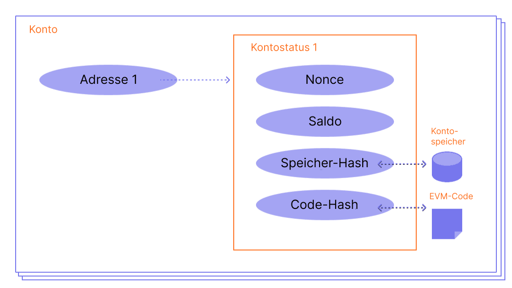

Ein [Ethereum](/)-Konto ist eine Entität mit einem Ether-Guthaben (ETH), die Nachrichten auf Ethereum senden kann. Konten können benutzergesteuert sein oder als Smart Contracts bereitgestellt werden.

## Voraussetzungen {#prerequisites}

Um Ihnen zu helfen, diese Seite besser zu verstehen, empfehlen wir Ihnen, zuerst unsere [Einführung in Ethereum](/developers/docs/intro-to-ethereum/) zu lesen.

## Kontotypen {#types-of-account}

Ethereum hat zwei Kontotypen:

- Extern verwaltetes Konto (Externally-owned account, EOA) – kontrolliert von jedem, der die Private-Keys besitzt
- Vertragskonto (Contract account) – ein im Netzwerk bereitgestellter Smart Contract, der durch Code gesteuert wird. Erfahren Sie mehr über [Smart Contracts](/developers/docs/smart-contracts/)

Beide Kontotypen haben die Fähigkeit:

- ETH und Token zu empfangen, zu halten und zu senden
- Mit bereitgestellten Smart Contracts zu interagieren

### Hauptunterschiede {#key-differences}

**Extern verwaltet**

- Die Erstellung eines Kontos kostet nichts
- Kann Transaktionen initiieren
- Transaktionen zwischen extern verwalteten Konten können nur ETH-/Token-Überweisungen sein
- Besteht aus einem kryptografischen Schlüsselpaar: Public- und Private-Keys, die die Kontoaktivitäten steuern

**Vertrag (Contract)**

- Die Erstellung eines Vertrags ist mit Kosten verbunden, da Sie Netzwerkspeicherplatz nutzen
- Kann Nachrichten nur als Reaktion auf den Empfang einer Transaktion senden
- Transaktionen von einem externen Konto an ein Vertragskonto können Code auslösen, der viele verschiedene Aktionen ausführen kann, wie z. B. die Überweisung von Token oder sogar die Erstellung eines neuen Vertrags
- Vertragskonten haben keine Private-Keys. Stattdessen werden sie durch die Logik des Smart-Contract-Codes gesteuert

## Ein Konto im Detail {#an-account-examined}

Ethereum-Konten haben vier Felder:

- `nonce` – Ein Zähler, der die Anzahl der von einem extern verwalteten Konto gesendeten Transaktionen oder die Anzahl der von einem Vertragskonto erstellten Verträge angibt. Für jedes Konto kann nur eine Transaktion mit einer bestimmten Nonce ausgeführt werden, was vor Replay-Angriffen schützt, bei denen signierte Transaktionen wiederholt gesendet und erneut ausgeführt werden.
- `balance` – Die Anzahl der Wei, die dieser Adresse gehören. Wei ist eine Stückelung von ETH und es gibt 1e+18 Wei pro ETH.
- `codeHash` – Dieser Hash bezieht sich auf den _Code_ eines Kontos auf der Ethereum Virtual Machine (EVM). In Vertragskonten sind Codefragmente einprogrammiert, die verschiedene Operationen ausführen können. Dieser EVM-Code wird ausgeführt, wenn das Konto einen Nachrichtenaufruf erhält. Er kann im Gegensatz zu den anderen Kontofeldern nicht geändert werden. Alle derartigen Codefragmente sind in der Zustandsdatenbank unter ihren entsprechenden Hashes zum späteren Abruf enthalten. Dieser Hash-Wert ist als codeHash bekannt. Bei extern verwalteten Konten ist das codeHash-Feld der Hash einer leeren Zeichenfolge.
- `storageRoot` – Manchmal auch als Speicher-Hash (Storage Hash) bezeichnet. Ein 256-Bit-Hash des Wurzelknotens eines [Merkle Patricia Trie](/developers/docs/data-structures-and-encoding/patricia-merkle-trie/), der den Speicherinhalt des Kontos codiert (eine Zuordnung zwischen 256-Bit-Ganzzahlwerten), codiert in den Trie als Zuordnung vom Keccak-256-Bit-Hash der 256-Bit-Ganzzahlschlüssel zu den RLP-codierten 256-Bit-Ganzzahlwerten. Dieser Trie codiert den Hash des Speicherinhalts dieses Kontos und ist standardmäßig leer.


_Diagramm adaptiert von [Ethereum EVM illustrated](https://takenobu-hs.github.io/downloads/ethereum_evm_illustrated.pdf)_

## Extern verwaltete Konten und Schlüsselpaare {#externally-owned-accounts-and-key-pairs}

Ein Konto besteht aus einem Paar kryptografischer Schlüssel: Public- und Private-Key. Sie helfen zu beweisen, dass eine Transaktion tatsächlich vom Absender signiert wurde, und verhindern Fälschungen. Ihr Private-Key ist das, was Sie zum Signieren von Transaktionen verwenden, er gewährt Ihnen also die Verwahrung der mit Ihrem Konto verbundenen Gelder. Sie halten nie wirklich Kryptowährung, Sie halten Private-Keys – die Gelder befinden sich immer auf Ethereums Ledger.

Dies hindert böswillige Akteure daran, gefälschte Transaktionen zu senden, da Sie den Absender einer Transaktion immer verifizieren können.

Wenn Alice Ether von ihrem eigenen Konto auf Bobs Konto senden möchte, muss Alice eine Transaktionsanfrage erstellen und diese zur Verifizierung an das Netzwerk senden. Ethereums Verwendung von Public-Key-Kryptografie stellt sicher, dass Alice beweisen kann, dass sie die Transaktionsanfrage ursprünglich initiiert hat. Ohne kryptografische Mechanismen könnte eine böswillige Angreiferin Eve einfach öffentlich eine Anfrage senden, die in etwa so aussieht: „Sende 5 ETH von Alices Konto an Eves Konto“, und niemand könnte verifizieren, dass sie nicht von Alice stammt.

## Kontoerstellung {#account-creation}

Wenn Sie ein Konto erstellen möchten, generieren die meisten Bibliotheken Ihnen einen zufälligen Private-Key.

Ein Private-Key besteht aus 64 Hex-Zeichen und kann mit einem Passwort verschlüsselt werden.

Beispiel:

`fffffffffffffffffffffffffffffffebaaedce6af48a03bbfd25e8cd036415f`

Der Public-Key wird aus dem Private-Key unter Verwendung des [Elliptic Curve Digital Signature Algorithm](https://wikipedia.org/wiki/Elliptic_Curve_Digital_Signature_Algorithm) generiert. Sie erhalten eine öffentliche Adresse für Ihr Konto, indem Sie die letzten 20 Bytes des Keccak-256-Hashes des Public-Keys nehmen und `0x` an den Anfang setzen.

Das bedeutet, dass ein extern verwaltetes Konto (EOA) eine 42-stellige Adresse hat (20-Byte-Segment, was 40 hexadezimalen Zeichen entspricht, plus das Präfix `0x`).

Beispiel:

`0x5e97870f263700f46aa00d967821199b9bc5a120`

Das folgende Beispiel zeigt, wie man ein Signatur-Tool namens [Clef](https://geth.ethereum.org/docs/tools/clef/introduction) verwendet, um ein neues Konto zu generieren. Clef ist ein Kontoverwaltungs- und Signatur-Tool, das mit der Ethereum-Anwendung [Geth](https://geth.ethereum.org) gebündelt ist. Der Befehl `clef newaccount` erstellt ein neues Schlüsselpaar und speichert es in einem verschlüsselten Keystore.

```
> clef newaccount --keystore <path>

Please enter a password for the new account to be created:
> <password>

------------
INFO [10-28|16:19:09.156] Your new key was generated       address=0x5e97870f263700f46aa00d967821199b9bc5a120
WARN [10-28|16:19:09.306] Please backup your key file      path=/home/user/go-ethereum/data/keystore/UTC--2022-10-28T15-19-08.000825927Z--5e97870f263700f46aa00d967821199b9bc5a120
WARN [10-28|16:19:09.306] Please remember your password!
Generated account 0x5e97870f263700f46aa00d967821199b9bc5a120
```

[Geth-Dokumentation](https://geth.ethereum.org/docs)

Es ist möglich, neue Public-Keys aus Ihrem Private-Key abzuleiten, aber Sie können keinen Private-Key aus Public-Keys ableiten. Es ist von entscheidender Bedeutung, Ihre Private-Keys sicher und, wie der Name schon sagt, **PRIVAT** zu halten.

Sie benötigen einen Private-Key, um Nachrichten und Transaktionen zu signieren, die eine Signatur ausgeben. Andere können dann die Signatur nehmen, um Ihren Public-Key abzuleiten und so den Autor der Nachricht zu beweisen. In Ihrer Anwendung können Sie eine JavaScript-Bibliothek verwenden, um Transaktionen an das Netzwerk zu senden.

## Vertragskonten {#contract-accounts}

Vertragskonten haben ebenfalls eine 42-stellige hexadezimale Adresse:

Beispiel:

`0x06012c8cf97bead5deae237070f9587f8e7a266d`

Die Vertragsadresse wird normalerweise vergeben, wenn ein Vertrag auf der Ethereum-Blockchain bereitgestellt wird. Die Adresse ergibt sich aus der Adresse des Erstellers und der Anzahl der von dieser Adresse gesendeten Transaktionen (der „Nonce“).

## Validator-Schlüssel {#validators-keys}

Es gibt auch eine andere Art von Schlüssel in Ethereum, die eingeführt wurde, als Ethereum vom Proof-of-Work- zum Proof-of-Stake-basierten Konsens wechselte. Dies sind „BLS“-Schlüssel und sie werden verwendet, um Validatoren zu identifizieren. Diese Schlüssel können effizient aggregiert werden, um die Bandbreite zu reduzieren, die das Netzwerk benötigt, um zu einem Konsens zu gelangen. Ohne diese Schlüsselaggregation wäre der Mindesteinsatz für einen Validator viel höher.

[Mehr zu Validator-Schlüsseln](/developers/docs/consensus-mechanisms/pos/keys/).

## Eine Anmerkung zu Wallets {#a-note-on-wallets}

Ein Konto ist kein Wallet. Ein Wallet ist eine Schnittstelle oder Anwendung, mit der Sie mit Ihrem Ethereum-Konto interagieren können, entweder einem extern verwalteten Konto oder einem Vertragskonto.

## Eine visuelle Demo {#a-visual-demo}

Sehen Sie sich an, wie Austin Sie durch Hash-Funktionen und Schlüsselpaare führt.

<YouTube id="QJ010l-pBpE" />

<YouTube id="9LtBDy67Tho" />

## Weiterführende Literatur {#further-reading}

- [Ethereum-Konten verstehen](https://info.etherscan.com/understanding-ethereum-accounts/) - etherscan

_Kennen Sie eine Community-Ressource, die Ihnen geholfen hat? Bearbeiten Sie diese Seite und fügen Sie sie hinzu!_

## Verwandte Themen {#related-topics}

- [Smart Contracts](/developers/docs/smart-contracts/)
- [Transaktionen](/developers/docs/transactions/)