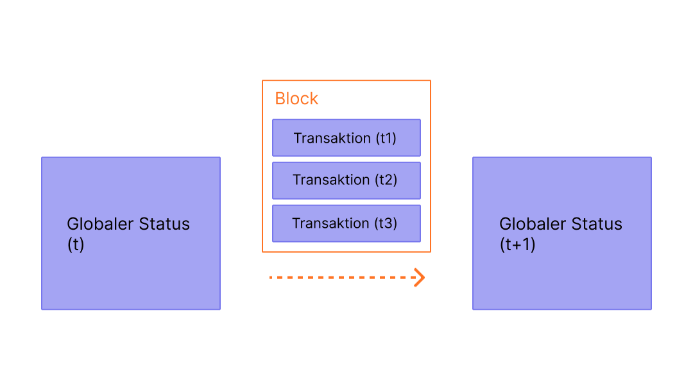

Blöcke sind Bündel von Transaktionen mit einem Hash des vorherigen Blocks in der Kette. Dies verbindet Blöcke miteinander (in einer Kette), da Hashes kryptografisch aus den Blockdaten abgeleitet werden. Dies verhindert Betrug, da eine einzige Änderung in einem beliebigen Block in der Historie alle folgenden Blöcke ungültig machen würde, da sich alle nachfolgenden Hashes ändern würden und jeder, der die Blockchain ausführt, dies bemerken würde.

## Voraussetzungen {#prerequisites}

Blöcke sind ein sehr anfängerfreundliches Thema. Damit Sie diese Seite jedoch besser verstehen, empfehlen wir Ihnen, zuerst [Konten](/developers/docs/accounts/), [Transaktionen](/developers/docs/transactions/) und unsere [Einführung in Ethereum](/developers/docs/intro-to-ethereum/) zu lesen.

## Warum Blöcke? {#why-blocks}

Um sicherzustellen, dass alle Teilnehmer im [Ethereum](/)-Netzwerk einen synchronisierten Zustand beibehalten und sich auf die genaue Historie der Transaktionen einigen, bündeln wir Transaktionen in Blöcke. Das bedeutet, dass Dutzende (oder Hunderte) von Transaktionen auf einmal festgeschrieben, vereinbart und synchronisiert werden.

_Diagramm adaptiert von [Ethereum EVM illustrated](https://takenobu-hs.github.io/downloads/ethereum_evm_illustrated.pdf)_

Indem wir die Festschreibungen (Commits) zeitlich verteilen, geben wir allen Netzwerk-Teilnehmern genügend Zeit, um zu einem Konsens zu gelangen: Auch wenn Transaktionsanfragen dutzende Male pro Sekunde auftreten, werden Blöcke auf Ethereum nur alle zwölf Sekunden erstellt und festgeschrieben.

## Wie Blöcke funktionieren {#how-blocks-work}

Um die Transaktionshistorie zu bewahren, sind Blöcke streng geordnet (jeder neu erstellte Block enthält einen Verweis auf seinen übergeordneten Block), und auch die Transaktionen innerhalb der Blöcke sind streng geordnet. Bis auf seltene Ausnahmen sind sich zu jedem Zeitpunkt alle Teilnehmer im Netzwerk über die genaue Anzahl und Historie der Blöcke einig und arbeiten daran, die aktuellen Live-Transaktionsanfragen in den nächsten Block zu bündeln.

Sobald ein Block von einem zufällig ausgewählten Validator im Netzwerk zusammengestellt wurde, wird er an den Rest des Netzwerks weitergeleitet; alle Blockchain-Knoten fügen diesen Block an das Ende ihrer Blockchain an, und ein neuer Validator wird ausgewählt, um den nächsten Block zu erstellen. Der genaue Prozess der Blockzusammenstellung und der Festschreibungs-/Konsensprozess wird derzeit durch Ethereums „Proof-of-Stake“-Protokoll spezifiziert.

## Proof-of-Stake-Protokoll {#proof-of-stake-protocol}

Proof-of-Stake bedeutet Folgendes:

- Validierende Blockchain-Knoten müssen 32 ETH in einen Einzahlungsvertrag als Sicherheit gegen schlechtes Verhalten einzahlen (staken). Dies hilft, das Netzwerk zu schützen, da nachweislich unehrliches Verhalten dazu führt, dass ein Teil oder der gesamte Einsatz zerstört wird.
- In jedem Slot (im Abstand von zwölf Sekunden) wird ein Validator zufällig als Block-Vorschlagender ausgewählt. Er bündelt Transaktionen, führt sie aus und bestimmt einen neuen „Zustand“. Er verpackt diese Informationen in einen Block und leitet ihn an andere Validatoren weiter.
- Andere Validatoren, die von dem neuen Block erfahren, führen die Transaktionen erneut aus, um sicherzustellen, dass sie mit der vorgeschlagenen Änderung des globalen Zustands einverstanden sind. Unter der Annahme, dass der Block gültig ist, fügen sie ihn ihrer eigenen Datenbank hinzu.
- Wenn ein Validator von zwei widersprüchlichen Blöcken für denselben Slot erfährt, verwendet er seinen Fork-Choice-Algorithmus, um denjenigen auszuwählen, der durch die meisten gestakten ETH unterstützt wird.

[Mehr über Proof-of-Stake](/developers/docs/consensus-mechanisms/pos)

## Was ist in einem Block? {#block-anatomy}

Ein Block enthält viele Informationen. Auf der höchsten Ebene enthält ein Block die folgenden Felder:

| Feld             | Beschreibung                                                  |
| :--------------- | :------------------------------------------------------------ |
| `slot`           | der Slot, zu dem der Block gehört                             |
| `proposer_index` | die ID des Validators, der den Block vorschlägt               |
| `parent_root`    | der Hash des vorhergehenden Blocks                            |
| `state_root`     | der Root-Hash des Zustandsobjekts                             |
| `body`           | ein Objekt, das mehrere Felder enthält, wie unten definiert   |

Der Block-`body` enthält selbst mehrere Felder:

| Feld                 | Beschreibung                                                                      |
| :------------------- | :-------------------------------------------------------------------------------- |
| `randao_reveal`      | ein Wert, der verwendet wird, um den nächsten Block-Vorschlagenden auszuwählen    |
| `eth1_data`          | Informationen über den Einzahlungsvertrag                                         |
| `graffiti`           | beliebige Daten, die zum Markieren von Blöcken verwendet werden                   |
| `proposer_slashings` | Liste der Validatoren, die einem Slashing unterzogen werden sollen                |
| `attester_slashings` | Liste der Bestätiger (Attester), die einem Slashing unterzogen werden sollen      |
| `attestations`       | Liste der Bestätigungen, die für vorherige Slots vorgenommen wurden               |
| `deposits`           | Liste der neuen Einzahlungen in den Einzahlungsvertrag                            |
| `voluntary_exits`    | Liste der Validatoren, die das Netzwerk verlassen                                 |
| `sync_aggregate`     | Teilmenge der Validatoren, die zur Bedienung von Light Clients verwendet werden   |
| `execution_payload`  | Transaktionen, die vom Ausführungs-Client übergeben wurden                        |

Das Feld `attestations` enthält eine Liste aller Bestätigungen im Block. Bestätigungen haben ihren eigenen Datentyp, der mehrere Datenbestandteile enthält. Jede Bestätigung enthält:

| Feld               | Beschreibung                                                              |
| :----------------- | :------------------------------------------------------------------------ |
| `aggregation_bits` | eine Liste, welche Validatoren an dieser Bestätigung teilgenommen haben   |
| `data`             | ein Container mit mehreren Unterfeldern                                   |
| `signature`        | aggregierte Signatur einer Gruppe von Validatoren für den `data`-Teil     |

Das Feld `data` in der `attestation` enthält Folgendes:

| Feld                | Beschreibung                                                              |
| :------------------ | :------------------------------------------------------------------------ |
| `slot`              | der Slot, auf den sich die Bestätigung bezieht                            |
| `index`             | Indizes für bestätigende Validatoren                                      |
| `beacon_block_root` | der Root-Hash des Beacon-Blocks, der als Kopf der Kette angesehen wird    |
| `source`            | der letzte gerechtfertigte (justified) Checkpoint                         |
| `target`            | der neueste Epochengrenzblock                                             |

Das Ausführen der Transaktionen im `execution_payload` aktualisiert den globalen Zustand. Alle Anwendungen führen die Transaktionen im `execution_payload` erneut aus, um sicherzustellen, dass der neue Zustand mit dem im Feld `state_root` des neuen Blocks übereinstimmt. Auf diese Weise können Anwendungen erkennen, dass ein neuer Block gültig und sicher ist, um ihn ihrer Blockchain hinzuzufügen. Das `execution payload` selbst ist ein Objekt mit mehreren Feldern. Es gibt auch einen `execution_payload_header`, der wichtige zusammenfassende Informationen über die Ausführungsdaten enthält. Diese Datenstrukturen sind wie folgt organisiert:

Der `execution_payload_header` enthält die folgenden Felder:

| Feld                | Beschreibung                                                                        |
| :------------------ | :---------------------------------------------------------------------------------- |
| `parent_hash`       | Hash des übergeordneten Blocks                                                      |
| `fee_recipient`     | Kontoadresse für die Zahlung von Transaktionsgebühren                               |
| `state_root`        | Root-Hash für den globalen Zustand nach Anwendung der Änderungen in diesem Block    |
| `receipts_root`     | Hash des Transaktionsbeleg-Tries                                                    |
| `logs_bloom`        | Datenstruktur, die Ereignisprotokolle enthält                                       |
| `prev_randao`       | Wert, der bei der zufälligen Auswahl von Validatoren verwendet wird                 |
| `block_number`      | die Nummer des aktuellen Blocks                                                     |
| `gas_limit`         | maximal zulässiges Gaslimit in diesem Block                                         |
| `gas_used`          | die tatsächliche Menge an Gas, die in diesem Block verbraucht wurde                 |
| `timestamp`         | die Blockzeit                                                                       |
| `extra_data`        | beliebige zusätzliche Daten als rohe Bytes                                          |
| `base_fee_per_gas`  | der Wert der Grundgebühr                                                            |
| `block_hash`        | Hash des Ausführungsblocks                                                          |
| `transactions_root` | Root-Hash der Transaktionen im Payload                                              |
| `withdrawal_root`   | Root-Hash der Abhebungen im Payload                                                 |

Das `execution_payload` selbst enthält Folgendes (beachten Sie, dass dies identisch mit dem Header ist, außer dass es anstelle des Root-Hashs der Transaktionen die tatsächliche Liste der Transaktionen und Abhebungsinformationen enthält):

| Feld               | Beschreibung                                                                        |
| :----------------- | :---------------------------------------------------------------------------------- |
| `parent_hash`      | Hash des übergeordneten Blocks                                                      |
| `fee_recipient`    | Kontoadresse für die Zahlung von Transaktionsgebühren                               |
| `state_root`       | Root-Hash für den globalen Zustand nach Anwendung der Änderungen in diesem Block    |
| `receipts_root`    | Hash des Transaktionsbeleg-Tries                                                    |
| `logs_bloom`       | Datenstruktur, die Ereignisprotokolle enthält                                       |
| `prev_randao`      | Wert, der bei der zufälligen Auswahl von Validatoren verwendet wird                 |
| `block_number`     | die Nummer des aktuellen Blocks                                                     |
| `gas_limit`        | maximal zulässiges Gaslimit in diesem Block                                         |
| `gas_used`         | die tatsächliche Menge an Gas, die in diesem Block verbraucht wurde                 |
| `timestamp`        | die Blockzeit                                                                       |
| `extra_data`       | beliebige zusätzliche Daten als rohe Bytes                                          |
| `base_fee_per_gas` | der Wert der Grundgebühr                                                            |
| `block_hash`       | Hash des Ausführungsblocks                                                          |
| `transactions`     | Liste der auszuführenden Transaktionen                                              |
| `withdrawals`      | Liste der Abhebungsobjekte                                                          |

Die Liste `withdrawals` enthält `withdrawal`-Objekte, die wie folgt strukturiert sind:

| Feld             | Beschreibung                       |
| :--------------- | :--------------------------------- |
| `address`        | Kontoadresse, die abgehoben hat    |
| `amount`         | Abhebungsbetrag                    |
| `index`          | Indexwert der Abhebung             |
| `validatorIndex` | Indexwert des Validators           |

## Blockzeit {#block-time}

Die Blockzeit bezieht sich auf die Zeit, die Blöcke voneinander trennt. In Ethereum ist die Zeit in Einheiten von zwölf Sekunden unterteilt, die „Slots“ genannt werden. In jedem Slot wird ein einzelner Validator ausgewählt, um einen Block vorzuschlagen. Unter der Annahme, dass alle Validatoren online und voll funktionsfähig sind, wird es in jedem Slot einen Block geben, was bedeutet, dass die Blockzeit 12 Sekunden beträgt. Gelegentlich können Validatoren jedoch offline sein, wenn sie aufgerufen werden, einen Block vorzuschlagen, was bedeutet, dass Slots manchmal leer bleiben können.

Diese Implementierung unterscheidet sich von Proof-of-Work-basierten Systemen, bei denen die Blockzeiten probabilistisch sind und durch die Ziel-Mining-Schwierigkeit des Protokolls abgestimmt werden. Ethereums [durchschnittliche Blockzeit](https://etherscan.io/chart/blocktime) ist ein perfektes Beispiel dafür, wobei der Übergang von Proof-of-Work zu Proof-of-Stake anhand der Konsistenz der neuen 12-Sekunden-Blockzeit klar abgeleitet werden kann.

## Blockgröße {#block-size}

Ein letzter wichtiger Hinweis ist, dass Blöcke selbst in ihrer Größe begrenzt sind. Jeder Block hat eine Zielgröße von 30 Millionen Gas, aber die Größe der Blöcke wird entsprechend den Netzwerkanforderungen steigen oder fallen, bis zum Blocklimit von 60 Millionen Gas (2x Zielblockgröße). Das Block-Gaslimit kann um einen Faktor von 1/1024 gegenüber dem Gaslimit des vorherigen Blocks nach oben oder unten angepasst werden. Infolgedessen können Validatoren das Block-Gaslimit durch Konsens ändern. Die Gesamtmenge an Gas, die von allen Transaktionen im Block verbraucht wird, muss geringer sein als das Block-Gaslimit. Dies ist wichtig, da es sicherstellt, dass Blöcke nicht beliebig groß sein können. Wenn Blöcke beliebig groß sein könnten, würden weniger leistungsfähige vollständige Blockchain-Knoten (Full Nodes) aufgrund von Platz- und Geschwindigkeitsanforderungen allmählich nicht mehr mit dem Netzwerk mithalten können. Je größer der Block, desto größer ist die Rechenleistung, die erforderlich ist, um ihn rechtzeitig für den nächsten Slot zu verarbeiten. Dies ist eine zentralisierende Kraft, der durch die Begrenzung der Blockgrößen entgegengewirkt wird.

## Weiterführende Literatur {#further-reading}

_Kennen Sie eine Community-Ressource, die Ihnen geholfen hat? Bearbeiten Sie diese Seite und fügen Sie sie hinzu!_

## Verwandte Themen {#related-topics}

- [Transaktionen](/developers/docs/transactions/)
- [Gas](/developers/docs/gas/)
- [Proof-of-Stake](/developers/docs/consensus-mechanisms/pos)