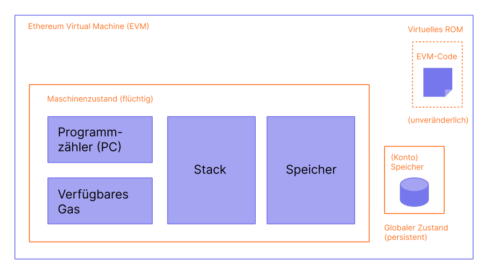
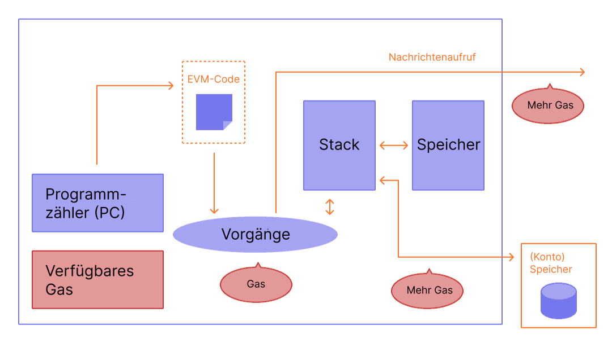

Die Ethereum Virtual Machine (EVM) ist eine dezentralisierte virtuelle Umgebung, die Code konsistent und sicher über alle [Ethereum](/)-Blockchain-Knoten hinweg ausführt. Blockchain-Knoten führen die EVM aus, um Smart Contracts auszuführen, und verwenden "[Gas](/developers/docs/gas/)", um den für [Operationen](/developers/docs/evm/opcodes/) erforderlichen Rechenaufwand zu messen, was eine effiziente Ressourcenzuweisung und Netzwerksicherheit gewährleistet.

## Voraussetzungen {#prerequisites}

Ein grundlegendes Verständnis gängiger Begriffe der Informatik wie [Bytes](https://wikipedia.org/wiki/Byte), [Speicher](https://wikipedia.org/wiki/Computer_memory) und [Stack](<https://wikipedia.org/wiki/Stack_(abstract_data_type)>) ist notwendig, um die EVM zu verstehen. Es wäre auch hilfreich, mit Konzepten der Kryptografie/Blockchain wie [Hash-Funktionen](https://wikipedia.org/wiki/Cryptographic_hash_function) und dem [Merkle-Baum](https://wikipedia.org/wiki/Merkle_tree) vertraut zu sein.

## Vom Ledger zum Zustandsautomaten {#from-ledger-to-state-machine}

Die Analogie eines „verteilten Ledgers“ (distributed ledger) wird oft verwendet, um Blockchains wie Bitcoin zu beschreiben, die eine dezentralisierte Währung mithilfe grundlegender Werkzeuge der Kryptografie ermöglichen. Der Ledger führt eine Aufzeichnung der Aktivitäten, die sich an eine Reihe von Regeln halten muss, welche bestimmen, was jemand tun darf und was nicht, um den Ledger zu ändern. Zum Beispiel kann eine Bitcoin-Adresse nicht mehr Bitcoin ausgeben, als sie zuvor empfangen hat. Diese Regeln untermauern alle Transaktionen auf Bitcoin und vielen anderen Blockchains.

Während Ethereum seine eigene native Kryptowährung (Ether) hat, die fast genau denselben intuitiven Regeln folgt, ermöglicht es auch eine viel leistungsfähigere Funktion: [Smart Contracts](/developers/docs/smart-contracts/). Für diese komplexere Funktion ist eine ausgefeiltere Analogie erforderlich. Anstelle eines verteilten Ledgers ist Ethereum ein verteilter [Zustandsautomat](https://wikipedia.org/wiki/Finite-state_machine) (State Machine). Der Zustand von Ethereum ist eine große Datenstruktur, die nicht nur alle Konten und Salden enthält, sondern auch einen _Maschinenzustand_, der sich von Block zu Block gemäß einem vordefinierten Regelwerk ändern und beliebigen Maschinencode ausführen kann. Die spezifischen Regeln für die Änderung des Zustands von Block zu Block werden durch die EVM definiert.


_Diagramm adaptiert von [Ethereum EVM illustrated](https://takenobu-hs.github.io/downloads/ethereum_evm_illustrated.pdf)_

## Die Ethereum-Zustandsübergangsfunktion {#the-ethereum-state-transition-function}

Die EVM verhält sich wie eine mathematische Funktion: Bei einer Eingabe erzeugt sie eine deterministische Ausgabe. Es ist daher sehr hilfreich, Ethereum formaler als eine **Zustandsübergangsfunktion** zu beschreiben:

```
Y(S, T)= S'
```

Gegeben ein alter gültiger Zustand `(S)` und eine neue Menge gültiger Transaktionen `(T)`, erzeugt die Ethereum-Zustandsübergangsfunktion `Y(S, T)` einen neuen gültigen Ausgabezustand `S'`

### Zustand {#state}

Im Kontext von Ethereum ist der Zustand eine enorme Datenstruktur, die als [modifizierter Merkle Patricia Trie](/developers/docs/data-structures-and-encoding/patricia-merkle-trie/) bezeichnet wird. Diese hält alle [Konten](/developers/docs/accounts/) durch Hashes verknüpft und reduzierbar auf einen einzigen Root-Hash, der auf der Blockchain gespeichert ist.

### Transaktionen {#transactions}

Transaktionen sind kryptografisch signierte Anweisungen von Konten. Es gibt zwei Arten von Transaktionen: solche, die zu Nachrichtenaufrufen (Message Calls) führen, und solche, die zur Erstellung von Verträgen (Contract Creation) führen.

Die Erstellung eines Vertrags führt zur Erstellung eines neuen Vertragskontos, das den kompilierten Bytecode des [Smart Contracts](/developers/docs/smart-contracts/anatomy/) enthält. Wann immer ein anderes Konto einen Nachrichtenaufruf an diesen Vertrag tätigt, führt es dessen Bytecode aus.

## EVM-Anweisungen {#evm-instructions}

Die EVM wird als [Stack-Maschine](https://wikipedia.org/wiki/Stack_machine) mit einer Tiefe von 1024 Elementen ausgeführt. Jedes Element ist ein 256-Bit-Wort, was für die einfache Verwendung mit 256-Bit-Kryptografie (wie Keccak-256-Hashes oder secp256k1-Signaturen) gewählt wurde.

Während der Ausführung unterhält die EVM einen flüchtigen _Speicher_ (als wortadressiertes Byte-Array), der zwischen Transaktionen nicht bestehen bleibt.

### Transient Storage (Flüchtiger Speicher)

Transient Storage ist ein schlüsselwertbasierter Speicher pro Transaktion, auf den über die Opcodes `TSTORE` und `TLOAD` zugegriffen wird. Er bleibt über alle internen Aufrufe während derselben Transaktion hinweg bestehen, wird aber am Ende der Transaktion gelöscht. Im Gegensatz zum Arbeitsspeicher (Memory) wird Transient Storage als Teil des EVM-Zustands und nicht als Teil des Ausführungsrahmens modelliert, wird jedoch nicht in den globalen Zustand übernommen. Transient Storage ermöglicht eine gas-effiziente, temporäre gemeinsame Nutzung von Zuständen über interne Aufrufe hinweg während einer Transaktion.

### Storage

Verträge enthalten einen Merkle Patricia _Storage_-Trie (als wortadressierbares Wort-Array), der mit dem betreffenden Konto verknüpft und Teil des globalen Zustands ist. Dieser persistente Speicher unterscheidet sich vom Transient Storage, der nur für die Dauer einer einzelnen Transaktion verfügbar ist und nicht Teil des persistenten Storage-Tries des Kontos ist.

### Opcodes

Kompilierter Smart-Contract-Bytecode wird als eine Reihe von EVM-[Opcodes](/developers/docs/evm/opcodes) ausgeführt, die Standard-Stack-Operationen wie `XOR`, `AND`, `ADD`, `SUB` usw. durchführen. Die EVM implementiert auch eine Reihe von Blockchain-spezifischen Stack-Operationen, wie `ADDRESS`, `BALANCE`, `BLOCKHASH` usw. Der Opcode-Satz enthält auch `TSTORE` und `TLOAD`, die Zugriff auf den Transient Storage bieten.


_Diagramme adaptiert von [Ethereum EVM illustrated](https://takenobu-hs.github.io/downloads/ethereum_evm_illustrated.pdf)_

## EVM-Implementierungen {#evm-implementations}

Alle Implementierungen der EVM müssen sich an die im Ethereum Yellowpaper beschriebene Spezifikation halten.

In der zehnjährigen Geschichte von Ethereum wurde die EVM mehrfach überarbeitet, und es gibt mehrere Implementierungen der EVM in verschiedenen Programmiersprachen.

[Ethereum-Ausführungs-Clients](/developers/docs/nodes-and-clients/#execution-clients) enthalten eine EVM-Implementierung. Darüber hinaus gibt es mehrere eigenständige Implementierungen, darunter:

- [Py-EVM](https://github.com/ethereum/py-evm) – _Python_
- [evmone](https://github.com/ethereum/evmone) – _C++_
- [ethereumjs-vm](https://github.com/ethereumjs/ethereumjs-vm) – _JavaScript_
- [revm](https://github.com/bluealloy/revm) – _Rust_

## Weiterführende Literatur {#further-reading}

- [Ethereum Yellowpaper](https://ethereum.github.io/yellowpaper/paper.pdf)
- [Jellopaper aka KEVM: Semantics of EVM in K](https://jellopaper.org/)
- [The Beigepaper](https://github.com/chronaeon/beigepaper)
- [Ethereum Virtual Machine Opcodes](https://www.ethervm.io/)
- [Ethereum Virtual Machine Opcodes Interactive Reference](https://www.evm.codes/)
- [Eine kurze Einführung in der Solidity-Dokumentation](https://docs.soliditylang.org/en/latest/introduction-to-smart-contracts.html#index-6)
- [Mastering Ethereum – The Ethereum Virtual Machine](https://github.com/ethereumbook/ethereumbook/blob/openedition/13evm.asciidoc)

## Verwandte Themen {#related-topics}

- [Gas](/developers/docs/gas/)

## Tutorials: Ethereum Virtual Machine (EVM) / Opcodes auf Ethereum {#tutorials}

- [Die EVM-Spezifikationen des Yellowpapers verstehen](/developers/tutorials/yellow-paper-evm/) _– Ein geführter Durchgang durch die formale EVM-Spezifikation aus dem Ethereum Yellowpaper._
- [Reverse Engineering eines Vertrags](/developers/tutorials/reverse-engineering-a-contract/) _– Wie man einen kompilierten Smart Contract mithilfe von EVM-Opcodes zurückentwickelt._