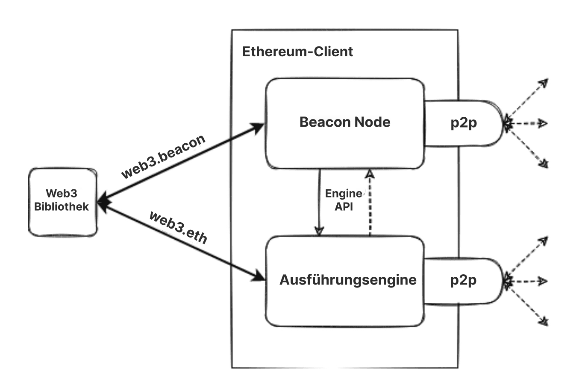

Ethereum ist ein verteiltes Netzwerk von Computern (bekannt als Nodes), auf denen Software ausgeführt wird, um Blöcke und Transaktionsdaten zu verifizieren. Die Software muss auf Ihrem Computer ausgeführt werden, um ihn in einen Ethereum-Knoten zu verwandeln. Für die Bildung eines Knotens sind zwei separate Softwarekomponenten (die sogenannten „Clients“) erforderlich.

## Voraussetzungen {#prerequisites}

Sie sollten das Konzept eines Peer-to-Peer-Netzwerks und die [Grundlagen der EVM](/developers/docs/evm/) verstehen, bevor Sie tiefer eintauchen und Ihre eigene Instanz eines Ethereum-Clients starten. Lesen Sie unsere [Einführung in Ethereum](/developers/docs/intro-to-ethereum/).

Wenn Ihnen das Thema Nodes neu ist, empfehlen wir Ihnen, zunächst unsere benutzerfreundliche Einführung zum [Betreiben eines Ethereum-Nodes](/run-a-node) zu lesen.

## Was sind Nodes und Clients? {#what-are-nodes-and-clients}

Ein „Node“ ist jede Instanz von Ethereum-Client-Software, die mit anderen Computern verbunden ist, auf denen ebenfalls Ethereum-Software ausgeführt wird und so ein Netzwerk bildet. Ein Client ist eine Implementierung von Ethereum, die Daten entsprechend der Protokollregeln verifiziert und das Netzwerk sicher hält. Ein Knoten muss zwei Clients ausführen: einen Konsens- und einen Ausführungsclient.

- Der Ausführungsclient (auch als Execution Engine, EL-Client oder früher Eth1-Client bekannt) empfängt neue Transaktionen, die im Netzwerk übertragen werden, führt sie im EVM aus und verwaltet den aktuellen Zustand und die Datenbank aller aktuellen Ethereum-Daten.
- Der Konsensclient (auch als Beacon-Node, CL-Client oder früher Eth2-Client bekannt) implementiert den Proof-of-Stake-Konsensalgorithmus, der es dem Netzwerk ermöglicht, basierend auf validierten Daten des Ausführungsclients eine Einigung zu erzielen. Darüber hinaus gibt es einen dritten Teil der Software, den so genannten „Validator“, der dem Konsensclient hinzugefügt werden kann und es einem Knoten ermöglicht, sich an der Sicherung des Netzwerks zu beteiligen.

Diese Clients arbeiten zusammen, um den aktuellen Stand der Ethereum Chain zu verfolgen und den Nutzern die Interaktion mit dem Ethereum-Netzwerk zu ermöglichen. Das modulare Design, bei dem mehrere Softwarekomponenten zusammenarbeiten, wird als [eingekapselte Komplexität](https://vitalik.eth.limo/general/2022/02/28/complexity.html) bezeichnet. Dieser Ansatz erleichterte die nahtlose Ausführung [der Zusammenführung](/roadmap/merge), macht die Wartung und Entwicklung von Client-Software einfacher und ermöglicht die Wiederverwendung einzelner Clients, beispielsweise im [Layer-2-Ökosystem](/layer-2/).

 Vereinfachtes Diagramm eines gekoppelten Ausführungs- und Konsensclients.

### Client-Diversität {#client-diversity}

Sowohl [Ausführungsclients](/developers/docs/nodes-and-clients/#execution-clients) als auch [Konsensclients](/developers/docs/nodes-and-clients/#consensus-clients) existieren in einer Vielzahl von Programmiersprachen, die von verschiedenen Teams entwickelt wurden.

Wenn mehrere Client-Implementierungen vorhanden sind, kann das Netzwerk gestärkt werden, indem die Abhängigkeit von einer einzigen Codebasis verringert wird. Das ideale Ziel besteht darin, Vielfalt zu erreichen, ohne dass ein einziger Client das Netzwerk dominiert, um somit potenzielle Einzelstellen von Fehlerquellen zu eliminieren. Die Vielfalt der Sprachen lädt auch eine breitere Entwicklergemeinschaft ein und ermöglicht es ihnen, Integrationen in ihrer bevorzugten Sprache zu erstellen.

Erfahren Sie mehr über [Client-Vielfalt](/developers/docs/nodes-and-clients/client-diversity/).

Diese Implementierungen haben gemeinsam, dass sie alle einer einzigen Spezifikation folgen. Spezifikationen legen fest, wie das Ethereum-Netzwerk und die Blockchain funktionieren. Jedes technische Detail ist definiert, und die Spezifikationen können wie folgt gefunden werden:

- Ursprünglich wurde das [Ethereum Yellow Paper](https://ethereum.github.io/yellowpaper/paper.pdf) erstellt
- [Ausführungsspezifikationen](https://github.com/ethereum/execution-specs/)
- [Konsensspezifikationen](https://github.com/ethereum/consensus-specs)
- [EIPs](https://eips.ethereum.org/), die bei verschiedenen [Netzwerk-Upgrades](/history/) implementiert wurden

### Verfolgung von Knoten im Netzwerk {#network-overview}

Es gibt mehrere Tracker, die einen Echtzeit-Überblick über die Knoten im Ethereum-Netzwerk bieten. Beachten Sie, dass diese Crawler aufgrund der Natur dezentraler Netzwerke nur einen begrenzten Überblick über das Netzwerk bieten können und möglicherweise unterschiedliche Ergebnisse melden.

- [Karte der Knotenpunkte](https://etherscan.io/nodetracker) von Etherscan
- [Ethernodes](https://ethernodes.org/) von Bitfly
- [Nodewatch](https://www.nodewatch.io/) von Chainsafe, Crawler für Konsensknoten
- [Monitoreth](https://monitoreth.io/) – von MigaLabs, ein Netzwerküberwachungstool für verteilte Netzwerke

## Node-Typen {#node-types}

Wenn Sie [Ihren eigenen Knoten betreiben möchten](/developers/docs/nodes-and-clients/run-a-node/), sollten Sie verstehen, dass es verschiedene Arten von Knoten gibt, die Daten unterschiedlich konsumieren. Die Clients können drei verschiedene Arten von Knoten ausführen: leichte, vollständige und Archivknoten. Es gibt auch Optionen für verschiedene Synchronisierungsstrategien, die eine schnellere Synchronisierungszeit ermöglichen. Die Synchronisierung bezieht sich darauf, wie schnell sie die aktuellsten Informationen über Ethereums Zustand erhalten kann.

### Vollständige Knoten {#full-node}

Vollständige Knoten führen eine Block-für-Block-Validierung der Blockchain durch, einschließlich des Herunterladens und Verifizierens des Block-Inhalts und der Statusdaten für jeden Block. Es gibt verschiedene Klassen von vollständigen Knoten – einige beginnen mit dem Genesis-Block und verifizieren jeden einzelnen Block in der gesamten Geschichte der Blockchain. Andere beginnen ihre Verifizierung bei einem neueren Block, den sie für gültig halten (z. B. Geths „Snap Sync“). Unabhängig davon, wo die Verifizierung beginnt, behalten vollständige Knoten nur eine lokale Kopie relativ aktueller Daten (in der Regel die jüngsten 128 Blöcke), so dass ältere Daten gelöscht werden können, um Speicherplatz zu sparen. Ältere Daten können wiederhergestellt werden, wenn sie benötigt werden.

- Speichert die vollständigen Blockchain-Daten (obwohl diese regelmäßig „geprunt“ werden, so dass ein vollständiger Knoten nicht alle Zustandsdaten bis zurück zur Genesis speichert)
- Beteiligt sich an der Blockprüfung, überprüft alle Blöcke und Zustände.
- Alle Status können entweder aus dem lokalen Speicher abgerufen oder von einem Full Node aus „Snapshots“ neu generiert werden.
- Bedient das Netzwerk und liefert Daten auf Anfrage.

### Archivierungsnode {#archive-node}

Archivierungsnodes sind Full Nodes, die jeden Block seit Genesis verifizieren und niemals irgendwelche heruntergeladenen Daten löschen.

- Speichert alles im Full Node und baut zusätzlich ein Archiv von vergangenen Zuständen auf. Sie werden wird benötigt, wenn Sie z. B. einen Kontostand im Block #4.000.000 abfragen oder einfach und zuverlässig Ihre eigenen Transaktionen testen möchten, ohne sie mithilfe von Tracing zu schürfen.
- Diese Daten werden in Einheiten von Terabytes dargestellt, was die Archivierungsknoten für den Durchschnittsnutzer weniger attraktiv macht, jedoch für Dienste wie Blockexplorer, Wallet-Anbieter und Chain-Analytics nützlich sein kann.

Das Synchronisieren von Clients in jedem anderen Modus als dem Archiv führt zu reduzierten (pruned) Blockchain-Daten. Das bedeutet, es gibt kein Archiv mit allen vergangenen Zuständen, der vollständige Node ist jedoch in der Lage, diese bei Bedarf zu erstellen.

Erfahren Sie mehr über [Archivierungsnodes](/developers/docs/nodes-and-clients/archive-nodes).

### Leichte Nodes {#light-node}

Anstatt jeden Block herunterzuladen, laden Light Nodes nur Block-Header herunter. Diese Header enthalten zusammenfassende Informationen über den Inhalt der Blöcke. Alle anderen Informationen, die der leichte Node benötigt, werden von einem Full Node angefordert. Der leichte Node kann dann die empfangenen Daten unabhängig mit den Zustandswurzeln in den Block-Headern abgleichen. Leichte Nodes ermöglichen es Nutzern, am Ethereum-Netzwerk teilzunehmen, ohne die leistungsstarke Hardware oder hohe Bandbreite zu benötigen, die für den Betrieb von Full Nodes erforderlich sind. Irgendwann könnten leichte Nodes auf Mobiltelefonen oder eingebetteten Geräten laufen. Leichte Nodes nehmen nicht am Konsens teil (d.h. sie können nicht minen/validieren), sie können jedoch auf die Ethereum-Blockchain mit denselben Funktionen und Sicherheitsgarantien zugreifen wie ein Full Node.

Leichte Clients sind ein Bereich, in dem Ethereum aktiv entwickelt wird. Es wird erwartet, dass wir bald neue leichte Clients für die Konsens- und Ausführungsebene entwickeln werden. Es gibt potenziell auch Wege, leichte Client-Daten über das [Gossip-Netzwerk](https://www.ethportal.net/) bereitzustellen. Dies ist vorteilhaft, da das Gossip-Netzwerk ein Netzwerk von leichten Nodes unterstützen könnte, ohne dass Full Nodes zur Bedienung von Anfragen erforderlich sind.

Ethereum unterstützt noch keine große Population von leichten Nodes, jedoch ist die Unterstützung von leichten Nodes ein Bereich, der sich in naher Zukunft voraussichtlich schnell entwickeln wird. Insbesondere Clients wie [Nimbus](https://nimbus.team/), [Helios](https://github.com/a16z/helios) und [LodeStar](https://lodestar.chainsafe.io/) sind derzeit stark auf leichte Nodes ausgerichtet.

## Warum sollte ich einen Ethereum-Node betreiben? {#why-should-i-run-an-ethereum-node}

Der Betrieb eines eigenen Knotens ermöglicht es Ihnen, Ethereum auf private, autarke und vertrauenswürdige Weise zu nutzen und gleichzeitig das Netz zu unterstützen, da es so robuster und dezentraler wird.

### Ihre Vorteile {#benefits-to-you}

Der Betrieb eines eigenen Knotens erlaubt es Ihnen, Ethereum auf private, autarke und vertrauenswürdige Weise zu nutzen. Sie müssen dem Netzwerk nicht vertrauen, da Sie die Daten mit Ihrem Client selbst überprüfen können. „Nicht vertrauen, überprüfen“ ist ein beliebtes Mantra der Blockchain.

- Ihr Node überprüft alle Transaktionen und Blöcke selbstständig anhand der Konsensregeln. Das bedeutet, dass Sie sich nicht auf andere Nodes im Netzwerk verlassen oder ihnen vollständig vertrauen müssen.
- Sie können ein Ethereum-Wallet mit Ihrem eigenen Knoten verwenden. Sie können dApps sicherer und privater nutzen, da Sie Ihre Adressen und Guthaben nicht an Vermittler weitergeben müssen. Alles kann mit Ihrem eigenen Client überprüft werden. [MetaMask](https://metamask.io), [Frame](https://frame.sh/) und [viele andere Wallets](/wallets/find-wallet/) bieten einen RPC-Import, der es ihnen ermöglicht, Ihren Node zu nutzen.
- Sie können andere Dienste betreiben und selbst hosten, die auf Daten von Ethereum angewiesen sind. Das kann zum Beispiel ein Beacon-Chain-Validator, Software wie Layer 2, Infrastruktur, Block-Explorer, Zahlungsprozessoren usw. sein.
- Sie können Ihre eigenen benutzerdefinierten [RPC-Endpunkte](/developers/docs/apis/json-rpc/) bereitstellen. Sie könnten diese Endpunkte sogar öffentlich anbieten, um der Community zu helfen, große zentrale Anbieter zu vermeiden.
- Sie können sich mit Ihrem Knoten über **Interprozesskommunikation (IPC)** verbinden oder den Knoten umschreiben, um Ihr Programm als Plugin zu laden. Dies garantiert eine niedrige Latenzzeit, was sehr hilfreich ist, z. B. bei der Verarbeitung großer Datenmengen mit web3-Bibliotheken oder wenn Sie Ihre Transaktionen so schnell wie möglich ersetzen müssen (z. B. Frontrunning).
- Sie können ETH direkt einsetzen, um das Netzwerk zu sichern und Prämien zu verdienen. Siehe [Solo-Staking](/staking/solo/) für den Einstieg.

### Vorteile des Netzwerks {#network-benefits}

Eine Vielzahl von Nodes ist wichtig für die Gesundheit, Sicherheit und operative Belastbarkeit von Ethereum.

- Full Nodes setzen die Konsensregeln durch, sodass sie nicht dazu verleitet werden können, Blöcke zu akzeptieren, die nicht den Regeln entsprechen. Dies sorgt für zusätzliche Sicherheit im Netzwerk, denn wenn alle Knoten leichte Nodes wären, die keine vollständige Verifizierung durchführen, könnten Validatoren das Netzwerk angreifen.
- Im Falle eines Angriffs, der die kryptoökonomischen Verteidigungsmechanismen von [Proof-of-Stake](/developers/docs/consensus-mechanisms/pos/#what-is-pos) überwindet, kann eine „soziale Wiederherstellung“ durch Full Nodes erfolgen, die sich dafür entscheiden, der „ehrlichen“ Chain zu folgen.
- Mehr Knoten im Netzwerk führen zu einem vielfältigeren und robusteren Netzwerk, dem ultimativen Ziel der Dezentralisierung, das ein zensurresistentes und zuverlässiges System ermöglicht.
- Full Nodes bieten den Zugang zu Blockchain-Daten für leichte Clients, die darauf angewiesen sind. Light Nodes speichern nicht die gesamte Blockchain, sondern verifizieren die Daten über die [Zustandswurzeln in den Block-Headern](/developers/docs/blocks/#block-anatomy). Sie können bei Bedarf weitere Informationen von Full Nodes anfordern.

Wenn Sie einen Full Node betreiben, profitiert das gesamte Ethereum-Netzwerk davon, auch wenn Sie keinen Validator betreiben.

## Betreiben eines eigenen Nodes {#running-your-own-node}

Haben Sie Interesse, Ihren eigenen Ethereum-Client zu betreiben?

Eine anfängerfreundliche Einführung finden Sie auf unserer Seite [Betreiben eines Knotens](/run-a-node).

Wenn Sie eher ein technisch erfahrener Benutzer sind, finden Sie hier weitere Details und Optionen, wie Sie [Ihren eigenen Knoten einrichten können](/developers/docs/nodes-and-clients/run-a-node/).

## Alternativen {#alternatives}

Die Einrichtung eines eigenen Knotens kann Sie Zeit und Ressourcen kosten, aber Sie müssen nicht immer eine eigene Instanz betreiben. In diesem Fall können Sie sich an einen externen API-Anbieter wenden. Einen Überblick zur Verwendung dieser Dienste finden Sie unter [Nodes als Dienstleistung](/developers/docs/nodes-and-clients/nodes-as-a-service/).

Wenn jemand in Ihrer Community einen Ethereum-Knoten mit öffentlichen APIs betreiben, können Sie Ihre Wallet in einen Community-Knoten über Custom RPC einbinden, um Ihre Privatsphäre besser zu schützen als bei der zufälligen Auswahl eines vertrauenswürdigen Dritten.

Wenn Sie andererseits einen Client betreiben, können Sie ihn mit Ihren Freunden teilen, die eventuell Bedarf haben.

## Ausführende Clients {#execution-clients}

Die Ethereum-Community unterhält mehrere quelloffene Ausführungsclients (früher als „Eth1-Clients“ oder einfach „Ethereum-Clients“ bezeichnet), die von verschiedenen Teams in unterschiedlichen Programmiersprachen entwickelt wurden. Dadurch wird das Netz stärker und [vielfältiger](/developers/docs/nodes-and-clients/client-diversity/). Das ideale Ziel ist es, Vielfalt zu erreichen, ohne dass ein Client dominiert, um jede Art von einzelnen Ausfallpunkten zu reduzieren.

Diese Tabelle gibt einen Überblick über die verschiedenen Clients. Sie alle bestehen [Client-Tests](https://github.com/ethereum/tests) und werden aktiv gewartet, um mit Netzwerk-Upgrades auf dem neuesten Stand zu bleiben.

| Client                                                                   | Sprache    | Betriebssystem        | Netzwerke                 | Synchronisationsstrategien                                                          | Zustandsreduzierung |
| ------------------------------------------------------------------------ | ---------- | --------------------- | ------------------------- | ----------------------------------------------------------------------------------- | ------------------- |
| [Geth](https://geth.ethereum.org/)                                       | Go         | Linux, Windows, MacOS | Mainnet, Sepolia, Holesky | [Momentaufnahme](#snap-sync), [komplett](#full-sync)                                | Archiv, Reduziert   |
| [Nethermind](https://www.nethermind.io/)                                 | C#, .NET   | Linux, Windows, MacOS | Mainnet, Sepolia, Holesky | [Momentaufnahme](#snap-sync) (ohne Bereitstellung), schnell, [komplett](#full-sync) | Archive, Pruned     |
| [Besu](https://besu.hyperledger.org/en/stable/)                          | Java       | Linux, Windows, MacOS | Mainnet, Sepolia, Holesky | [Momentaufnahme](#snap-sync), [schnell](#fast-sync), [komplett](#full-sync)         | Archive, Pruned     |
| [Erigon](https://github.com/ledgerwatch/erigon)                          | Go         | Linux, Windows, MacOS | Mainnet, Sepolia, Holesky | [Full](#full-sync)                                                                  | Archive, Pruned     |
| [Reth](https://reth.rs/)                                                 | Rust       | Linux, Windows, MacOS | Mainnet, Sepolia, Holesky | [Full](#full-sync)                                                                  | Archiv, Reduziert   |
| [EthereumJS](https://github.com/ethereumjs/ethereumjs-monorepo) _(Beta)_ | TypeScript | Linux, Windows, MacOS | Sepolia, Holesky          | [Full](#full-sync)                                                                  | Reduziert           |

Weitere Informationen zu unterstützten Netzwerken finden Sie unter [Ethereum-Netzwerke](/developers/docs/networks/).

Jeder Client bietet einzigartige Anwendungsfälle und Vorteile, daher sollten Sie einen basierend auf Ihren eigenen Präferenzen wählen. Die Client-Vielfalt ermöglicht die Fokussierung der Implementierungen auf verschiedene Funktionen und Benutzergruppen. Sie können einen Client basierend auf Funktionen, Support, Programmiersprache oder Lizenzen auswählen.

### Besu {#besu}

Hyperledger Besu ist ein Ethereum-Client auf Unternehmensebene für öffentliche und private Netzwerke. Er bietet alle Funktionen des Ethereum-Mainnets, von Tracing bis GraphQL, bietet ein umfangreiches Monitoring und wird von ConsenSys unterstützt, sowohl in offenen Community-Kanälen als auch durch kommerzielle SLA für Unternehmen. Er ist in Java geschrieben und durch Apache 2.0 lizenziert.

Die umfangreiche [Dokumentation](https://besu.hyperledger.org/en/stable/) von Besu führt Sie durch alle Details der Funktionen und Einstellungen.

### Erigon {#erigon}

Erigon, früher bekannt als Turbo-Geth, begann als eine Abspaltung von Go Ethereum, die auf Geschwindigkeit und Speicherplatzeffizienz ausgerichtet ist. Es ist eine komplett neu entwickelte Implementierung von Ethereum, die derzeit in Go geschrieben ist, aber auch in anderen Sprachen implementiert werden kann. Das Ziel von Erigon ist es, eine schnellere, modularere und optimierte Implementierung von Ethereum anzubieten. Es kann eine vollständige Synchronisierung von Archivierungsknoten mit etwa 2 TB Speicherplatz in weniger als 3 Tagen durchführen.

### Go Ethereum {#geth}

Go Ethereum (kurz Geth) ist eine der ursprünglichen Implementierungen des Ethereum-Protokolls. Derzeit ist es der am weitesten verbreitete Client mit der größten Benutzerbasis und der größten Vielfalt an Tools für Benutzer und Entwickler. Es ist in Go geschrieben, vollständig Open Source und unter der GNU LGPL v3 lizenziert.

Erfahren Sie mehr über Geth in der [Dokumentation](https://geth.ethereum.org/docs/).

### Nethermind {#nethermind}

Nethermind ist eine Ethereum-Implementierung, die mit dem C# .NET Tech-Stack erstellt wurde, unter der LGPL-3.0 lizenziert ist und auf allen wichtigen Plattformen, einschließlich ARM, läuft. Sie bietet eine großartige Leistung mit:

- einer optimierten virtuellen Maschine,
- Zustandszugriff,
- Netzwerkfunktionen und umfangreiche Features wie Prometheus-/Grafana-Dashboards, Unterstützung für Protokollierung auf Unternehmensebene mit Seq, JSON-RPC-Nachverfolgung und Analyse-Plug-ins.

Nethermind bietet außerdem eine [detaillierte Dokumentation](https://docs.nethermind.io), starke Entwicklerunterstützung, eine Online-Community und Support rund um die Uhr für Premiumnutzer.

### Reth {#reth}

Reth (kurz für Rust Ethereum) ist eine Ethereum-Full-Node-Implementierung, die den Schwerpunkt auf Benutzerfreundlichkeit, hohe Modularität, Geschwindigkeit und Effizienz legt. Reth wurde ursprünglich von Paradigm entwickelt und vorangetrieben und ist unter den Apache- und MIT-Lizenzen lizenziert.

Reth ist einsatzbereit und für die Verwendung in geschäftskritischen Umgebungen wie Staking- oder Hochverfügbarkeitsdiensten geeignet. Es zeigt eine gute Bilanz in Anwendungsfällen auf, bei denen hohe Leistung mit großen Spielräumen erforderlich ist, wie z. B. RPC, MEV, Indizierung, Simulationen und P2P-Aktivitäten.

Erfahren Sie mehr mit dem [Reth Book](https://reth.rs/) oder dem [Reth-GitHub-Repository](https://github.com/paradigmxyz/reth?tab=readme-ov-file#reth).

### In Entwicklung {#execution-in-development}

Diese Clients befinden sich noch in einer frühen Entwicklungsphase und sind derzeit nicht für den Einsatz in Produktionsumgebungen empfohlen.

#### EthereumJS {#ethereumjs}

Der EthereumJS Execution Client (EthereumJS) ist in TypeScript geschrieben und besteht aus mehreren Paketen. Dazu gehören grundlegende Ethereum-Basiskomponenten wie die Klassen Block, Transaktion und Merkle-Patricia Trie sowie zentrale Client-Komponenten wie eine Implementierung der Ethereum Virtual Machine (EVM), eine Blockchain-Klasse und der DevP2P-Netzwerk-Stack.

Um mehr dazu zu erfahren, lesen Sie die entsprechende [Dokumentation](https://github.com/ethereumjs/ethereumjs-monorepo/tree/master)

## Konsens-Clients {#consensus-clients}

Es gibt mehrere Konsensclients (früher als „Eth2“-Clients bekannt), die dazu da sind, die [Konsens-Upgrades](/roadmap/beacon-chain/) zu unterstützen. Sie sind für die gesamte konsensbezogene Logik verantwortlich, einschließlich des Fork-Choice-Algorithmus, der Verarbeitung von Attestierungen und der Verwaltung von [Proof-of-Stake](/developers/docs/consensus-mechanisms/pos)-Prämien und Strafen.

| Client                                                        | Sprache    | Betriebssysteme       | Netzwerke                                                           |
| ------------------------------------------------------------- | ---------- | --------------------- | ------------------------------------------------------------------- |
| [Lighthouse](https://lighthouse.sigmaprime.io/)               | Rust       | Linux, Windows, MacOS | Beacon Chain, Goerli, Pyrmont, Sepolia, Ropsten und weitere         |
| [Lodestar](https://lodestar.chainsafe.io/)                    | TypeScript | Linux, Windows, MacOS | Beacon Chain, Goerli, Sepolia, Ropsten und weitere                  |
| [Nimbus](https://nimbus.team/)                                | Nim        | Linux, Windows, MacOS | Beacon Chain, Goerli, Sepolia, Ropsten und weitere                  |
| [Prysm](https://docs.prylabs.network/docs/getting-started/)   | Los        | Linux, Windows, MacOS | Beacon Chain, Gnosis, Goerli, Pyrmont, Sepolia, Ropsten und weitere |
| [Teku](https://consensys.net/knowledge-base/ethereum-2/teku/) | Java       | Linux, Windows, MacOS | Beacon Chain, Gnosis, Goerli, Sepolia, Ropsten und weitere          |
| [Grandine](https://docs.grandine.io/) (Beta)                  | Rust       | Linux, Windows, MacOS | Beacon Chain, Goerli, Sepolia und mehr                              |

### Lighthouse {#lighthouse}

Lighthouse ist eine Konsens-Client-Implementierung, die in Rust unter der Apache-2.0-Lizenz geschrieben ist. Sie wird von Sigma Prime gewartet und ist seit der Entstehung der Beacon Chain stabil und produktionsbereit. Lighthouse wird von verschiedenen Unternehmen, Staking-Pools und Einzelpersonen genutzt. Es soll sicher, leistungsfähig und interoperabel in einer Vielzahl von Umgebungen sein – von Desktop-PCs bis hin zu anspruchsvollen automatisierten Implementierungen.

Die Dokumentation ist im [Lighthouse Book](https://lighthouse-book.sigmaprime.io/) zu finden

### Lodestar {#lodestar}

Lodestar ist eine produktionsbereite Konsens-Client-Implementierung, die in Typescript unter der LGPL-3.0-Lizenz geschrieben wurde. Sie wird von ChainSafe Systems gewartet und ist der neueste der Konsensus-Clients für Solo-Staker, Entwickler und Forscher. Lodestar besteht aus einem Beacon-Knoten und einem Validator-Client, die auf JavaScript-Implementierungen von Ethereum-Protokollen basieren. Lodestar zielt darauf ab, die Benutzerfreundlichkeit von Ethereum mit leichten Clients zu verbessern, die Zugänglichkeit für eine größere Gruppe von Entwicklern zu erweitern und weiter zur Vielfalt des Ökosystems beizutragen.

Weitere Informationen finden Sie auf unserer [Lodestar-Website](https://lodestar.chainsafe.io/)

### Nimbus {#nimbus}

Nimbus ist eine Konsens-Client-Implementierung, geschrieben in Nim unter der Apache-2.0-Lizenz. Sie ist ein produktionsbereiter Client und wird von Solo-Stakern und Staking-Pools verwendet. Nimbus ist auf Ressourceneffizienz ausgelegt, so dass er auf ressourcenbeschränkten Geräten und in der Unternehmensinfrastruktur gleichermaßen leicht ausgeführt werden kann, ohne dass die Stabilität oder die Prämien-Leistung beeinträchtigt wird. Ein geringerer Ressourcenbedarf bedeutet, dass der Client eine größere Sicherheitsmarge hat, wenn das Netzwerk unter Belastung steht.

Erfahren Sie mehr in den [Nimbus-Docs](https://nimbus.guide/)

### Prysm {#prysm}

Prysm ist ein vollwertiger, open-source Konsensclient, der in Go unter der GPL-3.0-Lizenz geschrieben wurde. Er verfügt über eine optionale Webapp-UI und legt großen Wert auf Benutzerfreundlichkeit, Dokumentation und Konfigurierbarkeit sowohl für Stake-at-Home- als auch für institutionelle Benutzer.

Besuchen Sie die [Prysm-Docs](https://docs.prylabs.network/docs/getting-started/), um mehr zu erfahren.

### Teku {#teku}

Teku ist einer der ursprünglichen Clients der Beacon Chain-Genesis. Neben den üblichen Zielen (Sicherheit, Robustheit, Stabilität, Benutzerfreundlichkeit, Leistung) zielt Teku speziell darauf ab, alle verschiedenen Konsensclient-Standards vollständig zu erfüllen.

Teku bietet sehr flexible Einsatzmöglichkeiten. Der Beacon Node und der Validator-Client können zusammen als ein ein Prozess ausgeführt werden, was für Solo-Staker äußerst praktisch ist. Die Nodes können aber auch separat für anspruchsvolle Staking-Operationen ausgeführt werden. Darüber hinaus ist Teku vollständig kompatibel mit [Web3Signer](https://github.com/ConsenSys/web3signer/) für die Sicherheit der Signierschlüssel und Slashing-Schutz.

Teku ist in Java unter der Apache 2.0 Lizenz geschrieben. Es wird vom Protokoll-Team bei ConsenSys entwickelt, das auch für Besu und Web3Signer verantwortlich ist. Erfahren Sie mehr in den [Teku-Docs](https://docs.teku.consensys.net/en/latest/).

### Grandine {#grandine}

Grandine ist eine Konsens-Client-Implementierung, geschrieben in Rust und unter der GPL-3.0-Lizenz. Es wird vom Grandine Core Team gepflegt und ist schnell, leistungsstark und leicht. Es ist für eine Vielzahl von Stakern geeignet – von Einzelstakern, die ressourcenarme Geräte wie Raspberry Pi verwenden, bis hin zu großen institutionellen Stakern, die Zehntausende von Validatoren betreiben.

Die entsprechende Dokumentation finden Sie im [Grandine Book](https://docs.grandine.io/)

## Synchronisationsmodi {#sync-modes}

Um die aktuellen Daten im Netzwerk zu verfolgen und zu überprüfen, muss sich der Ethereum-Client mit dem neuesten Netzwerkstatus synchronisieren. Dazu werden Daten von Peers heruntergeladen, wobei ihre Integrität kryptographisch verifiziert und eine lokale Blockchain-Datenbank aufgebaut wird.

Die Synchronisationsmodi stellen verschiedene Ansätze für diesen Prozess mit unterschiedlichen Kompromissen dar. Die Clients unterscheiden sich auch in der Implementierung von Synchronisationsalgorithmen. Beziehen Sie sich immer auf die offizielle Dokumentation des von Ihnen gewählten Clients, um Einzelheiten zur Implementierung zu erfahren.

### Synchronisationsmodi der Ausführungsebene {#execution-layer-sync-modes}

Die Ausführungsebene kann in verschiedenen Modi betrieben werden, um unterschiedlichen Anwendungsfällen gerecht zu werden – vom erneuten Ausführen des globalen Status der Blockchain bis hin zum reinen Synchronisieren mit dem aktuellen Stand der Chain von einem vertrauenswürdigen Checkpoint aus.

#### Vollständige Synchronisierung {#full-sync}

Eine vollständige Synchronisierung lädt alle Blöcke (inklusive Header und Blockinhalten) herunter und regeneriert den Status der Blockchain schrittweise, indem jeder Block ab Genesis aufgeführt wird.

- Minimiert das Vertrauen und bietet höchste Sicherheit, indem jede Transaktion verifiziert wird.
- Bei einer steigenden Anzahl von Transaktionen kann es Tage bis Wochen dauern, alle Transaktionen zu bearbeiten.

[Archivknoten](#archive-node) führen eine vollständige Synchronisierung durch, um eine vollständige Historie der Statusänderungen zu erstellen (und zu behalten), die durch jede Transaktion in jedem Block vorgenommen wurden.

#### Schnelle Synchronisierung {#fast-sync}

Wie bei einer vollständigen Synchronisierung lädt eine schnelle Synchronisierung alle Blöcke herunter (einschließlich Header, Transaktionen und Belegen). Anstatt jedoch die historischen Transaktionen neu zu verarbeiten, verlässt sich eine schnelle Synchronisierung auf die Belege, bis sie einen aktuellen Head erreicht hat. Danach beginnt sie, Blöcke zu importieren und zu verarbeiten, um einen vollständigen Node bereitzustellen.

- Schnelle Synchronisierung – Strategie.
- Reduziert den Verarbeitungsbedarf zugunsten der Bandbreitennutzung.

#### Snap-Synchronisierung {#snap-sync}

Snap-Synchronisierungen überprüfen ebenfalls die Chain Block für Block. Anstatt jedoch beim Genesis-Block zu beginnen, startet eine Snap-Synchronisierung bei einem aktuelleren „vertrauenswürdigen“ Checkpoint, von dem bekannt ist, dass er Teil der echten Blockchain ist. Der Knoten speichert in regelmäßigen Abständen Prüfpunkte und löscht dabei Daten, die älter als ein bestimmtes Alter sind. Diese Snapshots werden verwendet, um Statusdaten nach Bedarf wiederherzustellen, anstatt sie für immer zu speichern.

- Schnellste Synchronisierungsstrategie, derzeit Standard im Ethereum-Mainnet.
- Spart eine Menge Festplattenkapazität und Netzwerkbandbreite, ohne die Sicherheit zu beeinträchtigen.

[Mehr zur Snap-Synchronisierung](https://github.com/ethereum/devp2p/blob/master/caps/snap.md).

#### Leichte Synchronisation {#light-sync}

Der Light-Client-Modus lädt alle Block-Header und Blockdaten herunter und prüft einige davon nach Zufallsprinzip. Synchronisiert nur die Spitze der Chain vom vertrauenswürdigen Kontrollpunkt.

- Ruft nur den neuesten Zustand ab und verlässt sich dabei auf das Vertrauen in die Entwickler und den Konsensmechanismus.
- Der Client ist in wenigen Minuten mit dem aktuellen Netzwerkstatus einsatzbereit.

**Hinweis**: Light Sync funktioniert noch nicht mit Proof-of-Stake Ethereum – Aber neue Versionen von Light Sync sollten bald erscheinen!

[Mehr über Light-Clients](/developers/docs/nodes-and-clients/light-clients/)

### Synchronisationsmodi der Konsensschicht {#consensus-layer-sync-modes}

#### Optimistische Synchronisation {#optimistic-sync}

Die „optimistische“ Synchronisierung ist eine Synchronisierungsstrategie nach der Zusammenführung, die als Opt-in und rückwärtskompatibel konzipiert ist und es Ausführungsknoten ermöglicht, sich über etablierte Methoden zu synchronisieren. Die Ausführungsengine kann auf _optimistische_ Weise Beacon-Blöcke importieren, ohne sie vollständig zu verifizieren, den neuesten Head finden und anschließend mit der Synchronisierung der Chain mit den oben genannten Methoden beginnen. Nachdem der Ausführungsclient aufgeholt hat, informiert er den Konsensclient über die Gültigkeit der Transaktionen auf der Beacon Chain.

[Mehr zur optimistischen Synchronisierung](https://github.com/ethereum/consensus-specs/blob/dev/sync/optimistic.md)

#### Kontrollpunkt-Synchronisation {#checkpoint-sync}

Eine Checkpoint-Synchronisierung, auch bekannt als schwache Subjektivitätssynchronisierung, bietet eine überlegene Benutzererfahrung bei der Beacon-Node-Synchronisierung. Sie basiert auf Annahmen der [schwachen Subjektivität](/developers/docs/consensus-mechanisms/pos/weak-subjectivity/), welche es ermöglicht, die Beacon Chain von einem aktuellen schwachen Subjektivitäts-Checkpoint aus anstelle von Genesis zu synchronisieren. Checkpoint-Synchronisierungen verkürzen die anfängliche Synchronisierungszeit erheblich bei ähnlichen Vertrauensannahmen wie bei der Synchronisierung von [Genesis](/glossary/#genesis-block) aus.

In der Praxis bedeutet dies, dass Ihr Knoten eine Verbindung zu einem entfernten Dienst herstellt, um die letzten abgeschlossenen Zustände herunterzuladen und die Daten ab diesem Punkt weiter zu überprüfen. Der Drittanbieter, der die Daten bereitstellt, ist vertrauenswürdig und sollte sorgfältig ausgewählt werden.

Mehr über [Kontrollpunkt-Synchronisation](https://notes.ethereum.org/@djrtwo/ws-sync-in-practice)

## Weiterführende Informationen {#further-reading}

- [Ethereum 101 - Part 2 - Understanding Nodes](https://kauri.io/ethereum-101-part-2-understanding-nodes/48d5098292fd4f11b251d1b1814f0bba/a) _– Wil Barnes, 13. Februar 2019_
- [Running Ethereum Full Nodes: A Guide for the Barely Motivated](https://medium.com/@JustinMLeroux/running-ethereum-full-nodes-a-guide-for-the-barely-motivated-a8a13e7a0d31) _– Justin Leroux, 7. November 2019_

## Verwandte Themen {#related-topics}

- [Blöcke](/developers/docs/blocks/)
- [Netzwerke](/developers/docs/networks/)

## Verwandte Tutorials {#related-tutorials}

- [Verwandeln Sie Ihren Raspberry Pi 4 in einen Validator-Knoten nur durch die Installation der MicroSD Card – Installationsanweisung](/developers/tutorials/run-node-raspberry-pi/) _– Schalten Sie Ihren Raspberry Pi 4 ein, schließen Sie ein Ethernet-Kabel an, verbinden Sie die SSD-Festplatte und schalten Sie das Gerät ein, um den Raspberry Pi 4 in einen vollständigen Ethereum-Knoten zu verwandeln, der die Ausführungsebene (Mainnet) und/oder die Konsensebene (Beacon Chain/Validator) ausführt._
