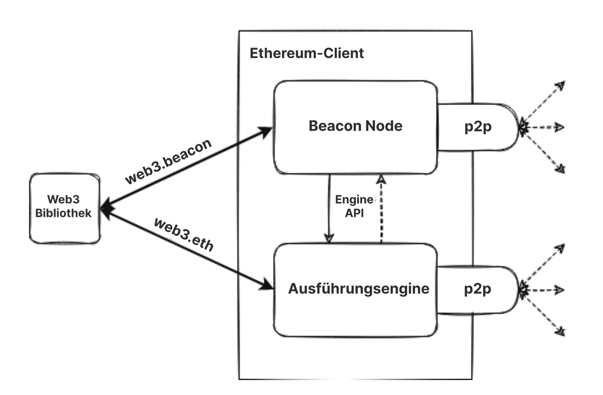
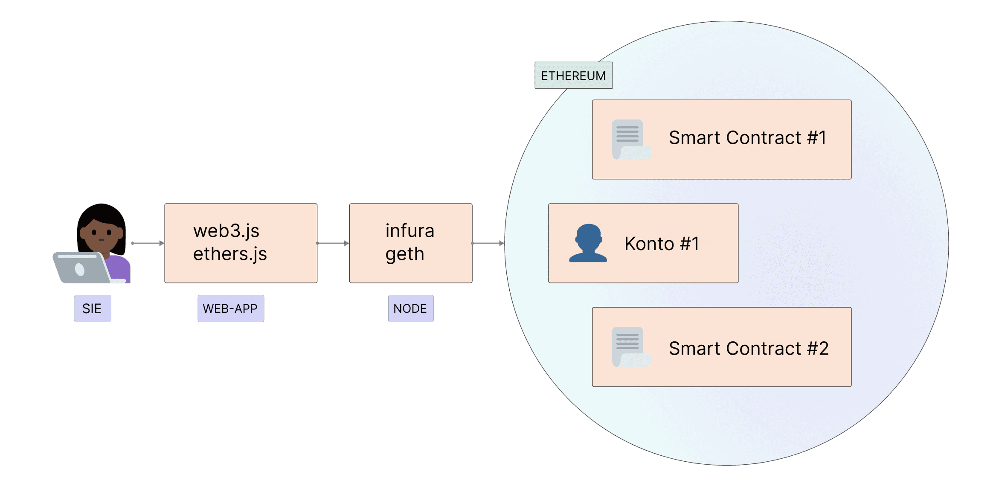

[Ethereum](/) ist ein verteiltes Netzwerk von Computern (bekannt als Blockchain-Knoten), auf denen Software ausgeführt wird, die Blöcke und Transaktionsdaten verifizieren kann. Die Software muss auf Ihrem Computer ausgeführt werden, um ihn in einen Ethereum-Blockchain-Knoten zu verwandeln. Es sind zwei separate Softwarekomponenten (bekannt als „Clients“ oder Anwendungen) erforderlich, um einen Blockchain-Knoten zu bilden.

## Voraussetzungen {#prerequisites}

Sie sollten das Konzept eines Peer-to-Peer-Netzwerks und die [Grundlagen der EVM](/developers/docs/evm/) verstehen, bevor Sie tiefer eintauchen und Ihre eigene Instanz eines Ethereum-Clients ausführen. Werfen Sie einen Blick auf unsere [Einführung in Ethereum](/developers/docs/intro-to-ethereum/).

Wenn das Thema Blockchain-Knoten neu für Sie ist, empfehlen wir Ihnen, sich zunächst unsere benutzerfreundliche Einführung zum [Betreiben eines Ethereum-Blockchain-Knotens](/run-a-node) anzusehen.

## Was sind Blockchain-Knoten und Clients? {#what-are-nodes-and-clients}

Ein „Blockchain-Knoten“ (Node) ist jede Instanz einer Ethereum-Client-Software, die mit anderen Computern verbunden ist, auf denen ebenfalls Ethereum-Software ausgeführt wird, und so ein Netzwerk bildet. Ein Client (eine Anwendung) ist eine Implementierung von Ethereum, die Daten anhand der Protokollregeln verifiziert und das Netzwerk sicher hält. Ein Blockchain-Knoten muss zwei Clients ausführen: einen Konsens-Client und einen Ausführungs-Client.

- Der Ausführungs-Client (auch bekannt als Execution Engine, EL-Client oder früher Eth1-Client) lauscht auf neue Transaktionen, die im Netzwerk übertragen werden, führt sie in der EVM aus und speichert den neuesten Status sowie die Datenbank aller aktuellen Ethereum-Daten.
- Der Konsens-Client (auch bekannt als Beacon Node, CL-Client oder früher Eth2-Client) implementiert den Proof-of-Stake-Konsensalgorithmus, der es dem Netzwerk ermöglicht, basierend auf validierten Daten des Ausführungs-Clients eine Einigung zu erzielen. Es gibt auch eine dritte Softwarekomponente, bekannt als „Validator“, die dem Konsens-Client hinzugefügt werden kann und es einem Blockchain-Knoten ermöglicht, sich an der Sicherung des Netzwerks zu beteiligen.

Diese Clients arbeiten zusammen, um die Spitze der Ethereum-Chain zu verfolgen und es Benutzern zu ermöglichen, mit dem Ethereum-Netzwerk zu interagieren. Das modulare Design, bei dem mehrere Softwarekomponenten zusammenarbeiten, wird als [gekapselte Komplexität (encapsulated complexity)](https://vitalik.eth.limo/general/2022/02/28/complexity.html) bezeichnet. Dieser Ansatz machte es einfacher, [The Merge](/roadmap/merge) nahtlos auszuführen, erleichtert die Wartung und Entwicklung von Client-Software und ermöglicht die Wiederverwendung einzelner Clients, beispielsweise im [Ebene-2-Ökosystem](/layer-2/).

Vereinfachtes Diagramm eines gekoppelten Ausführungs- und Konsens-Clients.

### Client-Vielfalt {#client-diversity}

Sowohl [Ausführungs-Clients](/developers/docs/nodes-and-clients/#execution-clients) als auch [Konsens-Clients](/developers/docs/nodes-and-clients/#consensus-clients) existieren in einer Vielzahl von Programmiersprachen, die von verschiedenen Teams entwickelt wurden.

Mehrere Client-Implementierungen können das Netzwerk stärken, indem sie seine Abhängigkeit von einer einzigen Codebasis verringern. Das ideale Ziel ist es, Vielfalt zu erreichen, ohne dass ein Client das Netzwerk dominiert, wodurch ein potenzieller Single Point of Failure eliminiert wird.
Die Vielfalt der Sprachen lädt auch eine breitere Entwickler-Community ein und ermöglicht es ihnen, Integrationen in ihrer bevorzugten Sprache zu erstellen.

Erfahren Sie mehr über [Client-Vielfalt](/developers/docs/nodes-and-clients/client-diversity/).

Was diese Implementierungen gemeinsam haben, ist, dass sie alle einer einzigen Spezifikation folgen. Spezifikationen schreiben vor, wie das Ethereum-Netzwerk und die Blockchain funktionieren. Jedes technische Detail ist definiert und die Spezifikationen sind wie folgt zu finden:

- Ursprünglich das [Ethereum Yellow Paper](https://ethereum.github.io/yellowpaper/paper.pdf)
- [Ausführungsspezifikationen (Execution specs)](https://github.com/ethereum/execution-specs/)
- [Konsensspezifikationen (Consensus specs)](https://github.com/ethereum/consensus-specs)
- [EIPs](https://eips.ethereum.org/), die in verschiedenen [Netzwerk-Upgrades](/ethereum-forks/) implementiert wurden

### Verfolgung von Blockchain-Knoten im Netzwerk {#network-overview}

Mehrere Tracker bieten einen Echtzeit-Überblick über die Blockchain-Knoten im Ethereum-Netzwerk. Beachten Sie, dass diese Crawler aufgrund der Natur dezentralisierter Netzwerke nur eine begrenzte Sicht auf das Netzwerk bieten können und möglicherweise unterschiedliche Ergebnisse melden.

- [Karte der Blockchain-Knoten](https://etherscan.io/nodetracker) von Etherscan
- [Ethernodes](https://ethernodes.org/) von Bitfly
- [Nodewatch](https://www.nodewatch.io/) von Chainsafe, crawlt Konsens-Knoten
- [Monitoreth](https://monitoreth.io/) - von MigaLabs, ein verteiltes Netzwerk-Monitoring-Tool
- [Wöchentliche Netzwerk-Gesundheitsberichte](https://probelab.io) - von ProbeLab, unter Verwendung des [Nebula-Crawlers](https://github.com/dennis-tra/nebula) und anderer Tools

## Arten von Blockchain-Knoten {#node-types}

Wenn Sie [Ihren eigenen Blockchain-Knoten betreiben](/developers/docs/nodes-and-clients/run-a-node/) möchten, sollten Sie verstehen, dass es verschiedene Arten von Blockchain-Knoten gibt, die Daten unterschiedlich verbrauchen. Tatsächlich können Clients drei verschiedene Arten von Blockchain-Knoten ausführen: Light, Full und Archive. Es gibt auch Optionen für verschiedene Synchronisationsstrategien, die eine schnellere Synchronisationszeit ermöglichen. Synchronisation bezieht sich darauf, wie schnell die aktuellsten Informationen über den Status von Ethereum abgerufen werden können.

### Full Node {#full-node}

Full Nodes führen eine Block-für-Block-Validierung der Blockchain durch, einschließlich des Herunterladens und Verifizierens des Blockkörpers und der Statusdaten für jeden Block. Es gibt verschiedene Klassen von Full Nodes – einige beginnen beim Genesis-Block und verifizieren jeden einzelnen Block in der gesamten Geschichte der Blockchain. Andere beginnen ihre Verifizierung bei einem neueren Block, dem sie als gültig vertrauen (z. B. Geths „Snap Sync“). Unabhängig davon, wo die Verifizierung beginnt, behalten Full Nodes nur eine lokale Kopie relativ aktueller Daten (typischerweise die letzten 128 Blöcke), sodass ältere Daten gelöscht werden können, um Speicherplatz zu sparen. Ältere Daten können bei Bedarf neu generiert werden.

- Speichert vollständige Blockchain-Daten (obwohl diese regelmäßig bereinigt werden, sodass ein Full Node nicht alle Statusdaten bis zum Genesis-Block speichert).
- Nimmt an der Blockvalidierung teil, verifiziert alle Blöcke und Status.
- Alle Status können von einem Full Node entweder aus dem lokalen Speicher abgerufen oder aus „Snapshots“ neu generiert werden.
- Bedient das Netzwerk und stellt Daten auf Anfrage zur Verfügung.

### Archive Node {#archive-node}

Archive Nodes sind Full Nodes, die jeden Block ab dem Genesis-Block verifizieren und niemals heruntergeladene Daten löschen.

- Speichert alles, was im Full Node aufbewahrt wird, und baut ein Archiv historischer Status auf. Dies wird benötigt, wenn Sie beispielsweise einen Kontostand bei Block #4.000.000 abfragen oder einfach und zuverlässig Ihre eigenen Transaktionssätze testen möchten, ohne sie mittels Tracing zu validieren.
- Diese Daten umfassen Terabytes, was Archive Nodes für durchschnittliche Benutzer weniger attraktiv macht, aber für Dienste wie Blocksuchmaschinen, Wallet-Anbieter und Chain-Analysen nützlich sein kann.

Das Synchronisieren von Clients in einem anderen Modus als dem Archivmodus führt zu bereinigten Blockchain-Daten. Das bedeutet, dass es kein Archiv aller historischen Status gibt, der Full Node diese jedoch bei Bedarf erstellen kann.

Erfahren Sie mehr über [Archive Nodes](/developers/docs/nodes-and-clients/archive-nodes).

### Light Node {#light-node}

Anstatt jeden Block herunterzuladen, laden Light Nodes nur Block-Header herunter. Diese Header enthalten zusammenfassende Informationen über den Inhalt der Blöcke. Alle anderen Informationen, die der Light Node benötigt, werden von einem Full Node angefordert. Der Light Node kann dann die empfangenen Daten unabhängig anhand der Statuswurzeln (State Roots) in den Block-Headern verifizieren. Light Nodes ermöglichen es Benutzern, am Ethereum-Netzwerk teilzunehmen, ohne die leistungsstarke Hardware oder hohe Bandbreite zu benötigen, die für den Betrieb von Full Nodes erforderlich ist. Letztendlich könnten Light Nodes auf Mobiltelefonen oder eingebetteten Geräten laufen. Die Light Nodes nehmen nicht am Konsens teil (d. h. sie können keine Validatoren sein), aber sie können auf die Ethereum-Blockchain mit der gleichen Funktionalität und den gleichen Sicherheitsgarantien wie ein Full Node zugreifen.

Light Clients sind ein Bereich aktiver Entwicklung für Ethereum, und wir erwarten, bald neue Light Clients für die Konsensebene und die Ausführungsebene zu sehen.
Es gibt auch potenzielle Wege, Light-Client-Daten über das [Gossip-Netzwerk](https://www.ethportal.net/) bereitzustellen. Dies ist vorteilhaft, da das Gossip-Netzwerk ein Netzwerk von Light Nodes unterstützen könnte, ohne dass Full Nodes Anfragen bedienen müssen.

Ethereum unterstützt noch keine große Anzahl von Light Nodes, aber die Unterstützung von Light Nodes ist ein Bereich, der sich voraussichtlich in naher Zukunft schnell entwickeln wird. Insbesondere Clients wie [Nimbus](https://nimbus.team/), [Helios](https://github.com/a16z/helios) und [LodeStar](https://lodestar.chainsafe.io/) konzentrieren sich derzeit stark auf Light Nodes.

## Warum sollte ich einen Ethereum-Blockchain-Knoten betreiben? {#why-should-i-run-an-ethereum-node}

Der Betrieb eines Blockchain-Knotens ermöglicht es Ihnen, Ethereum direkt, vertrauenslos und privat zu nutzen, während Sie das Netzwerk unterstützen, indem Sie es robuster und dezentralisiert halten.

### Vorteile für Sie {#benefits-to-you}

Der Betrieb Ihres eigenen Blockchain-Knotens ermöglicht es Ihnen, Ethereum auf private, autarke und vertrauenslose Weise zu nutzen. Sie müssen dem Netzwerk nicht vertrauen, da Sie die Daten selbst mit Ihrem Client verifizieren können. „Nicht vertrauen, verifizieren“ (Don't trust, verify) ist ein beliebtes Blockchain-Mantra.

- Ihr Blockchain-Knoten verifiziert alle Transaktionen und Blöcke selbstständig anhand der Konsensregeln. Das bedeutet, dass Sie sich nicht auf andere Blockchain-Knoten im Netzwerk verlassen oder ihnen vollständig vertrauen müssen.
- Sie können ein Ethereum-Wallet mit Ihrem eigenen Blockchain-Knoten verwenden. Sie können Dapps sicherer und privater nutzen, da Sie Ihre Adressen und Guthaben nicht an Vermittler weitergeben müssen. Alles kann mit Ihrem eigenen Client überprüft werden. [MetaMask](https://metamask.io), [Frame](https://frame.sh/) und [viele andere Wallets](/wallets/find-wallet/) bieten RPC-Import an, sodass sie Ihren Blockchain-Knoten verwenden können.
- Sie können andere Dienste, die von Daten aus Ethereum abhängen, ausführen und selbst hosten. Dies könnte beispielsweise ein Beacon Chain-Validator, Software wie Ebene 2, Infrastruktur, Blocksuchmaschinen, Zahlungsabwickler usw. sein.
- Sie können Ihre eigenen benutzerdefinierten [RPC-Endpunkte](/developers/docs/apis/json-rpc/) bereitstellen. Sie könnten diese Endpunkte sogar öffentlich für die Community anbieten, um ihr zu helfen, große zentralisierte Anbieter zu vermeiden.
- Sie können sich über **Inter-process Communications (IPC)** mit Ihrem Blockchain-Knoten verbinden oder den Blockchain-Knoten so umschreiben, dass er Ihr Programm als Plugin lädt. Dies gewährt eine geringe Latenz, was sehr hilfreich ist, z. B. bei der Verarbeitung vieler Daten mit Web3-Bibliotheken oder wenn Sie Ihre Transaktionen so schnell wie möglich ersetzen müssen (d. h. Frontrunning).
- Sie können ETH direkt staken, um das Netzwerk zu sichern und Belohnungen zu verdienen. Siehe [Solo-Staking](/staking/solo/), um loszulegen.

### Vorteile für das Netzwerk {#network-benefits}

Eine vielfältige Gruppe von Blockchain-Knoten ist wichtig für die Gesundheit, Sicherheit und betriebliche Widerstandsfähigkeit von Ethereum.

- Full Nodes setzen die Konsensregeln durch, sodass sie nicht dazu verleitet werden können, Blöcke zu akzeptieren, die diese nicht befolgen. Dies bietet zusätzliche Sicherheit im Netzwerk, denn wenn alle Blockchain-Knoten Light Nodes wären, die keine vollständige Verifizierung durchführen, könnten Validatoren das Netzwerk angreifen.
- Im Falle eines Angriffs, der die kryptoökonomischen Verteidigungen von [Proof-of-Stake](/developers/docs/consensus-mechanisms/pos/#what-is-pos) überwindet, kann eine soziale Wiederherstellung (Social Recovery) durch Full Nodes durchgeführt werden, die sich entscheiden, der ehrlichen Chain zu folgen.
- Mehr Blockchain-Knoten im Netzwerk führen zu einem vielfältigeren und robusteren Netzwerk, dem ultimativen Ziel der Dezentralisierung, was ein zensurresistentes und zuverlässiges System ermöglicht.
- Full Nodes bieten Zugriff auf Blockchain-Daten für leichtgewichtige Clients, die darauf angewiesen sind. Light Nodes speichern nicht die gesamte Blockchain, sondern verifizieren Daten über die [Statuswurzeln in Block-Headern](/developers/docs/blocks/#block-anatomy). Sie können bei Bedarf weitere Informationen von Full Nodes anfordern.

Wenn Sie einen Full Node betreiben, profitiert das gesamte Ethereum-Netzwerk davon, auch wenn Sie keinen Validator betreiben.

## Betreiben Ihres eigenen Blockchain-Knotens {#running-your-own-node}

Interessiert daran, Ihren eigenen Ethereum-Client zu betreiben?

Für eine anfängerfreundliche Einführung besuchen Sie unsere Seite [Einen Blockchain-Knoten betreiben](/run-a-node), um mehr zu erfahren.

Wenn Sie eher ein technischer Benutzer sind, tauchen Sie in weitere Details und Optionen ein, wie Sie [Ihren eigenen Blockchain-Knoten hochfahren](/developers/docs/nodes-and-clients/run-a-node/).

## Alternativen {#alternatives}

Das Einrichten eines eigenen Blockchain-Knotens kann Sie Zeit und Ressourcen kosten, aber Sie müssen nicht immer Ihre eigene Instanz betreiben. In diesem Fall können Sie einen API-Anbieter von Drittanbietern verwenden. Einen Überblick über die Nutzung dieser Dienste finden Sie unter [Blockchain-Knoten als Dienstleistung (Nodes as a Service)](/developers/docs/nodes-and-clients/nodes-as-a-service/).

Wenn jemand in Ihrer Community einen Ethereum-Blockchain-Knoten mit einer öffentlichen API betreibt, können Sie Ihre Wallets über Custom RPC auf einen Community-Knoten verweisen und mehr Privatsphäre gewinnen als bei einem zufälligen vertrauenswürdigen Drittanbieter.

Andererseits können Sie, wenn Sie einen Client betreiben, diesen mit Ihren Freunden teilen, die ihn möglicherweise benötigen.

## Ausführungs-Clients {#execution-clients}

Die Ethereum-Community pflegt mehrere Open-Source-Ausführungs-Clients (früher bekannt als „Eth1-Clients“ oder einfach „Ethereum-Clients“), die von verschiedenen Teams in unterschiedlichen Programmiersprachen entwickelt wurden. Dies macht das Netzwerk stärker und [vielfältiger](/developers/docs/nodes-and-clients/client-diversity/). Das ideale Ziel ist es, Vielfalt zu erreichen, ohne dass ein Client dominiert, um Single Points of Failure zu reduzieren.

Diese Tabelle fasst die verschiedenen Clients zusammen. Alle bestehen [Client-Tests](https://github.com/ethereum/tests) und werden aktiv gepflegt, um bei Netzwerk-Upgrades auf dem neuesten Stand zu bleiben.

| Client                                                                   | Sprache    | Betriebssysteme       | Netzwerke                 | Synchronisationsstrategien                                     | Statusbereinigung (Pruning) |
| ------------------------------------------------------------------------ | ---------- | --------------------- | ------------------------- | -------------------------------------------------------------- | --------------------------- |
| [Geth](https://geth.ethereum.org/)                                       | Go         | Linux, Windows, macOS | Mainnet, Sepolia, Hoodi | [Snap](#snap-sync), [Full](#full-sync)                         | Archive, Pruned             |
| [Nethermind](https://www.nethermind.io/)                                 | C#, .NET   | Linux, Windows, macOS | Mainnet, Sepolia, Hoodi | [Snap](#snap-sync) (ohne Bereitstellung), Fast, [Full](#full-sync) | Archive, Pruned             |
| [Besu](https://besu.hyperledger.org/en/stable/)                          | Java       | Linux, Windows, macOS | Mainnet, Sepolia, Hoodi | [Snap](#snap-sync), [Fast](#fast-sync), [Full](#full-sync)     | Archive, Pruned             |
| [Erigon](https://github.com/ledgerwatch/erigon)                          | Go         | Linux, Windows, macOS | Mainnet, Sepolia, Hoodi | [Full](#full-sync)                                             | Archive, Pruned             |
| [Reth](https://reth.rs/)                                                 | Rust       | Linux, Windows, macOS | Mainnet, Sepolia, Hoodi | [Full](#full-sync)                                             | Archive, Pruned             |
| [EthereumJS](https://github.com/ethereumjs/ethereumjs-monorepo) _(beta)_ | TypeScript | Linux, Windows, macOS | Sepolia, Hoodi          | [Full](#full-sync)                                             | Pruned                      |

Weitere Informationen zu unterstützten Netzwerken finden Sie unter [Ethereum-Netzwerke](/developers/docs/networks/).

Jeder Client hat einzigartige Anwendungsfälle und Vorteile, daher sollten Sie einen basierend auf Ihren eigenen Vorlieben auswählen. Vielfalt ermöglicht es, Implementierungen auf verschiedene Funktionen und Zielgruppen auszurichten. Möglicherweise möchten Sie einen Client basierend auf Funktionen, Support, Programmiersprache oder Lizenzen auswählen.

### Besu {#besu}

Hyperledger Besu ist ein Ethereum-Client auf Unternehmensniveau für öffentliche und zugangsbeschränkte (permissioned) Netzwerke. Er führt alle Funktionen des Ethereum-Mainnets aus, von Tracing bis GraphQL, verfügt über umfassendes Monitoring und wird von ConsenSys unterstützt, sowohl in offenen Community-Kanälen als auch durch kommerzielle SLAs für Unternehmen. Er ist in Java geschrieben und unter Apache 2.0 lizenziert.

Die ausführliche [Dokumentation](https://besu.hyperledger.org/en/stable/) von Besu führt Sie durch alle Details zu seinen Funktionen und Setups.

### Erigon {#erigon}

Erigon, früher bekannt als Turbo-Geth, begann als Fork von Go Ethereum, der auf Geschwindigkeit und Speicherplatzeffizienz ausgerichtet war. Erigon ist eine komplett neu gestaltete Implementierung von Ethereum, die derzeit in Go geschrieben ist, aber Implementierungen in anderen Sprachen befinden sich in der Entwicklung. Das Ziel von Erigon ist es, eine schnellere, modularere und optimiertere Implementierung von Ethereum bereitzustellen. Es kann eine vollständige Archive-Node-Synchronisation mit etwa 2 TB Speicherplatz in weniger als 3 Tagen durchführen.

### Go Ethereum {#geth}

Go Ethereum (kurz Geth) ist eine der ursprünglichen Implementierungen des Ethereum-Protokolls. Derzeit ist es der am weitesten verbreitete Client mit der größten Benutzerbasis und einer Vielzahl von Tools für Benutzer und Entwickler. Er ist in Go geschrieben, vollständig Open Source und unter der GNU LGPL v3 lizenziert.

Erfahren Sie mehr über Geth in seiner [Dokumentation](https://geth.ethereum.org/docs).

### Nethermind {#nethermind}

Nethermind ist eine Ethereum-Implementierung, die mit dem C# .NET-Tech-Stack erstellt wurde, unter LGPL-3.0 lizenziert ist und auf allen wichtigen Plattformen einschließlich ARM läuft. Sie bietet großartige Leistung mit:

- einer optimierten Virtual Machine
- Statuszugriff
- Netzwerkfunktionen und umfangreichen Features wie Prometheus/Grafana-Dashboards, Seq-Enterprise-Logging-Unterstützung, JSON-RPC-Tracing und Analyse-Plugins.

Nethermind verfügt außerdem über eine [detaillierte Dokumentation](https://docs.nethermind.io), starken Entwickler-Support, eine Online-Community und 24/7-Support für Premium-Benutzer.

### Reth {#reth}

Reth (kurz für Rust Ethereum) ist eine Ethereum-Full-Node-Implementierung, die darauf ausgerichtet ist, benutzerfreundlich, hochgradig modular, schnell und effizient zu sein. Reth wurde ursprünglich von Paradigm entwickelt und vorangetrieben und ist unter den Apache- und MIT-Lizenzen lizenziert.

Reth ist produktionsbereit und eignet sich für den Einsatz in geschäftskritischen Umgebungen wie Staking oder Diensten mit hoher Verfügbarkeit. Es schneidet in Anwendungsfällen gut ab, in denen hohe Leistung mit großen Margen erforderlich ist, wie z. B. RPC, MEV, Indizierung, Simulationen und P2P-Aktivitäten.

Erfahren Sie mehr, indem Sie sich das [Reth Book](https://reth.rs/) oder das [Reth GitHub-Repository](https://github.com/paradigmxyz/reth?tab=readme-ov-file#reth) ansehen.

### In Entwicklung {#execution-in-development}

Diese Clients befinden sich noch in einem frühen Entwicklungsstadium und werden noch nicht für den produktiven Einsatz empfohlen.

#### EthereumJS {#ethereumjs}

Der EthereumJS-Ausführungs-Client (EthereumJS) ist in TypeScript geschrieben und besteht aus einer Reihe von Paketen, einschließlich grundlegender Ethereum-Primitive, die durch die Klassen Block, Transaktion und Merkle-Patricia Trie repräsentiert werden, sowie Kern-Client-Komponenten, einschließlich einer Implementierung der Ethereum Virtual Machine (EVM), einer Blockchain-Klasse und dem DevP2P-Netzwerk-Stack.

Erfahren Sie mehr darüber, indem Sie die [Dokumentation](https://github.com/ethereumjs/ethereumjs-monorepo/tree/master) lesen.

## Konsens-Clients {#consensus-clients}

Es gibt mehrere Konsens-Clients (früher bekannt als „Eth2“-Clients), um die [Konsens-Upgrades](/roadmap/beacon-chain/) zu unterstützen. Sie sind für die gesamte konsensbezogene Logik verantwortlich, einschließlich des Fork-Choice-Algorithmus, der Verarbeitung von Bestätigungen (Attestations) und der Verwaltung von [Proof-of-Stake](/developers/docs/consensus-mechanisms/pos)-Belohnungen und -Strafen.

| Client                                                        | Sprache    | Betriebssysteme       | Netzwerke                                                 |
| ------------------------------------------------------------- | ---------- | --------------------- | --------------------------------------------------------- |
| [Lighthouse](https://lighthouse.sigmaprime.io/)               | Rust       | Linux, Windows, macOS | Beacon Chain, Hoodi, Pyrmont, Sepolia, und mehr         |
| [Lodestar](https://lodestar.chainsafe.io/)                    | TypeScript | Linux, Windows, macOS | Beacon Chain, Hoodi, Sepolia, und mehr                  |
| [Nimbus](https://nimbus.team/)                                | Nim        | Linux, Windows, macOS | Beacon Chain, Hoodi, Sepolia, und mehr                  |
| [Prysm](https://prysm.offchainlabs.com/docs/)   | Go         | Linux, Windows, macOS | Beacon Chain, Gnosis, Hoodi, Pyrmont, Sepolia, und mehr |
| [Teku](https://consensys.net/knowledge-base/ethereum-2/teku/) | Java       | Linux, Windows, macOS | Beacon Chain, Gnosis, Hoodi, Sepolia, und mehr          |
| [Grandine](https://docs.grandine.io/)                         | Rust       | Linux, Windows, macOS | Beacon Chain, Hoodi, Sepolia, und mehr                  |

### Lighthouse {#lighthouse}

Lighthouse ist eine Konsens-Client-Implementierung, die in Rust unter der Apache-2.0-Lizenz geschrieben wurde. Sie wird von Sigma Prime gepflegt und ist seit dem Genesis-Block der Beacon Chain stabil und produktionsbereit. Verschiedene Unternehmen, Staking-Pools und Einzelpersonen verlassen sich darauf. Sie zielt darauf ab, sicher, leistungsstark und interoperabel in einer Vielzahl von Umgebungen zu sein, von Desktop-PCs bis hin zu anspruchsvollen automatisierten Bereitstellungen.

Die Dokumentation finden Sie im [Lighthouse Book](https://lighthouse-book.sigmaprime.io/)

### Lodestar {#lodestar}

Lodestar ist eine produktionsbereite Konsens-Client-Implementierung, die in TypeScript unter der LGPL-3.0-Lizenz geschrieben wurde. Sie wird von ChainSafe Systems gepflegt und ist der neueste der Konsens-Clients für Solo-Staker, Entwickler und Forscher. Lodestar besteht aus einem Beacon Node und einem Validator-Client, die auf JavaScript-Implementierungen von Ethereum-Protokollen basieren. Lodestar zielt darauf ab, die Benutzerfreundlichkeit von Ethereum mit Light Clients zu verbessern, die Zugänglichkeit für eine größere Gruppe von Entwicklern zu erweitern und weiter zur Vielfalt des Ökosystems beizutragen.

Weitere Informationen finden Sie auf der [Lodestar-Website](https://lodestar.chainsafe.io/)

### Nimbus {#nimbus}

Nimbus ist eine Konsens-Client-Implementierung, die in Nim unter der Apache-2.0-Lizenz geschrieben wurde. Es ist ein produktionsbereiter Client, der von Solo-Stakern und Staking-Pools verwendet wird. Nimbus ist auf Ressourceneffizienz ausgelegt, sodass er problemlos auf ressourcenbeschränkten Geräten und in der Unternehmensinfrastruktur ausgeführt werden kann, ohne die Stabilität oder die Belohnungsleistung zu beeinträchtigen. Ein geringerer Ressourcenbedarf bedeutet, dass der Client eine größere Sicherheitsmarge hat, wenn das Netzwerk unter Stress steht.

Erfahren Sie mehr in den [Nimbus-Dokumenten](https://nimbus.guide/)

### Prysm {#prysm}

Prysm ist ein voll ausgestatteter Open-Source-Konsens-Client, der in Go unter der GPL-3.0-Lizenz geschrieben wurde. Er verfügt über eine optionale Web-App-Benutzeroberfläche und priorisiert Benutzererfahrung, Dokumentation und Konfigurierbarkeit sowohl für Heimanwender (Stake-at-Home) als auch für institutionelle Benutzer.

Besuchen Sie die [Prysm-Dokumentation](https://prysm.offchainlabs.com/docs/), um mehr zu erfahren.

### Teku {#teku}

Teku ist einer der ursprünglichen Beacon Chain-Genesis-Clients. Neben den üblichen Zielen (Sicherheit, Robustheit, Stabilität, Benutzerfreundlichkeit, Leistung) zielt Teku speziell darauf ab, alle verschiedenen Konsens-Client-Standards vollständig zu erfüllen.

Teku bietet sehr flexible Bereitstellungsoptionen. Der Beacon Node und der Validator-Client können zusammen als ein einziger Prozess ausgeführt werden, was für Solo-Staker äußerst praktisch ist, oder die Blockchain-Knoten können für anspruchsvolle Staking-Operationen separat ausgeführt werden. Darüber hinaus ist Teku vollständig interoperabel mit [Web3Signer](https://github.com/ConsenSys/web3signer/) für die Sicherheit von Signaturschlüsseln und den Slashing-Schutz.

Teku ist in Java geschrieben und unter Apache 2.0 lizenziert. Es wird vom Protocols-Team bei ConsenSys entwickelt, das auch für Besu und Web3Signer verantwortlich ist. Erfahren Sie mehr in der [Teku-Dokumentation](https://docs.teku.consensys.net/en/latest/).

### Grandine {#grandine}

Grandine ist eine Konsens-Client-Implementierung, die in Rust unter der GPL-3.0-Lizenz geschrieben wurde. Sie wird vom Grandine Core Team gepflegt und ist schnell, leistungsstark und leichtgewichtig. Sie eignet sich für eine breite Palette von Stakern, von Solo-Stakern, die auf ressourcenarmen Geräten wie dem Raspberry Pi laufen, bis hin zu großen institutionellen Stakern, die Zehntausende von Validatoren betreiben.

Die Dokumentation finden Sie im [Grandine Book](https://docs.grandine.io/)

## Synchronisationsmodi {#sync-modes}

Um aktuelle Daten im Netzwerk zu verfolgen und zu verifizieren, muss sich der Ethereum-Client mit dem neuesten Netzwerkstatus synchronisieren. Dies geschieht durch das Herunterladen von Daten von Peers, die kryptografisch auf ihre Integrität überprüft werden, und den Aufbau einer lokalen Blockchain-Datenbank.

Synchronisationsmodi stellen verschiedene Ansätze für diesen Prozess mit unterschiedlichen Kompromissen dar. Clients variieren auch in ihrer Implementierung von Synchronisationsalgorithmen. Beziehen Sie sich immer auf die offizielle Dokumentation Ihres gewählten Clients für spezifische Implementierungsdetails.

### Synchronisationsmodi der Ausführungsebene {#execution-layer-sync-modes}

Die Ausführungsebene kann in verschiedenen Modi ausgeführt werden, um unterschiedlichen Anwendungsfällen gerecht zu werden, von der erneuten Ausführung des Weltzustands der Blockchain bis hin zur reinen Synchronisation mit der Spitze der Chain von einem vertrauenswürdigen Checkpoint aus.

#### Full Sync {#full-sync}

Ein Full Sync lädt alle Blöcke (einschließlich Header und Blockkörper) herunter und regeneriert den Status der Blockchain inkrementell, indem jeder Block ab dem Genesis-Block ausgeführt wird.

- Minimiert das Vertrauen und bietet die höchste Sicherheit durch die Verifizierung jeder Transaktion.
- Mit einer zunehmenden Anzahl von Transaktionen kann es Tage bis Wochen dauern, alle Transaktionen zu verarbeiten.

[Archive Nodes](#archive-node) führen einen Full Sync durch, um eine vollständige Historie der Statusänderungen aufzubauen (und beizubehalten), die durch jede Transaktion in jedem Block vorgenommen wurden.

#### Fast Sync {#fast-sync}

Wie ein Full Sync lädt ein Fast Sync alle Blöcke (einschließlich Header, Transaktionen und Belege) herunter. Anstatt jedoch die historischen Transaktionen neu zu verarbeiten, verlässt sich ein Fast Sync auf die Belege, bis er einen aktuellen Head erreicht, woraufhin er zum Importieren und Verarbeiten von Blöcken wechselt, um einen Full Node bereitzustellen.

- Schnelle Synchronisationsstrategie.
- Reduziert den Verarbeitungsbedarf zugunsten der Bandbreitennutzung.

#### Snap Sync {#snap-sync}

Snap Syncs verifizieren die Chain ebenfalls Block für Block. Anstatt jedoch beim Genesis-Block zu beginnen, startet ein Snap Sync bei einem neueren „vertrauenswürdigen“ Checkpoint, von dem bekannt ist, dass er Teil der wahren Blockchain ist. Der Blockchain-Knoten speichert regelmäßige Checkpoints und löscht Daten, die älter als ein bestimmtes Alter sind. Diese Snapshots werden verwendet, um Statusdaten bei Bedarf neu zu generieren, anstatt sie für immer zu speichern.

- Schnellste Synchronisationsstrategie, derzeit Standard im Ethereum-Mainnet.
- Spart viel Speicherplatz und Netzwerkbandbreite, ohne die Sicherheit zu beeinträchtigen.

[Mehr zu Snap Sync](https://github.com/ethereum/devp2p/blob/master/caps/snap.md).

#### Light Sync {#light-sync}

Der Light-Client-Modus lädt alle Block-Header und Blockdaten herunter und verifiziert einige davon zufällig. Synchronisiert nur die Spitze der Chain vom vertrauenswürdigen Checkpoint aus.

- Ruft nur den neuesten Status ab und verlässt sich dabei auf das Vertrauen in die Entwickler und den Konsensmechanismus.
- Der Client ist in wenigen Minuten mit dem aktuellen Netzwerkstatus einsatzbereit.

**Hinweis:** Light Sync funktioniert noch nicht mit Proof-of-Stake-Ethereum – neue Versionen von Light Sync sollten bald veröffentlicht werden!

[Mehr zu Light Clients](/developers/docs/nodes-and-clients/light-clients/)

### Synchronisationsmodi der Konsensebene {#consensus-layer-sync-modes}

#### Optimistic Sync {#optimistic-sync}

Optimistic Sync ist eine Post-Merge-Synchronisationsstrategie, die als Opt-in und abwärtskompatibel konzipiert ist und es Ausführungsknoten ermöglicht, sich über etablierte Methoden zu synchronisieren. Die Execution Engine kann Beacon-Blöcke _optimistisch_ importieren, ohne sie vollständig zu verifizieren, den neuesten Head finden und dann beginnen, die Chain mit den oben genannten Methoden zu synchronisieren. Nachdem der Ausführungs-Client aufgeholt hat, informiert er den Konsens-Client über die Gültigkeit der Transaktionen in der Beacon Chain.

[Mehr zu Optimistic Sync](https://github.com/ethereum/consensus-specs/blob/master/sync/optimistic.md)

#### Checkpoint Sync {#checkpoint-sync}

Ein Checkpoint Sync, auch bekannt als Weak Subjectivity Sync, schafft eine überlegene Benutzererfahrung für die Synchronisation eines Beacon Nodes. Er basiert auf Annahmen der [schwachen Subjektivität (Weak Subjectivity)](/developers/docs/consensus-mechanisms/pos/weak-subjectivity/), die es ermöglichen, die Beacon Chain von einem kürzlichen Weak-Subjectivity-Checkpoint anstelle des Genesis-Blocks zu synchronisieren. Checkpoint Syncs machen die anfängliche Synchronisationszeit deutlich schneller, bei ähnlichen Vertrauensannahmen wie bei der Synchronisation ab dem [Genesis-Block](/glossary/#genesis-block).

In der Praxis bedeutet dies, dass sich Ihr Blockchain-Knoten mit einem Remote-Dienst verbindet, um aktuelle finalisierte Status herunterzuladen, und von diesem Punkt an mit der Verifizierung der Daten fortfährt. Dem Drittanbieter, der die Daten bereitstellt, wird vertraut, und er sollte sorgfältig ausgewählt werden.

Mehr zu [Checkpoint Sync](https://notes.ethereum.org/@djrtwo/ws-sync-in-practice)

## Weiterführende Literatur {#further-reading}

- [Ethereum 101 - Teil 2 - Blockchain-Knoten verstehen](https://kauri.io/ethereum-101-part-2-understanding-nodes/48d5098292fd4f11b251d1b1814f0bba/a) _– Wil Barnes, 13. Februar 2019_
- [Ethereum Full Nodes betreiben: Ein Leitfaden für die kaum Motivierten](https://medium.com/@JustinMLeroux/running-ethereum-full-nodes-a-guide-for-the-barely-motivated-a8a13e7a0d31) _– Justin Leroux, 7. November 2019_

## Verwandte Themen {#related-topics}

- [Blöcke](/developers/docs/blocks/)
- [Netzwerke](/developers/docs/networks/)

## Verwandte Tutorials {#related-tutorials}

- [Verwandeln Sie Ihren Raspberry Pi 4 in einen Validator-Knoten, indem Sie einfach die MicroSD-Karte flashen – Installationsanleitung](/developers/tutorials/run-node-raspberry-pi/) _– Flashen Sie Ihren Raspberry Pi 4, schließen Sie ein Ethernet-Kabel an, verbinden Sie die SSD-Festplatte und schalten Sie das Gerät ein, um den Raspberry Pi 4 in einen vollständigen Ethereum-Blockchain-Knoten zu verwandeln, der die Ausführungsebene (Mainnet) und/oder die Konsensebene (Beacon Chain / Validator) ausführt._