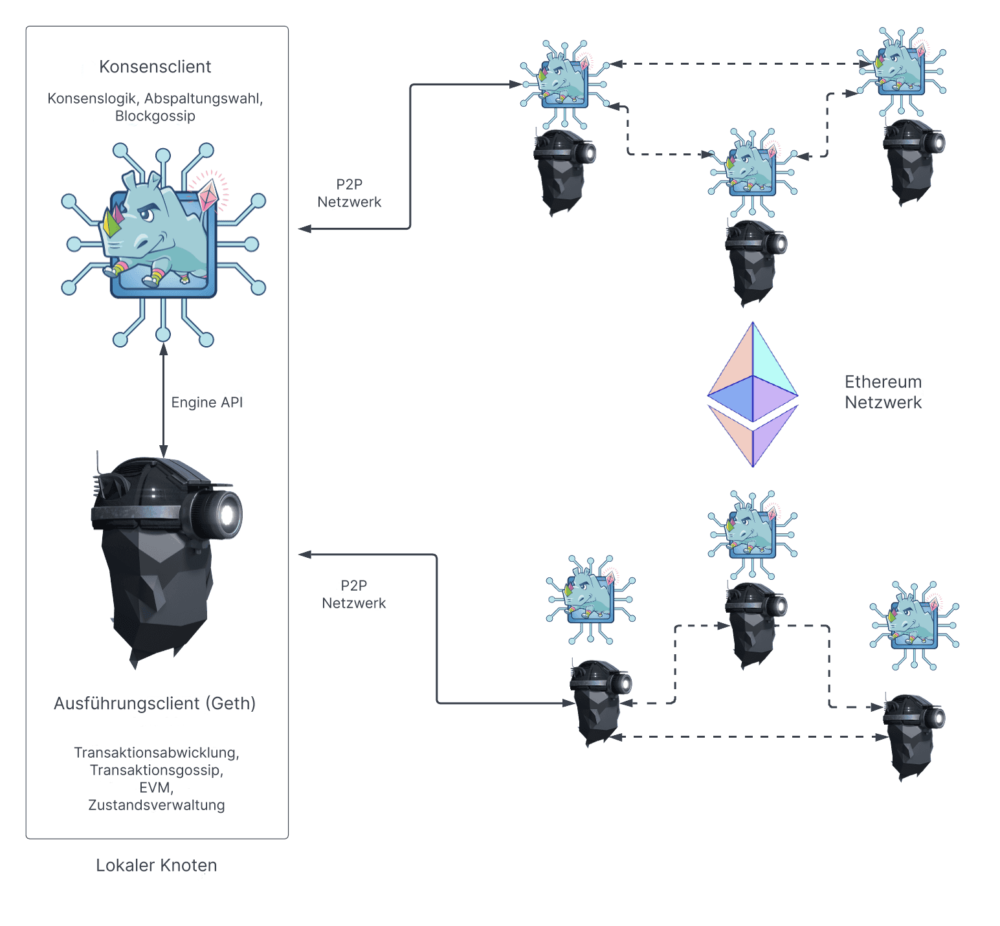

Ein Ethereum-Blockchain-Knoten besteht aus zwei Anwendungen: einem [Ausführungs-Client](/developers/docs/nodes-and-clients/#execution-clients) und einem [Konsens-Client](/developers/docs/nodes-and-clients/#consensus-clients). Damit ein Blockchain-Knoten einen neuen Block vorschlagen kann, muss er auch einen [Validator-Client](#validators) ausführen.

Als Ethereum noch [Proof-of-Work](/developers/docs/consensus-mechanisms/pow/) verwendete, reichte ein Ausführungs-Client aus, um einen vollständigen Ethereum-Blockchain-Knoten zu betreiben. Seit der Implementierung von [Proof-of-Stake](/developers/docs/consensus-mechanisms/pos/) muss der Ausführungs-Client jedoch zusammen mit einer weiteren Software, dem sogenannten [Konsens-Client](/developers/docs/nodes-and-clients/#consensus-clients), verwendet werden.

Das folgende Diagramm zeigt die Beziehung zwischen den beiden Ethereum-Anwendungen. Die beiden Anwendungen verbinden sich mit ihren jeweiligen Peer-to-Peer-Netzwerken (P2P). Separate P2P-Netzwerke sind erforderlich, da die Ausführungs-Clients Transaktionen über ihr P2P-Netzwerk verbreiten (Gossip), was es ihnen ermöglicht, ihren lokalen Transaktionspool zu verwalten, während die Konsens-Clients Blöcke über ihr P2P-Netzwerk verbreiten, was den Konsens und das Wachstum der Chain ermöglicht.

_Es gibt mehrere Optionen für den Ausführungs-Client, darunter Erigon, Nethermind und Besu_.

Damit diese Zwei-Anwendungen-Struktur funktioniert, müssen Konsens-Clients Bündel von Transaktionen an den Ausführungs-Client weitergeben. Der Ausführungs-Client führt die Transaktionen lokal aus, um zu validieren, dass die Transaktionen nicht gegen Ethereum-Regeln verstoßen und dass die vorgeschlagene Aktualisierung des Ethereum-Zustands korrekt ist. Wenn ein Blockchain-Knoten als Blockproduzent ausgewählt wird, fordert seine Konsens-Client-Instanz Transaktionsbündel vom Ausführungs-Client an, um sie in den neuen Block aufzunehmen und auszuführen, um den globalen Zustand zu aktualisieren. Der Konsens-Client steuert den Ausführungs-Client über eine lokale RPC-Verbindung unter Verwendung der [Engine API](https://github.com/ethereum/execution-apis/blob/main/src/engine/common.md).

## Was macht der Ausführungs-Client? {#execution-client}

Der Ausführungs-Client ist verantwortlich für die Validierung, Handhabung und Verbreitung (Gossip) von Transaktionen sowie für die Zustandsverwaltung und die Unterstützung der [Ethereum Virtual Machine](/developers/docs/evm/) (EVM). Er ist **nicht** verantwortlich für die Blockbildung, die Verbreitung von Blöcken oder die Handhabung der Konsenslogik. Diese fallen in den Aufgabenbereich des Konsens-Clients.

Der Ausführungs-Client erstellt Ausführungs-Payloads – die Liste der Transaktionen, den aktualisierten Zustands-Trie und andere ausführungsbezogene Daten. Konsens-Clients fügen den Ausführungs-Payload in jeden Block ein. Der Ausführungs-Client ist auch dafür verantwortlich, Transaktionen in neuen Blöcken erneut auszuführen, um sicherzustellen, dass sie gültig sind. Die Ausführung von Transaktionen erfolgt auf dem eingebetteten Computer des Ausführungs-Clients, bekannt als die [Ethereum Virtual Machine (EVM)](/developers/docs/evm).

Der Ausführungs-Client bietet auch eine Benutzeroberfläche für Ethereum durch [RPC-Methoden](/developers/docs/apis/json-rpc), die es Benutzern ermöglichen, die Ethereum-Blockchain abzufragen, Transaktionen einzureichen und Smart Contracts bereitzustellen. Es ist üblich, dass RPC-Aufrufe von einer Bibliothek wie [Web3js](https://docs.web3js.org/), [Web3py](https://web3py.readthedocs.io/en/v5/) oder von einer Benutzeroberfläche wie einem Browser-Wallet verarbeitet werden.

Zusammenfassend ist der Ausführungs-Client:

- ein Benutzer-Gateway zu Ethereum
- das Zuhause der Ethereum Virtual Machine, des Ethereum-Zustands und des Transaktionspools.

## Was macht der Konsens-Client? {#consensus-client}

Der Konsens-Client befasst sich mit der gesamten Logik, die es einem Blockchain-Knoten ermöglicht, mit dem Ethereum-Netzwerk synchron zu bleiben. Dies umfasst den Empfang von Blöcken von Peers und die Ausführung eines Fork-Choice-Algorithmus, um sicherzustellen, dass der Blockchain-Knoten immer der Chain mit der größten Ansammlung von Bestätigungen (gewichtet nach den effektiven Guthaben der Validatoren) folgt. Ähnlich wie der Ausführungs-Client haben Konsens-Clients ihr eigenes P2P-Netzwerk, über das sie Blöcke und Bestätigungen teilen.

Der Konsens-Client beteiligt sich nicht an der Bestätigung oder dem Vorschlagen von Blöcken – dies wird von einem Validator durchgeführt, einem optionalen Add-on für einen Konsens-Client. Ein Konsens-Client ohne Validator hält nur mit der Spitze der Chain Schritt, sodass der Blockchain-Knoten synchronisiert bleibt. Dies ermöglicht es einem Benutzer, mit Ethereum über seinen Ausführungs-Client zu interagieren, in der Gewissheit, dass er sich auf der richtigen Chain befindet.

## Validatoren {#validators}

Durch Staking und das Ausführen der Validator-Software wird ein Blockchain-Knoten berechtigt, ausgewählt zu werden, um einen neuen Block vorzuschlagen. Betreiber von Blockchain-Knoten können ihren Konsens-Clients einen Validator hinzufügen, indem sie 32 ETH in den Einzahlungsvertrag einzahlen. Der Validator-Client wird mit dem Konsens-Client gebündelt geliefert und kann einem Blockchain-Knoten jederzeit hinzugefügt werden. Der Validator kümmert sich um Bestätigungen und Blockvorschläge. Er ermöglicht es einem Blockchain-Knoten auch, Belohnungen anzusammeln oder ETH durch Strafen oder Slashing zu verlieren.

[Mehr über Staking](/staking/).

## Vergleich der Komponenten eines Blockchain-Knotens {#node-comparison}

| Ausführungs-Client                                 | Konsens-Client                                                                                                                                            | Validator                    |
| -------------------------------------------------- | --------------------------------------------------------------------------------------------------------------------------------------------------------- | ---------------------------- |
| Verbreitet Transaktionen über sein P2P-Netzwerk    | Verbreitet Blöcke und Bestätigungen über sein P2P-Netzwerk                                                                                                | Schlägt Blöcke vor           |
| Führt Transaktionen aus/erneut aus                 | Führt den Fork-Choice-Algorithmus aus                                                                                                                     | Sammelt Belohnungen/Strafen an |
| Verifiziert eingehende Zustandsänderungen          | Verfolgt die Spitze der Chain                                                                                                                             | Nimmt Bestätigungen vor      |
| Verwaltet Zustands- und Quittungs-Tries            | Verwaltet den Beacon-Zustand (enthält Konsens- und Ausführungsinformationen)                                                                              | Erfordert das Staking von 32 ETH |
| Erstellt Ausführungs-Payload                       | Verfolgt die angesammelte Zufälligkeit in RANDAO (ein Algorithmus, der überprüfbare Zufälligkeit für die Validator-Auswahl und andere Konsensoperationen bietet) | Kann von Slashing betroffen sein |
| Stellt JSON-RPC-API für die Interaktion mit Ethereum bereit | Verfolgt Rechtfertigung und Finalität                                                                                                                     |                              |

## Weiterführende Literatur {#further-reading}

- [Proof-of-Stake](/developers/docs/consensus-mechanisms/pos)
- [Blockvorschlag](/developers/docs/consensus-mechanisms/pos/block-proposal)
- [Belohnungen und Strafen für Validatoren](/developers/docs/consensus-mechanisms/pos/rewards-and-penalties)