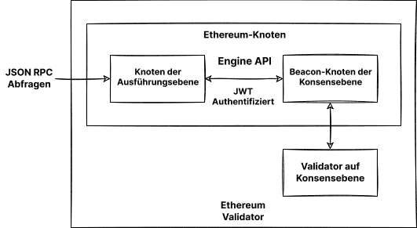

Der Betrieb eines eigenen Nodes bietet Ihnen verschiedene Vorteile, eröffnet neue Möglichkeiten und trägt zur Unterstützung des Ökosystems bei. Diese Seite führt Sie durch die Einrichtung Ihres eigenen Nodes und die Teilnahme an der Validierung von Ethereum-Transaktionen.

Bitte beachten Sie, dass seit [der Zusammenführung](/roadmap/merge) zwei Clients erforderlich sind, um einen Ethereum-Knoten zu betreiben; ein Client auf **Ausführungsebene (EL)** und ein Client auf **Konsensebene (CL)**. Auf dieser Seite zeigen wir Ihnen die Installation, Konfiguration und Verbindung dieser beiden Clients, um einen Ethereum-Knoten zu betreiben.

## Voraussetzungen {#prerequisites}

Sie sollten verstehen, was ein Ethereum-Knoten ist und warum Sie ggf. einen Client betreiben sollten. Dieses Thema wird unter [Nodes und Clients](/developers/docs/nodes-and-clients/) behandelt.

Wenn das Thema neu für Sie ist oder Sie nach einem weniger technischen Weg suchen, empfehlen wir Ihnen, zunächst unsere benutzerfreundliche Einführung zum [Betrieb eines Ethereum-Knotens](/run-a-node) zu lesen.

## Herangehensweise bestimmen {#choosing-approach}

Der erste Schritt beim Einrichten Ihres Knotens besteht in der Wahl der Herangehensweise. Auf der Grundlage der Anforderungen und der verschiedenen Möglichkeiten müssen Sie die Client-Implementierung (sowohl für Ausführungs- als auch für Konsensclients), die Umgebung (Hardware, System) und die Parameter für die Client-Einstellungen auswählen.

Diese Seite wird Sie dabei unterstützen, diese Entscheidungen zu treffen und die am besten geeignete Methode für den Betrieb Ihrer Ethereum-Instanz zu finden.

Um aus Client-Implementierungen auszuwählen, sehen Sie sich alle verfügbaren Mainnet-fähigen [Ausführungsclients](/developers/docs/nodes-and-clients/#execution-clients), [Konsensclients](/developers/docs/nodes-and-clients/#consensus-clients) an und erfahren Sie mehr über [Client-Vielfalt](/developers/docs/nodes-and-clients/client-diversity).

Entscheiden Sie, ob Sie die Software auf Ihrer eigenen [Hardware oder in der Cloud](#local-vs-cloud) betreiben möchten und berücksichtigen Sie dabei die [Anforderungen](#Anforderungen) des Clients.

Nachdem Sie die Umgebung vorbereitet haben, installieren Sie die ausgewählten Clients entweder mit der[einsteigerfreundlichen Schnittstelle](#automatized-setup) oder [manuell](#manual-setup) über ein Terminal mit erweiterten Optionen.

Wenn Ihr Knoten ausgeführt wird und synchronisiert ist, können Sie diesen [nutzen](#benutzen-den-node), Sie sollten jedoch die [Wartung](#betreiben-den-node) im Auge behalten.



### Umgebung und Hardware {#environment-and-hardware}

#### Lokal oder Cloud {#local-vs-cloud}

Ethereum-Clients können auf gewöhnlichen Heim-Computern ausgeführt werden und benötigen keine spezielle Hardware, wie z. B. Mining-Maschinen. Sie haben also verschiedene Möglichkeiten, den Knoten je nach Ihren Bedürfnissen zu betreiben. Zur Vereinfachung stellen wir uns vor, dass ein Knoten sowohl auf einem lokalen physischen Computer als auch auf einem Cloud-Server ausgeführt werden kann:

- Cloud
  - Anbieter bieten eine hohe Serververfügbarkeit und statische öffentliche IP-Adressen
  - Ein dedizierter oder virtueller Server kann bequemer sein als ein eigener
  - Die Gegenleistung ist das Vertrauen in eine dritte Partei – den Serveranbieter
  - Aufgrund der erforderlichen Speichergröße für vollständige Knoten kann der Preis für einen gemieteten Server hoch sein
- Eigene Hardware
  - Vertrauenslosere und souveränere Vorgehensweise
  - Einmalige Investition
  - Option zum Kauf vorkonfigurierter Maschinen
  - Sie müssen den Rechner und das Netzwerk technisch vorbereiten, warten und möglicherweise Fehler beheben

Beide Optionen haben verschiedene Vorteile, die oben zusammengefasst sind. Wenn Sie eine Cloud-Lösung suchen, gibt es neben vielen traditionellen Cloud-Computing-Anbietern auch Dienste, die sich auf die Bereitstellung von Knoten konzentrieren. Unter [Nodes als Dienste](/developers/docs/nodes-and-clients/nodes-as-a-service/) finden Sie weitere Optionen für gehostete Nodes.

#### Hardware {#hardware}

Ein zensurresistentes, dezentrales Netz sollte sich jedoch nicht auf Cloud-Anbieter verlassen. Stattdessen ist es für das Ökosystem gesünder, wenn Sie Ihren Node auf Ihrer eigenen lokalen Hardware betreiben. [Schätzungen](https://www.ethernodes.org/networkType/Hosting) zeigen, dass ein großer Teil der Knoten in der Cloud betrieben werden, was zu einer einzelnen Fehlerquelle führen kann.

Ethereum-Clients können auf Ihrem Computer, Laptop, Server oder sogar auf einem Einplatinencomputer ausgeführt werden. Es ist zwar möglich, Clients auf Ihrem Heimcomputer auszuführen, jedoch kann ein eigens für Ihren Knoten eingerichteter Rechner dessen Leistung und Sicherheit erheblich verbessern und gleichzeitig die Auswirkungen auf Ihren primären Computer minimieren.

Die Verwendung Ihrer eigenen Hardware kann sehr einfach sein. Es gibt viele einfache Optionen, aber auch fortgeschrittene Einstellungen für technisch versierte Personen. Schauen wir uns also die Voraussetzungen und Mittel für die Ausführung von Ethereum-Clients auf Ihrem Rechner an.

#### Voraussetzungen {#requirements}

Die Hardware-Anforderungen sind je nach Client unterschiedlich, aber im Allgemeinen nicht besonders hoch, da der Knoten nur synchronisiert bleiben muss. Verwechseln Sie das nicht mit dem Mining, das viel mehr Rechenleistung erfordert. Die Synchronisation von Zeit und Leistung verbessert sich jedoch mit leistungsstärkerer Hardware.

Bevor Sie einen Client installieren, stellen Sie bitte sicher, dass Ihr Computer über genügend Ressourcen verfügt, um ihn auszuführen. Im Folgenden finden Sie die Mindestanforderungen und die empfohlenen Voraussetzungen.

Der Engpass für Ihre Hardware ist meist der Speicherplatz. Die Synchronisierung der Ethereum-Blockchain ist sehr ein- und ausgabeintensiv und benötigt viel Speicherplatz. Am besten ist es, ein **Solid-State-Laufwerk (SSD)** mit Hunderten von GB freiem Speicherplatz zu haben, der selbst nach der Synchronisierung noch Speicherplatz zur Verfügung hat.

Die Größe der Datenbank und die Geschwindigkeit der anfänglichen Synchronisierung hängen vom gewählten Client, seiner Konfiguration und der [Synchronisierungsstrategie](/developers/docs/nodes-and-clients/#sync-modes) ab.

Vergewissern Sie sich auch, dass Ihre Internetverbindung nicht durch eine [Bandbreitenbeschränkung](https://wikipedia.org/wiki/Data_cap) begrenzt ist. Es wird empfohlen, eine nicht gebührenpflichtige Verbindung zu verwenden, da die anfängliche Synchronisierung und die an das Netzwerk übertragenen Daten Ihr Limit überschreiten könnten.

##### Betriebssystem

Alle Clients unterstützen die wichtigsten Betriebssysteme: Linux, MacOS, Windows. Das bedeutet, dass Ihre Knoten auf normalen Desktop- oder Server-Rechnern mit dem Betriebssystem (OS), welches Ihnen am besten passt, betrieben werden können. Stellen Sie sicher, dass Ihr Betriebssystem auf dem neuesten Stand ist, um mögliche Probleme und Sicherheitslücken zu vermeiden.

##### Mindestanforderungen

- CPU mit mind. 2 Kernen
- 8 GB RAM
- 2TB SSD
- Mind. 10 MBit/s Bandbreite

##### Empfohlene Spezifikationen

- Schnelle CPU mit mind. 4 Kernen
- Mind. 16 GB RAM
- Schnelle SSD mit mind. 2 TB
- Mind. 25 MBit/s Bandbreite

Der von Ihnen gewählte Synchronisierungsmodus und Client wirken sich auf den Speicherplatzbedarf aus, wir haben jedoch den Speicherplatz, den Sie für jeden Client benötigen, im Folgenden geschätzt.

| Client     | Festplattengröße (Snap-Synchronisation) | Festplattengröße (Vollständiges Archiv) |
| ---------- | --------------------------------------- | --------------------------------------- |
| Geth       | Mind. 500 GB                            | Mind. 12TB                              |
| Nethermind | Mind. 500 GB                            | Mind. 12TB                              |
| Besu       | Mind. 800 GB                            | Mind. 12TB                              |
| Erigon     | N/V                                     | Mind. 2,5 TB                            |

- Hinweis: Erigon bietet keine Snap-Synchronisation, aber Full Pruning ist möglich (ca. 500 GB)

Bei Konsens-Clients hängt der Platzbedarf auch von der Client-Implementierung und den aktivierten Funktionen (z. B. Validator Slasher) ab, im Allgemeinen werden jedoch weitere 200 GB für Beacon-Daten benötigt. Mit einer großen Anzahl von Validatoren steigt auch die Bandbreitenbelastung. [Details zu den Anforderungen an Konsensclients finden Sie in dieser Analyse](https://mirror.xyz/0x934e6B4D7eee305F8C9C42b46D6EEA09CcFd5EDc/b69LBy8p5UhcGJqUAmT22dpvdkU-Pulg2inrhoS9Mbc).

#### Plug-and-Play-Lösungen {#plug-and-play}

Die einfachste Möglichkeit, einen Knoten mit eigener Hardware zu betreiben, ist die Verwendung von Plug-and-Play-Modulen. Vorkonfigurierte Geräte von Anbietern bieten die unkomplizierteste Lösung: bestellen, anschließen, loslegen. Alles ist vorkonfiguriert und läuft automatisch mit einer intuitiven Anleitung und einem Dashboard zur Überwachung und Steuerung der Software.

- [DappNode](https://dappnode.io/)
- [Avado](https://ava.do/)

#### Ethereum auf einem Einplatinenrechner {#ethereum-on-a-single-board-computer}

Eine einfache und kostengünstige Möglichkeit, einen Ethereum-Node zu betreiben, ist die Verwendung eines Einplatinenrechners, sogar mit einer ARM-Architektur wie dem Raspberry Pi. [Ethereum on ARM](https://ethereum-on-arm-documentation.readthedocs.io/en/latest/) bietet einfach auszuführende Implementierungen von mehreren Ausführungs- und Konsensclients für Raspberry Pi und anderer ARM-Boards.

Kleine, kostengünstige und effiziente Geräte wie diese sind ideal für den Betrieb eines Knotens im eigenen Haushalt, doch sollte man ihre begrenzte Leistung nicht überschätzen.

## Hochfahren des Nodes {#spinning-up-node}

Die eigentliche Client-Einrichtung kann entweder mit automatischen Startprogrammen (Launcher) oder manuell erfolgen, indem die Client-Software direkt eingerichtet wird.

Für weniger fortgeschrittene Benutzer empfiehlt sich die Verwendung eines „Launchers“, einer Software, die Sie durch die Installation führt und den Client-Einrichtungsprozess automatisiert. Wenn Sie jedoch etwas Erfahrung im Umgang mit einem Terminal haben, sollten die Schritte zur manuellen Einrichtung einfach zu befolgen sein.

### Geführte Einrichtung {#automatized-setup}

Mehrere benutzerfreundliche Projekte zielen darauf ab, die Erfahrungen bei der Einrichtung eines Kunden zu verbessern. Diese Launcher bieten eine automatische Client-Installation und -Konfiguration, wobei einige sogar eine grafische Oberfläche für die geführte Einrichtung und Überwachung der Clients bieten.

Im Folgenden finden Sie einige Projekte, mit denen Sie Clients mit wenigen Klicks installieren und steuern können:

- [DappNode](https://docs.dappnode.io/user/quick-start/first-steps/) – DappNode wird nicht nur mit einer Maschine von einem Anbieter bereitgestellt. Die Software, der eigentliche Node Launcher und das Kontrollzentrum mit vielen Funktionen kann auf beliebiger Hardware eingesetzt werden.
- [eth-docker](https://eth-docker.net/) – Automatisierte Einrichtung unter Verwendung von Docker mit Schwerpunkt auf einfachem und sicherem Staking, erfordert grundlegende Terminal- und Docker-Kenntnisse, empfohlen für etwas fortgeschrittenere Benutzer.
- [Stereum](https://stereum.net/ethereum-node-setup/) – Ein Launcher für die Installation von Clients auf einem Remote-Server über eine SSH-Verbindung mit einer GUI-Einrichtungsanleitung, einem Kontrollzentrum und vielen anderen Funktionen.
- [NiceNode](https://www.nicenode.xyz/) – Ein Launcher mit einer einfachen Benutzerführung, um einen Node auf Ihrem Computer zu starten. Wählen Sie einfach Clients aus und starten Sie sie mit ein paar Klicks. Noch in der Entwicklung.
- [Sedge](https://docs.sedge.nethermind.io/docs/intro) – Node-Einrichtungstool, das mit Hilfe eines CLI-Assistenten automatisch eine Docker-Konfiguration erstellt. Geschrieben in Go von Nethermind.

### Manuelle Einrichtung von Clients {#manual-setup}

Die andere Möglichkeit besteht darin, die Client-Software manuell herunterzuladen, zu überprüfen und zu konfigurieren. Auch wenn einige Clients eine grafische Oberfläche bieten, erfordert eine manuelle Einrichtung immer noch Grundkenntnisse im Umgang mit dem Terminal, bietet aber viel mehr Möglichkeiten.

Wie bereits erläutert, muss für die Einrichtung Ihres eigenen Ethereum-Knotens ein Paar bestehend aus Konsens- und Ausführungsclients ausgeführt werden. Einige Clients können einen „leichten Client“ der alternativen Art enthalten und synchronisieren, ohne dass weitere Software erforderlich ist. Für eine vollständige vertrauenswürdige Überprüfung sind jedoch beide Implementierungen erforderlich.

#### Abrufen der Client-Software {#getting-the-client}

Als erstes müssen Sie sich Ihre bevorzugte Software für den [Ausführungsclient](/developers/docs/nodes-and-clients/#execution-clients) und [Konsensclient](/developers/docs/nodes-and-clients/#consensus-clients) beschaffen.

Sie können einfach eine ausführbare Anwendung oder ein Installationspaket herunterladen, das für Ihr Betriebssystem und Ihre Systemarchitektur geeignet ist. Überprüfen Sie immer die Signaturen und Prüfsummen der heruntergeladenen Pakete. Einige Clients bieten auch Repositories oder Docker-Abbildungen zur einfacheren Installation und Aktualisierung an. Alle Clients sind quelloffen, so dass Sie sie auch aus dem Quellcode erstellen können. Dies ist eine fortgeschrittenere Methode, jedoch kann sie in manchen Fällen erforderlich sein.

Anleitungen zur Installation der einzelnen Clients finden Sie in der Dokumentation, die in den Client-Listen oben verlinkt ist.

Dort finden Sie die Versionsseiten der Clients, auf denen Sie die vorgefertigten Binärdateien oder Anweisungen zur Installation finden können:

##### Clients auf Ausführungsebene

- [Besu](https://github.com/hyperledger/besu/releases)
- [Erigon](https://github.com/ledgerwatch/erigon/releases)
- [Geth](https://geth.ethereum.org/downloads/)
- [Nethermind](https://downloads.nethermind.io/)

Es sei auch erwähnet, dass die Client-Vielfalt ein [Problem auf der Ausführungsebene](/developers/docs/nodes-and-clients/client-diversity/#execution-layer) darstellt. Den Lesern wird empfohlen, einen Minderheitenausführungsclient zu verwenden.

##### Konsens-Clients

- [Lighthouse](https://github.com/sigp/lighthouse/releases/latest)
- [Lodestar](https://chainsafe.github.io/lodestar/install/source/) (Bietet keine vorgefertigte Binärdatei, sondern nur eine Docker-Abbildung, die aus den Quelldateien erstellt werden muss)
- [Nimbus](https://github.com/status-im/nimbus-eth2/releases/latest)
- [Prysm](https://github.com/prysmaticlabs/prysm/releases/latest)
- [Teku](https://github.com/ConsenSys/teku/releases)

[Client-Vielfalt](/developers/docs/nodes-and-clients/client-diversity/) ist entscheidend für Konsensknoten mit Validatoren. Wenn die Mehrheit der Validatoren mit einer Einzel-Client-Implementierung arbeitet, wird die Netzsicherheit gefährdet. Es wird daher empfohlen, einen Minderheits-Client zu wählen.

[Informieren Sie sich über die aktuelle Nutzung von Netzwerkclients](https://clientdiversity.org/) und erfahren Sie mehr über [Client-Vielfalt](/developers/docs/nodes-and-clients/client-diversity).

##### Verifizierung der Software

Beim Herunterladen von Software aus dem Internet wird empfohlen, deren Integrität zu überprüfen. Diese Maßnahme ist zwar freiwillig, aber gerade bei essenziellen Infrastrukturkomponenten wie dem Ethereum-Client ist es wichtig, mögliche Angriffsvektoren zu kennen und zu vermeiden. Sofern Sie eine vorgefertigte Binärdatei heruntergeladen haben, ist es erforderlich, darauf zu vertrauen und das damit verbundene Risiko einzugehen, dass ein Angreifer die ausführbare Datei gegen eine bösartige Variante austauschen könnte.

Entwickler signieren veröffentlichte Binärdateien mit ihren PGP-Schlüsseln, sodass Sie kryptografisch überprüfen können, dass Sie genau die von ihnen erstellte Software ausführen. Sie müssen lediglich die von den Entwicklern verwendeten öffentlichen Schlüssel erhalten, die auf den Client-Versionsseiten oder in der Dokumentation gefunden werden können. Nachdem Sie die Client-Version und ihre Signatur heruntergeladen haben, können Sie eine PGP-Implementierung wie z. B. [GnuPG](https://gnupg.org/download/index.html) verwenden, um sie problemlos zu verifizieren. Schauen Sie sich ein Tutorial zur Überprüfung von Open-Source-Software mit `gpg` auf [Linux](https://www.tecmint.com/verify-pgp-signature-downloaded-software/) oder [Windows/MacOS](https://freedom.press/training/verifying-open-source-software/) an.

Eine weitere Form der Überprüfung besteht darin sicherzustellen, dass der Hash – ein eindeutiger kryptografischer Fingerabdruck – der heruntergeladenen Software mit dem vom Entwickler bereitgestellten übereinstimmt. Diese Vorgehensweise ist sogar unkomplizierter als die Verwendung von PGP, und bei einigen Programmen steht lediglich diese Option zur Verfügung. Führen Sie einfach die Hash-Funktion auf der heruntergeladenen Software aus und vergleichen Sie sie mit der auf der Veröffentlichungsseite angegebenen Funktion. Beispiel:

```
sha256sum teku-22.6.1.tar.gz

9b2f8c1f8d4dab0404ce70ea314ff4b3c77e9d27aff9d1e4c1933a5439767dde
```

#### Client-Setup {#client-setup}

Nach der Installation, dem Herunterladen oder dem Kompilieren der Client-Software sind Sie bereit, sie auszuführen. Das bedeutet lediglich, dass es mit der richtigen Konfiguration ausgeführt werden muss. Die Clients bieten eine vielfältige Auswahl an Konfigurationsoptionen, die verschiedene Funktionen aktivieren können.

Lassen Sie uns mit den Optionen beginnen, die sich wesentlich auf die Leistung und die Datennutzung des Clients auswirken können. [Synchronisierungsmodi](/developers/docs/nodes-and-clients/#sync-modes) stellen verschiedene Methoden zum Herunterladen und Validieren von Blockchain-Daten dar. Bevor Sie den Knoten starten, sollten Sie entscheiden, welchen Netzwerk- und Synchronisierungsmodus Sie verwenden möchten. Die wichtigsten Faktoren, die berücksichtigt werden müssen, sind der benötigte Festplattenspeicher und die Synchronisationszeit des Clients. Achten Sie auf die Dokumentation des Clients, um festzustellen, welcher Synchronisationsmodus standardmäßig verwendet wird. Wenn dies nicht geeignet ist, wählen Sie einen anderen Client basierend auf Sicherheitsniveau, verfügbaren Daten und Kosten. Neben dem Synchronisations-Algorithmus können Sie auch verschiedene Arten von alten Daten automatisch reduzieren lassen (Pruning). Pruning ermöglicht das Löschen veralteter Daten, z. B. das Entfernen von Zustands-Trie-Nodes, die von den letzten Blocks unerreichbar sind.

Weitere grundlegende Konfigurationsoptionen sind beispielsweise die Auswahl eines Netzwerks – Mainnet oder Testnetzwerke –, das Aktivieren eines HTTP-Endpunkts für RPC oder WebSockets, usw. Sämtliche Funktionen und Optionen finden Sie in der Dokumentation des Clients. Verschiedene Client-Konfigurationen können durch Ausführen des Clients mit den entsprechenden Flaggen direkt in der Befehlszeilenschnittstelle (CLI) oder der Konfigurationsdatei festgelegt werden. Jeder Client ist etwas anders; bitte konsultieren Sie immer die offizielle Dokumentation oder Hilfeseite für Details zu den Konfigurationsoptionen.

Zu Testzwecken sollten Sie einen Client in einem der Testnetzwerke betreiben. [Siehe Übersicht der unterstützten Netzwerke](/developers/docs/nodes-and-clients/#execution-clients).

Beispiele für laufende Ausführungsclients mit Grundkonfiguration finden Sie im nächsten Abschnitt.

#### Starten des Ausführungsclients {#starting-the-execution-client}

Bevor Sie die Ethereum-Client-Software starten, überprüfen Sie noch einmal, ob Ihre Systemumgebung bereit ist. Stellen Sie beispielsweise Folgendes sicher:

- Dass unter Berücksichtigung des gewählten Netzwerk- und Synchronisierungsmodus genügend Speicherplatz vorhanden ist.
- Dass Speicher und CPU nicht durch andere Programme angehalten werden.
- Dass das Betriebssystem über die neueste Version verfügt.
- Dass das System die richtige Uhrzeit und das richtige Datum anzeigt.
- Dass Ihr Router und Ihre Firewall Verbindungen an abhörenden Ports akzeptiert. Standardmäßig verwenden Ethereum-Clients einen Listener(TCP)-Port und einen Discovery(UDP)-Port, beide standardmäßig 30303.

Führen Sie Ihren Client zunächst in einem Testnetz aus, um sicherzustellen, dass alles korrekt funktioniert.

Sie müssen alle Client-Einstellungen, die nicht standardmäßig sind, zu Beginn angeben. Sie können Flags oder die Konfigurationsdatei verwenden, um Ihre bevorzugte Konfiguration anzugeben. Der Funktionsumfang und die Konfigurationssyntax jedes Clients unterscheiden sich. Schauen Sie sich die Dokumentation Ihres Clients für die Einzelheiten an.

Ausführungs- und Konsensclients kommunizieren über einen authentifizierten Endpunkt, der in der [Engine-API](https://github.com/ethereum/execution-apis/tree/main/src/engine) angegeben ist. Um sich mit einem Konsensclient zu verbinden, muss der Ausführungsclient einen [`jwtsecret`](https://jwt.io/) in einem bekannten Pfad generieren. Aus Sicherheits- und Stabilitätsgründen sollten die Clients auf derselben Maschine ausgeführt werden, und beide Clients müssen diesen Pfad kennen, da dieser zur Authentifizierung einer lokalen RPC-Verbindung zwischen ihnen verwendet wird. Der Ausführungsclient muss auch einen Listening-Port für authentifizierte APIs festlegen.

Dieser Token wird automatisch von der Client-Software generiert, in manchen Fällen müssen Sie dies jedoch selbst tun. Sie können ihn mit [OpenSSL](https://www.openssl.org/) erzeugen:

```
openssl rand -hex 32 > jwtsecret
```

#### Betreiben eines Ausführungsclients {#running-an-execution-client}

Dieser Abschnitt führt Sie durch die Einrichtung eines Ausführungsclients. Er dient nur als Beispiel für eine Grundkonfiguration, mit der der Client entsprechend dieser Einstellungen gestartet wird:

- Festlegen des Netzwerks, mit dem eine Verbindung hergestellt werden soll, in unseren Beispielen Mainnet
  - Sie können stattdessen [eines der Testnetzwerke](/developers/docs/networks/) für erste Tests Ihrer Einrichtung wählen
- Festlegen des Datenverzeichnisses, in dem alle Daten, einschließlich der Blockchain, gespeichert werden sollen
  - Stellen Sie sicher, dass Sie den Pfad durch einen echten Pfad ersetzen, der z. B. auf Ihr externes Laufwerk verweist
- Aktivieren von Schnittstellen für die Kommunikation mit dem Client
  - Einbeziehen von JSON RPC und Engine API für die Kommunikation mit dem Konsensclient
- Festlegen des Pfads zu `jwtsecret` für authentifizierte API
  - Stellen Sie sicher, dass Sie den Beispielpfad durch einen echten Pfad ersetzen, auf den die Clients zugreifen können, z. B. `/tmp/jwtsecret`.

Bitte beachten Sie, dass dies nur ein einfaches Beispiel ist, alle anderen Einstellungen werden auf die Standardeinstellung gesetzt. Beachten Sie die Dokumentation der einzelnen Clients, um sich über standardmäßige Werte, Einstellungen und Funktionen zu informieren. Weitere Funktionen, z. B. zur Ausführung von Validatoren, zur Überwachung usw., finden Sie in der Dokumentation des jeweiligen Clients.

> Beachten Sie, dass die Schrägstriche `\` in den Beispielen nur der Formatierung dienen; Konfigurations-Flags können in einer einzigen Zeile definiert werden.

##### Ausführen von Besu

Dieses Beispiel startet Besu im Mainnet, speichert Blockchain-Daten im Standardformat unter `/data/ethereum`, aktiviert JSON RPC und Engine RPC für die Verbindung zum Konsensclient. Engine-API ist mit dem Token `jwtsecret` authentifiziert und nur Aufrufe von `localhost` sind erlaubt.

```
besu --network=mainnet \
    --data-path=/data/ethereum \
    --rpc-http-enabled=true \
    --engine-rpc-enabled=true \
    --engine-host-allowlist="*" \
    --engine-jwt-enabled=true \
    --engine-jwt-secret=/path/to/jwtsecret
```

Besu verfügt auch über eine Startoption, die eine Reihe von Fragen stellt und die Konfigurationsdatei generiert. Starten Sie den interaktiven Launcher mit:

```
besu --Xlauncher
```

[Dokumentation von Besu](https://besu.hyperledger.org/en/latest/HowTo/Get-Started/Starting-node/) enthält zusätzliche Optionen und Konfigurationsdetails.

##### Ausführen von Erigon

Dieses Beispiel startet Erigon im Mainnet, speichert Blockchain-Daten unter `/data/ethereum`, aktiviert JSON RPC, definiert, welche Namespaces erlaubt sind und aktiviert die Authentifizierung für die Verbindung zum Konsensclient, der durch den Pfad `jwtsecret` definiert ist.

```
erigon --chain mainnet \
    --datadir /data/ethereum  \
    --http --http.api=engine,eth,web3,net \
    --authrpc.jwtsecret=/path/to/jwtsecret
```

Erigon führt standardmäßig eine vollständige Synchronisierung mit einer 8 GB HDD-Festplatte durch, was zu mehr als 2 TB an Archivdaten führen wird. Stellen Sie sicher, dass `datadir` auf eine Festplatte mit ausreichend freiem Speicherplatz verweist oder sehen Sie sich die `--prune`-Flagge an, welche verschiedene Arten von Daten reduzieren kann. In der `-Hilfe` von Erigon finden Sie weitere Informationen.

##### Ausführen von Geth

Dieses Beispiel startet Geth im Mainnet, speichert Blockchain-Daten unter `/data/ethereum`, aktiviert JSON RPC und definiert, welche Namespaces erlaubt sind. Es ermöglicht auch die Authentifizierung für den Verbindungsaufbau zum Konsensclient, welcher den Pfad zu `jwtsecret` benötigt, sowie eine Option, die festlegt, welche Verbindungen erlaubt sind; in unserem Beispiel nur von `localhost`.

```
geth --mainnet \
    --datadir "/data/ethereum" \
    --http --authrpc.addr localhost \
    --authrpc.vhosts="localhost" \
    --authrpc.port 8551
    --authrpc.jwtsecret=/path/to/jwtsecret
```

Überprüfen Sie die [Dokumentation für alle Konfigurationsoptionen](https://geth.ethereum.org/docs/fundamentals/command-line-options) und erfahren Sie mehr über das [Ausführen von Geth mit einem Konsensclient](https://geth.ethereum.org/docs/getting-started/consensus-clients).

##### Ausführen von Nethermind

Nethermind bietet verschiedene [Installationsoptionen](https://docs.nethermind.io/nethermind/first-steps-with-nethermind/getting-started). Das Paket enthält verschiedene Binärdateien, darunter einen Launcher mit einem geführten Setup, mit dem Sie die Konfiguration interaktiv erstellen können. Alternativ finden Sie Runner, das die ausführbare Datei selbst ist, und Sie können sie einfach mit Konfigurationsflaggen ausführen. JSON RPC ist standardmäßig aktiviert.

```
Nethermind.Runner --config mainnet \
    --datadir /data/ethereum \
    --JsonRpc.JwtSecretFile=/path/to/jwtsecret
```

Die Nethermind-Dokumente bieten eine [vollständige Anleitung](https://docs.nethermind.io/nethermind/first-steps-with-nethermind/running-nethermind-post-merge) zum Betrieb von Nethermind mit Konsensclients.

Ein Ausführungsclient initiiert seine Kernfunktionen, wählt Endpunkte und beginnt mit der Suche nach Peers. Nach erfolgreicher Erkennung von Peers beginnt der Client mit der Synchronisierung. Der Ausführungsclient wartet auf eine Verbindung vom Konsensclient. Die aktuellen Blockchain-Daten sind verfügbar, sobald der Client erfolgreich mit dem aktuellen Zustand synchronisiert wurde.

#### Starten des Konsensclients {#starting-the-consensus-client}

Der Konsensclient muss mit der richtigen Port-Konfiguration gestartet werden, um eine lokale RPC-Verbindung zum Ausführungsclient herzustellen. Die Konsensclients müssen mit dem offengelegten Ausführungsclient-Port als Konfigurationsargument ausgeführt werden.

Der Konsensclient benötigt außerdem den Pfad zum `jwt-secret` des Ausführungsclients, um die RPC-Verbindung zwischen ihnen zu authentifizieren. Ähnlich wie bei den obigen Ausführungsbeispielen verfügt jeder Konsensclient über ein Konfigurationsmerkmal, das den Pfad des jwt-Tokens als Argument annimmt. Dieser muss mit dem `jwtsecret`-Pfad übereinstimmen, der dem Ausführungsclient mitgeteilt wurde.

Wenn Sie einen Validator betreiben möchten, fügen Sie unbedingt eine Konfigurationsflagge hinzu, die die Ethereum-Adresse des Gebührenempfängers angibt. Hier sammeln sich die Ether-Prämien für Ihren Validator. Jeder Konsensclient hat eine Option, z. B. `--suggested-fee-recipient=0xabcd1`, die eine Ethereum-Adresse als Argument nimmt.

Wenn Sie eine Beacon Node in einem Testnetzwerk starten, können Sie viel Zeit bei der Synchronisierung sparen, indem Sie einen öffentlichen Endpunkt für die [Kontrollpunkt-Synchronisation](https://notes.ethereum.org/@launchpad/checkpoint-sync) verwenden.

#### Betrieb eines Konsensclients

##### Ausführen von Lighthouse

Bevor Sie Lighthouse ausführen, erfahren Sie mehr über die Installation und Konfiguration im [Lighthouse Book](https://lighthouse-book.sigmaprime.io/installation.html).

```
lighthouse beacon_node \
    --network mainnet \
    --datadir /data/ethereum \
    --http \
    --execution-endpoint http://127.0.0.1:8551 \
    --execution-jwt /path/to/jwtsecret
```

##### Ausführen von Lodestar

Installieren Sie die Lodestar-Software, indem Sie sie kompilieren oder das Docker-Abbild herunterladen. Weitere Informationen finden Sie in den [Dokumenten](https://chainsafe.github.io/lodestar/) und im umfassenden [Einrichtungsleitfaden](https://hackmd.io/@philknows/rk5cDvKmK).

```
lodestar beacon \
    --rootDir="/data/ethereum" \
    --network=mainnet \
    --eth1.enabled=true \
    --execution.urls="http://127.0.0.1:8551" \
    --jwt-secret="/path/to/jwtsecret"
```

##### Ausführen von Nimbus

Nimbus wird sowohl mit Konsens- als auch mit Ausführungsclients geliefert. Es kann auf verschiedenen Geräten auch mit sehr bescheidener Rechenleistung ausgeführt werden. Nach der [Installation von Abhängigkeiten und von Nimbus selbst](https://nimbus.guide/quick-start.html) können Sie den Konsensclient starten:

```
nimbus_beacon_node \
    --network=mainnet \
    --web3-url=http://127.0.0.1:8551 \
    --rest \
    --jwt-secret="/path/to/jwtsecret"
```

##### Ausführen von Prysm

Prysm wird mit einem Skript geliefert, das eine einfache automatische Installation ermöglicht. Einzelheiten sind in den [Prysm-Dokumenten](https://docs.prylabs.network/docs/install/install-with-script) zu finden.

```
./prysm.sh beacon-chain \
    --mainnet \
    --datadir /data/ethereum  \
    --execution-endpoint=http://localhost:8551  \
    --jwt-secret=/path/to/jwtsecret
```

##### Ausführen von Teku

```
teku --network mainnet \
    --data-path "/data/ethereum" \
    --ee-endpoint http://localhost:8551 \
    --ee-jwt-secret-file "/path/to/jwtsecret"
```

Wenn sich ein Konsensclient mit dem Ausführungsclient verbindet, um den Einzahlungsvertrag zu lesen und die Validatoren zu identifizieren, verbindet er sich auch mit anderen Beacon Node-Peers und beginnt mit der Synchronisierung der Konsens-Slots ab der Genesis. Sobald der Beacon Node die aktuelle Epoche erreicht, wird die Beacon API für Ihre Validatoren nutzbar. Erfahren Sie mehr über [Beacon Node APIs](https://eth2docs.vercel.app/).

### Hinzufügen von Validatoren {#adding-validators}

Ein Konsensclient dient als Beacon Node, mit dem sich Validatoren verbinden können. Jeder Konsensclient verfügt über eine eigene Validierungssoftware, die in der jeweiligen Dokumentation ausführlich beschrieben wird.

Der Betrieb eines eigenen Validators ermöglicht [Solo-Staking](/staking/solo/), die wirkungsvollste und vertrauenswürdigste Methode zur Unterstützung des Ethereum-Netzwerks. Allerdings ist dafür eine Einzahlung von 32 ETH erforderlich. Um einen Validator auf einem eigenen Knoten mit einem kleineren Betrag zu betreiben, könnte ein dezentraler Pool mit erlaubnisfreien Node-Betreibern wie [Rocket Pool](https://rocketpool.net/node-operators) interessant sein.

Der einfachste Weg, mit dem Staking und der Generierung von Validatorenschlüsseln zu beginnen, ist die Verwendung des [Goerli Testnetz Staking Launchpads](https://goerli.launchpad.ethereum.org/), mit dem Sie Ihr Setup testen können, indem Sie [Nodes auf Goerli betreiben](https://notes.ethereum.org/@launchpad/goerli). Wenn Sie für das Mainnet bereit sind, können diese Schritte mit dem [Mainnet Staking Launchpad](https://launchpad.ethereum.org/) wiederholt werden.

Auf der [Staking-Seite](/staking) finden Sie einen Überblick über die Staking-Optionen.

### Verwendung eines Knotens {#using-the-node}

Ausführungsclients bieten [RPC-API-Endpunkte](/developers/docs/apis/json-rpc/), mit denen Sie Transaktionen einreichen, mit dem Ethereum-Netzwerk interagieren oder Smart Contracts auf verschiedene Weise einsetzen können:

- Manueller Aufruf mit einem geeigneten Protokoll (z. B. mit `curl`)
- Anhängen einer bereitgestellten Konsole (z. B. `geth attach`)
- Implementierung in Applikationen mit web3-Bibliotheken, z. B. [web3.py](https://web3py.readthedocs.io/en/stable/overview.html#overview), [ethers](https://github.com/ethers-io/ethers.js/)

Verschiedene Clients verfügen über unterschiedliche Implementierungen der RPC-Endpunkte. Es gibt jedoch einen Standard-JSON-RPC, den Sie mit jedem Client verwenden können. Für einen Überblick [lesen Sie die JSON-RPC-Dokumente](/developers/docs/apis/json-rpc/). Anwendungen, die Informationen aus dem Ethereum-Netzwerk benötigen, können diesen RPC verwenden. Mit der beliebten Wallet MetaMask können Sie zum Beispiel [eine Verbindung zu Ihrem eigenen RPC-Endpunkt herstellen](https://metamask.zendesk.com/hc/en-us/articles/360015290012-Using-a-Local-Node), was erhebliche Vorteile für den Datenschutz und die Sicherheit mit sich bringt.

Die Konsensclients stellen alle eine [Beacon API](https://ethereum.github.io/beacon-APIs) zur Verfügung, die verwendet werden kann, um den Status des Konsensclients zu überprüfen oder Blöcke und Konsensdaten herunterzuladen, indem Anfragen mit Tools wie [Curl](https://curl.se) gesendet werden. Weitere Informationen hierzu finden Sie in der Dokumentation des jeweiligen Konsensclients.

#### Weitere Informationen hierzu finden Sie in der Dokumentation des jeweiligen Konsensclients. {#reaching-rpc}

Der Standardport für den Ausführungsclient JSON-RPC ist `8545`, Sie können jedoch die Ports der lokalen Endpunkte in der Konfiguration ändern. Standardmäßig ist die RPC-Schnittstelle nur über den localhost Ihres Computers erreichbar. Um sie aus der Ferne zugänglich zu machen, können Sie sie der Öffentlichkeit präsentieren, indem Sie die Adresse zu `0.0.0.0` ändern. Hierdurch wird sie über das lokale Netz und öffentliche IP-Adressen erreichbar. In den meisten Fällen müssen Sie außerdem eine Portweiterleitung auf Ihrem Router einrichten.

Die Freigabe von Ports für das Internet ist mit Vorsicht zu genießen, da hierdurch jeder im Internet Ihren Knoten kontrollieren kann. Böswillige Akteure könnten auf Ihren Knoten zugreifen, um Ihr System zum Absturz zu bringen oder Ihr Geld zu stehlen, wenn Sie Ihren Client als Wallet verwenden.

Eine Möglichkeit, dies zu umgehen, besteht darin zu verhindern, dass potenziell schädliche RPC-Methoden geändert werden können. Mit Geth können Sie zum Beispiel veränderbare Methoden mit einer Flag deklarieren: `--http.api web3,eth,txpool`.

Der Zugriff auf die RPC-Schnittstelle kann durch die Entwicklung von Edge-Layer-APIs oder Webserver-Anwendungen wie Nginx und deren Verbindung mit der lokalen Adresse und dem Port Ihres Clients erweitert werden. Die Nutzung einer Middle-Layer kann Entwicklern auch die Möglichkeit geben, ein Zertifikat für sichere `https`-Verbindungen zur RPC-Schnittstelle einzurichten.

Die Einrichtung eines Webservers, eines Proxys oder einer nach außen gerichteten Rest-API ist nicht die einzige Möglichkeit, den Zugriff auf den RPC-Endpunkt Ihrer Node zu ermöglichen. Eine andere datenschutzfreundliche Möglichkeit, einen öffentlich erreichbaren Endpunkt einzurichten, ist das Hosten des Knotens auf einem eigenen [Tor](https://www.torproject.org/)-Onion-Dienst. Auf diese Weise können Sie den RPC außerhalb Ihres lokalen Netzes erreichen, ohne eine statische öffentliche IP-Adresse oder geöffnete Ports. Bei dieser Konfiguration kann der RPC-Endpunkt jedoch nur über das Tor-Netzwerk erreichbar sein, was nicht von allen Anwendungen unterstützt wird und zu Verbindungsproblemen führen kann.

Dazu müssen Sie Ihren eigenen [Onion-Service](https://community.torproject.org/onion-services/) erstellen. Schauen Sie sich [die Dokumentation](https://community.torproject.org/onion-services/setup/) über die Einrichtung des Onion-Services an, um Ihren eigenen zu hosten. Sie können ihn auf einen Webserver mit Proxy zum RPC-Port oder direkt auf den RPC verweisen.

Eine der beliebtesten Möglichkeiten, Zugang zu internen Netzen zu erhalten, ist schließlich eine VPN-Verbindung. Je nach Anwendungsfall und der Anzahl der Benutzer, die Zugang zu Ihrem Knoten benötigen, könnte eine sichere VPN-Verbindung eine Option sein. [OpenVPN](https://openvpn.net/) ist ein SSL-VPN mit vollem Funktionsumfang, das eine sichere Netzwerkerweiterung auf OSI-Ebene 2 oder 3 unter Verwendung des Branchenstandards SSL/TLS-Protokoll implementiert, flexible Client-Authentifizierungsmethoden auf der Grundlage von Zertifikaten, Smartcards und/oder Benutzername/Passwort-Anmeldeinformationen unterstützt und benutzer- oder gruppenspezifische Zugriffskontrollrichtlinien unter Verwendung von Firewall-Regeln für die virtuelle VPN-Schnittstelle ermöglicht.

### Betreiben des Knotens {#operating-the-node}

Sie sollten Ihren Knoten regelmäßig überwachen, um sicherzustellen, dass er ordnungsgemäß funktioniert. Möglicherweise müssen Sie gelegentlich Wartungsarbeiten durchführen.

#### Eine Node online lassen {#keeping-node-online}

Ihr Knoten muss nicht die ganze Zeit online sein, Sie sollten ihn jedoch so oft wie möglich online lassen, damit er sich mit dem Netzwerk synchronisieren kann. Sie können ihn ausschalten, um ihn neu zu starten, bedenken Sie jedoch Folgendes:

- Das Herunterfahren kann einige Minuten dauern, wenn der aktuelle Status noch auf die Festplatte geschrieben wird.
- Erzwungene Abschaltungen können die Datenbank beschädigen, so dass Sie den gesamten Knoten neu synchronisieren müssen.
- Ihr Client wird nicht mehr mit dem Netzwerk synchronisiert und muss neu synchronisiert werden, wenn Sie ihn neu starten. Die Synchronisation des Knotens kann zwar an dem Punkt beginnen, an dem er zuletzt heruntergefahren wurde, aber je nachdem, wie lange er offline war, kann der Prozess einige Zeit dauern.

_Dies gilt nicht für Validierungsknoten auf Konsensebene._ Wenn Sie Ihren Knoten offline schalten, wirkt sich dies auf alle von ihm abhängigen Dienste aus. Wenn Sie einen Node für _Sicherungszwecke_ betreiben, sollten Sie versuchen, die Ausfallzeiten so gering wie möglich zu halten.

#### Erstellung von Client-Diensten {#creating-client-services}

Erwägen Sie die Einrichtung eines Dienstes, der Ihren Client automatisch beim Start ausführt. Auf Linux-Servern wäre es zum Beispiel eine gute Praxis, einen Dienst zu erstellen, z. B. mit `systemd`, der den Client mit der richtigen Konfiguration unter einem Benutzer mit begrenzten Rechten ausführt und automatisch neu startet.

#### Aktualisieren von Clients {#updating-clients}

Sie müssen Ihre Client-Software mit den neuesten Sicherheitspatches, Funktionen und [EIPs](/eips/) auf dem neuesten Stand halten. Besonders vor [Hard Forks](/history/) sollten Sie sicherstellen, dass Sie die richtigen Client-Versionen verwenden.

> Vor wichtigen Netzwerk-Updates veröffentlicht EF einen Beitrag in seinem [Blog](https://blog.ethereum.org). Sie können [diese Ankündigungen abonnieren](https://groups.google.com/a/ethereum.org/g/announcements), um eine Benachrichtigung per E-Mail zu erhalten, wenn Ihr Knoten eine Aktualisierung benötigt.

Die Aktualisierung der Clients ist sehr einfach. Jeder Client hat spezifische Anweisungen in seiner Dokumentation, im Allgemeinen besteht das Verfahren jedoch nur darin, die neueste Version herunterzuladen und den Client mit der neuen ausführbaren Datei neu zu starten. Der Client sollte dort weitermachen, wo er aufgehört hat, jedoch mit den vorgenommenen Aktualisierungen.

Jede Client-Implementierung hat eine von Menschen lesbare Versionszeichenfolge, die im Peer-to-Peer-Protokoll verwendet wird, aber auch über die Befehlszeile zugänglich ist. Anhand dieses Versionsstrings können die Nutzer überprüfen, ob sie die richtige Version verwenden. Außerdem ermöglicht er es Blockexplorern und anderen Analysewerkzeugen eine quantitative Analyse der Verteilung bestimmter Clients im Netz. Weitere Informationen zu den Versionsstrings finden Sie in der jeweiligen Client-Dokumentation.

#### Ausführung zusätzlicher Dienste {#running-additional-services}

Wenn Sie einen eigenen Knoten betreiben, können Sie Dienste nutzen, die einen direkten Zugang zum Ethereum-Client-RPC erfordern. Dabei handelt es sich um Dienste, die auf Ethereum aufbauen, wie [Layer-2-Lösungen](/developers/docs/scaling/#layer-2-scaling), Backend für Wallets, Block-Explorer, Entwicklertools und andere Ethereum-Infrastruktur.

#### Überwachung des Knotens {#monitoring-the-node}

Um Ihren Knoten ordnungsgemäß zu überwachen, sollten Sie Metriken sammeln. Clients stellen Metrik-Endpunkte bereit, damit Sie umfassende Daten über Ihren Knoten erhalten können. Verwenden Sie Tools wie [InfluxDB](https://www.influxdata.com/get-influxdb/) oder [Prometheus](https://prometheus.io/), um Datenbanken zu erstellen, die Sie in Software wie [Grafana](https://grafana.com/) in Visualisierungen und Diagramme umwandeln können. Es gibt viele Setups für die Verwendung dieser Software und verschiedene Grafana-Dashboards, mit denen Sie Ihre Knoten und das Netzwerk als Ganzes visualisieren können. Sehen Sie sich zum Beispiel das [Tutorial zur Überwachung von Geth](/developers/tutorials/monitoring-geth-with-influxdb-and-grafana/) an.

Behalten Sie im Rahmen der Überwachung auch die Leistung Ihres Rechners im Auge. Während der ersten Synchronisierung Ihres Knotens kann die Client-Software sehr viel CPU und RAM beanspruchen. Zusätzlich zu Grafana können Sie dafür die Tools Ihres Betriebssystems wie `htop` oder `uptime` verwenden.

## Weiterführende Informationen {#further-reading}

- [Leitfaden für Ethereum Staking](https://github.com/SomerEsat/ethereum-staking-guides) - _Somer Esat, häufig aktualisiert_
- [Anleitung | Einrichtung eines Validators für das Staken auf dem Ethereum Mainnet](https://www.coincashew.com/coins/overview-eth/guide-or-how-to-setup-a-validator-on-eth2-mainnet) _- CoinCashew, regelmäßig aktualisiert_
- [ETHStaker-Anleitungen zum Ausführen von Validatoren in Testnetzwerken](https://github.com/remyroy/ethstaker#guides) - _ETHStaker, regelmäßig aktualisiert_
- [FAQ zur Zusammenführung für Knotenbetreiber](https://notes.ethereum.org/@launchpad/node-faq-merge) - _Juli 2022_
- [Analyzing the hardware requirements to be an Ethereum full validated node](https://medium.com/coinmonks/analyzing-the-hardware-requirements-to-be-an-ethereum-full-validated-node-dc064f167902) _– Albert Palau, 24. September 2018_
- [Running Ethereum Full Nodes: A Guide for the Barely Motivated](https://medium.com/@JustinMLeroux/running-ethereum-full-nodes-a-guide-for-the-barely-motivated-a8a13e7a0d31) _– Justin Leroux, 7. November 2019_
- [Running a Hyperledger Besu Node on the Ethereum Mainnet: Benefits, Requirements, and Setup](https://pegasys.tech/running-a-hyperledger-besu-node-on-the-ethereum-mainnet-benefits-requirements-and-setup/) _– Felipe Faraggi, 7. Mai 2020_
- [Deploying Nethermind Ethereum Client with Monitoring Stack](https://medium.com/nethermind-eth/deploying-nethermind-ethereum-client-with-monitoring-stack-55ce1622edbd) _– Nethermind.eth, 8. Juli 2020_

## Verwandte Themen {#related-topics}

- [Knotenpunkte und Clients](/developers/docs/nodes-and-clients/)
- [Blöcke](/developers/docs/blocks/)
- [Netzwerke](/developers/docs/networks/)
