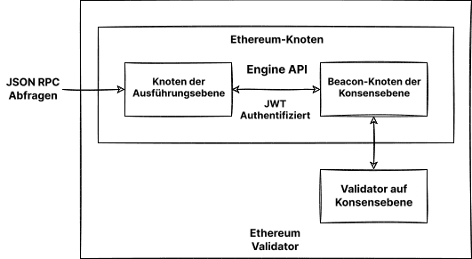

Der Betrieb eines eigenen Knotens bietet Ihnen verschiedene Vorteile, eröffnet neue Möglichkeiten und hilft, das Ökosystem zu unterstützen. Diese Seite führt Sie durch die Einrichtung Ihres eigenen Knotens und die Teilnahme an der Validierung von [Ethereum](/)-Transaktionen.

Beachten Sie, dass nach [dem Merge](/roadmap/merge) zwei Clients erforderlich sind, um einen Ethereum-Knoten zu betreiben: ein Client für die **Ausführungsschicht (EL)** und ein Client für die **Konsensschicht (CL)**. Diese Seite zeigt, wie man diese beiden Clients installiert, konfiguriert und verbindet, um einen Ethereum-Knoten zu betreiben.

## Voraussetzungen {#prerequisites}

Sie sollten verstehen, was ein Ethereum-Knoten ist und warum Sie einen Client betreiben möchten. Dies wird unter [Knoten und Clients](/developers/docs/nodes-and-clients/) behandelt.

Wenn das Thema des Betriebs eines Knotens neu für Sie ist oder Sie nach einem weniger technischen Weg suchen, empfehlen wir Ihnen, sich zuerst unsere benutzerfreundliche Einführung zum [Betrieb eines Ethereum-Knotens](/run-a-node) anzusehen.

## Wahl eines Ansatzes {#choosing-approach}

Der erste Schritt beim Starten Ihres Knotens ist die Wahl Ihres Ansatzes. Basierend auf den Anforderungen und verschiedenen Möglichkeiten müssen Sie die Client-Implementierung (sowohl für Ausführungs- als auch für Konsens-Clients), die Umgebung (Hardware, System) und die Parameter für die Client-Einstellungen auswählen.

Diese Seite führt Sie durch diese Entscheidungen und hilft Ihnen, den am besten geeigneten Weg zum Betrieb Ihrer Ethereum-Instanz zu finden.

Um aus den Client-Implementierungen auszuwählen, sehen Sie sich alle verfügbaren Mainnet-bereiten [Ausführungsclients](/developers/docs/nodes-and-clients/#execution-clients) und [Konsens-Clients](/developers/docs/nodes-and-clients/#consensus-clients) an und erfahren Sie mehr über [Client-Diversität](/developers/docs/nodes-and-clients/client-diversity).

Entscheiden Sie, ob Sie die Software auf Ihrer eigenen [Hardware oder in der Cloud](#local-vs-cloud) ausführen möchten, unter Berücksichtigung der [Anforderungen](#requirements) der Clients.

Nach der Vorbereitung der Umgebung installieren Sie die ausgewählten Clients entweder über eine [anfängerfreundliche Oberfläche](#automatized-setup) oder [manuell](#manual-setup) über ein Terminal mit erweiterten Optionen.

Wenn der Knoten läuft und die Synchronisierung durchführt, sind Sie bereit, ihn zu [nutzen](#using-the-node), aber achten Sie darauf, seine [Wartung](#operating-the-node) im Auge zu behalten.



### Umgebung und Hardware {#environment-and-hardware}

#### Lokal oder Cloud {#local-vs-cloud}

Ethereum-Clients können auf handelsüblichen Computern ausgeführt werden und erfordern keine spezielle Hardware, wie zum Beispiel Mining-Maschinen. Daher haben Sie je nach Ihren Bedürfnissen verschiedene Optionen für die Bereitstellung des Knotens.
Zur Vereinfachung betrachten wir den Betrieb eines Knotens sowohl auf einer lokalen physischen Maschine als auch auf einem Cloud-Server:

- Cloud
  - Anbieter bieten eine hohe Serververfügbarkeit und statische öffentliche IP-Adressen.
  - Einen dedizierten oder virtuellen Server zu mieten, kann bequemer sein, als einen eigenen zu bauen.
  - Der Kompromiss besteht darin, einem Dritten – dem Serveranbieter – vertrauen zu müssen.
  - Aufgrund der erforderlichen Speichergröße für einen Full Node kann der Preis für einen gemieteten Server hoch werden.
- Eigene Hardware
  - Ein vertrauensloserer und souveränerer Ansatz.
  - Einmalige Investition.
  - Die Möglichkeit, vorkonfigurierte Maschinen zu kaufen.
  - Sie müssen die Maschine und das Netzwerk physisch vorbereiten, warten und möglicherweise Fehler beheben.

Beide Optionen haben unterschiedliche Vorteile, die oben zusammengefasst sind. Wenn Sie nach einer Cloud-Lösung suchen, gibt es neben vielen traditionellen Cloud-Computing-Anbietern auch Dienste, die sich auf die Bereitstellung von Knoten konzentrieren. Sehen Sie sich [Knoten als Dienstleistung (Nodes as a Service)](/developers/docs/nodes-and-clients/nodes-as-a-service/) für weitere Optionen zu gehosteten Knoten an.

#### Hardware {#hardware}

Ein zensurresistentes, dezentrales Netzwerk sollte sich jedoch nicht auf Cloud-Anbieter verlassen. Stattdessen ist der Betrieb Ihres Knotens auf Ihrer eigenen lokalen Hardware gesünder für das Ökosystem. [Schätzungen](https://www.ethernodes.org/networkType/cl/Hosting) zeigen, dass ein großer Teil der Knoten in der Cloud läuft, was zu einem Single Point of Failure (einzelner Ausfallpunkt) werden könnte.

Ethereum-Clients können auf Ihrem Computer, Laptop, Server oder sogar einem Einplatinencomputer ausgeführt werden. Obwohl die Ausführung von Clients auf Ihrem PC möglich ist, kann eine dedizierte Maschine nur für Ihren Knoten dessen Leistung und Sicherheit erheblich verbessern und gleichzeitig die Auswirkungen auf Ihren Hauptcomputer minimieren.

Die Verwendung eigener Hardware kann sehr einfach sein. Es gibt viele einfache Optionen sowie fortgeschrittene Setups für technisch versiertere Personen. Schauen wir uns also die Anforderungen und Mittel für den Betrieb von Ethereum-Clients auf Ihrer Maschine an.

#### Anforderungen {#requirements}

Die Hardwareanforderungen unterscheiden sich je nach Client, sind aber im Allgemeinen nicht so hoch, da der Knoten nur synchronisiert bleiben muss. Verwechseln Sie dies nicht mit Mining, das viel mehr Rechenleistung erfordert. Die Synchronisierungszeit und Leistung verbessern sich jedoch mit leistungsfähigerer Hardware.

Bevor Sie einen Client installieren, stellen Sie bitte sicher, dass Ihr Computer über genügend Ressourcen verfügt, um ihn auszuführen. Die minimalen und empfohlenen Anforderungen finden Sie unten.

Der Engpass für Ihre Hardware ist meistens der Speicherplatz. Die Synchronisierung der Ethereum-Blockchain ist sehr ein-/ausgabeintensiv und erfordert viel Platz. Am besten ist es, ein **Solid-State-Laufwerk (SSD)** mit Hunderten von GB freiem Speicherplatz zu haben, der auch nach der Synchronisierung noch zur Verfügung steht.

Die Größe der Datenbank und die Geschwindigkeit der anfänglichen Synchronisierung hängen vom gewählten Client, seiner Konfiguration und der [Synchronisierungsstrategie](/developers/docs/nodes-and-clients/#sync-modes) ab.

Stellen Sie außerdem sicher, dass Ihre Internetverbindung nicht durch eine [Bandbreitenbegrenzung](https://wikipedia.org/wiki/Data_cap) eingeschränkt ist. Es wird empfohlen, eine unbegrenzte Verbindung zu verwenden, da die anfängliche Synchronisierung und die an das Netzwerk gesendeten Daten Ihr Limit überschreiten könnten.

##### Betriebssystem
Alle Clients unterstützen die gängigen Betriebssysteme – Linux, macOS, Windows. Das bedeutet, dass Sie Knoten auf normalen Desktop- oder Servermaschinen mit dem Betriebssystem (OS) ausführen können, das Ihnen am besten passt. Stellen Sie sicher, dass Ihr Betriebssystem auf dem neuesten Stand ist, um mögliche Probleme und Sicherheitslücken zu vermeiden.

##### Mindestanforderungen
- CPU mit 2+ Kernen
- 8 GB RAM
- 2 TB SSD
- 10+ MBit/s Bandbreite

##### Empfohlene Spezifikationen
- Schnelle CPU mit 4+ Kernen
- 16 GB+ RAM
- Schnelle SSD mit 2+ TB
- 25+ MBit/s Bandbreite

Der von Ihnen gewählte Synchronisierungsmodus und Client wirken sich auf den Speicherbedarf aus, aber wir haben den für jeden Client benötigten Speicherplatz unten geschätzt.

| Client     | Speichergröße (Snap-Synchronisierung) | Speichergröße (vollständiges Archiv) |
| ---------- | ------------------------------------- | ------------------------------------ |
| Besu       | 800 GB+                               | 12 TB+                               |
| Erigon     | N/A                                   | 2,5 TB+                              |
| Geth       | 500 GB+                               | 12 TB+                               |
| Nethermind | 500 GB+                               | 12 TB+                               |
| Reth       | N/A                                   | 2,2 TB+                              |

- Hinweis: Erigon und Reth bieten keine Snap-Synchronisierung an, aber vollständiges Pruning (Full Pruning) ist möglich (\~2 TB für Erigon, ~1,2 TB für Reth).

Für Konsens-Clients hängt der Speicherbedarf auch von der Client-Implementierung und den aktivierten Funktionen (z. B. Validator-Slasher) ab, aber rechnen Sie im Allgemeinen mit weiteren 200 GB, die für Beacon-Daten benötigt werden. Bei einer großen Anzahl von Validatoren steigt auch die Bandbreitenbelastung. Sie finden [Details zu den Anforderungen an Konsens-Clients in dieser Analyse](https://mirror.xyz/0x934e6B4D7eee305F8C9C42b46D6EEA09CcFd5EDc/b69LBy8p5UhcGJqUAmT22dpvdkU-Pulg2inrhoS9Mbc).

#### Plug-and-Play-Lösungen {#plug-and-play}

Die einfachste Option für den Betrieb eines Knotens mit eigener Hardware ist die Verwendung von Plug-and-Play-Boxen. Vorkonfigurierte Maschinen von Anbietern bieten die unkomplizierteste Erfahrung: bestellen, anschließen, ausführen. Alles ist vorkonfiguriert und läuft automatisch mit einer intuitiven Anleitung und einem Dashboard zur Überwachung und Steuerung der Software.

- [DAppNode](https://dappnode.io/)
- [Avado](https://ava.do/)

#### Ethereum auf einem Einplatinencomputer {#ethereum-on-a-single-board-computer}

Eine einfache und günstige Möglichkeit, einen Ethereum-Knoten zu betreiben, ist die Verwendung eines Einplatinencomputers, sogar mit einer ARM-Architektur wie dem Raspberry Pi. [Ethereum on ARM](https://ethereum-on-arm-documentation.readthedocs.io/en/latest/) bietet einfach auszuführende Images mehrerer Ausführungs- und Konsens-Clients für Raspberry Pi und andere ARM-Boards.

Kleine, erschwingliche und effiziente Geräte wie diese sind ideal für den Betrieb eines Knotens zu Hause, aber denken Sie an ihre begrenzte Leistung.

## Starten des Knotens {#spinning-up-node}

Die eigentliche Client-Einrichtung kann entweder mit automatisierten Launchern oder manuell durch direkte Einrichtung der Client-Software erfolgen.

Für weniger fortgeschrittene Benutzer ist der empfohlene Ansatz die Verwendung eines Launchers, einer Software, die Sie durch die Installation führt und den Client-Einrichtungsprozess automatisiert. Wenn Sie jedoch etwas Erfahrung mit der Verwendung eines Terminals haben, sollten die Schritte für die manuelle Einrichtung einfach zu befolgen sein.

### Geführtes Setup {#automatized-setup}

Mehrere benutzerfreundliche Projekte zielen darauf ab, die Erfahrung bei der Einrichtung eines Clients zu verbessern. Diese Launcher bieten eine automatische Client-Installation und -Konfiguration, wobei einige sogar eine grafische Oberfläche für die geführte Einrichtung und Überwachung von Clients bieten.

Im Folgenden finden Sie einige Projekte, die Ihnen helfen können, Clients mit nur wenigen Klicks zu installieren und zu steuern:

- [DAppNode](https://docs.dappnode.io/docs/user/getting-started/choose-your-path) - DAppNode wird nicht nur mit einer Maschine von einem Anbieter geliefert. Die Software, der eigentliche Knoten-Launcher und das Kontrollzentrum mit vielen Funktionen können auf beliebiger Hardware verwendet werden.
- [EthPillar](https://www.coincashew.com/coins/overview-eth/ethpillar) - Der schnellste und einfachste Weg, einen Full Node einzurichten. Einzeiliges Setup-Tool und Knoten-Management-TUI. Kostenlos. Open Source. Öffentliche Güter für Ethereum von Solo-Stakern. Unterstützung für ARM64 und AMD64.
- [eth-docker](https://eth-docker.net/) - Automatisiertes Setup mit Docker, das sich auf einfaches und sicheres Staking konzentriert, erfordert grundlegende Terminal- und Docker-Kenntnisse, empfohlen für etwas fortgeschrittenere Benutzer.
- [Stereum](https://stereum-dev.github.io/ethereum-node-web-docs) - Launcher zur Installation von Clients auf einem Remote-Server über eine SSH-Verbindung mit einer GUI-Einrichtungsanleitung, einem Kontrollzentrum und vielen weiteren Funktionen.
- [Sedge](https://docs.sedge.nethermind.io/docs/intro) - Knoten-Setup-Tool, das mithilfe eines CLI-Assistenten automatisch eine Docker-Konfiguration generiert. Geschrieben in Go von Nethermind.
- [Chainstack Self-Hosted](https://docs.chainstack.com/docs/self-hosted/introduction) - Web-UI und CLI für die Bereitstellung von Ausführungs- und Konsens-Clients auf Kubernetes. Snapshot-Bootstrap und integriertes Monitoring inklusive. Kostenlos. Kein Chainstack-Konto erforderlich. Entwickelt von Chainstack.

### Manuelle Client-Einrichtung {#manual-setup}

Die andere Option besteht darin, die Client-Software manuell herunterzuladen, zu verifizieren und zu konfigurieren. Auch wenn einige Clients eine grafische Oberfläche bieten, erfordert eine manuelle Einrichtung dennoch grundlegende Kenntnisse im Umgang mit dem Terminal, bietet aber viel mehr Vielseitigkeit.

Wie bereits erklärt, erfordert die Einrichtung Ihres eigenen Ethereum-Knotens den Betrieb eines Paares aus Konsens- und Ausführungsclients. Einige Clients enthalten möglicherweise einen Light-Client der anderen Art und synchronisieren sich, ohne dass weitere Software benötigt wird. Eine vollständige vertrauenslose Verifizierung erfordert jedoch beide Implementierungen.

#### Beziehen der Client-Software {#getting-the-client}

Zuerst müssen Sie Ihre bevorzugte [Ausführungsclient](/developers/docs/nodes-and-clients/#execution-clients)- und [Konsens-Client](/developers/docs/nodes-and-clients/#consensus-clients)-Software beziehen.

Sie können einfach eine ausführbare Anwendung oder ein Installationspaket herunterladen, das zu Ihrem Betriebssystem und Ihrer Architektur passt. Überprüfen Sie immer die Signaturen und Prüfsummen der heruntergeladenen Pakete. Einige Clients bieten auch Repositories oder Docker-Images für eine einfachere Installation und Updates an. Alle Clients sind Open Source, sodass Sie sie auch aus dem Quellcode kompilieren können. Dies ist eine fortgeschrittenere Methode, die jedoch in einigen Fällen erforderlich sein kann.

Anweisungen zur Installation jedes Clients finden Sie in der Dokumentation, die in den obigen Client-Listen verlinkt ist.

Hier sind die Release-Seiten der Clients, auf denen Sie deren vorkompilierte Binärdateien oder Installationsanweisungen finden können:

##### Ausführungsclients
- [Besu](https://github.com/hyperledger/besu/releases)
- [Erigon](https://github.com/ledgerwatch/erigon/releases)
- [Geth](https://geth.ethereum.org/downloads)
- [Nethermind](https://downloads.nethermind.io/)
- [Reth](https://reth.rs/installation/installation.html)

Es ist auch erwähnenswert, dass die Client-Diversität ein [Problem auf der Ausführungsschicht](/developers/docs/nodes-and-clients/client-diversity/#execution-layer) ist. Es wird empfohlen, dass Leser in Erwägung ziehen, einen Minderheits-Ausführungsclient zu betreiben.

##### Konsens-Clients
- [Lighthouse](https://github.com/sigp/lighthouse/releases/latest)
- [Lodestar](https://chainsafe.github.io/lodestar/run/getting-started/installation#build-from-source/) (Bietet keine vorkompilierte Binärdatei, nur ein Docker-Image oder muss aus dem Quellcode kompiliert werden)
- [Nimbus](https://github.com/status-im/nimbus-eth2/releases/latest)
- [Prysm](https://github.com/prysmaticlabs/prysm/releases/latest)
- [Teku](https://github.com/ConsenSys/teku/releases)

[Client-Diversität](/developers/docs/nodes-and-clients/client-diversity/) ist entscheidend für Konsens-Knoten, die Validatoren betreiben. Wenn die Mehrheit der Validatoren eine einzige Client-Implementierung ausführt, ist die Netzwerksicherheit gefährdet. Es wird daher empfohlen, die Wahl eines Minderheits-Clients in Betracht zu ziehen.

[Sehen Sie sich die aktuelle Nutzung der Netzwerk-Clients an](https://clientdiversity.org/) und erfahren Sie mehr über [Client-Diversität](/developers/docs/nodes-and-clients/client-diversity).

##### Überprüfen der Software
Beim Herunterladen von Software aus dem Internet wird empfohlen, deren Integrität zu überprüfen. Dieser Schritt ist optional, aber besonders bei einem so wichtigen Infrastrukturteil wie dem Ethereum-Client ist es wichtig, sich potenzieller Angriffsvektoren bewusst zu sein und diese zu vermeiden. Wenn Sie eine vorkompilierte Binärdatei heruntergeladen haben, müssen Sie ihr vertrauen und riskieren, dass ein Angreifer die ausführbare Datei gegen eine bösartige austauschen könnte.

Entwickler signieren veröffentlichte Binärdateien mit ihren PGP-Schlüsseln, sodass Sie kryptografisch überprüfen können, ob Sie genau die von ihnen erstellte Software ausführen. Sie müssen lediglich die von den Entwicklern verwendeten öffentlichen Schlüssel beziehen, die auf den Release-Seiten der Clients oder in der Dokumentation zu finden sind. Nach dem Herunterladen des Client-Releases und seiner Signatur können Sie eine PGP-Implementierung, z. B. [GnuPG](https://gnupg.org/download/index.html), verwenden, um diese einfach zu überprüfen. Sehen Sie sich ein Tutorial zur Überprüfung von Open-Source-Software mit `gpg` unter [Linux](https://www.tecmint.com/verify-pgp-signature-downloaded-software/) oder [Windows/macOS](https://freedom.press/training/verifying-open-source-software/) an.

Eine weitere Form der Überprüfung besteht darin, sicherzustellen, dass der Hash, ein eindeutiger kryptografischer Fingerabdruck, der heruntergeladenen Software mit dem von den Entwicklern bereitgestellten übereinstimmt. Dies ist noch einfacher als die Verwendung von PGP, und einige Clients bieten nur diese Option an. Führen Sie einfach die Hashfunktion auf der heruntergeladenen Software aus und vergleichen Sie sie mit der auf der Release-Seite. Zum Beispiel:

```sh
sha256sum teku-22.6.1.tar.gz

9b2f8c1f8d4dab0404ce70ea314ff4b3c77e9d27aff9d1e4c1933a5439767dde
```

#### Client-Einrichtung {#client-setup}

Nach der Installation, dem Herunterladen oder der Kompilierung der Client-Software sind Sie bereit, sie auszuführen. Das bedeutet nur, dass sie mit der richtigen Konfiguration ausgeführt werden muss. Clients bieten umfangreiche Konfigurationsoptionen, die verschiedene Funktionen aktivieren können.

Beginnen wir mit Optionen, die die Client-Leistung und Datennutzung erheblich beeinflussen können. [Synchronisierungsmodi](/developers/docs/nodes-and-clients/#sync-modes) stellen verschiedene Methoden zum Herunterladen und Validieren von Blockchain-Daten dar. Bevor Sie den Knoten starten, sollten Sie entscheiden, welches Netzwerk und welchen Synchronisierungsmodus Sie verwenden möchten. Die wichtigsten Dinge, die Sie berücksichtigen sollten, sind der Speicherplatz und die Synchronisierungszeit, die der Client benötigt. Achten Sie auf die Dokumentation des Clients, um festzustellen, welcher Synchronisierungsmodus der Standard ist. Wenn Ihnen dieser nicht zusagt, wählen Sie einen anderen basierend auf dem Sicherheitsniveau, den verfügbaren Daten und den Kosten. Abgesehen vom Synchronisierungsalgorithmus können Sie auch das Pruning (Bereinigen) verschiedener Arten von alten Daten einstellen. Pruning ermöglicht das Löschen veralteter Daten, d. h. das Entfernen von Zustands-Trie-Knoten, die von aktuellen Blöcken aus nicht erreichbar sind.

Weitere grundlegende Konfigurationsoptionen sind z. B. die Auswahl eines Netzwerks – Mainnet oder Testnetze, die Aktivierung des HTTP-Endpunkts für RPC oder WebSockets usw. Sie finden alle Funktionen und Optionen in der Dokumentation des Clients. Verschiedene Client-Konfigurationen können festgelegt werden, indem der Client mit den entsprechenden Flags direkt in der CLI oder der Konfigurationsdatei ausgeführt wird. Jeder Client ist ein wenig anders; bitte beziehen Sie sich immer auf seine offizielle Dokumentation oder Hilfeseite für Details zu den Konfigurationsoptionen.

Zu Testzwecken ziehen Sie es möglicherweise vor, einen Client in einem der Testnetze auszuführen. [Siehe Übersicht der unterstützten Netzwerke](/developers/docs/nodes-and-clients/#execution-clients).

Beispiele für die Ausführung von Ausführungsclients mit grundlegender Konfiguration finden Sie im nächsten Abschnitt.

#### Starten des Ausführungsclients {#starting-the-execution-client}

Bevor Sie die Ethereum-Client-Software starten, führen Sie eine letzte Überprüfung durch, ob Ihre Umgebung bereit ist. Stellen Sie beispielsweise sicher:

- Es ist genügend Speicherplatz vorhanden, unter Berücksichtigung des gewählten Netzwerks und Synchronisierungsmodus.
- Arbeitsspeicher und CPU werden nicht durch andere Programme blockiert.
- Das Betriebssystem ist auf die neueste Version aktualisiert.
- Das System hat die richtige Uhrzeit und das richtige Datum.
- Ihr Router und Ihre Firewall akzeptieren Verbindungen auf den Listening-Ports. Standardmäßig verwenden Ethereum-Clients einen Listener-Port (TCP) und einen Erkennungs-Port (UDP), beide standardmäßig auf 30303.

Führen Sie Ihren Client zuerst in einem Testnetz aus, um sicherzustellen, dass alles korrekt funktioniert.

Sie müssen alle Client-Einstellungen, die nicht dem Standard entsprechen, beim Start deklarieren. Sie können Flags oder die Konfigurationsdatei verwenden, um Ihre bevorzugte Konfiguration zu deklarieren. Der Funktionsumfang und die Konfigurationssyntax jedes Clients unterscheiden sich. Sehen Sie sich die Dokumentation Ihres Clients für die Besonderheiten an.

Ausführungs- und Konsens-Clients kommunizieren über einen authentifizierten Endpunkt, der in der [Engine API](https://github.com/ethereum/execution-apis/tree/main/src/engine) spezifiziert ist. Um sich mit einem Konsens-Client zu verbinden, muss der Ausführungsclient ein [`jwtsecret`](https://jwt.io/) an einem bekannten Pfad generieren. Aus Sicherheits- und Stabilitätsgründen sollten Clients auf derselben Maschine laufen, und beide Clients müssen diesen Pfad kennen, da er zur Authentifizierung einer lokalen RPC-Verbindung zwischen ihnen verwendet wird. Der Ausführungsclient muss außerdem einen Listening-Port für authentifizierte APIs definieren.

Dieses Token wird automatisch von der Client-Software generiert, aber in einigen Fällen müssen Sie dies möglicherweise selbst tun. Sie können es mit [OpenSSL](https://www.openssl.org/) generieren:

```sh
openssl rand -hex 32 > jwtsecret
```

#### Ausführen eines Ausführungsclients {#running-an-execution-client}

Dieser Abschnitt führt Sie durch das Starten von Ausführungsclients. Er dient nur als Beispiel für eine grundlegende Konfiguration, die den Client mit diesen Einstellungen startet:

- Gibt das Netzwerk an, mit dem eine Verbindung hergestellt werden soll, in unseren Beispielen das Mainnet.
  - Sie können stattdessen [eines der Testnetze](/developers/docs/networks/) für vorläufige Tests Ihres Setups auswählen.
- Definiert das Datenverzeichnis, in dem alle Daten einschließlich der Blockchain gespeichert werden.
  - Stellen Sie sicher, dass Sie den Pfad durch einen echten ersetzen, der z. B. auf Ihr externes Laufwerk verweist.
- Aktiviert Schnittstellen für die Kommunikation mit dem Client.
  - Einschließlich JSON-RPC und Engine API für die Kommunikation mit dem Konsens-Client.
- Definiert den Pfad zu `jwtsecret` für die authentifizierte API.
  - Stellen Sie sicher, dass Sie den Beispielpfad durch einen echten ersetzen, auf den Clients zugreifen können, z. B. `/tmp/jwtsecret`.

Bitte denken Sie daran, dass dies nur ein grundlegendes Beispiel ist, alle anderen Einstellungen werden auf die Standardwerte gesetzt. Achten Sie auf die Dokumentation jedes Clients, um mehr über Standardwerte, Einstellungen und Funktionen zu erfahren. Für weitere Funktionen, zum Beispiel für den Betrieb von Validatoren, Monitoring usw., beziehen Sie sich bitte auf die Dokumentation des jeweiligen Clients.

> Beachten Sie, dass Backslashes `\` in Beispielen nur Formatierungszwecken dienen; Konfigurations-Flags können in einer einzigen Zeile definiert werden.

##### Ausführen von Besu
Dieses Beispiel startet Besu im Mainnet, speichert Blockchain-Daten im Standardformat unter `/data/ethereum`, aktiviert JSON-RPC und Engine RPC für die Verbindung des Konsens-Clients. Die Engine API wird mit dem Token `jwtsecret` authentifiziert und es sind nur Aufrufe von `localhost` erlaubt.

```sh
besu --network=mainnet \
    --data-path=/data/ethereum \
    --rpc-http-enabled=true \
    --engine-rpc-enabled=true \
    --engine-host-allowlist="*" \
    --engine-jwt-enabled=true \
    --engine-jwt-secret=/path/to/jwtsecret
```

Besu bietet auch eine Launcher-Option, die eine Reihe von Fragen stellt und die Konfigurationsdatei generiert. Führen Sie den interaktiven Launcher aus mit:

```sh
besu --Xlauncher
```

Die [Dokumentation von Besu](https://besu.hyperledger.org/public-networks/get-started/start-node/) enthält zusätzliche Optionen und Konfigurationsdetails.

##### Ausführen von Erigon
Dieses Beispiel startet Erigon im Mainnet, speichert Blockchain-Daten unter `/data/ethereum`, aktiviert JSON-RPC, definiert, welche Namespaces erlaubt sind, und aktiviert die Authentifizierung für die Verbindung des Konsens-Clients, die durch den Pfad `jwtsecret` definiert ist.

```sh
erigon --chain mainnet \
    --datadir /data/ethereum  \
    --http --http.api=engine,eth,web3,net \
    --authrpc.jwtsecret=/path/to/jwtsecret
```

Erigon führt standardmäßig eine vollständige Synchronisierung mit 8 GB HDD durch, was zu mehr als 2 TB Archivdaten führt. Stellen Sie sicher, dass `datadir` auf eine Festplatte mit ausreichend freiem Speicherplatz verweist, oder sehen Sie sich das Flag `--prune` an, das verschiedene Arten von Daten trimmen kann. Überprüfen Sie die `--help` von Erigon, um mehr zu erfahren.

##### Ausführen von Geth
Dieses Beispiel startet Geth im Mainnet, speichert Blockchain-Daten unter `/data/ethereum`, aktiviert JSON-RPC und definiert, welche Namespaces erlaubt sind. Es aktiviert auch die Authentifizierung für die Verbindung des Konsens-Clients, was den Pfad zu `jwtsecret` erfordert, sowie eine Option, die definiert, welche Verbindungen erlaubt sind, in unserem Beispiel nur von `localhost`.

```sh
geth --mainnet \
    --datadir "/data/ethereum" \
    --http --authrpc.addr localhost \
    --authrpc.vhosts="localhost" \
    --authrpc.port 8551
    --authrpc.jwtsecret=/path/to/jwtsecret
```

Sehen Sie sich die [Dokumentation für alle Konfigurationsoptionen](https://geth.ethereum.org/docs/fundamentals/command-line-options) an und erfahren Sie mehr über den [Betrieb von Geth mit einem Konsens-Client](https://geth.ethereum.org/docs/getting-started/consensus-clients).

##### Ausführen von Nethermind
Nethermind bietet verschiedene [Installationsoptionen](https://docs.nethermind.io/get-started/installing-nethermind). Das Paket enthält verschiedene Binärdateien, einschließlich eines Launchers mit einem geführten Setup, der Ihnen hilft, die Konfiguration interaktiv zu erstellen. Alternativ finden Sie den Runner, der die ausführbare Datei selbst ist und den Sie einfach mit Konfigurations-Flags ausführen können. JSON-RPC ist standardmäßig aktiviert.

```sh
Nethermind.Runner --config mainnet \
    --datadir /data/ethereum \
    --JsonRpc.JwtSecretFile=/path/to/jwtsecret
```

Die Nethermind-Dokumentation bietet eine [vollständige Anleitung](https://docs.nethermind.io/get-started/running-node/) zum Betrieb von Nethermind mit einem Konsens-Client.

Ein Ausführungsclient initiiert seine Kernfunktionen, die ausgewählten Endpunkte und beginnt mit der Suche nach Peers. Nach der erfolgreichen Erkennung von Peers beginnt der Client mit der Synchronisierung. Der Ausführungsclient wartet auf eine Verbindung vom Konsens-Client. Aktuelle Blockchain-Daten sind verfügbar, sobald der Client erfolgreich auf den aktuellen Zustand synchronisiert ist.

##### Ausführen von Reth
Dieses Beispiel startet Reth im Mainnet unter Verwendung des Standard-Speicherorts für Daten. Es aktiviert JSON-RPC und die Engine-RPC-Authentifizierung für die Verbindung des Konsens-Clients, die durch den Pfad `jwtsecret` definiert ist, wobei nur Aufrufe von `localhost` erlaubt sind.

```sh
reth node \
    --authrpc.jwtsecret /path/to/jwtsecret \
    --authrpc.addr 127.0.0.1 \
    --authrpc.port 8551
```

Siehe [Konfiguration von Reth](https://reth.rs/run/config.html?highlight=data%20directory#configuring-reth), um mehr über Standard-Datenverzeichnisse zu erfahren. Die [Dokumentation von Reth](https://reth.rs/run/mainnet.html) enthält zusätzliche Optionen und Konfigurationsdetails.

#### Starten des Konsens-Clients {#starting-the-consensus-client}

Der Konsens-Client muss mit der richtigen Port-Konfiguration gestartet werden, um eine lokale RPC-Verbindung zum Ausführungsclient herzustellen. Die Konsens-Clients müssen mit dem freigegebenen Port des Ausführungsclients als Konfigurationsargument ausgeführt werden.

Der Konsens-Client benötigt außerdem den Pfad zum `jwt-secret` des Ausführungsclients, um die RPC-Verbindung zwischen ihnen zu authentifizieren. Ähnlich wie bei den obigen Ausführungsbeispielen hat jeder Konsens-Client ein Konfigurations-Flag, das den Dateipfad des JWT-Tokens als Argument annimmt. Dies muss mit dem Pfad `jwtsecret` übereinstimmen, der dem Ausführungsclient bereitgestellt wurde.

Wenn Sie planen, einen Validator zu betreiben, stellen Sie sicher, dass Sie ein Konfigurations-Flag hinzufügen, das die Ethereum-Adresse des Gebührenempfängers (Fee Recipient) angibt. Hier sammeln sich die Ether-Belohnungen für Ihren Validator an. Jeder Konsens-Client hat eine Option, z. B. `--suggested-fee-recipient=0xabcd1`, die eine Ethereum-Adresse als Argument annimmt.

Wenn Sie einen Beacon-Knoten in einem Testnetz starten, können Sie durch die Verwendung eines öffentlichen Endpunkts für die [Checkpoint-Synchronisierung](https://notes.ethereum.org/@launchpad/checkpoint-sync) erheblich Synchronisierungszeit sparen.

#### Ausführen eines Konsens-Clients {#running-a-consensus-client}

##### Ausführen von Lighthouse
Bevor Sie Lighthouse ausführen, erfahren Sie im [Lighthouse Book](https://lighthouse-book.sigmaprime.io/installation.html) mehr darüber, wie Sie es installieren und konfigurieren.

```sh
lighthouse beacon_node \
    --network mainnet \
    --datadir /data/ethereum \
    --http \
    --execution-endpoint http://127.0.0.1:8551 \
    --execution-jwt /path/to/jwtsecret
```

##### Ausführen von Lodestar
Installieren Sie die Lodestar-Software, indem Sie sie kompilieren oder das Docker-Image herunterladen. Erfahren Sie mehr in der [Dokumentation](https://chainsafe.github.io/lodestar/) und der umfassenderen [Einrichtungsanleitung](https://hackmd.io/@philknows/rk5cDvKmK).

```sh
lodestar beacon \
    --dataDir="/data/ethereum" \
    --network=mainnet \
    --eth1.enabled=true \
    --execution.urls="http://127.0.0.1:8551" \
    --jwt-secret="/path/to/jwtsecret"
```

##### Ausführen von Nimbus
Nimbus wird sowohl mit Konsens- als auch mit Ausführungsclients geliefert. Es kann auf verschiedenen Geräten ausgeführt werden, selbst mit sehr bescheidener Rechenleistung.
Nach der [Installation der Abhängigkeiten und von Nimbus selbst](https://nimbus.guide/quick-start.html) können Sie seinen Konsens-Client ausführen:

```sh
nimbus_beacon_node \
    --network=mainnet \
    --web3-url=http://127.0.0.1:8551 \
    --rest \
    --jwt-secret="/path/to/jwtsecret"
```

##### Ausführen von Prysm
Prysm wird mit einem Skript geliefert, das eine einfache automatische Installation ermöglicht. Details finden Sie in der [Prysm-Dokumentation](https://prysm.offchainlabs.com/docs/install-prysm/install-with-script/).

```sh
./prysm.sh beacon-chain \
    --mainnet \
    --datadir /data/ethereum  \
    --execution-endpoint=http://localhost:8551  \
    --jwt-secret=/path/to/jwtsecret
```

##### Ausführen von Teku
```sh
teku --network mainnet \
    --data-path "/data/ethereum" \
    --ee-endpoint http://localhost:8551 \
    --ee-jwt-secret-file "/path/to/jwtsecret"
```

Wenn sich ein Konsens-Client mit dem Ausführungsclient verbindet, um den Einzahlungsvertrag zu lesen und Validatoren zu identifizieren, verbindet er sich auch mit anderen Beacon-Knoten-Peers und beginnt mit der Synchronisierung von Konsens-Slots ab Genesis. Sobald der Beacon-Knoten die aktuelle Epoche erreicht, wird die Beacon-API für Ihre Validatoren nutzbar. Erfahren Sie mehr über [Beacon-Knoten-APIs](https://ethereum.github.io/beacon-APIs).

### Hinzufügen von Validatoren {#adding-validators}

Ein Konsens-Client dient als Beacon-Knoten, mit dem sich Validatoren verbinden können. Jeder Konsens-Client verfügt über eine eigene Validator-Software, die in der jeweiligen Dokumentation detailliert beschrieben ist.

Der Betrieb eines eigenen Validators ermöglicht [Solo Staking](/staking/solo/), die wirkungsvollste und vertrauensloseste Methode, um das Ethereum-Netzwerk zu unterstützen. Dies erfordert jedoch eine Einzahlung von 32 ETH. Um einen Validator auf Ihrem eigenen Knoten mit einem kleineren Betrag zu betreiben, könnte ein dezentraler Pool mit erlaubnisfreien Knotenbetreibern, wie z. B. [Rocket Pool](https://rocketpool.net/node-operators), für Sie von Interesse sein.

Der einfachste Weg, um mit dem Staking und der Generierung von Validator-Schlüsseln zu beginnen, ist die Verwendung des [Hoodi Testnet Staking Launchpad](https://hoodi.launchpad.ethereum.org/), mit dem Sie Ihr Setup testen können, indem Sie [Knoten auf Hoodi betreiben](https://notes.ethereum.org/@launchpad/hoodi). Wenn Sie bereit für das Mainnet sind, können Sie diese Schritte mit dem [Mainnet Staking Launchpad](https://launchpad.ethereum.org/) wiederholen.

Sehen Sie sich die [Staking-Seite](/staking) für einen Überblick über die Staking-Optionen an.

### Nutzung des Knotens {#using-the-node}

Ausführungsclients bieten [RPC-API-Endpunkte](/developers/docs/apis/json-rpc/), die Sie verwenden können, um Transaktionen einzureichen, mit Smart Contracts zu interagieren oder diese auf verschiedene Weise im Ethereum-Netzwerk bereitzustellen:

- Manuelles Aufrufen mit einem geeigneten Protokoll (z. B. mit `curl`)
- Anhängen einer bereitgestellten Konsole (z. B. `geth attach`)
- Implementierung in Anwendungen unter Verwendung von Web3-Bibliotheken, z. B. [Web3.py](https://web3py.readthedocs.io/en/stable/overview.html#overview), [ethers](https://github.com/ethers-io/ethers.js/)

Verschiedene Clients haben unterschiedliche Implementierungen der RPC-Endpunkte. Es gibt jedoch einen Standard-JSON-RPC, den Sie mit jedem Client verwenden können. Für einen Überblick [lesen Sie die JSON-RPC-Dokumentation](/developers/docs/apis/json-rpc/). Anwendungen, die Informationen aus dem Ethereum-Netzwerk benötigen, können diesen RPC verwenden. Zum Beispiel ermöglicht Ihnen die beliebte Wallet MetaMask, sich [mit Ihrem eigenen RPC-Endpunkt zu verbinden](https://metamask.zendesk.com/hc/en-us/articles/360015290012-Using-a-Local-Node), was starke Vorteile für die Privatsphäre und Sicherheit bietet.

Die Konsens-Clients stellen alle eine [Beacon-API](https://ethereum.github.io/beacon-APIs) bereit, die verwendet werden kann, um den Status des Konsens-Clients zu überprüfen oder Blöcke und Konsensdaten herunterzuladen, indem Anfragen mit Tools wie [Curl](https://curl.se) gesendet werden. Weitere Informationen hierzu finden Sie in der Dokumentation für jeden Konsens-Client.

#### Erreichen des RPC {#reaching-rpc}

Der Standard-Port für den Ausführungsclient-JSON-RPC ist `8545`, aber Sie können die Ports lokaler Endpunkte in der Konfiguration ändern. Standardmäßig ist die RPC-Schnittstelle nur auf dem Localhost Ihres Computers erreichbar. Um sie aus der Ferne zugänglich zu machen, möchten Sie sie möglicherweise der Öffentlichkeit zugänglich machen, indem Sie die Adresse in `0.0.0.0` ändern. Dadurch wird sie über das lokale Netzwerk und öffentliche IP-Adressen erreichbar. In den meisten Fällen müssen Sie auch eine Portweiterleitung auf Ihrem Router einrichten.

Gehen Sie bei der Freigabe von Ports für das Internet mit Vorsicht vor, da dies jedem im Internet ermöglicht, Ihren Knoten zu kontrollieren. Böswillige Akteure könnten auf Ihren Knoten zugreifen, um Ihr System zum Absturz zu bringen oder Ihr Geld zu stehlen, wenn Sie Ihren Client als Wallet verwenden.

Ein Weg, dies zu umgehen, besteht darin, zu verhindern, dass potenziell schädliche RPC-Methoden modifizierbar sind. Bei Geth können Sie beispielsweise modifizierbare Methoden mit einem Flag deklarieren: `--http.api web3,eth,txpool`.

Der Zugriff auf die RPC-Schnittstelle kann durch die Entwicklung von Edge-Layer-APIs oder Webserver-Anwendungen wie Nginx und deren Verbindung mit der lokalen Adresse und dem Port Ihres Clients erweitert werden. Die Nutzung einer mittleren Schicht kann Entwicklern auch die Möglichkeit geben, ein Zertifikat für sichere `https`-Verbindungen zur RPC-Schnittstelle einzurichten.

Die Einrichtung eines Webservers, eines Proxys oder einer nach außen gerichteten REST-API ist nicht die einzige Möglichkeit, Zugriff auf den RPC-Endpunkt Ihres Knotens zu gewähren. Eine weitere datenschutzfreundliche Möglichkeit, einen öffentlich erreichbaren Endpunkt einzurichten, besteht darin, den Knoten auf Ihrem eigenen [Tor](https://www.torproject.org/)-Onion-Service zu hosten. Dadurch können Sie den RPC außerhalb Ihres lokalen Netzwerks ohne eine statische öffentliche IP-Adresse oder geöffnete Ports erreichen. Die Verwendung dieser Konfiguration ermöglicht jedoch möglicherweise nur den Zugriff auf den RPC-Endpunkt über das Tor-Netzwerk, was nicht von allen Anwendungen unterstützt wird und zu Verbindungsproblemen führen kann.

Dazu müssen Sie Ihren eigenen [Onion-Service](https://community.torproject.org/onion-services/) erstellen. Sehen Sie sich [die Dokumentation](https://community.torproject.org/onion-services/setup/) zur Einrichtung von Onion-Services an, um Ihren eigenen zu hosten. Sie können ihn auf einen Webserver mit Proxy zum RPC-Port oder einfach direkt auf den RPC verweisen lassen.

Schließlich ist eine der beliebtesten Möglichkeiten, Zugriff auf interne Netzwerke zu gewähren, eine VPN-Verbindung. Abhängig von Ihrem Anwendungsfall und der Anzahl der Benutzer, die Zugriff auf Ihren Knoten benötigen, könnte eine sichere VPN-Verbindung eine Option sein. [OpenVPN](https://openvpn.net/) ist ein voll ausgestattetes SSL-VPN, das eine sichere Netzwerkerweiterung auf OSI-Schicht 2 oder 3 unter Verwendung des Industriestandards SSL/TLS-Protokoll implementiert, flexible Client-Authentifizierungsmethoden basierend auf Zertifikaten, Smartcards und/oder Benutzernamen/Passwort-Anmeldeinformationen unterstützt und benutzer- oder gruppenspezifische Zugriffssteuerungsrichtlinien mithilfe von Firewall-Regeln ermöglicht, die auf die virtuelle VPN-Schnittstelle angewendet werden.

### Betrieb des Knotens {#operating-the-node}

Sie sollten Ihren Knoten regelmäßig überwachen, um sicherzustellen, dass er ordnungsgemäß läuft. Möglicherweise müssen Sie gelegentlich Wartungsarbeiten durchführen.

#### Einen Knoten online halten {#keeping-node-online}

Ihr Knoten muss nicht ständig online sein, aber Sie sollten ihn so oft wie möglich online halten, um ihn mit dem Netzwerk synchron zu halten. Sie können ihn herunterfahren, um ihn neu zu starten, aber denken Sie daran, dass:

- Das Herunterfahren kann einige Minuten dauern, wenn der aktuelle Zustand noch auf die Festplatte geschrieben wird.
- Erzwungene Abschaltungen können die Datenbank beschädigen, sodass Sie den gesamten Knoten neu synchronisieren müssen.
- Ihr Client wird nicht mehr mit dem Netzwerk synchron sein und muss bei einem Neustart neu synchronisiert werden. Obwohl der Knoten die Synchronisierung dort beginnen kann, wo er zuletzt heruntergefahren wurde, kann der Prozess je nachdem, wie lange er offline war, einige Zeit in Anspruch nehmen.

_Dies gilt nicht für Validator-Knoten der Konsensschicht._ Wenn Sie Ihren Knoten offline nehmen, wirkt sich dies auf alle davon abhängigen Dienste aus. Wenn Sie einen Knoten für _Staking_-Zwecke betreiben, sollten Sie versuchen, die Ausfallzeit so weit wie möglich zu minimieren.

#### Erstellen von Client-Diensten {#creating-client-services}

Erwägen Sie die Erstellung eines Dienstes, um Ihre Clients beim Start automatisch auszuführen. Auf Linux-Servern wäre es beispielsweise eine gute Praxis, einen Dienst zu erstellen, z. B. mit `systemd`, der den Client mit der richtigen Konfiguration unter einem Benutzer mit eingeschränkten Rechten ausführt und automatisch neu startet.

#### Aktualisieren von Clients {#updating-clients}

Sie müssen Ihre Client-Software mit den neuesten Sicherheitspatches, Funktionen und [EIPs](/eips/) auf dem neuesten Stand halten. Stellen Sie insbesondere vor [Hard Forks](/ethereum-forks/) sicher, dass Sie die richtigen Client-Versionen ausführen.

> Vor wichtigen Netzwerk-Updates veröffentlicht die EF einen Beitrag auf ihrem [Blog](https://blog.ethereum.org). Sie können [diese Ankündigungen abonnieren](https://blog.ethereum.org/category/protocol#subscribe), um eine Benachrichtigung per E-Mail zu erhalten, wenn Ihr Knoten ein Update benötigt.

Das Aktualisieren von Clients ist sehr einfach. Jeder Client hat spezifische Anweisungen in seiner Dokumentation, aber der Prozess besteht im Allgemeinen nur darin, die neueste Version herunterzuladen und den Client mit der neuen ausführbaren Datei neu zu starten. Der Client sollte dort weitermachen, wo er aufgehört hat, jedoch mit den angewendeten Updates.

Jede Client-Implementierung verfügt über eine für Menschen lesbare Versionszeichenfolge, die im Peer-to-Peer-Protokoll verwendet wird, aber auch über die Befehlszeile zugänglich ist. Diese Versionszeichenfolge ermöglicht es Benutzern zu überprüfen, ob sie die richtige Version ausführen, und ermöglicht Block-Explorern und anderen Analysetools, die an der Quantifizierung der Verteilung bestimmter Clients im Netzwerk interessiert sind, dies zu tun. Weitere Informationen zu Versionszeichenfolgen finden Sie in der Dokumentation des jeweiligen Clients.

#### Ausführen zusätzlicher Dienste {#running-additional-services}

Der Betrieb eines eigenen Knotens ermöglicht es Ihnen, Dienste zu nutzen, die direkten Zugriff auf den Ethereum-Client-RPC erfordern. Dies sind Dienste, die auf Ethereum aufbauen, wie [Layer-2-Lösungen](/developers/docs/scaling/#layer-2-scaling), Backends für Wallets, Block-Explorer, Entwicklertools und andere Ethereum-Infrastruktur.

#### Überwachung des Knotens {#monitoring-the-node}

Um Ihren Knoten richtig zu überwachen, sollten Sie das Sammeln von Metriken in Betracht ziehen. Clients stellen Metrik-Endpunkte bereit, sodass Sie umfassende Daten über Ihren Knoten erhalten können. Verwenden Sie Tools wie [InfluxDB](https://www.influxdata.com/get-influxdb/) oder [Prometheus](https://prometheus.io/), um Datenbanken zu erstellen, die Sie in Software wie [Grafana](https://grafana.com/) in Visualisierungen und Diagramme umwandeln können. Es gibt viele Setups für die Verwendung dieser Software und verschiedene Grafana-Dashboards, mit denen Sie Ihren Knoten und das Netzwerk als Ganzes visualisieren können. Sehen Sie sich zum Beispiel das [Tutorial zur Überwachung von Geth](/developers/tutorials/monitoring-geth-with-influxdb-and-grafana/) an.

Achten Sie im Rahmen Ihrer Überwachung darauf, die Leistung Ihrer Maschine im Auge zu behalten. Während der anfänglichen Synchronisierung Ihres Knotens kann die Client-Software CPU und RAM stark beanspruchen. Zusätzlich zu Grafana können Sie die Tools verwenden, die Ihr Betriebssystem bietet, wie `htop` oder `uptime`, um dies zu tun.

## Weiterführende Literatur {#further-reading}

- [Ethereum-Staking-Leitfäden](https://github.com/SomerEsat/ethereum-staking-guides) - _Somer Esat, wird oft aktualisiert_
- [Leitfaden | Wie man einen Validator für Ethereum-Staking im Mainnet einrichtet](https://www.coincashew.com/coins/overview-eth/guide-or-how-to-setup-a-validator-on-eth2-mainnet) _– CoinCashew, wird oft aktualisiert_
- [ETHStaker-Leitfäden zum Betrieb von Validatoren in Testnetzen](https://github.com/remyroy/ethstaker#guides) – _ETHStaker, wird regelmäßig aktualisiert_
- [Beispiel-AWS-Blockchain-Node-Runner-App für Ethereum-Knoten](https://aws-samples.github.io/aws-blockchain-node-runners/docs/blueprints/ethereum) - _AWS, wird oft aktualisiert_
- [Die Merge-FAQ für Knotenbetreiber](https://notes.ethereum.org/@launchpad/node-faq-merge) - _Juli 2022_
- [Analyse der Hardwareanforderungen für einen vollständig validierten Ethereum-Knoten](https://medium.com/coinmonks/analyzing-the-hardware-requirements-to-be-an-ethereum-full-validated-node-dc064f167902) _– Albert Palau, 24. September 2018_
- [Betrieb von Ethereum Full Nodes: Ein Leitfaden für die kaum Motivierten](https://medium.com/@JustinMLeroux/running-ethereum-full-nodes-a-guide-for-the-barely-motivated-a8a13e7a0d31) _– Justin Leroux, 7. November 2019_
- [Betrieb eines Hyperledger Besu-Knotens im Ethereum Mainnet: Vorteile, Anforderungen und Einrichtung](https://pegasys.tech/running-a-hyperledger-besu-node-on-the-ethereum-mainnet-benefits-requirements-and-setup/) _– Felipe Faraggi, 7. Mai 2020_
- [Bereitstellung des Nethermind-Ethereum-Clients mit Monitoring-Stack](https://medium.com/nethermind-eth/deploying-nethermind-ethereum-client-with-monitoring-stack-55ce1622edbd) _– Nethermind.eth, 8. Juli 2020_

## Verwandte Themen {#related-topics}

- [Knoten und Clients](/developers/docs/nodes-and-clients/)
- [Blöcke](/developers/docs/blocks/)
- [Netzwerke](/developers/docs/networks/)
