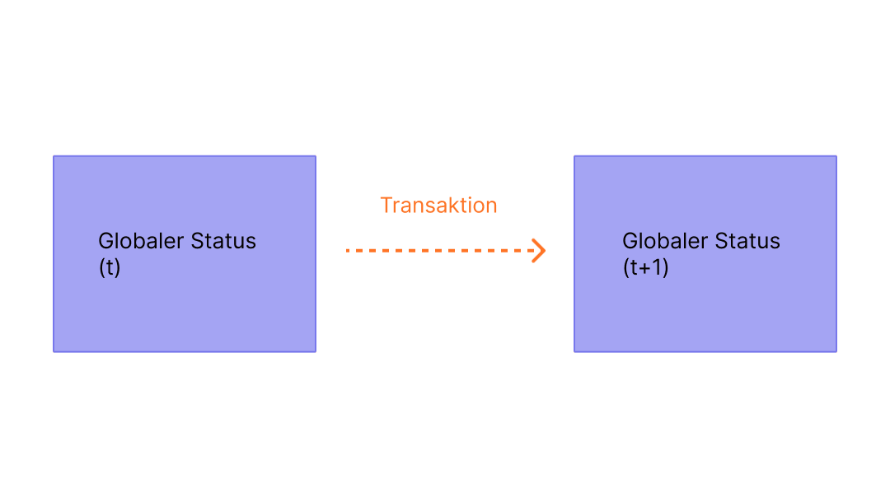
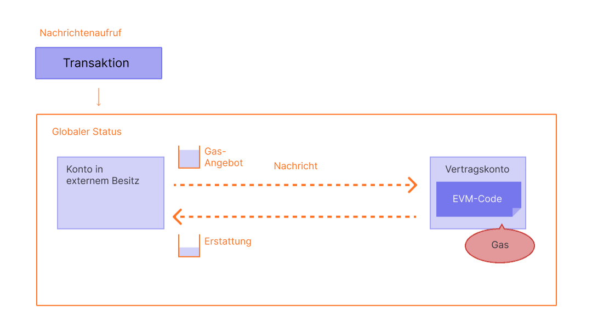

Transaktionen sind kryptographisch signierte Anweisungen von Konten. Ein Konto wird eine Transaktion starten, um den Zustand des Ethereum-Netzwerks zu aktualisieren. Die einfachste Transaktion ist die Übertragung von ETH von einem Konto auf ein anderes.

## Voraussetzungen {#prerequisites}

Um dir zu helfen, diese Seite besser zu verstehen, empfehlen wir dir, zuerst [ Konten](/developers/docs/accounts/), [Transaktionen](/developers/docs/transactions/) und unsere [Einführung in Ethereum](/developers/docs/intro-to-ethereum/) zu lesen.

## Was ist eine Transaktion? {#whats-a-transaction}

Eine Transaktion von Ethereum bezieht sich auf eine Aktion, die von einem externen Konto initiiert wird; mit anderen Worten auf ein Konto, das von einem Menschen verwaltet wird und nicht von einem Vertrag. Wenn zum Beispiel Bob Alice 1 ETH sendet, muss Bobs Konto belastet werden und das von Alice muss eine Gutschrift erhalten. Diese zustandsverändernde Aktion findet innerhalb einer Transaktion statt.

 _Diagramm angepasst von [Ethereum EVM illustriert](https://takenobu-hs.github.io/downloads/ethereum_evm_illustrated.pdf)_

Transaktionen, die den Zustand der EVM verändern, müssen auf das gesamte Netzwerk übertragen werden. Jeder Knoten kann eine Anfrage zur Ausführung einer Transaktion an die EVM senden, woraufhin ein Validator die Transaktion ausführt und die daraus resultierende Statusänderung an den Rest des Netzwerks weitergibt.

Transaktionen sind gebührenpflichtig und müssen in einem validierten Block enthalten sein. Um diesen Überblick zu vereinfachen, werden wir die Gas-Kosten und Validierungsgebühren an anderer Stelle behandeln.

Eine abgeschlossene Transaktion enthält folgende Informationen:

- `von` – der Adresse des Senders, der die Transaktion unterzeichnet. Es handelt sich dabei um ein externes Konto, da Vertragskonten keine Transaktionen senden können.
- `to` – die Empfängeradresse (wenn es sich um ein Konto in externem Besitz handelt, wird durch die Transaktion ein Wert übertragen. Bei einem Smart-Contract-Konto führt die Transaktion den Vertragscode aus.)
- `signature` – die Kennung des Absenders. Das wird generiert, wenn der private Schlüssel des Absenders die Transaktion signiert und bestätigt, dass der Absender diese Transaktion autorisiert hat.
- `nonce` – ein fortlaufend inkrementierender Zähler, der die Transaktionsnummer eines Kontos angibt
- `Wert` – gewünschte Menge an Ether (ETH), die vom Absender an den Empfänger zu überweisen sind (in WEI, ein Ether gleicht 1e + 18wei)
- `input data` – optionales Feld für die Eingabe beliebiger Daten
- `gasLimit` – die maximale Menge an Gaseinheiten, die von der Transaktion verbraucht werden können. Die [EVM](/developers/docs/evm/opcodes) gibt die Gas-Einheiten an, die für jeden Berechnungsschritt benötigt werden
- `maxPriorityFeePerGas` – der Höchstpreis des verbrauchten Gas, der als Trinkgeld an den Validierer weitergegeben wird
- `maxFeePerGas` – die maximale Gebühr pro Gas-Einheit, die für die Transaktion gezahlt werden soll (einschließlich `baseFeePerGas` und `maxPriorityFeePerGas`)

Gas ist ein Hinweis auf die Berechnung, die für die Bearbeitung der Transaktion durch einen Validierer erforderlich ist. Benutzer müssen für diese Berechnung eine Gebühr bezahlen. Das `gasLimit` und `maxPriorityFeePerGas` bestimmen die maximale Transaktionsgebühr, die an den Validator gezahlt wird. [Mehr zu Gas](/developers/docs/gas/).

Das Transaktionsobjekt wird in etwa wie folgt aussehen:

```js
{
  from: "0xEA674fdDe714fd979de3EdF0F56AA9716B898ec8",
  to: "0xac03bb73b6a9e108530aff4df5077c2b3d481e5a",
  gasLimit: "21000",
  maxFeePerGas: "300",
  maxPriorityFeePerGas: "10",
  nonce: "0",
  value: "10000000000"
}
```

Aber ein Transaktionsobjekt muss mit dem privaten Schlüssel des Absenders signiert werden. Dies beweist, dass die Transaktion nur vom Absender hätte kommen können und nicht betrügerisch verschickt wurde.

Ein Ethereum-Client wie Geth wird diesen Signaturprozess bearbeiten.

Beispiel-[JSON-RPC](/developers/docs/apis/json-rpc)-Aufruf:

```json
{
  "id": 2,
  "jsonrpc": "2.0",
  "method": "account_signTransaction",
  "params": [
    {
      "from": "0x1923f626bb8dc025849e00f99c25fe2b2f7fb0db",
      "gas": "0x55555",
      "maxFeePerGas": "0x1234",
      "maxPriorityFeePerGas": "0x1234",
      "input": "0xabcd",
      "nonce": "0x0",
      "to": "0x07a565b7ed7d7a678680a4c162885bedbb695fe0",
      "value": "0x1234"
    }
  ]
}
```

Beispielantwort:

```json
{
  "jsonrpc": "2.0",
  "id": 2,
  "result": {
    "raw": "0xf88380018203339407a565b7ed7d7a678680a4c162885bedbb695fe080a44401a6e4000000000000000000000000000000000000000000000000000000000000001226a0223a7c9bcf5531c99be5ea7082183816eb20cfe0bbc322e97cc5c7f71ab8b20ea02aadee6b34b45bb15bc42d9c09de4a6754e7000908da72d48cc7704971491663",
    "tx": {
      "nonce": "0x0",
      "maxFeePerGas": "0x1234",
      "maxPriorityFeePerGas": "0x1234",
      "gas": "0x55555",
      "to": "0x07a565b7ed7d7a678680a4c162885bedbb695fe0",
      "value": "0x1234",
      "input": "0xabcd",
      "v": "0x26",
      "r": "0x223a7c9bcf5531c99be5ea7082183816eb20cfe0bbc322e97cc5c7f71ab8b20e",
      "s": "0x2aadee6b34b45bb15bc42d9c09de4a6754e7000908da72d48cc7704971491663",
      "hash": "0xeba2df809e7a612a0a0d444ccfa5c839624bdc00dd29e3340d46df3870f8a30e"
    }
  }
}
```

- `raw` ist die signierte Transaktion in [Recursive Length Prefix (RLP)](/developers/docs/data-structures-and-encoding/rlp) in kodierter Form.
- Das `tx` ist die signierte Transaktion im JSON-Format.

Mit dem Signatur-Hash kann für die Transaktion kryptographisch nachgewiesen werden, dass sie vom Absender stammt und dem Netzwerk übermittelt wurde.

### Das Datenfeld {#the-data-field}

Die überwiegende Mehrheit der Transaktionen greift auf einen Vertrag über ein externes Konto zu. Die meisten Verträge sind in Solidity geschrieben und interpretieren ihr Datenfeld entsprechedn dem [Application Binary Interface (ABI)](/glossary/#abi).

Die ersten vier Bytes geben an, welche Funktion aufgerufen werden soll, wobei der Hash des Funktionsnamens und der Argumente verwendet wird. Manchmal kannst du die Funktion anhand des Selektors aus [dieser Datenbank](https://www.4byte.directory/signatures/) identifizieren.

Der Rest der Aufrufdaten sind die Argumente, [codiert wie in den ABI-Spezifikationen angegeben](https://docs.soliditylang.org/en/latest/abi-spec.html#formal-specification-of-the-encoding).

Betrachten wir zum Beispiel [diese Transaktion](https://etherscan.io/tx/0xd0dcbe007569fcfa1902dae0ab8b4e078efe42e231786312289b1eee5590f6a1). Verwende **Für mehr hier klicken**, um die Aufrufdaten zu sehen.

Der Funktions-Selektor ist `0xa9059cbb`. Es gibt mehrere [bekannte Funktionen mit dieser Signatur](https://www.4byte.directory/signatures/?bytes4_signature=0xa9059cbb). In diesem Fall wurde [der Contract-Quellcode](https://etherscan.io/address/0xa0b86991c6218b36c1d19d4a2e9eb0ce3606eb48#code) auf Etherscan hochgeladen, so dass wir wissen, dass die Funktion `transfer(address,uint256)` ist.

Der Rest der Daten lautet:

```
0000000000000000000000004f6742badb049791cd9a37ea913f2bac38d01279
000000000000000000000000000000000000000000000000000000003b0559f4
```

Entsprechend den ABI-Spezifikationen erscheinen Ganzzahlwerte (wie Adressen, die 20-Byte-Ganzzahlen sind) in ABI als 32-Byte-Wörter, die vorne mit Nullen aufgefüllt werden. Also wissen wir, dass die Adresse von `to` [`4f6742badb049791cd9a37ea913f2bac38d01279`](https://etherscan.io/address/0x4f6742badb049791cd9a37ea913f2bac38d01279) ist. Der Wert ist `value` 0x3b0559f4 = 990206452.

## Arten von Transaktionen {#types-of-transactions}

Bei Ethereum gibt es unterschiedliche Arten von Transaktionen:

- Reguläre Transaktionen: eine Transaktion von einem Konto auf ein anderes.
- Vertragseinsatz-Transaktionen: eine Transaktion ohne "An"-Adresse, bei der das Datenfeld für den Vertragscode verwendet wird.
- Ausführung eines Vertrags: eine Transaktion, die mit einem bereitgestellten Smart Contract interagiert. In diesem Fall ist die Adresse von "to" die des Smart Contracts.

### Über Gas {#on-gas}

Wie bereits erwähnt, kosten das Ausführen von Transaktionen [gas](/developers/docs/gas/). Einfache Überweisungstransaktionen erfordern 21000 Gas.

Damit Bob also Alice 1 ETH zu einer `BasisgebührPerGas` von 190 gwei und einer `maximalenPrioritätsgebührPerGas` von 10 gwei schicken kann, muss er folgende Gebühr bezahlen:

```
(190 + 10) * 21000 = 4.200.000 gwei
--oder--
0,0042 ETH
```

Bobs Konto wird mit **-1,0042 ETH** belastet (1 ETH für Alice + 0,0042 ETH an Gas-Gebühren)

Alices Konto wird **+1,0 ETH** gutgeschrieben

Die Grundgebühr wird **-0,00399 ETH** verbrannt

Validatoren behalten das "Trinkgeld" **+0,000210 ETH**


 _Diagramm angepasst von [Ethereum EVM illustriert](https://takenobu-hs.github.io/downloads/ethereum_evm_illustrated.pdf)_

Jedes Gas, das nicht in einer Transaktion verwendet wird, wird auf das Benutzerkonto zurückerstattet.

### Smart Contract-Interaktionen {#smart-contract-interactions}

Gas wird für jede Transaktion benötigt, die Smart Contracts betrifft.

Smart Contracts können auch Funktionen enthalten, die als [`view`](https://docs.soliditylang.org/en/latest/contracts.html#view-functions) oder [`pure`](https://docs.soliditylang.org/en/latest/contracts.html#pure-functions) bezeichnet werden; sie verändern nicht den Zustand des Vertrags. Daher ist es nicht erforderlich, Gas zu zahlen, wenn diese Funktionen von einem externen Konto (EOA) aufgerufen werden. Der zugrunde liegende RPC-Aufruf in diesem Szenario ist [`eth_call`](/developers/docs/apis/json-rpc#eth_call)

Im Gegensatz zum Zugriff über `eth_call` werden diese `view`- oder `pure`-Funktionen auch häufig intern aufgerufen (also vom Vertrag selbst oder von einem anderen Vertrag), was jedoch Gas kostet.

## Transaktions-Lebenszyklus {#transaction-lifecycle}

Sobald die Transaktion abgeschickt wurde, passiert Folgendes:

1. Ein Transaktions-Hash wird kryptografisch erzeugt: `0x97d99bc7729211111a21b12c933c949d4f31684f1d6954ff477d0477538ff017`
2. Die Transaktion wird dann an das Netzwerk weitergeleitet und zu einem Transaktionspool hinzugefügt, der aus allen anderen ausstehenden Netztransaktionen besteht.
3. Ein Validator muss Ihre Transaktion auswählen und in einem Block hinzufügen, um die Transaktion zu verifizieren und sie als "erfolgreich" zu bezeichnen.
4. Mit der Zeit wird der Block, der Ihre Transaktion enthält, auf "justified" und dann auf " finalized" hochgestuft. Mit diesen Hochstufungen steigt auch die Sicherheit, dass Ihre Transaktion erfolgreich war und nicht mehr verändert werden kann. Sobald ein Block abgeschlossen, also "finalized", ist, könnte er nur noch durch einen Angriff auf Netzwerkebene verändert werden, der viele Milliarden Dollar kosten würde.

## Eine visuelle Demo {#a-visual-demo}

Schaue Austin bei einer Führung durch Transaktionen, Gas und Mining zu.

<YouTube id="er-0ihqFQB0" />

## Typisierter Transaktionsumschlag {#typed-transaction-envelope}

Ursprünglich hatte Ethereum ein einziges Format für Transaktionen. Jede Transaktion enthielt eine Nonce, einen Gaspreis, ein Gaslimit, eine Zieladresse, einen Wert, Daten, v, r und s. Diese Felder sind [RLP-kodiert](/developers/docs/data-structures-and-encoding/rlp/) und sehen etwa folgendermaßen aus:

`RLP([nonce, gasPrice, gasLimit, to, value, data, v, r, s])`

Ethereum hat sich so entwickelt, dass es mehrere Transaktionsarten unterstützt, damit neue Funktionen wie Zugriffslisten und [EIP-1559](https://eips.ethereum.org/EIPS/eip-1559) implementiert werden können, ohne die alten Transaktionsformate zu beeinflussen.

[EIP-2718](https://eips.ethereum.org/EIPS/eip-2718) ermöglicht dieses Verhalten. Transaktionen werden wie folgt interpretiert:

`TransactionType || TransactionPayload`

Die Felder sind wie folgt definiert:

- `TransactionType` – eine Zahl zwischen 0 und 0x7f, für insgesamt 128 mögliche Transaktionsarten.
- `TransactionPayload` – ein beliebiges Byte-Array, das durch den Transaktionstyp definiert wird.

Basierend auf dem `TransactionType`-Wert kann eine Transaktion wie folgt klassifiziert werden:

1. **Typ-0-Transaktionen (veraltet):** Das ursprüngliche Transaktionsformat, das seit dem Start von Ethereum verwendet wird. Diese Transaktionen enthalten keine Funktionen aus [EIP-1559](https://eips.ethereum.org/EIPS/eip-1559) wie dynamische Gasgebührenkalkulationen oder Zugriffslisten für Smart Contracts. Veraltete Transaktionen haben in ihrer serialisierten Form keinen spezifischen Präfix, der ihren Typ angibt; sie beginnen mit dem Byte `0xf8`, wenn die [Recursive Length Prefix(RLP)](/developers/docs/data-structures-and-encoding/rlp)-Kodierung verwendet wird. Der TransactionType-Wert für diese Transaktionen ist `0x0`.

2. **Typ-1-Transaktionen:** Diese Transaktionen wurden in [EIP-2930](https://eips.ethereum.org/EIPS/eip-2930) als Teil des [Berlin-Upgrades](/history/#berlin) von Ethereum eingeführt und enthalten einen `accessList`-Parameter. Diese Liste gibt Adressen und Speicherschlüssel an, auf die bei der Transaktion zugegriffen werden soll, was potenziell die [Gas](/developers/docs/gas/)-Kosten für komplexe Transaktionen mit Smart Contracts reduzieren kann. Änderungen des EIP-1559-Gebührenmarkts sind in Typ-1-Transaktionen nicht enthalten. Typ-1-Transaktionen enthalten auch einen `yParity`-Parameter, der entweder `0x0` oder `0x1` sein kann und die Parität des y-Werts der secp256k1-Signatur angibt. Sie werden durch das Anfangs-Byte `0x01` identifiziert und ihr TransactionType-Wert ist `0x1`.

3. **Typ-2-Transaktionen**, allgemein als EIP-1559-Transaktionen bezeichnet, sind Transaktionen, die in [EIP-1559](https://eips.ethereum.org/EIPS/eip-1559), dem [London-Upgrade](/history/#london) von Ethereum, eingeführt wurden. Diese haben sich zur Standardform für Transaktionen auf dem Ethereum-Netzwerk entwickelt. Diese Transaktionen führen einen neuen Gebührenmarktmechanismus ein, der durch die Trennung der Transaktionsgebühr in eine Basisgebühr und eine Prioritätsgebühr die Vorhersehbarkeit verbessert. Sie beginnen mit dem Byte `0x02` und enthalten Felder wie `maxPriorityFeePerGas` und `maxFeePerGas`. Typ-2-Transaktionen sind aufgrund ihrer Flexibilität und Effizienz nun der Standard und werden besonders in Zeiten hoher Netzwerkbelastung bevorzugt – aufgrund ihrer Fähigkeit, den Benutzern eine besser vorhersehbare Verwaltung der Transaktionsgebühren zu ermöglichen. Der TransactionType-Wert für diese Transaktionen ist `0x2`.


## Weiterführende Informationen {#further-reading}

- [EIP-2718: Typisierter Transaktionsumschlag](https://eips.ethereum.org/EIPS/eip-2718)

_Du kennst Community-Ressourcen die dir geholfen haben? Bearbeite diese Seite und füge sie hinzu!_

## Verwandte Themen {#related-topics}

- [Konten](/developers/docs/accounts/)
- [Ethereum Virtual Machine (EVM)](/developers/docs/evm/)
- [Gas](/developers/docs/gas/)
