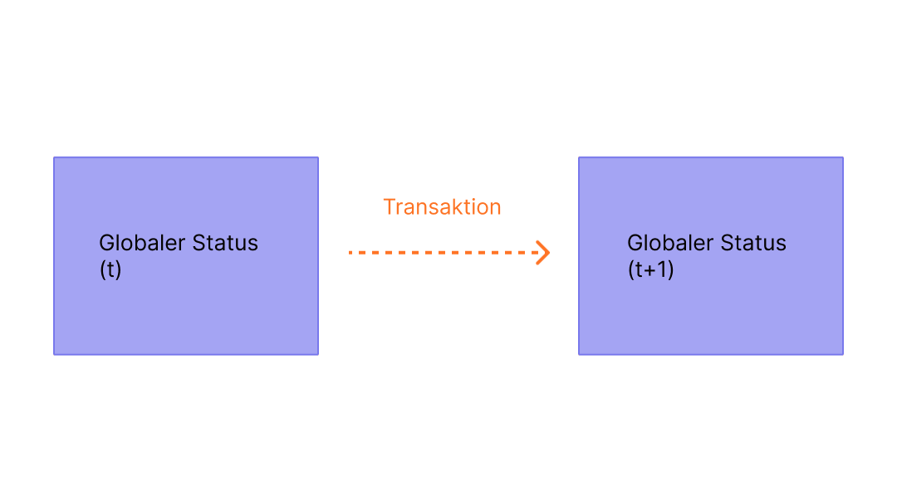
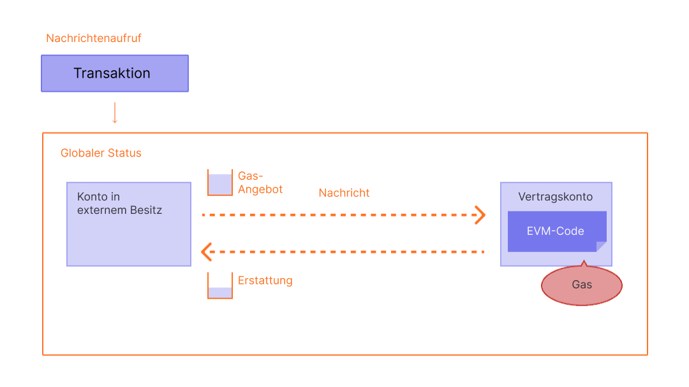

Transaktionen sind kryptografisch signierte Anweisungen von Konten. Ein Konto initiiert eine Transaktion, um den Zustand des [Ethereum](/)-Netzwerks zu aktualisieren. Die einfachste Transaktion ist die Überweisung von ETH von einem Konto auf ein anderes.

## Voraussetzungen {#prerequisites}

Um diese Seite besser zu verstehen, empfehlen wir Ihnen, zuerst [Konten](/developers/docs/accounts/) und unsere [Einführung in Ethereum](/developers/docs/intro-to-ethereum/) zu lesen.

## Was ist eine Transaktion? {#whats-a-transaction}

Eine Ethereum-Transaktion bezieht sich auf eine Aktion, die von einem extern verwalteten Konto initiiert wird, mit anderen Worten, einem Konto, das von einem Menschen und nicht von einem Vertrag verwaltet wird. Wenn Bob beispielsweise 1 ETH an Alice sendet, muss Bobs Konto belastet und Alices Konto gutgeschrieben werden. Diese zustandsändernde Aktion findet innerhalb einer Transaktion statt.


_Diagramm adaptiert von [Ethereum EVM illustrated](https://takenobu-hs.github.io/downloads/ethereum_evm_illustrated.pdf)_

Transaktionen, die den Zustand der EVM ändern, müssen an das gesamte Netzwerk übertragen werden. Jeder Blockchain-Knoten kann eine Anfrage zur Ausführung einer Transaktion auf der EVM übertragen; danach wird ein Validator die Transaktion ausführen und die resultierende Zustandsänderung an den Rest des Netzwerks weitergeben.

Transaktionen erfordern eine Gebühr und müssen in einen validierten Block aufgenommen werden. Um diesen Überblick zu vereinfachen, werden wir Gasgebühren und Validierung an anderer Stelle behandeln.

Eine eingereichte Transaktion enthält die folgenden Informationen:

- `from` – die Adresse des Absenders, der die Transaktion signieren wird. Dies ist ein extern verwaltetes Konto, da Vertragskonten keine Transaktionen senden können.
- `to` – die Empfängeradresse (wenn es sich um ein extern verwaltetes Konto handelt, überträgt die Transaktion einen Wert. Wenn es sich um ein Vertragskonto handelt, führt die Transaktion den Vertragscode aus).
- `signature` – die Kennung des Absenders. Diese wird generiert, wenn der Private-Key des Absenders die Transaktion signiert und bestätigt, dass der Absender diese Transaktion autorisiert hat.
- `nonce` – ein sequenziell inkrementierender Zähler, der die Transaktionsnummer des Kontos angibt.
- `value` – die Menge an ETH, die vom Absender an den Empfänger übertragen werden soll (angegeben in WEI, wobei 1 ETH gleich 1e+18 WEI ist).
- `input data` – optionales Feld zum Einfügen beliebiger Daten.
- `gasLimit` – die maximale Menge an Gas-Einheiten, die von der Transaktion verbraucht werden kann. Die [EVM](/developers/docs/evm/opcodes) gibt die für jeden Berechnungsschritt erforderlichen Gas-Einheiten an.
- `maxPriorityFeePerGas` – der maximale Preis des verbrauchten Gases, der als Trinkgeld für den Validator enthalten sein soll.
- `maxFeePerGas` – die maximale Gebühr pro Gas-Einheit, die für die Transaktion gezahlt werden soll (einschließlich `baseFeePerGas` und `maxPriorityFeePerGas`).

Gas ist ein Maß für die Rechenleistung, die erforderlich ist, damit ein Validator die Transaktion verarbeiten kann. Benutzer müssen für diese Berechnung eine Gebühr zahlen. Das `gasLimit` und die `maxPriorityFeePerGas` bestimmen die maximale Transaktionsgebühr, die an den Validator gezahlt wird. [Mehr über Gas](/developers/docs/gas/).

Das Transaktionsobjekt sieht in etwa so aus:

```js
{
  from: "0xEA674fdDe714fd979de3EdF0F56AA9716B898ec8",
  to: "0xac03bb73b6a9e108530aff4df5077c2b3d481e5a",
  gasLimit: "21000",
  maxFeePerGas: "300",
  maxPriorityFeePerGas: "10",
  nonce: "0",
  value: "10000000000"
}
```

Ein Transaktionsobjekt muss jedoch mit dem Private-Key des Absenders signiert werden. Dies beweist, dass die Transaktion nur vom Absender stammen konnte und nicht in betrügerischer Absicht gesendet wurde.

Eine Ethereum-Anwendung wie Geth übernimmt diesen Signaturprozess.

Beispielhafter [JSON-RPC](/developers/docs/apis/json-rpc)-Aufruf:

```json
{
  "id": 2,
  "jsonrpc": "2.0",
  "method": "account_signTransaction",
  "params": [
    {
      "from": "0x1923f626bb8dc025849e00f99c25fe2b2f7fb0db",
      "gas": "0x55555",
      "maxFeePerGas": "0x1234",
      "maxPriorityFeePerGas": "0x1234",
      "input": "0xabcd",
      "nonce": "0x0",
      "to": "0x07a565b7ed7d7a678680a4c162885bedbb695fe0",
      "value": "0x1234"
    }
  ]
}
```

Beispielhafte Antwort:

```json
{
  "jsonrpc": "2.0",
  "id": 2,
  "result": {
    "raw": "0xf88380018203339407a565b7ed7d7a678680a4c162885bedbb695fe080a44401a6e4000000000000000000000000000000000000000000000000000000000000001226a0223a7c9bcf5531c99be5ea7082183816eb20cfe0bbc322e97cc5c7f71ab8b20ea02aadee6b34b45bb15bc42d9c09de4a6754e7000908da72d48cc7704971491663",
    "tx": {
      "nonce": "0x0",
      "maxFeePerGas": "0x1234",
      "maxPriorityFeePerGas": "0x1234",
      "gas": "0x55555",
      "to": "0x07a565b7ed7d7a678680a4c162885bedbb695fe0",
      "value": "0x1234",
      "input": "0xabcd",
      "v": "0x26",
      "r": "0x223a7c9bcf5531c99be5ea7082183816eb20cfe0bbc322e97cc5c7f71ab8b20e",
      "s": "0x2aadee6b34b45bb15bc42d9c09de4a6754e7000908da72d48cc7704971491663",
      "hash": "0xeba2df809e7a612a0a0d444ccfa5c839624bdc00dd29e3340d46df3870f8a30e"
    }
  }
}
```

- `raw` ist die signierte Transaktion in [Recursive Length Prefix (RLP)](/developers/docs/data-structures-and-encoding/rlp)-kodierter Form.
- `tx` ist die signierte Transaktion in JSON-Form.

Mit dem Signatur-Hash kann kryptografisch nachgewiesen werden, dass die Transaktion vom Absender stammt und an das Netzwerk übermittelt wurde.

### Das Datenfeld {#the-data-field}

Die überwiegende Mehrheit der Transaktionen greift von einem extern verwalteten Konto auf einen Vertrag zu.
Die meisten Verträge sind in Solidity geschrieben und interpretieren ihr Datenfeld in Übereinstimmung mit dem [Application Binary Interface (ABI)](/glossary/#abi).

Die ersten vier Bytes geben an, welche Funktion aufgerufen werden soll, wobei der Hash des Funktionsnamens und der Argumente verwendet wird.
Manchmal können Sie die Funktion anhand des Selektors mithilfe [dieser Datenbank](https://www.4byte.directory/signatures/) identifizieren.

Der Rest der Aufrufdaten (Calldata) sind die Argumente, [kodiert wie in den ABI-Spezifikationen angegeben](https://docs.soliditylang.org/en/latest/abi-spec.html#formal-specification-of-the-encoding).

Schauen wir uns zum Beispiel [diese Transaktion](https://etherscan.io/tx/0xd0dcbe007569fcfa1902dae0ab8b4e078efe42e231786312289b1eee5590f6a1) an.
Verwenden Sie **Click to see More**, um die Aufrufdaten zu sehen.

Der Funktionsselektor ist `0xa9059cbb`. Es gibt mehrere [bekannte Funktionen mit dieser Signatur](https://www.4byte.directory/signatures/?bytes4_signature=0xa9059cbb).
In diesem Fall wurde [der Quellcode des Vertrags](https://etherscan.io/address/0xa0b86991c6218b36c1d19d4a2e9eb0ce3606eb48#code) auf Etherscan hochgeladen, sodass wir wissen, dass die Funktion `transfer(address,uint256)` ist.

Der Rest der Daten ist:

```
0000000000000000000000004f6742badb049791cd9a37ea913f2bac38d01279
000000000000000000000000000000000000000000000000000000003b0559f4
```

Gemäß den ABI-Spezifikationen erscheinen ganzzahlige Werte (wie Adressen, die 20-Byte-Ganzzahlen sind) in der ABI als 32-Byte-Wörter, die vorne mit Nullen aufgefüllt sind.
Wir wissen also, dass die `to`-Adresse [`4f6742badb049791cd9a37ea913f2bac38d01279`](https://etherscan.io/address/0x4f6742badb049791cd9a37ea913f2bac38d01279) ist.
Der `value` ist 0x3b0559f4 = 990206452.

## Arten von Transaktionen {#types-of-transactions}

Auf Ethereum gibt es einige verschiedene Arten von Transaktionen:

- Reguläre Transaktionen: eine Transaktion von einem Konto zu einem anderen.
- Vertragsbereitstellungstransaktionen: eine Transaktion ohne eine `to`-Adresse, bei der das Datenfeld für den Vertragscode verwendet wird.
- Ausführung eines Vertrags: eine Transaktion, die mit einem bereitgestellten Smart Contract interagiert. In diesem Fall ist die `to`-Adresse die Adresse des Smart Contracts.

### Über Gas {#on-gas}

Wie bereits erwähnt, kostet die Ausführung von Transaktionen [Gas](/developers/docs/gas/). Einfache Überweisungstransaktionen erfordern 21.000 Einheiten Gas.

Damit Bob also 1 ETH an Alice bei einer `baseFeePerGas` von 190 Gwei und einer `maxPriorityFeePerGas` von 10 Gwei senden kann, muss Bob die folgende Gebühr zahlen:

```
(190 + 10) * 21000 = 4,200,000 gwei
--or--
0.0042 ETH
```

Bobs Konto wird mit **-1,0042 ETH** belastet (1 ETH für Alice + 0,0042 ETH an Gasgebühren).

Alices Konto werden **+1,0 ETH** gutgeschrieben.

Die Grundgebühr wird verbrannt: **-0,00399 ETH**.

Der Validator behält das Trinkgeld: **+0,000210 ETH**.



_Diagramm adaptiert von [Ethereum EVM illustrated](https://takenobu-hs.github.io/downloads/ethereum_evm_illustrated.pdf)_

Jegliches Gas, das in einer Transaktion nicht verbraucht wird, wird dem Benutzerkonto zurückerstattet.

### Interaktionen mit Smart Contracts {#smart-contract-interactions}

Gas wird für jede Transaktion benötigt, die einen Smart Contract involviert.

Smart Contracts können auch Funktionen enthalten, die als [`view`](https://docs.soliditylang.org/en/latest/contracts.html#view-functions)- oder [`pure`](https://docs.soliditylang.org/en/latest/contracts.html#pure-functions)-Funktionen bekannt sind und den Zustand des Vertrags nicht verändern. Daher erfordert der Aufruf dieser Funktionen von einem extern verwalteten Konto (EOA) kein Gas. Der zugrunde liegende RPC-Aufruf für dieses Szenario ist [`eth_call`](/developers/docs/apis/json-rpc#eth_call).

Im Gegensatz zum Zugriff über `eth_call` werden diese `view`- oder `pure`-Funktionen auch häufig intern aufgerufen (d. h. vom Vertrag selbst oder von einem anderen Vertrag), was Gas kostet.

## Lebenszyklus einer Transaktion {#transaction-lifecycle}

Sobald die Transaktion eingereicht wurde, passiert Folgendes:

1. Ein Transaktions-Hash wird kryptografisch generiert:
   `0x97d99bc7729211111a21b12c933c949d4f31684f1d6954ff477d0477538ff017`
2. Die Transaktion wird dann an das Netzwerk übertragen und einem Transaktionspool hinzugefügt, der aus allen anderen ausstehenden Netzwerktransaktionen besteht.
3. Ein Validator muss Ihre Transaktion auswählen und in einen Block aufnehmen, um die Transaktion zu verifizieren und als „erfolgreich“ zu betrachten.
4. Im Laufe der Zeit wird der Block, der Ihre Transaktion enthält, auf „gerechtfertigt“ (justified) und dann auf „finalisiert“ (finalized) hochgestuft. Diese Hochstufungen machen es viel
   sicherer, dass Ihre Transaktion erfolgreich war und niemals geändert wird. Sobald ein Block „finalisiert“ ist, könnte er nur noch
   durch einen Angriff auf Netzwerkebene geändert werden, der viele Milliarden Dollar kosten würde.

## Eine visuelle Demo {#a-visual-demo}

Sehen Sie sich an, wie Austin Sie durch Transaktionen, Gas und Mining führt.

<YouTube id="er-0ihqFQB0" />

## Typisierter Transaktionsumschlag (Typed Transaction Envelope) {#typed-transaction-envelope}

Ethereum hatte ursprünglich ein Format für Transaktionen. Jede Transaktion enthielt eine Nonce, einen Gaspreis, ein Gaslimit, eine Empfängeradresse (`to`), einen Wert (`value`), Daten (`data`), v, r und s. Diese Felder sind [RLP-kodiert](/developers/docs/data-structures-and-encoding/rlp/), um in etwa so auszusehen:

`RLP([nonce, gasPrice, gasLimit, to, value, data, v, r, s])`

Ethereum hat sich weiterentwickelt, um mehrere Arten von Transaktionen zu unterstützen, damit neue Funktionen wie Zugriffslisten und [EIP-1559](https://eips.ethereum.org/EIPS/eip-1559) implementiert werden können, ohne ältere Transaktionsformate zu beeinträchtigen.

[EIP-2718](https://eips.ethereum.org/EIPS/eip-2718) ermöglicht dieses Verhalten. Transaktionen werden interpretiert als:

`TransactionType || TransactionPayload`

Wobei die Felder wie folgt definiert sind:

- `TransactionType` – eine Zahl zwischen 0 und 0x7f, für insgesamt 128 mögliche Transaktionstypen.
- `TransactionPayload` – ein beliebiges Byte-Array, das durch den Transaktionstyp definiert wird.

Basierend auf dem Wert von `TransactionType` kann eine Transaktion wie folgt klassifiziert werden:

1. **Typ-0-Transaktionen (Legacy):** Das ursprüngliche Transaktionsformat, das seit dem Start von Ethereum verwendet wird. Sie enthalten keine Funktionen aus [EIP-1559](https://eips.ethereum.org/EIPS/eip-1559) wie dynamische Gasgebührenberechnungen oder Zugriffslisten für Smart Contracts. Legacy-Transaktionen fehlt ein spezifisches Präfix, das ihren Typ in ihrer serialisierten Form angibt; sie beginnen mit dem Byte `0xf8`, wenn die [Recursive Length Prefix (RLP)](/developers/docs/data-structures-and-encoding/rlp)-Kodierung verwendet wird. Der TransactionType-Wert für diese Transaktionen ist `0x0`.

2. **Typ-1-Transaktionen:** Eingeführt in [EIP-2930](https://eips.ethereum.org/EIPS/eip-2930) als Teil von Ethereums [Berlin-Upgrade](/ethereum-forks/#berlin), enthalten diese Transaktionen einen `accessList`-Parameter. Diese Liste gibt Adressen und Speicherschlüssel an, auf die die Transaktion voraussichtlich zugreifen wird, was dazu beiträgt, die [Gas](/developers/docs/gas/)-Kosten für komplexe Transaktionen mit Smart Contracts potenziell zu senken. Änderungen des Gebührenmarktes durch EIP-1559 sind in Typ-1-Transaktionen nicht enthalten. Typ-1-Transaktionen enthalten auch einen `yParity`-Parameter, der entweder `0x0` oder `0x1` sein kann und die Parität des y-Wertes der secp256k1-Signatur angibt. Sie werden dadurch identifiziert, dass sie mit dem Byte `0x01` beginnen, und ihr TransactionType-Wert ist `0x1`.

3. **Typ-2-Transaktionen**, allgemein als EIP-1559-Transaktionen bezeichnet, sind Transaktionen, die in [EIP-1559](https://eips.ethereum.org/EIPS/eip-1559) im Rahmen von Ethereums [London-Upgrade](/ethereum-forks/#london) eingeführt wurden. Sie sind zum Standard-Transaktionstyp im Ethereum-Netzwerk geworden. Diese Transaktionen führen einen neuen Gebührenmarktmechanismus ein, der die Vorhersehbarkeit verbessert, indem die Transaktionsgebühr in eine Grundgebühr und eine Prioritätsgebühr aufgeteilt wird. Sie beginnen mit dem Byte `0x02` und enthalten Felder wie `maxPriorityFeePerGas` und `maxFeePerGas`. Typ-2-Transaktionen sind aufgrund ihrer Flexibilität und Effizienz mittlerweile der Standard und werden besonders in Zeiten hoher Netzwerküberlastung bevorzugt, da sie Benutzern helfen, Transaktionsgebühren vorhersehbarer zu verwalten. Der TransactionType-Wert für diese Transaktionen ist `0x2`.

4. **Typ-3-Transaktionen (Blob)** wurden in [EIP-4844](https://eips.ethereum.org/EIPS/eip-4844) als Teil von Ethereums [Dencun-Upgrade](/ethereum-forks/#dencun) eingeführt. Diese Transaktionen sind darauf ausgelegt, „Blob“-Daten (Binary Large Objects) effizienter zu verarbeiten, was insbesondere Rollups der Ebene 2 zugutekommt, indem sie eine Möglichkeit bieten, Daten zu geringeren Kosten im Ethereum-Netzwerk zu veröffentlichen. Blob-Transaktionen enthalten zusätzliche Felder wie `blobVersionedHashes`, `maxFeePerBlobGas` und `blobGasPrice`. Sie beginnen mit dem Byte `0x03` und ihr TransactionType-Wert ist `0x3`. Blob-Transaktionen stellen eine signifikante Verbesserung der Datenverfügbarkeit und Skalierung von Ethereum dar.

5. **Typ-4-Transaktionen** wurden in [EIP-7702](https://eips.ethereum.org/EIPS/eip-7702) als Teil von Ethereums [Pectra-Upgrade](/roadmap/pectra/) eingeführt. Diese Transaktionen sind so konzipiert, dass sie vorwärtskompatibel mit der Kontoabstraktion sind. Sie ermöglichen es extern verwalteten Konten (EOAs), sich vorübergehend wie Smart-Contract-Konten zu verhalten, ohne ihre ursprüngliche Funktionalität zu beeinträchtigen. Sie enthalten einen `authorization_list`-Parameter, der den Smart Contract angibt, an den das EOA seine Autorität delegiert. Nach der Transaktion enthält das Codefeld des EOAs die Adresse des delegierten Smart Contracts.

## Weiterführende Literatur {#further-reading}

- [EIP-2718: Typed Transaction Envelope](https://eips.ethereum.org/EIPS/eip-2718)

_Kennen Sie eine Community-Ressource, die Ihnen geholfen hat? Bearbeiten Sie diese Seite und fügen Sie sie hinzu!_

## Verwandte Themen {#related-topics}

- [Konten](/developers/docs/accounts/)
- [Ethereum Virtual Machine (EVM)](/developers/docs/evm/)
- [Gas](/developers/docs/gas/)