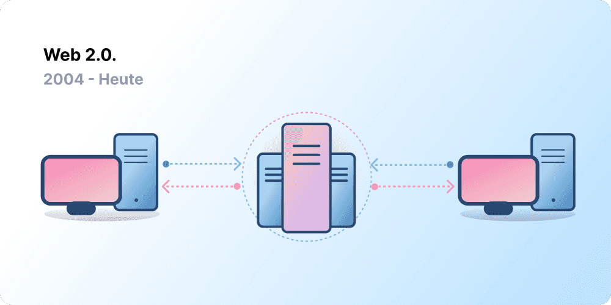
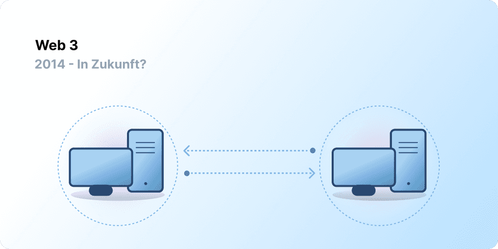

# Einführung in Web3 {#introduction}

Zentralisierung hat es ermöglicht, dass Milliarden von Menschen Zugang zum Internet haben, und daraus hat sich die stabile, robuste Infrastruktur entwickelt, von der das Internet lebt. Gleichzeitig nimmt eine Handvoll zentralisierter Einheiten eine starke Stellung in weiten Teilen des Internets ein und entscheidet einseitig, was erlaubt sein soll und was nicht.

Web3 ist die Antwort auf diese Misere. Anstelle eines Internets, das von großen Technologieunternehmen monopolisiert wird, setzt Web3 auf Dezentralisierung und wird von seinen Benutzern aufgebaut, betrieben und gehalten. Web3 legt die Macht in die Hände von Einzelpersonen und nicht von Unternehmen. Bevor wir über Web3 sprechen, sehen wir uns an, wie wir hierher gekommen sind.

<Divider />

## Das frühe Internet {#early-internet}

Die meisten Menschen betrachten das Internet als eine immerwährende Säule des modernen Lebens – es wurde erfunden und existiert seitdem einfach. Doch das Internet, das die meisten von uns heute kennen, ist ganz anders, als es ursprünglich gedacht war. Um das besser zu verstehen, ist es hilfreich, die kurze Geschichte des Internets in lose Phasen zu unterteilen: Web 1.0 und Web 2.0.

### Web 1.0: nur lesen (1990-2004) {#web1}

1989 war Tim Berners-Lee im CERN in Genf mit der Entwicklung der Protokolle beschäftigt, aus denen das Internet entstehen sollte. Was war seine Idee? Offene, dezentrale Protokolle zu schaffen, die einen Informationsaustausch von jedem Ort der Erde aus ermöglichen.

Die Anfänge des Internets, heute als „Web 1.0" bekannt, liegen etwa zwischen 1990 und 2004. Das Internet im Web 1.0 bestand hauptsächlich aus statischen Webseiten, die sich im Besitz von Unternehmen befanden. Es gab so gut wie keine Interaktion zwischen den Benutzern, Einzelpersonen produzierten nur selten Inhalte. Das führte dazu, dass es als reines Lese-Web bekannt wurde.

### Web 2.0: lesen und schreiben (2004 bis heute) {#web2}

Die Zeit des Web 2.0 begann 2004 mit dem Aufkommen der Social-Media-Plattformen. Anstelle eines Nur-Lese-Web entwickelte sich das Internet zu einem Lese-Schreib-Web. Anstatt den Nutzern Inhalte zur Verfügung zu stellen, begannen die Unternehmen, Plattformen für den Austausch von Nutzer-generierten Inhalten und für die Interaktion zwischen den Nutzern anzubieten. Als immer mehr Menschen online gingen, begann eine Handvoll großer Unternehmen einen unverhältnismäßig großen Teil des Datenverkehrs und der im Internet generierten Werte zu kontrollieren. Web 2.0 war auch die Geburtsstunde des werbefinanzierten Umsatzmodells. Nutzer konnten zwar Inhalte erstellen, besaßen sie aber nicht und profitierten auch nicht von deren Verwertung.

<Divider />

## Web 3.0: lesen, schreiben, besitzen {#web3}

Der Begriff "Web 3.0" wurde von [Ethereum](/what-is-ethereum/)-Mitbegründer Gavin Wood kurz nach dem Start von Ethereum im Jahr 2014 geprägt. Gavin formulierte eine Lösung für ein Problem, das viele frühzeitige Krypto-Anwender empfanden: Das Internet erforderte zu viel Vertrauen. Das heißt, der größte Teil des Internets, das die Menschen heute kennen und nutzen, beruht auf dem Vertrauen in eine Handvoll privater Unternehmen, die im Interesse der Öffentlichkeit handeln.

### Was ist Web3? {#what-is-web3}

Web3 wurde zu einem Sammelbegriff für die Vision eines neuen, besseren Internets. Im Kern nutzt Web3 Blockchains, Kryptowährungen und NFTs, um den Nutzern Macht in Form von Eigentum zurückzugeben. [Ein Twitter-Beitrag aus dem Jahr 2021](https://twitter.com/j1mmyeth/status/1459003044067258370) bringt es auf den Punkt: Web1 war nur lesen, Web2 ist lesen und schreiben, Web3 wird lesen, schreiben und besitzen sein.

#### Der Kern von Web3 {#core-ideas}

Obwohl es schwierig ist, sich auf eine eindeutige Definition von Web3 festzulegen, gibt es doch einige Grundprinzipien, die für seine Entwicklung maßgeblich sind.

- **Web3 ist dezentralisiert:** Statt große Teile des Internets von zentralisierten Einrichtungen kontrollieren und in deren Besitz zu lassen, wird das Eigentum unter seinen Erstellern und Nutzern verteilt.
- **Web3 ist berechtigungsfrei:** Jeder hat den gleichen Zugang zur Teilnahme an Web3 und niemand wird ausgeschlossen.
- **Web3 verfügt über native Zahlungen:** Es verwendet Kryptowährungen, um online Geld auszugeben oder zu versenden, anstatt sich auf die veraltete Infrastruktur von Banken und Zahlungsdienstleistern zu verlassen.
- **Im Web3 braucht es kein Vertrauen:** Es arbeitet mit Anreizen und wirtschaftlichen Mechanismen, anstatt sich auf vertrauenswürdige Dritte zu verlassen.

### Warum ist Web3 wichtig? {#why-is-web3-important}

Obwohl sich die großartigen Funktionen von Web3 nicht klar voneinander abgrenzen lassen und auch nicht in eindeutige Kategorien passen, haben wir der Einfachheit halber versucht, sie isoliert zu behandeln, um ein besseres Verständnis zu ermöglichen.

#### Eigentum {#ownership}

Web3 verschafft Ihnen auf eine beispiellose Weise das Eigentum an Ihren digitalen Ressourcen. Nehmen wir beispielsweise an, Sie spielen ein Web2-Spiel. Kaufen Sie einen Gegenstand im Spiel, ist dieser direkt an Ihr Konto gebunden. Wenn die Anbieter des Spiels Ihr Konto löschen, verlieren Sie diese Gegenstände. Oder wenn Sie das Spiel nicht mehr spielen, verlieren Sie den Wert, den Sie in die Spielgegenstände investiert haben.

Web3 ermöglicht direktes Eigentum durch [nicht-austauschbare Token (NFTs)](/glossary/#nft). Niemand, nicht einmal die Macher des Spiels, hat die Macht, Ihnen Ihr Eigentum wegzunehmen. Und sollten Sie mit dem Spielen aufhören, können Sie Ihre Spielgegenstände auf offenen Märkten verkaufen oder tauschen und so ihren Wert zurückerlangen.

<InfoBanner shouldSpaceBetween emoji=":eyes:">
  
Mehr über NFTs erfahren

  <ButtonLink href="/nft/">
    Mehr zu NFTs
  </ButtonLink>
</InfoBanner>

#### Resistent gegenüber Zensur {#censorship-resistance}

Die Machtverteilung zwischen Plattformen und den Urhebern von Inhalten ist äußerst unausgewogen.

OnlyFans ist eine Website für von Nutzern generierte Erwachseneninhalte mit über 1 Million Inhaltserstellern, von denen viele die Plattform als Haupteinnahmequelle nutzen. Im August 2021 kündigte OnlyFans an, sexuell eindeutige Inhalte zu verbieten. Die Ankündigung löste Empörung unter den Gestaltern der Plattform aus, die sich um ihre Einkommensmöglichkeiten über die Plattform beraubt fühlten, die sie mit aufgebaut hatten. Nach diesem Eklat wurde die Entscheidung schnell wieder rückgängig gemacht. Auch wenn die Nutzer diesen Kampf gewonnen haben, zeigt sie ein Problem für Web 2.0-Kreative: Beteiligte verlieren ihre Reputation und Anhängerschaft, die sie sich aufgebaut haben, wenn sie eine Plattform verlassen.

Bei Web3 befinden sich die Daten in der Blockchain. Wenn Sie sich entscheiden, eine Plattform zu verlassen, können Sie das mitnehmen, was Sie geschaffen haben, und in eine andere Schnittstelle einbringen, die Ihren Vorstellungen eher entspricht.

Im Web 2.0 müssen die Urheber von Inhalten darauf vertrauen, dass die Plattformen die Regeln nicht ändern. Doch Resistenz gegenüber Zensur ist eine grundlegende Eigenschaft von Web3-Plattformen.

#### Dezentralisierte Autonome Organisationen (DAO) {#daos}

Neben dem Besitz Ihrer Daten in Web3 können Sie die Plattform als Kollektiv besitzen und dabei Token verwenden, die wie Aktien eines Unternehmens wirken. Mit DAOs können Sie dezentrale Eigentumsverhältnisse einer Plattform koordinieren und Entscheidungen über dessen Zukunft treffen.

DAOs werden technisch definiert als vereinbarte [Smart Contracts](/glossary/#smart-contract), die eine dezentralisierte Entscheidungsfindung über einen Pool von Ressourcen (Tokens) automatisieren. Benutzer mit Token stimmen darüber ab, wie Ressourcen verwendet werden, und der Code führt automatisch das Abstimmungsergebnis aus.

Allerdings definieren Menschen viele Web3-Communities als DAOs. Diese Gemeinschaften haben alle unterschiedliche Ebenen der Dezentralisierung und Automatisierung per Code. Derzeit untersuchen wir, was DAOs sind und wie sie sich in Zukunft entwickeln könnten.

<InfoBanner shouldSpaceBetween emoji=":eyes:">
  
Erfahren Sie mehr über DAOs

  <ButtonLink href="/dao/">
    Mehr über DAOs
  </ButtonLink>
</InfoBanner>

### Identität {#identity}

Normalerweise würden Sie für jede von Ihnen genutzte Plattform ein Konto anlegen. Vielleicht haben Sie zum Beispiel ein Twitter-Konto, ein YouTube-Konto und ein Reddit-Konto. Möchten Sie Ihren Anzeigenamen oder Ihr Profilbild ändern? Dann müssen Sie das für jedes einzelne Konto tun. In einigen Fällen können Sie sich über soziale Netzwerke anmelden, aber das birgt ein bekanntes Problem: Zensur. Mit einem einzigen Klick können diese Plattformen Sie aus Ihrem gesamten Online-Leben aussperren. Schlimmer noch, viele Plattformen verlangen, dass Sie ihnen persönliche Daten anvertrauen, um ein Konto zu erstellen.

Web3 löst diese Probleme, indem es Ihnen ermöglicht, Ihre digitale Identität mit einer Ethereum-Adresse und einem Profil für Ihren [Ethereum Name Service (ENS)](/glossary/#ens) zu steuern. Wenn Sie eine Ethereum-Adresse benutzen, können Sie eine einzige plattformübergreifende Anmeldung nutzen, die sicher, zensurresistent und anonym ist.

### Ursprüngliche Zahlungen {#native-payments}

Die Zahlungsinfrastruktur von Web2 stützt sich auf Banken und Zahlungsdienstleister und schließt Menschen ohne Bankkonto oder solche, die zufällig im falschen Land leben, aus. Web3 verwendet Token wie [ETH](/glossary/#ether), um Geld direkt im Browser zu senden, und benötigt keine vertrauenswürdige dritte Partei.

<ButtonLink href="/eth/">
  Mehr zu ETH
</ButtonLink>

## Web3-Einschränkungen {#web3-limitations}

Trotz der zahlreichen Vorteile von Web3 in seiner jetzigen Form gibt es nach wie vor viele Einschränkungen, die das Ökosystem überwinden muss, um sich weiter zu entfalten.

### Zugänglichkeit {#accessibility}

Wichtige Web3-Funktionen, wie z. B. das Anmelden mit Ethereum, sind bereits für jedermann zum Nulltarif verfügbar. Doch die relativen Transaktionskosten sind für viele noch immer unerschwinglich. Es ist wahrscheinlich, dass Web3 aufgrund der hohen Transaktionsgebühren in weniger wohlhabenden Entwicklungsländern womöglich weniger genutzt wird. Bei Ethereum werden diese Herausforderungen durch [die Roadmap](/roadmap/) und [Layer-2-Skalierungslösungen](/glossary/#layer-2) bewältigt. Die Technologie steht bereit. Doch wir benötigen einen höheren Grad an Akzeptanz auf Ebene 2, um Web3 allen zugänglich zu machen.

### Benutzererfahrung {#user-experience}

Die technische Hürde für den Einstieg in die Nutzung von Web3 ist derzeit zu hoch. Benutzer müssen sich mit Sicherheitsfragen auseinandersetzen, komplexe technische Dokumentationen verstehen und sich auf Benutzeroberflächen zurechtfinden, die keine intuitive Navigation bieten. Insbesondere [Wallet-Anbieter](/wallets/find-wallet/) arbeiten an der Lösung dieses Problems, doch es sind noch weitere Fortschritte nötig, bevor sich Web3 großflächig etabliert.

### Bildung {#education}

Web3 führt neue Paradigmen ein, für die es erforderlich ist, andere Denkmuster als die im Web2.0 verwendeten zu erlernen. Eine ähnliche Aufklärungskampagne fand statt, als das Web1.0 in den späten 1990er Jahren an Popularität gewann. Die Befürworter des World Wide Web nutzten eine Reihe von Aufklärungstechniken, um die Öffentlichkeit aufzuklären, von einfachen Metaphern (die Datenautobahn, Browser, Surfen im Web) bis hin zu [TV-Übertragungen](https://www.youtube.com/watch?v=SzQLI7BxfYI). Web3 ist nicht schwierig, es ist einfach anders. Aufklärungsinitiativen, die Web2-Nutzer über diese Web3-Paradigmen informieren, sind für den Erfolg von entscheidender Bedeutung.

Ethereum.org trägt zur Aufklärung über Web3 durch unser [Übersetzungsprogramm](/contributing/translation-program/) bei, das darauf abzielt, wichtige Ethereum-Inhalte in so viele Sprachen wie möglich zu übersetzen.

### Zentralisierte Infrastruktur {#centralized-infrastructure}

Das Web3-Ökosystem ist jung und entwickelt sich schnell weiter. Infolgedessen ist es derzeit primär von zentralisierten Infrastrukturen abhängig (GitHub, Twitter, Discord, usw.). Viele Web3-Unternehmen bemühen sich, diese Lücken zu schließen, doch der Aufbau einer hochwertigen und zuverlässigen Infrastruktur braucht Zeit.

## Eine dezentralisierte Zukunft {#decentralized-future}

Web3 ist ein junges und sich weiterentwickelndes Ökosystem. Gavin Wood prägte den Begriff im Jahr 2014, doch viele dieser Ideen sind erst seit kurzem Realität. Allein im letzten Jahr ist das Interesse an Kryptowährungen, an Verbesserungen der Skalierungslösungen auf Ebene 2, an umfangreichen Versuchen mit neuen Formen der Governance und an Innovationen im Bereich der digitalen Identität stark gestiegen.

Wir stehen erst am Anfang der Entwicklung eines besseren Internets mit Web3, doch mit der weiteren Verbesserung der dafür erforderlichen Infrastruktur sieht die Zukunft des Internets rosig aus.

## Wie kann ich mich einbringen {#get-involved}

- [Eine Wallet wählen](/wallets/)
- [Eine Community finden](/community/)
- [Web3-Anwendungen erkunden](/dapps/)
- [Einer DAO beitreten](/dao/)
- [Web3 als Grundlage nutzen](/developers/)

## Weiterführende Informationen {#further-reading}

Web3 ist nicht starr definiert. Zahlreiche Community-Teilnehmer haben unterschiedliche Ansichten dazu. Hier sind einige von ihnen:

- [Was ist Web3? Das dezentralisierte Internet der Zukunft erklärt](https://www.freecodecamp.org/news/what-is-web3/) – _Nader Dabit_
- [Sinnhaftigkeit von Web3](https://medium.com/l4-media/making-sense-of-web-3-c1a9e74dcae) _, Josh Stark_
- [Warum Web3 wichtig ist](https://future.a16z.com/why-web3-matters/) – _Chris Dixon_
- [Warum Dezentralisierung wichtig ist](https://onezero.medium.com/why-decentralization-matters-5e3f79f7638e) – _Chris Dixon_
- [Die Web3-Landschaft](https://a16z.com/wp-content/uploads/2021/10/The-web3-Readlng-List.pdf) – _a16z_
- [Die Web3-Debatte](https://www.notboring.co/p/the-web3-debate?s=r) – _Packy McCormick_

<QuizWidget quizKey="web3" />
