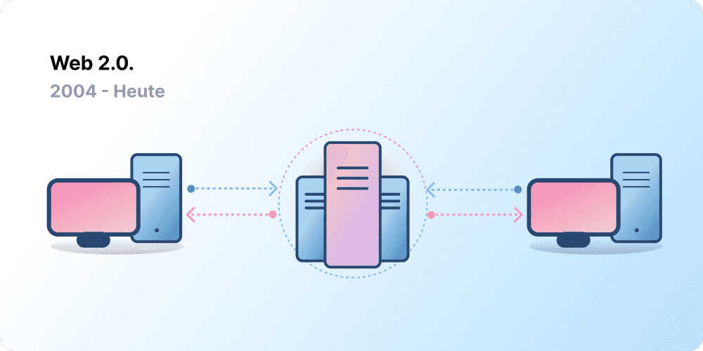
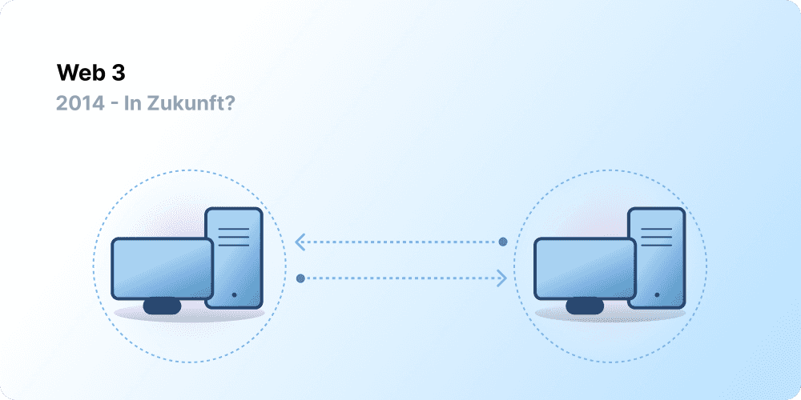

# Einführung in Web3 {#introduction}

<ListenToPlayer slug="/web3/" />

Zentralisierung hat dabei geholfen, Milliarden von Menschen in das World Wide Web zu bringen, und die stabile, robuste Infrastruktur geschaffen, auf der es existiert. Gleichzeitig hat eine Handvoll zentralisierter Instanzen eine Vormachtstellung über weite Teile des World Wide Web und entscheidet einseitig, was erlaubt sein soll und was nicht.

Web3 ist die Antwort auf dieses Dilemma. Anstelle eines Webs, das von großen Technologieunternehmen monopolisiert wird, setzt Web3 auf Dezentralisierung und wird von seinen Nutzern aufgebaut, betrieben und besessen. Web3 legt die Macht in die Hände von Einzelpersonen statt von Konzernen.
Bevor wir über Web3 sprechen, lassen Sie uns untersuchen, wie wir hierher gekommen sind.

<Divider />

## Das frühe Web {#early-internet}

Die meisten Menschen betrachten das Web als eine beständige Säule des modernen Lebens – es wurde erfunden und existiert seitdem einfach. Das Web, das die meisten von uns heute kennen, unterscheidet sich jedoch stark von dem, was ursprünglich erdacht wurde. Um dies besser zu verstehen, ist es hilfreich, die kurze Geschichte des Webs in grobe Zeitabschnitte zu unterteilen – Web 1.0 und Web 2.0.

### Web 1.0: Read-Only (1990-2004) {#web1}

Im Jahr 1989 war Tim Berners-Lee am CERN in Genf damit beschäftigt, die Protokolle zu entwickeln, die zum World Wide Web werden sollten. Seine Idee? Offene, dezentralisierte Protokolle zu schaffen, die den Informationsaustausch von jedem Ort der Erde aus ermöglichen.

Die erste Phase von Berners-Lees Schöpfung, heute bekannt als „Web 1.0“, fand grob zwischen 1990 und 2004 statt. Das Web 1.0 bestand hauptsächlich aus statischen Websites, die Unternehmen gehörten, und es gab fast keine Interaktion zwischen den Nutzern – Einzelpersonen produzierten selten Inhalte –, was dazu führte, dass es als das Read-Only-Web (Nur-Lese-Web) bekannt wurde.

### Web 2.0: Read-Write (2004-heute) {#web2}

Die Ära des Web 2.0 begann 2004 mit dem Aufkommen von Social-Media-Plattformen. Anstatt nur lesbar zu sein, entwickelte sich das Web zu einem Read-Write-Web (Lese-Schreib-Web). Anstatt dass Unternehmen den Nutzern nur Inhalte zur Verfügung stellten, begannen sie auch, Plattformen bereitzustellen, um nutzergenerierte Inhalte zu teilen und Interaktionen zwischen Nutzern zu ermöglichen. Als immer mehr Menschen online gingen, begann eine Handvoll Top-Unternehmen, einen unverhältnismäßig großen Teil des Datenverkehrs und der im Web generierten Werte zu kontrollieren. Das Web 2.0 brachte auch das werbefinanzierte Ertragsmodell hervor. Obwohl die Nutzer Inhalte erstellen konnten, besaßen sie diese nicht und profitierten auch nicht von deren Monetarisierung.

<Divider />

## Web 3.0: Read-Write-Own {#web3}

Der Begriff „Web 3.0“ wurde vom [Ethereum](/)-Mitbegründer Gavin Wood kurz nach dem Start von Ethereum im Jahr 2014 geprägt. Gavin formulierte eine Lösung für ein Problem, das viele frühe Krypto-Anwender spürten: Das Web erforderte zu viel Vertrauen. Das heißt, der Großteil des Webs, das die Menschen heute kennen und nutzen, beruht darauf, einer Handvoll privater Unternehmen zu vertrauen, dass sie im besten Interesse der Öffentlichkeit handeln.

### Was ist Web3? {#what-is-web3}

Web3 ist zu einem Sammelbegriff für die Vision eines neuen, besseren Internets geworden. Im Kern nutzt Web3 Blockchains, Kryptowährungen und NFTs, um den Nutzern die Macht in Form von Eigentum zurückzugeben. [Ein Twitter-Beitrag aus dem Jahr 2020](https://twitter.com/himgajria/status/1266415636789334016) brachte es auf den Punkt: Web1 war Read-Only (nur lesen), Web2 ist Read-Write (lesen und schreiben), Web3 wird Read-Write-Own (lesen, schreiben und besitzen) sein.

#### Kernideen von Web3 {#core-ideas}

Obwohl es schwierig ist, eine starre Definition dafür zu geben, was Web3 ist, leiten einige Kernprinzipien seine Entstehung.

- **Web3 ist dezentralisiert:** Anstatt dass weite Teile des Internets von zentralisierten Instanzen kontrolliert und besessen werden, wird das Eigentum unter seinen Erbauern und Nutzern verteilt.
- **Web3 ist erlaubnisfrei:** Jeder hat den gleichen Zugang, um an Web3 teilzunehmen, und niemand wird ausgeschlossen.
- **Web3 hat native Zahlungen:** Es verwendet Kryptowährung zum Ausgeben und Senden von Geld im Internet, anstatt sich auf die veraltete Infrastruktur von Banken und Zahlungsabwicklern zu verlassen.
- **Web3 ist vertrauenslos (trustless):** Es funktioniert mithilfe von Anreizen und wirtschaftlichen Mechanismen, anstatt sich auf vertrauenswürdige Dritte zu verlassen.

### Warum ist Web3 wichtig? {#why-is-web3-important}

Obwohl die Killer-Features von Web3 nicht isoliert sind und nicht in saubere Kategorien passen, haben wir der Einfachheit halber versucht, sie zu trennen, um sie leichter verständlich zu machen.

#### Eigentum {#ownership}

Web3 gibt Ihnen auf beispiellose Weise das Eigentum an Ihren digitalen Vermögenswerten. Nehmen wir zum Beispiel an, Sie spielen ein Web2-Spiel. Wenn Sie einen Gegenstand im Spiel kaufen, ist dieser direkt an Ihr Konto gebunden. Wenn die Entwickler des Spiels Ihr Konto löschen, verlieren Sie diese Gegenstände. Oder wenn Sie aufhören, das Spiel zu spielen, verlieren Sie den Wert, den Sie in Ihre In-Game-Gegenstände investiert haben.

Web3 ermöglicht direktes Eigentum durch [nicht-fungible Token (NFTs)](/glossary/#nft). Niemand, nicht einmal die Entwickler des Spiels, hat die Macht, Ihnen Ihr Eigentum wegzunehmen. Und wenn Sie aufhören zu spielen, können Sie Ihre In-Game-Gegenstände auf offenen Märkten verkaufen oder tauschen und ihren Wert zurückgewinnen. Entdecken Sie [Gaming auf der Blockchain](/gaming/), um dies in Aktion zu sehen.

<Alert variant="update">
<AlertEmoji text=":eyes:"/>
<AlertContent className="flex-row items-center justify-between">
  
Erfahren Sie mehr über NFTs

  <ButtonLink href="/nft/">
    Mehr zu NFTs
  </ButtonLink>
</AlertContent>
</Alert>

#### Zensurresistenz {#censorship-resistance}

Die Machtdynamik zwischen Plattformen und Erstellern von Inhalten ist massiv unausgewogen.

OnlyFans ist eine Website für nutzergenerierte Inhalte für Erwachsene mit über 1 Million Content-Erstellern, von denen viele die Plattform als ihre Haupteinnahmequelle nutzen. Im August 2021 kündigte OnlyFans Pläne an, sexuell explizite Inhalte zu verbieten. Die Ankündigung löste Empörung unter den Erstellern auf der Plattform aus, die das Gefühl hatten, auf einer Plattform, die sie mit aufgebaut hatten, um ihr Einkommen beraubt zu werden. Nach dem Aufschrei wurde die Entscheidung schnell rückgängig gemacht. Obwohl die Ersteller diesen Kampf gewonnen haben, verdeutlicht dies ein Problem für Web 2.0-Ersteller: Sie verlieren den Ruf und die Anhängerschaft, die Sie sich aufgebaut haben, wenn Sie eine Plattform verlassen.

Im Web3 leben Ihre Daten auf der Blockchain. Wenn Sie sich entscheiden, eine Plattform zu verlassen, können Sie Ihren Ruf mitnehmen und ihn in eine andere Schnittstelle einbinden, die besser mit Ihren Werten übereinstimmt.

Web 2.0 erfordert, dass Content-Ersteller darauf vertrauen, dass Plattformen die Regeln nicht ändern, aber Zensurresistenz ist eine native Eigenschaft einer Web3-Plattform.

#### Dezentrale Autonome Organisationen (DAOs) {#daos}

Neben dem Besitz Ihrer Daten im Web3 können Sie die Plattform auch als Kollektiv besitzen, indem Sie Token verwenden, die wie Anteile an einem Unternehmen fungieren. DAOs ermöglichen es Ihnen, das dezentralisierte Eigentum an einer Plattform zu koordinieren und Entscheidungen über deren Zukunft zu treffen.

DAOs sind technisch definiert als vereinbarte [Smart Contracts](/glossary/#smart-contract), die die dezentralisierte Entscheidungsfindung über einen Ressourcenpool (Token) automatisieren. Nutzer mit Token stimmen darüber ab, wie Ressourcen ausgegeben werden, und der Code führt das Abstimmungsergebnis automatisch aus.

Viele Menschen definieren jedoch viele Web3-Communitys als DAOs. Diese Communitys weisen alle unterschiedliche Grade an Dezentralisierung und Automatisierung durch Code auf. Derzeit untersuchen wir, was DAOs sind und wie sie sich in Zukunft entwickeln könnten.

<Alert variant="update">
<AlertEmoji text=":eyes:"/>
<AlertContent className="flex-row items-center justify-between">
  
Erfahren Sie mehr über DAOs

  <ButtonLink href="/dao/">
    Mehr zu DAOs
  </ButtonLink>
</AlertContent>
</Alert>

### Identität {#identity}

Traditionell würden Sie für jede Plattform, die Sie nutzen, ein Konto erstellen. Zum Beispiel könnten Sie ein Twitter-Konto, ein YouTube-Konto und ein Reddit-Konto haben. Möchten Sie Ihren Anzeigenamen oder Ihr Profilbild ändern? Sie müssen dies für jedes Konto einzeln tun. In einigen Fällen können Sie Social-Logins verwenden, aber dies birgt ein bekanntes Problem – Zensur. Mit einem einzigen Klick können diese Plattformen Sie aus Ihrem gesamten Online-Leben aussperren. Noch schlimmer ist, dass viele Plattformen verlangen, dass Sie ihnen personenbezogene Daten anvertrauen, um ein Konto zu erstellen.

Web3 löst diese Probleme, indem es Ihnen ermöglicht, Ihre digitale Identität mit einer Ethereum-Adresse und einem [Ethereum Name Service (ENS)](/glossary/#ens)-Profil zu kontrollieren. Die Verwendung einer Ethereum-Adresse bietet ein einziges Login über Plattformen hinweg, das sicher, zensurresistent und anonym ist.

### Native Zahlungen {#native-payments}

Die Zahlungsinfrastruktur von Web2 stützt sich auf Banken und Zahlungsabwickler und schließt Menschen ohne Bankkonten oder solche, die zufällig innerhalb der Grenzen des falschen Landes leben, aus.
Web3 verwendet Token wie [ETH](/glossary/#ether), um Geld direkt im Browser zu senden, und erfordert keine vertrauenswürdige dritte Partei.

<ButtonLink href="/eth/">
  Mehr zu ETH
</ButtonLink>

## Einschränkungen von Web3 {#web3-limitations}

Trotz der zahlreichen Vorteile von Web3 in seiner jetzigen Form gibt es noch viele Einschränkungen, die das Ökosystem angehen muss, damit es florieren kann.

### Zugänglichkeit {#accessibility}

Wichtige Web3-Funktionen, wie „Sign-in with Ethereum“ (Anmelden mit Ethereum), stehen bereits jedem kostenlos zur Verfügung. Aber die relativen Kosten von Transaktionen sind für viele immer noch unerschwinglich. Web3 wird in weniger wohlhabenden Entwicklungsländern aufgrund hoher Transaktionsgebühren wahrscheinlich seltener genutzt. Auf Ethereum werden diese Herausforderungen durch [die Roadmap](/roadmap/) und [Ebene-2-Skalierungslösungen](/glossary/#layer-2) gelöst. Die Technologie ist bereit, aber wir benötigen eine höhere Akzeptanz auf Ebene 2, um Web3 für alle zugänglich zu machen.

### Benutzererfahrung {#user-experience}

Die technische Einstiegshürde für die Nutzung von Web3 ist derzeit zu hoch. Nutzer müssen Sicherheitsbedenken begreifen, komplexe technische Dokumentationen verstehen und sich in wenig intuitiven Benutzeroberflächen zurechtfinden. Insbesondere [Wallet-Anbieter](/wallets/find-wallet/) arbeiten daran, dies zu lösen, aber es sind weitere Fortschritte erforderlich, bevor Web3 massenhaft angenommen wird.

### Bildung {#education}

Web3 führt neue Paradigmen ein, die das Erlernen anderer mentaler Modelle erfordern als die im Web 2.0 verwendeten. Eine ähnliche Bildungsoffensive fand statt, als das Web 1.0 in den späten 1990er Jahren an Popularität gewann; Befürworter des World Wide Web nutzten eine Vielzahl von Aufklärungstechniken, um die Öffentlichkeit zu informieren, von einfachen Metaphern (die Datenautobahn, Browser, Surfen im Web) bis hin zu [Fernsehsendungen](https://www.youtube.com/watch?v=SzQLI7BxfYI). Web3 ist nicht schwierig, aber es ist anders. Bildungsinitiativen, die Web2-Nutzer über diese Web3-Paradigmen informieren, sind für seinen Erfolg von entscheidender Bedeutung.

Ethereum.org trägt durch unser [Übersetzungsprogramm](/contributing/translation-program/) zur Web3-Bildung bei, mit dem Ziel, wichtige Ethereum-Inhalte in so viele Sprachen wie möglich zu übersetzen.

### Zentralisierte Infrastruktur {#centralized-infrastructure}

Das Web3-Ökosystem ist jung und entwickelt sich schnell. Infolgedessen hängt es derzeit hauptsächlich von zentralisierter Infrastruktur ab (GitHub, Twitter, Discord usw.). Viele Web3-Unternehmen beeilen sich, diese Lücken zu schließen, aber der Aufbau einer hochwertigen, zuverlässigen Infrastruktur braucht Zeit.

## Eine dezentralisierte Zukunft {#decentralized-future}

Web3 ist ein junges und sich entwickelndes Ökosystem. Gavin Wood prägte den Begriff im Jahr 2014, aber viele dieser Ideen sind erst vor kurzem Realität geworden. Allein im letzten Jahr gab es einen beträchtlichen Anstieg des Interesses an Kryptowährung, Verbesserungen bei Ebene-2-Skalierungslösungen, massive Experimente mit neuen Formen der Governance und Revolutionen in der digitalen Identität.

Wir stehen erst am Anfang der Schaffung eines besseren Webs mit Web3, aber während wir die Infrastruktur, die es unterstützen wird, weiter verbessern, sieht die Zukunft des Webs rosig aus.

## Wie kann ich mich einbringen? {#get-involved}

- [Holen Sie sich ein Wallet](/wallets/)
- [Finden Sie eine Community](/community/)
- [Entdecken Sie Web3-Anwendungen](/apps/)
- [Treten Sie einer DAO bei](/dao/)
- [Bauen Sie auf Web3](/developers/)

## Weiterführende Literatur {#further-reading}

Web3 ist nicht starr definiert. Verschiedene Teilnehmer der Community haben unterschiedliche Perspektiven darauf. Hier sind einige davon:

- [What is Web3? The Decentralized Internet of the Future Explained](https://www.freecodecamp.org/news/what-is-web3) – _Nader Dabit_
- [Making Sense of Web 3](https://medium.com/l4-media/making-sense-of-web-3-c1a9e74dcae) – _Josh Stark_
- [Why Web3 Matters](https://a16zcrypto.com/posts/article/why-web3-matters/) — _Chris Dixon_
- [Why Decentralization Matters](https://onezero.medium.com/why-decentralization-matters-5e3f79f7638e) - _Chris Dixon_
- [The Web3 Landscape](https://a16z.com/wp-content/uploads/2021/10/The-web3-Readlng-List.pdf) – _a16z_
- [The Web3 Debate](https://www.notboring.co/p/the-web3-debate) – _Packy McCormick_

<QuizWidget quizKey="web3" />