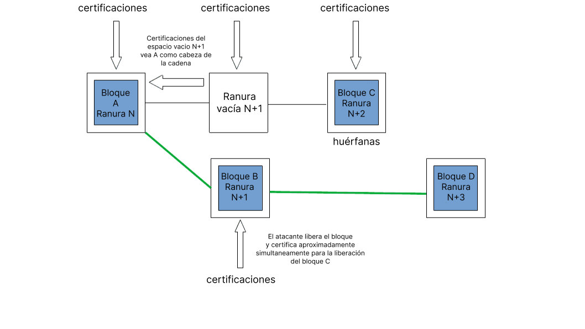

Los ladrones y saboteadores buscan constantemente oportunidades para atacar el software cliente de Ethereum. Esta página describe los vectores de ataque conocidos en la capa de consenso de Ethereum y describe cómo se pueden defender esos ataques. La información de esta página está resumida de una [versión más larga](https://mirror.xyz/jmcook.eth/YqHargbVWVNRQqQpVpzrqEQ8IqwNUJDIpwRP7SS5FXs).

## Prerrequisitos {#prerequisites}

Se requieren algunos conocimientos básicos de la[prueba de participación](/developers/docs/consensus-mechanisms/pos/). Además, será útil tener una comprensión básica de la [capa de incentivos](/developers/docs/consensus-mechanisms/pos/rewards-and-penalties) y del algoritmo de elección de bifurcación de Ethereum, [LMD-GHOST](/developers/docs/consensus-mechanisms/pos/gasper).

## ¿Qué quieren los atacantes? {#what-do-attackers-want}

Un error común es pensar que un atacante exitoso puede generar nuevo ether o drenar ether de cuentas arbitrarias. Nada de esto es posible, porque todas las transacciones las ejecutan todos los clientes de ejecución de la red. Deben cumplir con las condiciones básicas de validez (por ejemplo, las transacciones están firmadas con la clave privada del remitente, el remitente tiene suficiente saldo, etc.) o de lo contrario simplemente se revierten. Hay tres clases de resultados a las que un atacante podría apuntar de manera realista: reorganización, doble finalidad o retraso de finalización.

Una **«reorg»** es una reorganización de bloques en un nuevo orden, tal vez con alguna adición o sustracción de bloques en la cadena predilecta. Una reorg maliciosa podría garantizar que se incluyan o excluyan bloques específicos, lo que permite el doble gasto o la extracción de valor mediante transacciones (MEV) frontrunning (ventajistas) y backrunning (consecuentes). Las reorg también podrían utilizarse para evitar que ciertas transacciones se incluyan en la cadena predilecta, una forma de censura. La forma más extrema de reorganización es la «reversión de la finalidad», que elimina o reemplaza los bloques que se han finalizado previamente. Esto solo es posible si el atacante destruye más de 1/3 del total del ether en participación, esta garantía se conoce como «finalidad económica» y lo aborderemos más adelante.

**Doble finalidad** es la condición improbable pero grave en la que dos bifurcaciones pueden finalizar simultáneamente, creando una desunión permanente en la cadena. Esto es teóricamente posible para un atacante dispuesto a arriesgar el 34 % del total de ether en participación. La comunidad se vería obligada a coordinar fuera de la cadena y llegar a un acuerdo sobre qué cadena seguir, lo que requeriría fuerza en la capa social.

Un ataque de **retraso de finalidad** impide que la red alcance las condiciones necesarias para finalizar secciones de la cadena. Sin finalidad, es difícil confiar en las aplicaciones financieras construidas sobre Ethereum. El objetivo de un ataque de retraso de finalidad es simplemente interrumpir Ethereum en lugar de beneficiarse directamente, a menos que el atacante tenga alguna posición estratégica corta.

Un ataque a la capa social podría tener como objetivo socavar la confianza del público en Ethereum, devaluar el ether, reducir la adopción o debilitar a la comunidad de Ethereum para dificultar la coordinación fuera de banda.

Ahora que ya sabemos por qué un adversario podría atacar Ethereum, en las siguientes secciones examinaremos _cómo_ podrían hacerlo.

## Métodos de ataque {#methods-of-attack}

### Ataques de capa 0 {#layer-0}

En primer lugar, las personas que no participan activamente en Ethereum (ejecutando el software del cliente) pueden atacar apuntando a la capa social (Capa 0). La capa 0 es la base sobre la que se construye Ethereum y, como tal, representa una superficie potencial para los ataques con consecuencias que crean una reacción en cadena por el resto del bloque. Algunos ejemplos podrían incluir:

- Una campaña de desinformación podría erosionar la confianza que la comunidad tiene en la hoja de ruta de Ethereum, los equipos de desarrolladores, las aplicaciones, etc. Esto podría disminuir el número de personas dispuestas a participar en la seguridad de la red, degradando tanto la descentralización como la seguridad criptoeconómica.
- Ataques dirigidos y/o intimidaciones hacia la comunidad de desarrolladores. Esto podría ocasionar la salida voluntaria de los desarrolladores y ralentizar el progreso de Ethereum.

- La regulación exagerada también podría considerarse un ataque a la capa 0, ya que podría disincentivar rápidamente la participación y la adopción.
- Infiltración de operadores expertos con malas intenciones en la comunidad de desarrolladores cuyo objetivo es ralentizar el progreso mediante procrastinación en debates, el retraso de las decisiones clave, la creación de correos basura, etc.
- Sobornos a operadores clave en el ecosistema de Ethereum para influir en la toma de decisiones.

Lo que hace que estos ataques sean especialmente peligrosos es que, en muchos casos, se requiere muy poco capital o conocimientos técnicos. Un ataque de capa 0 podría ser un multiplicador de un ataque criptoeconómico. Por ejemplo, si una parte interesada mayoritariamente maliciosa logra la censura o la reversión de la finalidad, socavar la capa social podría dificultar la coordinación de una respuesta de la comunidad fuera de banda.

Defenderse contra los ataques de capa 0 probablemente no sea sencillo, pero se pueden establecer algunos principios básicos. Uno es mantener una alta relación general de ruido para la información pública sobre Ethereum, creada y propagada por miembros honestos de la comunidad a través de blogs, servidores de Discord, especificaciones anotadas, libros, pódcasts y Youtube. Aquí en ethereum.org nos esforzamos por mantener la información precisa y traducirla a tantos idiomas como sea posible. Inundar un espacio con información y memes de alta calidad es una defensa eficaz contra la desinformación.

Otro escudo importante contra los ataques de la capa social es una clara declaración de misión y un protocolo de gobernanza. Ethereum se ha posicionado como el campeón de la descentralización y la seguridad entre capas 1 de contratos inteligentes, a la vez que valora altamente la escalabilidad y la sostenibilidad. Cualesquiera que sean los desacuerdos que surjan en la comunidad Ethereum, afectan mínimamente a estos principios básicos. Evaluar una narrativa contra estos principios básicos y examinarlos a través de sucesivas rondas de revisión en el proceso de EIP (propuesta de mejora de Ethereum), podría ayudar a la comunidad a distinguir a los operadores buenos de los malos y limitar el alcance de los maliciosos en la dirección futura de Ethereum.

Por último, es fundamental que la comunidad de Ethereum permanezca abierta y receptiva para todos los participantes. Una comunidad con guardianes y exclusividad es especialmente vulnerable al ataque social porque es fácil construir narrativas de «nosotros y ellos». El tribalismo y el maximalismo tóxico dañan a la comunidad y erosionan la seguridad de la capa 0. Los ethereans con un interés personal en la seguridad de la red deben ver su conducta en línea y en el mundo real como una contribución directa a la seguridad de la capa 0 de Ethereum.

### Cómo atacar el protocolo {#attacking-the-protocol}

Cualquiera puede ejecutar el software cliente de Ethereum. Para añadir un validador a un cliente, un usuario debe participar con 32 ether en el contrato de depósito. Un validador permite a un usuario participar activamente en la seguridad de la red de Ethereum proponiendo y certificando nuevos bloques. El validador ahora tiene una voz que puede usar para influir en el contenido futuro de la cadena de bloques y puede hacerlo honestamente y hacer crecer su bloque de ether a través de recompensas, o puede tratar de manipular el proceso para su propio beneficio, arriesgando su participación. Una forma de montar un ataque es acumular una mayor proporción de la participación total y luego usarla para superar a los validadores honestos. Cuanto mayor sea la proporción de la participación controlada por el atacante, mayor será su poder de voto, especialmente en ciertos hitos económicos que exploraremos más adelante. Sin embargo, la mayoría de los atacantes no podrán acumular suficiente ether para atacar de esta manera, por lo que en su lugar tienen que usar técnicas sutiles para manipular a la mayoría honesta para que actúe de cierta manera.

Fundamentalmente, todos los ataques de participación pequeña son variaciones sutiles en dos tipos de mal comportamiento del validador: subactividad (no certificar/proponer o hacerlo tarde) o sobreactividad (proponer/acreditar demasiadas veces en una ranura). En sus formas más suave, estas acciones son manejadas fácilmente por el algoritmo de elección de bifurcación y la capa de incentivos, pero hay formas inteligentes de jugar el sistema en beneficio de un atacante.

### Ataques que utilizan pequeñas cantidades de ETH {#attacks-by-small-stakeholders}

#### reorgs {#reorgs}

Varios documentos han explicado los ataques a Ethereum que logran reorgs o retrasos en la finalidad con solo una pequeña proporción del total de ether en participación. Estos ataques generalmente se basan en que el atacante retiene cierta información de otros validadores y luego la libera de alguna manera matizada y/o en algún momento oportuno. Su objetivo es desplazar a algún bloque honesto de la cadena predilecta. [Neuder et al 2020](https://arxiv.org/pdf/2102.02247.pdf) mostró cómo un validador atacante puede crear y certificar un bloque (`B`) para una ranura en particular `n+1`, pero abstenerse de propagarlo a otros nodos de la red. En su lugar, se aferran a ese bloque certificado hasta la siguiente ranura `n+2`. Un validador honesto propone un bloque (`C`) para la ranura `n+2`. Casi simultáneamente, el atacante puede liberar su bloque retenido (`B`) y sus certificados retenidos para ello, y también certificar que `B` es la cabeza de la cadena con sus votos para la ranura `n+2`, negar la existencia de un bloque honesto `C`. Cuando se libera el bloque honesto `D`, el algoritmo de elección de bifurcación ve `D` construido sobre `B` es más pesado que `D` construido sobre `C`. Por lo tanto, el atacante ha logrado eliminar el bloque honesto `C` en la ranura `n+2` de la cadena predilecta utilizando una reorg ex antes de 1 bloque. [Un atacante con el 34 %](https://www.youtube.com/watch?v=6vzXwwk12ZE) de la apuesta tiene muy buenas posibilidades de tener éxito en este ataque, como se explica [en esta nota](https://notes.ethereum.org/plgVdz-ORe-fGjK06BZ_3A#Fork-choice-by-block-slot-pair). En teoría, sin embargo, este ataque podría intentarse con participaciones más pequeñas. [Neuder et al 2020](https://arxiv.org/pdf/2102.02247.pdf) describieron este ataque trabajando con una participación del 30 %, pero más tarde se demostró que era viable con [2 % de la participación total](https://arxiv.org/pdf/2009.04987.pdf) y luego de nuevo [validador único](https://arxiv.org/abs/2110.10086#) Utilizando técnicas de equilibrio que examinaremos en la siguiente sección.

Un diagrama conceptual del ataque de reorg de un bloque descrito anteriormente (adaptado de https://notes.ethereum.org/plgVdz-ORe-fGjK06BZ_3A#Fork-choice-by-block-slot-pair)

Un ataque más sofisticado puede dividir el validador honesto establecido en grupos discretos que tienen diferentes puntos de vista de la cabeza de la cadena. Esto se conoce como un **ataque de equilibrio**. El atacante espera su oportunidad de proponer un bloque, y cuando llega se equivocan y proponen dos. Envían un bloque a la mitad del conjunto de validadores honestos y el otro bloque a la otra mitad. El equívoco sería detectado por el algoritmo de elección de bifurcación y se recortaría y expulsaría de la red al proponente de bloques, pero los dos bloques todavía existirían y tendrían aproximadamente la mitad del conjunto de validadores que certifican cada bifurcación. Mientras tanto, los validadores maliciosos restantes retienen sus certificaciones. Luego, al liberar selectivamente las certificaciones que favorecen una u otra bifurcación a suficientes validadores justo cuando se ejecuta el algoritmo de elección de bifurcación, inclinan el peso acumulado de las certificaciones a favor de una u otra bifurcación. Esto puede continuar indefinidamente, con los validadores atacantes manteniendo una división uniforme de validadores en las dos bifurcaciones. Dado que ninguna de las dos bifurcaciones puede atraer a una supermayoría de 2/3, la red no finalizaría.

**Los ataques de rebote** son similares. Los validadores atacantes vuelven a retener los votos. En lugar de liberar los votos para mantener una división uniforme entre dos bifurcaciones, utilizan sus votos en momentos oportunos para justificar los puntos de control que se alternan entre la bifurcación A y la bifurcación B. Este vaivén de justificación entre dos bifurcaciones evita que haya pares de puntos de control de origen y destino justificados que se pueden finalizar en cualquiera de las cadenas, deteniendo la finalidad.

<YouTube id="xcPxwhrg3Ao"/>

Tanto los ataques de rebote como los de equilibrio dependen de que el atacante tenga un control muy preciso de la sincronización de los mensajes en toda la red, lo cual es poco probable. No obstante, las defensas están integradas en el protocolo en forma de ponderación adicional dada a los avisos de mensajes en comparación con los lentos. Esto se conoce como [impulso del peso del proponente](https://github.com/ethereum/consensus-specs/pull/2730). Para defenderse de los ataques de rebote, se actualizó el algoritmo de selección de bifurcación para que el último punto de control justificado sólo pueda cambiar al de una cadena alternativa durante el [primer 1/3 de las ranuras en cada época](https://ethresear.ch/t/prevention-of-bouncing-attack-on-ffg/6114). Esta condición evita que el atacante ahorre votos para desplegarlos más tarde: el algoritmo de elección de bifurcación simplemente se mantiene fiel al punto de control que eligió en el primer 1/3 de la época durante el cual los validadores más honestos habrían votado.

Combinadas, estas medidas crean un escenario en el que un proponente de bloques honesto emite su bloque muy rápidamente después del inicio de la ranura, luego hay un período de ~1/3 de una ranura (4 segundos) en el que ese nuevo bloque podría hacer que el algoritmo de elección de bifurcación cambie a otra cadena. Después de esa misma fecha límite, las certificaciones que lleguen de validadores lentos se ponderan en comparación con los que llegaron antes. Esto favorece poderosamente a los proponentes de avisos y validadores a la hora de determinar la cabeza de la cadena y reduce sustancialmente la probabilidad de un ataque de equilibrio o rebote exitoso.

Vale la pena señalar que el impulso del proponente por sí solo solo se defiende contra las «reorgs baratas», es decir, las intentadas por un atacante con una pequeña participación. De hecho, el impulso de la propuesta en sí mismo puede ser jugado por partes interesadas más grandes. Los autores de [esta publicación](https://ethresear.ch/t/change-fork-choice-rule-to-mitigate-balancing-and-reorging-attacks/11127) describen cómo un atacante con el 7 % de participación puede desplegar sus votos estratégicamente para engañar a los validadores honestos para que construyan su bifurcación, reorganizando un bloque honesto. Este ataque se ideó asumiendo condiciones de latencia ideales que son muy poco probables. Las probabilidades siguen siendo muy altas para el atacante, y la mayor participación también significa más capital en riesgo y un desincentivo económico más fuerte.

También se propuso un [ataque de equilibrio dirigido específicamente a la regla LMD](https://ethresear.ch/t/balancing-attack-lmd-edition/11853), que se sugirió que fuera viable a pesar del aumento del proponente. Un atacante establece dos cadenas competidoras equivocando su propuesta de bloque y propagando cada bloque a aproximadamente la mitad de la red cada uno, estableciendo un equilibrio aproximado entre las bifurcaciones. Luego, los validadores confabulados equivocan sus votos, programándolo para que la mitad de la red reciba sus votos para bifurcación `A` primero y la otra mitad reciba sus votos para bifurcación`B` primero. Dado que la regla LMD descarta la segunda certificación y mantiene solo la primera para cada validador, la mitad de la red ve votos para `A` y ninguno para `B`, la otra mitad ve votos para `B` y ninguno para `A`. Los autores describen la regla LMD que le da al adversario un «poder notable» para montar un ataque de equilibrio.

Este vector de ataque LMD fue cerrado por [actualizando el algoritmo de elección de bifurcación](https://github.com/ethereum/consensus-specs/pull/2845) para que descarte por completo los validadores equívocos de la consideración de elección de bifurcación. Los validadores equívocos también tienen su influencia futura descontada por el algoritmo de elección de bifurcación. Esto evita el ataque de equilibrio descrito anteriormente, al tiempo que mantiene la resiliencia contra los ataques avalanchas.

Otra clase de ataque, llamada [**ataques de avalancha**](https://ethresear.ch/t/avalanche-attack-on-proof-of-stake-ghost/11854/3), se describió en un artículo[en marzo de 2022](https://arxiv.org/pdf/2203.01315.pdf). Para montar un ataque avalancha, el atacante necesita controlar a varios proponentes de bloques consecutivos. En cada una de las ranuras de los proponentes de bloque, el atacante retiene su bloque, recogiéndolos hasta que la cadena honesta alcance un peso de subárbol igual con los bloques retenidos. Luego, los bloques retenidos se liberan para que sean equívocos al máximo. Los autores sugieren que el impulso del proponente, la defensa principal contra los ataques de equilibrio y de rebote no protegen contra algunas variantes de ataques avalancha. Sin embargo, los autores también solo demostraron el ataque a una versión altamente idealizada del algoritmo de selección de bifurcación de Ethereum (usaron GHOST sin LMD).

El ataque avalancha se ve mitigado por la parte LMD del algoritmo de elección de bifurcación LMD-GHOST. LMD significa «last message driven» (último mensaje dirigido) y se refiere a una tabla mantenida por cada validador que contiene el último mensaje recibido de otros validadores. Ese campo solo se actualiza si el nuevo mensaje es de una ranura posterior a la que ya está en la tabla para un validador en particular. En la práctica, esto significa que en cada ranura, el primer mensaje recibido es el que aceptó y cualquier mensaje adicional es una equivocación que se debe ignorar. Dicho de otra manera, los clientes de consenso no cuentan las equivocaciones: utilizan el primer mensaje que llega de cada validador y las equivocaciones simplemente se descartan, evitando los ataques avalancha.

Hay varias otras posibles actualizaciones futuras de la regla de elección de bifurcación que podrían aumentar la seguridad proporcionada por el impulsor-proponente. Una es [view-merge](https://ethresear.ch/t/view-merge-as-a-replacement-for-proposer-boost/13739), donde los certificadores congelan su vista de la opción de bifurcación `n` segundos antes del inicio de una ranura y el proponente luego ayuda a sincronizar la vista de la cadena a través de la red. Otra actualización potencial es [finalidad de una sola ranura](https://notes.ethereum.org/@vbuterin/single_slot_finality), que protege contra los ataques basados en el tiempo del mensaje al finalizar la cadena después de una sola ranura.

#### Retraso de finalidad {#finality-delay}

[El mismo documento](https://econcs.pku.edu.cn/wine2020/wine2020/Workshop/GTiB20_paper_8.pdf) que describió por primera vez el ataque de reorganización de un solo bloque de bajo coste también describió un ataque de retraso de finalidad (también conocido como «fracaso de vivacidad») que se basa en que el atacante sea el proponente de bloques para un bloque de límite de época. Esto es fundamental porque estos bloques de límites de época se convierten en los puntos de control que Casper FFG utiliza para finalizar partes de la cadena. El atacante simplemente retiene su bloqueo hasta que suficientes validadores honestos utilicen sus votos de FFG a favor del bloqueo límite de la época anterior como el objetivo de finalización actual. Luego liberan su bloqueo retenido. Certifican su bloqueo y los validadores honestos restantes también crean bifurcaciones con diferentes puntos de control de destino. Si lo cronometran bien, evitarán la finalidad, porque no habrá una supermayoría de 2/3 que acredite ninguna de las dos bifurcaciones. Cuanto menor sea la participación, más preciso debe ser el momento, porque el atacante controla menos certificaciones directamente, y menor es la probabilidad de que el atacante controle al validador que propone un determinado bloque de límite de época.

#### Ataques de largo alcance {#long-range-attacks}

También hay una clase de ataque específico para las cadenas de bloques de prueba de participación que involucra a un validador que participó en el bloque inicial manteniendo una bifurcación separada de la cadena de bloques junto con la honesta, convenciendo finalmente al validador honesto de cambiar a ella en algún momento oportuno mucho más tarde. Este tipo de ataque no es posible en Ethereum debido al dispositivo de finalidad que garantiza que todos los validadores estén de acuerdo en el estado de la cadena honesta a intervalos regulares («puntos de control»). Este simple mecanismo neutraliza a los atacantes de largo alcance, porque los clientes de Ethereum simplemente no reorganizan los bloques finalizados. Los nuevos nodos que se unen a la red lo hacen encontrando un hash de estado reciente fiable (un «[punto de control](https://blog.ethereum.org/2014/11/25/proof-stake-learned-love-weak-subjectivity/) de sujetividad débil») y usándolo como un bloque de pseudoinicial para construir sobre él. Esto crea una «pasarela de confianza» para que un nuevo nodo entre en la red antes de que pueda comenzar a verificar la información por sí mismo.

#### Denegación de servicio {#denial-of-service}

El mecanismo PoS de Ethereum selecciona un solo validador del grupo de validadores totales establecido para ser un proponente de bloques en cada ranura. Esto se puede calcular utilizando una función conocida públicamente y es posible que un adversario identifique al siguiente proponente de bloques un poco antes de su propuesta de bloques. Luego, el atacante puede enviar correo basura al proponente del bloque para evitar que intercambie información con sus compañeros. Para el resto de la red, parecería que el proponente de bloques estuviera fuera de línea y la ranura simplemente se quedaría vacía. Esto podría ser una forma de censura contra validadores específicos, impidiéndoles agregar información a la cadena de bloques. La implementación de elecciones de un solo líder secreto (SSLE) o elecciones de no solo un líder secreto mitigará los riesgos de DoS, porque solo el proponente del bloque sabe que han sido seleccionados y la selección no se puede conocer de antemano. Esto aún no se ha implementado, pero es un área activa de [investigación y desarrollo](https://ethresear.ch/t/secret-non-single-leader-election/11789).

Todo esto apunta al hecho de que es muy difícil atacar con éxito a Ethereum con una pequeña participación. Los ataques viables que se han descrito aquí requieren un algoritmo de elección de bifurcación idealizado, condiciones de red improbables o los vectores de ataque ya se han cerrado con parches relativamente menores para el software del cliente. No se descarta, por descontado, la posibilidad de que existan días cero en la naturaleza, pero demuestra el nivel extremadamente alto de aptitud técnica, el conocimiento de la capa de consenso y la suerte que se requiere para que un atacante de participación minoritaria sea efectivo. Desde la perspectiva de un atacante, su mejor apuesta podría ser acumular la mayor cantidad de ether posible y regresar armado con una mayor proporción de la participación total.

### Atacantes que usan >= 33 % de la participación total {#attackers-with-33-stake}

Todos los ataques mencionados anteriormente en este artículo tienen más probabilidades de tener éxito cuando el atacante tiene más ether en juego para votar, y más validadores que podrían ser elegidos para proponer bloques en cada ranura. Por lo tanto, un validador malicioso podría tener como objetivo controlar la mayor cantidad de ether en participación posible.

El 33 % del ether en participación es un punto de referencia para un atacante porque con algo mayor que esta cantidad tienen la capacidad de evitar que la cadena finalice sin tener que controlar finamente las acciones de los otros validadores. Simplemente pueden desaparecer todos juntos. Si 1/3 o más del ether en participación está atestado maliciosamente o falla en ser atestado, entonces no puede existir una supermayoría de 2/3 y la cadena no puede finalizar. La defensa contra esto es la pérdida de inactividad. La pérdida de inactividad identifica a aquellos validadores que no están certificando o están certificando lo contrario que la mayoría. El ether apostado en propiedad de estos validadores no certificadores se desvanece gradualmente hasta que finalmente representan colectivamente menos de 1/3 del total para que la cadena pueda finalizar de nuevo.

El propósito de la pérdida de inactividad es hacer que la cadena finalice de nuevo. No obstante, el atacante también pierde una parte de su ether apostado. La inactividad persistente entre los validadores que representan el 33 % del total de ether apostado es muy cara, a pesar de que los validadores no están recortados.

Suponiendo que la red Ethereum sea asíncrona (es decir, que haya retrasos entre los mensajes que se envían y se reciben), un atacante que controla el 34 % de la participación total podría causar una doble finalidad. Esto se debe a que el atacante puede equivocarse cuando se le elige para ser un productor de bloques, y luego votar dos veces con todos sus validadores. Esto crea una situación en la que existe una bifurcación de la cadena de bloques, cada una con el 34 % del ether en participación votando por ella. Cada bifurcación solo requiere que el 50 % de los validadores restantes voten a su favor para que ambas bifurcaciones sean apoyadas por una supermayoría, en cuyo caso ambas cadenas pueden finalizar (porque el 34 % de los validadores atacantes + la mitad del 66 % restante = al 67 % en cada bifurcación). Los bloques en competencia tendrían que ser recibidos por alrededor del 50% de los validadores honestos, por lo que este ataque es viable solo cuando el atacante tiene cierto grado de control sobre el momento en que los mensajes se propagan a través de la red para que puedan empujar a la mitad de los validadores honestos en cada cadena. El atacante destruiría necesariamente toda su participación (34% de ~10 millones de ether con el conjunto de validadores de hoy) para lograr esta doble finalidad porque el 34% de sus validadores tendrían doble voto simultáneamente, una ofensa que se puede cortar con la máxima penalización de correlación. La defensa contra este ataque es el gran coste de destruir el 34 % del total de ether apostado. Recuperarse de este ataque requeriría que la comunidad de Ethereum coordinara «fuera de banda» y acordara seguir una u otra de las bifurcaciones e ignorar la otra.

### Atacantes que usan ~50% de la participación total {#attackers-with-50-stake}

Al 50 % del ether en participación, un grupo malicioso de validadores podría teóricamente dividir la cadena en dos bifurcaciones de igual tamaño y luego simplemente usar todo su 50 % de participación para votar en contra del conjunto de validadores honestos, manteniendo así las dos bifurcaciones y evitando la finalidad. La fuga de inactividad en ambas bifurcaciones eventualmente llevaría a ambas cadenas a finalizar. Llegados a este punto, la única opción es recurrir a una recuperación social.

Es muy poco probable que un grupo adversario de validadores pudiera controlar constantemente con precisión el 50 % de la participación total, dado un grado de flujo en los números de validadores honestos, la latencia de la red, etc. El enorme coste de montar un ataque de este tipo, combinado con la baja probabilidad de éxito parece ser un importante freno para un atacante racional, especialmente cuando una pequeña inversión adicional en la obtención de _más de_ 50 % desbloquea mucha más potencia.

Con el >50 % de la participación total, el atacante podría dominar el algoritmo de elección de bifurcación. En este caso, el atacante podría dar fe con el voto mayoritario, dándoles el control suficiente para hacer reorgs cortas sin necesidad de engañar a los clientes honestos. Los validadores honestos seguirían su ejemplo porque su algoritmo de elección de bifurcación también consideraría a la cadena favorita del atacante como la más pesada, por lo que la cadena podría finalizar. Esto permite al atacante censurar ciertas transacciones, hacer reorganizaciones de corto alcance y extraer el MEV máximo reordenando los bloques a su favor. La defensa contra esto es el enorme coste de una participación mayoritaria (actualmente poco menos de 19.000 millones de dólares) que ponen en riesgo un atacante, porque es probable que la capa social intervenga y adopte una bifurcación de minoría honesta, devaluando dramáticamente la participación del atacante.

### Atacantes que usan >=66 % de la participación total {#attackers-with-66-stake}

Un atacante con el 66 % o más del total de ether apostado puede finalizar su cadena preferida sin tener que coaccionar a ningún validador honesto. El atacante puede votar por su bifurcación preferida y luego finalizarla, simplemente porque puede votar con una supermayoría deshonesta. Como parte interesada de la supermayoría, el atacante siempre controlaría el contenido de los bloques finalizados, con el poder de gastar, rebobinar y gastar de nuevo, censurar ciertas transacciones y reorganizar la cadena a voluntad. Al comprar ether adicional para controlar el 66 % en lugar del 51 %, el atacante está comprando efectivamente la capacidad de hacer antiguas reorgs pasadas y reversiones de finalidad (es decir, cambiar el pasado, así como controlar el futuro). Las únicas defensas reales aquí son el enorme coste del 66 % del total de ether en participación, y la opción de recurrir a la capa social para coordinar la adopción de una bifurcación alternativa. Podemos ahondar en esto con más detalle en la siguiente sección.

## Las personas: la última línea de defensa {#people-the-last-line-of-defense}

Si los validadores deshonestos logran finalizar su versión preferida de la cadena, la comunidad de Ethereum se encuentra en una situación difícil. La cadena predilecta incluye una sección deshonesta incorporada en su historia, mientras que los validadores honestos pueden terminar siendo castigados por certificar una cadena alternativa (honesta). Tenga en cuenta que una cadena finalizada pero incorrecta también podría surgir de un error en un cliente mayoritario. Al fin y al cabo, la última alternativa es confiar en la capa social, la capa 0, para resolver la situación.

Uno de los puntos fuertes del consenso PoS de Ethereum es que hay una [gama de estrategias defensivas](https://youtu.be/1m12zgJ42dI?t=1712) que la comunidad puede emplear frente a un ataque. Una respuesta mínima podría ser el obligar a salir por la fuerza a los validadores de los atacantes de la red sin ninguna penalización adicional. Para volver a entrar en la red, el atacante tendría que unirse a una cola de activación que garantice que el conjunto de validadores crezca gradualmente. Por ejemplo, agregar suficientes validadores para duplicar la cantidad de ether apostado tarda unos 200 días, comprando efectivamente los validadores honestos 200 días antes de que el atacante pueda intentar otro ataque del 51 %. No obstante, la comunidad también podría optar por penalizar al atacante más duramente, revocando las recompensas pasadas o quemando alguna parte (hasta el 100 %) de su capital en participación.

Cual sea la penalización impuesta al atacante, la comunidad también tiene que decidir juntos si la cadena deshonesta, a pesar de ser la favorecida por el algoritmo de elección de bifurcación codificado en los clientes de Ethereum, es de hecho inválida y que la comunidad debería construir encima de la cadena honesta en su lugar. Los validadores honestos podrían acordar colectivamente construir sobre una bifurcación de la cadena de bloques Ethereum aceptada por la comunidad que podría, por ejemplo, haberse bifurcado de la cadena canónica antes de que comenzara el ataque o eliminar por la fuerza los validadores de los atacantes. Se incentivaría a los validadores honestos a construir sobre esta cadena, porque evitarían las penalizaciones que se les aplican por no certificar ―y con razón― la cadena del atacante. Los intercambios, los atajos y las aplicaciones construidas en Ethereum presumiblemente preferirían estar en la cadena honesta y seguirían a los validadores honestos a la cadena de bloques honesta.

Sin embargo, este sería un desafío sustancial para la gobernanza. Algunos usuarios y validadores sin duda perderían como resultado del cambio de regreso a la cadena honesta, las transacciones en bloques validadas después del ataque podrían potencialmente revertirse, interrumpiendo la capa de la aplicación, y simplemente socava la ética de algunos usuarios que tienden a creer que «el código es normativo». Lo más probable es que los intercambios y las aplicaciones hayan vinculado las acciones fuera de la cadena a las transacciones en cadena que ahora se pueden revertir, iniciando una cascada de retractaciones y revisiones que serían difíciles de deshacer de manera justa, especialmente si las ganancias mal obtenidas se han mezclado, se han depositado en DeFi u otros derivados con efectos secundarios para los usuarios honestos. Sin duda, algunos usuarios, tal vez incluso institucionales, ya se habrían beneficiado de la cadena deshonesta, ya sea por ser astutos o por casualidad fortuita, y podrían oponerse a una bifurcación para proteger sus ganancias. Ha habido llamadas para ensayar la respuesta de la comunidad a los ataques del >51% para que se pudiera ejecutar rápidamente una mitigación coordinada sensata. Vitalik ha vislumbrado un poco de luz hablando al respecto en ethresear.ch [aquí](https://ethresear.ch/t/timeliness-detectors-and-51-attack-recovery-in-blockchains/6925) y [aquí](https://ethresear.ch/t/responding-to-51-attacks-in-casper-ffg/6363) y en Twitter [aquí](https://twitter.com/skylar_eth/status/1551798684727508992?s=20&t=oHZ1xv8QZdOgAXhxZKtHEw). El objetivo de dar una respuesta social coordinada debe ser muy específico y focalizarse sobre el castigo del atacante y la minimización de los efectos para otros usuarios.

La gobernanza es un tema de por sí complicado. Gestionar una respuesta de emergencia de capa 0 a una cadena de finalización deshonesta sería, sin duda, un desafío para la comunidad de Ethereum, pero [ha sucedido](/history/#dao-fork-summary) - [dos veces](/history/#tangerine-whistle) en la historia de Ethereum.

No obstante, hay algo bastante satisfactorio en una contingencia en la vida real. Al fin y al cabo, incluso con este excelente bloque de tecnología que tenemos, si alguna vez sucediera lo peor, la gente real tendría que coordinar su salida.

## Resumen {#summary}

Esta página explora algunas de las formas que los atacantes podrían intentar explotar el protocolo de prueba de participación de Ethereum. Se exploraron los reorgs y los retrasos en la finalidad de los atacantes con proporciones cada vez mayores del total de ether en participación. En general, un atacante más rico tiene más posibilidades de éxito porque su participación se traduce en el poder de voto que puede usar para influir en el contenido de futuros bloques. En ciertas cantidades de umbral de etherapostado, los niveles de potencia del atacante suben:

33 %: retraso de finalidad

34 %: retraso de finalidad, doble finalidad

51%: retraso de finalidad, doble finalidad, censura, control sobre el futuro de la cadena de bloques

66%: retraso de finalidad, doble finalidad, censura, control sobre el futuro de la cadena de bloques

También hay una serie de ataques más sofisticados que requieren pequeñas cantidades de ether en participación, pero dependen de un atacante muy sofisticado que tenga un control fino sobre la secuenciación de los mensajes para influir en el validador honesto establecido a su favor.

En general, a pesar de estos posibles vectores de ataque, el riesgo de un ataque exitoso es bajo, ciertamente menor que los equivalentes de prueba de trabajo. Esto se debe al enorme costo del etyer en participación puesto en riesgo por un atacante con el objetivo de abrumar a los validadores honestos con su poder de voto. La capa de incentivo integrada de "zanahoria y palo" protege contra la mayoría de las malas conductas, especialmente para los atacantes de baja participación. También es poco probable que los ataques de rebote y equilibrio más sutiles tengan éxito porque las condiciones reales de la red hacen que el control fino de la entrega de mensajes a subconjuntos específicos de validadores sea muy difícil de lograr, y los equipos de clientes han cerrado rápidamente los vectores conocidos de rebote, equilibrio y ataques avalancha con parches simples.

Los ataques del 34%, el 51% o el 66% probablemente requerirían coordinación social fuera de banda para resolverse. Si bien esto probablemente resultara doloroso para la comunidad, la capacidad de una comunidad para responder fuera de banda es un potente freno para un atacante. La capa social de Ethereum es el último respaldo: un ataque técnicamente exitoso todavía podría ser neutralizado por la comunidad que acepte adoptar una bifurcación honesta. Se produciría una carrera entre el atacante y la comunidad de Ethereum: los miles de millones de dólares gastados en un ataque del 66 % probablemente serían borrados por un ataque de coordinación social exitoso si se consigue lo suficientemente rápido, dejando al atacante con bolsas pesadas de ether ilíquido en una cadena deshonesta conocida e ignorada por la comunidad de Ethereum. La probabilidad de que esto termine siendo rentable para el atacante es lo suficientemente baja como para ser un elemento disuasorio efectivo. De ahí la importancia de la inversión para mantener una capa social cohesiva con valores estrechamente alineados.

## Más información {#further-reading}

- [Versión más detallada de esta página](https://mirror.xyz/jmcook.eth/YqHargbVWVNRQqQpVpzrqEQ8IqwNUJDIpwRP7SS5FXs)
- [Vitalik acerca de la finalidad del acuerdo](https://blog.ethereum.org/2016/05/09/on-settlement-finality/)
- [Función de LMD GHOST](https://arxiv.org/abs/2003.03052)
- [Función de Casper-FFG](https://arxiv.org/abs/1710.09437)
- [Función de Gasper](https://arxiv.org/pdf/2003.03052.pdf)
- [Especificaciones de consenso de aumento de peso del proponente](https://github.com/ethereum/consensus-specs/pull/2730)
- [Ataques de rebote en ethresear.ch](https://ethresear.ch/t/prevention-of-bouncing-attack-on-ffg/6114)
- [Investigación SSLE](https://ethresear.ch/t/secret-non-single-leader-election/11789)
