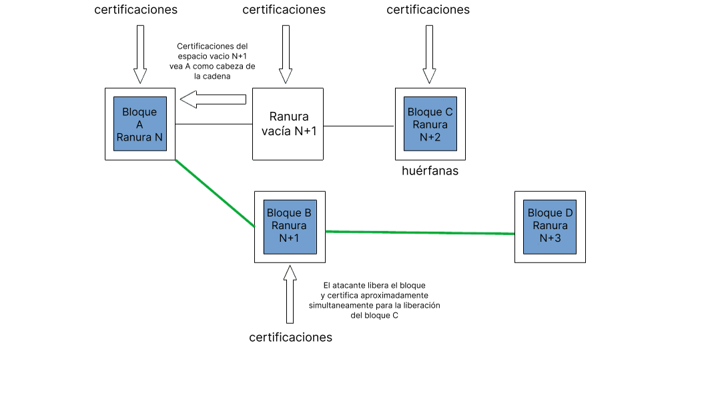

Los ladrones y saboteadores buscan constantemente oportunidades para atacar el software cliente de [Ethereum](/). Esta página describe los vectores de ataque conocidos en la capa de consenso de Ethereum y expone cómo se pueden defender esos ataques. La información de esta página está adaptada de una [versión más extensa](https://mirror.xyz/jmcook.eth/YqHargbVWVNRQqQpVpzrqEQ8IqwNUJDIpwRP7SS5FXs).

## Requisitos previos {#prerequisites}

Se requiere cierto conocimiento básico sobre la [prueba de participación (PoS)](/developers/docs/consensus-mechanisms/pos/). Además, será útil tener un conocimiento básico de la [capa de incentivos](/developers/docs/consensus-mechanisms/pos/rewards-and-penalties) de Ethereum y del algoritmo de elección de bifurcación, [LMD-GHOST](/developers/docs/consensus-mechanisms/pos/gasper).

## ¿Qué quieren los atacantes? {#what-do-attackers-want}

Un error común es creer que un atacante exitoso puede generar nuevo ether o robar ether de cuentas arbitrarias. Ninguna de estas opciones es posible porque todas las transacciones son ejecutadas por todos los clientes de ejecución en la red. Deben satisfacer condiciones básicas de validez (por ejemplo, las transacciones están firmadas por la clave privada del remitente, el remitente tiene saldo suficiente, etc.) o, de lo contrario, simplemente se revierten. Hay tres clases de resultados a los que un atacante podría apuntar de manera realista: reorganizaciones, doble finalidad o retraso de la finalidad.

Una **"reorganización"** es un reordenamiento de los bloques en una nueva secuencia, quizás con alguna adición o sustracción de bloques en la cadena canónica. Una reorganización maliciosa podría asegurar que se incluyan o excluyan bloques específicos, permitiendo el doble gasto o la extracción de valor mediante front-running y ejecución posterior de transacciones (MEV). Las reorganizaciones también podrían usarse para evitar que ciertas transacciones se incluyan en la cadena canónica, una forma de censura. La forma más extrema de reorganización es la "reversión de la finalidad", que elimina o reemplaza bloques que han sido finalizados previamente. Esto solo es posible si el atacante destruye más de ⅓ del total de ether en participación; esta garantía se conoce como "finalidad económica" (hablaremos más sobre esto más adelante).

La **doble finalidad** es la condición improbable pero grave en la que dos bifurcaciones logran finalizar simultáneamente, creando un cisma permanente en la cadena. Esto es teóricamente posible para un atacante dispuesto a arriesgar el 34% del total de ether en participación. La comunidad se vería obligada a coordinarse fuera de la cadena y llegar a un acuerdo sobre qué cadena seguir, lo que requeriría fortaleza en la capa social.

Un ataque de **retraso de la finalidad** evita que la red alcance las condiciones necesarias para finalizar secciones de la cadena. Sin la finalidad, es difícil confiar en las aplicaciones financieras construidas sobre Ethereum. El objetivo de un ataque de retraso de la finalidad probablemente sea simplemente interrumpir a Ethereum en lugar de obtener beneficios directos, a menos que el atacante tenga alguna posición corta estratégica.

Un ataque a la capa social podría apuntar a socavar la confianza del público en Ethereum, devaluar el ether, reducir la adopción o debilitar a la comunidad de Ethereum para dificultar la coordinación fuera de banda.

Habiendo establecido por qué un adversario podría atacar a Ethereum, las siguientes secciones examinan _cómo_ podrían llevarlo a cabo.

## Métodos de ataque {#methods-of-attack}

### Ataques de capa 0 {#layer-0}

Antes que nada, las personas que no participan activamente en Ethereum (ejecutando software de cliente) pueden atacar apuntando a la capa social (capa 0). La capa 0 es la base sobre la que se construye Ethereum y, como tal, representa una superficie potencial para ataques con consecuencias que repercuten en el resto de la pila. Algunos ejemplos podrían incluir:

- Una campaña de desinformación podría erosionar la confianza que la comunidad tiene en la hoja de ruta de Ethereum, los equipos de desarrolladores, las aplicaciones, etc. Esto podría disminuir el número de personas dispuestas a participar en la seguridad de la red, degradando tanto la descentralización como la seguridad criptoeconómica.
- Ataques selectivos y/o intimidación dirigidos a la comunidad de desarrolladores. Esto podría llevar a la salida voluntaria de los desarrolladores y ralentizar el progreso de Ethereum.

- Una regulación excesivamente estricta también podría considerarse un ataque a la capa 0, ya que podría desincentivar rápidamente la participación y la adopción.
- Infiltración de actores expertos pero malintencionados en la comunidad de desarrolladores cuyo objetivo es ralentizar el progreso alargando debates triviales, retrasando decisiones clave, creando spam, etc.
- Sobornos a actores clave en el ecosistema de Ethereum para influir en la toma de decisiones.

Lo que hace que estos ataques sean especialmente peligrosos es que, en muchos casos, se requiere muy poco capital o conocimientos técnicos. Un ataque de capa 0 podría actuar como multiplicador en un ataque criptoeconómico. Por ejemplo, si un titular de participación mayoritario malicioso lograra la censura o la reversión de la finalidad, socavar la capa social podría dificultar la coordinación de una respuesta de la comunidad fuera de banda.

Defenderse de los ataques a la capa 0 probablemente no sea sencillo, pero se pueden establecer algunos principios básicos. Uno es mantener en general una alta relación señal-ruido para la información pública sobre Ethereum, creada y propagada por miembros honestos de la comunidad a través de blogs, servidores de Discord, especificaciones anotadas, libros, podcasts y YouTube. Aquí, en ethereum.org, nos esforzamos mucho por mantener información precisa y traducirla a la mayor cantidad de idiomas posible. Inundar un espacio con información y memes de alta calidad es una defensa eficaz contra la desinformación.

Otra fortificación importante contra los ataques a la capa social es una declaración de misión y un protocolo de gobernanza claros. Ethereum se ha posicionado como el campeón de la descentralización y la seguridad entre las capa 1 (l1) de contratos inteligentes, al mismo tiempo que valora enormemente la escalabilidad y la sostenibilidad. Cualesquiera que sean los desacuerdos que surjan en la comunidad de Ethereum, estos principios básicos se ven mínimamente comprometidos. Evaluar una narrativa frente a estos principios fundamentales y examinarla mediante sucesivas rondas de revisión en el proceso de EIP (Propuesta de Mejora de Ethereum) podría ayudar a la comunidad a distinguir a los buenos de los malos actores y limitar el alcance de los actores malintencionados para influir en la dirección futura de Ethereum.

Por último, es fundamental que la comunidad de Ethereum permanezca abierta y acoja a todos los participantes. Una comunidad con guardianes y exclusividad es especialmente vulnerable a los ataques sociales porque es fácil crear narrativas de "nosotros y ellos". El tribalismo y el maximalismo tóxico dañan a la comunidad y erosionan la seguridad de la capa 0. Los ethereans con un interés personal en la seguridad de la red deben ver su conducta en línea y en el mundo real (meatspace) como una contribución directa a la seguridad de la capa 0 de Ethereum.

### Atacar el protocolo {#attacking-the-protocol}

Cualquiera puede ejecutar el software de cliente de Ethereum. Para agregar un validador a un cliente, el usuario debe depositar en garantía (hacer staking de) 32 ether en el contrato de depósito. Un validador permite a un usuario participar activamente en la seguridad de la red de Ethereum al proponer y atestiguar nuevos bloques. El validador ahora tiene una voz que puede usar para influir en el contenido futuro de la cadena de bloques: puede hacerlo honestamente y aumentar su reserva de ether a través de recompensas, o puede intentar manipular el proceso para su propio beneficio, arriesgando su participación. Una forma de preparar un ataque es acumular una mayor proporción de la participación total y luego usarla para superar en votos a los validadores honestos. Cuanto mayor sea la proporción de la participación controlada por el atacante, mayor será su poder de voto, especialmente en ciertos hitos económicos que exploraremos más adelante. Sin embargo, la mayoría de los atacantes no podrán acumular suficiente ether para atacar de esta manera, por lo que tendrán que utilizar técnicas sutiles para manipular a la mayoría honesta a fin de que actúe de cierta manera.

Fundamentalmente, todos los ataques con una pequeña participación son variaciones sutiles de dos tipos de mal comportamiento del validador: falta de actividad (no realizar una atestación o propuesta o hacerlo tarde) o exceso de actividad (proponer o hacer una atestación demasiadas veces en un slot). En su forma más básica, estas acciones son manejadas fácilmente por el algoritmo de elección de bifurcación y la capa de incentivos, pero hay formas inteligentes de burlar el sistema a favor del atacante.

### Ataques con pequeñas cantidades de ETH {#attacks-by-small-stakeholders}

#### reorganizaciones {#reorgs}

Varios artículos han explicado ataques a Ethereum que logran reorganizaciones o el retraso de la finalidad con solo una pequeña proporción del total de ether en participación. Estos ataques suelen depender de que el atacante oculte cierta información a otros validadores y luego la divulgue de manera sutil y/o en un momento oportuno. Por lo general, su objetivo es desplazar algún(os) bloque(s) honesto(s) de la cadena canónica. [Neuder et al. 2020](https://arxiv.org/pdf/2102.02247.pdf) demostró cómo un validador atacante puede crear y atestiguar un bloque (`B`) para un slot en particular `n+1`, pero abstenerse de propagarlo a otros nodos en la red. En cambio, retienen ese bloque atestiguado hasta el siguiente slot `n+2`. Un validador honesto propone un bloque (`C`) para el slot `n+2`. Casi simultáneamente, el atacante puede liberar su bloque retenido (`B`) y sus atestaciones retenidas para este, y también atestiguar que `B` es la cabeza de la cadena con sus votos para el slot `n+2`, negando efectivamente la existencia del bloque honesto `C`. Cuando se libera el bloque honesto `D`, el algoritmo de elección de bifurcación percibe que la construcción de `D` sobre `B` es más pesada que la construcción de `D` sobre `C`. Por lo tanto, el atacante ha logrado eliminar el bloque honesto `C` del slot `n+2` de la cadena canónica usando una reorganización ex ante de un bloque. [Un atacante con el 34%](https://www.youtube.com/watch?v=6vzXwwk12ZE) de la participación tiene muchas posibilidades de tener éxito en este ataque, como se explica [en esta nota](https://notes.ethereum.org/plgVdz-ORe-fGjK06BZ_3A#Fork-choice-by-block-slot-pair). Sin embargo, en teoría, este ataque podría intentarse con participaciones más pequeñas. [Neuder et al. 2020](https://arxiv.org/pdf/2102.02247.pdf) describió que este ataque funciona con una participación del 30%, pero luego se demostró que era viable con el [2% de la participación total](https://arxiv.org/pdf/2009.04987.pdf) y posteriormente incluso para un [solo validador](https://arxiv.org/abs/2110.10086#) utilizando técnicas de balanceo que examinaremos en la siguiente sección.

Un diagrama conceptual del ataque de reorganización de un bloque descrito anteriormente (adaptado de https://notes.ethereum.org/plgVdz-ORe-fGjK06BZ_3A#Fork-choice-by-block-slot-pair)

Un ataque más sofisticado puede dividir el conjunto de validadores honestos en grupos distintos que tengan diferentes vistas de la cabeza de la cadena. Esto se conoce como un **ataque de balanceo**. El atacante espera su oportunidad para proponer un bloque y, cuando llega, incurre en equivocación al proponer dos. Envía un bloque a la mitad del conjunto de validadores honestos y el otro bloque a la otra mitad. La equivocación sería detectada por el algoritmo de elección de bifurcación y el proponente de bloque sería penalizado mediante un recorte y expulsado de la red, pero los dos bloques seguirían existiendo y tendrían a aproximadamente la mitad del conjunto de validadores realizando una atestación para cada bifurcación. Mientras tanto, los validadores maliciosos restantes retienen sus atestaciones. Luego, al liberar de forma selectiva las atestaciones que favorecen a una u otra bifurcación hacia una cantidad suficiente de validadores justo cuando se ejecuta el algoritmo de elección de bifurcación, inclinan el peso acumulado de las atestaciones a favor de una u otra bifurcación. Esto puede continuar de forma indefinida; los validadores atacantes mantendrían una división equitativa de los validadores en ambas bifurcaciones. Puesto que ninguna de las bifurcaciones puede atraer a una supermayoría de 2/3, la red no podría finalizar.

Los **ataques de rebote** son similares. Los validadores atacantes vuelven a retener los votos. En lugar de liberar los votos para mantener una división equitativa entre dos bifurcaciones, usan sus votos en los momentos oportunos para justificar puntos de control que alternan entre la bifurcación A y la bifurcación B. Esta oscilación de la justificación entre dos bifurcaciones evita que haya pares de puntos de control de origen y destino justificados que puedan finalizarse en cualquiera de las cadenas, deteniendo la finalidad.

<VideoWatch slug="pos-reorgs-attack-defense" />

Tanto los ataques de rebote como los de balanceo dependen de que el atacante tenga un control muy preciso sobre los tiempos de los mensajes en toda la red, lo cual es poco probable. Sin embargo, se integran defensas en el protocolo en forma de ponderación adicional asignada a los mensajes rápidos en comparación con los lentos. Esto se conoce como [potenciación de peso del proponente](https://github.com/ethereum/consensus-specs/pull/2730). Para defenderse de los ataques de rebote, se actualizó el algoritmo de elección de bifurcación para que el último punto de control justificado solo pueda cambiar al de una cadena alternativa durante el [primer 1/3 de los slots en cada época](https://ethresear.ch/t/prevention-of-bouncing-attack-on-ffg/6114). Esta condición impide que el atacante ahorre votos para implementarlos más tarde: el algoritmo de elección de bifurcación simplemente permanece leal al punto de control que eligió en el primer 1/3 de la época, durante el cual la mayoría de los validadores honestos habrían votado.

En conjunto, estas medidas crean un escenario en el que un proponente de bloque honesto emite su bloque de forma muy rápida tras el inicio del slot, para luego haber un período de ~1/3 de slot (4 segundos) en el que ese nuevo bloque podría causar que el algoritmo de elección de bifurcación cambie a otra cadena. Después de esa misma fecha límite, a las atestaciones que llegan de validadores lentos se les disminuye el peso en comparación con las que llegaron antes. Esto favorece considerablemente a los proponentes y validadores rápidos a la hora de determinar la cabeza de la cadena y reduce sustancialmente la probabilidad de que un ataque de balanceo o rebote tenga éxito.

Cabe mencionar que la potenciación de los proponentes por sí sola únicamente protege contra las "reorganizaciones baratas", es decir, aquellas que intenta un atacante con una pequeña participación. De hecho, los titulares de una participación mayor pueden manipular la propia potenciación de los proponentes. Los autores de [este artículo](https://ethresear.ch/t/change-fork-choice-rule-to-mitigate-balancing-and-reorging-attacks/11127) describen cómo un atacante con el 7% de la participación puede implementar sus votos estratégicamente para engañar a los validadores honestos a fin de que construyan sobre su bifurcación, eliminando un bloque honesto mediante una reorganización. Este ataque se ideó asumiendo condiciones de latencia ideales que son muy poco probables. Las probabilidades aún están muy en contra del atacante, y una mayor participación también significa un mayor capital en riesgo y un desincentivo económico más fuerte.

También se propuso un [ataque de balanceo dirigido específicamente a la regla LMD](https://ethresear.ch/t/balancing-attack-lmd-edition/11853), el cual se sugirió que era viable a pesar de la potenciación de los proponentes. Un atacante establece dos cadenas competidoras cometiendo una equivocación en su propuesta de bloque y propagando cada bloque a aproximadamente la mitad de la red cada uno, estableciendo un equilibrio aproximado entre las bifurcaciones. Luego, los validadores coludidos incurren en equivocación en sus votos, calculando el tiempo de modo que la mitad de la red reciba primero sus votos para la bifurcación `A` y la otra mitad reciba primero sus votos para la bifurcación `B`. Dado que la regla LMD descarta la segunda atestación y solo conserva la primera para cada validador, la mitad de la red percibe los votos para `A` y ninguno para `B`, y la otra mitad percibe los votos para `B` y ninguno para `A`. Los autores describen que la regla LMD le otorga al adversario un "poder notable" para ejecutar un ataque de balanceo.

Este vector de ataque LMD se cerró al [actualizar el algoritmo de elección de bifurcación](https://github.com/ethereum/consensus-specs/pull/2845) para que descarte por completo a los validadores que incurran en equivocaciones a la hora de considerar la elección de bifurcación. El algoritmo de elección de bifurcación también descuenta la influencia futura a los validadores que incurren en equivocación. Esto previene el ataque de balanceo descrito anteriormente y, a su vez, mantiene la resistencia frente a los ataques de avalancha.

Otra clase de ataque, denominado [**ataque de avalancha**](https://ethresear.ch/t/avalanche-attack-on-proof-of-stake-ghost/11854/3), se describió en un [artículo de marzo de 2022](https://arxiv.org/pdf/2203.01315.pdf). Para preparar un ataque de avalancha, el atacante necesita controlar a varios proponentes de bloque consecutivos. En cada uno de los slots de propuesta de bloque, el atacante retiene su bloque, recolectándolos hasta que la cadena honesta alcance el mismo peso en el subárbol que los bloques retenidos. Luego, los bloques retenidos se liberan para que la equivocación sea máxima. Los autores sugieren que la potenciación de los proponentes (la defensa principal frente a ataques de balanceo y rebote) no protege contra algunas variantes del ataque de avalancha. Sin embargo, los autores demostraron el ataque exclusivamente en una versión sumamente idealizada del algoritmo de elección de bifurcación de Ethereum (usaron GHOST sin LMD).

El ataque de avalancha se ve mitigado por la porción LMD del algoritmo de elección de bifurcación LMD-GHOST. LMD significa "guiado por el último mensaje" (latest-message-driven) y hace referencia a una tabla que conserva cada validador y contiene el último mensaje recibido de otros validadores. Ese campo solo se actualiza si el nuevo mensaje es de un slot posterior al que ya está en la tabla para un validador en particular. En la práctica, esto significa que, en cada slot, el primer mensaje recibido es el que acepta, y los mensajes adicionales se consideran equivocaciones y se ignoran. Dicho de otra manera, los clientes de consenso no cuentan las equivocaciones: usan el primer mensaje que llega de cada validador, y las equivocaciones simplemente se descartan, lo que previene los ataques de avalancha.

Existen varias otras posibles mejoras futuras a la regla de elección de bifurcación que podrían sumarse a la seguridad que brinda la potenciación de los proponentes. Una de ellas es la [fusión de vista](https://ethresear.ch/t/view-merge-as-a-replacement-for-proposer-boost/13739) (view-merge), donde los que realizan atestaciones congelan su vista de la elección de bifurcación `n` segundos antes de que comience un slot y el proponente luego ayuda a sincronizar la vista de la cadena en toda la red. Otra posible mejora es la [finalidad de un solo slot](https://notes.ethereum.org/@vbuterin/single_slot_finality), que protege contra los ataques basados en el tiempo de los mensajes al finalizar la cadena después de un solo slot.

#### Retraso de la finalidad {#finality-delay}

[El mismo artículo](https://econcs.pku.edu.cn/wine2020/wine2020/Workshop/GTiB20_paper_8.pdf) que describió por primera vez el ataque de reorganización de un solo bloque de bajo costo también describió un ataque de retraso de la finalidad (también conocido como "falla de vitalidad") que depende de que el atacante sea el proponente de bloque para un bloque que marca el límite de una época. Esto es fundamental porque los bloques de límites de época se convierten en los puntos de control que utiliza Casper FFG para finalizar porciones de la cadena. El atacante simplemente retiene su bloque hasta que suficientes validadores honestos utilicen sus votos de FFG a favor del bloque de límite de época anterior como el objetivo de finalización actual. Luego, liberan su bloque retenido. Atestiguan su bloque y los validadores honestos restantes también lo hacen, con lo que se crean bifurcaciones con diferentes puntos de control objetivo. Si lo calculan justo a tiempo, evitarán la finalidad porque no habrá una supermayoría de 2/3 atestiguando ninguna de las bifurcaciones. Cuanto menor sea la participación, más preciso deberá ser el cálculo del tiempo porque el atacante controla menos atestaciones directamente, y menores serán las probabilidades de que el atacante controle al validador que propone un bloque de límite de época determinado.

#### Ataques de largo alcance {#long-range-attacks}

También hay una clase de ataque específico para las cadenas de bloques de prueba de participación que implica que un validador que participó en el bloque génesis mantenga una bifurcación separada de la cadena de bloques junto a la honesta, convenciendo finalmente al conjunto de validadores honestos de que cambien a ella en algún momento oportuno mucho más tarde. Este tipo de ataque no es posible en Ethereum debido a la herramienta de finalidad que garantiza que todos los validadores concuerden sobre el estado de la cadena honesta a intervalos regulares ("puntos de control"). Este simple mecanismo neutraliza a los atacantes de largo alcance porque los clientes de Ethereum simplemente no realizarán una reorganización de bloques finalizados. Los nuevos nodos que se unen a la red lo hacen al encontrar un hash de estado reciente de confianza (un punto de control de "[subjetividad débil](https://blog.ethereum.org/2014/11/25/proof-stake-learned-love-weak-subjectivity)") y usarlo como un bloque pseudo-génesis para construir sobre él. Esto crea una "puerta de confianza" para un nuevo nodo que ingresa a la red antes de que pueda comenzar a verificar la información por sí mismo.

#### Denegación de servicio {#denial-of-service}

El mecanismo PoS de Ethereum elige un solo validador del conjunto total de validadores para que sea un proponente de bloque en cada slot. Esto se puede calcular utilizando una función públicamente conocida, y es posible que un adversario identifique al próximo proponente de bloque un poco antes de que este haga su propuesta de bloque. Luego, el atacante puede enviarle spam al proponente de bloque para impedirle intercambiar información con sus pares. Para el resto de la red, parecería que el proponente de bloque estaba fuera de línea y el slot simplemente quedaría vacío. Esta podría ser una forma de censura contra ciertos validadores, impidiéndoles agregar información a la cadena de bloques. La implementación de elecciones de líder secreto único (SSLE) o elecciones de líder secreto no único mitigará los riesgos de los ataques DoS porque solo el proponente de bloque sabe que ha sido seleccionado y la selección no puede conocerse de antemano. Esto aún no está implementado, pero es un área activa de [investigación y desarrollo](https://ethresear.ch/t/secret-non-single-leader-election/11789).

Todo esto apunta al hecho de que es muy difícil atacar exitosamente a Ethereum con una pequeña participación. Los ataques viables que se han descrito aquí requieren de un algoritmo de elección de bifurcación idealizado, condiciones de red improbables, o que los vectores de ataque ya hayan sido cerrados con parches relativamente menores en el software de cliente. Esto, por supuesto, no descarta la posibilidad de que existan vulnerabilidades de día cero en la práctica, pero sí demuestra el altísimo nivel de aptitud técnica, el conocimiento de la capa de consenso y la suerte que requiere un atacante con participación minoritaria para ser eficaz. Desde la perspectiva de un atacante, su mejor apuesta podría ser acumular tanto ether como sea posible y regresar armado con una mayor proporción de la participación total.

### Atacantes que usan el 33% o más de la participación total {#attackers-with-33-stake}

Todos los ataques mencionados anteriormente en este artículo tienen más probabilidades de éxito cuando el atacante tiene más ether en participación para votar, y más validadores que podrían ser elegidos para proponer bloques en cada slot. Por lo tanto, un validador malicioso podría tener como objetivo controlar tanto ether en participación como sea posible.

El 33% del ether en participación es un punto de referencia para un atacante porque con cualquier cifra superior a esta cantidad tiene la capacidad de evitar que la cadena finalice sin tener que controlar de forma minuciosa las acciones de los otros validadores. Simplemente pueden desaparecer todos juntos. Si un tercio o más del ether en participación está atestiguando con intenciones maliciosas o no realiza atestaciones, entonces no puede existir una supermayoría de 2/3 y la cadena no puede finalizar. La defensa contra esto es la fuga por inactividad. La fuga por inactividad identifica aquellos validadores que no atestiguan o que atestiguan en contra de la mayoría. El ether en participación de estos validadores que no atestiguan va mermando gradualmente hasta que finalmente representen en conjunto menos de un tercio del total, de modo que la cadena pueda finalizar nuevamente.

El propósito de la fuga por inactividad es que la cadena vuelva a finalizar. Sin embargo, el atacante también pierde una parte de su ether en participación. La inactividad persistente entre los validadores que representan el 33% del ether en participación total es muy cara, aunque los validadores no sean penalizados por recorte.

Asumiendo que la red de Ethereum es asíncrona (es decir, hay demoras entre el envío y la recepción de los mensajes), un atacante que controle el 34% de la participación total podría causar doble finalidad. Esto se debe a que el atacante puede equivocarse cuando es elegido productor de bloques y luego votar dos veces con todos sus validadores. Esto crea una situación en la que existe una bifurcación de la cadena de bloques y cada una cuenta con los votos del 34% del ether en participación. Cada bifurcación solo requiere que el 50% de los validadores restantes voten a su favor para que ambas bifurcaciones cuenten con el apoyo de una supermayoría, en cuyo caso ambas cadenas pueden finalizar (porque el 34% de los validadores atacantes + la mitad del 66% restante = el 67% en cada bifurcación). Aproximadamente el 50% de los validadores honestos tendrían que recibir cada uno de los bloques competidores, de modo que este ataque solo es viable cuando el atacante tiene cierto grado de control sobre el tiempo de los mensajes que se propagan por la red para así poder empujar a la mitad de los validadores honestos hacia cada cadena. El atacante destruiría por fuerza toda su participación (el 34% de los ~10 millones de ether con el conjunto de validadores actual) para lograr esta doble finalidad, porque el 34% de sus validadores estarían votando doble simultáneamente: un delito sujeto a penalización de recorte con el máximo castigo de correlación. La defensa contra este ataque es el gigantesco costo de destruir el 34% del ether total en participación. La recuperación de este ataque requeriría que la comunidad de Ethereum se coordine "fuera de banda" y acuerde seguir una u otra de las bifurcaciones e ignorar la otra.

### Atacantes que usan aproximadamente el 50% de la participación total {#attackers-with-50-stake}

Con un 50% del ether en participación, en teoría un grupo malicioso de validadores podría dividir la cadena en dos bifurcaciones del mismo tamaño y luego usar toda su participación del 50% para votar de forma contraria al conjunto de validadores honestos, manteniendo así las dos bifurcaciones y evitando la finalidad. La fuga por inactividad en ambas bifurcaciones terminaría llevando a que ambas cadenas finalicen. Llegados a este punto, la única opción es recurrir a una recuperación social.

Es muy poco probable que un grupo de validadores adversario pueda controlar constantemente y de manera exacta el 50% de la participación total, teniendo en cuenta cierto grado de flujo en la cantidad de validadores honestos, la latencia de la red, etc. El inmenso costo de organizar un ataque de este tipo, combinado con la baja probabilidad de éxito, parece ser un gran desincentivo para un atacante racional, sobre todo cuando una pequeña inversión adicional para conseguir _más del_ 50% abre la puerta a mucho más poder.

Con >50% de la participación total, el atacante podría dominar el algoritmo de elección de bifurcación. En este caso, el atacante podría atestiguar con el voto de la mayoría, lo que le daría control suficiente para realizar reorganizaciones breves sin necesidad de engañar a clientes honestos. Los validadores honestos seguirían su ejemplo, ya que su algoritmo de elección de bifurcación también percibiría la cadena que favorece el atacante como la más pesada, por lo que la cadena podría finalizar. Esto permite que el atacante censure ciertas transacciones, realice reorganizaciones de corto alcance y extraiga el máximo MEV reordenando los bloques a su favor. La defensa contra esto es el gigantesco costo de una participación mayoritaria (actualmente poco menos de 19.000 millones de USD), la cual el atacante pone en riesgo, ya que es probable que la capa social intervenga y adopte una bifurcación minoritaria honesta, devaluando la participación del atacante drásticamente.

### Atacantes que usan el 66% o más de la participación total {#attackers-with-66-stake}

Un atacante con el 66% o más del ether total en participación puede finalizar su cadena preferida sin tener que coaccionar a ningún validador honesto. El atacante puede limitarse a votar por su bifurcación preferida y luego finalizarla, por la simple razón de que puede votar con una supermayoría deshonesta. Como titular de una participación por supermayoría, el atacante controlaría siempre los contenidos de los bloques finalizados, y tendría el poder de gastar, rebobinar y volver a gastar, censurar ciertas transacciones y llevar a cabo reorganizaciones de la cadena a voluntad. Al comprar ether adicional para controlar el 66% en lugar del 51%, el atacante en efecto está comprando la capacidad de hacer reorganizaciones ex post y reversiones de finalidad (es decir, cambiar el pasado, además de controlar el futuro). Las únicas defensas reales aquí son el gigantesco costo del 66% del ether total en participación, y la opción de recurrir a la capa social para coordinar la adopción de una bifurcación alternativa. Exploraremos esto con más detalle en la próxima sección.

## Las personas: la última línea de defensa {#people-the-last-line-of-defense}

Si los validadores deshonestos logran finalizar su versión preferida de la cadena, la comunidad de Ethereum se ve en una situación difícil. La cadena canónica incluye una sección deshonesta incrustada en su historia, mientras que los validadores honestos pueden terminar siendo castigados por atestiguar una cadena alternativa (honesta). Tenga en cuenta que una cadena finalizada, pero incorrecta, también podría deberse a un error en un cliente mayoritario. Al fin y al cabo, el recurso definitivo es recurrir a la capa social (la capa 0) para resolver la situación.

Uno de los puntos fuertes del consenso PoS de Ethereum es que existe una [variedad de estrategias defensivas](https://youtu.be/1m12zgJ42dI?t=1712) que la comunidad puede emplear frente a un ataque. Una respuesta mínima podría ser expulsar (hacer una salida forzosa de) los validadores de los atacantes de la red sin ninguna penalización adicional. Para volver a ingresar a la red, el atacante tendría que unirse a una cola de activación que asegura que el conjunto de validadores crezca paulatinamente. Por ejemplo, la adición de suficientes validadores para duplicar la cantidad de ether en participación tarda unos 200 días, lo cual compra efectivamente 200 días de tiempo para los validadores honestos antes de que el atacante pueda intentar otro ataque del 51%. Sin embargo, la comunidad también podría decidir penalizar al atacante con más dureza, revocando las recompensas pasadas o quemando parte de su capital en participación (hasta un 100%).

Sea cual sea la penalización impuesta al atacante, la comunidad también debe decidir en conjunto si la cadena deshonesta, pese a ser la favorecida por el algoritmo de elección de bifurcación programado en los clientes de Ethereum, es de hecho inválida y si la comunidad debería en cambio construir sobre la cadena honesta. Los validadores honestos podrían acordar colectivamente construir sobre una bifurcación de la cadena de bloques de Ethereum aceptada por la comunidad que, por ejemplo, podría haberse bifurcado de la cadena canónica antes de que iniciara el ataque, o haber eliminado por la fuerza a los validadores del atacante. Los validadores honestos estarían incentivados a construir sobre esta cadena para así eludir las penalizaciones que se les aplicaron por no atestiguar (con toda razón) la cadena del atacante. Es de suponer que las plataformas de intercambio (exchanges), las pasarelas fiat-cripto (on-ramps) y las aplicaciones construidas sobre Ethereum preferirían estar en la cadena honesta, por lo que seguirían a los validadores honestos a la cadena de bloques honesta.

Sin embargo, esto supondría un desafío sustancial de gobernanza. Sin duda, algunos usuarios y validadores saldrían perdiendo como resultado de cambiar de nuevo a la cadena honesta; las transacciones en los bloques validados después del ataque se podrían llegar a revertir, interrumpiendo la capa de aplicación, y esto, sencillamente, socava la ética de algunos usuarios que tienden a creer que "el código es la ley". Es muy probable que las plataformas de intercambio y las aplicaciones hayan vinculado acciones fuera de la cadena a las transacciones en cadena que ahora se podrían revertir, desencadenando con ello una cascada de retractaciones y revisiones de las que sería muy difícil deshacerse con justicia, sobre todo si las ganancias ilícitas se han mezclado o depositado en las finanzas descentralizadas (DeFi) u otros derivados, lo cual causa efectos secundarios para los usuarios honestos. Sin lugar a dudas, algunos usuarios (incluso quizás institucionales) ya se habrían beneficiado de la cadena deshonesta gracias a la astucia o de rebote (serendipity) y se podrían oponer a una bifurcación para proteger sus ganancias. Han surgido peticiones de ensayar la respuesta de la comunidad a los ataques >51% de modo que se pueda ejecutar velozmente una mitigación con sentido y coordinada. Hay unos debates útiles al respecto por parte de Vitalik en ethresear.ch [aquí](https://ethresear.ch/t/timeliness-detectors-and-51-attack-recovery-in-blockchains/6925) y [aquí](https://ethresear.ch/t/responding-to-51-attacks-in-casper-ffg/6363), y en Twitter [aquí](https://twitter.com/skylar_eth/status/1551798684727508992?s=20&t=oHZ1xv8QZdOgAXhxZKtHEw). El propósito de una respuesta social coordinada debería ser estar muy dirigida y ser muy específica en lo que a castigar al atacante se refiere, y en minimizar los efectos para otros usuarios.

La gobernanza ya es, de por sí, un tema complicado. Manejar una respuesta de emergencia de capa 0 a una cadena que finaliza de forma deshonesta supondría sin duda un desafío para la comunidad de Ethereum, pero [ya ha sucedido](/ethereum-forks/#dao-fork-summary) ([dos veces](/ethereum-forks/#tangerine-whistle)) en la historia de Ethereum.

Sin embargo, hay algo bastante satisfactorio en que el recurso final recaiga en el mundo real (meatspace). En última instancia, incluso con esta espectacular pila de tecnología sobre nosotros, si llegara a suceder lo peor, la gente real tendría que coordinar su propia forma de salir de ello.

## Resumen {#summary}

Esta página analizó algunas de las formas en que los atacantes podrían intentar aprovechar el protocolo de consenso de prueba de participación de Ethereum. Se exploraron las reorganizaciones y los retrasos de la finalidad por parte de atacantes con proporciones cada vez mayores del ether total en participación. En general, un atacante más adinerado tiene más probabilidades de éxito porque su participación se traduce en el poder de voto que pueden emplear para influir en el contenido de bloques futuros. Con determinados niveles de umbral de ether en participación, el poder del atacante aumenta de la siguiente forma:

33%: retraso de la finalidad

34%: retraso de la finalidad, doble finalidad

51%: retraso de la finalidad, doble finalidad, censura, control sobre el futuro de la cadena de bloques

66%: retraso de la finalidad, doble finalidad, censura, control sobre el futuro y el pasado de la cadena de bloques

También existe un abanico de ataques más sofisticados que exigen cantidades pequeñas de ether en participación, pero dependen de un atacante muy sofisticado que tenga control preciso de la sincronización de mensajes para influir en los validadores honestos a su favor.

En general, pese a estos potenciales vectores de ataque, el riesgo de que haya un ataque exitoso es bajo, ciertamente más bajo que en sus equivalentes de prueba de trabajo (PoW). Esto se debe al gigantesco costo del ether en participación que arriesga un atacante con intención de abrumar a los validadores honestos con su poder de voto. La capa de incentivos de tipo "palo y zanahoria" integrada protege contra la mayor parte de delitos, sobre todo en el caso de atacantes de baja participación. También es improbable que tengan éxito ataques de rebote y balanceo más sutiles, puesto que las condiciones reales de la red hacen que lograr el control preciso de la entrega de los mensajes a un subconjunto específico de validadores sea muy difícil, y los equipos del cliente han cerrado rápidamente los vectores de ataques de rebote, balanceo y avalancha conocidos por medio de simples parches.

Para resolverse, los ataques del 34%, 51% o 66% probablemente necesitarían coordinación social fuera de banda. Si bien esto sería probablemente doloroso para la comunidad, la capacidad que esta tiene para responder fuera de banda es un gran desincentivo para un atacante. La capa social de Ethereum es el último respaldo: la comunidad podría lograr detener un ataque técnicamente exitoso acordando adoptar una bifurcación honesta. Habría una carrera entre el atacante y la comunidad de Ethereum: la comunidad arrasaría probablemente mediante una respuesta de coordinación social exitosa con los miles de millones de dólares gastados en un ataque del 66% si la aplicara lo suficientemente rápido. De esta manera, el atacante se quedaría con gran cantidad de ether ilíquido en participación en una cadena deshonesta que todos ignorarían. La probabilidad de que esto le resultara rentable al atacante es lo suficientemente baja como para ser un medio de disuasión eficaz. Es por ello que invertir en el mantenimiento de una capa social cohesiva con valores rigurosamente alineados es algo tan importante.

## Más información {#further-reading}

- [Versión más detallada de esta página](https://mirror.xyz/jmcook.eth/YqHargbVWVNRQqQpVpzrqEQ8IqwNUJDIpwRP7SS5FXs)
- [Vitalik acerca de la finalidad de liquidación](https://blog.ethereum.org/2016/05/09/on-settlement-finality)
- [Artículo acerca de LMD-GHOST](https://arxiv.org/abs/2003.03052)
- [Artículo acerca de Casper FFG](https://arxiv.org/abs/1710.09437)
- [Artículo acerca de Gasper](https://arxiv.org/pdf/2003.03052.pdf)
- [Especificaciones de consenso para la potenciación de peso del proponente](https://github.com/ethereum/consensus-specs/pull/2730)
- [Ataques de rebote en ethresear.ch](https://ethresear.ch/t/prevention-of-bouncing-attack-on-ffg/6114)
- [Investigación sobre SSLE](https://ethresear.ch/t/secret-non-single-leader-election/11789)