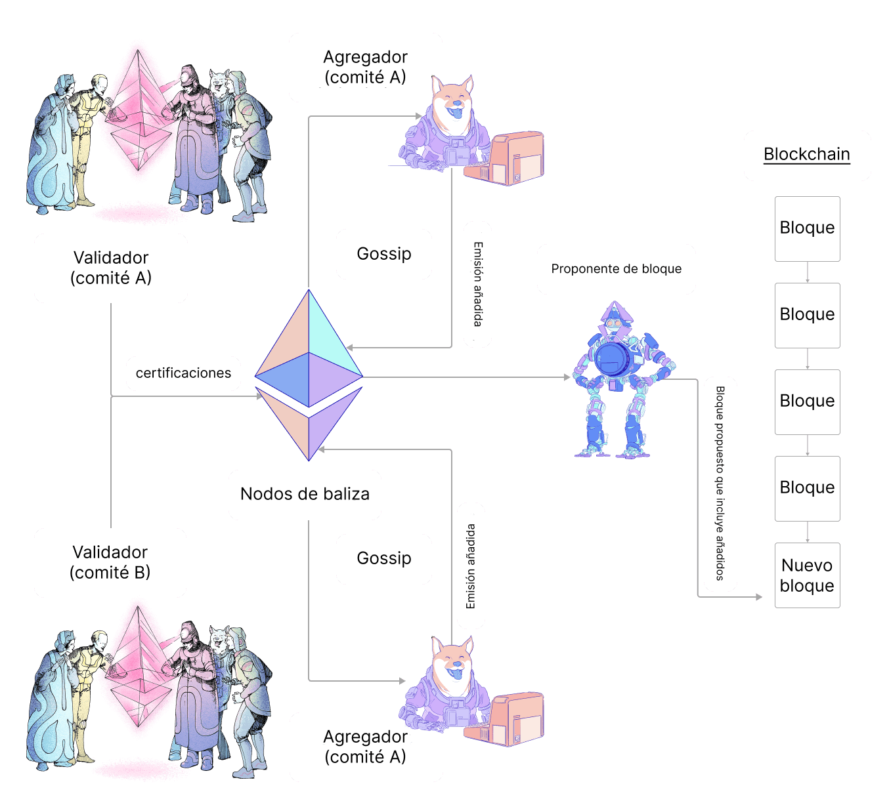

Se espera que un validador cree, firme y emita una certificación durante cada época. Esta página describe cómo se ven estas certificaciones y cómo se procesan y comunican entre clientes de consenso.

## ¿Qué es una certificación? {#what-is-an-attestation}

Cada [época](/glossary/#epoch) (6,4 minutos) un validador propone una certificación a la red. La certificación es para un espacio específico en la época. El propósito de la certificación es votar a favor de la visión del validador de la cadena, en particular el bloque justificado más reciente y el primer bloque de la época actual (conocidos como puntos de control `fuente` y `destino`). Esta información se combina para todos los validadores participantes, lo que permite a la red llegar a un consenso sobre el estado de la cadena de bloques.

La certificación contiene los siguientes componentes:

- `aggregation_bits`: una lista de validadores de bits cuya posición se asigna al índice del validador en su comité; el valor (0/1) indica si el validador firmó los `datos` (es decir, si están activos y están de acuerdo con el proponente del bloque)
- `datos`: detalles relacionados con la certificación, como se define a continuación
- `signature`: Una firma BLS que agrega las firmas de validadores individuales

La primera tarea para un validador de atestación es construir `datos`. Los `datos` contienen la siguiente información:

- `ranura`: el número de ranura al que se refiere la certificación
- `índice`: un número que identifica a qué comité pertenece el validador en un espacio determinado
- `beacon_block_root`: hash raíz del bloque que el validador ve en la cabeza de la cadena (el resultado de aplicar el algoritmo de elección de bifurcación)
- `fuente`: parte de la votación final que indica lo que los validadores ven como el bloqueo justificado más reciente
- `destino`: parte de la votación final indica lo que los validadores ven como el primer bloque en la época actual

Una vez que los `datos` están construidos, el validador puede girar el bit en `aggregation_bits` correspondientes a su propio índice de validador de 0 a 1 para demostrar su participación.

Por último, el validador firma la certificación y la transmite a la red.

### Certificación añadida {#aggregated-attestation}

Hay una sobrecarga sustancial asociada con el paso de estos datos por la red para cada validador. Por lo tanto, las certificaciones de validadores individuales se añaden dentro de las subredes antes de transmitirse más ampliamente. Esto incluye el añadido de firmas para que una certificación que se transmita incluya los `datos` de consenso y una sola firma formada por la combinación de las firmas de todos los validadores que están de acuerdo con esos `datos`. Esto se puede comprobar utilizando `aggregation_bits`, ya que proporciona el índice de cada validador en su comité (cuyo ID se proporciona en los `datos`) que se puede utilizar para consultar firmas individuales.

En cada época, se seleccionan 16 validadores en cada subred para que sean los `agregadores`. Los agregadores recopilan todos los certificados o atestaciones de los que escuchan a través de la red de gossip que tienen `datos` equivalentes a los suyos. El remitente de cada certificación coincidente se registra en los `aggregation_bits`. A continuación, los agregadores transmiten el agregado de atestaciones a la red más amplia.

Cuando se selecciona un validador para ser un proponente de bloques, este agrupa las certificaciones agregadas de las subredes hasta la última ranura en el nuevo bloque.

### Ciclo de vida de inclusión de la certificación {#attestation-inclusion-lifecycle}

1. Generación
2. Propagación
3. Agregación
4. Propagación
5. Inclusión

El ciclo de vida de la certificación se describe en el siguiente esquema:

## Recompensas {#rewards}

Se recompensa a los validadores por presentar certificaciones. La recompensa de la certificación depende de las banderas de participación (fuente, objetivo y cabeza), la recompensa base y la tasa de participación.

Cada una de las banderas de participación puede ser verdadera o falsa, dependiendo de la certificación presentada y de su retraso en la inclusión.

La mejor situación se produce cuando las tres banderas son ciertas, en cuyo caso un validador ganaría (por bandera correcta):

`recompensa += recompensa base * peso de la bandera * tasa de atestación de la bandera / 64`

La tasa de certificación de la bandera se mide utilizando la suma de los saldos efectivos de todos los validadores de certificación para la bandera dada, en comparación con el saldo efectivo del activo total.

### La recompensa de base {#base-reward}

La recompensa de base se calcula de acuerdo con el número de validadores de certificación y sus saldos de ether efectivo en participación:

`base reward = validator effective balance x 2^6 / SQRT(Effective balance of all active validators)`

#### El retraso de inclusión {#inclusion-delay}

En el momento en que los validadores votaron sobre la cabeza de la cadena (`bloque n`), `bloque n+1` aún no se había propuesto. Por lo tanto, las certificaciones se incluyen naturalmente **un bloque más adelante**, por lo que todas las certificaciones que votaron sobre `bloque n` como cabeza de la cadena se incluyeron en `bloque n+1` y el **retraso de la inclusión** es 1. Si el retraso de inclusión se duplica a dos ranuras, la recompensa de certificación se reduce a la mitad, porque para calcular la recompensa de certificación, la recompensa de base se multiplica por el recíproco del retraso de inclusión.

### Posibles casos de certificación {#attestation-scenarios}

#### Falta el voto del validador {#missing-voting-validator}

Los validadores tienen un máximo de 1 época para presentar su certificación. Si la certificación se perdió en la época 0, pueden presentarla con un retraso de inclusión en la época 1.

#### Falta el agregador {#missing-aggregator}

Hay 16 agregadores por época en total. Además, los validadores aleatorios se suscriben a **dos subredes por 256 épocas** y sirven como copia de seguridad en caso de que falten agregadores.

#### Falta el proponente de bloque {#missing-block-proposer}

Tenga en cuenta que en algunos casos un agregador afortunado también puede convertirse en el proponente de bloques. Si la certificación no se incluyó porque el proponente del bloque ha desaparecido, el siguiente proponente del bloque elegiría la certificación añadida y la incluiría en el siguiente bloque. Sin embargo, el **retraso de la inclusión** aumentará un valor.

## Más lecturas {#further-reading}

- [Certificaciones en la especificación de consenso anotada de Vitalik](https://github.com/ethereum/annotated-spec/blob/master/phase0/beacon-chain.md#attestationdata)
- [Certificaciones en eth2book.info](https://eth2book.info/capella/part3/containers/dependencies/#attestationdata)

_¿Conoces algún recurso en la comunidad que te haya servido de ayuda? Edita esta página y añádelo._
