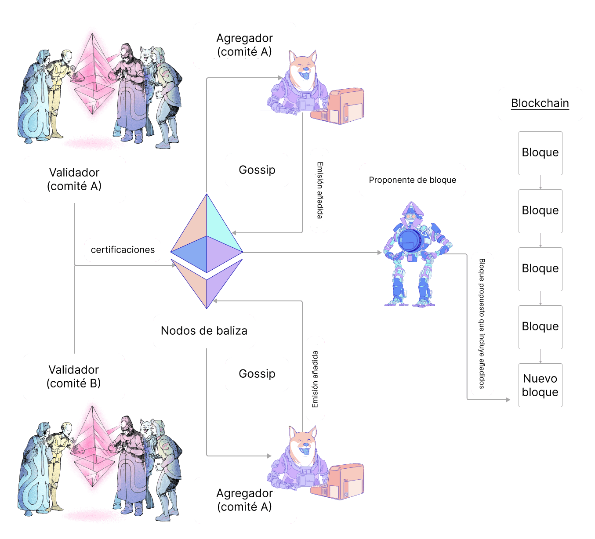

Se espera que un validador cree, firme y difunda una atestación durante cada época. Esta página describe cómo son estas atestaciones y cómo se procesan y comunican entre los clientes de consenso.

## ¿Qué es una atestación? {#what-is-an-attestation}

Cada [época](/glossary/#epoch) (6,4 minutos) un validador propone una atestación a la red. La atestación es para un slot específico en la época. El propósito de la atestación es emitir un voto a favor de la visión de la cadena que tiene el validador, en particular el bloque justificado más reciente y el primer bloque de la época actual (conocidos como puntos de control `source` y `target`). Esta información se combina para todos los validadores participantes, lo que permite a la red alcanzar el consenso sobre el estado de la cadena de bloques.

La atestación contiene los siguientes componentes:

- `aggregation_bits`: una lista de bits de validadores donde la posición se asigna al índice del validador en su comité; el valor (0/1) indica si el validador firmó los `data` (es decir, si están activos y están de acuerdo con el proponente de bloque)
- `data`: detalles relacionados con la atestación, como se define a continuación
- `signature`: una firma BLS que agrega las firmas de los validadores individuales

La primera tarea para un validador que atestigua es construir los `data`. Los `data` contienen la siguiente información:

- `slot`: El número de slot al que se refiere la atestación
- `index`: Un número que identifica a qué comité pertenece el validador en un slot determinado
- `beacon_block_root`: El hash raíz del bloque que el validador ve en la cabeza de la cadena (el resultado de aplicar el algoritmo de elección de bifurcación)
- `source`: Parte del voto de finalidad que indica lo que los validadores ven como el bloque justificado más reciente
- `target`: Parte del voto de finalidad que indica lo que los validadores ven como el primer bloque en la época actual

Una vez que se construyen los `data`, el validador puede cambiar el bit en `aggregation_bits` correspondiente a su propio índice de validador de 0 a 1 para mostrar que participó.

Finalmente, el validador firma la atestación y la difunde a la red.

### Atestación agregada {#aggregated-attestation}

Existe una sobrecarga sustancial asociada con la transmisión de estos datos por la red para cada validador. Por lo tanto, las atestaciones de los validadores individuales se agregan dentro de subredes antes de difundirse más ampliamente. Esto incluye agregar firmas juntas para que una atestación que se difunde incluya los `data` de consenso y una sola firma formada al combinar las firmas de todos los validadores que están de acuerdo con esos `data`. Esto se puede verificar usando `aggregation_bits` porque esto proporciona el índice de cada validador en su comité (cuya ID se proporciona en `data`) que se puede usar para consultar firmas individuales.

En cada época, se seleccionan 16 validadores en cada subred para ser los `aggregators`. Los agregadores recopilan todas las atestaciones de las que tienen conocimiento a través de la red de chismes (gossip network) que tienen `data` equivalentes a los suyos. El remitente de cada atestación coincidente se registra en `aggregation_bits`. Luego, los agregadores difunden el agregado de atestaciones a la red más amplia.

Cuando se selecciona un validador para ser un proponente de bloque, empaqueta las atestaciones agregadas de las subredes hasta el último slot en el nuevo bloque.

### Ciclo de vida de inclusión de atestaciones {#attestation-inclusion-lifecycle}

1. Generación
2. Propagación
3. Agregación
4. Propagación
5. Inclusión

El ciclo de vida de la atestación se describe en el siguiente esquema:

## Recompensas {#rewards}

Los validadores reciben una recompensa por enviar atestaciones. La recompensa de atestación depende de las banderas de participación (origen, destino y cabeza), la recompensa base y la tasa de participación.

Cada una de las banderas de participación puede ser verdadera o falsa, dependiendo de la atestación enviada y su retraso de inclusión.

El mejor escenario ocurre cuando las tres banderas son verdaderas, en cuyo caso un validador ganaría (por bandera correcta):

`reward += base reward * flag weight * flag attesting rate / 64`

La tasa de atestación de la bandera se mide utilizando la suma de los saldos efectivos de todos los validadores que atestiguan para la bandera dada en comparación con el saldo efectivo activo total.

### Recompensa base {#base-reward}

La recompensa base se calcula de acuerdo con el número de validadores que atestiguan y sus saldos efectivos de ether en participación:

`base reward = validator effective balance x 2^6 / SQRT(Effective balance of all active validators)`

#### Retraso de inclusión {#inclusion-delay}

En el momento en que los validadores votaron sobre la cabeza de la cadena (`block n`), `block n+1` aún no se había propuesto. Por lo tanto, las atestaciones se incluyen naturalmente **un bloque más tarde**, por lo que todas las atestaciones que votaron por `block n` como la cabeza de la cadena se incluyeron en `block n+1` y el **retraso de inclusión** es 1. Si el retraso de inclusión se duplica a dos slots, la recompensa de atestación se reduce a la mitad, porque para calcular la recompensa de atestación, la recompensa base se multiplica por el recíproco del retraso de inclusión.

### Escenarios de atestación {#attestation-scenarios}

#### Validador votante ausente {#missing-voting-validator}

Los validadores tienen un máximo de 1 época para enviar su atestación. Si la atestación se omitió en la época 0, pueden enviarla con un retraso de inclusión en la época 1.

#### Agregador ausente {#missing-aggregator}

Hay 16 agregadores por época en total. Además, validadores aleatorios se suscriben a **dos subredes durante 256 épocas** y sirven como respaldo en caso de que falten agregadores.

#### Proponente de bloque ausente {#missing-block-proposer}

Tenga en cuenta que en algunos casos un agregador afortunado también puede convertirse en el proponente de bloque. Si la atestación no se incluyó porque el proponente de bloque ha desaparecido, el siguiente proponente de bloque recogería la atestación agregada y la incluiría en el siguiente bloque. Sin embargo, el **retraso de inclusión** aumentará en uno.

## Más información {#further-reading}

- [Atestaciones en la especificación de consenso anotada de Vitalik](https://github.com/ethereum/annotated-spec/blob/master/phase0/beacon-chain.md#attestationdata)
- [Atestaciones en eth2book.info](https://eth2book.info/capella/part3/containers/dependencies/#attestationdata)

_¿Conoces algún recurso de la comunidad que te haya ayudado? ¡Edita esta página y añádelo!_