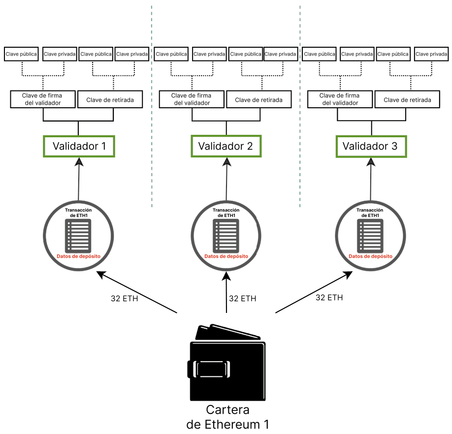

Ethereum asegura los activos de los usuarios utilizando criptografía de claves pública-privada. La clave pública se utiliza como base para una dirección de Ethereum, es decir, es visible para el público en general y se utiliza como un identificador único. La clave privada (o «secreta») solo debe ser accesible para el propietario de una cuenta. La clave privada se utiliza para «firmar» transacciones y datos para que la criptografía pueda demostrar que el titular aprueba alguna acción de una clave privada específica.

Las claves de Ethereum se generan utilizando [criptografía de curva elíptica](https://en.wikipedia.org/wiki/Elliptic-curve_cryptography).

No obstante, cuando Ethereum cambió de [prueba de trabajo](/developers/docs/consensus-mechanisms/pow) a [prueba de participación](/developers/docs/consensus-mechanisms/pos), se añadió un nuevo tipo de clave a Ethereum. Las claves originales siguen funcionando exactamente igual que antes: no hubo cambios en las claves basadas en curvas elípticas que protegen las cuentas. No obstante, los usuarios necesitaban un nuevo tipo de clave para participar en la prueba de participación colocando ETH y ejecutando validadores. Esta necesidad surgió de los desafíos de escalabilidad asociados con muchos mensajes que pasaban entre un gran número de validadores que requerían un método criptográfico que se pudiera agregar fácilmente para reducir la cantidad de comunicación necesaria para que la red llegara a un consenso.

Este nuevo tipo de clave utiliza el esquema de firma [**Boneh-Lynn-Shacham (BLS)**](https://wikipedia.org/wiki/BLS_digital_signature). BLS permite una agregación muy eficiente de firmas, pero también permite la ingeniería inversa de claves de validadores individuales añadidas y es perfecto para administrar acciones entre validadores.

## Los dos tipos de claves de validación {#two-types-of-keys}

Antes de cambiar a la prueba de participación, los usuarios de Ethereum sólo tenían una única clave privada basada en la curva elíptica para acceder a sus fondos. Con la introducción de la prueba de participación, los usuarios que deseaban ser participantes en solitario también requerían una **clave de validación** y una **clave de retirada**.

### La clave de validador {#validator-key}

La clave de firma del validador consta de dos elementos:

- Clave **privada** de validador
- Clave **pública** de validador

El propósito de la clave privada del validador es firmar operaciones en cadena, como propuestas de bloque y certificaciones. Debido a esto, estas claves deben estar en una cartera en línea.

Esta flexibilidad tiene la ventaja de mover las claves de firma del validador muy rápidamente de un dispositivo a otro, sin embargo, si se han perdido o se han robado, un ladrón puede ser capaz de **actuar maliciosamente** de varias maneras:

- Conseguir que el validador sea recortado por:
  - Ser un proponente y firmar dos bloques de balizas diferentes para el mismo espacio.
  - Ser un certificador y firmar un certificado que «rodea» a otro.
  - Ser un certificador y firmar dos certificaciones diferentes con el mismo objetivo.
- Forzar una salida voluntaria, lo que impide que el validador participe y otorga acceso a su saldo de ETH al propietario de la clave de retirada.

La **clave pública del validador** se incluye en los datos de la transacción cuando un usuario deposita ETH en el contrato de depósito de participación. Esto se conoce como los _datos de depósito_ y permite a Ethereum identificar el validador.

### Credenciales de retirada {#withdrawal-credentials}

Cada validador tiene una propiedad conocida como _credenciales de retirada_. Este campo de 32 bytes comienza con un `0x00`, que representa las credenciales de retirada de BLS, o un `0x01`, que representa las credenciales que apuntan a una dirección de ejecución.

Los validadores con `0x00` claves BLS deben actualizar estas credenciales para apuntar a una dirección de ejecución con el fin de activar el exceso de pagos de saldo o la retirada completa de la participación. Esto se puede hacer proporcionando una dirección de ejecución en los datos de depósito durante la generación inicial de la clave, _O_ utilizando la clave de retirada en un momento posterior para firmar y transmitir un mensaje `BLSToExecutionChange`.

### La clave de retirada {#withdrawal-key}

Se necesitará la clave de retirada para actualizar las credenciales de retirada y asñi decidir una dirección de ejecución, si no se establece durante el depósito inicial. Esto permitirá que los pagos de saldo en exceso comiencen a procesarse, y también permitirá a los usuarios retirar completamente su ETH en participación.

Al igual que las claves de validación, las claves de retirada también constan de dos componentes:

- Clave **privada** de retirada
- Clave **pública** de retirada

Perder esta llave antes de actualizar las credenciales de retiro al tipo `0x01` significa perder el acceso al saldo del validador. El validador todavía puede firmar certificaciones y bloqueos, ya que estas acciones requieren la clave privada del validador, sin embargo, hay poco o ningún incentivo si se pierden las claves de retirada.

La separación de las claves del validador de las claves de la cuenta de Ethereum permite que un solo usuario ejecute varios validadores.



## Derivar claves de una frase semilla {#deriving-keys-from-seed}

Si cada 32 ETH en participación requiriera un nuevo conjunto de 2 claves completamente independientes, la gestión de claves se volvería rápidamente difícil de manejar, especialmente para los usuarios que ejecutan múltiples validadores. En su lugar, se pueden derivar múltiples claves de validación de un solo secreto común y el almacenamiento de ese único secreto permite el acceso a múltiples claves de validación.

[Las frases mnemotécnicas](https://en.bitcoinwiki.org/wiki/Mnemonic_phrase) y las rutas son características prominentes que los usuarios a menudo encuentran cuando [acceden](https://ethereum.stackexchange.com/questions/19055/what-is-the-difference-between-m-44-60-0-0-and-m-44-60-0) a sus carteras. Se denomina frase mnemotécnica a una secuencia de palabras que actúan como semilla inicial para una clave privada. Cuando se combina con datos adicionales, la frase mnemotécnica genera un hash conocido como la «clave maestra». Hace pensar en la raíz de un árbol. Las ramas de esta raíz se pueden derivar utilizando una ruta jerárquica para que los nodos secundarios (hijos) puedan existir como combinaciones del hash de su nodo padre y su índice en el árbol. Lea sobre los estándares [BIP-32](https://github.com/bitcoin/bips/blob/master/bip-0032.mediawiki) y [BIP-19](https://github.com/bitcoin/bips/blob/master/bip-0039.mediawiki) para la generación de claves basadas en la mnemotecnia.

Estas rutas tienen la siguiente estructura, que les resultará familiar a los usuarios que hayan interactuado con carteras de hardware:

```
m/44'/60'/0'/0`
```

Los recortes en esta ruta separan los componentes de la clave privada de la siguiente manera:

```
master_key / purpose / coin_type / account / change / address_index
```

Esta lógica permite a los usuarios adjuntar tantos validadores como sea posible a una sola **frase mnemotécnica**, porque la raíz del árbol puede ser común y diferenciarse luego en las ramas. El usuario puede **derivar cualquier número de llaves** de la frase mnemotécnica.

```
      [m / 0]
     /
    /
[m] - [m / 1]
    \
     \
      [m / 2]
```

Cada rama está separada por un `/`, por lo que `m/2` significa comenzar con la clave maestra y seguir la rama 2. En el siguiente esquema, se utiliza una sola frase mnemotécnica para almacenar tres claves de retirada, cada una con dos validadores asociados.


## Más lecturas {#further-reading}

- [Publicación en el blog de Ethereum Foundation por Carl Beekhuizen](https://blog.ethereum.org/2020/05/21/keys/)
- [Generación de claves EIP-2333 BLS12-381](https://eips.ethereum.org/EIPS/eip-2333)
