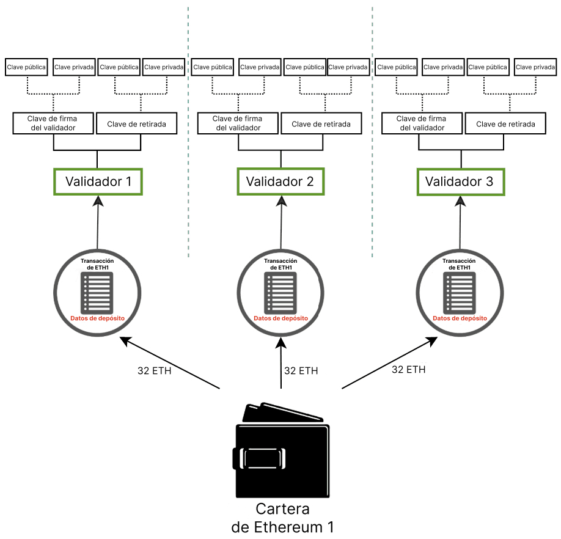
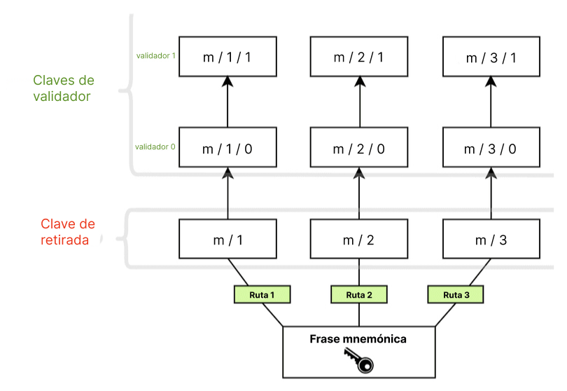

Ethereum asegura los activos de los usuarios utilizando criptografía de clave pública-privada. La clave pública se utiliza como base para una dirección de Ethereum; es decir, es visible para el público en general y se utiliza como un identificador único. La clave privada (o "secreta") solo debe ser accesible para el propietario de la cuenta. La clave privada se utiliza para "firmar" transacciones y datos de modo que la criptografía pueda demostrar que el titular aprueba alguna acción de una clave privada específica.

Las claves de Ethereum se generan utilizando [criptografía de curva elíptica](https://en.wikipedia.org/wiki/Elliptic-curve_cryptography).

Sin embargo, cuando Ethereum pasó de la [prueba de trabajo (PoW)](/developers/docs/consensus-mechanisms/pow) a la [prueba de participación (PoS)](/developers/docs/consensus-mechanisms/pos), se añadió un nuevo tipo de clave a Ethereum. Las claves originales siguen funcionando exactamente igual que antes: no hubo cambios en las claves basadas en curvas elípticas que aseguran las cuentas. Sin embargo, los usuarios necesitaban un nuevo tipo de clave para participar en la prueba de participación haciendo staking de ETH y ejecutando validadores. Esta necesidad surgió de los desafíos de escalabilidad asociados con el paso de muchos mensajes entre un gran número de validadores, lo que requería un método criptográfico que pudiera agregarse fácilmente para reducir la cantidad de comunicación necesaria para que la red llegara a un consenso.

Este nuevo tipo de clave utiliza el [esquema de firma **Boneh-Lynn-Shacham (BLS)**](https://wikipedia.org/wiki/BLS_digital_signature). BLS permite una agregación de firmas muy eficiente, pero también permite la ingeniería inversa de las claves de validadores individuales agregadas y es ideal para gestionar acciones entre validadores.

## Los dos tipos de claves de validador {#two-types-of-keys}

Antes del cambio a la prueba de participación, los usuarios de Ethereum solo tenían una única clave privada basada en curvas elípticas para acceder a sus fondos. Con la introducción de la prueba de participación, los usuarios que deseaban ser stakers en solitario también requerían una **clave de validador** y una **clave de retiro**.

### La clave de validador {#validator-key}

La clave de firma del validador consta de dos elementos:

- Clave **privada** del validador
- Clave **pública** del validador

El propósito de la clave privada del validador es firmar operaciones en cadena, como propuestas de bloques y atestaciones. Debido a esto, estas claves deben mantenerse en una billetera caliente.

Esta flexibilidad tiene la ventaja de mover las claves de firma del validador muy rápidamente de un dispositivo a otro; sin embargo, si se han perdido o han sido robadas, un ladrón podría **actuar de forma maliciosa** de varias maneras:

- Hacer que el validador sufra un recorte al:
  - Ser un proponente y firmar dos bloques de baliza diferentes para el mismo slot
  - Ser un atestador y firmar una atestación que "rodea" a otra
  - Ser un atestador y firmar dos atestaciones diferentes que tienen el mismo objetivo
- Forzar una salida voluntaria, lo que detiene el staking del validador y otorga acceso a su saldo de ETH al propietario de la clave de retiro

La **clave pública del validador** se incluye en los datos de la transacción cuando un usuario deposita ETH en el contrato de depósito de staking. Esto se conoce como los _datos de depósito_ y permite a Ethereum identificar al validador.

### Credenciales de retiro {#withdrawal-credentials}

Cada validador tiene una propiedad conocida como _credenciales de retiro_. El primer byte de este campo de 32 bytes identifica el tipo de cuenta: `0x00` representa las credenciales BLS originales (anteriores a Shapella, no retirables), `0x01` representa las credenciales heredadas que apuntan a una dirección de ejecución, y `0x02` representa el tipo de credencial de capitalización moderna.

Los validadores con claves BLS `0x00` deben actualizar estas credenciales para que apunten a una dirección de ejecución con el fin de activar los pagos de saldo excedente o el retiro completo del staking. Esto se puede hacer proporcionando una dirección de ejecución en los datos de depósito durante la generación inicial de claves, _O_ utilizando la clave de retiro en un momento posterior para firmar y transmitir un mensaje `BLSToExecutionChange`.

[Más sobre las credenciales de retiro del validador](/developers/docs/consensus-mechanisms/pos/withdrawal-credentials/)

### La clave de retiro {#withdrawal-key}

Se requerirá la clave de retiro para actualizar las credenciales de retiro para que apunten a una dirección de ejecución, si no se configuró durante el depósito inicial. Esto permitirá que comiencen a procesarse los pagos de saldo excedente y también permitirá a los usuarios retirar completamente sus ETH en staking.

Al igual que las claves de validador, las claves de retiro también constan de dos componentes:

- Clave **privada** de retiro
- Clave **pública** de retiro

Perder esta clave antes de actualizar las credenciales de retiro al tipo `0x01` significa perder el acceso al saldo del validador. El validador aún puede firmar atestaciones y bloques, ya que estas acciones requieren la clave privada del validador; sin embargo, hay poco o ningún incentivo si se pierden las claves de retiro.

Separar las claves de validador de las claves de la cuenta de Ethereum permite que un solo usuario ejecute múltiples validadores.



**Nota**: Salir de las tareas de staking y retirar el saldo de un validador actualmente requiere firmar un [mensaje de salida voluntaria (VEM)](https://mirror.xyz/ladislaus.eth/wmoBbUBes2Wp1_6DvP6slPabkyujSU7MZOFOC3QpErs&1) con la clave del validador. Sin embargo, [EIP-7002](https://eips.ethereum.org/EIPS/eip-7002) es una propuesta que permitirá a un usuario desencadenar la salida de un validador y retirar su saldo firmando mensajes de salida con la clave de retiro en el futuro. Esto reducirá los supuestos de confianza al permitir que los stakers que delegan ETH a [proveedores de staking como servicio](/staking/saas/#what-is-staking-as-a-service) mantengan el control de sus fondos.

## Derivación de claves a partir de una frase semilla {#deriving-keys-from-seed}

Si cada 32 ETH en staking requiriera un nuevo conjunto de 2 claves completamente independientes, la gestión de claves se volvería rápidamente inmanejable, especialmente para los usuarios que ejecutan múltiples validadores. En su lugar, se pueden derivar múltiples claves de validador a partir de un único secreto común, y almacenar ese único secreto permite el acceso a múltiples claves de validador.

Las [frases mnemotécnicas](https://en.bitcoinwiki.org/wiki/Mnemonic_phrase) y las rutas son características destacadas que los usuarios suelen encontrar cuando [acceden](https://ethereum.stackexchange.com/questions/19055/what-is-the-difference-between-m-44-60-0-0-and-m-44-60-0) a sus billeteras. La frase mnemotécnica es una secuencia de palabras que actúan como una semilla inicial para una clave privada. Cuando se combina con datos adicionales, la frase mnemotécnica genera un hash conocido como la "clave maestra". Esto se puede considerar como la raíz de un árbol. Las ramas de esta raíz se pueden derivar utilizando una ruta jerárquica para que los nodos secundarios puedan existir como combinaciones del hash de su nodo principal y su índice en el árbol. Lea sobre los estándares [BIP-32](https://github.com/bitcoin/bips/blob/master/bip-0032.mediawiki) y [BIP-19](https://github.com/bitcoin/bips/blob/master/bip-0039.mediawiki) para la generación de claves basadas en frases mnemotécnicas.

Estas rutas tienen la siguiente estructura, que resultará familiar a los usuarios que hayan interactuado con billeteras de hardware:

```
m/44'/60'/0'/0`
```

Las barras diagonales en esta ruta separan los componentes de la clave privada de la siguiente manera:

```
master_key / purpose / coin_type / account / change / address_index
```

Esta lógica permite a los usuarios adjuntar tantos validadores como sea posible a una sola **frase mnemotécnica** porque la raíz del árbol puede ser común y la diferenciación puede ocurrir en las ramas. El usuario puede **derivar cualquier número de claves** a partir de la frase mnemotécnica.

```
[m / 0]
     /
    /
[m] - [m / 1]
    \
     \
      [m / 2]
```

Cada rama está separada por un `/`, por lo que `m/2` significa comenzar con la clave maestra y seguir la rama 2. En el esquema a continuación, se utiliza una sola frase mnemotécnica para almacenar tres claves de retiro, cada una con dos validadores asociados.



## Más información {#further-reading}

- [Publicación del blog de la Fundación Ethereum por Carl Beekhuizen](https://blog.ethereum.org/2020/05/21/keys)
- [Generación de claves BLS12-381 según EIP-2333](https://eips.ethereum.org/EIPS/eip-2333)
- [EIP-7002: Salidas desencadenadas por la capa de ejecución](https://web.archive.org/web/20250125035123/https://research.2077.xyz/eip-7002-unpacking-improvements-to-staking-ux-post-merge)
- [Gestión de claves a escala](https://docs.ethstaker.cc/ethstaker-knowledge-base/scaled-node-operators/key-management-at-scale)