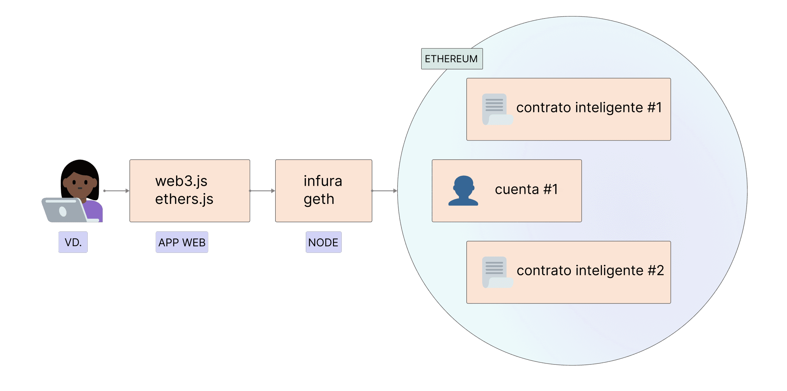

Ethereum es una red distribuida de ordenadores (denominados nodos) que ejecutan software que puede verificar bloques y datos de transacciones. El software debe de ejecutarse en su ordenador para convertirlo en un nodo de Ethereum. Se requieren dos piezas separadas de software (conocidas como «clientes») para fomar un nodo.

## Requisitos previos {#prerequisites}

Debe estar familiarizado con el concepto de una red entre pares y [los aspectos básicos sobre la EVM](/developers/docs/evm/) antes de profundizar y ejecutar su propia instancia de un cliente de Ethereum. Eche un vistazo a nuestra [Introducción a Ethereum](/developers/docs/intro-to-ethereum/).

Si no está familiarizado con los nodos, le recomendamos que primero lea nuestra sencilla introducción de [Cómo ejecutar un nodo de Ethereum](/run-a-node).

## ¿Qué son los nodos y clientes? {#what-are-nodes-and-clients}

Un «nodo» es cualquier instancia del software de un cliente de Ethereum que está conectado con otros ordenadores que también ejecutan el software de Ethereum, formando una red. Un cliente es una implementación de Ethereum que comprueba los datos con respecto a las normas de un protocolo y protege la red. Un nodo necesita ejecutar dos clientes: un cliente de consenso y un cliente de ejecución.

- El cliente de ejecución (también conocido como el ingeniero de ejecución, cliente EL, o anteriormente cliente Eth1) escucha las nuevas transacciones transmitidas en la red, las ejecuta en la EVM, y mantiene el estado más reciente y la base de datos de todos los datos actuales de Ethereum.
- El cliente de consenso (también conocido como el nodo de baliza, cliente CL y anteriormente cliente Eth2) implementa el algoritmo de consenso de la prueba de participación, que permite que la red alcance un acuerdo basado en datos validados del cliente de ejecución. También hay una tercera pieza de software, conocida como «validador» que se puede agregar al cliente de consenso, lo que permite que un nodo participe en la protección de la red.

Estos clientes trabajan juntos para hacer un seguimiento de la cadena de encabezado de Ethereum y permitir que los usuarios interactúen con la red Ethereum. El diseño modular con múltiples piezas de software trabajando juntas se llama [complejidad encapsulada](https://vitalik.eth.limo/general/2022/02/28/complexity.html). Este enfoque hizo que fuera más fácil ejecutar [La Fusión](/roadmap/merge) sin problemas; hace que el software del cliente sea más fácil de mantener y desarrollar; y permite la reutilización de clientes individuales, por ejemplo, en el [ecosistema de capa 2](/layer-2/).

 Diagrama simplificado de una ejecución acoplada y cliente de consenso.

### Diversidad de clientes {#client-diversity}

Ambos [clientes de ejecución](/developers/docs/nodes-and-clients/#execution-clients) y [clientes de consenso](/developers/docs/nodes-and-clients/#consensus-clients) existen en una variedad de lenguajes de programación desarrollados por diferentes equipos.

Múltiples implementaciones de clientes pueden fortalecer la red reduciendo su dependencia de una sola base de código. El objetivo ideal es lograr la diversidad sin que ningún cliente tenga una posición dominante para reducir así los puntos únicos de error. La variedad de idiomas también invita a una comunidad de desarrolladores más amplia y les permite crear integraciones en su idioma preferido.

Más información sobre la [diversidad de clientes](/developers/docs/nodes-and-clients/client-diversity/).

Lo que estas implementaciones de clientes tienen en común es que todas siguen una misma especificación. Estas especificaciones determinan cómo funcionan la red de Ethereum y las funciones de la cadena de bloques. Cada detalle técnico se define y se pueden encontrar especificaciones como:

- En su origen, el [Protocolo de Ethereum](https://ethereum.github.io/yellowpaper/paper.pdf)
- [Especificaciones de ejecución](https://github.com/ethereum/execution-specs/)
- [Especificaciones de consenso](https://github.com/ethereum/consensus-specs)
- [Se han implementado las EIP](https://eips.ethereum.org/) en varias [actualizaciones de red](/history/)

### Nodos de rastreamiento en la red {#network-overview}

Múltiples rastreadores ofrecen una visión general en tiempo real de los nodos en la red Ethereum. Tenga en cuenta que debido a la naturaleza de las redes descentralizadas, estos rastreadores sólo pueden proporcionar una vista limitada de la red y podrían ofrecer diferentes resultados.

- [Mapa de nodos](https://etherscan.io/nodetracker) por Etherscan
- [Nodos de Ether](https://ethernodes.org/) por Bitfly
- [Nodewatch](https://www.nodewatch.io/) de Chainsafe, nodos de consenso rastreados

## Tipos de nodos {#node-types}

Si desea [ejecutar su propio nodo](/developers/docs/nodes-and-clients/run-a-node/), debe entender que existen diferentes tipos de nodos que consumen datos de forma diferente. De hecho, los clientes pueden ejecutar 3 tipos diferentes de nodos: ligero, completo y de almacenamiento. Además, hay opciones de diferentes estrategias de sincronización que permiten un tiempo de sincronización más rápido. La sincronización se refiere a la rapidez con que puede obtener la información más actualizada sobre el estado de Ethereum.

### Nodo completo {#full-node}

Los nodos completos hacen una validación bloque a bloque de la cadena de bloques, incluyendo la descarga y verificación del cuerpo del bloque e información sobre el estado de cada bloque. Hay diferentes clases de nodo completo: algunas parten del bloque original y verifican cada bloque en el historial de la cadena de bloques. Otras comienzan su verificación en un bloque más reciente que confían en que sea válido (por ejemplo, la «sincronía instantánea» de Geth). Independientemente de dónde comience la verificación, los nodos completos solo guardan una copia local de los datos relativamente recientes (normalmente los 128 bloques recientes de msot), lo que permite eliminar los datos más antiguos para ahorrar espacio en el disco. Los datos más antiguos se pueden regenerar cuando se necesiten.

- Almacena datos completos de la cadena de bloques (aunque esto se recorta periódicamente para que un nodo completo no almacene todos los datos de estado de vuelta al origen).
- Participa en la validación de bloques, verifica todos los bloques y estados.
- Todos los estados pueden recuperarse del almacenamiento local o regenerarse de «instantáneas» por un nodo completo.
- Sirve a la red y proporciona datos si se le solicita.

### Nodo de almacenamiento {#archive-node}

Los nodos de archivo son nodos completos que verifican cada bloque de genesis y nunca eliminan ninguno de los datos descargados.

- Almacena todo lo que se guarda en el nodo completo y construye un archivo de estados históricos. Esto es necesario si quiere consultar algún elemento como el saldo de una cuenta en el bloque número 4.000.000, o simplemente probar sus propias transacciones sin minarlas usando el seguimiento.
- Estos datos representan unidades de terabytes, lo que hace que los nodos de almacenamiento sean menos atractivos para el usuario medio, pero que pueden ser útiles para servicios como los exploradores de bloques, proveedores de carteras y análisis de cadena.

Sincronizar clientes en algún modo distinto al almacenamiento (archivo) ocasionará que los datos de la cadena de bloques resultante sean truncados. Esto significa que no hay un archivo de todo el historial de estados, pero el nodo completo es capaz de construirlo bajo demanda.

Más información sobre [Nodos de almacenamiento](/developers/docs/nodes-and-clients/archive-nodes).

### Nodo ligero {#light-node}

En lugar de descargar cada bloque, los nodos ligeros solo descargan los encabezados de los bloques. Estos encabezados contienen información resumida sobre el contenido de los bloques. Cualquier otra información que requiera el nodo ligero se solicita a un nodo completo. El nodo ligero puede entonces verificar independientemente los datos que recibe frente a raíces de estado en los encabezados de bloque. Los nodos ligeros permiten a los usuarios participar en la red Ethereum sin el potente hardware o amplitud de achura de banda necesarios para ejecutar nodos completos. Con el tiempo, los nodos ligeros podrían ejecutarse en teléfonos móviles o dispositivos pequeños. Los nodos ligeros no participan en el consenso (es decir, no pueden ser mineros/validadores), pero sí pueden acceder a la cadena de bloques de Ethereum con las mismas garantías de funcionalidad y seguridad que un nodo completo.

Los clientes ligeros son un área de desarrollo activo para Ethereum y esperamos ver pronto nuevos clientes ligeros para la capa de consenso y la capa de ejecución. También hay rutas potenciales para proporcionar datos ligeros del cliente a través de la [red de intercambio de información (o Gossip)](https://www.ethportal.net/). Lo que supone una ventaja, ya que la red de intercambio de información podría soportar una red de nodos ligeros sin necesidad de nodos completos para servir solicitudes.

Ethereum aún no soporta una gran cantidad de nodos ligeros, pero se espera que el soporte para nodos ligeros se desarrolle rápidamente en un futuro cercano. En particular, clientes como [Nimbus](https://nimbus.team/), [Helios](https://github.com/a16z/helios)y [LodeStar](https://lodestar.chainsafe.io/) están actualmente muy centrados en nodos ligeros.

## ¿Por qué debería ejecutar un nodo de Ethereum? {#why-should-i-run-an-ethereum-node}

Ejecutar un nodo le permite usar Ethereum de forma directa y privada, sin confianza, mientras soporta la red manteniéndola más robusta y descentralizada.

### Beneficios para usted {#benefits-to-you}

Ejecutar su propio nodo le permite utilizar Ethereum de una manera realmente privada, autosuficiente y sin confianza. No necesita confiar en la red, porque usted mismo puede verificar los datos con su cliente. «No confíe, verifique» es un mantra popular en la cadena de bloques.

- Su nodo verifica todas las transacciones y bloquea aquellas que vayan en contra de las reglas del consenso en sí. Esto significa que no tiene que depender de ningún otro nodo de la red o confiar plenamente en ellos.
- Puede utilizar una cartera Ethereum con su propio nodo. Puede usar DApps de forma más segura y privada, porque no tendrá que filtrar sus direcciones y saldos a intermediarios. Todo puede ser verificado con tu propio cliente. [MetaMask](https://metamask.io), [Frame](https://frame.sh/) y [muchas otras carteras](/wallets/find-wallet/) ofrecen importación RPC, permitiéndoles usar su nodo.
- Puede ejecutar y tener otros servicios autoalojados que dependen de los datos de Ethereum. Por ejemplo, podría ser un validador de la cadena de baliza como la capa 2, infraestructura, exploradores de bloques, procesadores de pagos, etc.
- Puede proporcionar sus propias [terminales RPC personalizadas](/developers/docs/apis/json-rpc/). Incluso podría ofrecer estas terminales públicamente a la comunidad para ayudarles a evitar los grandes proveedores centralizados.
- Puede conectarse a su nodo usando la **comunicación entre procesos (IPC)** o reescribiendo el nodo para cargar su programa como un complemento. Esto otorga poca latencia, lo que ayuda mucho, p. ej., al procesar una gran cantidad de datos usando bibliotecas Web 3, o cuando necesite reemplazar sus transacciones lo más rápido posible (por ejemplo, operaciones ventajistas o «frontrunning»).
- Puede participar directamente con ETH para asegurar la red y ganar recompensas. Vea [Cómo hacer participaciones en solitario](/staking/solo/) para empezar.

### Beneficios de la red {#network-benefits}

Un conjunto diverso de nodos es importante para la salud, seguridad y resiliencia operativa de Ethereum.

- Los nodos completos hacen cumplir las reglas de consenso, de modo que no se les pueda engañar para que acepten bloques que no siguen dichas reglas. Esto proporciona seguridad adicional a la red, porque si todos los nodos fueran nodos ligeros y no realizaran la verificación completa, los validadores podrían atacar la red.
- En caso de un ataque que supere las defensas criptoeconómicas de [la prueba de participación](/developers/docs/consensus-mechanisms/pos/#what-is-pos), se puede realizar una recuperación social por nodos completos eligiendo seguir la cadena honesta.
- Más nodos en la red dan como resultado una red más diversa y robusta, que es el objetivo absoluto de la descentralización, y que permite un sistema resistente a la censura y de confianza.
- Los nodos completos proporcionan acceso a los datos de la cadena de bloques para clientes ligeros que dependen de ellos. Los nodos ligeros no almacenan la cadena de bloques completa, sino que verifican los datos usando [ los estados raíz en los encabezamientos de los bloques](/developers/docs/blocks/#block-anatomy). Pueden solicitar más información de los nodos completos si la necesitan.

Si ejecuta un nodo completo, toda la red Ethereum se beneficia de él, incluso si no se ejecuta un validador.

## Ejecución de tu propio nodo {#running-your-own-node}

¿Le interesaría ejecutar su propio cliente de Ethereum?

En nuestra página de [Cómo ejecutar un nodo](/run-a-node) puede ver una sencilla introducción apta para principiantes.

Si es usted un usuario más avezado y quiere profundizar más sobre cómo [Ejecutar su propio nodo](/developers/docs/nodes-and-clients/run-a-node/).

## Alternativas {#alternatives}

Configurar su propio nodo puede costarle tiempo y recursos, pero no siempre necesita ejecutar su propia instancia. En este caso, puede utilizar un proveedor de API externo. Para obtener una visión general sobre el uso de estos servicios, consulte la página [Nodos como servicio](/developers/docs/nodes-and-clients/nodes-as-a-service/).

Si alguien ejecuta un nodo de Ethereum con una API pública en su comunidad, puede apuntar sus carteras a un nodo comunitario a través de RPC personalizado y ganar más privacidad que con algún tercero de confianza aleatorio.

Por otra parte, si ejecuta un cliente, puede compartirlo con amigos suyos que lo necesiten.

## Clientes de ejecución {#execution-clients}

La comunidad de Ethereum tiene múltiples clientes de ejecución de código abierto (anteriormente conocidos como «clientes Eth1», o simplemente «clientes de Ethereum»), desarrollados por diferentes equipos mediante el uso de diferentes lenguajes de programación. Esto hace que la red sea más sólida y más [diversa](/developers/docs/nodes-and-clients/client-diversity/). El objetivo ideal es lograr la diversidad sin que ningún cliente tenga una posición dominante para reducir así los puntos únicos de error.

En esta tabla se resumen los diferentes clientes. Todos ellos pasan [pruebas de cliente](https://github.com/ethereum/tests) y se gestionan de manera activa para mantenerse actualizados con actualizaciones de red.

| Cliente                                                                  | Idioma     | Sistemas operativos   | Redes                           | Estrategias de sincronización                                    | Lima de estado  |
| ------------------------------------------------------------------------ | ---------- | --------------------- | ------------------------------- | ---------------------------------------------------------------- | --------------- |
| [Geth](https://geth.ethereum.org/)                                       | Go         | Linux, Windows, macOS | Red principal, Sepolia, Holesky | [Snap](#snap-sync), [Completa](#full-sync)                       | Archivo, podado |
| [Nethermind](https://www.nethermind.io/)                                 | C#, .NET   | Linux, Windows, macOS | Red principal, Sepolia, Holesky | [Snap](#snap-sync) (sin servir), Rápida, [Completa](#full-sync)  | Archivo, podado |
| [Besu](https://besu.hyperledger.org/en/stable/)                          | Java       | Linux, Windows, macOS | Red principal, Sepolia, Holesky | [Snap](#snap-sync), [Rápida](#fast-sync), [Completa](#full-sync) | Archivo, podado |
| [Erigon](https://github.com/ledgerwatch/erigon)                          | Go         | Linux, Windows, macOS | Red principal, Sepolia, Holesky | [Completa](#full-sync)                                           | Archivo, podado |
| [Reth](https://reth.rs/)                                                 | Rust       | Linux, Windows, macOS | Red principal, Sepolia, Holesky | [Completa](#full-sync)                                           | Archivo, podado |
| [EthereumJS](https://github.com/ethereumjs/ethereumjs-monorepo) _(beta)_ | TypeScript | Linux, Windows, macOS | Sepolia, Holesky                | [Completa](#full-sync)                                           | Podado          |

Si desea obtener más información sobre redes compatibles, puede leer el apartado de [Redes de Ethereum](/developers/docs/networks/).

Cada cliente tiene casos de uso y ventajas únicas, por lo que debe elegirlo basándose en sus propias preferencias. La diversidad permite que las implementaciones se centren en diferentes características y públicos. Puede elegir un cliente en función de las características, el soporte, el lenguaje de programación o las licencias.

### Besu {#besu}

Hyperledger Besu es un cliente empresarial de Ethereum para redes públicas y autorizadas. Ejecuta todas las características de la red principal de Ethereum, desde el seguimiento hasta GraphQL, ejerce una amplia supervisión y es compatible con ConsenSys, tanto en canales comunitarios abiertos como a través de SLA comerciales para empresas. Está escrito en Java y dispone de licencia Apache 2.0.

La extensa [documentación](https://besu.hyperledger.org/en/stable/) de Besu le guiará a través de todos los detalles y sus características y configuraciones.

### Erigon {#erigon}

Erigon, antiguamente conocido como Turbo Geth, es una variante de Go Ethereum orientada hacia la velocidad y la eficiencia del espacio en el disco. Erigon es una implementación completamente restructurada de Ethereum, actualmente escrita en Go pero con implementaciones en otros lenguajes en desarrollo. El objetivo de Erigon es proporcionar una implementación más rápida, modular y optimizada de Ethereum. Puede realizar una sincronización completa de nodos de archivo usando menos de 2 Tb de espacio en disco, en menos de 3 días.

### Go-Ethereum {#geth}

Go-Ethereum (Geth, para abreviar) es una de las implementaciones originales del protocolo de Ethereum. Actualmente, es el cliente más difundido con la mayor base de usuarios y variedad de herramientas para usuarios y desarrolladores. Está escrito en Go, es de código totalmente abierto y se comercializa con la licencia GNU LGPL v3.

Descubra más sobre Geth en su [documentación](https://geth.ethereum.org/docs/).

### Nethermind {#nethermind}

Nethermind es una implementación de Ethereum diseñada con el bloque de C# .NET, y se ejecuta en todas las plataformas importantes, como ARM. Ofrece un gran rendimiento con:

- una máquina virtual optimizada
- acceso al estado
- redes y características ricas como paneles de control de Prometheus/Grafana, soporte de registro empresarial seq, rastreo JSON-RPC y complementos de análisis

Además, Nethermind dispone de [documentación detallada](https://docs.nethermind.io), una sólido soporte para desarrolladores, una comunidad en línea y asistencia ininterrumpida disponible para usuarios premium.

### Reth {#reth}

Reth (abreviatura de Rust Ethereum) es una implementación de nodo completo de Ethereum que se centra en ser fácil de usar, altamente modular, rápida y eficiente. Reth fue originalmente construida e impulsada por Paradigm, y está licenciada bajo las licencias de Apache y MIT.

Reth está listo para producción y es adecuado para su uso en entornos de misión crítica como staking o servicios de alto tiempo de actividad. Funciona bien en casos de uso donde se requiere alto rendimiento con grandes márgenes como RPC, MEV, indexación, simulaciones y actividades P2P.

Obtenga más información en el [Reth Book](https://reth.rs/) o el [repositorio Reth GitHub](https://github.com/paradigmxyz/reth?tab=readme-ov-file#reth).

### En desarrollo {#execution-in-development}

Estos clientes están aún en etapas tempranas de desarrollo y aún no se recomienda su uso.

#### EthereumJS {#ethereumjs}

El cliente de ejecución EthereumJS (EthereumJS) está escrito en TypeScript y se compone de una serie de paquetes, incluidas las primitivas principales de Ethereum representadas por las clases Bloque, Transacción y Merkle-Patricia Trie y los componentes principales del cliente, incluida una implementación de la Máquina Virtual de Ethereum (EVM), una clase de cadena de bloques y la pila de red DevP2P.

Obtenga más información al respecto leyendo su [documentación](https://github.com/ethereumjs/ethereumjs-monorepo/tree/master).

## Clientes de consenso {#consensus-clients}

Existen múltiples clientes de consenso (antes conocidos como clientes Eth2) que respaldan las [actualizaciones de consenso](/roadmap/beacon-chain/). Son responsables de toda la lógica relacionada con el consenso, incluido el algoritmo de elección de bifurcación, el procesamiento de certificados y la gestión de [prueba de participación](/developers/docs/consensus-mechanisms/pos) recompensas y penalizaciones.

| Cliente                                                       | Idioma     | Sistemas operativos   | Redes                                                     |
| ------------------------------------------------------------- | ---------- | --------------------- | --------------------------------------------------------- |
| [Lighthouse](https://lighthouse.sigmaprime.io/)               | Rust       | Linux, Windows, macOS | Cadena de baliza, Goerli, Pyrmont, Sepolia, Ropsten y más |
| [Lodestar](https://lodestar.chainsafe.io/)                    | TypeScript | Linux, Windows, macOS | Cadena de baliza, Goerli, Pyrmont, Sepolia, Ropsten y más |
| [Nimbus](https://nimbus.team/)                                | Nim        | Linux, Windows, macOS | Cadena de baliza, Goerli, Pyrmont, Sepolia, Ropsten y más |
| [Prysm](https://docs.prylabs.network/docs/getting-started/)   | Go         | Linux, Windows, macOS | Cadena de baliza, Goerli, Pyrmont, Sepolia, Ropsten y más |
| [Teku](https://consensys.net/knowledge-base/ethereum-2/teku/) | Java       | Linux, Windows, macOS | Cadena de baliza, Goerli, Pyrmont, Sepolia, Ropsten y más |

### Lighthouse {#lighthouse}

Lighthouse es una implementación de cliente de consenso en Rust bajo la licencia Apache-2.0. La mantiene Sigma Prime y está estable y lista para la producción desde el origen de la cadena de baliza. Depende de varias empresas, participaciones agrupadas e individuos. Su objetivo es ser segura, ejecutable e interoperable en una amplia gama de entornos, desde PC de escritorio hasta sofisticados despliegues automatizados.

La documentación se puede encontrar en el [Manual de Lighthouse](https://lighthouse-book.sigmaprime.io/)

### Lodestar {#lodestar}

Lodestar es una implementación de cliente de consenso lista para la producción y escrita en Typescript bajo licencia LGPL-3.0. La mantiene ChainSafe Systems y es el más reciente de los clientes de consenso para participantes en solitario, desarrolladores e investigadores. Lodestar consiste en un cliente de nodos y validador de baliza basado en implementaciones en JavaScript de protocolos Ethereum. Lodestar tiene como objetivo mejorar la facilidad de uso de Ethereum con clientes ligeros, ampliar la accesibilidad a un grupo más grande de desarrolladores y contribuir aún más a la diversidad de los ecosistemas.

Puede encontrar más información en nuestro [sitio web de Lodestar](https://lodestar.chainsafe.io/)

### Nimbus {#nimbus}

Lighthouse es una implementación de cliente de consenso escrita en Rust bajo la licencia Apache-2.0. Es un cliente listo para la producción que ya lo están usando los participantes en solitario o las participaciones agrupadas. Nimbus está diseñado para la eficiencia de los recursos, facilitando el funcionamiento en dispositivos restringidos a recursos e infraestructura empresarial con la misma facilidad, sin comprometer la estabilidad ni recompensar el rendimiento. Una huella de recursos más ligera significa que el cliente tiene un mayor margen de seguridad cuando la red está sometida a estrés.

Encontrará más información en el [manual de Nimbus](https://nimbus.guide/)

### Prysm {#prysm}

Prysm es un cliente de consenso de código abierto completamente escrito en Go bajo la licencia GPL-3.0. Cuenta con una interfaz de usuario opcional de la aplicación web y prioriza la experiencia del usuario, la documentación y la configurabilidad tanto para usuarios interesados como institucionales.

Visite [documentos de Prysm](https://docs.prylabs.network/docs/getting-started/) para obtener más información.

### Teku {#teku}

Teku es uno de los clientes originales desde los orígenes de la cadena de baliza. Junto con los objetivos habituales (seguridad, robustez, estabilidad, facilidad de uso, rendimiento), Teku específicamente pretende cumplir con todos los estándares de consenso de los clientes.

Teku ofrece opciones de despliegue muy flexibles. El nodo de baliza y el cliente validador pueden ejecutarse juntos como un solo proceso, lo que es extremadamente conveniente para los interesados en la participación en solitario, o los nodos pueden ejecutarse por separado para sofisticadas operaciones de participación. Además, Teku es completamente interoperable con [Web3Signer](https://github.com/ConsenSys/web3signer/) para firmar la seguridad clave y protección de recortes.

Está escrito en Java y dispone de licencia Apache 2.0. Es desarrollado por el equipo de Protocols de ConsenSys que también es responsable de Besu y Web3Signer. Obtenga más información en el [manual de Teku](https://docs.teku.consensys.net/en/latest/).

## Modos de sincronización {#sync-modes}

Para seguir y verificar los datos actuales en la red, el cliente Ethereum debe sincronizarse con el último estado de red. Para ello, es necesario descargar datos de pares, comprobar criptográficamente su integridad y construir una base de datos local de cadenas de bloques.

Los modos de sincronización representan diferentes enfoques de este proceso con diferentes compensaciones. Los clientes también varían en su implementación de algoritmos de sincronización. Consulte siempre la documentación oficial del cliente elegido para obtener información específica sobre su implementación.

### Modos de sincronización de la capa de ejecución {#execution-layer-sync-modes}

La capa de ejecución se puede ejecutar en diferentes modos para adaptarse a diferentes casos de uso, desde volver a ejecutar el estado mundial de la cadena de bloques hasta sincronizar solo con la punta de la cadena desde un punto de control de confianza.

#### Sincronización completa {#full-sync}

Una sincronización completa descarga todos los bloques (incluidos los encabezados y los cuerpos de bloque) y regenera el estado de la cadena de bloques de forma incremental ejecutando cada bloque desde la génesis.

- Minimiza la confianza y ofrece la máxima seguridad al verificar cada transacción.
- Debido al número creciente de transacciones, puede llevar de días a semanas procesar todas las transacciones.

Los [nodos de archivo](#archive-node) realizan una sincronización completa para crear (y retener) un historial completo de los cambios de estado realizados por cada transacción en cada bloque.

#### Sincronización rápida {#fast-sync}

Al igual que una sincronización completa, una sincronización rápida descarga todos los bloques (incluidos los encabezados, las transacciones y los recibos). Sin embargo, en vez de reprocesar las transacciones históricas, una sincronización rápida depende de los recibos hasta que alcanza una cabeza reciente, cuando cambia a importar y procesar bloques para proporcionar un nodo completo.

- Estrategia de sincronización rápida.
- Reduce la demanda del procesamiento en favor del uso de ancho de banda.

#### Sincronización snap {#snap-sync}

Las sincronizaciones snap también verifican la cadena bloque por bloque. Sin embargo, en lugar de comenzar en el bloque inicial, una sincronización snap comienza en el punto de verificación confiable más reciente que forma parte de la verdadera cadena de bloques. El nodo guarda puntos de control periódicos mientras elimina datos con mayor antigüedad a partir de una fecha concreta. Esas instantáneas se utilizan para regenerar los datos de estado cuando se necesitan, en lugar de tener que almacenarlos para siempre.

- La estrategia de sincronización más rápida, actualmente la utilizada por defecto en la Red principal de Ethereum.
- Ahorra mucho espacio en disco y ancho de banda de red sin sacrificar la seguridad.

[Más sobre la sincronización snap](https://github.com/ethereum/devp2p/blob/master/caps/snap.md).

#### Sincronización ligera {#light-sync}

El modo de cliente ligero descarga todos los encabezados de los bloques, datos de bloques y luego verifica algunos de manera aleatoria. Solamente sincroniza un extremo de la cadena desde el punto de control de confianza.

- Obtiene solamente el último estado mientras confía en los desarrolladores y en el mecanismo de consenso.
- Cliente listo para usar con el estado actual de la red en pocos minutos.

**NB** La sincronización ligera aún no funciona con la prueba de participación en Ethereum. ¡Las nuevas versiones de la sincronización ligera saldrán próximamente!

[Más información sobre clientes ligeros](/developers/docs/nodes-and-clients/light-clients/)

### Modos de sincronización de la capa de consenso {#consensus-layer-sync-modes}

#### Sincronización optimista {#optimistic-sync}

La sincronización óptima es una estrategia de sincronización después de La Fusión diseñada para ser compatible opt-in y backwards permitiendo que los nodos de ejecución se sincronicen a través de métodos establecidos. El motor de ejecución puede importar _bloques de baliza optimistamente_ sin verificarlos completamente, encontrar el último encabezado y luego comenzar a sincronizar la cadena con los métodos anteriores. Seguidamente, una vez que el cliente de ejecución se haya actualizado, informará al cliente de consenso de la validez de las transacciones en la cadena de baliza.

[Más sobre la sincronización optimista](https://github.com/ethereum/consensus-specs/blob/dev/sync/optimistic.md)

#### Sincronización de punto de verificación {#checkpoint-sync}

Una sincronización de punto de verificación o control, también conocida como sincronización de subjetividad débil, crea una experiencia de usuario superior para sincronizar un nodo de Baliza. Se basa en suposiciones de [subjetividad débil](/developers/docs/consensus-mechanisms/pos/weak-subjectivity/) que permite sincronizar la Cadena de Baliza desde un punto de verificación de subjetividad débil reciente en lugar del bloque inicial. Las sincronizaciones de punto de verificación hacen que el tiempo de sincronización inicial sea significativamente más rápido con suposiciones de confianza similares a la sincronización desde el [bloque inicial](/glossary/#genesis-block).

En la práctica, esto significa que el nodo se conecta a un servicio remoto para descargar estados finalizados recientes y continúa verificando datos desde ese punto. El proveedor externo que proporciona los datos debe ser confiable y debe de ser elegido cautelosamente.

Más sobre la [sincronización de punto de verificación](https://notes.ethereum.org/@djrtwo/ws-sync-in-practice)

## Más lectura {#further-reading}

- [Ethereum 101 - Parte 2 - Explicación de los nodos](https://kauri.io/ethereum-101-part-2-understanding-nodes/48d5098292fd4f11b251d1b1814f0bba/a) _– Wil Barnes, 13 de febrero de 2019_
- [Cómo ejecutar los nodos completos de Ethereum: una guía para aquellas personas que se encuentren desmotivadas](https://medium.com/@JustinMLeroux/running-ethereum-full-nodes-a-guide-for-the-barely-motivated-a8a13e7a0d31) _, Justin Leroux, 7 de noviembre de 2019_

## Temas relacionados {#related-topics}

- [Bloques](/developers/docs/blocks/)
- [Redes](/developers/docs/networks/)

## Tutoriales relacionados {#related-tutorials}

- [Convierta su Raspberry Pi 4 en un nodo validador con solo intercambiar su tarjeta MicroSD - Guía de instalación](/developers/tutorials/run-node-raspberry-pi/) _Intercambie su Raspberry Pi 4, conecte un cable Ethernet, conecte el disco SSD y encienda el dispositivo para convertir el Raspberry Pi 4 en un nodo completo de Ethereum mediante la activación de la capa de ejecución (red principal) o la capa de consenso (cadena de baliza/validador)._
