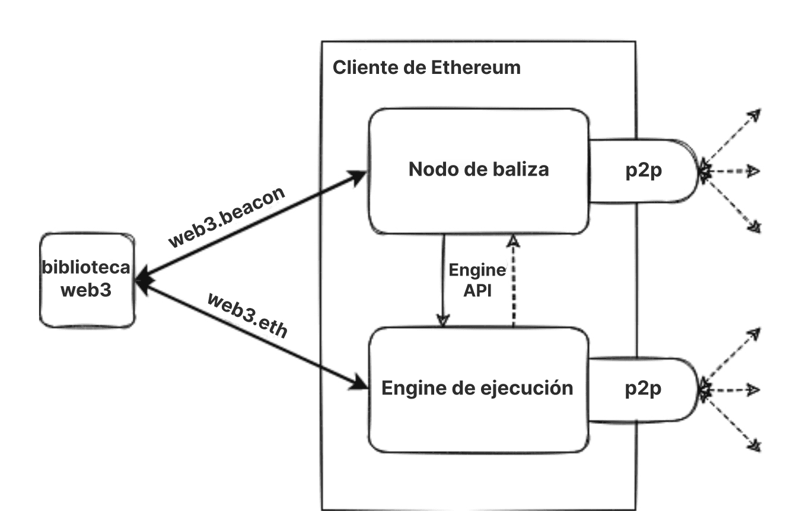
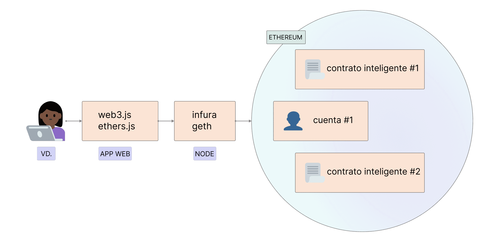

[Ethereum](/) es una red distribuida de computadoras (conocidas como nodos) que ejecutan software que puede verificar bloques y datos de transacciones. El software debe ejecutarse en su computadora para convertirla en un nodo de Ethereum. Se requieren dos piezas de software separadas (conocidas como "clientes") para formar un nodo.

## Requisitos previos {#prerequisites}

Debería entender el concepto de red entre pares (peer-to-peer) y los [conceptos básicos de la EVM](/developers/docs/evm/) antes de profundizar y ejecutar su propia instancia de un cliente de Ethereum. Eche un vistazo a nuestra [introducción a Ethereum](/developers/docs/intro-to-ethereum/).

Si es nuevo en el tema de los nodos, le recomendamos revisar primero nuestra introducción accesible sobre [cómo ejecutar un nodo de Ethereum](/run-a-node).

## ¿Qué son los nodos y los clientes? {#what-are-nodes-and-clients}

Un "nodo" es cualquier instancia de software cliente de Ethereum que está conectada a otras computadoras que también ejecutan el software de Ethereum, formando una red. Un cliente es una implementación de Ethereum que verifica datos según las reglas del protocolo y mantiene la red segura. Un nodo tiene que ejecutar dos clientes: un cliente de consenso y un cliente de ejecución.

- El cliente de ejecución (también conocido como Motor de Ejecución, cliente EL o anteriormente cliente Eth1) escucha las nuevas transacciones transmitidas en la red, las ejecuta en la EVM y mantiene el último estado y la base de datos de todos los datos actuales de Ethereum.
- El cliente de consenso (también conocido como nodo baliza, cliente CL o anteriormente cliente Eth2) implementa el algoritmo de consenso de prueba de participación (PoS), que permite a la red alcanzar un acuerdo basado en los datos validados del cliente de ejecución. También hay una tercera pieza de software, conocida como "validador", que se puede agregar al cliente de consenso, lo que permite que un nodo participe en la seguridad de la red.

Estos clientes trabajan juntos para realizar un seguimiento de la cabeza de la cadena de Ethereum y permiten a los usuarios interactuar con la red. El diseño modular con múltiples piezas de software trabajando juntas se llama [complejidad encapsulada](https://vitalik.eth.limo/general/2022/02/28/complexity.html). Este enfoque facilitó la ejecución de [La Fusión](/roadmap/merge) sin problemas, hace que el software cliente sea más fácil de mantener y desarrollar, y permite la reutilización de clientes individuales, por ejemplo, en el [ecosistema de capa 2 (l2)](/layer-2/).

Diagrama simplificado de un cliente de ejecución y de consenso acoplados.

### Diversidad de clientes {#client-diversity}

Tanto los [clientes de ejecución](/developers/docs/nodes-and-clients/#execution-clients) como los [clientes de consenso](/developers/docs/nodes-and-clients/#consensus-clients) existen en una variedad de lenguajes de programación y son desarrollados por diferentes equipos.

Múltiples implementaciones de clientes pueden fortalecer la red al reducir su dependencia de una sola base de código. El objetivo ideal es lograr diversidad sin que ningún cliente domine la red, eliminando así un posible punto único de fallo.
La variedad de lenguajes también invita a una comunidad de desarrolladores más amplia y les permite crear integraciones en su lenguaje preferido.

Obtenga más información sobre la [diversidad de clientes](/developers/docs/nodes-and-clients/client-diversity/).

Lo que estas implementaciones tienen en común es que todas siguen una única especificación. Las especificaciones dictan cómo funcionan la red y la cadena de bloques de Ethereum. Cada detalle técnico está definido y las especificaciones se pueden encontrar como:

- Originalmente, el [Libro Amarillo de Ethereum](https://ethereum.github.io/yellowpaper/paper.pdf)
- [Especificaciones de ejecución](https://github.com/ethereum/execution-specs/)
- [Especificaciones de consenso](https://github.com/ethereum/consensus-specs)
- Las [EIP](https://eips.ethereum.org/) implementadas en varias [actualizaciones de la red](/ethereum-forks/)

### Rastreo de nodos en la red {#network-overview}

Múltiples rastreadores ofrecen una visión general en tiempo real de los nodos en la red de Ethereum. Tenga en cuenta que, debido a la naturaleza de las redes descentralizadas, estos rastreadores solo pueden proporcionar una vista limitada de la red y podrían reportar resultados diferentes.

- [Mapa de nodos](https://etherscan.io/nodetracker) por Etherscan
- [Ethernodes](https://ethernodes.org/) por Bitfly
- [Nodewatch](https://www.nodewatch.io/) por Chainsafe, que rastrea los nodos de consenso
- [Monitoreth](https://monitoreth.io/) - por MigaLabs, una herramienta de monitoreo de red distribuida
- [Informes semanales de estado de la red](https://probelab.io) - por ProbeLab, utilizando el [rastreador Nebula](https://github.com/dennis-tra/nebula) y otras herramientas

## Tipos de nodo {#node-types}

Si desea [ejecutar su propio nodo](/developers/docs/nodes-and-clients/run-a-node/), debe entender que hay diferentes tipos de nodos que consumen datos de forma diferente. De hecho, los clientes pueden ejecutar tres tipos distintos de nodos: ligeros, completos y de archivo. También hay opciones para diferentes estrategias de sincronización que permiten tiempos de sincronización más rápidos. La sincronización se refiere a la rapidez con la que puede obtener la información más actualizada sobre el estado de Ethereum.

### Nodo completo {#full-node}

Los nodos completos hacen una validación bloque por bloque de la cadena de bloques, lo que incluye la descarga y verificación del cuerpo del bloque y los datos de estado de cada bloque. Hay diferentes clases de nodos completos: algunos comienzan desde el bloque génesis y verifican cada bloque en toda la historia de la cadena de bloques. Otros comienzan su verificación en un bloque más reciente que confían en que sea válido (por ejemplo, la «sincronización snap» de Geth). Independientemente de dónde comience la verificación, los nodos completos solo guardan una copia local de los datos relativamente recientes (generalmente los 128 bloques más recientes), lo que permite que los datos más antiguos se eliminen para ahorrar espacio en disco. Los datos más antiguos se pueden regenerar cuando se necesiten.

- Almacena todos los datos de la cadena de bloques (aunque esto se depura periódicamente para que un nodo completo no almacene todos los datos de estado hasta el génesis)
- Participa en la validación de bloques, verifica todos los bloques y estados.
- Un nodo completo puede recuperar todos los estados desde el almacenamiento local o regenerarlos a partir de 'instantáneas' (snapshots).
- Sirve a la red y proporciona datos a petición.

### Nodo de archivo {#archive-node}

Los nodos de archivo son nodos completos que verifican cada bloque desde el génesis y nunca eliminan ninguno de los datos descargados.

- Almacena todo lo que se mantiene en el nodo completo y crea un archivo de estados históricos. Es necesario si se quiere consultar algo como un balance de cuenta en el bloque #4.000.000, o simplemente y de manera confiable probar su propio conjunto de transacciones sin validarlas utilizando el rastreo.
- Estos datos representan unidades de terabytes, lo que hace que los nodos de archivo sean menos atractivos para los usuarios promedio, pero pueden ser útiles para servicios como exploradores de bloques, proveedores de billeteras y análisis de la cadena.

La sincronización de clientes en cualquier modo que no sea el de archivo resultará en la depuración de datos de la cadena de bloques. Esto significa que no hay un archivo de todos los estados históricos, pero el nodo completo es capaz de construirlos a petición.

Obtenga más información sobre los [nodos de archivo](/developers/docs/nodes-and-clients/archive-nodes).

### Nodo ligero {#light-node}

En lugar de descargar cada bloque, los nodos ligeros solo descargan los encabezados de los bloques. Estos encabezados contienen información resumida sobre el contenido de los bloques. Cualquier otra información que el nodo ligero necesite se solicita a un nodo completo. El nodo ligero puede verificar de forma independiente los datos que recibe con las raíces de estado en los encabezados de bloque. Los nodos ligeros permiten a los usuarios participar en la red de Ethereum sin el hardware potente o el gran ancho de banda que se requiere para ejecutar nodos completos. Con el tiempo, los nodos ligeros podrían llegar a ejecutarse en teléfonos móviles o dispositivos integrados. Los nodos ligeros no participan en el consenso (es decir, no pueden ser validadores), pero pueden acceder a la cadena de bloques de Ethereum con las mismas garantías de funcionalidad y seguridad que un nodo completo.

Los clientes ligeros son un área de desarrollo activo para Ethereum y esperamos ver pronto nuevos clientes ligeros para la capa de consenso y la capa de ejecución.
También existen posibles rutas para proporcionar datos de clientes ligeros a través de la [red gossip (propagación)](https://www.ethportal.net/). Esto es ventajoso porque la red gossip podría soportar una red de nodos ligeros sin requerir nodos completos para atender las solicitudes.

Ethereum aún no admite una gran población de nodos ligeros, pero el soporte de nodos ligeros es un área que se espera que se desarrolle rápidamente en un futuro cercano. En particular, clientes como [Nimbus](https://nimbus.team/), [Helios](https://github.com/a16z/helios) y [Lodestar](https://lodestar.chainsafe.io/) actualmente están muy enfocados en los nodos ligeros.

## ¿Por qué debería ejecutar un nodo de Ethereum? {#why-should-i-run-an-ethereum-node}

Ejecutar un nodo le permite utilizar Ethereum de forma directa, sin necesidad de confianza y de manera privada, al tiempo que apoya a la red manteniéndola más robusta y descentralizada.

### Beneficios para usted {#benefits-to-you}

Ejecutar su propio nodo le permite utilizar Ethereum de forma privada, autosuficiente y sin necesidad de confianza. No necesita confiar en la red porque puede verificar los datos usted mismo con su cliente. "No confíes, verifica" es un mantra popular en el espacio de la cadena de bloques.

- Su nodo verifica por sí mismo todas las transacciones y bloques según las reglas de consenso. Esto significa que no tiene que depender de ningún otro nodo en la red ni confiar plenamente en ellos.
- Puede usar una billetera de Ethereum con su propio nodo. Puede utilizar aplicaciones descentralizadas (dapps) de forma más segura y privada, ya que no tendrá que filtrar sus direcciones y saldos a intermediarios. Todo se puede comprobar con su propio cliente. [MetaMask](https://metamask.io), [Frame](https://frame.sh/) y [muchas otras billeteras](/wallets/find-wallet/) ofrecen importación RPC, lo que les permite usar su nodo.
- Puede ejecutar y alojar usted mismo otros servicios que dependen de los datos de Ethereum. Por ejemplo, esto podría ser un validador de la cadena de balizas, software como la capa 2 (l2), infraestructura, exploradores de bloques, procesadores de pago, etc.
- Puede proporcionar sus propios [puntos finales (endpoints) RPC](/developers/docs/apis/json-rpc/) personalizados. Incluso podría ofrecer estos puntos finales públicamente a la comunidad para ayudarles a evitar a los grandes proveedores centralizados.
- Puede conectarse a su nodo utilizando **Comunicaciones entre Procesos (IPC)** o reescribir el nodo para cargar su programa como un complemento (plugin). Esto proporciona baja latencia, lo que ayuda mucho, por ejemplo, al procesar una gran cantidad de datos usando bibliotecas Web3 o cuando necesita reemplazar sus transacciones lo más rápido posible (es decir, frontrunning).
- Puede hacer staking de ETH directamente para asegurar la red y ganar recompensas. Consulte el [staking en solitario](/staking/solo/) para comenzar.

### Beneficios para la red {#network-benefits}

Un conjunto diverso de nodos es importante para la salud, la seguridad y la resistencia operativa de Ethereum.

- Los nodos completos hacen cumplir las reglas de consenso para que no puedan ser engañados y acepten bloques que no las sigan. Esto proporciona seguridad adicional en la red porque si todos los nodos fueran nodos ligeros, que no realizan una verificación completa, los validadores podrían atacar la red.
- En caso de un ataque que supere las defensas criptoeconómicas de la [prueba de participación (PoS)](/developers/docs/consensus-mechanisms/pos/#what-is-pos), los nodos completos pueden realizar una recuperación social eligiendo seguir la cadena honesta.
- Más nodos en la red dan como resultado una red más diversa y robusta, el objetivo final de la descentralización, lo que permite un sistema confiable y resistente a la censura.
- Los nodos completos proporcionan acceso a los datos de la cadena de bloques para los clientes ligeros que dependen de ella. Los nodos ligeros no almacenan toda la cadena de bloques; en su lugar, verifican los datos a través de las [raíces de estado en los encabezados de bloque](/developers/docs/blocks/#block-anatomy). Pueden solicitar más información a los nodos completos si la necesitan.

Si ejecuta un nodo completo, toda la red de Ethereum se beneficia, incluso si no ejecuta un validador.

## Ejecución de su propio nodo {#running-your-own-node}

¿Le interesa ejecutar su propio cliente de Ethereum?

Para una introducción apta para principiantes, visite nuestra página sobre [ejecutar un nodo](/run-a-node) para obtener más información.

Si es un usuario más técnico, profundice en más detalles y opciones sobre cómo [iniciar su propio nodo](/developers/docs/nodes-and-clients/run-a-node/).

## Alternativas {#alternatives}

Configurar su propio nodo puede costarle tiempo y recursos, pero no siempre es necesario ejecutar su propia instancia. En este caso, puede usar un proveedor de API de terceros. Para obtener una descripción general del uso de estos servicios, consulte los [nodos como servicio](/developers/docs/nodes-and-clients/nodes-as-a-service/).

Si alguien en su comunidad ejecuta un nodo de Ethereum con una API pública, puede apuntar sus billeteras a un nodo de la comunidad a través de RPC personalizado y obtener más privacidad que con algún tercero de confianza aleatorio.

Por otro lado, si usted ejecuta un cliente, puede compartirlo con sus amigos que puedan necesitarlo.

## Clientes de ejecución {#execution-clients}

La comunidad de Ethereum mantiene múltiples clientes de ejecución de código abierto (anteriormente conocidos como "clientes Eth1", o simplemente "clientes de Ethereum"), desarrollados por diferentes equipos utilizando diferentes lenguajes de programación. Esto hace que la red sea más fuerte y más [diversa](/developers/docs/nodes-and-clients/client-diversity/). El objetivo ideal es lograr la diversidad sin que ningún cliente domine para reducir cualquier punto único de fallo.

Esta tabla resume los diferentes clientes. Todos ellos pasan las [pruebas de cliente](https://github.com/ethereum/tests) y se mantienen activamente para estar al día con las actualizaciones de la red.

| Cliente | Lenguaje | Sistemas operativos | Redes | Estrategias de sincronización | Depuración de estado |
| --- | --- | --- | --- | --- | --- |
| [Geth](https://geth.ethereum.org/) | Go | Linux, Windows, macOS | Red principal, Sepolia, Hoodi | [Snap](#snap-sync), [Completa](#full-sync) | De archivo, depurado |
| [Nethermind](https://www.nethermind.io/) | C#, .NET | Linux, Windows, macOS | Red principal, Sepolia, Hoodi | [Snap](#snap-sync), Rápida, [Completa](#full-sync) | De archivo, depurado |
| [Besu](https://besu.hyperledger.org/en/stable/) | Java | Linux, Windows, macOS | Red principal, Sepolia, Hoodi | [Snap](#snap-sync), [Rápida](#fast-sync), [Completa](#full-sync) | De archivo, depurado |
| [Erigon](https://github.com/ledgerwatch/erigon) | Go | Linux, Windows, macOS | Red principal, Sepolia, Hoodi | [Completa](#full-sync) | De archivo, depurado |
| [ethrex](https://ethrex.xyz/) | Rust | Linux, macOS | Red principal, Sepolia, Hoodi | [Snap](#snap-sync), [Completa](#full-sync) | Depurado |
| [Reth](https://reth.rs/) | Rust | Linux, Windows, macOS | Red principal, Sepolia, Hoodi | [Completa](#full-sync) | De archivo, depurado |
| [EthereumJS](https://github.com/ethereumjs/ethereumjs-monorepo) _(beta)_ | TypeScript | Linux, Windows, macOS | Sepolia, Hoodi | [Completa](#full-sync) | Depurado |

Para obtener más información sobre las redes compatibles, lea sobre las [redes de Ethereum](/developers/docs/networks/).

Cada cliente tiene casos de uso y ventajas únicos, por lo que debe elegir uno en función de sus propias preferencias. La diversidad permite que las implementaciones se centren en diferentes funciones y audiencias de usuarios. Es posible que desee elegir un cliente en función de las funciones, el soporte, el lenguaje de programación o las licencias.

### Besu {#besu}

Hyperledger Besu es un cliente de Ethereum de nivel empresarial para redes públicas y con permisos. Ejecuta todas las funciones de la red principal de Ethereum, desde el rastreo hasta GraphQL, cuenta con un monitoreo exhaustivo y es respaldado por ConsenSys, tanto en canales de comunidad abierta como a través de Acuerdos de Nivel de Servicio (SLA) comerciales para empresas. Está escrito en Java y tiene licencia Apache-2.0.

La extensa [documentación](https://besu.hyperledger.org/en/stable/) de Besu le guiará a través de todos los detalles sobre sus características y configuraciones.

### Erigon {#erigon}

Erigon, anteriormente conocido como Turbo-Geth, comenzó como una bifurcación de Go Ethereum orientada a la velocidad y la eficiencia del espacio en disco. Erigon es una implementación de Ethereum completamente rediseñada, actualmente escrita en Go pero con implementaciones en otros lenguajes en desarrollo. El objetivo de Erigon es proporcionar una implementación más rápida, más modular y más optimizada de Ethereum. Puede realizar una sincronización completa de un nodo de archivo utilizando alrededor de 2TB de espacio en disco, en menos de 3 días.

### ethrex {#ethrex}

ethrex es un cliente de ejecución de Ethereum minimalista y modular escrito en Rust y desarrollado por LambdaClass. Está construido pensando en las pruebas de conocimiento cero, y la misma base de código puede ejecutarse tanto como un cliente de ejecución de capa 1 (l1) como un rollup de conocimiento cero (ZK-Rollup) de capa 2 (l2) de múltiples probadores. Tiene licencia dual bajo las licencias Apache-2.0 y MIT.

Obtenga más información leyendo la [documentación de ethrex](https://docs.ethrex.xyz/) o consultando el [repositorio de GitHub de ethrex](https://github.com/lambdaclass/ethrex).

### Go Ethereum {#geth}

Go Ethereum (Geth para abreviar) es una de las implementaciones originales del protocolo Ethereum. Actualmente, es el cliente más extendido con la mayor base de usuarios y variedad de herramientas para usuarios y desarrolladores. Está escrito en Go, es de código totalmente abierto y tiene licencia GNU LGPL v3.

Obtenga más información sobre Geth en su [documentación](https://geth.ethereum.org/docs).

### Nethermind {#nethermind}

Nethermind es una implementación de Ethereum creada con la pila tecnológica de C# .NET, con licencia LGPL-3.0, que se ejecuta en todas las plataformas principales, incluyendo ARM. Ofrece un gran rendimiento con:

- una máquina virtual optimizada
- acceso al estado
- trabajo en red (networking) y funciones ricas como paneles de Prometheus/Grafana, soporte de registro empresarial seq, rastreo de JSON-RPC y complementos de análisis.

Nethermind también tiene una [documentación detallada](https://docs.nethermind.io), un fuerte apoyo a los desarrolladores, una comunidad en línea y soporte 24/7 disponible para usuarios premium.

### Reth {#reth}

Reth (abreviatura de Rust Ethereum) es una implementación de un nodo completo de Ethereum que se centra en ser fácil de usar, altamente modular, rápido y eficiente. Reth fue construido e impulsado originalmente por Paradigm, y tiene licencia bajo las licencias Apache y MIT.

Reth está listo para producción y es adecuado para su uso en entornos de misión crítica, como el staking o los servicios de alto tiempo de actividad. Funciona bien en casos de uso en los que se requiere un alto rendimiento con grandes márgenes, como RPC, MEV, indexación, simulaciones y actividades entre pares (P2P).

Obtenga más información consultando el [Libro de Reth](https://reth.rs/) o el [repositorio de GitHub de Reth](https://github.com/paradigmxyz/reth?tab=readme-ov-file#reth).

### En desarrollo {#execution-in-development}

Estos clientes aún se encuentran en las primeras etapas de desarrollo y todavía no se recomiendan para su uso en producción.

#### EthereumJS {#ethereumjs}

El Cliente de Ejecución EthereumJS (EthereumJS) está escrito en TypeScript y se compone de varios paquetes, que incluyen primitivas centrales de Ethereum representadas por las clases Block, Transaction y Merkle-Patricia Trie, y componentes centrales del cliente, incluida una implementación de la Máquina Virtual de Ethereum (EVM), una clase de cadena de bloques y la pila de redes devp2p.

Obtenga más información al respecto leyendo su [documentación](https://github.com/ethereumjs/ethereumjs-monorepo/tree/master)

## Clientes de consenso {#consensus-clients}

Hay múltiples clientes de consenso (anteriormente conocidos como clientes "Eth2") para dar soporte a las [actualizaciones de consenso](/roadmap/beacon-chain/). Son responsables de toda la lógica relacionada con el consenso, incluyendo el algoritmo de elección de bifurcación, el procesamiento de atestaciones y la gestión de recompensas y penalizaciones de la [prueba de participación (PoS)](/developers/docs/consensus-mechanisms/pos).

| Cliente | Lenguaje | Sistemas operativos | Redes |
| --- | --- | --- | --- |
| [Lighthouse](https://lighthouse.sigmaprime.io/) | Rust | Linux, Windows, macOS | Cadena de balizas, Hoodi, Pyrmont, Sepolia y más |
| [Lodestar](https://lodestar.chainsafe.io/) | TypeScript | Linux, Windows, macOS | Cadena de balizas, Hoodi, Sepolia y más |
| [Nimbus](https://nimbus.team/) | Nim | Linux, Windows, macOS | Cadena de balizas, Hoodi, Sepolia y más |
| [Prysm](https://prysm.offchainlabs.com/docs/) | Go | Linux, Windows, macOS | Cadena de balizas, Gnosis, Hoodi, Pyrmont, Sepolia y más |
| [Teku](https://consensys.net/knowledge-base/ethereum-2/teku/) | Java | Linux, Windows, macOS | Cadena de balizas, Gnosis, Hoodi, Sepolia y más |
| [Grandine](https://docs.grandine.io/) | Rust | Linux, Windows, macOS | Cadena de balizas, Hoodi, Sepolia y más |

### Lighthouse {#lighthouse}

Lighthouse es una implementación de un cliente de consenso escrito en Rust bajo la licencia Apache-2.0. Es mantenido por Sigma Prime y ha sido estable y ha estado listo para producción desde el génesis de la cadena de balizas. Es utilizado por varias empresas, grupos de staking y particulares. Su objetivo es ser seguro, eficiente e interoperable en una amplia gama de entornos, desde PC de escritorio hasta sofisticados despliegues automatizados.

La documentación se puede encontrar en el [Libro de Lighthouse](https://lighthouse-book.sigmaprime.io/)

### Lodestar {#lodestar}

Lodestar es una implementación de un cliente de consenso lista para producción, escrito en TypeScript bajo la licencia LGPL-3.0. Lo mantiene ChainSafe Systems y es el más nuevo de los clientes de consenso para usuarios que hacen staking en solitario, desarrolladores e investigadores. Lodestar consiste en un nodo baliza y un cliente validador impulsados por implementaciones en JavaScript de los protocolos de Ethereum. Lodestar tiene como objetivo mejorar la usabilidad de Ethereum con clientes ligeros, ampliar la accesibilidad a un grupo más grande de desarrolladores y contribuir aún más a la diversidad del ecosistema.

Puede encontrar más información en el [sitio web de Lodestar](https://lodestar.chainsafe.io/)

### Nimbus {#nimbus}

Nimbus es una implementación de un cliente de consenso escrita en Nim bajo la licencia Apache-2.0. Es un cliente listo para producción que utilizan personas que hacen staking en solitario y grupos de staking. Nimbus está diseñado para la eficiencia de los recursos, por lo que es fácil de ejecutar en dispositivos con recursos restringidos y en infraestructuras empresariales con la misma facilidad, sin comprometer la estabilidad o el rendimiento de las recompensas. Una huella de recursos más ligera significa que el cliente tiene un mayor margen de seguridad cuando la red está bajo estrés.

Obtenga más información en los [documentos de Nimbus](https://nimbus.guide/)

### Prysm {#prysm}

Prysm es un cliente de consenso de código abierto y con todas las funciones escrito en Go bajo la licencia GPL-3.0. Cuenta con una interfaz de usuario web opcional y prioriza la experiencia del usuario, la documentación y la capacidad de configuración, tanto para los usuarios institucionales como para aquellos que hacen staking desde casa.

Visite los [documentos de Prysm](https://prysm.offchainlabs.com/docs/) para obtener más información.

### Teku {#teku}

Teku es uno de los clientes originales del génesis de la cadena de balizas. Además de los objetivos habituales (seguridad, robustez, estabilidad, usabilidad, rendimiento), Teku tiene como objetivo específico cumplir plenamente con todos los diferentes estándares de clientes de consenso.

Teku ofrece opciones de despliegue muy flexibles. El nodo baliza y el cliente validador se pueden ejecutar juntos como un solo proceso, lo que es extremadamente conveniente para aquellos que hacen staking en solitario, o los nodos se pueden ejecutar por separado para operaciones de staking sofisticadas. Además, Teku es totalmente interoperable con [Web3Signer](https://github.com/ConsenSys/web3signer/) para la seguridad de la clave de firma y la protección contra recortes.

Teku está escrito en Java y tiene licencia Apache-2.0. Lo desarrolla el equipo de Protocolos en ConsenSys, que también es responsable de Besu y Web3Signer. Obtenga más información en los [documentos de Teku](https://docs.teku.consensys.net/en/latest/).

### Grandine {#grandine}

Grandine es una implementación de un cliente de consenso, escrito en Rust bajo la licencia GPL-3.0. Es mantenido por el Grandine Core Team y es rápido, de alto rendimiento y ligero. Se adapta a una amplia gama de participantes (stakers), desde aquellos que hacen staking en solitario ejecutando dispositivos de bajos recursos como Raspberry Pi, hasta grandes participantes institucionales que ejecutan decenas de miles de validadores.

La documentación se puede encontrar en el [Libro de Grandine](https://docs.grandine.io/)

## Modos de sincronización {#sync-modes}

Para seguir y verificar los datos actuales en la red, el cliente de Ethereum necesita sincronizarse con el último estado de la red. Esto se hace descargando datos de los pares, verificando criptográficamente su integridad y construyendo una base de datos local de la cadena de bloques.

Los modos de sincronización representan diferentes enfoques para este proceso con varias ventajas y desventajas. Los clientes también varían en su implementación de los algoritmos de sincronización. Siempre consulte la documentación oficial del cliente elegido para conocer los detalles sobre la implementación.

### Modos de sincronización de la capa de ejecución {#execution-layer-sync-modes}

La capa de ejecución puede ejecutarse en diferentes modos para adaptarse a los diferentes casos de uso, desde reejecutar el estado mundial de la cadena de bloques hasta sincronizarse únicamente con la punta de la cadena desde un punto de control de confianza.

#### Sincronización completa {#full-sync}

Una sincronización completa descarga todos los bloques (incluidos los encabezados y los cuerpos de los bloques) y regenera el estado de la cadena de bloques gradualmente al ejecutar cada bloque desde el génesis.

- Minimiza la confianza y ofrece la mayor seguridad al verificar cada transacción.
- Con un número cada vez mayor de transacciones, procesar todas las transacciones puede llevar de días a semanas.

Los [nodos de archivo](#archive-node) realizan una sincronización completa para construir (y conservar) un historial completo de los cambios de estado realizados por cada transacción en cada bloque.

#### Sincronización rápida {#fast-sync}

Al igual que una sincronización completa, una sincronización rápida descarga todos los bloques (incluidos los encabezados, las transacciones y los recibos). Sin embargo, en lugar de volver a procesar las transacciones históricas, una sincronización rápida se basa en los recibos hasta llegar a una cabeza reciente, momento en el que cambia a importar y procesar bloques para proporcionar un nodo completo.

- Estrategia de sincronización rápida.
- Reduce la demanda de procesamiento a favor del uso del ancho de banda.

#### Sincronización snap {#snap-sync}

La sincronización "snap" también verifica la cadena bloque por bloque. Sin embargo, en lugar de comenzar en el bloque génesis, una sincronización snap comienza en un punto de control "de confianza" más reciente que se sabe que forma parte de la verdadera cadena de bloques. El nodo guarda puntos de control periódicos mientras elimina datos anteriores a cierta antigüedad. Estas instantáneas (snapshots) se utilizan para regenerar los datos de estado según sea necesario, en lugar de almacenarlos de forma permanente.

- La estrategia de sincronización más rápida, actualmente la predeterminada en la red principal de Ethereum.
- Ahorra mucho uso de disco y ancho de banda de red sin sacrificar la seguridad.

[Más sobre la sincronización snap](https://github.com/ethereum/devp2p/blob/master/caps/snap.md).

#### Sincronización ligera {#light-sync}

El modo de cliente ligero descarga todos los encabezados de los bloques, los datos de los bloques y verifica algunos aleatoriamente. Solo sincroniza la punta de la cadena desde el punto de control de confianza.

- Solo obtiene el estado más reciente, mientras que depende de la confianza en los desarrolladores y en el mecanismo de consenso.
- Cliente listo para usarse con el estado actual de la red en unos pocos minutos.

**Nota:** la sincronización ligera aún no funciona con el Ethereum de prueba de participación; ¡las nuevas versiones de sincronización ligera se implementarán pronto!

[Más sobre los clientes ligeros](/developers/docs/nodes-and-clients/light-clients/)

### Modos de sincronización de la capa de consenso {#consensus-layer-sync-modes}

#### Sincronización optimista {#optimistic-sync}

La sincronización optimista es una estrategia de sincronización posterior a la Fusión diseñada para ser opcional y compatible con versiones anteriores, lo que permite que los nodos de ejecución se sincronicen a través de métodos establecidos. El motor de ejecución puede importar bloques baliza de forma _optimista_ sin verificarlos completamente, encontrar la cabeza más reciente y luego comenzar a sincronizar la cadena con los métodos anteriores. Luego, después de que el cliente de ejecución se haya puesto al día, informará al cliente de consenso sobre la validez de las transacciones en la cadena de balizas.

[Más sobre la sincronización optimista](https://github.com/ethereum/consensus-specs/blob/master/sync/optimistic.md)

#### Sincronización de punto de control {#checkpoint-sync}

Una sincronización de punto de control, también conocida como sincronización de subjetividad débil, crea una experiencia de usuario superior para sincronizar un nodo baliza. Se basa en supuestos de [subjetividad débil](/developers/docs/consensus-mechanisms/pos/weak-subjectivity/) que permiten sincronizar la cadena de balizas a partir de un punto de control de subjetividad débil reciente en lugar del génesis. Las sincronizaciones de punto de control hacen que el tiempo de sincronización inicial sea significativamente más rápido con supuestos de confianza similares a los de sincronizar desde el [génesis](/glossary/#genesis-block).

En la práctica, esto significa que su nodo se conecta a un servicio remoto para descargar estados finalizados recientemente y continúa verificando los datos a partir de ese momento. El tercero que proporciona los datos es de confianza y se debe seleccionar cuidadosamente.

Más sobre la [sincronización de punto de control](https://notes.ethereum.org/@djrtwo/ws-sync-in-practice)

## Lecturas complementarias {#further-reading}

- [Ethereum 101: Parte 2, cómo entender los nodos](https://kauri.io/ethereum-101-part-2-understanding-nodes/48d5098292fd4f11b251d1b1814f0bba/a) _– Wil Barnes, 13 de febrero de 2019_
- [Ejecución de nodos completos de Ethereum: Una guía para quienes apenas están motivados](https://medium.com/@JustinMLeroux/running-ethereum-full-nodes-a-guide-for-the-barely-motivated-a8a13e7a0d31) _– Justin Leroux, 7 de noviembre de 2019_

## Temas relacionados {#related-topics}

- [Bloques](/developers/docs/blocks/)
- [Redes](/developers/docs/networks/)

## Tutoriales relacionados {#related-tutorials}

- [Convierta su Raspberry Pi 4 en un nodo validador simplemente flasheando la tarjeta MicroSD - Guía de instalación](/developers/tutorials/run-node-raspberry-pi/) _– Flashee su Raspberry Pi 4, conecte un cable Ethernet, conecte el disco SSD y encienda el dispositivo para convertir el Raspberry Pi 4 en un nodo completo de Ethereum que ejecute la capa de ejecución (Red principal) y / o la capa de consenso (cadena de balizas / validador)._